#  Про приложение MeetWay:

## Здесь я моделирую, исследую и устраняю реальные уязвимости.

## MeetWay - это не просто приложение в моём портфолио, а полноценный проект! Буду использовать его полнофункциональный стенд для практического изучения безопасности, который я разработал с нуля (iOS, бэкенд, инфраструктура /30+экранов). Серверная часть на Node js и облачные решения от яндекс (бд, сервис уведомлений, cloud функции, яндекс ID). 

Данное приложение я создал, когда обучался на фулстек ios разработчика. И благодаря нему я начал изучать кибербезопасность, так как перед публикацией приложения нужно было обеспечить безопасность персональных данных пользователей и инфраструктуры приложения! 

## Функционал приложения:

-------------

## ЧАТ

сообщения, реакции, аудио и видео сообщения, рейтинг собеседника

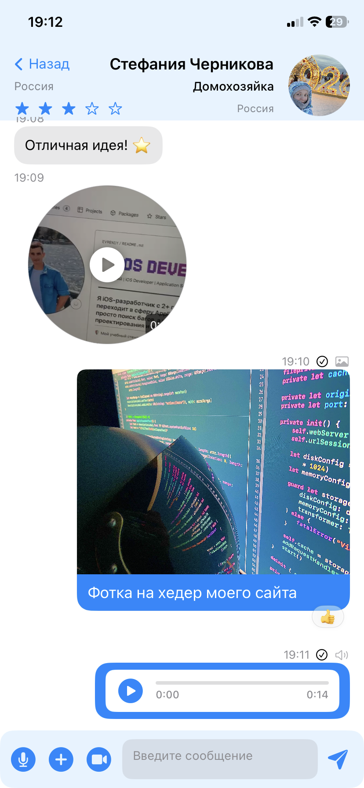

--------

## Поисковик пользователей (расширенный)

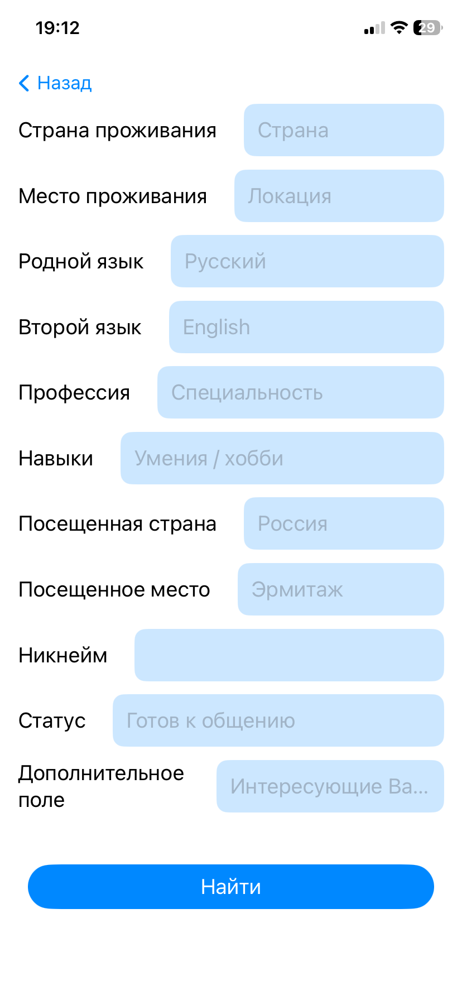

------

## Лента событий 

любой может опубликовать событие в нужном городе
++ поиск событий в нужном городе
лайки, и жалобы - для модерации контента

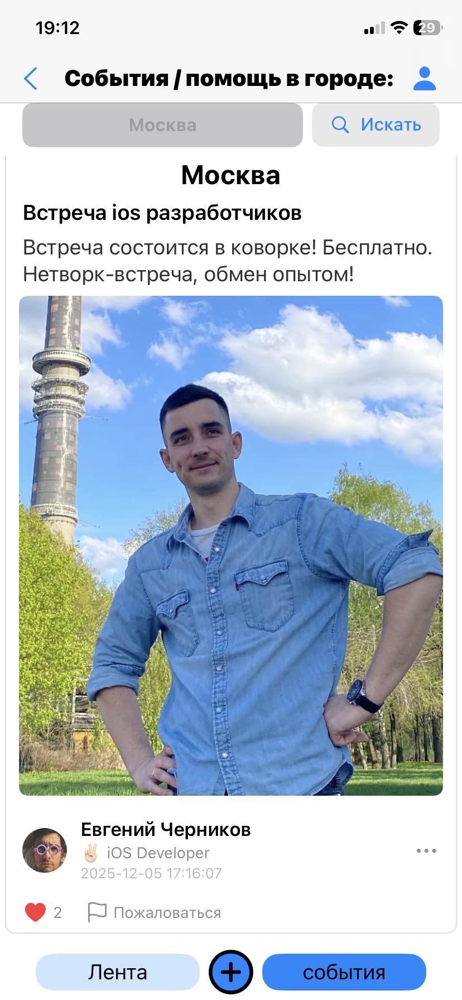

------

## Общая лента (можно делиться целями, достижениями, планами)

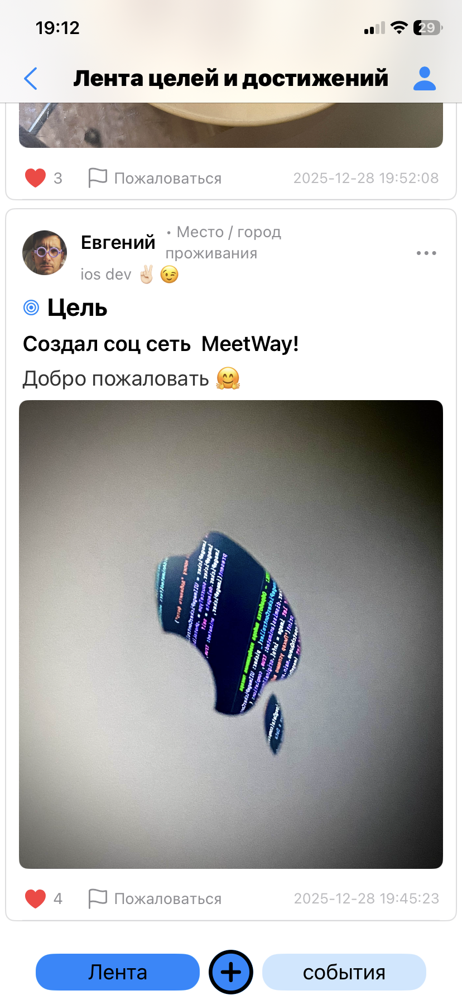

---------

## Мой профиль - вкладка профессии (цвет всего - можно НАСТРОИТЬ)

ячейки можно создавать, передвигать, настраивать им яркость и цвет
++ статус
++ статистика профиля

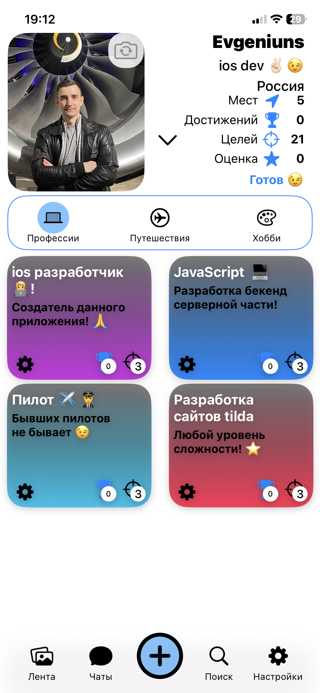

------

## Мой профиль - вкладка путешествия 

можно добавить страны , и посещенные места в странах!
здесь одна страна, и в ней 5 мест

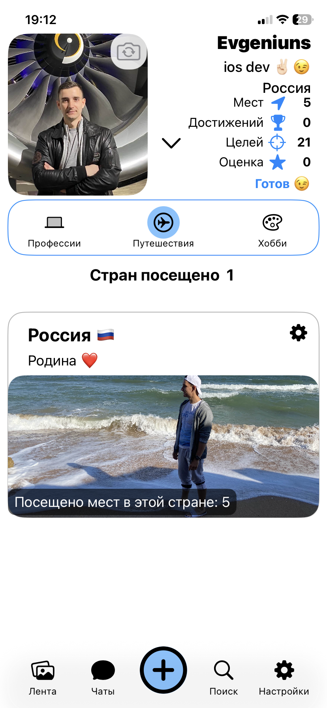

-------------

## Открыл страну, просмотр мест в стране

все в карточках можно редактировать

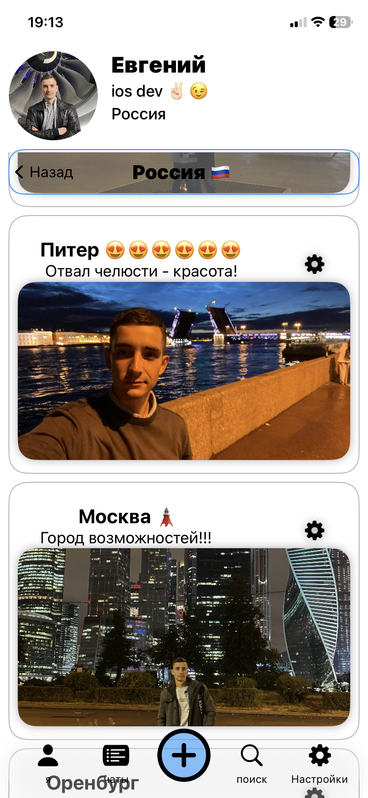

----------
## Мой профиль - вкладка  хобби

ячейки можно создавать, передвигать, настраивать им яркость и цвет
++ статус
++ расширенная статистика профиля (и при просмотре чужого профиля - можно оставить жалобу)

-------

## редактирование карточки (скроллится )

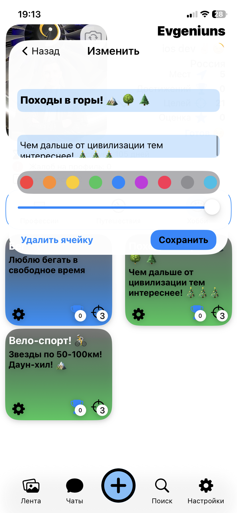

 редактирование карточки (скроллится )

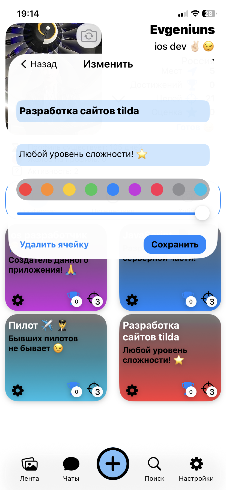

----------

## Экран настроек профиля и внешнего вида приложения

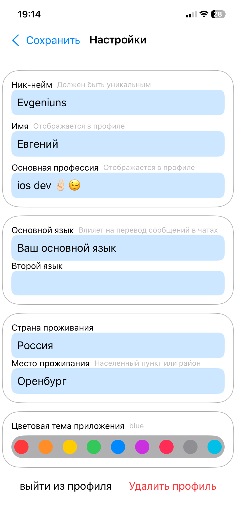

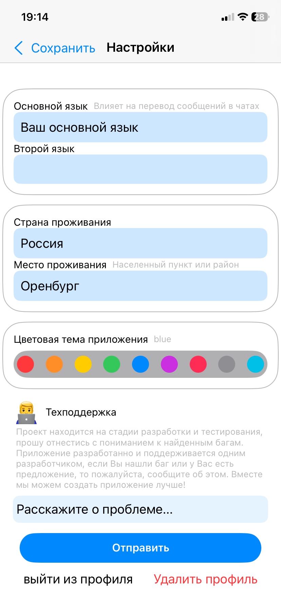

-----

## список всех чатов

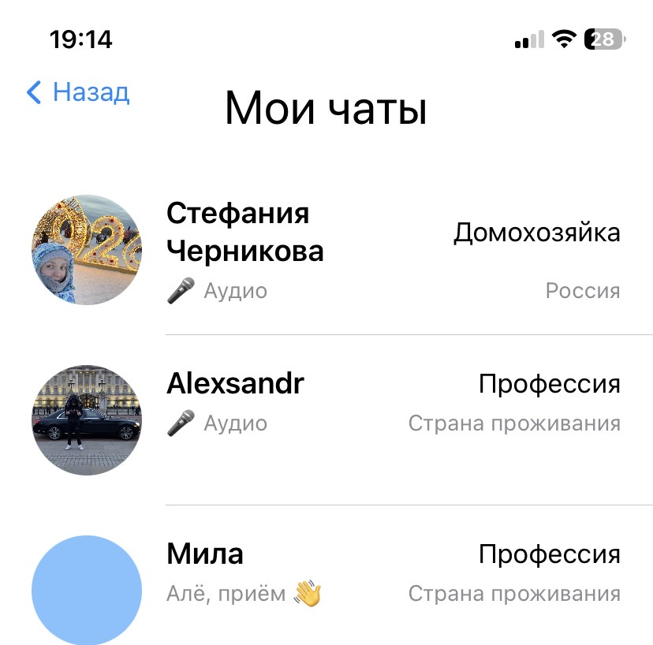

------

## Регистрация и авторизация реализованная только через **OAuth 2.0** используя Яндекс ID

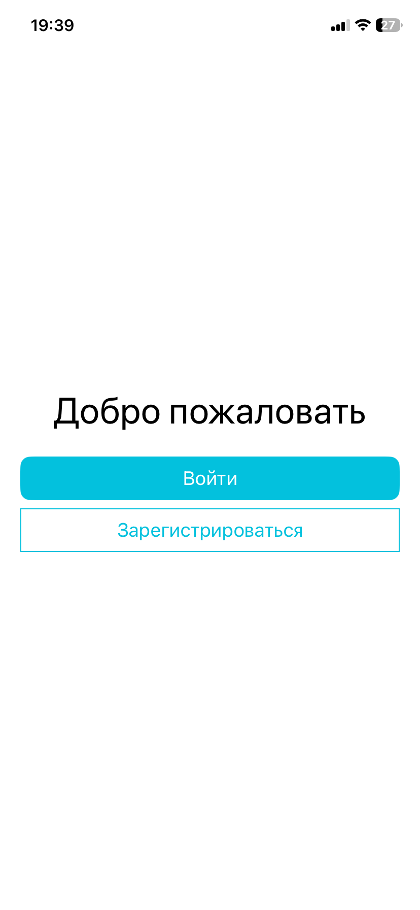

-------------

## создать новый аккаунт

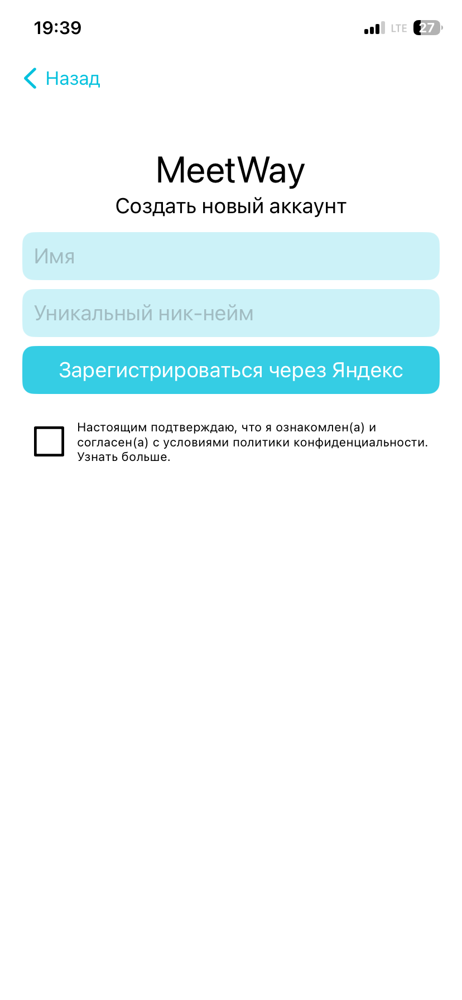

--------

## подтверждение входа, пуш от яндекса, далее авто вход в приложение (пароль не нужно вводить)

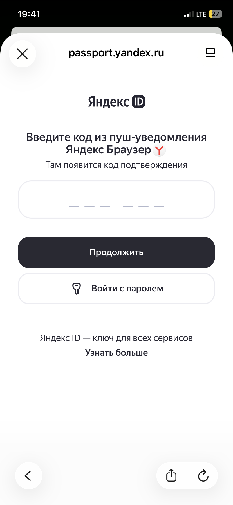

------------