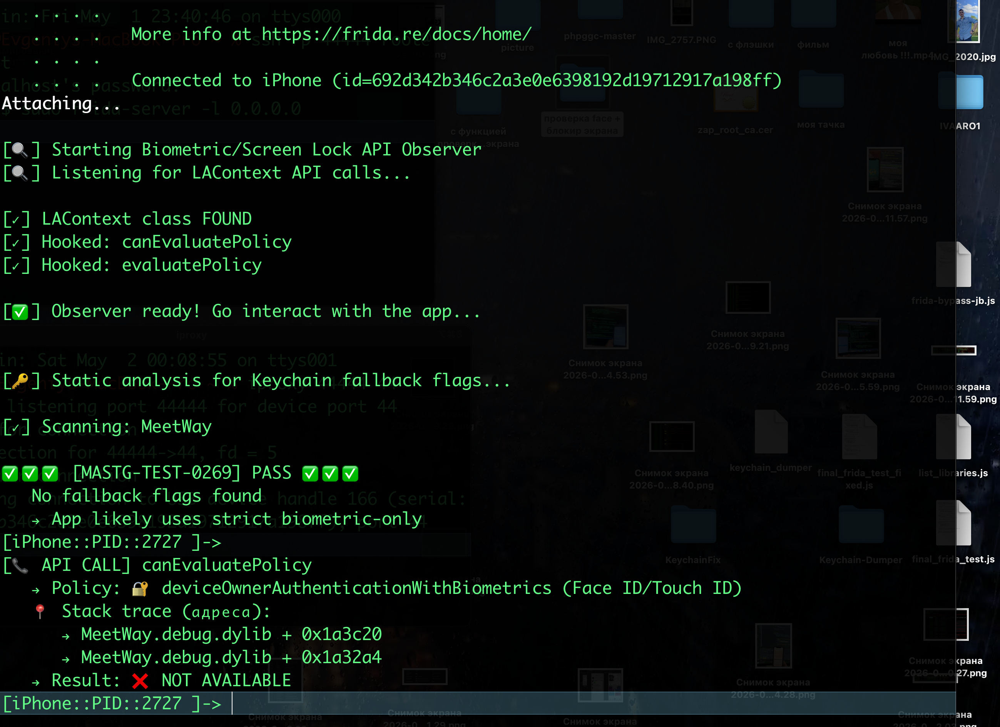

# MASTG-TEST-0269: Runtime Use Of APIs Allowing Fallback to Non-Biometric Authentication


проверяет, не разрешает ли приложение использовать **пароль или PIN-код**устройства вместо биометрии (Face ID/Touch ID) для доступа к особо важным данным. А если и разрешает, то по какой причине

в swift есть такая фича 
`kSecAccessControlUserPresence` или `kSecAccessControlDevicePasscode`
благодаря которой можно сделать, чтобы при неудачном face-id  телефон запросил код-пароль!

первый флаг (`UserPresence`) позволяет системе **самой выбирать**: если биометрия недоступна, она тихо переключается на проверку пароля. Это потенциально менее безопасно для "высокочувствительных" данных (финансы, госуслуги, здоровье), так как пароль подсмотреть или подобрать проще, чем подделать биометрию. Фиксированный флаг `DevicePasscode` явно требует только пароль.

согласно тесту - следует избегать данных флагов и использовать для ОСОБО важных данных только face-id - так как оно надежнее!


----------

- **Тест НЕ ПРОЙДЕН (Fail)**: Приложение **разрешает откат к паролю** (`UserPresence` или `DevicePasscode`) для критичных данных, где это недопустимо.
    
- **Тест ПРОЙДЕН (Pass)**: Приложение использует **строгие биометрические флаги** (`BiometryAny`, а лучше `BiometryCurrentSet`), то есть **требует именно Face ID или Touch ID**без возможности отката к паролю.

-------
если найдены в коде флаги
`kSecAccessControlUserPresence` или `kSecAccessControlDevicePasscode`
значит - можно откатиться к паролю - что, в зависимости от ситуации, может быть вредно

-------

ТЕСТ проводится и статически и динамически 

статический тест я провел вот здесь
[[_L2_SAST_Fallback-Non-Biometric-Auth]]

-----------

динамический тест проведу здесь


#### запускаю фрида

айфон 8 ios 16.7.14 
 palera1n

подрубаю фриду к айфону, там уже все настроено и готово - стоит и фрида и паралель и все че надо
 подробнее о настройке - можно найти в папке `tools`

подрубаю ssh для удобства

перв терминал
`iproxy 44444 44`
второй терминал
`ssh -p 44444 root@localhost`
стандарт пароль: alpine

на айфоне - сервер фриды
`sudo frida-server -l 0.0.0.0 `
Пароль: alpine

и после ввода пароля - терминал завис, типо это так и должно быть
и его нужно просто свернуть, но не закрывать

теперь на маке подкл
`frida-ps -H 192.168.0.107`


ЗАПУСКАЮ ПРИЛОЖЕНИЕ НА АЙФОНЕ

нахожу бандл айди или  pid

`frida-ps -Uai`
MeetWay         AIVARO22-2025-1.0
2078   MeetWay

или    frida-ps -Ua
i | grep MeetWay


готовлю скрипт 


```js
cat > ~/block-setup-ssl.js << 'ENDOFSCRIPT'

console.log("\n[🔍] Starting Biometric/Screen Lock API Observer");
console.log("[🔍] Listening for LAContext API calls...\n");

try {
    var LAContext = ObjC.classes.LAContext;
    
    if (LAContext) {
        console.log("[✓] LAContext class FOUND");
        
        // Hook canEvaluatePolicy
        var canEvaluate = LAContext["- canEvaluatePolicy:error:"];
        Interceptor.attach(canEvaluate.implementation, {
            onEnter: function(args) {
                var policy = args[2].toInt32();
                var policyName = {
                    1: "🔐 deviceOwnerAuthenticationWithBiometrics (Face ID/Touch ID)",
                    2: "📱 deviceOwnerAuthentication (passcode/biometrics)",
                    3: "⌚️ deviceOwnerAuthenticationWithWatch"
                }[policy] || `unknown(${policy})`;
                
                console.log(`\n[📞 API CALL] canEvaluatePolicy`);
                console.log(`   → Policy: ${policyName}`);
                
                console.log("   📍 Stack trace (адреса):");
                var trace = Thread.backtrace(this.context, Backtracer.ACCURATE);
                for (var i = 0; i < Math.min(trace.length, 5); i++) {
                    var addr = trace[i];
                    var module = Process.findModuleByAddress(addr);
                    if (module && module.name.indexOf("MeetWay") !== -1) {
                        var offset = addr.sub(module.base);
                        console.log(`      → ${module.name} + 0x${offset.toString(16)}`);
                    }
                }
            },
            onLeave: function(retval) {
                var result = retval.toInt32() ? "✅ AVAILABLE" : "❌ NOT AVAILABLE";
                console.log(`   → Result: ${result}`);
            }
        });
        console.log("[✓] Hooked: canEvaluatePolicy");
        
        // Hook evaluatePolicy
        var evaluate = LAContext["- evaluatePolicy:localizedReason:reply:"];
        Interceptor.attach(evaluate.implementation, {
            onEnter: function(args) {
                var policy = args[2].toInt32();
                var reason = ObjC.Object(args[3]);
                console.log(`\n[🔐 BIOMETRIC AUTH] evaluatePolicy called!`);
                console.log(`   → Policy: ${policy == 2 ? 'deviceOwnerAuthentication' : 'biometrics'}`);
                console.log(`   → Reason: "${reason}"`);
            }
        });
        console.log("[✓] Hooked: evaluatePolicy");
        
        console.log("\n[✅] Observer ready! Go interact with the app...\n");
    } else {
        console.log("[❌] LAContext not found");
    }
    
    // ============================================
    // СТАТИЧЕСКИЙ ПОИСК ФЛАГОВ  - потому что такова жизнь ёпта
  
    console.log("\n[🔑] Static analysis for Keychain fallback flags...\n");
    
    var modules = Process.enumerateModules();
    var targetModule = null;
    
    // Ищем модуль приложения
    for (var i = 0; i < modules.length; i++) {
        if (modules[i].name.indexOf("MeetWay") !== -1 || 
            modules[i].name.indexOf(".debug") !== -1 ||
            modules[i].path.indexOf("AIVARO") !== -1) {
            targetModule = modules[i];
            break;
        }
    }
    
    if (!targetModule) {
        targetModule = Process.findModuleByName("MeetWay");
    }
    
    if (targetModule) {
        console.log("[✓] Scanning: " + targetModule.name);
        
        var flagsFound = [];
        var patterns = ["kSecAccessControlUserPresence", "kSecAccessControlDevicePasscode"];
        
        for (var p = 0; p < patterns.length; p++) {
            try {
                var matches = Memory.scanSync(targetModule.base, targetModule.size, patterns[p]);
                if (matches.length > 0) {
                    flagsFound.push(patterns[p]);
                }
            } catch(e) {
              
            }
        }
        
        if (flagsFound.length > 0) {
            console.log("\n🚨🚨🚨 [MASTG-TEST-0269] FAIL 🚨🚨🚨");
            console.log("   Found: " + flagsFound.join(", "));
            console.log("   → App allows fallback to device passcode");
        } else {
            console.log("\n✅✅✅ [MASTG-TEST-0269] PASS ✅✅✅");
            console.log("   No fallback flags found");
            console.log("   → App likely uses strict biometric-only");
        }
    } else {
        console.log("[⚠️] Could not find app module, trying all...");
        var found = false;
        for (var i = 0; i < modules.length && !found; i++) {
            try {
                var matches = Memory.scanSync(modules[i].base, modules[i].size, "UserPresence");
                if (matches.length > 0) {
                    console.log("\n🚨 [FAIL] Found 'UserPresence' in " + modules[i].name);
                    found = true;
                }
            } catch(e) {}
        }
        if (!found) {
            console.log("\n✅ [PASS] No fallback flags detected");
        }
    }
    

    
} catch(e) {
    console.log(`[❌] Error: ${e.message}`);
}

ENDOFSCRIPT
```
подсасываюсь к процессу приложения 

`frida -U 2727 -l ~/block-setup-ssl.js`

результаты:
```c
[✓] LAContext class FOUND
[✓] Hooked: canEvaluatePolicy
[✓] Hooked: evaluatePolicy

[✅] Observer ready! Go interact with the app...


[🔑] Static analysis for Keychain fallback flags...

[✓] Scanning: MeetWay

✅✅✅ [MASTG-TEST-0269] PASS ✅✅✅
   No fallback flags found
   → App likely uses strict biometric-only
[iPhone::PID::2727 ]->
[📞 API CALL] canEvaluatePolicy
   → Policy: 🔐 deviceOwnerAuthenticationWithBiometrics (Face ID/Touch ID)
   📍 Stack trace (адреса):
      → MeetWay.debug.dylib + 0x1a3c20
      → MeetWay.debug.dylib + 0x1a32a4
   → Result: ❌ NOT AVAILABLE
[iPhone::PID::2727 ]->
```




Итого можно сделать вывод о том что биометрия через Face ID в моем приложении используются для доступа к чатам, до при этом не используются "опасные" атрибуты которые могут вместо Face ID разрешить откат к паролю, поэтому тест считается пройдённым!

```q
В рантайме приложение использует `LAContext` для аутентификации
 Статический анализ памяти не обнаружил флагов 
  `kSecAccessControlUserPresence` или `kSecAccessControlDevicePasscode`

Отсутствие данных флагов означает, что приложение не разрешает откат 
к паролю устройства при недоступности биометрии

Вывод: Приложение корректно использует строгую биометрическую 
аутентификацию без возможности ослабления защиты через пароль
```