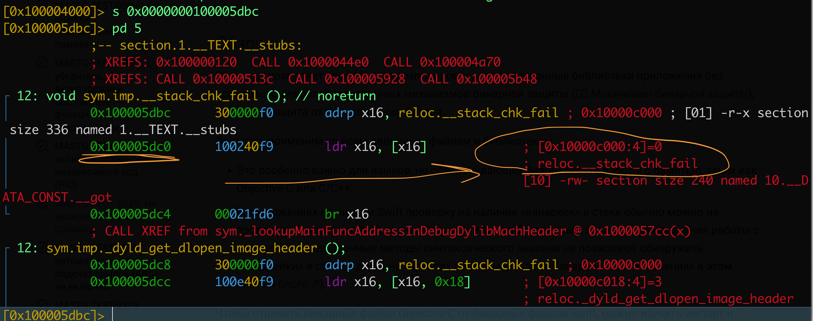
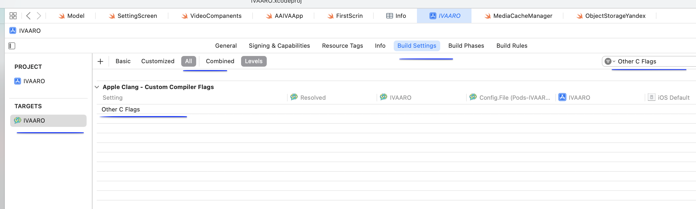

# MASTG-TEST-0229: 
Stack Canaries включены или нет

(стековые канарейки) - это защита от переполнения буфера в стеке

-------
>  Как работает: компилятор перед вызовом функции кладет в стек специальное случайное значение (канарейку). Перед возвратом из функции проверяет это значение, -если канарейка изменилась, значит кто-то переполнил буфер и затер её. Тогда программа аварийно завершается вместо того, чтобы позволить злоумышленнику выполнить свой код

>Если канарейки выключены - атакующий может переполнить буфер на стеке, перетереть адрес возврата и перехватить управление

Например, если моё приложение парс какие-либо данные на C или C+ , если канарейки выключены, то это плохо, так как можно сделать эксплойт

**Опасно для:** C, C++, Objective-C (так как там  ручное управление памятью)

**Безопасно:** Swift (если в коде нет C/C++ библиотек или unsafe конструкций типа `UnsafePointer`)

------

Почему может так случиться, что канарейки выключены:
```c
---Разработчик специально вырубил флаг ради производительности (редко, но бывает) 
---Старая кодовая база, где не знали про защиту
---Легаси-библиотеки, собранные без флагов
---Компилятор вырезал канарейки при оптимизации (если функция слишком простая и не имеет буферов) 
---Flutter/Dart приложения - у них своя защита от переполнений
---React Native -  иногда компилятор вырезает канарейки при оптимизации (-fstack-protector-strong вместо -all)
```
поэтому, нужно проверить во всяком случае!

-----
приступаю к тесту

тестирование на приложении MeetWay
👉 (о приложении) [[0_MeetWay]]

Так как подписки Apple Developer у меня сейчас нет, поэтому я просто через Xcode установил приложение на телефон потыкал его, и теперь в папке Delivery Data я могу найти файлы моего приложения здесь

~/Library/Developer/Xcode/DerivedData/

 И там нахожу в билдах моего приложения нужного бинарник он будет называться также как название приложения с расширением.app, ну и весить много, а внутри бинарщина

-------
Перекинул на рабочий стол бинарник MeetWay.app

открываю папку
```q
cd /Users/evgeniy/Desktop/MeetWay.app

и смотрю, че там по файлам внутри есть (для инфы, чтобы понять, что попал по адрессу)
```

для понимания, где нахожусь и че внутри!

```c
evgeniy@Evgeniys-MacBook-Pro MeetWay.app % ls -la
total 124904
-rwxr-xr-x   1 evgeniy  staff     35024  9 апр 10:07 __preview.dylib
drwxr-xr-x   3 evgeniy  staff        96  7 апр 00:34 _CodeSignature
drwxr-xr-x@ 17 evgeniy  staff       544 14 апр 13:51 .
drwx------@ 39 evgeniy  staff      1248 14 апр 22:10 ..
-rw-r--r--@  1 evgeniy  staff         0 11 апр 10:39 aaaa
-rw-r--r--   1 evgeniy  staff     14412  7 апр 01:18 AppIcon60x60@2x.png
-rw-r--r--   1 evgeniy  staff     19132  7 апр 01:18 AppIcon76x76@2x~ipad.png
-rw-r--r--   1 evgeniy  staff  22615696  7 апр 01:19 Assets.car
-rw-r--r--   1 evgeniy  staff     15136  7 апр 00:25 embedded.mobileprovision
drwxr-xr-x  27 evgeniy  staff       864  7 апр 00:34 Frameworks
-rw-r--r--   1 evgeniy  staff       996  7 апр 00:25 GoogleService-Info.plist
-rw-r--r--@  1 evgeniy  staff      5458 14 апр 13:51 Info_readable.plist
-rw-r--r--   1 evgeniy  staff      3717  7 апр 00:26 Info.plist
-rwxr-xr-x   1 evgeniy  staff     91664  9 апр 10:07 MeetWay
-rwxr-xr-x   1 evgeniy  staff  41070784  9 апр 10:07 MeetWay.debug.dylib
-rw-r--r--   1 evgeniy  staff         8  7 апр 00:26 PkgInfo
-rw-r--r--   1 evgeniy  staff     49852  7 апр 00:25 words.txt
```


## как провести тест:

нужно проверить бинарник на __stack_chk_fail
если есть __stack_chk_fail - значит - все окей!
### базовые команды проверки (рекурсивно по всем библиотекам)

###### Проверка главного бинарника

`nm -u ~/Desktop/MeetWay.app/MeetWay | grep stack_chk_fail`

---
###### Команда 2: Проверка всех .dylib и .framework (рекурсивно)

`find ~/Desktop/MeetWay.app -name "*.dylib" -o -name "*.framework" -type d | while read lib; do echo "=== $lib ==="; nm -u "$lib" 2>/dev/null | grep stack_chk_fail; done`

---
###### Команда 3: Проверка всех Mach-O файлов (включая скрытые)

`find ~/Desktop/MeetWay.app -type f -perm +111 -exec sh -c 'file "$0" | grep -q Mach-O && echo "=== $0 ===" && nm -u "$0" 2>/dev/null | grep stack_chk_fail' {} \;`

---
###### Команда 4: Альтернативная проверка через otool (для главного бинарника)

`otool -Iv ~/Desktop/MeetWay.app/MeetWay | grep stack_chk_fail`

-----
#### результаты теста

```q
evgeniy@Evgeniys-MacBook-Pro MeetWay.app % nm -u ~/Desktop/MeetWay.app/MeetWay | grep stack_chk_fail
___stack_chk_fail 👈 ✅ найдено!


---------
find ~/Desktop/MeetWay.app -name "*.dylib" -o -name "*.framework" -type d | while read lib; do echo "=== $lib ==="; nm -u "$lib" 2>/dev/null | grep stack_chk_fail; done
=== /Users/evgeniy/Desktop/MeetWay.app/MeetWay.debug.dylib ===
___stack_chk_fail   👈 ✅ найдено!

------

find ~/Desktop/MeetWay.app -type f -perm +111 -exec sh -c 'file "$0" | grep -q Mach-O && echo "=== $0 ===" && nm -u "$0" 2>/dev/null | grep stack_chk_fail' {} \;
=== /Users/evgeniy/Desktop/MeetWay.app/MeetWay ===
___stack_chk_fail  👈 ✅ найдено много где, там около 20 мест в framework!

----------

 otool -Iv ~/Desktop/MeetWay.app/MeetWay | grep stack_chk_fail
 0x0000000100005dbc    72 ___stack_chk_fail 👈 ✅ конкретные адреса, где находится
0x000000010000c000    72 ___stack_chk_fail 👈 ✅ конкретные адреса, где находится
```

на данном этапе можно 100% сказать, что тест полностью пройден!
так как надены `___stack_chk_fail`


-------
но ради интереса:

запущу радар 
`r2 -A ~/Desktop/MeetWay.app/MeetWay`

```c
s 0x0000000100005dbc
pd 5
```




ради интереса провалился в 0x100005dc0

в каждой строке есть ` __stack_chk_fail`

Присутствие символа `__stack_chk_fail` в импортах  ==  защита включена

```bash
[0x100004000]> s 0x0000000100005dbc
[0x100005dbc]> pd 5
            ;-- section.1.__TEXT.__stubs:
            ; XREFS: 0x100000120  CALL 0x1000044e0  CALL 0x100004a70
            ; XREFS: CALL 0x10000513c  CALL 0x100005928  CALL 0x100005b48
┌ 12: void sym.imp.__stack_chk_fail (); // noreturn
│           0x100005dbc      300000f0       adrp x16, reloc.__stack_chk_fail ; 0x10000c000 ; [01] -r-x section size 336 named 1.__TEXT.__stubs
│           0x100005dc0      100240f9       ldr x16, [x16]             ; [0x10000c000:4]=0
│                                                                      ; reloc.__stack_chk_fail
│                                                                      [10] -rw- section size 240 named 10.__DATA_CONST.__got
└           0x100005dc4      00021fd6       br x16
            ; CALL XREF from sym._lookupMainFuncAddressInDebugDylibMachHeader @ 0x1000057cc(x)
┌ 12: sym.imp._dyld_get_dlopen_image_header ();
│           0x100005dc8      300000f0       adrp x16, reloc.__stack_chk_fail ; 0x10000c000
│           0x100005dcc      100e40f9       ldr x16, [x16, 0x18]       ; [0x10000c018:4]=3
│                                                                      ; reloc._dyld_get_dlopen_image_header
[0x100005dbc]> px 32
- offset -   BCBD BEBF C0C1 C2C3 C4C5 C6C7 C8C9 CACB  CDEF0123456789AB
0x100005dbc  3000 00f0 1002 40f9 0002 1fd6 3000 00f0  0.....@.....0...
0x100005dcc  100e 40f9 0002 1fd6 3000 00f0 1012 40f9  ..@.....0.....@.
[0x100005dbc]> 0x100005dc0
[0x100005dc0]> pd
│           0x100005dc0      100240f9       ldr x16, [x16]             ; [0x10000c000:4]=0
│                                                                      ; reloc.__stack_chk_fail
│                                                                      [10] -rw- section size 240 named 10.__DATA_CONST.__got
└           0x100005dc4      00021fd6       br x16
            ; CALL XREF from sym._lookupMainFuncAddressInDebugDylibMachHeader @ 0x1000057cc(x)
┌ 12: sym.imp._dyld_get_dlopen_image_header ();
│           0x100005dc8      300000f0       adrp x16, reloc.__stack_chk_fail ; 0x10000c000
│           0x100005dcc      100e40f9       ldr x16, [x16, 0x18]       ; [0x10000c018:4]=3
│                                                                      ..... сократил
│                                                                      ; reloc.os_log_create
└           0x100005ea8      00021fd6       br x16
            ; XREFS: CALL 0x10000406c  CODE 0x100005c54  CODE 0x100005c64  CODE 0x100005c7c  CODE 0x100005c8c
            ; XREFS: CODE 0x100005c98  CODE 0x100005cb4  CODE 0x100005cc0  CODE 0x100005ce4  CODE 0x100005cec
┌ 12: sym.imp.os_log_type_enabled ();
│           0x100005eac      300000f0       adrp x16, reloc.__stack_chk_fail ; 0x10000c000
│           0x100005eb0      105a40f9       ldr x16, [x16, 0xb0]       ; [0x10000c0b0:4]=22
│                                                                      ; reloc.os_log_type_enabled
└           0x100005eb4      00021fd6       br x16
            ; CALL XREF from main @ 0x100004114(x)
┌ 12: int sym.imp.printf (const char *format);
│           0x100005eb8      300000f0       adrp x16, reloc.__stack_chk_fail ; 0x10000c000
│           0x100005ebc      105e40f9       ldr x16, [x16, 0xb8]       ; [0x10000c0b8:4]=23
│                                                                      ; reloc.printf
[0x100005dc0]>
```

в каждой строке есть ` __stack_chk_fail`

Присутствие символа `__stack_chk_fail` в импортах  ==  защита включена


-----

быстрая проверка через xcode

таргет - all -  в поиск: Other C Flags
 если даже эта строчка пустая то все равно по молчанию защита включена, что я и подтвердил я эти флаги в бинарнике




в этот флаг, в теории , можно вписывать разные атрибуты:

```q
1 Стековые канарейки (разные уровни):

-fstack-protector - базовый, защищает только функции с массивами символов
    
-fstack-protector-strong - расширенный, защищает также функции с локальными массивами, указателями на стеки и т.д. (рекомендую)
    
-fstack-protector-all - защищает все функции (может быть небольшой оверхед по производительности)
    
-------------

2 Fortify source (защита от переполнений строк):

-D_FORTIFY_SOURCE=2 - проверяет границы при вызовах типа strcpy, sprintf и т.д.
      
--------------------    

3 ASLR для бинарника (PIE):

 -fpie - генерирует позиционно-независимый код
   
-pie - включает PIE для исполняемого файла
    

---------------

 Для дебага и обратной разработки

4 Отключение оптимизаций (чтобы легче реверсить):

-O0 - без оптимизаций
    
-g - включает отладочную информацию (символы)
    

5 Формат записей:

-gdwarf-2 или -gdwarf-4 - формат отладочной информации
```


