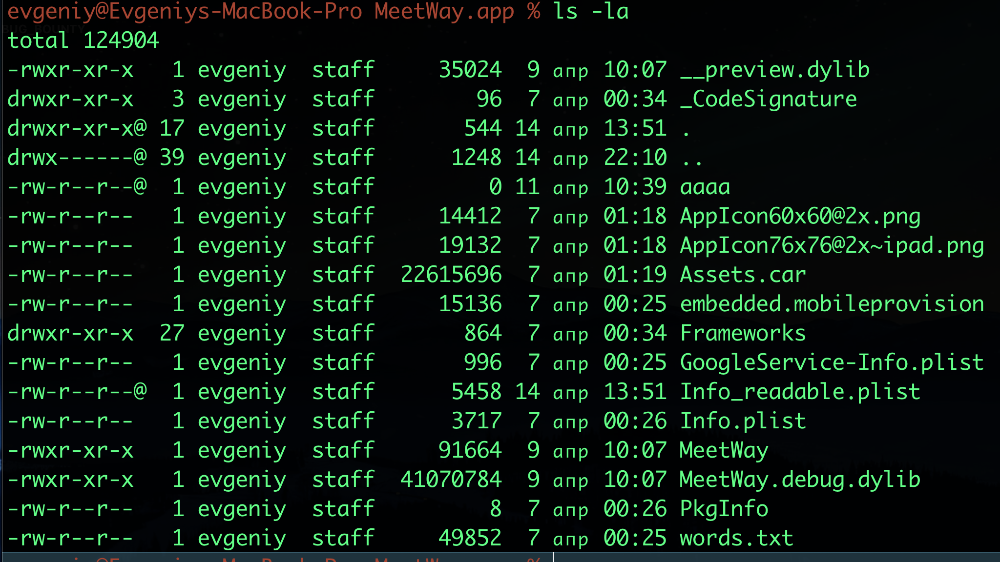
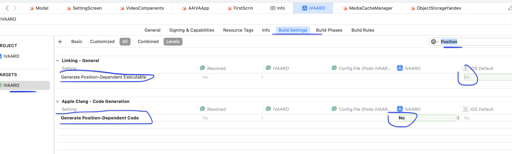

# MASTG-TEST-0228: 
Position Independent Code (PIC) not Enabled

PIC (Position Independent Code) или PIE (Position Independent Executable) - это когда главный бинарник приложения можно загрузить в случайный участок памяти, а не по фиксированному адресу. 
    Без PIC бинарник всегда садится на один и тот же адрес (например, 0x100000000). С PIC = на случайный, и злоумышленнику нужно будет оч долго искать

Это защита от атак типа ROP (Return Oriented Programming) и переиспользования кода. Злоумышленник не может заранее знать, где лежат нужные ему куски кода или библиотек, потому что адрес каждый раз разный

**По умолчанию PIC/PIE ВСЕГДА включен

В Xcode эти настройки называются:

1. `Generate Position-Dependent Code` - должен быть NO
    
2. `Don't Create Position Independent Executables` - должен быть NO

(по умолчанию - все работает, но вдруг пришлось вырубить , так как может лайба какая-то ругалась... поэтому нужно бы проверить )

-------

**К чему приводит отсутствие PIC**

Если PIC выключен, атакующий на джейлбрейкнутом устройстве может:

- Точно знать адреса функций в памяти
- Построить ROP-цепочку для выполнения своего кода
- Обойти ASLR (рандомизацию адресного пространства) для главного бинарника

------------

На практике: если у тебя есть уязвимость типа переполнения буфера в нативном коде (C/C++/ObjC рантайм), без PIC её эксплуатировать намного проще. С PIC - сложнее, но не невозможно-

-----

Apple требует PIE для всех приложений в App Store с 2015 года (iOS 6). Если у  PIC выключен - приложение даже не пропустят в стор. Но для легаси-приложений или корпоративных (enterprise) может встречаться

-------


#### **как тестить: SAST, DAST

⭕️ SAST (статический анализ):

- смотреть в бинарнике
- Проверять флаги компиляции в Xcode проекте (если есть исходники)
--------


#### способы проверок

1. извлека/ бинарник из .ipa:  
    `unzip app.ipa -d app_unpacked`  
    Главный бинарник лежит в `Payload/AppName.app/AppName` 
    (имя как у приложения)

2. смотрим PIC через otool :  
    `otool -l /path/to/binary | grep -A4 LC_ENCRYPTION_INFO | grep cryptid`  
    Но для PIC лучше:
`otool -l /path/to/binary | grep -A3 LC_UUID`  

Или прямо:  
`otool -l /path/to/binary | grep PIE`  

Если там есть `MH_PIE`  включено (включено - отлично! так и нужно)

3.  простой способ:  
    `otool -Vh /path/to/binary | grep PIE`  
    Если ничего не вывело - PIC выключен (тест провален)
    
4. Альтернатива через vtool :  
    `vtool -show /path/to/binary`
    
5. Через jtool:  
    `jtool -arch all -l /path/to/binary | grep PIE`


--------

приступаю к тесту

тестирование на приложении MeetWay
👉 (о приложении) [[0_MeetWay]]

Так как подписки Apple Developer у меня сейчас нет, поэтому я просто через Xcode установил приложение на телефон потыкал его, и теперь в папке Delivery Data я могу найти файлы моего приложения здесь

~/Library/Developer/Xcode/DerivedData/

 И там нахожу в билдах моего приложения нужного бинарник он будет называться также как название приложения с расширением.app, ну и весить много, а внутри бинарщина

-------
Перекинул на рабочий стол бинарник MeetWay.app

открываю папку
```q
cd /Users/evgeniy/Desktop/MeetWay.app

и смотрю, че там по файлам внутри есть (для инфы, чтобы понять, что попал по адрессу)
```




далее выполняю поиск атрибута нужного

```bash
otool -Vh ~/Desktop/MeetWay.app/MeetWay | grep PIE
```

и получаю вот такой ответ
```c
MH_MAGIC_64    ARM64        ALL  0x00     EXECUTE    24       1992   NOUNDEFS DYLDLINK TWOLEVEL PIE
```

PIE - стоит! так и должно быть, тест пройден! уязвимость отсутствует
**PIE** есть в списке флагов!


-----

быстрая проверка через xcode
таргет - билд натсройк - Generate Position
должно стоять все в NO





----
