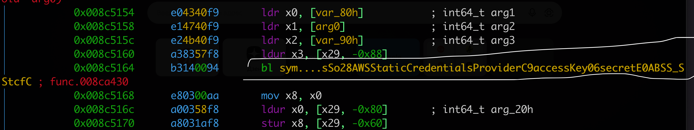
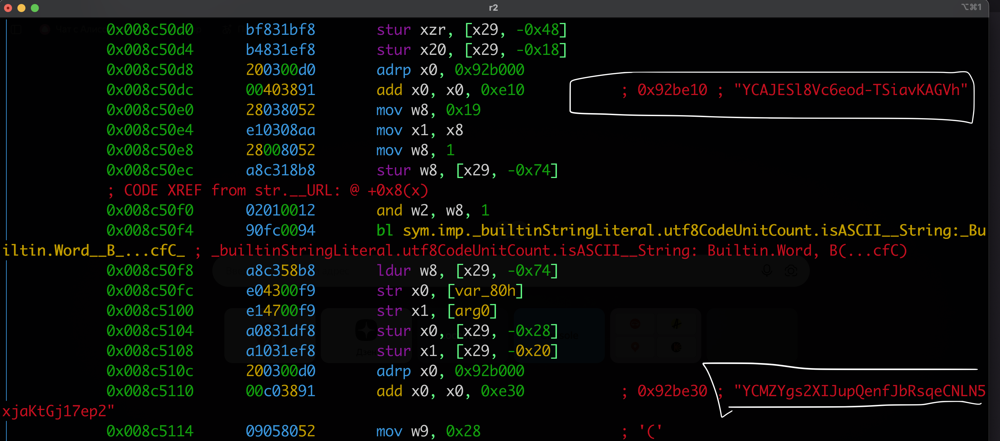
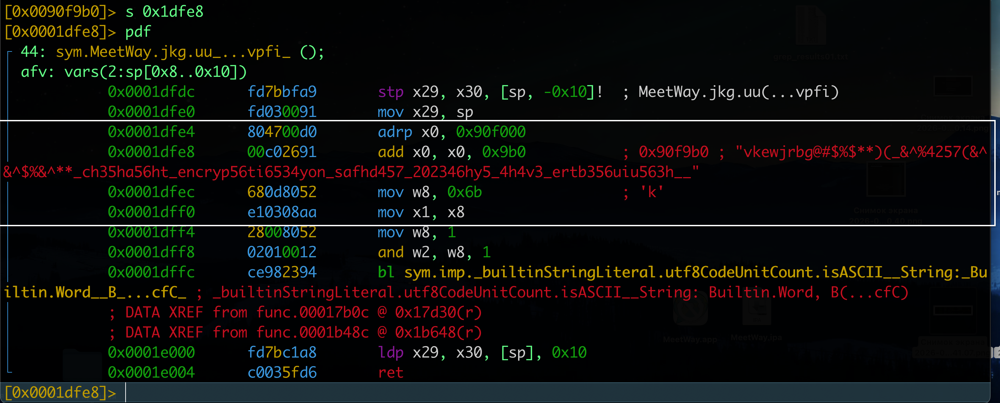
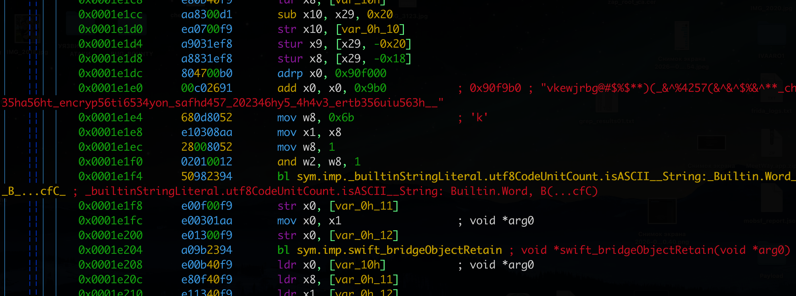
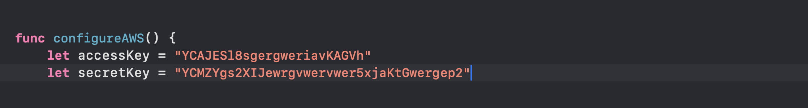

# MASTG-TEST-0209
#### Insufficient Key Sizes

Этот тест проверяет использование криптографических ключей недостаточной длины (например, RSA 1024 бита или AES 128 бит, что уже небезопасно с учетом квантовых атак)

```q
|Алгоритм|Недостаточный размер|Почему|

RSA  -  1024 бита и меньше
Ломается за несколько часов на обычном оборудовании

AES  -  128 бит
С учетом квантовых атак - уже небезопасно 
(эффективная стойкость 64 бита)

ECC  -  160 бит и меньше 
Слабые кривые, уязвимые для атак
```


---------
проверку буду выполнять тестируя приложение MeetWay [[0_MeetWay]]

------

Тест считается проваленным, если в исходном коде используется ключ недостаточного размера. Например, 1024-битный ключ считается недостаточным для шифрования RSA, а 128-битный ключ - недостаточным для шифрования AES с учетом атак с использованием квантовых вычислений

--------

тест можно выполнять  с помощью radar2 или c Frida

-----

###### выполняю проверку на бинарнике через radar2, тест - [[0_MeetWay]]

открываю бинарник
```bash
cd ~/Desktop/MeetWay.app

# смотрю все файлы что там есть
ls -la

# иду в папку   debug

r2 ./MeetWay.debug.dylib
```

делаю полный анализ
```bash
[0x00000000]> aaaa
```

и теперь запускаю поиск по ключевым словам
```q

# (Симметричное шифрование)
# Основная функция шифрования
/ CCCrypt

# Вспомогательные функции и константы
/ kCCKeySizeAES128
/ kCCKeySizeAES192
/ kCCKeySizeAES256
/ kCCKeySizeDES
/ kCCKeySize3DES

# Асиььетричное
# Генерация ключей (актуально)
/ SecKeyCreateRandomKey

# Атрибуты размера ключа
/ kSecAttrKeySizeInBits
/ kSecAttrKeyType

# Депрекейтед, но может встречаться
/ SecKeyGeneratePair
/ SecKeyGeneratePairAsync
/ SecKeyGenerate

# KryptoKir
/ SymmetricKey
/ .bits256
/ .bits128
/ AES.GCM
/ ChaChaPoly
/ P256
/ P384
/ P521


# PBKDF2 ключи с паролей

/ CCKeyDerivationPBKDF
/ kCCPBKDF2
/ rounds
/ keyByteCount

# библиотеки

# OpenSSL
/ RSA_generate_key
/ AES_set_encrypt_key

# LibSodium
/ crypto_aead_aes256gcm_keygen
/ crypto_box_keypair

# CryptoSwift
/ AES.init
/ AES128

-----------------
ОДНИМ РАЗОМ ВСЕ


# Базовый анализ
[0x00004000]> aaaa

# Поиск криптографических функций
/ CCCrypt
/ CC_SHA1
/ CC_SHA256
/ CC_SHA384
/ CC_SHA512
/ CC_MD5
/ CC_MD4
/ CC_MD2
/ CCHmac
/ CCHmacInit
/ CCHmacUpdate
/ CCHmacFinal
/ CCKeyDerivationPBKDF
/ CCCryptorCreate
/ CCCryptorUpdate
/ CCCryptorFinal
/ SecKeyGeneratePair
/ SecKeyCreateRandomKey
/ SecKeyCreateWithData
/ SecKeyEncrypt
/ SecKeyDecrypt
/ SecKeyRawSign
/ SecKeyRawVerify
/ SecItemAdd
/ SecItemCopyMatching
/ SecItemUpdate
/ SecItemDelete
/ SecRandomCopyBytes
/ kCCKeySizeAES128
/ kCCKeySizeAES192
/ kCCKeySizeAES256
/ kCCKeySizeDES
/ kCCKeySize3DES
/ kSecAttrKeySizeInBits
/ kSecAttrKeyTypeRSA
/ kSecAttrKeyTypeEC
/ kSecAttrKeyTypeECSECPrimeRandom
/ AES
/ RSA
/ ECC
/ SHA
/ MD5
/ PBKDF2
/ HMAC

# Поиск констант размеров ключей
/ 128
/ 192
/ 256
/ 1024
/ 2048
/ 3072
/ 4096

# Поиск строковых ключей и солей
/ kkr15
/ secret
/ key
/ salt
/ iv
/ nonce
/ private
/ public
/ pem
/ cert
/ password
/ token
/ jwt
/ api_key
/ secret_key
/ access_key
/ refresh_token

# Импорты из Security и CommonCrypto
ii | grep -i Security
ii | grep -i CommonCrypto
ii | grep -i Crypto
ii | grep -i crypt
ii | grep -i aes
ii | grep -i rsa
ii | grep -i sha
ii | grep -i md5

# Все строки с крипто-ключевыми словами
izz | grep -i "secret\|key\|salt\|iv\|nonce\|token\|jwt"
izz | grep -i "encrypt\|decrypt\|cipher\|aes\|rsa\|ecc"
izz | grep -i "private\|public\|cert\|pem\|p12"
```

```q
# смотрю все файлы что там есть
ls -la

# Секции бинарника
[0x00004000]> iS

# Информация о файле
[0x00004000]> i

# Выйти
[0x00004000]> q
```

если строки читаются - то можно и так
```q
cd ~/Desktop/MeetWay.app

# Поиск крипто-символов в бинарнике
strings MeetWay.debug.dylib | grep -iE "CCCrypt|CC_SHA|SecKey|kCCKeySize|kSecAttrKeySize|AES|RSA|ECC|SHA|MD5|PBKDF|HMAC" | sort -u

# Поиск размеров ключей
strings MeetWay.debug.dylib | grep -iE "128|192|256|1024|2048|3072|4096" | grep -iE "key|size|bit" | sort -u

# Поиск хардкод строк
strings MeetWay.debug.dylib | grep -iE "kkr15|secret|private|public|api_key|token|jwt|password|salt|iv|nonce" | sort -u
```


##### результаты тестов

```q
# Поиск криптографических функций (то что нашел)
 SecItemAdd
0x00a73b2e hit23_0 .DescriptionKey_SecItemAdd_SecItemCopyMat.
0x00d6cbce hit23_1 .12_SwiftObject_SecItemAdd_SecItemCopyMat.
0x00a6bb2e hit23_2 .DescriptionKey_SecItemAdd_SecItemCopyMat.
[0x00004000]> / SecItemCopyMatching
0x00a73b3a hit24_0 .ey_SecItemAdd_SecItemCopyMatching_SecItemDelete.
0x00d6cbda hit24_1 .ct_SecItemAdd_SecItemCopyMatching_SecItemDelete.
0x00a6bb3a hit24_2 .ey_SecItemAdd_SecItemCopyMatching_SecItemDelete.
[0x00004000]> / SecItemUpdate
0x00a73b5e hit25_0 ._SecItemDelete_SecItemUpdate_SecRandomCopyB.
0x00d6cbfe hit25_1 ._SecItemDelete_SecItemUpdate_SecRandomCopyB.
0x00a6bb5e hit25_2 ._SecItemDelete_SecItemUpdate_SecRandomCopyB.
[0x00004000]> / SecItemDelete
0x00a73b4f hit26_0 .emCopyMatching_SecItemDelete_SecItemUpdate.
0x00d6cbef hit26_1 .emCopyMatching_SecItemDelete_SecItemUpdate.
0x00a6bb4f hit26_2 .emCopyMatching_SecItemDelete_SecItemUpdate.
[0x00004000]> / SecRandomCopyBytes
0x00a73b6d hit27_0 ._SecItemUpdate_SecRandomCopyBytes_kSecAttrAccess.
0x00d6cc0d hit27_1 ._SecItemUpdate_SecRandomCopyBytes_UIApplicationD.
0x00a6bb6d hit27_2 ._SecItemUpdate_SecRandomCopyBytes_kSecAttrAccess.

[0x00004000]> / AES
0x00a71db2 hit37_0 .a_$s9CryptoKit3AESO3GCMO4open_5usi.
0x00a0be76 hit37_234 ._AByAByA6_yAESgGGAMGtGGAXGtGGA.

[0x00004000]> / SHA
0x00a71d07 hit40_0 ._$s9CryptoKit12SHA256DigestVMa_$s.


-----------
/256
0x00961aac hit15_1730 .0_GA61_G_J@yA256__Qo_A256_A256_t.
0x00961ab5 hit15_1731 .J@yA256__Qo_A256_A256_tGGARGGAIG.
0x009631bd hit15_1741 .yA256__Qo_A256_A256_tGGAQGGAHGAQGAQ.
(очень много таких значений)
/128
0x00976267 hit16_4509 .DyADyADyADyA35_A128_GAXGA40_GcG.
0x009e4fce hit16_4523 .A125_GG_Qo__ACyA128_yAXG_A218_tGAXQ.
(очень много таких значений)

------

[0x00004000]> / kkr15
0x0090f9aa hit33_0 . Optional valuekkr15vkewjrbg@#$%$**.
[0x00004000]> / secret
0x00a0f55a hit34_2 .itWithAccessKey:secretKey:initWithAss.

     utf8    запустилась функция markMessagesAsRead jwt в кейчан
15890  0x00922010 0x00922010 63   89   4.__TEXT.__cstring         utf8    запустилась функция addReacti

onToEncryptedMessage jwt в кейчан
15893  0x009220e0 0x009220e0 32   56   4.__TEXT.__cstring         utf8 

ascii   jwtMemoryCache
52697  0x00a82d7c 0x00a82d7c 50   51                              ascii   3jwt4user10expires_inAESb_SSAC8UserDataVSgSiSgtcfC

11TokenForJWT33_7108AB7FE2C72FC07BC02864048A0FEFLL_8userData10completionySS_SDySSypGySb_SSSgtctF

```

короче говоря, прямое сканирование по ключевым словам не много дало мне

но например - в логах есть  старые jwt 3jwt4user10expires_inAESb_SSAC8UserDataVSgSiSgtcfC

это тоже уязвимость!

-----

и вот нашлась моя kkr15 - я ее целенаправленно искал, для самопроверки

-------

узнал, что используется   CryptoKit

-------

cd ~/Desktop/MeetWay.app
#### искать потенциальные ключи по паттернам
```q
grep -rE "[A-Za-z0-9+/]{40,}" . 2>/dev/null > ~/Desktop/grep_results01.txt

grep -rE "-----BEGIN.*PRIVATE KEY-----" . 2>/dev/null > ~/Desktop/grep_results02.txt

grep -rE "AIza[0-9A-Za-z\-_]{35}" . 2>/dev/null > ~/Desktop/grep_results013.txt
```

обнаружил
```c
./_CodeSignature/CodeResources:			jLLnWEHVMFdai9UMKSO1Npb2EtWBDr6vk5lp/7Cy/mw=
./_CodeSignature/CodeResources:			6V7VZqpE9VjP65Q3/Fb67K2axjUKgSyVvp59Lb3KMoo=
./_CodeSignature/CodeResources:			NOdb9EBFLAcGKbqJKAVCbFtFnCImPMY35NGP634RGNY=
./_CodeSignature/CodeResources:			/UKL5Q0BSMGrGdLxahJEQUOFGBJrONHkGjpyfEZoVH0=

./Frameworks/grpcpp.framework/_CodeSignature/CodeResources:			PjJ9e43oKQRzhM8KBKmN7kJtghDko+MG0zg2JJE3vr8=
./Frameworks/grpcpp.framework/_CodeSignature/CodeResources:			A7LHCDOjMaKx79Ef8WjtAqjq39Xn0fvzDuzHUJpK6kc=

./Frameworks/grpcpp.framework/gRPCCertificates-Cpp.bundle/roots.pem:MIIDdTCCAl2gAwIBAgILBAAAAAABFUtaw5QwDQYJKoZIhvcNAQEFBQAwVzELMAkG
./Frameworks/grpcpp.framework/gRPCCertificates-Cpp.bundle/roots.pem:A1UEBhMCQkUxGTAXBgNVBAoTEEdsb2JhbFNpZ24gbnYtc2ExEDAOBgNVBAsTB1Jv

Binary file ./Frameworks/grpcpp.framework/gRPCCertificates-Cpp.bundle/Info.plist matches
./Frameworks/grpcpp.framework/grpcpp.bundle/PrivacyInfo.xcprivacy:			<string>NSPrivacyAccessedAPICategoryFileTimestamp</string>
Binary file ./Frameworks/grpcpp.framework/grpcpp.bundle/Info.plist matches
Binary file ./Frameworks/grpcpp.framework/Info.plist matches
Binary file ./Frameworks/RecaptchaInterop.framework/RecaptchaInterop matches
Binary file ./Frameworks/RecaptchaInterop.framework/Info.plist matches
./Frameworks/GoogleDataTransport.framework/_CodeSignature/CodeResources:			joNhtEqlimvN2jUXg6HRZnM5YbKwDOpEp3/F56lEPY8=
./Frameworks/GoogleDataTransport.framework/_CodeSignature/CodeResources:			z7s8T3ambVNpi66R9xEMAPIUjm5vE619MlkpCbwBDlE=
Binary file ./Frameworks/GoogleDataTransport.framework/GoogleDataTransport matches
./Frameworks/GoogleDataTransport.framework/GoogleDataTransport_Privacy.bundle/PrivacyInfo.xcprivacy:                        <string>NSPrivacyCollectedDataTypeOtherDiagnosticData</string>
./Frameworks/GoogleDataTransport.framework/GoogleDataTransport_Privacy.bundle/PrivacyInfo.xcprivacy:                                <string>NSPrivacyCollectedDataTypePurposeAnalytics</string>
Binary file ./Frameworks/GoogleDataTransport.framework/GoogleDataTransport_Privacy.bundle/Info.plist matches
Binary file ./Frameworks/GoogleDataTransport.framework/Info.plist matches
Binary file ./Frameworks/FirebaseAuthInterop.framework/FirebaseAuthInterop matches
Binary file ./Frameworks/FirebaseAuthInterop.framework/Info.plist matches
./Frameworks/FirebaseFirestore.framework/_CodeSignature/CodeResources:			PWty+Il9zZk59jg7qs2hDK5kq75CavWFlHbTBoMNkIA=
```

Скрипт, который ищет строки с высокой «случайностью» (энтропией)
```q
strings MeetWay.debug.dylib | while read line; do
    entropy=$(echo -n "$line" | python3 -c "import sys, math; s=sys.stdin.read(); print(-sum((s.count(c)/len(s))*math.log2(s.count(c)/len(s)) for c in set(s)))")
    if (( $(echo "$entropy > 4.5" | bc -l) )); then
        echo "HIGH ENTROPY: $line"
    fi
done
```

нашел - и кажется - это то, что я искал!!!
```c
HIGH ENTROPY: $s7MeetWay19postAchivementsDataV10CodingKeys33_30F118A04066D921D14E82012D529912LLO

HIGH ENTROPY: $s7MeetWay19ResourceBundleClass33_94BB64A8071F57B6B2C38F32C62C60E2LLC

HIGH ENTROPY: https://storage.yandexcloud.net/baket-ivaaro/users/ShWOosv5KHeuyvGlBnrGInRGzFv2/1EEB32E4-2BC3-4A6D-9B73-4FD4869A0E9D.jpg

HIGH ENTROPY: vkewjrbg@#$%$**)(_&^%4257(&^&^$%&^**_ch35ha56ht_encryp56ti6534yon_safhd457_202346hy5_4h4v3_ertb356uiu563h__

HIGH ENTROPY: v16@?0@"UIGraphicsImageRendererContext"8

HIGH ENTROPY: /IVAARO1 2/IVAARO/MANAGER_S/VideoCompanents.swift

HIGH ENTROPY: v40@0:8@16^{opaqueCMSampleBuffer=}24@32

HIGH ENTROPY: v24@?0@"FIRQuerySnapshot"8@"NSError"16

HIGH ENTROPY: arn:aws:sns::b1ggdrk2tndoa2t1f6jf:app/APNS_SANDBOX/testSandboxPush

HIGH ENTROPY: v24@?0@"<NSItemProviderReading>"8@"NSError"16

HIGH ENTROPY: abcdefghijklmnopqrstuvwxyzABCDEFGHIJKLMNOPQRSTUVWXYZ0123456789

HIGH ENTROPY: abcdefghijklmnopqrstuvwxyzABCDEFGHIJKLMNOPQRSTUVWXYZ0123456789

HIGH ENTROPY: YCMZYgs2Xrewgf4w35gNLN5xjaKtGj17ep2

HIGH ENTROPY: _TtC7MeetWayP33_94BB64A8071F57B6B2C38F32C62C60E219ResourceBundleClass
```

тут оч много подохрительных строк!!

и сейчас я радаром проверю эти значения!

```q
/ $s7MeetWay19postAchivementsDataV10CodingKeys33_30F118A04066D921D14E82012D529912LLO

/ https://storage.yandexcloud.net/baket-ivaaro/users/ShWOosv5KHeuyvGlBnrGInRGzFv2/1EEB32E4-2BC3-4A6D-9B73-4FD4869A0E9D.jpg

/ vkewjrbg@#$%$**)(_&^%4257(&^&^$%&^**_ch35ha56ht_encryp56ti6534yon_safhd457_202346hy5_4h4v3_ertb356uiu563h__

/ v16@?0@"UIGraphicsImageRendererContext"8

/ /IVAARO1 2/IVAARO/MANAGER_S/VideoCompanents.swift

/ v40@0:8@16^{opaqueCMSampleBuffer=}24@32

/ v24@?0@"FIRQuerySnapshot"8@"NSError"16

/ arn:aws:sns::b1ggdrk2tndoa2t1f6jf:app/APNS_SANDBOX/testSandboxPush

/ v24@?0@"<NSItemProviderReading>"8@"NSError"16

/ abcdefghijklmnopqrstuvwxyzABCDEFGHIJKLMNOPQRSTUVWXYZ0123456789

/ YCMZYgs2XIJupQenfJbRsqeCNLN5xjaKtGj17ep2

/ _TtC7MeetWayP33_94BB64A8071F57B6B2C38F32C62C60E219ResourceBundleClass
```

НАШЕЛ
```c
[0x00004000]> / YCMZYgs2XI3gwes4gw345g3CNLN5xjaKtGj17ep2
0x0092be30 hit4_0 .SiavKAGVhYCMZYgs2XIJupQenfJbRsqeCNLN5xjaKtGj17ep2https://.

-----------------

[0x00004000]> / https://storage.yandexcloud.net/baket-ivaaro/users/ShWOosv5KHeuyvGlBnrGInRGzFv2/1EEB32E4-2BC3-4A6D-9B73-4FD4869A0E9D.jpg
0x0090f770 hit5_0 . https://storage.yandexcloud.net/baket-ivaaro/users/ShWOosv5KHeuyvGlBnrGInRGzFv2/1EEB32E4-2BC3-4A6D-9B73-4FD4869A0E9D.jpgarrayLocateInfo.

-----------------
[0x00004000]> / vkewjrbg@#$%$
0x0090f9b0 hit6_0 .nal valuekkr1534ewjrbg@#$%$**)(_&^%425.

-----------------
0x00929b60 hit7_0 .abcdefghijklmnopqrstuvwxyzABCDEFGHIJKLMNOPQRSTUVWXYZ0123456789.
0x00929cb0 hit7_1 .hemeColorUserabcdefghijklmnopqrstuvwxyzABCDEFGHIJKLMNOPQRSTUVWXYZ0123456789.
-----------------
[0x00004000]> / _TtC7MeetWayP33_94BB64A8071F57B6B2C38F32C62C60E219ResourceBundleClass
0x02381bf4 hit8_0 ._METACLASS_DATA__TtC7MeetWayP33_94BB64A8071F57B6B2C38F32C62C60E219ResourceBundleClass__DATA__TtC7Mee.
0x02381c41 hit8_1 .dleClass__DATA__TtC7MeetWayP33_94BB64A8071F57B6B2C38F32C62C60E219ResourceBundleClass__DATA__TtCV7Me.
0x0092c790 hit8_2 .-background_TtC7MeetWayP33_94BB64A8071F57B6B2C38F32C62C60E219ResourceBundleClasskCFAllocatorNul.

-----------------
```

попробую теперь понять, что это за токены такие 

⭕️⭕️⭕️ проверю сперва первый адресс
0x0092be30       hit4_0 .SiavKAGVh...

```q
[0x00004000]> axt 0x0092be30
sym.MeetWay.AAIVAApp.configureAWS_...F_ 0x8c5110 [STRN:r--] add x0, x0, str.YCMZYgs2XIJu3f43fwef4f3f3N5xjaKtGj17ep2

[0x00004000]> s 0x0092be30
[0x00004000]> pdf
(ничего нет)

iS | grep 0x0092be30
(ничего нет)

```

теперь я знаю что функция MeetWay.AAIVAApp.configureAWS использует этот токен!
и есть новый адрес 0x8c5110

```c
s 0x8c5110
(ничего)
```

```c
проверяю далее окружение: то есть дизассемблированный код

s 0x8c5110
pdf
 
---------------
вот че нашел
сразу бинго
---------------
```

### жесточайшим образом захардоженные в код ключи!!!

`YCAJESl34fw4fwf4d-TSiavKAGVh`  это AWS Access Key
 
`YCMZYgs2X34f34pg35g34feCNLN5xf34f3KtGj17ep2` -эт AWS Secret Key

Функция `configureAWS` создает `AWSStaticCredentialsProvider` с этими ключами
   
Затем конфигурирует `AWSServiceConfiguration` и устанавливает его как стандартный для `AWSServiceManager`







--------
```c
0x008c50dc      00403891       add x0, x0, 0xe10           ; 0x92be10 ; "YCAJESl8Vc6eod-TSiavKAGVh"
0x008c5110      00c03891       add x0, x0, 0xe30           ; 0x92be30 ; "YCMZYgs2XIJupQenfJbRsqeCNLN5xjaKtGj17ep2"
0x008c5164      b3140094       bl sym....sSo28AWSStaticCredentialsProviderC9accessKey06secretE0ABSS_SStcfC

```
Что происходит: Создается провайдер статических учетных данных AWS, использующий жестко зашитые Access Key и Secret Key.

Последствия:

 Любой, кто извлечет эти ключи из приложения, получает - полный доступ к AWS аккаунту с правами этого ключа
   
Можно читать, загружать, удалять файлы из S3 бакетов
   
Можно накрутить счет на тысячи долларов
   
Ключи нельзя отозвать без обновления приложения

-----------

⭕️⭕️⭕️ проверю следующий  адресс из тех, что ранее нашел

вот этот  `0x0090f9b0 hit6_0 .nal valuekkr15vkewjrbg@#$%$**)(_&^%425.`
```q
[0x0090f9b0]> pdf
ERROR: Cannot find function at 0x0090f9b0
[0x0090f9b0]>

пробую перекрестные ссылки найти

axt 0x0090f9b0

нашел

sym.MeetWay.jkg.uu_...vpfi_ 0x1dfe8 [STRN:r--] add x0, x0, str.vkewjrbg________4257____ch35ha56ht_encryp56ti6534yon_safhd457_202346hy5_4h4v3_ertb356uiu563h__

sym.MeetWay.jkg...VACycfC 0x1e1e0 [STRN:r--] add x0, x0, str.vkewjrbg________4257____ch35ha56ht_encryp56ti6534yon_safhd457_202346hy5_4h4v3_ertb356uiu563h__

этот 0x1dfe8 
и этот  0x1e1e0

по первому ключю нашел захардкоженный код какой-то - типо соль!
это переменная с именем k в классе и структуре jkg

[0x0090f9b0]> s 0x1dfe8
[0x0001dfe8]> pdf
┌ 44: sym.MeetWay.jkg.uu_...vpfi_ ();
│ afv: vars(2:sp[0x8..0x10])
│           0x0001dfdc      fd7bbfa9       stp x29, x30, [sp, -0x10]!  ; MeetWay.jkg.uu(...vpfi)
│           0x0001dfe0      fd030091       mov x29, sp
│           0x0001dfe4      804700d0       adrp x0, 0x90f000
│           0x0001dfe8      00c02691       add x0, x0, 0x9b0           ; 0x90f9b0 ; "vkewjrbg@#$%$**)(_&^%4257(&^&^$%&^**_ch35h4f343gf34r23t_safhd457_202346hy5_4h4v3_ertb356uiu563h__"
│           0x0001dfec      680d8052       mov w8, 0x6b                ; 'k'
│           0x0001dff0      e10308aa       mov x1, x8
│           0x0001dff4      28008052       mov w8, 1
│           0x0001dff8      02010012       and w2, w8, 1
│           0x0001dffc      ce982394       bl sym.imp._builtinStringLiteral.utf8CodeUnitCount.isASCII__String:_Builtin.Word__B_...cfC_ ; _builtinStringLiteral.utf8CodeUnitCount.isASCII__String: Builtin.Word, B(...cfC)
│           ; DATA XREF from func.00017b0c @ 0x17d30(r)
│           ; DATA XREF from func.0001b48c @ 0x1b648(r)
│           0x0001e000      fd7bc1a8       ldp x29, x30, [sp], 0x10
└           0x0001e004      c0035fd6       ret
[0x0001dfe8]>

```


`этот 0x1dfe8 `


так же нашел данный ключ вшитый в код!

`и этот  0x1e1e0`



если это соль - это жесткая уязвимость , и не практично

попробую посмотреть что такое этот jkg

```c
[0x00004000]> / jkg
0x00abe591 hit9_0 .123jkgV456.
0x00d313eb hit9_1 .CfD_$s7MeetWay3jkgV1xSSvg_$s7Meet.
0x009067d4 hit9_23 .screenImageViewjkg$s7Meet.
[0x00004000]>
```

проверю 0x00abe591
```q
s 0x00abe591   ничего
axt 0x00abe591  ничего
/r 0x00abe591 ничего
x/20 0x00abe591   ничего
axt sym.jkg ничего

хз пока что...
```

-------------

теперь открою исходный код и посмотрю , что за строки это такие я нашел на самом деле!

нашел это, и это соль, и это страшное дело! - критическая уяза
```swift
  ----------------

struct jkg {

    let x = UserDefaults.standard.string(forKey: "kkr15") ?? "" 

    let uu = "vkewjrbg@#$%$**)(_&^%4257(&^&^$%&^**_ch35h33f3rvcerv3f34457_202346hy5_4h4v3_ertb356uiu563h__"

}

-------------------

а вот и место где используется и собирается воедино обфусцированная соль!
class MessageCryptoManager {

    private static func getChatKey(user1: String, user2: String) -> SymmetricKey {

        let participants = [user1, user2].sorted()

        let t2t = jkg().uu + jkg().x

        let chatKeyString = "\(t2t)_\(participants[0])_\(participants[1])"

        var keyData = Data(chatKeyString.utf8)

        for _ in 0..<100000 {

            keyData = Data(SHA256.hash(data: keyData))

        }

        return SymmetricKey(data: keyData)
    }
    
---------------------

и в классе MessageCryptoManager есть функции  которые шифруют данные и дешифрую

а сам класс MessageCryptoManager используется во множестве мест в коде, при отправке сообщений и при получении их, и некоторых других данных!

```

а вот и сами вшитые ключи



---------
###  РЕЗУЛЬТАТЫ ТЕСТА

**Методология:** Статический анализ бинарника через radare2 + анализ энтропии строк.

**Найденные критические уязвимости:**

#### 1. Хардкод AWS ключей (CRITICAL)
- **Access Key:** `YCAJES34f6eod-TSiavKAGVh`
- **Secret Key:** `YCMZ3g435g45nfJbRsqeCNLN5xj34f3Gj17ep2`
- **Место:** Функция `MeetWay.AAIVAApp.configureAWS`
- **Использование:** Ключи передаются в `AWSStaticCredentialsProvider` для доступа к S3
- **Риск:** Полная компрометация AWS аккаунта, кража данных, финансовые потери

#### 2. Хардкод соль/ключ шифрования (HIGH)
- **Значение:** `vkewjrbg@#$%$**)(_&^%4257(&^&^$%&^**_ch35ha56ht_encryp56ti6534yon_safhd457_202346hy5_4h4v3_ertb356uiu563h__`
- **Место:** Структура `jkg` в коде приложения
- **Риск:** Компрометация всех данных, защищенных этой солью

#### 3. Утечка путей к файлам в облаке (MEDIUM)
- **URL:** `https://storage.yandexcloud.net/baket-ivaaro/users/ShWOosv5KHeuyvGlBnrGInRGzFv2/1EEB32E4-2BC3-4A6D-9B73-4FD4869A0E9D.jpg`
- **Риск:** Возможность перебора ID и доступа к файлам других пользователей

**Рекомендации:**
1. НЕМЕДЛЕННО отозвать скомпрометированные AWS ключи
2. Удалить все секреты из кода приложения
3. Использовать IAM роли или временные токены
4. Провести ротацию всех секретов в проекте
5. Настроить scanning секретов в CI/CD

**Заключение:** Приложение содержит критические уязвимости, связанные с хардкодом секретов и ключей доступа. Требуется немедленное исправление

--------------
```c
## Итоговый вердикт по MASTG-TEST-0209

|Находка                              |Уровень            |Статус|

|Хардкод AWS ключей (Access Key + Secret Key)|🔴 CRITICAL|❌ FAIL|
|Хардкод соль `uu` для шифрования чатов|🔴 CRITICAL|❌ FAIL|
|Хардкод ключ `kkr15` в UserDefaults|🔴 CRITICAL|❌ FAIL|
|Предсказуемая генерация ключей чатов|🔴 CRITICAL|❌ FAIL|
|Утечка S3 URL с ID пользователя|🟡 MEDIUM|⚠️ WARNING|

Тест MASTG-TEST-0209: ❌ FAIL (КРИТИЧЕСКИЙ)
```

------------