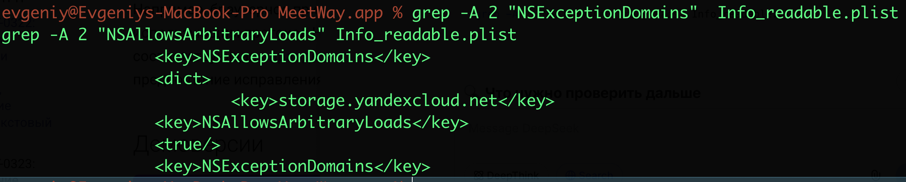

# MASTG-TEST-0322
App Transport Security, ATS

суть теста - проверить наличие атрибутов внутри Info.plist позволяющих передавать данные в открытом виде.

достаточно статически проверить бинарник приложения

что нужно проверить:
```js
NSAllowsArbitraryLoads = true 
Глобально отключает ATS для всех доменов (HTTP для всего) 🔴 Критический

NSAllowsArbitraryLoadsInWebContent = true 
Отключает ATS для всего, что загружается в WebView 🟠 Высокий

NSAllowsArbitraryLoadsForMedia = true 
Отключает ATS для медиа (AVFoundation) 🟡 Средний

NSExceptionAllowsInsecureHTTPLoads = true внутри NSExceptionDomains
Разрешает HTTP для конкретного домена 🟠 Высокий
```

--------

тестирование на приложении MeetWay
👉 (о приложении) [[0_MeetWay]]

### 🟣  начинаю тест, анализ бинарника

открываю бинар папку папку 
`cd ~/desktop/MeetWay.app`

смотрю , че есть по содержимому

```q
evgeniy@Evgeniys-MacBook-Pro MeetWay.app % ls -la
total 124888
-rwxr-xr-x   1 evgeniy  staff     35024  9 апр 10:07 __preview.dylib
drwxr-xr-x   3 evgeniy  staff        96  7 апр 00:34 _CodeSignature
drwxr-xr-x@ 16 evgeniy  staff       512  9 апр 10:48 .
drwx------@ 41 evgeniy  staff      1312 14 апр 11:52 ..
-rw-r--r--@  1 evgeniy  staff         0 11 апр 10:39 aaaa
-rw-r--r--   1 evgeniy  staff     14412  7 апр 01:18 AppIcon60x60@2x.png
-rw-r--r--   1 evgeniy  staff     19132  7 апр 01:18 AppIcon76x76@2x~ipad.png
-rw-r--r--   1 evgeniy  staff  22615696  7 апр 01:19 Assets.car
-rw-r--r--   1 evgeniy  staff     15136  7 апр 00:25 embedded.mobileprovision
drwxr-xr-x  27 evgeniy  staff       864  7 апр 00:34 Frameworks
-rw-r--r--   1 evgeniy  staff       996  7 апр 00:25 GoogleService-Info.plist
-rw-r--r--   1 evgeniy  staff      3717  7 апр 00:26 Info.plist
-rwxr-xr-x   1 evgeniy  staff     91664  9 апр 10:07 MeetWay
-rwxr-xr-x   1 evgeniy  staff  41070784  9 апр 10:07 MeetWay.debug.dylib
-rw-r--r--   1 evgeniy  staff         8  7 апр 00:26 PkgInfo
-rw-r--r--   1 evgeniy  staff     49852  7 апр 00:25 words.txt
```

соответсвенно, интересует Info.plist

----------
нужно проверить:

NSAllowsArbitraryLoads
NSAllowsArbitraryLoadsInWebContent
NSAllowsArbitraryLoadsForMedia
NSExceptionAllowsInsecureHTTPLoads
NSExceptionDomains

---------

ищу вхождения
```q
  
strings -a -8 Info.plist | grep "NSAllowsArbitraryLoads"

strings -a -8 Info.plist | grep "NSAllowsArbitraryLoadsInWebContent"

strings -a -8 Info.plist | grep "NSAllowsArbitraryLoadsForMedia"

strings -a -8 Info.plist | grep "NSExceptionAllowsInsecureHTTPLoads"

strings -a -8 Info.plist | grep "NSExceptionDomains"
```

найдены вхождения 
NSExceptionDomains
NSAllowsArbitraryLoads_

проверю их значения

`grep -A 2 "NSExceptionDomains" Info.plist`
`grep -A 2 "NSAllowsArbitraryLoads_" Info.plist`

через grep не получается посмотреть, потому что бинарник;;
```q
evgeniy@Evgeniys-MacBook-Pro MeetWay.app % grep -A 2 "NSExceptionDomains" Info.plist
Binary file Info.plist matches
evgeniy@Evgeniys-MacBook-Pro MeetWay.app % grep -A 2 "NSAllowsArbitraryLoads_" Info.plist
Binary file Info.plist matches
evgeniy@Evgeniys-MacBook-Pro MeetWay.app %
```

преобразую в новый читаемый файл
`plutil -convert xml1 Info.plist -o Info_readable.plist`

ls -la

и теперь у меня там же есть файл 
-rw-r--r--@  1 evgeniy  staff      5458 14 апр 13:51 Info_readable.plist

пробую теперь прочесть значения полностью

```c
grep -A 2 "NSExceptionDomains"  Info_readable.plist
grep -A 2 "NSAllowsArbitraryLoads" Info_readable.plist
```

ответ




```xml
<key>NSExceptionDomains</key>
		<dict>
			<key>storage.yandexcloud.net</key>
		<key>NSAllowsArbitraryLoads</key>
		<true/> 😱
		<key>NSExceptionDomains</key>

```
привет, вот и  NSAllowsArbitraryLoads  = true

##### а это значит: (КРИТ УЯЗВИМОСТЬ)

NSAllowsArbitraryLoads  = true
= глобально отключает ATS для всех доменов (HTTP для всего) 🔴 Критический

Приложение может отправлять данные по незащищенному протоколу HTTP на любые серверы, и iOS не будет ничего блокировать

**ATS игнорируется** - вся защита от apple отключена
**Любой домен доступен** - может слать запросы куда угодно
**HTTPS не проверяется**  (любой сертификат подойдет)
**HTTP разрешен**  - то есть без шифрования

то есть перехватить и подменить данные будет легко!

-----------

как исправить:

 убрать этот ключ из `Info.plist`, вместо глобального отключения использовать `NSExceptionDomains` для конкретных доменов 
 (если без этого действительно нельзя обойтись)

именно поэтому, приложение спокойно доверяет сертификату и трафику через burp

--------
