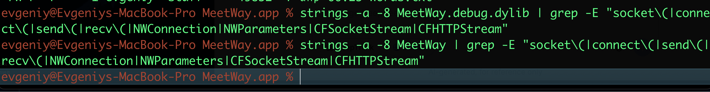

# MASTG-TEST-0323
Использование низкоуровневых сетевых API для передачи незашифрованного трафика

--------
**Суть теста:**  - проверить, не использует ли приложение низкоуровневые сетевые интерфейсы (сокеты), чтобы обойти защиту ATS и передавать данные в открытом виде (HTTP), даже если в `Info.plist` всё настроено правильно

------
ATS проверяется только `URLSession` (высокоуровневый API)

но вот если в приложении используются низкоуровневые API (Network.framework, CFNetwork, BSD Sockets, socket(), connect(), тогда уже ATS тут бессилен... 

и например, если если в приложении реализованны `socket()`, `connect()` , то даже при правильной настройки Info.plist - здесь может спокойно протекать незащищенный http трафик

-------

что нужно проверять и почему
```js
API-Описание-Риск

`Network framework` 
Современный низкоуровневый API для работы с сокетами (TCP/UDP)
Высокий, если не настроен `.tls` параметр


`CFNetwork`
Более старый, но до сих пор используемый API 
например, CFSocketStream
Высокий, так как по умолчанию может работать через HTTP

`BSD Sockets`
Классические POSIX-функции: `socket()`, `connect()`, `send()`, `recv()`
Очень высокий риск,  полный контроль, но и полная ответственность за шифрование
```

----------

как проводить тест

1 - SAST анализ бинарника ipa

Распаковать IPA и найти бинарник

далее - искать в нем опасные вхождения функций

```c
Для BSD Sockets функции -

strings -a -8 MeetWay.debug.dylib | grep -E "socket|connect|send|recv"
    
Для Network.framework  классы
    
strings -a -8 MeetWay.debug.dylib | grep -E "NWConnection|NWParameters|NWEndpoint"
    
Для CFNetwork

strings -a -8 MeetWay.debug.dylib | grep -E "CFSocketStream|CFHTTPStream|CFReadStreamCreateForHTTPRequest"

```

и если что-то будет найдено, то нужно будет провести анализ того, какое окружение, как используется и где , для чего

чем опасно
```c
если тест провален (т.е. приложение использует низкоуровневые API для передачи данных в открытом виде):

Обход ATS: безопасные настройки Info.plist становятся бесполезными
ATS просто не видит этот трафик
   
Полный MITM: злоумышленник в Wi-Fi сети может перехватывать и модифицировать этот трафик, так как он не зашифрован

Сложность обнаружения: такой трафик сложнее отследить стандартными прокси (Burp может его не увидеть, если он не использует системный прокси). Это требует анализа уже на уровне сетевых интерфейсов (например, с помощью Wireshark)

наример трафик может идти через нестандартный порт, поэтому прокси может не увидеть его
или трафик может идти через Низкоуровневые сокеты (Raw TCP) socket(), connect(), и тогда ,например burp , не увидит их
(burp видит только обычные WebSocket)


пример, если используется - socket(), connect() send(), recv() для создания кастомного TCP-соединения (например, на порт 1935 для RTMP-видео или свой бинарный протокол), то такой трафик не пройдет через системный прокси. Burp его не увидит, поэтому , для нахождения таких соединений - нужно делать, в том числе и статический анализ!
```

> есть еще **Burp Extension `burp-non-http-extension`** - расширение, которое позволяет Burp обрабатывать сырые TCP-сокеты (но пишут, что его настраивать - сложно)

------------

#### приступаю к тестированию

тестирование на приложении MeetWay
👉 (о приложении) [[0_MeetWay]]

##### 🟣 буду проводить анализ бинарника

перехожу в папку 
`cd ~/Desktop/MeetWay.app/`

гляну- че там есть, чтобы найти главный исполняемый файл, в нем весь код

```c
MacBook-Pro MeetWay.app % ls -la
total 124904
-rwxr-xr-x   1 evgeniy  staff     35024  9 апр 10:07 __preview.dylib
drwxr-xr-x   3 evgeniy  staff        96  7 апр 00:34 _CodeSignature
drwxr-xr-x@ 17 evgeniy  staff       544 14 апр 13:51 .
drwx------@ 42 evgeniy  staff      1344 14 апр 13:56 ..
-rw-r--r--@  1 evgeniy  staff         0 11 апр 10:39 aaaa
-rw-r--r--   1 evgeniy  staff     14412  7 апр 01:18 AppIcon60x60@2x.png
-rw-r--r--   1 evgeniy  staff     19132  7 апр 01:18 AppIcon76x76@2x~ipad.png
-rw-r--r--   1 evgeniy  staff  22615696  7 апр 01:19 Assets.car
-rw-r--r--   1 evgeniy  staff     15136  7 апр 00:25 embedded.mobileprovision
drwxr-xr-x  27 evgeniy  staff       864  7 апр 00:34 Frameworks
-rw-r--r--   1 evgeniy  staff       996  7 апр 00:25 GoogleService-Info.plist
-rw-r--r--@  1 evgeniy  staff      5458 14 апр 13:51 Info_readable.plist
-rw-r--r--   1 evgeniy  staff      3717  7 апр 00:26 Info.plist
-rwxr-xr-x   1 evgeniy  staff     91664  9 апр 10:07 MeetWay
-rwxr-xr-x   1 evgeniy  staff  41070784  9 апр 10:07 MeetWay.debug.dylib
-rw-r--r--   1 evgeniy  staff         8  7 апр 00:26 PkgInfo
-rw-r--r--   1 evgeniy  staff     49852  7 апр 00:25 words.txt
```

главн файл MeetWay , совпадает с названием приложения

нужно найти совпадения теперь по ключевым словам этого теста

```bash
strings -a -8 MeetWay.debug.dylib | grep -E "socket\(|connect\(|send\(|recv\(|NWConnection|NWParameters|CFSocketStream|CFHTTPStream"
```

```bash
strings -a -8 MeetWay | grep -E "socket\(|connect\(|send\(|recv\(|NWConnection|NWParameters|CFSocketStream|CFHTTPStream"
```

результаты теста не дали результатов - это отличный знак!

```
evgeniy@Evgeniys-MacBook-Pro MeetWay.app % strings -a -8 MeetWay.debug.dylib | grep -E "socket\(|connect\(|send\(|recv\(|NWConnection|NWParameters|CFSocketStream|CFHTTPStream"
evgeniy@Evgeniys-MacBook-Pro MeetWay.app % strings -a -8 MeetWay | grep -E "socket\(|connect\(|send\(|recv\(|NWConnection|NWParameters|CFSocketStream|CFHTTPStream"
evgeniy@Evgeniys-MacBook-Pro MeetWay.app %
```




можно сразу все папки проверить на всякий случай
```bash
find . -type f -exec sh -c 'strings -a -8 "$0" 2>/dev/null | grep -q -E "socket\(|connect\(|send\(|recv\(|NWConnection|NWParameters|CFSocketStream|CFHTTPStream" && echo "найдено в: $0"' {} \;
```

и вот тут есть одно совпадание только 

найдено в: ./Frameworks/grpc.framework/grpc

нужно провериь на всякий случай ./Frameworks/grpc.framework/grpc
хотя, скорее всего, это один из методов фреймворка, на что впринци пофигу

**gRPC** - это высокоуровневый фреймворк для удаленного вызова процедур (RPC)
Он может работать поверх **HTTP/2**, + ко всеми данный фрейм ворк шифрует все с **TLS**, так что безопасно

----

также помимо strings  - следует проверить совпадения через  nm
```bash
nm -u MeetWay.debug.dylib | grep -E "socket|connect|send|recv|CFNetwork|NWConnection"


или вот так по всем папкам в дирректории

find . -type f -exec sh -c 'nm -u "$0" 2>/dev/null | grep -E "socket|connect|send|recv|CFNetwork|NWConnection" | head -1 | xargs -I {} echo "В $0: {}"' {} \;
```


было найдено - это 
_$s7Combine25ObservableObjectPublisherC4sendyyF

nm сработал так как нашел send вхождение

Combine - сетевой фрейм ворк
ObservableObjectPublisher - видимо , это класс
"В модуле Combine есть класс ObservableObjectPublisher, у которого есть метод send, который ничего не принимает и ничего не возвращает"

компиляторы (например, Swift, C++) **переименовывают функции**, чтобы закодировать в имени всю информацию о ней, называется это дело все - манглинг

вот так это работает, 
```swift
class ObservableObjectPublisher {
    func send() { }  // Обычное имя функции
}

превращается в _$s7Combine25ObservableObjectPublisherC4sendyyF
```

если начинается вот так строка _$ - то это манглинг

в данном случае - _$s7Combine25ObservableObjectPublisherC4sendyyF 
это безопасно, так как это часть работы Combine, а не самомописное что-то на коленке


============

также были найдены
```
В __Z26grpc_socket_mutator_to_argP19grpc_socket_mutator: __Z26grpc_socket_mutator_to_argP19grpc_socket_mutator библиотека Google -не опасно 

В _$s7Combine25ObservableObjectPublisherC4sendyyF: _$s7Combine25ObservableObjectPublisherC4sendyyF - это комбайн  -не опасно

В _asl_send: _asl_send  => Apple System Logger -не опасно

В _GRPC_SSL_set_connect_state: _GRPC_SSL_set_connect_state - это работа gRPC SSL/TLS для безопасных соединений - нормально!

В _connect: _connect  - а это хз че такое вообще


```

нужно проверить че за _connect это такой

```bash
find . -type f -exec sh -c 'nm -u "$0" 2>/dev/null | grep -E "connect" | head -1 | xargs -I {} echo "В $0: {}"' {} \;

и это

find . -type f -exec sh -c 'nm "$0" 2>/dev/null | grep -E " _connect$" && echo "Файл: $0"' {} \;
```

результаты
```c
В _grpc_channel_check_connectivity_state: _grpc_channel_check_connectivity_state

В _GRPC_SSL_set_connect_state: _GRPC_SSL_set_connect_state

В _connect: _connect

и это

Файл: ./Frameworks/grpc.framework/grpc
                 U _connect
Файл: ./Frameworks/openssl_grpc.framework/openssl_grpc
```

короче это внутренние вызовы фреймворка и не используется нигде в самом коде, поэтому опасности нет!

--------
также помимо strings  - следует проверить совпадения через  otool
```bash
otool -L MeetWay.debug.dylib | grep -E "CFNetwork|Network"

или по всем папкам в дирректории

find . -type f -exec sh -c 'otool -L "$0" 2>/dev/null | grep -q -E "CFNetwork|Network" && echo "Найдено в: $0"' {} \;
```

ничего не найдено

------


### Итоговый вывод

**Уязвимость отсутствует.
Приложение MeetWay:

- Не содержит прямых вызовов `socket()`, `connect()`, `send()`, `recv()`
   
- Не линковано с `CFNetwork.framework` или `Network.framework`

- Использует gRPC, который работает поверх HTTP/2 с TLS-шифрованием

- Все найденные символы относятся к легитимным системным и сторонним библиотекам
   

**Риск:** Отсутствует
Приложение не может передавать незашифрованный трафик в обход ATS через низкоуровневые API