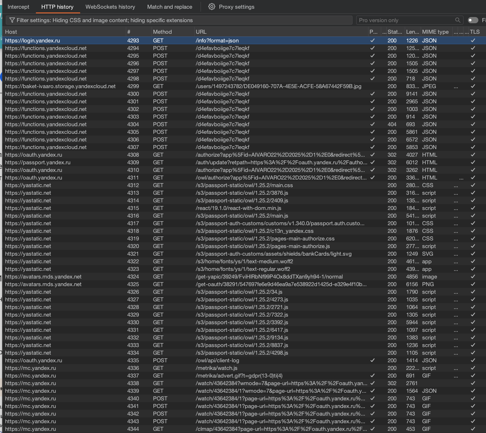

### MASTG-TEST- 0321

Проверка на то, есть ли где-то в коде или файлах приложения адрес, который начинается с `http://` (то есть без защищенного HTTPS)

----------
план тестирования

1) sast - нужно проверить бинарник на наличие совпадений http и проанализировать , если что-то найдено!

2) dast + джейл брейк - смотреть с динамике - используется ли приложение где-тот http, если - да - то тест провален!

3) dast + перехват трафика burp suite

--------------

тестирование на приложении MeetWay
👉 (о приложении) [[0_MeetWay]]

### 🟣  тест с перехватом трафика

комп и айфон в одной сети wifi 
открыл burp - настроил перехват трафика айфона [[перехват-трафика-реал-айфона-через-WiFi_burp]]

далее, установил приложение [[0_MeetWay]]

запускаю [[0_MeetWay]] на айфоне и тыкаю там все и везде, и потом анализирую весь трафик на наличие в нем запросов http

тест пройден успешно, в трафике не обнаружил http запросов, есть только https




-------------


### 🟣  тест через проверку бинарника

закинул на рабочий стол ipa папку - бинарник приложения

захжу в папку 
`cd ~/Desktop/MeetWay.app/`

гляну , че внутри 

`ls -la `

```q
total 124888
-rwxr-xr-x   1 evgeniy  staff     35024  9 апр 10:07 __preview.dylib
drwxr-xr-x   3 evgeniy  staff        96  7 апр 00:34 _CodeSignature
drwxr-xr-x@ 16 evgeniy  staff       512  9 апр 10:48 .
drwx------@ 41 evgeniy  staff      1312 14 апр 11:52 ..
-rw-r--r--@  1 evgeniy  staff         0 11 апр 10:39 aaaa
-rw-r--r--   1 evgeniy  staff     14412  7 апр 01:18 AppIcon60x60@2x.png
-rw-r--r--   1 evgeniy  staff     19132  7 апр 01:18 AppIcon76x76@2x~ipad.png
-rw-r--r--   1 evgeniy  staff  22615696  7 апр 01:19 Assets.car
-rw-r--r--   1 evgeniy  staff     15136  7 апр 00:25 embedded.mobileprovision
drwxr-xr-x  27 evgeniy  staff       864  7 апр 00:34 Frameworks
-rw-r--r--   1 evgeniy  staff       996  7 апр 00:25 GoogleService-Info.plist
-rw-r--r--   1 evgeniy  staff      3717  7 апр 00:26 Info.plist
-rwxr-xr-x   1 evgeniy  staff     91664  9 апр 10:07 MeetWay
-rwxr-xr-x   1 evgeniy  staff  41070784  9 апр 10:07 MeetWay.debug.dylib
-rw-r--r--   1 evgeniy  staff         8  7 апр 00:26 PkgInfo
-rw-r--r--   1 evgeniy  staff     49852  7 апр 00:25 words.txt
```

теперь попробую искать http 
сперва везде 
`grep -r "http://" .`  (по вложенным папкам тоже)

результаты: grep http

```c
evgeniy@Evgeniys-MacBook-Pro MeetWay.app % grep -r "http://" .
./_CodeSignature/CodeResources:<!DOCTYPE plist PUBLIC "-//Apple//DTD PLIST 1.0//EN" "http://www.apple.com/DTDs/PropertyList-1.0.dtd">
Binary file ./MeetWay matches
Binary file ./__preview.dylib matches
Binary file ./Assets.car matches
./Frameworks/grpcpp.framework/_CodeSignature/CodeResources:<!DOCTYPE plist PUBLIC "-//Apple//DTD PLIST 1.0//EN" "http://www.apple.com/DTDs/PropertyList-1.0.dtd">
Binary file ./Frameworks/grpcpp.framework/grpcpp matches
./Frameworks/grpcpp.framework/gRPCCertificates-Cpp.bundle/roots.pem:# file, You can obtain one at http://mozilla.org/MPL/2.0/.
./Frameworks/grpcpp.framework/grpcpp.bundle/PrivacyInfo.xcprivacy:<!DOCTYPE plist PUBLIC "-//Apple//DTD PLIST 1.0//EN" "http://www.apple.com/DTDs/PropertyList-1.0.dtd">
./Frameworks/RecaptchaInterop.framework/_CodeSignature/CodeResources:<!DOCTYPE plist PUBLIC "-//Apple//DTD PLIST 1.0//EN" "http://www.apple.com/DTDs/PropertyList-1.0.dtd">
Binary file ./Frameworks/RecaptchaInterop.framework/RecaptchaInterop matches
./Frameworks/GoogleDataTransport.framework/_CodeSignature/CodeResources:<!DOCTYPE plist PUBLIC "-//Apple//DTD PLIST 1.0//EN" "http://www.apple.com/DTDs/PropertyList-1.0.dtd">
Binary file ./Frameworks/GoogleDataTransport.framework/GoogleDataTransport matches
./Frameworks/GoogleDataTransport.framework/GoogleDataTransport_Privacy.bundle/PrivacyInfo.xcprivacy:<!DOCTYPE plist PUBLIC "-//Apple//DTD PLIST 1.0//EN" "http://www.apple.com/DTDs/PropertyList-1.0.dtd">
./Frameworks/FirebaseAuthInterop.framework/_CodeSignature/CodeResources:<!DOCTYPE plist PUBLIC "-//Apple//DTD PLIST 1.0//EN" "http://www.apple.com/DTDs/PropertyList-1.0.dtd">
Binary file ./Frameworks/FirebaseAuthInterop.framework/FirebaseAuthInterop matches
./Frameworks/FirebaseFirestore.framework/_CodeSignature/CodeResources:<!DOCTYPE plist PUBLIC "-//Apple//DTD PLIST 1.0//EN" "http://www.apple.com/DTDs/PropertyList-1.0.dtd">
./Frameworks/FirebaseFirestore.framework/FirebaseFirestore_Privacy.bundle/PrivacyInfo.xcprivacy:<!DOCTYPE plist PUBLIC "-//Apple//DTD PLIST 1.0//EN" "http://www.apple.com/DTDs/PropertyList-1.0.dtd">
Binary file ./Frameworks/FirebaseFirestore.framework/FirebaseFirestore matches
./Frameworks/GTMSessionFetcher.framework/_CodeSignature/CodeResources:<!DOCTYPE plist PUBLIC "-//Apple//DTD PLIST 1.0//EN" "http://www.apple.com/DTDs/PropertyList-1.0.dtd">
Binary file ./Frameworks/GTMSessionFetcher.framework/GTMSessionFetcher matches
./Frameworks/GTMSessionFetcher.framework/GTMSessionFetcher_Core_Privacy.bundle/PrivacyInfo.xcprivacy:<!DOCTYPE plist PUBLIC "-//Apple//DTD PLIST 1.0//EN" "http://www.apple.com/DTDs/PropertyList-1.0.dtd">
./Frameworks/FBLPromises.framework/_CodeSignature/CodeResources:<!DOCTYPE plist PUBLIC "-//Apple//DTD PLIST 1.0//EN" "http://www.apple.com/DTDs/PropertyList-1.0.dtd">
./Frameworks/FBLPromises.framework/FBLPromises_Privacy.bundle/PrivacyInfo.xcprivacy:<!DOCTYPE plist PUBLIC "-//Apple//DTD PLIST 1.0//EN" "http://www.apple.com/DTDs/PropertyList-1.0.dtd">
Binary file ./Frameworks/FBLPromises.framework/FBLPromises matches
./Frameworks/AWSS3.framework/_CodeSignature/CodeResources:<!DOCTYPE plist PUBLIC "-//Apple//DTD PLIST 1.0//EN" "http://www.apple.com/DTDs/PropertyList-1.0.dtd">
./Frameworks/AWSS3.framework/AWSS3.bundle/PrivacyInfo.xcprivacy:<!DOCTYPE plist PUBLIC "-//Apple//DTD PLIST 1.0//EN" "http://www.apple.com/DTDs/PropertyList-1.0.dtd">
Binary file ./Frameworks/AWSS3.framework/AWSS3 matches
./Frameworks/FirebaseCoreInternal.framework/_CodeSignature/CodeResources:<!DOCTYPE plist PUBLIC "-//Apple//DTD PLIST 1.0//EN" "http://www.apple.com/DTDs/PropertyList-1.0.dtd">
./Frameworks/FirebaseCoreInternal.framework/FirebaseCoreInternal_Privacy.bundle/PrivacyInfo.xcprivacy:<!DOCTYPE plist PUBLIC "-//Apple//DTD PLIST 1.0//EN" "http://www.apple.com/DTDs/PropertyList-1.0.dtd">
Binary file ./Frameworks/FirebaseCoreInternal.framework/FirebaseCoreInternal matches
./Frameworks/FirebaseSharedSwift.framework/_CodeSignature/CodeResources:<!DOCTYPE plist PUBLIC "-//Apple//DTD PLIST 1.0//EN" "http://www.apple.com/DTDs/PropertyList-1.0.dtd">
Binary file ./Frameworks/FirebaseSharedSwift.framework/FirebaseSharedSwift matches
./Frameworks/FirebaseCore.framework/_CodeSignature/CodeResources:<!DOCTYPE plist PUBLIC "-//Apple//DTD PLIST 1.0//EN" "http://www.apple.com/DTDs/PropertyList-1.0.dtd">
./Frameworks/FirebaseCore.framework/FirebaseCore_Privacy.bundle/PrivacyInfo.xcprivacy:<!DOCTYPE plist PUBLIC "-//Apple//DTD PLIST 1.0//EN" "http://www.apple.com/DTDs/PropertyList-1.0.dtd">
Binary file ./Frameworks/FirebaseCore.framework/FirebaseCore matches
./Frameworks/GoogleUtilities.framework/_CodeSignature/CodeResources:<!DOCTYPE plist PUBLIC "-//Apple//DTD PLIST 1.0//EN" "http://www.apple.com/DTDs/PropertyList-1.0.dtd">
./Frameworks/GoogleUtilities.framework/GoogleUtilities_Privacy.bundle/PrivacyInfo.xcprivacy:<!DOCTYPE plist PUBLIC "-//Apple//DTD PLIST 1.0//EN" "http://www.apple.com/DTDs/PropertyList-1.0.dtd">
Binary file ./Frameworks/GoogleUtilities.framework/GoogleUtilities matches
./Frameworks/FirebaseAuth.framework/FirebaseAuth_Privacy.bundle/PrivacyInfo.xcprivacy:<!DOCTYPE plist PUBLIC "-//Apple//DTD PLIST 1.0//EN" "http://www.apple.com/DTDs/PropertyList-1.0.dtd">
./Frameworks/FirebaseAuth.framework/_CodeSignature/CodeResources:<!DOCTYPE plist PUBLIC "-//Apple//DTD PLIST 1.0//EN" "http://www.apple.com/DTDs/PropertyList-1.0.dtd">
Binary file ./Frameworks/FirebaseAuth.framework/FirebaseAuth matches
./Frameworks/AWSCore.framework/_CodeSignature/CodeResources:<!DOCTYPE plist PUBLIC "-//Apple//DTD PLIST 1.0//EN" "http://www.apple.com/DTDs/PropertyList-1.0.dtd">
Binary file ./Frameworks/AWSCore.framework/AWSCore matches
./Frameworks/AWSCore.framework/AWSCore.bundle/PrivacyInfo.xcprivacy:<!DOCTYPE plist PUBLIC "-//Apple//DTD PLIST 1.0//EN" "http://www.apple.com/DTDs/PropertyList-1.0.dtd">
./Frameworks/FirebaseMessaging.framework/_CodeSignature/CodeResources:<!DOCTYPE plist PUBLIC "-//Apple//DTD PLIST 1.0//EN" "http://www.apple.com/DTDs/PropertyList-1.0.dtd">
./Frameworks/FirebaseMessaging.framework/FirebaseMessaging_Privacy.bundle/PrivacyInfo.xcprivacy:<!DOCTYPE plist PUBLIC "-//Apple//DTD PLIST 1.0//EN" "http://www.apple.com/DTDs/PropertyList-1.0.dtd">
Binary file ./Frameworks/FirebaseMessaging.framework/FirebaseMessaging matches
./Frameworks/FirebaseAppCheckInterop.framework/_CodeSignature/CodeResources:<!DOCTYPE plist PUBLIC "-//Apple//DTD PLIST 1.0//EN" "http://www.apple.com/DTDs/PropertyList-1.0.dtd">
Binary file ./Frameworks/FirebaseAppCheckInterop.framework/FirebaseAppCheckInterop matches
./Frameworks/FirebaseCoreExtension.framework/_CodeSignature/CodeResources:<!DOCTYPE plist PUBLIC "-//Apple//DTD PLIST 1.0//EN" "http://www.apple.com/DTDs/PropertyList-1.0.dtd">
Binary file ./Frameworks/FirebaseCoreExtension.framework/FirebaseCoreExtension matches
./Frameworks/FirebaseCoreExtension.framework/FirebaseCoreExtension_Privacy.bundle/PrivacyInfo.xcprivacy:<!DOCTYPE plist PUBLIC "-//Apple//DTD PLIST 1.0//EN" "http://www.apple.com/DTDs/PropertyList-1.0.dtd">
./Frameworks/FirebaseFirestoreInternal.framework/_CodeSignature/CodeResources:<!DOCTYPE plist PUBLIC "-//Apple//DTD PLIST 1.0//EN" "http://www.apple.com/DTDs/PropertyList-1.0.dtd">
Binary file ./Frameworks/FirebaseFirestoreInternal.framework/FirebaseFirestoreInternal matches
./Frameworks/FirebaseFirestoreInternal.framework/FirebaseFirestoreInternal_Privacy.bundle/PrivacyInfo.xcprivacy:<!DOCTYPE plist PUBLIC "-//Apple//DTD PLIST 1.0//EN" "http://www.apple.com/DTDs/PropertyList-1.0.dtd">
./Frameworks/nanopb.framework/_CodeSignature/CodeResources:<!DOCTYPE plist PUBLIC "-//Apple//DTD PLIST 1.0//EN" "http://www.apple.com/DTDs/PropertyList-1.0.dtd">
./Frameworks/nanopb.framework/nanopb_Privacy.bundle/PrivacyInfo.xcprivacy:<!DOCTYPE plist PUBLIC "-//Apple//DTD PLIST 1.0//EN" "http://www.apple.com/DTDs/PropertyList-1.0.dtd">
Binary file ./Frameworks/nanopb.framework/nanopb matches
./Frameworks/leveldb.framework/_CodeSignature/CodeResources:<!DOCTYPE plist PUBLIC "-//Apple//DTD PLIST 1.0//EN" "http://www.apple.com/DTDs/PropertyList-1.0.dtd">
Binary file ./Frameworks/leveldb.framework/leveldb matches
./Frameworks/leveldb.framework/leveldb_Privacy.bundle/PrivacyInfo.xcprivacy:<!DOCTYPE plist PUBLIC "-//Apple//DTD PLIST 1.0//EN" "http://www.apple.com/DTDs/PropertyList-1.0.dtd">
./Frameworks/YandexLoginSDK.framework/_CodeSignature/CodeResources:<!DOCTYPE plist PUBLIC "-//Apple//DTD PLIST 1.0//EN" "http://www.apple.com/DTDs/PropertyList-1.0.dtd">
Binary file ./Frameworks/YandexLoginSDK.framework/YandexLoginSDK matches
./Frameworks/grpc.framework/_CodeSignature/CodeResources:<!DOCTYPE plist PUBLIC "-//Apple//DTD PLIST 1.0//EN" "http://www.apple.com/DTDs/PropertyList-1.0.dtd">
Binary file ./Frameworks/grpc.framework/grpc matches
./Frameworks/grpc.framework/grpc.bundle/PrivacyInfo.xcprivacy:<!DOCTYPE plist PUBLIC "-//Apple//DTD PLIST 1.0//EN" "http://www.apple.com/DTDs/PropertyList-1.0.dtd">
./Frameworks/openssl_grpc.framework/_CodeSignature/CodeResources:<!DOCTYPE plist PUBLIC "-//Apple//DTD PLIST 1.0//EN" "http://www.apple.com/DTDs/PropertyList-1.0.dtd">
Binary file ./Frameworks/openssl_grpc.framework/openssl_grpc matches
./Frameworks/openssl_grpc.framework/openssl_grpc.bundle/PrivacyInfo.xcprivacy:<!DOCTYPE plist PUBLIC "-//Apple//DTD PLIST 1.0//EN" "http://www.apple.com/DTDs/PropertyList-1.0.dtd">
./Frameworks/absl.framework/_CodeSignature/CodeResources:<!DOCTYPE plist PUBLIC "-//Apple//DTD PLIST 1.0//EN" "http://www.apple.com/DTDs/PropertyList-1.0.dtd">
Binary file ./Frameworks/absl.framework/absl matches
./Frameworks/absl.framework/xcprivacy.bundle/PrivacyInfo.xcprivacy:<!DOCTYPE plist PUBLIC "-//Apple//DTD PLIST 1.0//EN" "http://www.apple.com/DTDs/PropertyList-1.0.dtd">
./Frameworks/FirebaseInstallations.framework/_CodeSignature/CodeResources:<!DOCTYPE plist PUBLIC "-//Apple//DTD PLIST 1.0//EN" "http://www.apple.com/DTDs/PropertyList-1.0.dtd">
Binary file ./Frameworks/FirebaseInstallations.framework/FirebaseInstallations matches
./Frameworks/FirebaseInstallations.framework/FirebaseInstallations_Privacy.bundle/PrivacyInfo.xcprivacy:<!DOCTYPE plist PUBLIC "-//Apple//DTD PLIST 1.0//EN" "http://www.apple.com/DTDs/PropertyList-1.0.dtd">
Binary file ./embedded.mobileprovision matches
Binary file ./MeetWay.debug.dylib matches
evgeniy@Evgeniys-MacBook-Pro MeetWay.app %
```

найдено только только "http://www.apple.com/DTDs/PropertyList-1.0.dtd
это системная DTD-ссылка, которая встроена в XML-файлы, в частности в `Info.plist`. Она используется для валидации XML-структуры

так что это нормально.

проверяю бинарники файлов 

`strings -a -8 __preview.dylib | grep -i "http://"`

и

`strings -a -8 MeetWay.debug.dylib | grep -i "http://"`

итого нашел в MeetWay.debug.dylib
`http://empretradingsupport.tilda.ws`
это просто ссылка на политику конфиденциальности


пройдусь еще по файлам
```
strings -a -8 MeetWay.debug.dylib | grep -i "http://"
strings -a -8 __preview.dylib | grep -i "http://"
strings -a -8 MeetWay | grep -i "http://"
strings -a -8 Assets.car | grep -i "http://"
strings -a -8 MeetWay.debug.dylib | grep -i "http"
```

нашел 
```c
IEC http://www.iec.ch
   <rdf:RDF xmlns:rdf="http://www.w3.org/1999/02/22-rdf-syntax-ns#">
            xmlns:apdi="http://ns.apple.com/pixeldatainfo/1.0/">
   <rdf:RDF xmlns:rdf="http://www.w3.org/1999/02/22-rdf-syntax-ns#">
            xmlns:exif="http://ns.adobe.com/exif/1.0/"
            xmlns:photoshop="http://ns.adobe.com/photoshop/1.0/"
            xmlns:xmp="http://ns.adobe.com/xap/1.0/">
```
www.w3.org/1999 - это имена XML
adobe - это вообще метадынные картинок (типо в фотошопе было редактирование)


-------

### выводы по тестированию

тест пройден успешно

**Обоснование:**

- Статический анализ бинарника не выявил HTTP-URL, используемых для сетевого взаимодействия. Обнаруженные вхождения 
- (`http://www.apple.com/DTDs/PropertyList-1.0.dtd` ) являются системными DTD-ссылками для валидации XML и не представляют угрозы, и http://empretradingsupport.tilda.ws - это просто политика
   
- Динамический анализ (перехват трафика через Burp Suite на реальном устройстве) подтвердил, что все сетевые запросы приложения отправляются исключительно по протоколу HTTPS

-------------


