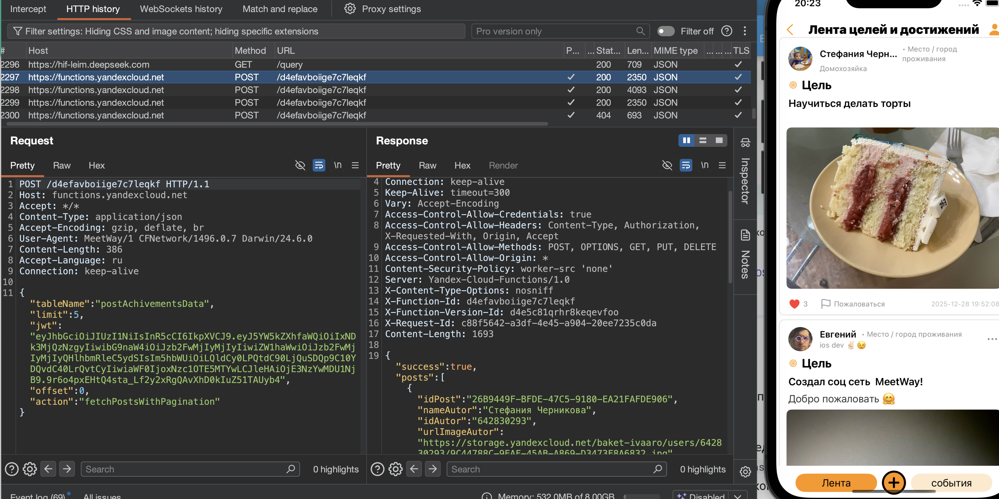

### MASTG-TEST-0066 
### MASTG-TEST-0067

### MASTG-TEST-0068

-----


**Основная цель теста - проверить, насколько безопасно приложение для iOS взаимодействует с сервером по протоколу HTTPS**

ДВЕ ЗАДАЧИ ТЕСТА

1. **Использует ли приложение только безопасные версии TLS (1.2 и выше)?**
   
2. **Не ослабляет ли разработчик встроенную защиту Apple (ATS), чтобы «подружить» приложение с сервером?**

--------
> ATS - это встроенный в iOS механизм безопасности, который **заставляет** все приложения использовать HTTPS с самыми строгими требованиями ->

- **Только HTTPS:** Никаких незашифрованных HTTP-запросов
   
- **Только свежие версии TLS:** Версия TLS должна быть не ниже 1.2
   
- **Только надежные шифры:** Обязательна поддержка Perfect Forward Secrecy (PFS) и надежных алгоритмов шифрования
   

> короче говоря, ATS - это «охранник», который не пускает трафик приложения, если он не соответствует этим стандартам

---------------

#### есть три уровня защиты приложения  в плане доверия

###### 🔴 УРОВЕНЬ 1:  (Критическая уязвимость)

**тест:** - подключаешь Burp, НЕ устанавливая свой сертификат на телефон, и **ВИДИШЬ ТРАФИК**.  
**Что это значит:** Приложение **вообще не проверяет сертификат сервера**. Оно доверяет любому, кто представится сервером. Это означает, что **ЛЮБОЙ** в той же Wi-Fi сети (в кафе, метро, бизнес-центре) может встать между тобой и сервером и перехватывать всё, включая пароли и токены. 
☠️ Это приговор приложению ☠️

###### 🟡 УРОВЕНЬ 2: Стандартная защита (Средний риск)

**тест:** подключаю Burp и **видижу трафик ТОЛЬКО ПОСЛЕ того, как установил на телефон сертификат Burp** и доверился ему в настройках.  
Приложение **доверяет системному хранилищу сертификатов** iOS.
Это стандартное, правильное поведение. 
Обычный пользователь не будет устанавливать левые сертификаты. 
Однако, если злоумышленник получит физический доступ к телефону или обманом заставит пользователя установить "важное обновление безопасности", он сможет перехватывать трафик. Для банковского приложения это уже неприемлемо!

###### 🟢 УРОВЕНЬ 3: Продвинутая защита ( Certificate Pinning  )

**тест:** подключаю Burp, устанавливаю сертификат, но **трафик НЕ ИДЕТ**
Приложение падает с ошибкой, даже если сертификат Burp "доверенный" для системы  
**это значит:** - в коде приложения "зашит" (привязан, pinned) настоящий сертификат сервера
Приложение НЕ доверяет системному хранилищу. 
Оно сверяет сертификат сервера с тем, который у него внутри. 
Увидев сертификат Burp, оно рвет соединение. 
Это **единственная правильная защита для важных приложений**!

----------

--------

### 🟢 выполняю базовую проверку 1 уровня L1

тестирование на приложении MeetWay
👉 (о приложении) [[0_MeetWay]]

( то есть проверяет ли вообще приложение сертификаты )

цель теста - просто перехватить трафик не устанавливая сертификат BURP на телефон

запустил приложение и burp

❌ тест полностью провален (все очень плохо)
так как приложение спокойно работает и я прехватываю трафик через burp
(при этом, сертификат не установлен)




попробовал открыть браузер - и ни одна стр не открывается, значит там - есть проверка эта, а здесь нет!

(получается, что есть я например подключусь к wifi бесплатному, и там чел будет перехватывать трафик, тогда он полностью увидит все запросы и сможет их отсылать от моего имени)

---------

### 🟡 выполняю проверку 2 уровня L1

тестирование на приложении MeetWay
👉 (о приложении) [[0_MeetWay]]

( то есть проверяет ли вообще приложение сертификаты )

цель теста - просто перехватить трафик не устанавливая сертификат BURP на телефон

запустил приложение и burp, + установил сертификат burp в телефон

❌  приложение, соответственно, - работает и burp перехватывает запросы, ведь оно и без сертификата прекрасно работало...

(так как приложение не прошло проверку первого уровня - то остальные уровни уже автоматически не пройдены, НО если ли бы на первом уровне проверку бы приложение прошло, тогда если приложение работает с доверенным установленным в систему сертификатом - то это считается нормальным для тех приложений, где нет чувствительных данных)

------------

### 🔴 выполняю проверку 3 уровня L2 (проверка на наличие pinning)

❌ проверка автоматически  не пройдена, так как не пройдена и проверка и №1 и №2 

данная проверка на наличие пиннинга - необходима чувствительным приложениям, банкам, онлайн играм, приватным мессендерам, крупному бизнесу

при данной проверке - приложение не должно доверять корневым системным сертификатам, и должно иметь внутри себя хеш или сам сертификат, который будет сравнивать с сервером, и если сертификаты не совпадают - тогда соединение будет обрываться! и просто так перехватить трафик через прокси уже не получиться! 

То есть когда приложение использует **Certificate Pinning** - кто перед каждым запросом, или каждым чувствительным запросам, приложение сначала запрашивает у сервера его сертификат, и может быть ещё и публичный ключ этого сертификата, затем приложение извлекает из своего кода вшитой сертификат или его хеш , вычисляет хеш полученного сертификата от сервера и сравнивает эти два хеша, если они не совпадают то соединения обрываются.

--------

итого - все три теста полностью провалены!

------
осталось только лишь проверить  ATS с помощью `nscurl` 

ДЕЛАЮ ЗАПРОС  nscurl
```bash
/usr/bin/nscurl --ats-diagnostics --verbose https://functions.yandexcloud.net
```

> ==nscurl== -это встроенная в macOS утилита, которая проверяет, насколько безопасно и правильно настроен удаленный сервер для обмена данными по протоколу HTTPS с точки зрения операционной системы Apple

> Простыми словами, она имитирует «осмотр» сервера инспектором Apple. Утилита пытается подключиться к серверу разными способами (включая старые и слабые методы шифрования) и смотрит, какие из них сервер поддерживает

> **Основная цель проверки - выяснить, нужно ли разработчику приложения ослаблять встроенную защиту Apple (ATS), чтобы его приложение могло подключиться к этому серверу.

### че делает утилита

- Тестирует сервер на совместимость с различными версиями протокола TLS (1.0, 1.1, 1.2, 1.3)
   
- Проверяет, поддерживает ли сервер современные и надежные шифры

- Смотрит, требуется ли для соединения «идеальная прямая секретность» (PFS)

---------

результаты теста:

```c
/usr/bin/nscurl --ats-diagnostics --verbose https://functions.yandexcloud.net
Starting ATS Diagnostics

Configuring ATS Info.plist keys and displaying the result of HTTPS loads to https://functions.yandexcloud.net.
A test will "PASS" if URLSession:task:didCompleteWithError: returns a nil error.
================================================================================

Default ATS Secure Connection
---
ATS Default Connection
ATS Dictionary:
{
}
Result : PASS
---

================================================================================

Allowing Arbitrary Loads

---
Allow All Loads
ATS Dictionary:
{
    NSAllowsArbitraryLoads = true;
}
Result : PASS
---

================================================================================

Configuring TLS exceptions for functions.yandexcloud.net

---
TLSv1.3
ATS Dictionary:
{
    NSExceptionDomains =     {
        "functions.yandexcloud.net" =         {
            NSExceptionMinimumTLSVersion = "TLSv1.3";
        };
    };
}
Result : PASS
---

---
TLSv1.2
ATS Dictionary:
{
    NSExceptionDomains =     {
        "functions.yandexcloud.net" =         {
            NSExceptionMinimumTLSVersion = "TLSv1.2";
        };
    };
}
Result : PASS
---

---
TLSv1.1
ATS Dictionary:
{
    NSExceptionDomains =     {
        "functions.yandexcloud.net" =         {
            NSExceptionMinimumTLSVersion = "TLSv1.1";
        };
    };
}
Result : PASS
---

---
TLSv1.0
ATS Dictionary:
{
    NSExceptionDomains =     {
        "functions.yandexcloud.net" =         {
            NSExceptionMinimumTLSVersion = "TLSv1.0";
        };
    };
}
Result : PASS
---

================================================================================

Configuring PFS exceptions for functions.yandexcloud.net

---
Disabling Perfect Forward Secrecy
ATS Dictionary:
{
    NSExceptionDomains =     {
        "functions.yandexcloud.net" =         {
            NSExceptionRequiresForwardSecrecy = false;
        };
    };
}
Result : PASS
---

================================================================================

Configuring PFS exceptions and allowing insecure HTTP for functions.yandexcloud.net

---
Disabling Perfect Forward Secrecy and Allowing Insecure HTTP
ATS Dictionary:
{
    NSExceptionDomains =     {
        "functions.yandexcloud.net" =         {
            NSExceptionAllowsInsecureHTTPLoads = true;
            NSExceptionRequiresForwardSecrecy = false;
        };
    };
}
Result : PASS
---

================================================================================

Configuring TLS exceptions with PFS disabled for functions.yandexcloud.net

---
TLSv1.3 with PFS disabled
ATS Dictionary:
{
    NSExceptionDomains =     {
        "functions.yandexcloud.net" =         {
            NSExceptionMinimumTLSVersion = "TLSv1.3";
            NSExceptionRequiresForwardSecrecy = false;
        };
    };
}
Result : PASS
---

---
TLSv1.2 with PFS disabled
ATS Dictionary:
{
    NSExceptionDomains =     {
        "functions.yandexcloud.net" =         {
            NSExceptionMinimumTLSVersion = "TLSv1.2";
            NSExceptionRequiresForwardSecrecy = false;
        };
    };
}
Result : PASS
---

---
TLSv1.1 with PFS disabled
ATS Dictionary:
{
    NSExceptionDomains =     {
        "functions.yandexcloud.net" =         {
            NSExceptionMinimumTLSVersion = "TLSv1.1";
            NSExceptionRequiresForwardSecrecy = false;
        };
    };
}
Result : PASS
---

---
TLSv1.0 with PFS disabled
ATS Dictionary:
{
    NSExceptionDomains =     {
        "functions.yandexcloud.net" =         {
            NSExceptionMinimumTLSVersion = "TLSv1.0";
            NSExceptionRequiresForwardSecrecy = false;
        };
    };
}
Result : PASS
---

================================================================================

Configuring TLS exceptions with PFS disabled and insecure HTTP allowed for functions.yandexcloud.net

---
TLSv1.3 with PFS disabled and insecure HTTP allowed
ATS Dictionary:
{
    NSExceptionDomains =     {
        "functions.yandexcloud.net" =         {
            NSExceptionAllowsInsecureHTTPLoads = true;
            NSExceptionMinimumTLSVersion = "TLSv1.3";
            NSExceptionRequiresForwardSecrecy = false;
        };
    };
}
Result : PASS
---

---
TLSv1.2 with PFS disabled and insecure HTTP allowed
ATS Dictionary:
{
    NSExceptionDomains =     {
        "functions.yandexcloud.net" =         {
            NSExceptionAllowsInsecureHTTPLoads = true;
            NSExceptionMinimumTLSVersion = "TLSv1.2";
            NSExceptionRequiresForwardSecrecy = false;
        };
    };
}
Result : PASS
---

---
TLSv1.1 with PFS disabled and insecure HTTP allowed
ATS Dictionary:
{
    NSExceptionDomains =     {
        "functions.yandexcloud.net" =         {
            NSExceptionAllowsInsecureHTTPLoads = true;
            NSExceptionMinimumTLSVersion = "TLSv1.1";
            NSExceptionRequiresForwardSecrecy = false;
        };
    };
}
Result : PASS
---

---
TLSv1.0 with PFS disabled and insecure HTTP allowed
ATS Dictionary:
{
    NSExceptionDomains =     {
        "functions.yandexcloud.net" =         {
            NSExceptionAllowsInsecureHTTPLoads = true;
            NSExceptionMinimumTLSVersion = "TLSv1.0";
            NSExceptionRequiresForwardSecrecy = false;
        };
    };
}
Result : PASS
---

================================================================================
```

✅  тест nscurl пройден УСПЕШНО 

- Сервер *хороший* и полностью соответствует современным стандартам безопасности Apple. Разработчик не имеет *права* отключать защиту ATS в своем приложении. Если он это сделал - это его грубая ошибка
    
- Если такой тест = `FAIL`:  Сервер *плохой* или устаревший. Он не соответствует требованиям ATS. В этом случае у разработчика есть техническое оправдание, чтобы временно ослабить ATS для конкретного домена, но лучшее решение - это модернизация самого сервера

--------

###### ИТОГОВЫЙ ВЫВОД

```http
Сервер (functions.yandexcloud.net) идеально настроен - он поддерживает TLS 1.0-1.3, Perfect Forward Secrecy и все требования ATS Apple

Приложение (MeetWay) - катастрофически небезопасно - оно не проверяет сертификаты вообще, позволяя любому в Wi-Fi сети перехватывать весь трафик
```

Приложение MeetWay не проверяет подлинность сертификата сервера при установлении HTTPS-соединения. Перехват трафика через Burp Suite возможен без установки доверенного сертификата на устройство, что указывает на полное отключение проверки сертификатов

```http
Злоумышленник, находящийся в той же Wi-Fi сети (кафе, аэропорт, бизнес-центр), может:

1. Встать между устройством жертвы и сервером (MITM)
   
2. Перехватывать все запросы, включая JWT-токены
   
3. Получить полный доступ к аккаунту жертвы
```

--------

иду в приложение в info.plist  и ищу там `NSAllowsArbitraryLoads`

 ```xml
<key>NSAppTransportSecurity</key>
<dict>
        <key>NSAllowsArbitraryLoads</key> <true/> 👈❌ 
 ```

NSAllowsArbitraryLoads  - УСТАНОВЛЕН В ТРУ - А ЗНАЧИТ ПРИЛОЖЕНИЕ НЕ ПРОВЕРЯЕТ СЕРТИФИКАТЫ ВООБЩЕ

то есть , когда я разрабатывал свое приложение, то на этапе настройки сети я установил NSAllowsArbitraryLoads = true - чтобы любой трафик был разрешен моему приложению, и потом вообще забыл про этот момент. итого - я получил - 100% работоспособности и 0% безопасности.

работает это типо вот так:
```q
Приложение → iOS: "Разреши мне любой HTTPS, даже если сертификат левый"
iOS → Приложение: "Ок, делай что хочешь"
Приложение → Сервер: (подключается к любому серверу с любым сертификатом)
```

---------
чтобы выполнялось проверка первого уровня, то необходимо в info.plist добавить вот это ` <key>functions.yandexcloud.net</key>` вместо `<key>NSAllowsArbitraryLoads</key> <true/>` 
И тогда iOS будет автоматически доверять только этому домену.

Вот а чтобы приложение соответствовало третьему уровню, чтобы сделать pinning - необходимо в info.plist  добавить NSIncludesSubdomains и ключ
```xml
     <key>functions.yandexcloud.net</key>
        <dict>
            <key>NSIncludesSubdomains</key>
            <true/>
            <!-- Здесь должен быть ключ для Pinning -->
        </dict>
```

и в самом коде настроить сверку сертификатов 
```swift
// Пример Pinning в коде на Swift
class PinnedURLSessionDelegate: NSObject, URLSessionDelegate {
    func urlSession(_ session: URLSession, 
                    didReceive challenge: URLAuthenticationChallenge,
                    completionHandler: @escaping (URLSession.AuthChallengeDisposition, URLCredential?) -> Void) {
        
        guard let serverTrust = challenge.protectionSpace.serverTrust,
              let certificate = SecTrustGetCertificateAtIndex(serverTrust, 0) else {
            completionHandler(.cancelAuthenticationChallenge, nil)
            return
        }
        
        let serverCertificateData = SecCertificateCopyData(certificate) as Data
        let pinnedCertificateData = MyPinnedCertificateData // зашитый в код сертификат
        
        if serverCertificateData == pinnedCertificateData {
            completionHandler(.useCredential, URLCredential(trust: serverTrust))
        } else {
            completionHandler(.cancelAuthenticationChallenge, nil)
        }
    }
}
```

и тогда приложение будет соответствовать уровню 3 по данной классификации моего данного тестирования и будет соответствовать уровню L2 согласно MASVS классификации!

Что необходимо, например для банковских приложений!

-------------

проверю, работает ли сертификат от сервера

```shell
MacBook-Pro ~ % openssl s_client -connect functions.yandexcloud.net:443 -servername functions.yandexcloud.net 2>/dev/null | openssl x509 -text -noout | grep -E "Issuer:|Subject:|Not After|Not Before"

        Issuer: C=BE, O=GlobalSign nv-sa, CN=GlobalSign RSA OV SSL CA 2018
            Not Before: Mar 13 21:36:09 2026 GMT
            Not After : Sep 11 20:59:59 2026 GMT
        Subject: C=RU, ST=Moscow, L=Moscow, O=YANDEX LLC, CN=*.containers.yandexcloud.net
```

отлично, бекенд выдает валидный сертификат!

 > сертификат для Яндекса выпустила компания **GlobalSign**, один из крупнейших и самых надежных в мире удостоверяющих центров. Сертификаты GlobalSign по умолчанию встроены и доверены во всех операционных системах, включая iOS

```q
Subject: (Кому выдан паспорт)
C=RU, ST=Moscow, L=Moscow, O=YANDEX LLC, 
CN=*.containers.yandexcloud.net

CN=*.containers.yandexcloud.net - это самое главное

Звездочка * означает, что сертификат подходит для любого поддомена containers.yandexcloud.net Твой functions.yandexcloud.net - это как раз один из таких поддоменов Именно это позволяет сертификату быть валидным для твоего сервера

 Not Before и Not After (Срок действия)

Not Before: Mar 13 21:36:09 2026 GMT    
Not After : Sep 11 20:59:59 2026 GMT
```

----------

# 😈 ВЫВОДЫ 

ОБНАРУЖЕННЫЕ УЯЗВИМОСТИ

🎃 Первая и самая критическая уязвимость. Приложение MeetWay вообще не проверяет сертификат сервера. я подключил Burp Suite, не устанавливая на телефон сертификат Burp, и приложение спокойно работало, а я перехватывал весь трафик. Это означает, что приложение доверяет любому, кто представится сервером. Любой злоумышленник в той же Wi-Fi сети может встать между мной и сервером и перехватывать всё, включая пароли и токены

🎃 Вторая уязвимость вытекает из первой. Раз приложение не проверяет сертификаты вообще, тест на наличие Certificate Pinning автоматически провален. Pinning не настроен

🎃 Третья уязвимость. В файле Info.plist приложения установлен ключ *NSAllowsArbitraryLoads* в значение true. Это прямое доказательство того, что разработчик сознательно отключил встроенную защиту Apple ATS. Сервер [functions.yandexcloud.net]при этом идеально настроен, поддерживает все требования ATS, имеет валидный сертификат от GlobalSign.  вся проблема  в MeetWay!

🫣 ЧТО НУЖНО СДЕЛАТЬ

🔶 Первый уровень защиты. Приложение должно проверять сертификаты через системное хранилище iOS. Это базовый уровень, который включается автоматически, если не отключать ATS. Чтобы его достичь, нужно в Info.plist полностью убрать ключ NSAllowsArbitraryLoads. После этого iOS начнет проверять сертификат каждого сервера, к которому обращается приложение

🔶🔶  Второй уровень защиты. Для доменов, которые ты точно знаешь, нужно добавить белый список. В Info.plist нужно добавить секцию NSExceptionDomains и внутри нее указать мой домен [functions3.yandexcloud.net] без дополнительных исключений. Это гарантирует, что приложение будет работать только с этим доменом и только по HTTPS

🔶🔶 🔶  Третий уровень защиты. Нужно настроить Pinning. В Info.plist внутри NSExceptionDomains для твоего домена нужно добавить ключ NSIncludesSubdomains со значением true. Но основная работа делается в коде.  нужно создать собственный URLSessionDelegate и в методе didReceive challenge реализовать проверку сертификата. нужно взять сертификат, который прислал сервер, извлечь из него данные, и сравнить с сертификатом, который  нужно зашить в код приложения. Если они совпадают, соединение разрешается. Если нет, соединение обрывается. Это единственный способ защититься от атак, даже если злоумышленник каким-то образом заставит пользователя установить левый корневой сертификат

🔶🔶 🔶 🔶  Четвертый уровень, это уже организационный. нужно регулярно обновлять зашитый в приложение сертификат до его истечения. Сертификат, который использует сервер от GlobalSign, действителен до сентября 2026 года. Поэт нужно выпустить обновление приложения с новым сертификатом до этой даты, иначе приложение перестанет работать

🔶 🔶 🔶 🔶🔶  Максимальный уровень безопасности для приложения выглядит так. В Info.plist нет ключа NSAllowsArbitraryLoads. Есть секция NSExceptionDomains с  доменом [functions3.yandexcloud.net] и поддоменами. 
В коде приложения реализован Pinning через URLSessionDelegate, который сверяет сертификат сервера с сертификатом, зашитым в само приложение. 

#### Только такая конфигурация дает уровень L2 по классификации MASVS, который обязателен для банковских приложений, мессенджеров и любого софта, работающего с чувствительными данными пользователей!!!
