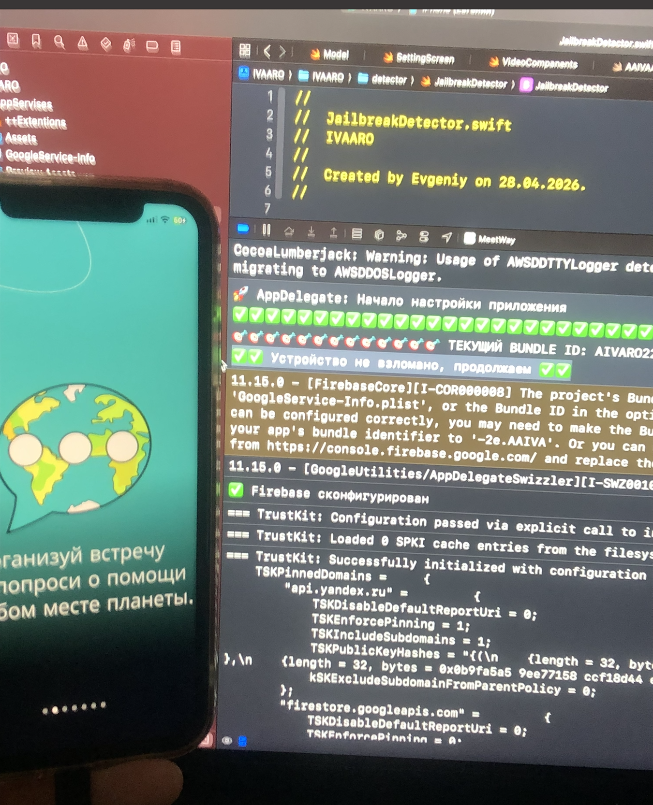
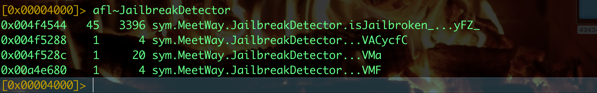
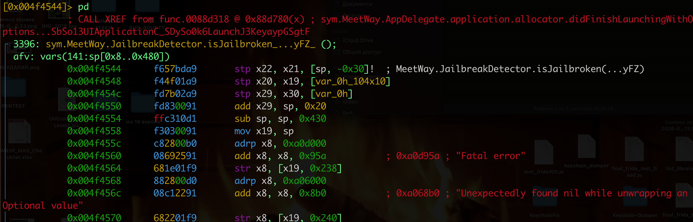
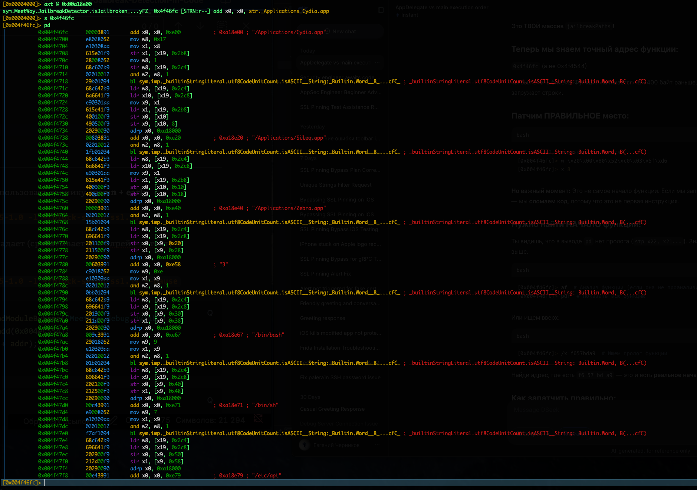
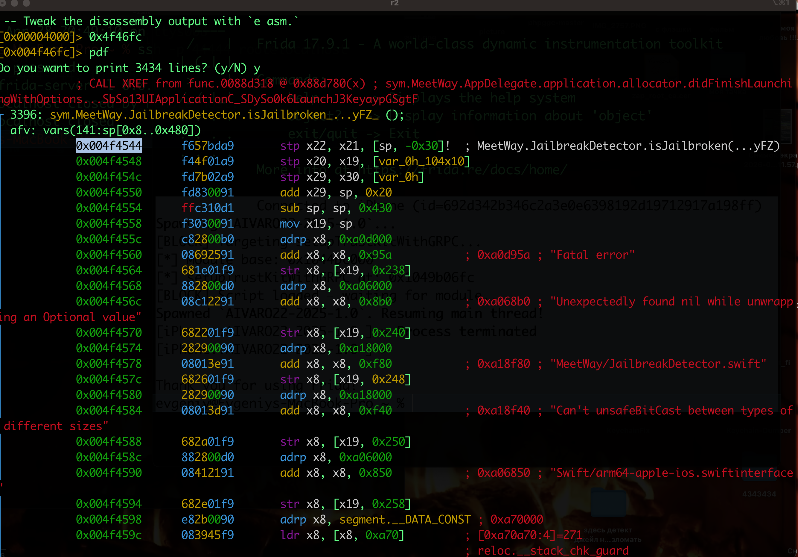
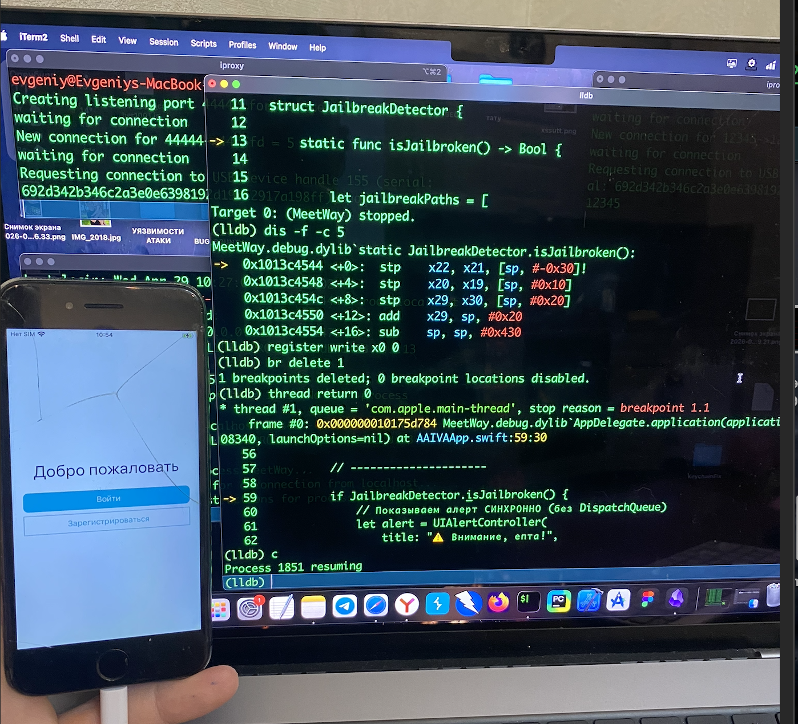

# MASTG-TEST-0240: Jailbreak Detection in Code
и
# MASTG-TEST-0241:  Runtime Use of Jailbreak Detection Techniques

-----

тест проверяет, **есть ли в бинарнике приложения код, который пытается обнаружить джейлбрейк**

то есть, если в приложении реализован функционал - который проверяет имена файла в системе на наличие  `"cydia|sileo|zebra|jailbreak|jail|break|frida|substrate|tweak|inject"`и если находит - должна быть реакция - например запрет запуска или предупредить юзера об этом.

-----

приложение может проверять наличие файлов и папок, характерных для джейлбрейка:
`/Applications/Cydia.app`, `sileo://`, `zbra://`
`/bin/bash`, `/bin/sh`, `/usr/sbin/sshd`
`/usr/bin/FridaServer`, `/usr/lib/frida-gadget.dylib`
`Попытка записи в системные директории - без джейлбрейка -не получится`
`Проверка целостности песочницы`

-------

### как провести тест

динамически - запустить приложение на джейлбрейк устройстве и смотреть реакцию

статически - найти в коде приложение те самые строки - которое приложение будет пытаться обнаружить

--------

## кратко по тесту
-- тест я прошел

я добавил в свое приложение защиту - детекции джейлбрейка

затем с помощью SAST детектировал наличие защиты
(на данном моменте -  тест уже считает выполненым ✅)

но далее - я хукнул защиту через подключение LLDB
и приложение спокойно запустилось (но я долго мучался по началу, оказалось - все просто!)

ниже будет:

✅ Статический анализ бинарников iOS через strings и radare2

✅ Динамический анализ через Frida, Objection, LLDB

✅ Обход jailbreak-детекции с помощью  LLDB --waitfor и thread return

✅ Понимание работы регистров ARM64 (x0 для возврата значений)

✅ Постановка брейкпоинтов по адресам со смещением от базового адреса


-----
### начинаю тест 
тестирую приложеине [[0_MeetWay]]

открыл бинарник
```shell
strings MeetWay.debug.dylib | grep -iE "cydia|sileo|zebra|jailbreak|jail|break|frida|substrate|tweak|inject"

- НИЧЕГО НЕ НАЙДЕНО
   ПЛОХО
```


```shell
[0x00004000]> izz~cydia
[0x00004000]> izz~sileo
[0x00004000]> izz~jailbreak
[0x00004000]> izz~frida
50287  0x00a383cb 0x00a383cb 11   12   9.__TEXT.__const           ascii   blackfriday
[0x00004000]> izz~substrate
[0x00004000]> izz~tweak
[0x00004000]> izz~inject
59790  0x00ac8f52 0x00ac8f52 24   25                              ascii   9injectIntoYandexSDKyyFZ
65084  0x00d4a8d5 0x00d4a8d5 54   55                              ascii   _$s7MeetWay15GRPCInterceptorC19injectIntoYandexSDKyyFZ
[0x00004000]>

- ТОЖЕ НИЧЕГО НЕ НАЙДЕНО
- ПЛОХО 
```

ВЕРДИКТ - статически - не найден код - указывающий на реализацию детекции!

теперь запустил приложение на джейлбрек айфоне - и реакции никакой нет

#### ❌ тест 40 на данный момент провален (не найдено защиты)

--------

### устанавливаю в приложение простую джейл-брейк детекцию 


добавлю в приложение  [[0_MeetWay]] методы для детекции джейлбрейка

> Я СПЕЦИАЛЬНО НЕ ОБФУСЦИРУЮ ИМЕНА МЕТОДОВ И ПОИСКОВЫХ СТРОК

```swift
 
 зведочки - это так копируется с xcode 🤨

**import** Foundation

**import** UIKit

  

**struct** JailbreakDetector {

    **static** **func** isJailbroken() -> Bool {

        **let** jailbreakPaths = [

            "/Applications/Cydia.app",

            "/Applications/Sileo.app",

            "/Applications/Zebra.app",

            "/usr/sbin/sshd",

            "/bin/bash",

            "/bin/sh",

            "/etc/apt",

            "/private/var/lib/apt",

            "/private/var/stash",

            "/private/var/tmp/cydia.log"

        ]

        **for** path **in** jailbreakPaths {

            **if** FileManager.default.fileExists(atPath: path) {

                **return** **true**

            }

        }

        // МОЖНо-ЛИ запись в системную папку

        **let** testPath = "/private/jailbreak_test_\(UUID().uuidString)"

        **do** {

            **try** "test".write(toFile: testPath, atomically: **true**, encoding: .utf8)

            **try** FileManager.default.removeItem(atPath: testPath)

            **return** **true** // получилось записать  ? = джейлбрейк

        } **catch** {}

        //  URL-схемы магазинов

        **let** jailbreakSchemes = ["cydia://", "sileo://", "zbra://", "filza://"]

        **for** scheme **in** jailbreakSchemes {

            **if** UIApplication.shared.canOpenURL(URL(string: scheme)!) {

                **return** **true**

            }

        }

        //  наличие fork()

        **typealias** ForkFunc = **@convention**(c) () -> Int32

        **if** **let** forkPtr = dlsym(UnsafeMutableRawPointer(bitPattern: -2), "fork") {

            **let** fork = unsafeBitCast(forkPtr, to: ForkFunc.**self**)

            **let** pid = fork()

            **if** pid >= 0 {

                **if** pid == 0 {

                    exit(0) // дочерний процесс

                } **else** {

                    **var** status: Int32 = 0

                    waitpid(pid, &status, 0)

                    **return** **true** // fork() сработал — джейлбрейк

                }

            }

        }

        **return** **false**

    }

}


------------


в аппделегат  
**** сам вызов функции в didFinishLaunchingWithOptions 

добававляю вызов и проверкой


   if JailbreakDetector.isJailbroken() {
    // Показываем алерт СИНХРОННО (без DispatchQueue)
    let alert = UIAlertController(
        title: "⚠️ Внимание, епта!",
        message: "Обнаружен джейлбрейк. Приложение не может быть запущено.",
        preferredStyle: .alert
    )
    alert.addAction(UIAlertAction(title: "OK", style: .destructive) { _ in
        exit(0)
    })
    
    // Находим rootViewController напрямую
    if let windowScene = UIApplication.shared.connectedScenes.first as? UIWindowScene,
       let window = windowScene.windows.first {
        window.rootViewController = UIViewController() // Пустой контроллер
        window.makeKeyAndVisible()
        window.rootViewController?.present(alert, animated: true)
    } else {
        // Если сцена не найдена — просто выходим
        exit(0)
    }
    
    return true
}
    
    print("✅ Устройство не взломано, продолжаем")

```

------

теперь устанавливаю и запускаю приложение на айфоне без джейлбрейка!

и как и ожидалось - запуск происходит без проблем!
и принт из кода сообщает о нормальной работе
`✅✅ Устройство не взломано, продолжаем ✅✅`




---------

теперь закидываю эту сборку вручную на айфон 8 ios 16.7 c джейлбрейком

беру сборку здесь (так как до этого я ставл на обычный айфон - то дебаг сборка есть здесь)
`~/Library/Developer/Xcode/DerivedData`

беру бинарник app
и пересобираю его в .ipa

```shell
cd ~/Desktop/4343434
mkdir Payload
cp -R MeetWay.app Payload/
zip -r MeetWay.ipa Payload/
rm -rf Payload
```

и закидываю ipa на айфон 

запускаю приложеине!!!
и вуаля - оно вылетает!!!
супер!! так как до установки такой детекции - вылетов не было!

защита работает!!

сейчас подрублюсь через фрида и гляну - че там в логах 

-------

#### запускаю фрида

подрубаю фриду к айфону, там уде все настроено и готово - стоит и фрида и паралель и все че надо
 подробнее о настройке - можно найти в папке `tools`

подрубаю ssh для удобства

перв терминал
`iproxy 44444 44`
второй терминал
`ssh -p 44444 root@localhost`
стандарт пароль: alpine

на айфоне - сервер фриды
`sudo frida-server -l 0.0.0.0 `
Пароль: alpine

и после ввода пароля - терминал завис, типо это так и должно быть
и его нужно просто свернуть, но не закрывать

теперь на маке подкл
`frida-ps -H 192.168.0.107`

нахожу бандл айди

`frida-ps -Uai`
MeetWay         AIVARO22-2025-1.0

-----------


### через радар ищу методы детекции

-- через радар найти функции по детекту и запустить приложеине через фрида с отключением защиты!

запускаю 
```shell
evgeniy@Evgeniys-MacBook-Pro MeetWay.app % strings MeetWay.debug.dylib | grep -iE "cydia|sileo|zebra|jailbreak|jail|break|frida|substrate|tweak|inject"

/Applications/Cydia.app
/Applications/Sileo.app
/Applications/Zebra.app
/private/var/tmp/cydia.log
/private/jailbreak_test_
cydia://
sileo://
MeetWay/JailbreakDetector.swift
JailbreakDetector

blackfriday
evgeniy@Evgeniys-MacBook-Pro MeetWay.app %
```

отлично, какая - защита обнаружена!

##### ✅ тест 40 - считается - выполненым - защита найдена!

теперь найду это же через радар и найду адресс функции чтобы залочить ее

```shell
MacBook-Pro MeetWay.app % r2 -A ./MeetWay.debug.dylib

afl~JailbreakDetector

```

вот это красота - которая блокирует запуск
```
[0x00004000]> afl~JailbreakDetector
0x004f4544   45   3396 sym.MeetWay.JailbreakDetector.isJailbroken_...yFZ_
0x004f5288    1      4 sym.MeetWay.JailbreakDetector...VACycfC
0x004f528c    1     20 sym.MeetWay.JailbreakDetector...VMa
0x00a4e680    1      4 sym.MeetWay.JailbreakDetector...VMF
[0x00004000]>
```




и вот он  `0x004f4544`, скорее всего тот самый процесс который запускает проверку


а вот этот  "Fatal error"  - наверно отвечает за то чтобы функция крашила приложение!
```shell
[0x004f4544]> pd
            ; CALL XREF from func.0088d318 @ 0x88d780(x) ; sym.MeetWay.AppDelegate.application.allocator.didFinishLaunchingWithOptions...SbSo13UIApplicationC_SDySo0k6LaunchJ3KeyaypGSgtF
┌ 3396: sym.MeetWay.JailbreakDetector.isJailbroken_...yFZ_ ();
│ afv: vars(141:sp[0x8..0x480])
│           0x004f4544      f657bda9       stp x22, x21, [sp, -0x30]!  ; MeetWay.JailbreakDetector.isJailbroken(...yFZ)
│           0x004f4548      f44f01a9       stp x20, x19, [var_0h_104x10]
│           0x004f454c      fd7b02a9       stp x29, x30, [var_0h]
│           0x004f4550      fd830091       add x29, sp, 0x20
│           0x004f4554      ffc310d1       sub sp, sp, 0x430
│           0x004f4558      f3030091       mov x19, sp
│           0x004f455c      c82800b0       adrp x8, 0xa0d000
│           0x004f4560      08692591       add x8, x8, 0x95a           ; 0xa0d95a ; "Fatal error" 
│           0x004f4564      681e01f9       str x8, [x19, 0x238]
```

вот это вход в функцию
```
0x004f4544      f657bda9       stp x22, x21, [sp, -0x30]!
0x004f4548      f44f01a9       stp x20, x19, [var_0h_104x10]
0x004f454c      fd7b02a9       stp x29, x30, [var_0h]
0x004f4550      fd830091       add x29, sp, 0x20
```



смотрю откуда вызывается функция
```swift
[0x00004000]> axt @0x004f4544
sym.MeetWay.AppDelegate.application.allocator.didFinishLaunchingWithOptions...SbSo13UIApplicationC_SDySo0k6LaunchJ3KeyaypGSgtF 0x88d780 [CALL:--x] bl sym.MeetWay.JailbreakDetector.isJailbroken_...yFZ_
[0x00004000]>
```

вызов идет из AppDelegate - didFinishLaunchingWithOptions

я так понимаю - теперь можно запустить приложение принудительно через фрида и изначально залочить функцию 0x004f4544  или вот этот адресс 0x88d780

```
[0x00004000]> / isJailbroken
0x00adfafb hit5_0 .n12isJailbrokenSbyFZACycfC.
0x00d6899c hit5_1 .breakDetectorV12isJailbrokenSbyFZ_$s7MeetWa.
[0x00004000]>
```

0x004f4544

0x88d780
0x00adfafb
0x00d6899c


```js
cat > ~/block-setup-ssl.js << 'ENDOFSCRIPT'
console.log("[BLOCK] Targeting setupTrustKitWithGRPC...");

// Ждём загрузки модуля
var module = Process.findModuleByName("MeetWay.debug.dylib");
if (!module) {
    console.log("[!] Module not found yet, waiting...");
    // Пробуем найти позже
    var interval = setInterval(function() {
        module = Process.findModuleByName("MeetWay.debug.dylib");
        if (module) {
            clearInterval(interval);
            hookFunction(module);
        }
    }, 100);
} else {
    hookFunction(module);
}

function hookFunction(module) {
    console.log("[*] Module base: " + module.base);
    
    // setupTrustKitWithGRPC оффсет
    var setupPinningOffset = 0x004f4544; 
    var setupPinningAddr = module.base.add(setupPinningOffset);
    
    console.log("[*] setupTrustKitWithGRPC at: " + setupPinningAddr);
    
    // БЛОКИРУЕМ функцию полностью
    Interceptor.replace(setupPinningAddr, new NativeCallback(function() {
        
        
        return 0; // 
    }, 'void', []));
    
    
}

console.log("[BLOCK] Script loaded — waiting for module...");
ENDOFSCRIPT
```
(я пробовал разные варианты - но не получается, видимо процесс проверки выполняется раньше , чем фрида успевает что-либо сделать )

нужно запустить приложение так, чтобы фрида изначально запускала скрипт и только потом запуск приложения происходил, чтобы функция не успела выполниться!


```q
узнал  bundle-id
evgeniy@Evgeniys-MacBook-Pro ~ % frida-ps -Uai 
  MeetWay         AIVARO22-2025-1.0

и потом:
запуск

frida -U -f AIVARO22-2025-1.0 -l ~/block-setup-ssl.js
```

и получается - приложение крашиться , как будто это происходит раньше чем фрида успевает подменить значения 

я сейчас  поменял логику в функции isJailbroken в коде приложения  на противоположную и запустил приложение на обычном айфоне без джейл брейка -и там приложеине упало, и потом запустил на телефоне с джейлбрейком - и приложеине запустилось - значит 100% ЭТО РАБОТАЕТ МОЯ СИСТЕМА ДЕТЕКТА ДЖЕЙЛБРЕЙКА на моем джейлбрейк-айфоне!

это значит -  ✅ моя jailbreak detection РАБОТАЕТ ИДЕАЛЬНО !

осталось лишь обойти ее !
можно конечно, пропатчить бинарник ipa  и тем самым убрать защиту
но я хочу все таки динамически это сделать

---------

###### пробую найти другие адреса функции, если есть

пробую найти строки по которым возможно, работает функционал 
детекции джейл-брейка
/Applications/Cydia.app

нашел 
0x00a18e00 hit4_0 ./Applications/Cydia.app/Applic.

смотрю че там есть 
```
axt @ 0x00a18e00
sym.MeetWay.JailbreakDetector.isJailbroken_...yFZ_ 0x4f46fc [STRN:r--] add x0, x0, str._Applications_Cydia.app
```

вижу адрес 0x4f46fc и интересное имя JailbreakDetector.isJailbroken

и вижу, кажется , эту самую функцию
там есть:
```c
"/Applications/Cydia.app"
"/Applications/Sileo.app"
"/Applications/Zebra.app"
"/bin/bash"
"/bin/sh"
"/etc/apt"


---------

[0x00004000]> s 0x4f46fc
[0x004f46fc]> pd
│           0x004f46fc      00003891       add x0, x0, 0xe00           ; 0xa18e00 ; "/Applications/Cydia.app"
│           0x004f4700      e8028052       mov w8, 0x17
│           0x004f4704      e10308aa       mov x1, x8
│           0x004f4708      615e01f9       str x1, [x19, 0x2b8]
│           0x004f470c      28008052       mov w8, 1
│           0x004f4710      68c602b9       str w8, [x19, 0x2c4]
│           0x004f4714      02010012       and w2, w8, 1
│           0x004f4718      29b01094       bl sym.imp._builtinStringLiteral.utf8CodeUnitCount.isASCII__String:_Builtin.Word__B_...cfC_ ; _builtinStringLiteral.utf8CodeUnitCount.isASCII__String: Builtin.Word, B(...cfC)
│           0x004f471c      68c642b9       ldr w8, [x19, 0x2c4]
│           0x004f4720      6a6641f9       ldr x10, [x19, 0x2c8]
│           0x004f4724      e90301aa       mov x9, x1
│           0x004f4728      615e41f9       ldr x1, [x19, 0x2b8]
│           0x004f472c      400100f9       str x0, [x10]
│           0x004f4730      490500f9       str x9, [x10, 8]
│           0x004f4734      20290090       adrp x0, 0xa18000
│           0x004f4738      00803891       add x0, x0, 0xe20           ; 0xa18e20 ; "/Applications/Sileo.app"
│           0x004f473c      02010012       and w2, w8, 1
│           0x004f4740      1fb01094       bl sym.imp._builtinStringLiteral.utf8CodeUnitCount.isASCII__String:_Builtin.Word__B_...cfC_ ; _builtinStringLiteral.utf8CodeUnitCount.isASCII__String: Builtin.Word, B(...cfC)
│           0x004f4744      68c642b9       ldr w8, [x19, 0x2c4]

и так далее...
```




значит - под прицелом теперь   адрес 0x4f46fc

 возможно, `0x4f46fc` - это место ВНУТРИ функции (когда она загружает строки)

посмотрю всю функцию целиком!

`pdf`  - это показать всю функцию от начала до конца!

там 3200 строк!
кайф..

и снова вижу  0x004f4544 - как начало функции




вот так начинается 
```q
[0x004f46fc]> pdf
Do you want to print 3434 lines? (y/N) y
            ; CALL XREF from func.0088d318 @ 0x88d780(x) ; sym.MeetWay.AppDelegate.application.allocator.didFinishLaunchingWithOptions...SbSo13UIApplicationC_SDySo0k6LaunchJ3KeyaypGSgtF
┌ 3396: sym.MeetWay.JailbreakDetector.isJailbroken_...yFZ_ ();
│ afv: vars(141:sp[0x8..0x480])
│           0x004f4544      f657bda9       stp x22, x21, [sp, -0x30]!  ; MeetWay.JailbreakDetector.isJailbroken(...yFZ)
│           0x004f4548      f44f01a9       stp x20, x19, [var_0h_104x10]
│           0x004f454c      fd7b02a9       stp x29, x30, [var_0h]
│           0x004f4550      fd830091       add x29, sp, 0x20
│           0x004f4554      ffc310d1       sub sp, sp, 0x430
│           0x004f4558      f3030091       mov x19, sp
│           0x004f455c      c82800b0       adrp x8, 0xa0d000
│           0x004f4560      08692591       add x8, x8, 0x95a           ; 0xa0d95a ; "Fatal error"
│           0x004f4564      681e01f9       str x8, [x19, 0x238]
│           0x004f4568      882800d0       adrp x8, 0xa06000
│           0x004f456c      08c12291       add x8, x8, 0x8b0           ; 0xa068b0 ; "Unexpectedly found nil while unwrapping an Optional value"
```

я  снова пришел к  0x004f4544 - значит - это и есть та самая функция - что мне нужна

снова запускаю свои скрипты (как выше ) - для фрида - но фрида не успевает ничего сделать - а именно - приаттачиться к процессу и приложение падает

пробовал через заморозку это сделать - но все равно фрида в моих руках не успевает подрубиться к процессу

--------------

✅  вот там далее - ниже через LLDB все получилось

пробую LLDB с ожиданием запуска
## ХУКАЮ детектор джейлбрейка ЧЕРЕЗ LLDB

пробую снова поломать защиту
план:

запустиь lldb в режиме ожидания запуска приложения 
запустить приложение - найти функцию 0x004f4544 и поставить на нее брейк
подменить работу функции - и посмотрим - че дальше будет

```c
гляну места - где еще вызывается функция
r2 -A ./MeetWay.debug.dylib

axt @0x004f4544      //все ссылки (XREF) на эту функцию

вижу вызов по адресу 0x88d780
sym.MeetWay.AppDelegate.application.allocator.didFinishLaunchingWithOptions...SbSo13UIApplicationC_SDySo0k6LaunchJ3KeyaypGSgtF 0x88d780 [CALL:--x] bl sym.MeetWay.JailbreakDetector.isJailbroken_...yFZ_

если что - буду еще пробовать ставить брейк-поинт на 0x88d780, если 0x004f4544 не сработает
```

#### запуск LLDB:
вот тут можно посмотреть первый запуск - [[LLdb]] 
```c
-----------
отдельный терминал для фриды
узнать бандл id
frida-ps -Uai
MeetWay         AIVARO22-2025-1.0


--------
перв терминал прокси для ssh айфона
iproxy 44444 44

-------

второй терминал ssh айфона
ssh -p 44444 root@localhost


запуск дебаг-сервера lldb к нужному приложению по его PID
 не поможет - так как приложение падает сразу и pid узнать невозможно вот так : // debugserver 0.0.0.0:12345 -a 1475

поэтмоу вот так
debugserver localhost:12345 --waitfor MeetWay


вижу Listening - отлично - теперь дебаг сервер ждет запуска приложения ручками


----------


третий терминал  - прокси для дебагсервера
прокси для дебаг сервер
iproxy 12345 12345

вижу - waiting for connection - = окей

-----------

четвертый терминал - запуск lldb

lldb

process connect connect://localhost:12345
---------


теперь включаю приложеине в телефоне

---

  вижу в терминале LLDB это ниже - значит - все окей
 
evgeniy@Evgeniys-MacBook-Pro ~ % lldb
(lldb) process connect connect://localhost:12345
Process 1851 stopped
* thread #1, stop reason = signal SIGSTOP
    frame #0: 0x0000000100e3c8b0 dyld`dyld3::MachOFile::trieWalk(Diagnostics&, unsigned char const*, unsigned char const*, char const*) + 140
dyld`dyld3::MachOFile::trieWalk:
->  0x100e3c8b0 <+140>: ldrsb  w8, [x9], #0x1
    0x100e3c8b4 <+144>: str    x9, [sp, #0x10]
    0x100e3c8b8 <+148>: tbnz   w8, #0x1f, 0x100e3c8c4 ; <+160>
    0x100e3c8bc <+152>: and    x24, x8, #0xff
Target 0: (MeetWay) stopped.
(lldb)


LLDB подключился к процессу MeetWay с PID 1851, и процесс ЗАМОРОЖЕН на самой ранней стади

приложение - висит с белым экраном

------------------------

нужно найти адресс бинарника 

image list -o -f MeetWay.debug.dylib

вижу 
[  0] 0x0000000100ed0000 /private/var/containers/Bundle/Application/7ED22691-DC92-497F-BA18-4BB68280EF8F/MeetWay.app/MeetWay.debug.dylib(0x0000000100ed0000)


вот адресс 0x0000000100ed0000


----------------

гляну - где находится сама функция которую нашел через радар 

image lookup -rn "JailbreakDetector.isJailbroken"

вижу
1 match found in /private/var/containers/Bundle/Application/7ED22691-DC92-497F-BA18-4BB68280EF8F/MeetWay.app/MeetWay.debug.dylib:
        Address: MeetWay.debug.dylib[0x00000000004f4544] (MeetWay.debug.dylib.__TEXT.__text + 5178692)
        Summary: MeetWay.debug.dylib`static MeetWay.JailbreakDetector.isJailbroken() -> Swift.Bool at JailbreakDetector.swift:13

----------

теперь нужно поставить брейк на этот адресс (со смещением)

br set -a 0x0000000100ed0000+0x004f4544

вижу - что брейк установился
Breakpoint 1: where = MeetWay.debug.dylib`static JailbreakDetector.isJailbroken() at JailbreakDetector.swift:13, address = 0x00000001013c4544

------------

далее продолжу выполнение программы для брейка

c

вижу место - где сраболал брейк!
это функция в структуре! идеально, удалось четко попасть в ту самую функцию!


(lldb) c
Process 1851 resuming
Process 1851 stopped
* thread #1, queue = 'com.apple.main-thread', stop reason = breakpoint 1.1
    frame #0: 0x00000001013c4544 MeetWay.debug.dylib`static JailbreakDetector.isJailbroken() at JailbreakDetector.swift:13
   10
   11  	struct JailbreakDetector {
   12
-> 13  	    static func isJailbroken() -> Bool {
   14
   15
   16  	        let jailbreakPaths = [
Target 0: (MeetWay) stopped.

--------

теперь посмотрю первые штук 5 инструкций этой функции

dis -f -c 5

вижу

MeetWay.debug.dylib`static JailbreakDetector.isJailbroken():
->  0x1013c4544 <+0>:  stp    x22, x21, [sp, #-0x30]!
    0x1013c4548 <+4>:  stp    x20, x19, [sp, #0x10]
    0x1013c454c <+8>:  stp    x29, x30, [sp, #0x20]
    0x1013c4550 <+12>: add    x29, sp, #0x20
    0x1013c4554 <+16>: sub    sp, sp, #0x430

------------

теперь можно сделать так - чтобы не выполнять то - что внутри функции и при этом - вернуть значение - напрмиер false (так как функция называется isJailbroken - логично - что если вернет функция false - типо не нашла джейл)

итак - по порядку - эти команды

register write x0 0
br delete 1
thread return 0

разбор команд
register write x0 0 - Записывает значение 0 в регистр x0 - - В ARM64 (процессор iPhone) регистр x0 используется для возврата значений из функций -
В Swift Bool представляется как 0 = false, 1 = true
то есть - Записывая 0 в x0, мы "кладём" туда значение false


после этих трех команд - вижу

(lldb) register write x0 0
(lldb) br delete 1
1 breakpoints deleted; 0 breakpoint locations disabled.
(lldb) thread return 0
* thread #1, queue = 'com.apple.main-thread', stop reason = breakpoint 1.1
    frame #0: 0x000000010175d784 MeetWay.debug.dylib`AppDelegate.application(application=0x0000000602808340, launchOptions=nil) at AAIVAApp.swift:59:30
   56
   57  	        // ---------------------
   58
-> 59  	        if JailbreakDetector.isJailbroken() {
   60  	            // Показываем алерт СИНХРОННО (без DispatchQueue)
   61  	            let alert = UIAlertController(
   62  	                title: "⚠️ Внимание, епта!",
(lldb)


то есть - я выше вернул функции значение false -  и следующий шаг - это проверка в if JailbreakDetector.isJailbroken() - и так как я выше - дал значение функции false - то условие это вообще не будет выполняться!

---------
поэтому - просто продолжаю выполнение!

c

---------------

и ура!!!!!!!!!!! епта!!!!!!!! получилось обойти защиту!!!!!!!

приложение запустилось!!!

```

приложение запустилось!!!
я обошел защиту!!! 
господи - спасибо

аллилуя


----------


##  ИТОГОВЫЙ ВЕРДИКТ

MASTG-TEST-0240 - ✅ **ПРОЙДЕН**   Защита найдена статически

MASTG-TEST-0241 - ✅ **ПРОЙДЕН**   Защита обойдена динамически через LLDB

✅ ➕ установил защиту для детекции джейлбрека

------
# В Ы В О Д  по тесту 40 - SAST обнаружение защиты 


✅ MASTG-TEST-0240: Jailbreak Detection in Code (Статический анализ)

Цель теста: Обнаружить в бинарнике приложения код, который пытается выявить джейлбрейк.

Этап 1: strings + grep по ключевым словам (cydia, sileo, jailbreak, frida...) → ❌ Ничего не найдено

Этап 2: radare2 + izz~ по тем же паттернам → ❌ Только "blackfriday" (не относится)

Этап 3: Добавлена защита JailbreakDetector в код → ✅ Защита внедрена

Этап 4: Повторный статический анализ → ✅ Найдены строки: /Applications/Cydia.app, cydia://, JailbreakDetector

ВЕРДИКТ 0240: ✅ ПРОЙДЕН - код обнаружения джейлбрейка присутствует в бинарнике

-----------
# В Ы В О Д  по тесту 41 - DAST обнаружение защиты + обход  ее

✅ MASTG-TEST-0241: Runtime Use of Jailbreak Detection Techniques (Динамический анализ + Обход)

Цель теста: Проверить, срабатывает ли защита на джейлбрейк-устройстве, и можно ли её обойти.

Часть А: Проверка работы защиты

iPhone без джейлбрейка → ✅ Приложение запускается

iPhone с джейлбрейком → ❌ Приложение вылетает → защита работает

Часть Б: Попытки обхода

Frida: frida -U -f AIVARO22-2025-1.0 -l script.js → ❌ Приложение падает быстрее, чем Frida внедряется

Objection: objection -g ... explore --startup-command 'ios jailbreak simulate' → ❌ Не успевает подключиться

LLDB (первая попытка): debugserver -a `<PID>` → ❌ PID неизвестен - приложение падает мгновенно

LLDB (вторая попытка): debugserver --waitfor MeetWay → ✅ Процесс пойман на старте -  и я ОБОШЕЛ ЗАЩИТУ!!!! 

---------

важные моменты

 1. LLDB с --waitfor - правильный инструмент для перехвата процесса на старте
   
2. thread return - мощная команда, позволяющая немедленно выйти из функции с нужным возвращаемым значением
   
3. Регистр x0 в ARM64 - хранит возвращаемое значение (0 = false, 1 = true для Swift Bool)
   
4. Для обхода достаточно трёх команд в LLDB после срабатывания брейка: register write x0 0, br delete 1, thread return 0

------

если была бы обфускация - тогда - было бы сложнее искать нужный метод, я бы через LLDB поймал бы метод didFinishLaunchingWithOptions и от туда я бы просматривал по очереди все функции - что срабатывают, открывал бы каждую функцию в радаре и через lldb - команды функции, чтобы понять - че делает функция та или иная

чтобы максимально усложнить жизнь - то можно было бы сделать так защиту:

1 - обфускация имен
2 - шифрование  XOR для строк - которые ищет приложение (типо frida..итп) строки поиска типа /Applications/Cydia.app, cydia://...
3 - путать логику в функция
4 - сделать чтобы функция проверки детекции возвращала не false/true а какие - то обфусцированные буквы или назвать существующими безобидными именами классов/методов
5 - сделать несколько урвоней защиты от джейл - брейка, несколько функция - в разных местах кода с разными сигнарурами и обфускациями, и динамически вызывать эти методы в разных местах
6 - удалять данные сохраненные в приложении при обнаружении детекции
7 - менять логику функции так , чтобы не этой логике были завязаны и другие функции  - без которых приложение не запустилось бы, напрмиер функции  показа стартовых экранов или этапа авторизации, и тогда - даже при обходе функции детекта - все крашилось бы
8 - вызов функции детекта - в разных местах кода
9- - ну и добавить кодтроль хеша + контроль целостности подписи


-----------


# ❌ ниже читать НЕ НУЖНО ❌
ниже - старые мои попытки пробиться через свою защиту
я это оставил - чтобы работать над ошибками


# ❌ ниже читать НЕ НУЖНО ❌
ниже - старые мои попытки пробиться через свою защиту
я это оставил - чтобы работать над ошибками


-----

попробую пропатчить .app на макбуке и закинуть на айфон потом

```q
evgeniy@Evgeniys-MacBook-Pro ~ % cd /Users/evgeniy/Desktop/4343434/MeetWay.app


evgeniy@Evgeniys-MacBook-Pro MeetWay.app % r2 -w ./MeetWay.debug.dylib

s 0x004f4544

w \x20\x00\x80\x52\xc0\x03\x5f\xd6

x 8

q 
```

выходу и архивирую
```q
cd /Users/evgeniy/Desktop/4343434

mkdir Payload

cp -R MeetWay.app Payload/

zip -r MeetWay-patched.ipa Payload/

```

и так - как я менял там бинарник - нужно переподписать его!
сертификат от xcode есть

```
распаковал
cd /Users/evgeniy/Desktop/4343434
unzip MeetWay.ipa -d MeetWay_extracted

убрал старую подпись
cd MeetWay_extracted/Payload/MeetWay.app
rm -rf _CodeSignature

нашел и скопировал профиль
cp ~/Library/Developer/Xcode/UserData/Provisioning\ Profiles/6b34810e-8699-47ec-a622-66110598dd8b.mobileprovision embedded.mobileprovision

извлеч entitlements
security cms -D -i embedded.mobileprovision > provision.plist
/usr/libexec/PlistBuddy -x -c "Print :Entitlements" provision.plist > entitlements.plist

переподписал бинарник
codesign -fs "Apple Development: Evgenyi Chernikov (CJJ8HX2K8L)" --entitlements entitlements.plist MeetWay.debug.dylib
codesign -fs "Apple Development: Evgenyi Chernikov (CJJ8HX2K8L)" --entitlements entitlements.plist MeetWay

запаковал в IPA
cd /Users/evgeniy/Desktop/4343434
mkdir Payload
cp -R MeetWay.app Payload/
zip -r MeetWay-final.ipa Payload/
```

теперь закидываю пропатченное приложение на айфон

и оно все равно не запускается .. что же такое ...


⭐️


-------

попрробую через фрида использовать технику **spawn + early instrumentation**
`frida -U -f AIVARO22-2025-1.0 -l ~/block-setup-ssl.js`

и все равно - приложение падает (срабатывает джейлрейк-детект)

пробую
`frida -U -f AIVARO22-2025-1.0 -l ~/block-setup-ssl.js --pause`

```q
var module = Process.findModuleByName("MeetWay.debug.dylib");
var addr = module.base.add(0x004ec554);
console.log("Hook at: " + addr);
console.log("Ready!");
```

```q
%resume
```

и все равно все вылетает!
защита срабатывает **быстрее**, чем Frida успевает подготовить хук
видимо , проблема в том, что функция детекта вызывается в didFinishLaunchingWithOptions , что на самом старте приложения
didFinishLaunchingWithOptions - это **самый первый метод** приложения после загрузки бинарника

--------

### пробую обойти через **Objection**

`objection -g AIVARO22-2025-1.0 explore --startup-command 'ios jailbreak simulate'`

и все равно все вылетает!
objection - тоже не успевает подключиться так как -
didFinishLaunchingWithOptions -это **самый первый метод** приложения после загрузки бинарника

-------

## пробую  LLDB , самый мощный инструмент!!!🔥

ПЛАН: - задача - запустить приложеине с помощью LLDB и сразу автоматом ставить брейкпоинт на main()
```
# В SSH на iPhone, запустить приложение в SUSPENDED режиме
/var/containers/Bundle/Application/*/MeetWay.app/MeetWay &
PID=$!
kill -STOP $PID
# Теперь приложение заморожено, ничего не выполнило
# Подключу LLDB к этому PID
debugserver 127.0.0.1:12345 -a $PID

поймать main() - первую функцию в приложении
(lldb) b main
Приложение зависнет на входе
# Базовый адрес (ASLR) -> Вычисляем реальный адрес функции детекта (Base + 0x4f4544)
(lldb) memory write [РЕАЛЬНЫЙ_АДРЕС] 0x20 0x00 0x80 0x52 0xC0 0x03 0x5F 0xD6
(lldb) c
 запатчить функцию и продолжить выполнение кода
```

```
lldb
(lldb) target create MeetWay.debug.dylib   # Загружаем твой бинарник
(lldb) process launch --stop-at-entry      # Стартуем и стопоримся


-----

или  брейкпоинт на функцию main до запуска приложения
процесс приложения будет создан, загружен в память, но **НЕ НАЧНЕТ ВЫПОЛНЯТЬ НИ ОДНОЙ ИНСТРУКЦИИ
LLDB остановит его прямо на точке входа, ещё до вызова main()

lldb
(lldb) breakpoint set -n main
(lldb) run
```

-----------

#### запуск LLDB:
вот тут можно посмотреть первый запуск - [[LLdb]] 
```c
-----------
отдельный терминал для фриды
узнать бандл id
frida-ps -Uai
MeetWay         AIVARO22-2025-1.0


--------
перв терминал прокси для ssh айфона
iproxy 44444 44

-------

второй терминал ssh айфона
ssh -p 44444 root@localhost


запуск дебаг-сервера lldb к нужному приложению по его PID
debugserver 0.0.0.0:12345 -a 1475


вижу Listening - отлично


----------


третий терминал  - прокси для дебагсервера
прокси для дебаг сервер
iproxy 12345 12345

вижу - waiting for connection - = окей

-----------

четвертый терминал - запуск lldb

lldb

process connect connect://localhost:12345
---------

 вижу  - значит - все окей
 
 Process 1475 stopped
* thread #1, stop reason = signal SIGSTOP
    frame #0: 0x0000000100698914 dyld`dyld3::MachOFile::trieWalk(Diagnostics&, unsigned char const*, unsigned char const*, char const*) + 240
dyld`dyld3::MachOFile::trieWalk:
->  0x100698914 <+240>: ldrb   w13, [x8]
    0x100698918 <+244>: cbz    w13, 0x100698988 ; <+356>
    0x10069891c <+248>: mov    w11, #0x0 ; =0
    0x100698920 <+252>: add    x10, x8, #0x1
Target 0: (MeetWay) stopped.

```

теперь можно работать с LLDB

----

Target 0: (MeetWay) stopped - приложение остановлено на самом старте!

1- ищу адрес бинарника
`image list -o -f MeetWay.debug.dylib`

```
(lldb) image list -o -f MeetWay.debug.dylib
[  0] 0x0000000100770000 /private/var/containers/Bundle/Application/86E93586-578C-4350-978D-E64F49878FE5/MeetWay.app/MeetWay.debug.dylib(0x0000000100770000)
(lldb)
```

вот адрес бинарника - *0x0000000100770000*


через радар2 я нашел функцию  
0x004f4544   45   3396 sym.MeetWay.JailbreakDetector.isJailbroken_...yFZ_

вот на нее хочу поставить брейпоинт

СТАВЛЮ  БРЕЙКПОИНТ СО СМЕЩЕНИЕМ НА АДРЕС ФУНКЦИИ


`br set -a 0x100770000+0x4f4544`

```q
(lldb) br set -a 0x100770000+0x4f4544
Breakpoint 3: where = MeetWay.debug.dylib`static JailbreakDetector.isJailbroken() at JailbreakDetector.swift:13, address = 0x0000000100c64544
(lldb)
```

проверка - что брейк стоит 
`br list`

```q
(lldb) br list
Current breakpoints:
1: name = '0x0000000100770000 + 0x004f4544', locations = 0 (pending)

2: name = '0x100770000+0x4f4544', locations = 0 (pending)

3: address = MeetWay.debug.dylib[0x00000000004f4544], locations = 1, resolved = 1, hit count = 0
  3.1: where = MeetWay.debug.dylib`static JailbreakDetector.isJailbroken() at JailbreakDetector.swift:13, address = 0x0000000100c64544, resolved, hit count = 0

(lldb)
```

3.1: where (resolved) - ОТЛИЧНО, БРЕЙК СТОИТ - он стоит на смещении 0x004f4544
где находится функция  JailbreakDetector.isJailbroken - и брейк сработает - выполнение кода остановится
можно будет че-нить там наколдовать

продолжаю выполнение кода до брейк-точки
`c`

```c
(lldb) c
Process 1475 resuming

короче - не получилось, видимо, моя функция выполняется раньше!

```

---------


## план C - запатчить бинарник...

подключаюсь к айфону по ssh

нахожу папку с приложением 
```q
find /var/containers/Bundle/Application -name "MeetWay.app" -type d

/var/containers/Bundle/Application/86E93586-578C-4350-978D-E64F49878FE5/MeetWay.app

смотрим че-каво

ls -la /var/containers/Bundle/Application/86E93586-578C-4350-978D-E64F49878FE5/MeetWay.app

и там все норм

total 62964
drwxr-xr-x 16 _installd _installd      512 Apr 28 14:31 ./
drwxr-xr-x  5 _installd _installd      160 Apr 28 16:04 ../
-rw-r--r--  1 _installd _installd    14412 Apr 28 14:31 AppIcon60x60\@2x.png
-rw-r--r--  1 _installd _installd    19132 Apr 28 14:31 AppIcon76x76\@2x~ipad.png
-rw-r--r--  1 _installd _installd 22615696 Apr 28 14:31 Assets.car
drwxr-xr-x 27 _installd _installd      864 Apr 28 14:31 Frameworks/
-rw-r--r--  1 _installd _installd      996 Apr 28 14:31 GoogleService-Info.plist
-rw-r--r--  1 _installd _installd     3717 Apr 28 14:31 Info.plist
-rwxr-xr-x  1 _installd _installd    91664 Apr 28 14:31 MeetWay*
-rw-r--r--  1 _installd _installd 41604656 Apr 28 14:31 MeetWay.debug.dylib
-rw-r--r--  1 _installd _installd        8 Apr 28 14:31 PkgInfo
drwxr-xr-x  4 _installd _installd      128 Apr 28 14:31 TrustKit_TrustKit.bundle/
drwxr-xr-x  3 _installd _installd       96 Apr 28 14:31 _CodeSignature/
-rw-r--r--  1 _installd _installd    35024 Apr 28 14:31 __preview.dylib
-rw-r--r--  1 _installd _installd    15136 Apr 28 14:31 embedded.mobileprovision
-rw-r--r--  1 _installd _installd    49852 Apr 28 14:31 words.txt
```

бинарник - MeetWay.debug.dylib

вспоминаю, что через радар - я нашел функцию 
`0x004f4544   45   3396 sym.MeetWay.JailbreakDetector.isJailbroken_...yFZ_`

что сейчас лежит по адресу 0x4f4544
`dd if=MeetWay.debug.dylib bs=1 skip=$((0x4f4544)) count=8 2>/dev/null | od -tx1 -An`

и лежит там это 
`f6 57 bd a9 f4 4f 01 a9`
это пролог функции  stp x22, x21, [sp, #-0x30]


патчу функцию

это вот такая функция теперь -  которая пустая и возвращает фолс
```
unc isJailbroken() -> Bool {
    return false  
}
```

```q
# mov x0, #0 (52800020) + ret (D65F03C0)
printf '\x20\x00\x80\x52\xC0\x03\x5F\xD6' | dd of=MeetWay.debug.dylib bs=1 seek=$((0x4f4544)) conv=notrunc
```

проверю - что записалось
```
dd if=MeetWay.debug.dylib bs=1 skip=$((0x4f4544)) count=8 2>/dev/null | od -tx1 -An
```

вижу  20 00 80 52 c0 03 5f d6    отлично

переподписываю приложение:
и так - как я менял там бинарник - нужно переподписать его!
сертификат от xcode есть

```
распаковал
cd /Users/evgeniy/Desktop/4343434
unzip MeetWay.ipa -d MeetWay_extracted

убрал старую подпись
cd MeetWay_extracted/Payload/MeetWay.app
rm -rf _CodeSignature

нашел и скопировал профиль
cp ~/Library/Developer/Xcode/UserData/Provisioning\ Profiles/6b34810e-8699-47ec-a622-66110598dd8b.mobileprovision embedded.mobileprovision

извлеч entitlements
security cms -D -i embedded.mobileprovision > provision.plist
/usr/libexec/PlistBuddy -x -c "Print :Entitlements" provision.plist > entitlements.plist

переподписал бинарник
codesign -fs "Apple Development: Evgenyi Chernikov (CJJ8HX2K8L)" --entitlements entitlements.plist MeetWay.debug.dylib
codesign -fs "Apple Development: Evgenyi Chernikov (CJJ8HX2K8L)" --entitlements entitlements.plist MeetWay

запаковал в IPA
cd /Users/evgeniy/Desktop/4343434
mkdir Payload
cp -R MeetWay.app Payload/
zip -r MeetWay-final.ipa Payload/
```

делаю быструю перезагрузку
`killall SpringBoard`

запускаю приложение

и все равно - приложение вылетает )

# ❌ выше  читать НЕ НУЖНО  до такой же строки ❌

