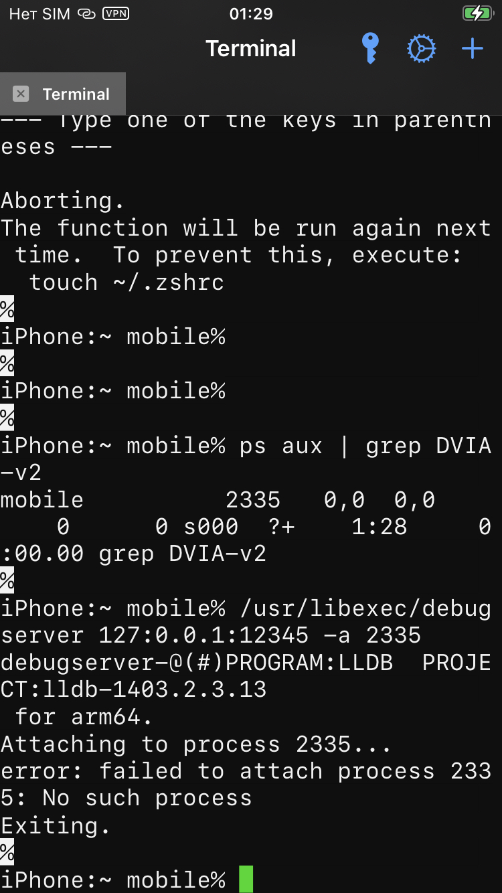

# MASTG-TEST-0089: Testing Anti-Debugging Detection
 обнаружения антиотладочных средств

**Цель:** Проверить, умеет ли приложение **обнаруживать**, что к нему "подключились" для отладки или анализа, и как оно на это реагирует.

Это нужно, чтобы создать дополнительный, очень высокий барьер для реверс-инженера

-------

приложение должно видеть подключенный отладчик

- **`ptrace`:** Вызвать `ptrace(PT_DENY_ATTACH, 0, 0, 0)`. Если после этого к приложению нельзя подключиться отладчиком - защита работает
    
- **`sysctl`:** Запросить через `sysctl` флаги процесса и проверить бит `P_TRACED`. Если он установлен - значит приложение под отладкой
    
- **`getppid`:** Проверить ID родительского процесса. Если он не равен `1` (launchd), приложение могло быть запущено отладчиком.

-----------
### в данном тесте 0089 задача:

проверить - видит ли приложение **lldb**  и как реагирует

--------

 необходимо определить:
1) детектирует ли приложение наличие отладчиков?
2) и насколько сложно обойти защиту?

----------

🟣 начальные условия:
### тест буду проводить на приложении DVIA-v2

https://github.com/prateek147/DVIA-v2/releases/download/v2.0/DVIA-v2-swift.ipa

айфон 8, ios 16.7.14
джейлбрейк palera1n

подробнее про то, как ставил джейлбрейк, можно посмотреть в папке tools

--------
### 🟡 TEST  -  1  =================================

пробрасываю прокси
с макбука
`iproxy 12345 12345`


на айфоне через силео добавляю https://bingner.com/repo/
и устанавливаю debugserver-16 (так как у меня ось 16я)

открываю приложение DVIA-v2

На Mac подключаюсь к localhost

```bash
lldb  # и оставить висеть

# на новом терминале
(lldb) process connect connect://127.0.0.1:12345

```


теперь на айфоне запускаю debugserver через NewTerm2

```bash
ps aux | grep DVIA-v2

# Подключиться к уже запущенному приложению по имени
/usr/libexec/debugserver 127.0.0.1:12345 -a 5643

(у меня дебаг сервер установился в эту дирректорию изначально)
```



не получается подключить сервер

-----------

открываю бинарник этого приложеиния через радар2

и вижу здесь 
.antiAntiHookingDebug.
.ionantiAntiHookingDebug.
возможно, эта штуковина отвечает за то, чтобы включать защиту
(если это так, то она даже без обфускации)

```q
[0x1001a9790]> / anti
0x10046b3fc hit0_0 .riantPQuantityAction.
0x10046bece hit0_1 .PriceQuantitySkuNam.
0x1005b36c1 hit0_2 .rice_kGAIItemQuantity_kGAIItemSku.
0x1005b3913 hit0_3 .e_kGAIProductQuantity_kGAIProductV.
0x1005f7466 hit0_4 .okingDebugging/anti.c/Users/pratee.
0x1005f7521 hit0_5 .ts-normal/arm64/anti.o_disable_gdb.
0x1006bbba7 hit0_6 .rceProduct setQuantity:]-[GAIEcomme.
0x1006bc0b7 hit0_7 .ategory:price:quantity:currencyCode:.
0x10033a94f hit0_8 .ionBuilder:instantiateInitialViewCo.
0x10033dc1c hit0_9 .setPrice:setQuantity:setCouponCod.
0x10033dea4 hit0_10 .ategory:price:quantity:currencyCode:.
0x10037015f hit0_11 .)Unable to instantiate %@ from %@ -.
0x1003920f6 hit0_12 .inaryProtectionantiAntiHookingDebug.
0x1003929fd hit0_13 .imeManipulationantiAntiHookingDebug.
0x10039501f hit0_14 .itiraitissaitissantiraIentissaIentir.
0x1003952b7 hit0_15 .niuzioniatoriosiantiamentiimentiisti.
0x100396bd7 hit0_16 .riosiatiitatiitiantiistiutiitiivii.
0x100396c0f hit0_17 .bilismatorosatitantistutivicabil.
0x10039a630 hit0_18 .antiAntiHookingDebug.
0x10039a9e0 hit0_19 .ionantiAntiHookingDebug.
[0x1001a9790]>
```

проверю адреса
0x10039a630 и  0x10039a9e0

```q
[0x1001a9790]> / antiAntiHookingDebug
0x1003920f6 hit0_0 .inaryProtectionantiAntiHookingDebuggingtouchIDBypa.
0x1003929fd hit0_1 .imeManipulationantiAntiHookingDebuggingbinaryProte.
0x10039a630 hit0_2 .antiAntiHookingDebuggingtouchIDBypa.
0x10039a9e0 hit0_3 .ionantiAntiHookingDebuggingbina.
[0x1001a9790]> / ionantiAntiHookingDebug
[0x1001a9790]>
```

пробую искать ptrace

```q
[0x1001a9790]> / ptrace
0x10035adef hit0_0 .riteTransactionptraceMobileSubstrate.
[0x1001a9790]>
```


проверяю все места, где используется 
axt 0x10035adef
нет результата

смотрю чем там рядом есть
`s 0x10035adef`


```q
[0x10035adef]> ps 200
ptrace\x00MobileSubstrate\x00cycript\x00SSLKillSwitch\x00SSLKillSwitch2\x00/Users/prateek/Desktop/DVIA-v2/DVIA-v2/DVIA-v2/Vendor/YapDatabase/Extensions/FullTextSearch/YapDatabaseFullTextSearch.m\x00YapCollectionsDataba
```
```q
[0x10035adef]> px 64
- offset -   EFF0 F1F2 F3F4 F5F6 F7F8 F9FA FBFC FDFE  F0123456789ABCDE
0x10035adef  7074 7261 6365 004d 6f62 696c 6553 7562  ptrace.MobileSub
0x10035adff  7374 7261 7465 0063 7963 7269 7074 0053  strate.cycript.S
0x10035ae0f  534c 4b69 6c6c 5377 6974 6368 0053 534c  SLKillSwitch.SSL
0x10035ae1f  4b69 6c6c 5377 6974 6368 3200 2f55 7365  KillSwitch2./Use
```
нашел

 `ptrace` - проверка отладчика
 `   MobileSubstrate` - фреймворк джейлбрейка
 `cycript` - инструмент для взлома
 `SSLKillSwitch` и `SSLKillSwitch2` - инструменты для обхода SSL-пиннинга
 Путь к исходнику на компе разработчика (`ptrace\x00MobileSubstrate\x00cycript\x00SSLKillSwitch\x00SSLKillSwitch2\x00/Users/prateek/Desktop/DVIA-v2/DVIA-v2/DVIA-v2/Vendor/YapDatabase/Extensions/FullTextSearch/YapDatabaseFullTextSearch.m\x00YapCollectionsDataba`)

проверяю 0x10035adef

```q
[0x10035adef]> / MobileSubstrate
0x10035adf6 hit3_0 .nsactionptraceMobileSubstratecycriptSSLKill.
0x10035d8c9 hit3_1 ./Library/MobileSubstrate/MobileSubstrate.
0x10035d8d9 hit3_2 .MobileSubstrate/MobileSubstrate.dylib.
[0x10035adef]>
```

пробую найти строки эти
```q
[0x10035adef]>
[0x10035adef]> s 0x10035adf6
[0x10035adf6]> axt
[0x10035adf6]> s 0x10035d8c9
[0x10035d8c9]> axt
[0x10035d8c9]> s 0x10035d8d9
[0x10035d8d9]> axt
[0x10035d8d9]>

ничего нет, видимо , в рантайме
```
```q÷
[0x10035d8d9]> /x 4d6f62696c65537562737472617465
0x10035adf6 hit4_0 4d6f62696c65537562737472617465
0x10035d8c9 hit4_1 4d6f62696c65537562737472617465
0x10035d8d9 hit4_2 4d6f62696c65537562737472617465
[0x10035d8d9]>
```
-------


защита есть, я вижу сигнатуры , имена

подробнее про обнаружение отладчиков - можно прочесть здесь:
я там и установил такую защиту и потом взломал

вот здесь [[_R_(SAST+DAST)-Jailbreak-Detection-in-Code+Runtime(radare2-Frida-LLDB-patch-Objection)]]

