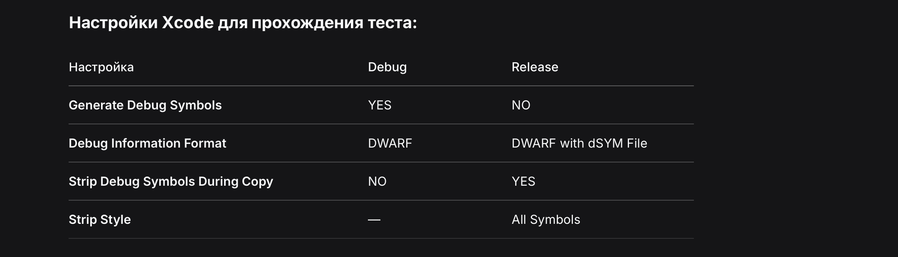

## MASTG-TEST-0219
ТЕСТИРОВАНИЕ НАЛИЧИЯ ОТЛАДОЧНЫХ СИМВОЛОВ


ЦЕЛЬ ТЕСТА:
> 	Проверить, остались ли отладочные символы в бинарнике приложения.
	Символы раскрывают имена всех функций, классов и методов - это
	позволяет реверсеру мгновенно понять архитектуру приложения

-------

### Что такое дебаг-символы:

Когда  компилируем код, Xcode добавляет в бинарник метаданные:

- Имена всех функций и методов
- Имена классов и структур
- Имена переменных
- Соответствие адресов в памяти строкам кода

В **Debug** сборке  - символы встроены прямо в бинарник (удобно для отладки)

В **Release** сборке - символов быть **НЕ должно** (они выносятся в отдельный dSYM-файл, который нужно хранить у себя для анализа крашей)

#### команды проверки
```q
# Для основного бинарника
nm MeetWay | grep -v " U "
# Для динамической библиотеки
nm MeetWay.debug.dylib | grep -v " U "
```

------
# 🔥 как сразу сделать все ПРАВЛЬНО?
```c
👉 🔥 нужно в xcode перед тем как создать релизную сборку - вот такие настрйоки задать и тест будет выполнен!
 Настройки Xcode для прохождения теста:

Настройка	               Debug	                       Release
Generate Debug Symbols	    YES	                         NO
Debug Information Format	DWARF	                DWARF with dSYM File
Strip Debug Symbols During Copy	NO	                      YES
Strip Style	               - ничего                	All Symbols
```




------

РЕЗУЛЬТАТЫ АНАЛИЗА


КОМАНДА:
```shell
nm MeetWay.debug.dylib | grep -v " U "
```

ПОКАЖУ ТОЛЬКО НЕСКОЛЬКО СТРОК ИЗ НАЙДЕННОГО...
```

000000000090ed54 t +[RSSwizzle swizzleClassMethod:inClass:newImpFactory:]
000000000090e3c0 t +[RSSwizzle swizzleInstanceMethod:inClass:newImpFactory:mode:key:]
000000000091650c t +[TSKNSURLConnectionDelegateProxy swizzleNSURLConnectionConstructors:]
0000000000917978 t +[TSKNSURLSessionDelegateProxy swizzleNSURLSessionConstructors:]
0000000000918660 t +[TSKPinningValidator allowsAdditionalTrustAnchors]
00000000009197ec t +[TrustKit initSharedInstanceWithConfiguration:]
000000000091984c t +[TrustKit initSharedInstanceWithConfiguration:sharedContainerIdentifier:]
000000000091a93c t +[TrustKit setLoggerBlock:]
0000000000919790 t +[TrustKit sharedInstance]
0000000000914434 t -[TSKBackgroundReporter .cxx_destruct]
00000000009140c8 t -[TSKBackgroundReporter URLSession:task:didCompleteWithError:]
000000000091420c t -[TSKBackgroundReporter appBundleId]
000000000091434c t -[TSKBackgroundReporter appPlatformVersion]
00000000009142fc t -[TSKBackgroundReporter appPlatform]
```
ВСЕГО СИМВОЛОВ ОБНАРУЖЕНО: несколько тысяч (включая все классы,
методы, View-ы приложения).


--------

КЛЮЧЕВЫЕ НАХОДКИ ==

```c
1. БИБЛИОТЕКИ БЕЗОПАСНОСТИ ПОЛНОСТЬЮ РАСКРЫТЫ:

   - TrustKit.initSharedInstanceWithConfiguration    ← инициализация защиты
   - TSKPinningValidator                             ← валидатор пиннинга
   - TSKNSURLSessionDelegateProxy                    ← перехват URLSession
   - TSKNSURLConnectionDelegateProxy                 ← перехват соединений
   - TSKBackgroundReporter                           ← отправка отчетов

2. КАСТОМНЫЕ КЛАССЫ ПРИЛОЖЕНИЯ ВИДНЫ ПОЛНОСТЬЮ:

   - MeetWay.AppDelegate                             ← точка входа
   - MeetWay.LoadingView                             ← экран загрузки
   - MeetWay.UserRowView                             ← строка пользователя
   - MeetWay.AudioPlayerView                         ← плеер
   - MeetWay.VideoRecorderView                       ← запись видео
   - MeetWay.CameraPreviewView                       ← камера
   - MeetWay.Chats                                   ← чаты
   - MeetWay.PhotoPickerView                         ← выбор фото
   - MeetWay.VideoProgressSlider                     ← слайдер видео
   - MeetWay.CombinedPreviewView                     ← комбинированный просмотр
   - MeetWay.RecordingIndicatorView                  ← индикатор записи
   - MeetWay.CircleVideoPlayerView                   ← плеер в круге
   - MeetWay.MessageItemView                         ← сообщение чата

3. АРХИТЕКТУРА SWIFTUI ПОЛНОСТЬЮ ПРОЗРАЧНА:

   - ModifiedContent                                 ← модификаторы View
   - AppearanceActionModifier                        ← модификатор внешнего вида
   - PaddingLayout, FrameLayout, FlexFrameLayout     ← типы лейаутов
   - SafeAreaIgnoringLayout                          ← игнорирование Safe Area
   - ScaleEffect, LinearGradient                     ← эффекты
```
-------


ВЫВОДЫ ДЛЯ БЕЗОПАСНОСТИ


🫣 ЧТО МОЖЕТ СДЕЛАТЬ АТАКУЮЩИЙ С ЭТИМИ ДАННЫМИ:

1. МГНОВЕННО ОПРЕДЕЛИТЬ ТЕХНОЛОГИИ ЗАЩИТЫ:
   - Видит TrustKit → знает, что SSL Pinning реализован
   - Видит TSKPinningValidator → находит метод проверки сертификатов
   - Видит swizzleNSURLSessionConstructors → понимает механизм перехвата

2. ВОССТАНОВИТЬ ПОЛНУЮ СТРУКТУРУ ПРИЛОЖЕНИЯ:
   - Все экраны (LoadingView, UserRowView, Chats, CameraPreviewView)
   - Все фичи (VideoRecorder, AudioPlayer, PhotoPicker)
   - Все UI-компоненты (ProgressSlider, RecordingIndicator)

3. НАЙТИ ТОЧКИ ВХОДА ДЛЯ АТАКИ:
   - AppDelegate → canFinishLaunching → setupTrustKitWithGRPC
   - GRPCInterceptor → injectIntoYandexSDK
   - TSKPinningValidator → evaluateTrust

--------

РЕКОМЕНДАЦИИ ПО ИСПРАВЛЕНИЮ


НАСТРОЙКИ XCODE ДЛЯ RELEASE-СБОРКИ:
```c
Build Settings → Apple Clang - Code Generation:
  - Generate Debug Symbols:        NO (для Release)

Build Settings → Build Options:
  - Debug Information Format:      DWARF with dSYM File

Build Settings → Deployment:
  - Strip Debug Symbols During Copy: YES
  - Strip Style:                   All Symbols
  - Deployment Postprocessing:     YES
```

ВАЖНО: dSYM-файл СОХРАНИТЬ ОТДЕЛЬНО для анализа крашей!
       НЕ ВКЛЮЧАТЬ dSYM В IPA-ФАЙЛ!

```
====================================================================
                 СРАВНЕНИЕ DEBUG vs RELEASE
====================================================================

                         DEBUG СБОРКА          RELEASE СБОРКА
                         (текущая)             (правильная)
                         --------------------  --------------------
nm показывает TrustKit:       ДА ✅                НЕТ ❌
nm показывает MeetWay.*:      ДА ✅                НЕТ ❌
nm показывает структуру:      ДА ✅                НЕТ ❌
Реверсер видит защиту:        МГНОВЕННО            НУЖЕН ДИЗАССЕМБЛЕР
Тест MASTG-TEST-0219:         ❌ ПРОВАЛЕН          ✅ ПРОЙДЕН

====================================================================
```


-------

ЧЕ ПО ВЫВОДАМ:


ТЕСТ:            MASTG-TEST-0219
СБОРКА:          Debug
СТАТУС:          ❌ ПРОВАЛЕН
ПРИЧИНА:         Отладочные символы присутствуют в бинарнике.
                 nm показывает полные имена всех классов, методов
                 и библиотек, включая TrustKit, TSKPinningValidator,
                 GRPCInterceptor и все View приложения.

ДЛЯ ПРОХОЖДЕНИЯ ТЕСТА:
                 Собрать Release-версию с настройками Strip.
                 Убедиться, что nm не показывает читаемых имён.
