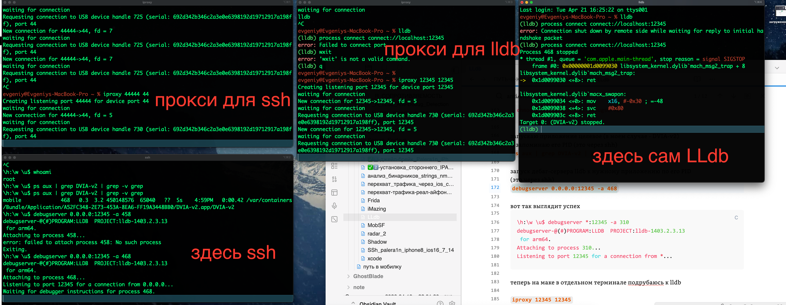
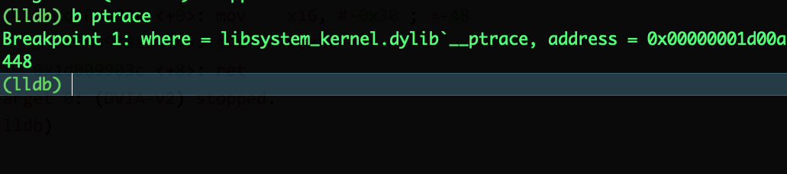
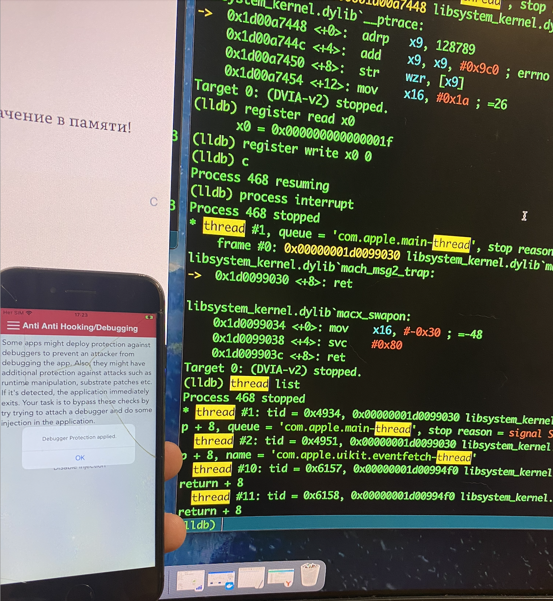

-R-LLDB-СОПРОТИВЛЯЕМОСТЬ
# 1️⃣
### вот что должно уметь делать приложение, чтобы детектить угрозы, (ЭТО ОБЩЕЕ ПО ВСЕМ ТЕСТАМ НА СОПРОТИВЛЯЕМОСТЬ РЕВЕРСУ)

**🟢 1. Джейлбрейк-детект**

- **Файлы/Папки:** Проверять наличие путей: `/Applications/Cydia.app`, `/private/var/lib/apt/`, `/bin/bash`, `/usr/sbin/sshd`
    
- **Схемы URL:** Проверять, можно ли открыть `cydia://`, `sileo://`, `zbra://` через `UIApplication.shared.canOpenURL`
    
- **Тест на "песочницу":** Попытаться записать файл в `/private/`. Если запись удалась - джейлбрейк есть
    

**🟢 2. Подключенный отладчик** 

- **`ptrace`:** Вызвать `ptrace(PT_DENY_ATTACH, 0, 0, 0)`. Если после этого к приложению нельзя подключиться отладчиком - защита работает.
    
- **`sysctl`:** Запросить через `sysctl` флаги процесса и проверить бит `P_TRACED`. Если он установлен - значит приложение под отладкой
    
- **`getppid`:** Проверить ID родительского процесса. Если он не равен `1` (launchd), приложение могло быть запущено отладчиком.
    

**🟢 3. Саму Frida** 

- **Скан библиотек:** Проверить загруженные в память `.dylib` через `_dyld_image_count` и `_dyld_get_image_name`. Искать имена: `FridaGadget`, `frida-agent`, `cynject`
    
- **Проверка портов:** Попытаться подключиться к `127.0.0.1:27042` (дефолтный порт Frida). Если порт открыт - Frida запущена
   
- **Переменные окружения:** Проверить наличие `DYLD_INSERT_LIBRARIES`
   
- **Скан памяти:** Искать в памяти регионы с правами RWX (чтение/запись/исполнение), характерные для хуков
   

**🟢 4. Перехват трафика (MITM)** 

- **SSL Pinning:** "Зашить" в приложение хэш публичного ключа (`pubkey`) или всего сертификата настоящего сервера. Сверять его при каждом рукопожатии, спасет от перехвата трафика
   
- **Доверие к сертификатам:** В `Info.plist` принудительно запретить доверять пользовательским сертификатам (тем, что подсовывает Burp или Charles)
   

**🟢 5. Эмулятор/Симулятор** 

- **Проверка архитектуры (для симулятора):** Макрос `#if targetEnvironment(simulator)`. Проверяет, собрано ли приложение для x86_64 (Mac), а не для arm64 (iPhone)
   
- **Проверка железа:** Обратиться к `uname` или `sysctl hw.machine`. Если возвращается `x86_64`или отсутствуют типичные железные датчики (акселерометр, гироскоп) - это симулятор
   

**🟢 6. Факт переподписи (Re-signing)** 

- **Проверка хэша исполняемого файла:** Посчитать хэш (SHA256) своего бинарного файла и сверить с "родным", сохраненным в памяти или на сервере
   
- **Проверка бандла:** Убедиться, что `Bundle.main.bundleIdentifier` соответствует ожидаемому
   
- **Валидация сертификата:** Сравнить текущий сертификат подписи (через `SecCodeCopySelf` и `SecCodeCheckValidity`) с "родным" сертификатом разработчика


------
# 2️⃣
**Приложение должно уметь отвечать на подключение отладчика.** По стандарту OWASP MASVS ожидается одна из реакций:

- **Предупреждение пользователя:** Например, банк может показать сообщение: "На вашем устройстве запущена отладка, это небезопасно Продолжайте на свой страх и риск"
    
- **Аварийное завершение:** Приложение просто молча закрывается (`exit(0)`)
    
- **Уничтожение данных:** Самый жесткий вариант. Приложение удаляет все чувствительные данные (токены, кэш, данные из Keychain), чтобы они не достались хакеру
    
- **Отправка отчета на сервер:** Приложение тихо сообщает на бэкенд о попытке взлома для системы фрод-мониторинга


--------

**"ПРОВАЛЕН" (FAIL) ставится, если:**

 Приложение **никак не реагирует** на подключение отладчика (нет ни краша, ни сообщения).
   
 Защита есть, но **обходится тривиально** (например, одним хуком на `ptrace` или пропатчиванием одного байта в бинарнике).
    

 **""ПРОЙДЕН" (PASS) ставится, если:**

 Приложение обнаруживает отладку и корректно на нее реагирует (закрывается или сообщает пользователю).
   
 И механизмы защиты достаточно сложны, чтобы их обход занял у квалифицированного специалиста значительное время и потребовал написания кастомных инструментов.

-------

# 🍺 ПРИСТУПАЮ К ТЕСТУ

нужен  rootful режим
`palera1n --force-revert -f`
`palera1n -c -f`
`palera1n -f`

ставлю Sileo
потом
качаю ресурс https://apt.procurs.us/
**Sileo** → поиск → `debugserver-16` → установить (16й - так как ios у меня 16)

debugserver - который я только что установил через sileo по умолчанию не может подключаться к любому приложению на телефоне, поэтому:
ему нужен файл **entitlements** - который даст для debugserver право подключаться к любому процессу!!! 


подрубаю ssh
(подробнее про это вот тут 👉- >> [[SSh_palera1n_iphone8_ios16_7_14]])

перв терминал
`iproxy 44444 44`
второй терминал
`ssh -p 44444 root@localhost`


после подключения
ищу свое нужное мне приложение `ps aux | grep DVIA-v2`
```bash
evgeniy@Evgeniys-MacBook-Pro ~ % ssh -p 44444 root@localhost
root@localhost's password:
\h:\w \u$ ps aux | grep DVIA-v2
mobile             310   0.0  0.0 449455968     16   ??  Ss    4:13PM   0:00.00 /var/containers/Bundle/Application/A52FC348-2E73-453A-8EA6-FF19A3448BB0/DVIA-v2.app/DVIA-v2
root               393   0.0  0.0        0      0 s000  ?+    4:21PM   0:00.00 grep DVIA-v2
\h:\w \u$
```


убедимся, что дебаг сервер стоит на телефоне и виден (это через ssh телефона)
`debugserver --version`

теперь нужно закодировать дебаг сервер (через ssh телефона )
`base64 /usr/libexec/debugserver > /tmp/debugserver.b64`

(можно проверить, создался ли файл `ls -la /tmp/debugserver.b64`)

теперь нужно сделать файл **entitlements** для приложения
на маке создаю файл 
```xml
cat > ~/entitlements.xml << 'EOF'
<?xml version="1.0" encoding="UTF-8"?>
<!DOCTYPE plist PUBLIC "-//Apple//DTD PLIST 1.0//EN" "http://www.apple.com/DTDs/PropertyList-1.0.dtd">
<plist version="1.0">
<dict>
    <key>get-task-allow</key>
    <true/>
    <key>task_for_pid-allow</key>
    <true/>
</dict>
</plist>
EOF
```


теперь качаю на мак файлы debugserver с телефона и декодирую их (локально в терминале мака)
`ssh -p 44444 root@localhost "cat /tmp/debugserver.b64" | base64 -D > ~/debugserver`

(проверю, перенесся ли файл `ls -la ~/debugserver`)


теперь переподписываю дебаг сервер тем созданным сертификатом
`codesign -s - --entitlements ~/entitlements.xml -f ~/debugserver`

отправляю файл обратно на телефон
`cat ~/debugserver | base64 | ssh -p 44444 root@localhost "base64 -d > /tmp/debugserver"`

теперь в терминале ssh для телефона
заменяю файл, декодирую и запускаю дебаг сервер
```c
cp /tmp/debugserver /usr/libexec/debugserver
chmod 755 /usr/libexec/debugserver
```

запускаю приложение целевое (в моем случае - DVIA-v2)
и запоминаю его PID (это через shh)
`ps aux | grep DVIA-v2 | grep -v grep`

запуск дебаг-сервера lldb к нужному приложению по его PID
(это через shh)
`debugserver 0.0.0.0:12345 -a 468`

вот так выглядит успех
```c
\h:\w \u$ debugserver *:12345 -a 310
debugserver-@(#)PROGRAM:LLDB  PROJECT:lldb-1403.2.3.13
 for arm64.
Attaching to process 310...
Listening to port 12345 for a connection from *...
```

теперь на маке в отдельном терминале подрубаюсь к lldb

`iproxy 12345 12345`
и в еще одном терминале
```q
lldb
process connect connect://localhost:12345
```

итого - 4 терминала

терминал с iproxy для ssh
терминал с shh айфона
терминал с iproxy для дебагсервера lldb
терминал c LLdb




в самом терминале lldb
после подключения вижу это - значит - успешно все получилось подключить!
```c
(lldb) process connect connect://localhost:12345
Process 468 stopped
* thread #1, queue = 'com.apple.main-thread', stop reason = signal SIGSTOP
    frame #0: 0x00000001d0099030 libsystem_kernel.dylib`mach_msg2_trap + 8
libsystem_kernel.dylib`mach_msg2_trap:
->  0x1d0099030 <+8>: ret

libsystem_kernel.dylib`macx_swapon:
    0x1d0099034 <+0>: mov    x16, #-0x30 ; =-48
    0x1d0099038 <+4>: svc    #0x80
    0x1d009903c <+8>: ret
Target 0: (DVIA-v2) stopped.
(lldb)
```

теперь можно работать с lldb
наприер, проверить 
`b ptrace`

видно, что брекпоинт есть



теперь можно узнать, вызывает ли приложение его
`c`
но защита не сработала
```q
(lldb) c
Process 468 resuming
(lldb)
```

теперь в приложении DVIA-v2 во вкладке -анти-дебагинг
включаю disable debuggind
и тут же вижу в терминале, как приложение поймало процесс

сработала защита приложения!! и она сработала!! и я поймал места в коде - где используется эта защита!!!!!

```q
Process 468 stopped
* thread #1, queue = 'com.apple.main-thread', stop reason = breakpoint 1.1
    frame #0: 0x00000001d00a7448 libsystem_kernel.dylib`__ptrace
libsystem_kernel.dylib`__ptrace:
->  0x1d00a7448 <+0>:  adrp   x9, 128789
    0x1d00a744c <+4>:  add    x9, x9, #0x9c0 ; errno
    0x1d00a7450 <+8>:  str    wzr, [x9]
    0x1d00a7454 <+12>: mov    x16, #0x1a ; =26
Target 0: (DVIA-v2) stopped.
```

это **`ptrace(PT_DENY_ATTACH)`** - классический антиотладочный метод

теперь нужно посмотреть, че там находится в регистре x0
```q
(lldb) register read x0
      x0 = 0x000000000000001f
```
(это классическая защита apple)
теперь вот так можно обойти защиту
`register write x0 0`
потом
`c`
защита обойдена!!
приложение сделало то - что я ему сказал, подменив значение в памяти!

ответ
```c
(lldb) c
Process 468 resuming
(lldb)
```
чтобы убедиться -  смотрю поток
сперва остановлю процесс `process interrupt`
`thread list`

и вуаля - я виже процессы-потоки, и вообще, lldb работает без проблем!!!!!
И ПРИ ЭТОМ - ПРИЛОЖЕНИЕ ПИШЕТ, ЧТО ЗАЩИТА ВКЛЮЧЕНА ))
НО ПО ФАКТУ - Я ОТКЛЮЧИЛ ЕЕ!


----

# вывод

было обнаружено,
что приложение DVIA-v2 **имеет защиту от отладчика**, реализованную через системный вызов:

```c
ptrace(PT_DENY_ATTACH, 0, 0, 0);
```

Это классический метод блокировки отладчика на iOS/macOS

**Как это работает:**

- `PT_DENY_ATTACH` = 31 (0x1f)
- При вызове этой команды система запрещает любому отладчику (LLDB, GDB) подключаться к процессу
- Если отладчк уже подключен - он будет отключен

### заключение

Приложение DVIA-v2 **обнаруживает отладчик**, но делает это **тривиальным способом**, который обходится одной командой в LLDB:
```c
register write x0 0
```

**Защита не соответствует требованиям OWASP MASVS-RESILIENCE.** Для соответствия стандарту необходимы многоуровневые проверки 
`(ptrace + sysctl + getppid + проверки на Frida)` и активная реакция (краш, удаление данных, отправка сигнала на сервер)

---------