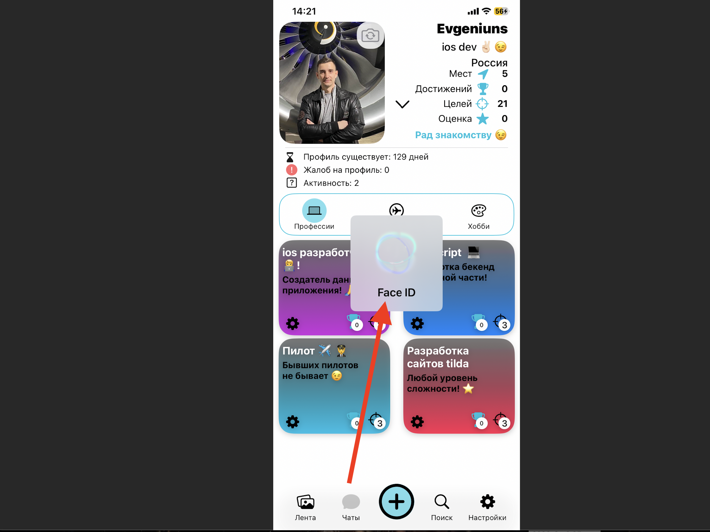
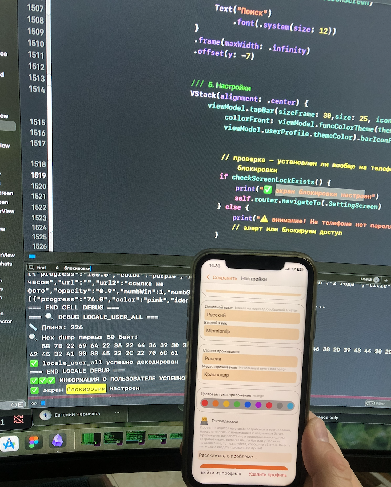
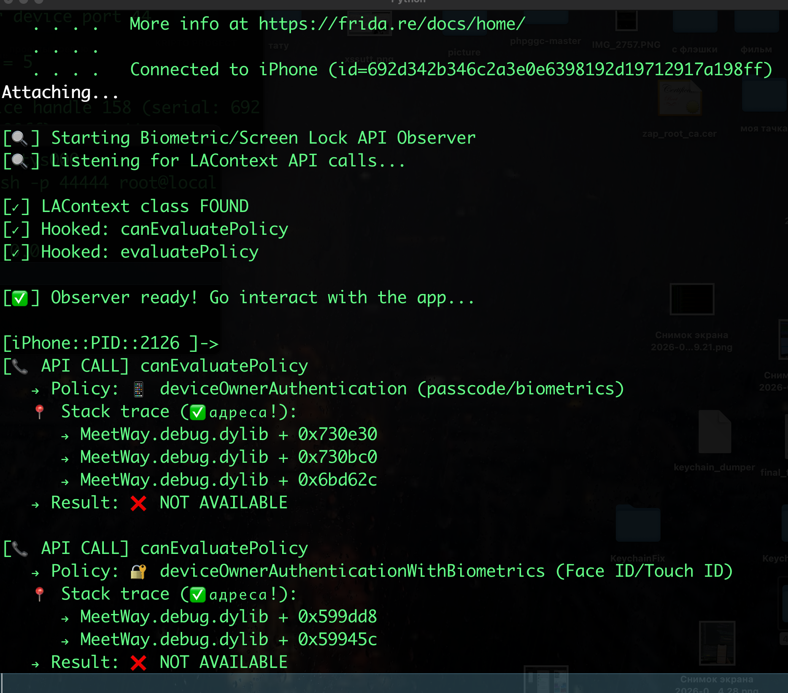
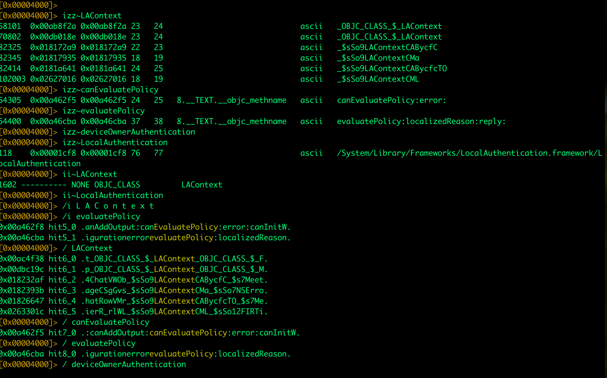

# MASTG-TEST-0246: Runtime Use of Secure Screen Lock Detection APIs  (DAST)

и

# MASTG-TEST-0248: References to APIs for Detecting Secure Screen Lock (SAST)


цели теста 

Проверить, использует ли приложение специальные API для обнаружения **наличия блокировки экрана** (пароль, Face ID, Touch ID) на устройстве. Речь идёт не о самой аутентификации пользователя, а именно о проверке - установлена ли вообще защита на экран блокировки

-------

Если на устройстве НЕТ блокировки экрана (например, пароля или Face ID), то:

- Доступ к данным приложения может получить кто угодно, просто взяв телефон
- Хранение чувствительных данных становится небезопасным
- Политики безопасности многих компаний (и стандарта MASVS) требуют, чтобы приложение проверяло этот момент и реагировало - например, предупреждало пользователя или ограничивало доступ к данным

соответственно, при желании - приложение может требовать перед запуском либо собственный пароль, либо чтобы пользователь установил на телефоне свой пароль

--------

#### Как тестировать (динамически - тест 0246 и статически 0248)


##  DAST       0246

> использует ли приложение специальные API для обнаружения наличия блокировки экрана (пароль, Face ID, Touch ID)

например, через фрида ослеживать вызовы API 
`LAContext.canEvaluatePolicy(.deviceOwnerAuthentication)`
-= это метод из фреймворка LocalAuthentication на iOS
LAContext - класс, который управляет аутентификацией пользователя (Face ID, Touch ID, пароль)

canEvaluatePolicy - метод, который проверяет, можно ли применить ту или иную политику аутентификации на этом устройстве

deviceOwnerAuthentication - это политика, которая означает "аутентификация владельца устройства". Она может быть выполнена через Face ID, Touch ID или просто ввод кода-пароля устройства


и искать данные сохраненные с атрибутами:
`kSecAccessibleWhenPasscodeSetThisDeviceOnly`
это означает, что доступ к данным в связке ключей возможен только когда устройство заблокировано паролем

это может быть использовано - например, в банковском приложении - перед выполнением денежного перевода , типо попросить Face ID, Touch ID или пароль от самого телефона

## SAST   0248


Найти в бинарнике приложения ссылки на API, которые проверяют наличие блокировки экрана

цели поиска:

**Цель 1** - `LAContext.canEvaluatePolicy(.deviceOwnerAuthentication)`  
**Цель 2** - данные, сохранённые с `kSecAccessibleWhenPasscodeSetThisDeviceOnly` 


через радар
```q
[0x00000000]> izz~LAContext
[0x00000000]> izz~canEvaluatePolicy
[0x00000000]> izz~deviceOwnerAuthentication
[0x00000000]> izz~kSecAttrAccessibleWhenPasscodeSetThisDeviceOnly
```

через string
```c
strings MeetWay.debug.dylib | grep -iE "LAContext|canEvaluatePolicy|deviceOwnerAuthentication|kSecAttrAccessibleWhenPasscodeSetThisDeviceOnly"
```


-------

##### полную картину можно увидеть только при совокупности SAST + DAST

так как  = может радар и найдет вызовы нужных сигнатур - но динамически - может это и не проверяется

---------


## ⭐️ начинаю тест ⭐️

буду использовать приложение (нажать для просмотра) [[0_MeetWay]] - это соц-сеть

на данный момент - в приложении не реализованы подобные методы защиты, поэтому я добавлю следующее:

для доступа к экрану с чатами - проверку  Face ID / Touch ID

и для доступа к экрану настроек профиля - защиту - проверку на наличие установленной в айфоне обычной блокировки экрана, то есть нужно ли разблокировать телефон перед использованием или нет. если защита  стоит - хорошо, если нет - заблокировать доступ или показать аллерт

-------

код который требует Face ID / Touch ID

(я не устанавливаю ни обфускацию - ни шифрование - ни запутывание логики, так как все в учебных целях)

```swift
import LocalAuthentication

func authenticateUser(completion: @escaping (Bool) -> Void) {
    let context = LAContext()
    var error: NSError?
    
    if context.canEvaluatePolicy(.deviceOwnerAuthenticationWithBiometrics, error: &error) {
        let reason = "Пожалуйста, авторизуйтесь для доступа к приложению"
        
        context.evaluatePolicy(.deviceOwnerAuthenticationWithBiometrics, localizedReason: reason) { success, authError in
            DispatchQueue.main.async {
                if success {
                    print("✅ Аутентификация успешна!")
                    completion(true)
                } else {
                    print("❌ Ошибка: \(authError?.localizedDescription ?? "Unknown error")")
                    // показать аллеертик
                    completion(false)
                }
            }
        }
    } else {
        print("❌ Биометрия не настроена")
         // показать аллеертик
        completion(false)
    }
}
```

вызову эту функцию в onAppear экрана чатов

```q

authenticateUser { isAuthenticated in
     if isAuthenticated {
        print("✅ доступ разрешен")
     } else {
        print("❌ доступ запрещен - выкидываю обратно на главный экран")
		  router.navigateTo(.FirstScrin)
		  // конечно - нужно бы и аллерт добавить
      }
}
```

в инфо плист - добавил - Privacy - Face ID Usage Description
с "Приложение использует Face ID для защиты ваших чатов и личной информации"


теперь запущу приложение и проверю работу кода:

все работает - теперь при открытии экрана с чатами - телефон просит Face ID
и если не показать ему лицо, или если не настроено - то выкидывает обратно на главный экран




----------

код функции проверки, установлена ли вообще на телефоне блокировка экрана

(я не устанавливаю ни обфускацию - ни шифрование - ни запутывание логики, так как все в учебных целях)

```swift
import LocalAuthentication

func checkScreenLockExists() -> Bool {
    let context = LAContext()
    var error: NSError?
    
    // Проверяем, настроена ли защита экрана (пароль, Face ID, Touch ID)
    return context.canEvaluatePolicy(.deviceOwnerAuthentication, error: &error)
}

--------------

вызову метод при попытке открыть экран настроек

if checkScreenLockExists() {
    print("✅ Экран блокировки настроен")
} else {
    print("⚠️ Внимание! На телефоне нет пароля!")
    // алерт или блокируем доступ
}

```

вызову эту функцию во viewDidLoad экрана настроек профиля приложения

проверяю  - все работает как надо! 
в логах вижу ✅ экран блокировки настроен
если защита на экране блокировки стоит ,  то меня пускает на экран настроек , если нет - то выбрасывает на предыдущий экран




-------


теперь быстро ставлю это приложение на айфон 8 ios 16.7.14 c джейлбрейком (там ни паролей, ни face id  - ничего не установлено)

беру сборку здесь (так как до этого я ставл на обычный айфон - то дебаг сборка есть здесь)
`~/Library/Developer/Xcode/DerivedData`

беру бинарник app
и пересобираю его в .ipa

```shell
cd ~/Desktop/4343434
mkdir Payload
cp -R MeetWay.app Payload/
zip -r MeetWay.ipa Payload/
rm -rf Payload
```

и закидываю ipa на айфон 

---------

✅проверяю работу защиты  на телефоне без паролей и ни face id

в чаты зайти не получается - так как установлен запрос на face id  - но он не настроен

и на экран настроен - тоже попасть не получается

ОТЛИЧНО - эта базовая защита работает без проблем!!!

----------

### начинаю тест 0246 - динамически через фриду найду вызовы функций

#### запускаю фрида

подрубаю фриду к айфону, там уде все настроено и готово - стоит и фрида и паралель и все че надо
 подробнее о настройке - можно найти в папке `tools`

подрубаю ssh для удобства

перв терминал
`iproxy 44444 44`
второй терминал
`ssh -p 44444 root@localhost`
стандарт пароль: alpine

на айфоне - сервер фриды
`sudo frida-server -l 0.0.0.0 `
Пароль: alpine

и после ввода пароля - терминал завис, типо это так и должно быть
и его нужно просто свернуть, но не закрывать

теперь на маке подкл
`frida-ps -H 192.168.0.107`


ЗАПУСКАЮ ПРИЛОЖЕНИЕ НА АЙФОНЕ

нахожу бандл айди или  pid

`frida-ps -Uai`
MeetWay         AIVARO22-2025-1.0
2078   MeetWay

или    frida-ps -Ua
i | grep MeetWay


готовлю скрипт 


```q
cat > ~/block-setup-ssl.js << 'ENDOFSCRIPT'


console.log("\n[🔍] Starting Biometric/Screen Lock API Observer");
console.log("[🔍] Listening for LAContext API calls...\n");

try {
    var LAContext = ObjC.classes.LAContext;
    
    if (LAContext) {
        console.log("[✓] LAContext class FOUND");
        
        // нook canEvaluatePolicy
        var canEvaluate = LAContext["- canEvaluatePolicy:error:"];
        Interceptor.attach(canEvaluate.implementation, {
            onEnter: function(args) {
                var policy = args[2].toInt32();
                var policyName = {
                    1: "🔐 deviceOwnerAuthenticationWithBiometrics (Face ID/Touch ID)",
                    2: "📱 deviceOwnerAuthentication (passcode/biometrics)",
                    3: "⌚️ deviceOwnerAuthenticationWithWatch"
                }[policy] || `unknown(${policy})`;
                
                console.log(`\n[📞 API CALL] canEvaluatePolicy`);
                console.log(`   → Policy: ${policyName}`);
                
                // Упрощённый stack trace (без DebugSymbol)
                console.log("   📍 Stack trace (✅адреса!):");
                var trace = Thread.backtrace(this.context, Backtracer.ACCURATE);
                for (var i = 0; i < Math.min(trace.length, 5); i++) {
                    var addr = trace[i];
                    var module = Process.findModuleByAddress(addr);
                    if (module && module.name.indexOf("MeetWay") !== -1) {
                        var offset = addr.sub(module.base);
                        console.log(`      → ${module.name} + 0x${offset.toString(16)}`);
                    }
                }
            },
            onLeave: function(retval) {
                var result = retval.toInt32() ? "✅ AVAILABLE" : "❌ NOT AVAILABLE";
                console.log(`   → Result: ${result}`);
            }
        });
        console.log("[✓] Hooked: canEvaluatePolicy");
        
        // Hook evaluatePolicy
        var evaluate = LAContext["- evaluatePolicy:localizedReason:reply:"];
        Interceptor.attach(evaluate.implementation, {
            onEnter: function(args) {
                var policy = args[2].toInt32();
                var reason = ObjC.Object(args[3]);
                console.log(`\n[🔐 BIOMETRIC AUTH] evaluatePolicy called!`);
                console.log(`   → Policy: ${policy == 2 ? 'deviceOwnerAuthentication' : 'biometrics'}`);
                console.log(`   → Reason: "${reason}"`);
            }
        });
        console.log("[✓] Hooked: evaluatePolicy");
        
        console.log("\n[✅] Observer ready! Go interact with the app...\n");
    } else {
        console.log("[❌] LAContext not found");
    }
} catch(e) {
    console.log(`[❌] Error: ${e.message}`);
}

ENDOFSCRIPT
```
подсасываюсь к процессу приложения 

`frida -U 2126 -l ~/block-setup-ssl.js`

нажимаю на кнопку чата
фрида ловит процесс

```q
[📞 API CALL] canEvaluatePolicy
   → Policy: 🔐 deviceOwnerAuthenticationWithBiometrics (Face ID/Touch ID)
   📍 Stack trace (✅адреса!):
      → MeetWay.debug.dylib + 0x599dd8
      → MeetWay.debug.dylib + 0x59945c
   → Result: ❌ NOT AVAILABLE

```
deviceOwnerAuthenticationWithBiometrics - это политика - которая требует биометрию + я вижу адереса, и проверку можно обойти!


отлично 

отпущу вызов на свободу 

%resume

теперь попробую попасть на экран настроек

и вижу 

```q
[iPhone::PID::2126 ]->
[📞 API CALL] canEvaluatePolicy
   → Policy: 📱 deviceOwnerAuthentication (passcode/biometrics)
   📍 Stack trace (✅адреса!):
      → MeetWay.debug.dylib + 0x730e30
      → MeetWay.debug.dylib + 0x730bc0
      → MeetWay.debug.dylib + 0x6bd62c
   → Result: ❌ NOT AVAILABLE

```

`deviceOwnerAuthentication` - это проверка: **"Установлен ли на телефоне пароль / Face ID / Touch ID** - НЕ УСТАНОВЛЕН
++ я вижу адереса, и проверку можно обойти!


тыкаю экран чатов и экран настроек

результаты:

✅ тест  0246 выполнен успешно - защита найдена!
но защита банальная (я умышлено не устанавливал обфускацию и запутывание логики) , но даже если ее настроить - то прослушивая вызовы - все равно можно будет обойти это




-----------


### начинаю тест 0248 - статически через радар2 найду сигнатуры функций

открываю бинарник через радар 2
ls -la
41606464 29 апр 14:31 MeetWay.debug.dylib

`r2 -A ./MeetWay.debug.dylib`

начинаю поиск 
```

 ПОИСК СТРОК (izz)


# Основные API
izz~LAContext
izz~canEvaluatePolicy
izz~evaluatePolicy
izz~deviceOwnerAuthentication
izz~LocalAuthentication

# Все варианты политик
izz~deviceOwnerAuthenticationWithBiometrics
izz~deviceOwnerAuthenticationWithWatch
izz~biometricsCurrentSet
izz~biometryAny
izz~biometryLockout

# Keychain атрибуты (для проверки блокировки экрана)
izz~kSecAttrAccessibleWhenPasscodeSetThisDeviceOnly
izz~kSecAttrAccessibleWhenUnlockedThisDeviceOnly
izz~kSecAttrAccessibleAfterFirstUnlockThisDeviceOnly

# Сообщения об ошибках и строки LocalAuthentication
izz~Face ID
izz~Touch ID
izz~пароль телефона
izz~биометри
izz~локешн аутентикейшн

# Связанные классы и протоколы
izz~LAPolicy
izz~LABiometryType
izz~LABiometryFallback
izz~LocalAuthentication.framework

### ПОИСК В ДВОИЧНОМ КОДЕ (/)
# Прямой поиск байт-последовательностей
/ LAContext
/ canEvaluatePolicy
/ evaluatePolicy
/ deviceOwnerAuthentication
/ LocalAuthentication
/ kSecAttrAccessibleWhenPasscodeSet

# Поиск с учётом регистра (если нужно)
/i L A C o n t e x t
/i evaluatePolicy

# Поиск UTF-16 строк (если строки в Unicode)
/ // L A C o n t e x t


### ПОИСК ИМПОРТОВ (ii)
# Импорты из LocalAuthentication
ii~LAContext
ii~LocalAuthentication

# Импорты из Security.framework (Keychain)
ii~SecAccessControlCreateWithFlags
ii~SecItemAdd
ii~SecItemUpdate
ii~kSecAttrAccessible

# Системные вызовы
ii~canEvaluatePolicy
ii~evaluatePolicy

```

ну а потом можно и ссылки смотреть
axt @0x002345....
и секции
x
...

РЕЗУЛЬТАТЫ АНАЛИЗА через радар2



найдено:
```q

[0x00004000]> izz~LAContext
58101  0x00ab8f2a 0x00ab8f2a 23   24                              ascii   _OBJC_CLASS_$_LAContext
70802  0x00db018e 0x00db018e 23   24                              ascii   _OBJC_CLASS_$_LAContext
82325  0x018172a9 0x018172a9 22   23                              ascii   _$sSo9LAContextCABycfC
82345  0x01817935 0x01817935 18   19                              ascii   _$sSo9LAContextCMa
82414  0x0181a641 0x0181a641 24   25                              ascii   _$sSo9LAContextCABycfcTO
102003 0x02627016 0x02627016 18   19                              ascii   _$sSo9LAContextCML
[0x00004000]> izz~canEvaluatePolicy
54305  0x00a462f5 0x00a462f5 24   25   8.__TEXT.__objc_methname   ascii   canEvaluatePolicy:error:
[0x00004000]> izz~evaluatePolicy
54400  0x00a46cba 0x00a46cba 37   38   8.__TEXT.__objc_methname   ascii   evaluatePolicy:localizedReason:reply:
[0x00004000]> izz~deviceOwnerAuthentication
[0x00004000]> izz~LocalAuthentication
118    0x00001cf8 0x00001cf8 76   77                              ascii   /System/Library/Frameworks/LocalAuthentication.framework/LocalAuthentication
[0x00004000]> ii~LAContext
1602 ---------- NONE OBJC_CLASS         LAContext
[0x00004000]> ii~LocalAuthentication
[0x00004000]> /i L A C o n t e x t
[0x00004000]> /i evaluatePolicy
0x00a462f8 hit5_0 .anAddOutput:canEvaluatePolicy:error:canInitW.
0x00a46cba hit5_1 .igurationerrorevaluatePolicy:localizedReason.
[0x00004000]> / LAContext
0x00ac4f38 hit6_0 .t_OBJC_CLASS_$_LAContext_OBJC_CLASS_$_F.
0x00dbc19c hit6_1 .p_OBJC_CLASS_$_LAContext_OBJC_CLASS_$_M.
0x018232af hit6_2 .4ChatVWOb_$sSo9LAContextCABycfC_$s7Meet.
0x0182393b hit6_3 .ageCSgGvs_$sSo9LAContextCMa_$sSo7NSErro.
0x01826647 hit6_4 .hatRowVMr_$sSo9LAContextCABycfcTO_$s7Me.
0x0263301c hit6_5 .ierR_rlWL_$sSo9LAContextCML_$sSo12FIRTi.
[0x00004000]> / canEvaluatePolicy
0x00a462f5 hit7_0 .:canAddOutput:canEvaluatePolicy:error:canInitW.
[0x00004000]> / evaluatePolicy
0x00a46cba hit8_0 .igurationerrorevaluatePolicy:localizedReason.

```

✅ тест  0248 выполнен успешно - защита найдена! + через динамический анализ выше = еще и убедился - что эти методы рабочие и динамически вызываются
класс LAContext -   есть в бинарнике

методы canEvaluatePolicy и evaluatePolicy - найдены
   
фреймворк LocalAuthentication - подключёны

API для проверки блокировки экрана присутствуют в коде

---------

# выводы 🏆

оба теста 

 MASTG-TEST-0246: Runtime Use of Secure Screen Lock Detection APIs  (DAST)
 ✅ Перехвачен реальный вызов canEvaluatePolicy
и
 MASTG-TEST-0248: References to APIs for Detecting Secure Screen Lock (SAST)
✅ Найдены LAContext, canEvaluatePolicy, evaluatePolicy

выполнены полностью!

++ ко всему - настроил в коде реализацию данных методов

если конечно, это все дело обфусцировать....

чтобы максимально усложнить жизнь - то можно было бы сделать так защиту:

1 - обфускация имен
2 - шифрование  XOR для строк - которые ищет приложение (типо frida..итп) строки поиска типа /Applications/Cydia.app, cydia://...
3 - путать логику в функция
4 - сделать чтобы функция проверки детекции возвращала не false/true а какие - то обфусцированные буквы или назвать существующими безобидными именами классов/методов
5 - сделать несколько урвоней защиты от джейл - брейка, несколько функция - в разных местах кода с разными сигнарурами и обфускациями, и динамически вызывать эти методы в разных местах
6 - удалять данные сохраненные в приложении при обнаружении детекции
7 - менять логику функции так , чтобы не этой логике были завязаны и другие функции  - без которых приложение не запустилось бы, напрмиер функции  показа стартовых экранов или этапа авторизации, и тогда - даже при обходе функции детекта - все крашилось бы
8 - вызов функции детекта - в разных местах кода
9- - ну и добавить кодтроль хеша + контроль целостности подписи

---------------