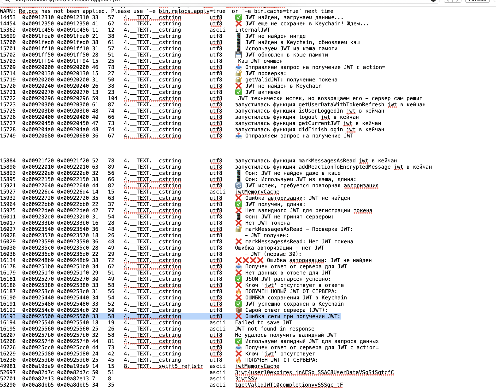
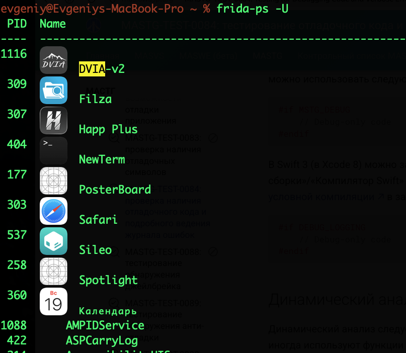

# MASTG-TEST-0084: тестирование отладочного кода и подробного ведения журнала ошибок

в данном тесте:
провел анализ бинарника
и 
выполнил перехват логов динамически с помощью frida

-----
то есть, нужно проверить , в основном статически, не остались ли в коде где-то строки принтов/логов` "(print|println|dump|NSLog|debug|log|error|api_?key|secret|token|password|http://|https://|admin|staging|//|.log|.txt|.debug|crash_*.plist|///|/*|/**|os_log|DLog|debugPrint|#ifdef|AssertConfiguration)|#if"` , и если там есть что-то важное, отладочная инфа, или если выводятся токены, пароли, то это критично, так как во первых, в файлах логов это может остаться - и можно вытащить это, или через фрида просмотреть в динамике - как выводятся данные в логи. 
даже если там мелочи есть - то может быть подсказкой для злоумышленника, поэтому, нужно все очищать

также нужно проверить все виды комментариев в коде
виды комментов в swift:
```swift
//
///
/*
/**
любой комментарий в Swift = строка в бинарнике
поэтому - нужно искать все совпадения и проверять
```

-------

способы тестирования:

1) если есть доступ к исходнику - то прямо в xcode искать 
` "(print|println|dump|NSLog|debug|log|error|api_?key|secret|token|os_log|password|log.debug|http://|https://|admin|staging|//|.log|.txt|.debug|crash_*.plist|///|/*|/**|os_log|DLog|debugPrint|#ifdef|AssertConfiguration|#if)"`
запустить на телефоне и смотреть, что выводится в консоль, также запустить симулятор и проверить логи через него.

2) статически проверить бинарник на наличие этих же строк и проанализировать их

3) динамически через фрида, перехватывать записи и выводы логов - тыкая приложение (двойные нажатия, все кнопочки и функции, длительные нажатия, все , что только можно) 

4) статически через бекап, могли туда сохраниться динамические логи в журналы

----------------------------

#### приступаю к тестированию

тестирование на приложении MeetWay
👉 (о приложении) [[0_MeetWay]]

# 🟣 буду проводить анализ бинарника

перехожу в папку 
`cd ~/Desktop/MeetWay.app/`

гляну- че там есть, чтобы найти главный исполняемый файл, в нем весь код

```c
MacBook-Pro MeetWay.app % ls -la
total 124904
-rwxr-xr-x   1 evgeniy  staff     35024  9 апр 10:07 __preview.dylib
drwxr-xr-x   3 evgeniy  staff        96  7 апр 00:34 _CodeSignature
drwxr-xr-x@ 17 evgeniy  staff       544 14 апр 13:51 .
drwx------@ 42 evgeniy  staff      1344 14 апр 13:56 ..
-rw-r--r--@  1 evgeniy  staff         0 11 апр 10:39 aaaa
-rw-r--r--   1 evgeniy  staff     14412  7 апр 01:18 AppIcon60x60@2x.png
-rw-r--r--   1 evgeniy  staff     19132  7 апр 01:18 AppIcon76x76@2x~ipad.png
-rw-r--r--   1 evgeniy  staff  22615696  7 апр 01:19 Assets.car
-rw-r--r--   1 evgeniy  staff     15136  7 апр 00:25 embedded.mobileprovision
drwxr-xr-x  27 evgeniy  staff       864  7 апр 00:34 Frameworks
-rw-r--r--   1 evgeniy  staff       996  7 апр 00:25 GoogleService-Info.plist
-rw-r--r--@  1 evgeniy  staff      5458 14 апр 13:51 Info_readable.plist
-rw-r--r--   1 evgeniy  staff      3717  7 апр 00:26 Info.plist
-rwxr-xr-x   1 evgeniy  staff     91664  9 апр 10:07 MeetWay
-rwxr-xr-x   1 evgeniy  staff  41070784  9 апр 10:07 MeetWay.debug.dylib
-rw-r--r--   1 evgeniy  staff         8  7 апр 00:26 PkgInfo
-rw-r--r--   1 evgeniy  staff     49852  7 апр 00:25 words.txt
```

главн файл MeetWay , совпадает с названием приложения

нужно найти совпадения теперь по ключевым словам этого теста

запускаю рекурсивно по всем папкам в дирректории^ с указанием места
```bash
find . -type f -exec sh -c '
    for file do
        strings "$file" 2>/dev/null | grep -iE "print|println|dump|NSLog|debug|log|error|api.?key|secret|token|password|os_log|DLog|debugPrint|http://|https://|admin|staging|//|\.log|\.txt|\.debug|crash.*\.plist" | head -5 | while read line; do
            echo "В $file: $line"
        done
    done
' sh {} +


```


результаты:  ничего подозрительного string не нашел

-----

пробую через радар2

файл для отчёта
```q

REPORT_FILE=~/Desktop/radare2_scan_results.txt
echo "=== Radare2 Scan Results ===" > "$REPORT_FILE"
echo "Scan date: $(date)" >> "$REPORT_FILE"
echo "======================================" >> "$REPORT_FILE"


find . -type f \( -perm +111 -o -name "*.dylib" \) -exec sh -c '
    for file in "$@"; do
        echo "=== $file ===" >> '"$REPORT_FILE"'
        r2 -q -c "izz | grep -iE \"print|println|dump|NSLog|debug|log|error|api.?key|secret|token|password|os_log|DLog|debugPrint|http://|https://|admin|staging|//|\.log|\.txt|\.debug|crash.*\.plist\" | head -10" "$file" 2>/dev/null >> '"$REPORT_FILE"'
        echo "" >> '"$REPORT_FILE"'
    done
' sh {} +

echo "✅ Резуль сохранён в: $REPORT_FILE"
```

и потом вот так
```q
Last login: Sat Apr 18 19:18:39 on ttys001
evgeniy@Evgeniys-MacBook-Pro ~ % cd /Users/evgeniy/Desktop/MeetWay.app
evgeniy@Evgeniys-MacBook-Pro MeetWay.app % REPORT=~/Desktop/scan_result.txt && echo "=== Scan $(date) ===" > $REPORT && find . -type f \( -perm +111 -o -name "*.dylib" \) -exec sh -c 'echo "=== $1 ===" >> '$REPORT'; r2 -q -c "izz | grep -iE \"[А-Яа-я]|eyJ[A-Za-z0-9_-]+\.|https?://|token|secret|print|NSLog|debug\" | head -15" "$1" 2>/dev/null >> '$REPORT'' _ {} \; && echo "✅ готово: $REPORT"

```

найдены опасные - подозрительные вещи




НАЙДЕНЫ строки

```c
https://stor.yandexcloud.net/baffff-ivafffda/usfff/ - url пути

😡  😡😡😡😡😡  😡//если ошибка входа =

✅ JWT найден, загружаем данные...
🔐 JWT проверка:
 📤 Отправляем запрос на получение JWT с action=
 📱 Фон: Используем JWT из кэша, длина:
  📱 Фон: JWT не принят сервером:
  🔐 markMessagesAsRead - Проверка JWT:
      - JWT получен:
        📦 Сырой ответ сервера (JWT):
❌ Ошибка сети при получении JWT:
Failed to save JWT
🔥 ПОЛУЧЕН JWT ОТ СЕРВЕРА:

```

много всего, и все находится в **`_TEXT.__cstring`**
поэтому я гляну файл **`_TEXT.__cstring`**
Это специальное место в памяти приложения, где компилятор складывает **все строковые константы** (то, что в коде в кавычках)

```c
r2 -q -c "iz" ./MeetWay.debug.dylib > ~/Desktop/cstring_strings.txt
```

и вот тут конечно, много всего нашел

и там капец просто....

```q
РЕАЛ КЛЮЧИ

2811 0x0092be10 trJtSlwefow-TaefieavKwfeVh        # AWS Access Key
2812 0x0092be30 qefCefZwefgs2XIwefupQenfJwefsqeCNLwefjaKtGj17ep2  # AWS Secret Key?

ТОКЕНЫ

1862 0x00920730 🔐 JWT длина:
1863 0x00920750 🔐 JWT первые 50 символов:
1833 0x00920300 запустилась функция getUserDataWithTokenRefresh jwt в кейчан
1837 0x00920450 запустилась функция getCurrentJWT jwt в кейчан
1838 0x009204a0 запустилась функция didFinishLogin jwt в кейчан
1994 0x00921f20 запустилась функция markMessagesAsRead jwt в кейчан
2000 0x00922010 запустилась функция addReactionToEncryptedMessage jwt в кейчан

АДРЕСА

1806 0x0091fde0 https://functions.yandexcloud.net/dqwrgfsfv3wrgidfg34learg
https://storage.yandexcloud.net/baket-ivaaroApp/us/wefWwefsv5KHeuyvfwRGzFv2/1EEBewE4-2fBwe3-4ef6D-9wew-4FwefefwE9D.jpg
1807 0x0091fe20 https://cns.api.ilb.cloud.yandex.net
1839 0x009204f0 https://login.yandex.ru/info?format=json
2740 0x0092b070 http://empretradingsupport.tilda.ws
https://cns.api.ilb.cloud.yandex.net
 arn:aws:sns::wegrgqwrfoaerf:app/APNS_SANDBOX/testSandboxPush

ПУТИ К ИСХОДНИКАМ

1026 0x009173f0 /Users/evgeniy/Desktop/крайняя версия meetWay по тел/IVAARO1 2/IVAARO/MANAGER_S/VideoCompanents.swift
2484 0x00927c20 /Users/evgeniy/Desktop/край версия meetWay по тел/IVAARO1 2/IVAARO/View/searchScreen+chats/chats.swift

ОТЛАДОЧНЫЕ ДАННЫЕ (их нужно динамически искать уже потом )

🔍 Ключ не найден в Keychain или ошибка:
📥 Ключ загружен из Keychain, длина:
 Ключ удален из Keychain:
 Keychain, длина данных:
 ❌ Keychain GET: ОШИБКА или не найдено, статус =
 ✅ Keychain GET: УСПЕХ, длина =
 ❌ ошибка отправки жалобы:
 🔄 Найдено отложенное обновление чата:
 ❌ Локация с id
 id- юзера
 🔍 SEETT CALLED with yandex_id:
 ✅ JWT найден, загружаем данные...
 ❌ JWT еще не сохранен в Keychain! Ждем...
  Последнее: ID:
  ❌ Ошибка на сервере:
  ✅ Сервер подтвердил реакцию:
  📊 Серверные данные - Счетчик:
  🚨 Не удалось обновить реакцию на сервере:
  🎯 Первая загрузка. canLoadMorePosts:
  ✅ Чаты загружены:
  ❌ Ошибка загрузки предпросмотра:
  ❌ Fallback ошибка:
   🔄 Fallback проверка:
   Приложение запущено из push
   ❌ Ошибка создания директории кэша:
   📁 Создана директория кэша:
   ❌ Ошибка сохранения изображения:
   ❌ Ошибка сохранения метаданных:
   ❌ Ошибка при очистке кэша:
   ❌ Ошибка сохранения аудио:
   ⏳ Экспорт видео начат
   💾 Сохраняю видео превью:
   ✅ Видео из кэша:
   ID чата будет:
   📁 Файл:
   📂 Путь:
   ❌ Ошибка обновления чата:
   🆔 Audio UUID:
   📍 Локальный путь:
     📄 Пагинация: lastDocument =
  ❌ Ошибка сериализации данных жалоб:
  ✅✅✅ ДАННЫЕ ЖАЛОБ УСПЕШНО ОБНОВЛЕНЫ В YDB
  📱 Фон: JWT не принят сервером:
  - JWT получен:
    📊 Ключи в ответе:
    ❌ Неверный URL:
    📦 Ответ сервера:
      ❌ Ошибка сети при обновлении активностей:
      ❌ Ошибка дешифрования:
       ❌ Не удалось закодировать маркер пустого сообщения
  
 что - то оч страшное - abcdefghijklmnopqrstuvwxyzABCDEFGHIJKLMNOPQRSTUVWXYZ0123456789йцукенгшщзхъфыывапролджэячсмитьбюЙЦУКЕНГШЩЗХЪФЫВАПРОЛДЖЭЯЧС@_МИТЬБЮ
 
 ❌ Ошибка отправки уведомления:
   ❌ Ошибка регистрации в APNS:
   🔥 FCM Token:
    🔄 Silent push:
    daberbESlfdrc6eod-TSiavsfbVh
    
    contentsOfDirectoryAtURL:includingPropertiesForKeys:options:error:
    creationRequestForAssetFromVideoAtFileURL:
    dictionaryForKey:
    documentWithPath:


```

---------

### ИТОГО по статическому анализу

найдено оч много логов , которые палят инфраструкутру, дирректории , ключи и токены, а также логи - которые в динамике покажут значения токенов и ключей, внутренние АПИ, утечка jwt
и я показал выше только часть того, что я нашел в бинарнике, а вообще общий результат - сотни строк

ТЕСТ - ❌ полностью ПРОВАЛЕН!

Рекомендации:
1. **НЕМЕДЛЕННО**: Оторвать AWS ключи и сгенерировать новые
2. Убрать все `print` и отладочные логи из релизной сборки
3. Переключить сборку на RELEASE режим
4. Настроить Conditional Compilation (`#if DEBUG`)
5. Убрать пути к файлам разработчика из бинарника
6. Добавить обфускацию для критических строк


----------------------------

# исходные данные:

айфон 8 ios 16.7.14
джейлбрейк palera1n
фрида уже стоит
стоит терминал NewTerm2
скачал и установил само приложение DVIA-v2

подробнее посмотреть о том, как ставил джейл-брейк, устанавливал приложение и запускал фрида - можно здесь
[[✅1️⃣-джейл-брейк_Palera1n_iPhone8_ios16.7.14_macOS]]
и вот здесь
[[✅2️⃣-установка_стороннего_IPA-DVIA_+FRIDA_с_джейлбреком]]

само приложение
https://github.com/prateek147/DVIA-v2/raw/refs/heads/master/DVIA-v2.ipa


---------------
# 🟣 теперь я проведу динамический анализ логов приложения DVIA-v2

исходные данные:

айфон 8 ios 16.7.14
джейлбрейк palera1n
фрида уже стоит
стоит терминал NewTerm2
скачал и установил само приложение DVIA-v2

подробнее посмотреть о том, как ставил джейл-брейк, устанавливал приложение и запускал фрида - можно здесь
[[✅1️⃣-джейл-брейк_Palera1n_iPhone8_ios16.7.14_macOS]]
и вот здесь
[[✅2️⃣-установка_стороннего_IPA-DVIA_+FRIDA_с_джейлбреком]]

само приложение
https://github.com/prateek147/DVIA-v2/releases/download/v2.0/DVIA-v2-swift.ipa

----------

запустил фриду через терминал на айфоне 

`sudo frida-server -l 0.0.0.0 `
Пароль: -

и после ввода пароля - терминал завис, типо это так и должно быть
и его нужно просто свернуть, но не закрывать

теперь на маке пробую подключиться
`frida-ps -H 192.168.0.107`


-------
на маке
проверяю `frida-ps -U`

отлично, приложение вижу в запущенных процессах!



новый
```q
cat > ~/Desktop/catch_all_logs.js << 'EOF'
// catch_all_logs.js — перехватываем всё: логи, ошибки, чувствительные данные

// Список функций для перехвата
var functionsToHook = [
    'NSLog',
    'printf',
    'fprintf',
    'fprint',
    'puts',
    'fputs',
    'write',
    'os_log',
    'asl_log',
    'syslog'
];

// Ключевые слова для поиска чувствительных данных
var sensitiveKeywords = [
    'error', 'debug', 'print', 'println', 'dump', 'log',
    'api', 'key', 'secret', 'token', 'password', 'passwd',
    'http://', 'https://', 'admin', 'staging', 'prod',
    '.log', '.txt', '.debug', 'crash', 'plist',
    '//', '/*', '*/', 'auth', 'bearer', 'authorization',
    'cookie', 'session', 'jwt', 'access', 'refresh'
];

// Функция проверки на чувствительные данные
function containsSensitive(str) {
    if (!str) return false;
    var lower = str.toLowerCase();
    for (var i = 0; i < sensitiveKeywords.length; i++) {
        if (lower.indexOf(sensitiveKeywords[i]) !== -1) {
            return true;
        }
    }
    return false;
}

// Функция для безопасного чтения C-строки
function safeReadCString(ptr) {
    try {
        if (ptr && !ptr.isNull()) {
            var str = ptr.readCString();
            return str ? str : '';
        }
    } catch(e) {}
    return '';
}

// Функция для безопасного чтения Objective-C объекта
function safeReadObjC(obj) {
    try {
        if (obj && !obj.isNull()) {
            return ObjC.Object(obj).toString();
        }
    } catch(e) {}
    return '';
}

// 1. Перехват NSLog (Objective-C)
if (ObjC.available) {
    var NSLog = Module.findExportByName("Foundation", "NSLog");
    if (NSLog) {
        Interceptor.attach(NSLog, {
            onEnter: function(args) {
                var format = safeReadObjC(args[0]);
                if (format && containsSensitive(format)) {
                    console.log("[NSLog][SENSITIVE] " + format);
                } else if (format) {
                    console.log("[NSLog] " + format);
                }
            }
        });
        console.log("[+] NSLog перехвачен");
    }
}

// 2. Перехват printf
var printfPtr = Module.findExportByName(null, 'printf');
if (printfPtr) {
    Interceptor.attach(printfPtr, {
        onEnter: function(args) {
            var format = safeReadCString(args[0]);
            if (format && containsSensitive(format)) {
                console.log("[printf][SENSITIVE] " + format);
            } else if (format) {
                console.log("[printf] " + format);
            }
        }
    });
    console.log("[+] printf перехвачен");
}

// 3. Перехват puts
var putsPtr = Module.findExportByName(null, 'puts');
if (putsPtr) {
    Interceptor.attach(putsPtr, {
        onEnter: function(args) {
            var str = safeReadCString(args[0]);
            if (str && containsSensitive(str)) {
                console.log("[puts][SENSITIVE] " + str);
            } else if (str) {
                console.log("[puts] " + str);
            }
        }
    });
    console.log("[+] puts перехвачен");
}

// 4. Перехват fprintf (в stderr)
var fprintfPtr = Module.findExportByName(null, 'fprintf');
if (fprintfPtr) {
    Interceptor.attach(fprintfPtr, {
        onEnter: function(args) {
            var format = safeReadCString(args[1]);
            if (format && containsSensitive(format)) {
                console.log("[fprintf][SENSITIVE] " + format);
            } else if (format) {
                console.log("[fprintf] " + format);
            }
        }
    });
    console.log("[+] fprintf перехвачен");
}

// 5. Перехват write (stdout/stderr)
var writePtr = Module.findExportByName(null, 'write');
if (writePtr) {
    Interceptor.attach(writePtr, {
        onEnter: function(args) {
            var fd = args[0].toInt32();
            if (fd === 1 || fd === 2) { // stdout или stderr
                var buf = args[1];
                var count = args[2].toInt32();
                if (count > 0 && count < 4096) {
                    try {
                        var content = buf.readCString();
                        if (content && containsSensitive(content)) {
                            console.log("[write(fd=" + fd + ")][SENSITIVE] " + content.trim());
                        } else if (content) {
                            console.log("[write(fd=" + fd + ")] " + content.trim());
                        }
                    } catch(e) {}
                }
            }
        }
    });
    console.log("[+] write перехвачен");
}

// 6. Перехват os_log (iOS 10+)
var os_logPtr = Module.findExportByName(null, 'os_log');
if (os_logPtr) {
    Interceptor.attach(os_logPtr, {
        onEnter: function(args) {
            // os_log сложнее, пытаемся прочитать сообщение
            console.log("[os_log] Вызов обнаружен");
        }
    });
    console.log("[+] os_log перехвачен");
}

// 7. Перехват UIAlertController для сообщений об ошибках
if (ObjC.available) {
    var UIAlertController = ObjC.classes.UIAlertController;
    if (UIAlertController) {
        var alertInit = UIAlertController["+ alertControllerWithTitle:message:preferredStyle:"];
        if (alertInit) {
            Interceptor.attach(alertInit.implementation, {
                onEnter: function(args) {
                    var title = safeReadObjC(args[2]);
                    var message = safeReadObjC(args[3]);
                    if (containsSensitive(title) || containsSensitive(message)) {
                        console.log("[UIAlertController][SENSITIVE] Title: " + title + " | Msg: " + message);
                    } else if (title || message) {
                        console.log("[UIAlertController] Title: " + title + " | Msg: " + message);
                    }
                }
            });
            console.log("[+] UIAlertController перехвачен");
        }
    }
}

console.log("[+] Готово! Перехвачены все функции логирования.");
console.log("[+] Ищем чувствительные данные: " + sensitiveKeywords.join(", "));
EOF
```

```
frida -U -l ~/Desktop/catch_all_logs.js 1296
```

```c
[REAL_LOG] [MainViewController] Error : Connection failed
[REAL_LOG] URL : https://api.wvrrw.com/v3/wrvw
[REAL_LOG] IP : 192.168.1.345624546534563456
IP : %@
URL : %@
[MainViewController] Error : %@
load: _adsCode:%@
JWT токен: %@
```

в процессе динамического анализа перехвачены вызовы `NSLog`, содержащие отладочную информацию: IP-адреса, URL-адреса, рекламные идентификаторы, JWT-токены, данные об ошибках. Формат сообщений содержит плейсхолдеры `%@`, что указывает на подстановку реальных значений в рантайме. Наличие подобных логов в релизной сборке является нарушением MASVS-STORAGE-1 и MASVS-CODE-2

---------


------

далее пытаюсь все таки посмотреть сами значения %@

-------

-------

🍺🟢✅🏆 ПОЛУЧИЛОСЬ!!!

способ 1002
frida-ps -U
frida -U -l ~/Desktop/final_working1002.js 1782

скрипт для фриды
```c
cat > ~/Desktop/final_working1002.js << 'EOF'


if (ObjC.available) {
    var NSString = ObjC.classes.NSString;
    
 
    var initWithFormatArgs = NSString['- initWithFormat:arguments:'];
    if (initWithFormatArgs) {
        Interceptor.attach(initWithFormatArgs.implementation, {
            onEnter: function(args) {
                try {
                    this.format = ObjC.Object(args[2]).toString();
                } catch(e) {}
            },
            onLeave: function(retval) {
                try {
                    if (this.format) {
                        var result = ObjC.Object(retval).toString();
                        
                        // беру ВСЁ что форматировалось через %@ %d %ld и т.д.
                        if (this.format.includes("%")) {
                            console.log(`\n[📝 LOG] ${result}`);
                            
                            // сохр в файл
                            send({
                                type: "log",
                                format: this.format,
                                result: result
                            });
                        }
                    }
                } catch(e) {}
            }
        });
        console.log("[+] Formatted strings hook ACTIVE");
    }
    
    // хук=хуюк 2: UIAlertController для ошибок в попапах
    var UIAlertController = ObjC.classes.UIAlertController;
    if (UIAlertController) {
        var showMethod = UIAlertController['+ alertControllerWithTitle:message:preferredStyle:'];
        if (showMethod) {
            Interceptor.attach(showMethod.implementation, {
                onEnter: function(args) {
                    var title = ObjC.Object(args[2]).toString();
                    var message = ObjC.Object(args[3]).toString();
                    
                    if (message && message.length > 0) {
                        console.log(`\n[📱 ALERT] ${title}: ${message}`);
                        
                        send({
                            type: "alert",
                            title: title,
                            message: message
                        });
                    }
                }
            });
            console.log("[+] Alert dialogs hook ACTIVE");
        }
    }
    
    // хук 3: NSLog только для форматов (без аргументов, но видим что логируется)
    var NSLog = Module.findExportByName("Foundation", "NSLog");
    if (NSLog) {
        Interceptor.attach(NSLog, {
            onEnter: function(args) {
                try {
                    var format = ObjC.Object(args[0]).toString();
                    console.log(`[NSLog] ${format}`);
                } catch(e) {}
            }
        });
        console.log("[+] NSLog monitor ACTIVE");
    }
}

console.log("\n[✅] READY! Watch for [📝 LOG] lines — they contain REAL values!\n");
EOF
```

и вот что из логов я смог вытащить :

```q
ip юзеров

в сеть запросах и просто в логах
IP : 178.178.212.158  

полный url с данными внутри (и другие url)

URL : http://xxxxzzz.fgmob.ch/report.php?bundle=...&ip=178.178.212.158&mess=Q&usageInfos=ewogIsJlazR7IlA6ICLQnNC+0uHQutCy0LAi...

данные юзера передаются открыто - в base 64
включая геолокацию и местоположение!

ewogICJjaXR5IiA6ICLQnNC+0YHQutCy0LAiLAogICJtb2dvX2Fkc19zZGsiIDogIjEuMi4yIiwKICAiZ2VvbmFtZWlkIiA6ICI3NTQyMzYiLAogICJsb25naXR1ZGUiIDogIjE1LjkzNTg2IiwKICAibGF0aXR1ZGUiIDogIjU5Ljk5MjM0IiwKICAibGFuZ3VhZ2UiIDogInJ1IiwKICAibW9nb19zZGsiIDogIjIuMC4yIgp9

в расшифровке это
{
  "city" : "Москва",
  "mogo_ads_sdk" : "1.2.2",
  "longitude" : "15.93586",
  "latitude" : "59.99234",
  "language" : "ru",
  "mogo_sdk" : "2.0.2"
}

аналитика firebase
$ Sent Firebase event : banner_loading

рекламные id в открытом доступе везде
Google Advanced provider
Identifier : ca-app-pub-64638944276027649/12364892654

также видно логику каскадов реклам, можно обойти, и не оплачивать за премиум тариф


```

практически , все это ред флаг сразу с точки зрения безопасности!
в приложении много всего логируется, всключая конфиденциальные данные

---------


## Оценка соответствия MASVS

|Требование|Статус|Комментарий|

|**MASVS-CODE-2**|❌ **FAIL**|Приложение содержит отладочный код в релизной сборке|
|**MASVS-STORAGE-1**|❌ **FAIL**|Конфиденциальные данные логируются в системный журнал|
|**MASVS-NETWORK-1**|❌ **FAIL**|URL с чувствительными параметрами передаются в логах|
|**MASVS-AUTH-4**|❌ **FAIL**|JWT токены и ключи присутствуют в отладочных строках|

---

##  ИТОГО

# ❌ ТЕСТ ПОЛНОСТЬЮ ПРОВАЛЕН ❌

### Статический анализ: **FAIL**

- Найдены AWS ключи в бинарнике
    
- Сотни отладочных строк с упоминанием JWT, Keychain, API endpoints
    
- Пути разработчика раскрывают структуру проекта
    

### Динамический анализ: **FAIL**

- Реальные IP адреса пользователей в логах
    
- Геолокация в открытом виде
    
- Base64 данные с полным профилем пользователя
    
- Рекламные идентификаторы
    
- Полные URL с чувствительными параметрами
    

---

## как все исправить

### 🔴 CRITICAL (Немедленно)

1. **СРОЧНО ОТОЗВАТЬ И ПЕРЕГЕНЕРИРОВАТЬ:**
    
    - AWS Access Key и Secret Key (для MeetWay)
        
    - Все API ключи, найденные в бинарнике
        
2. **Удалить все `NSLog`, `print`, `debugPrint` из релизной сборки**
    
3. **Никогда не логировать:**
    
    - IP адреса
        
    - JWT токены
        
    - Геолокацию
        
    - Полные URL с параметрами
        
    - Base64 данные пользователей
        

### 🟠 HIGH (В ближайшем релизе)

4. **Настроить условную компиляцию:**
    
```swift
    #if DEBUG
    NSLog("Отладка: %@", data)
    #endif
    
```
4. **Перевести логирование на `os_log` с правильными уровнями:**
    
    
```swift
    os_log(.debug, "Только для отладки")  // Не попадает в релиз
    os_log(.error, "Критическая ошибка")  // Только важное
```
    
5. **Удалить пути разработчика из бинарника** (использовать относительные пути)
    

### 🟡 MEDIUM 

7. **Провести аудит всех строк в `_TEXT.__cstring`**
    
8. **Добавить обфускацию для критических строк**
    
9. **Настроить CI/CD проверку на наличие `NSLog` в релизных сборках**


