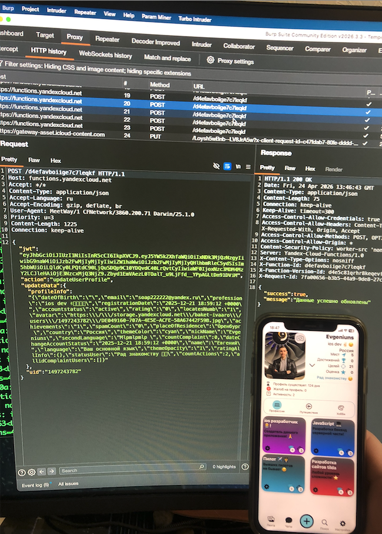
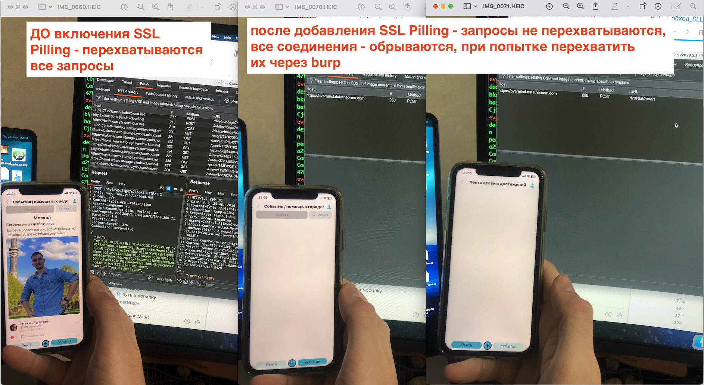
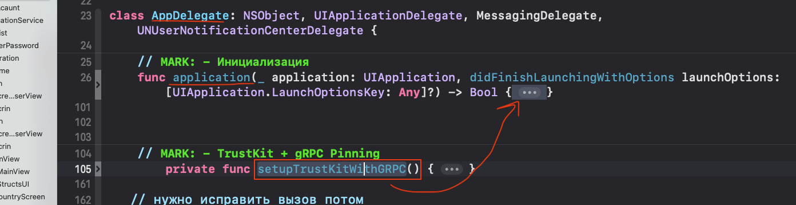
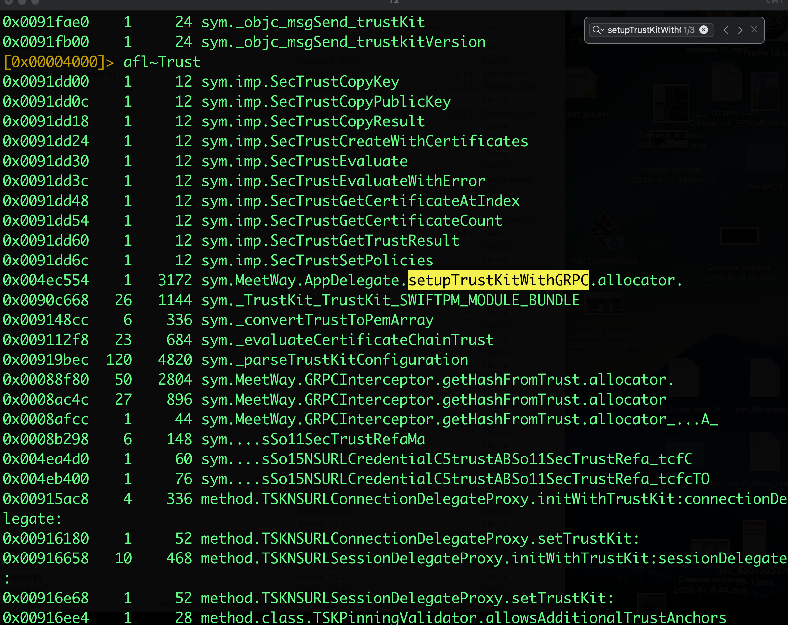
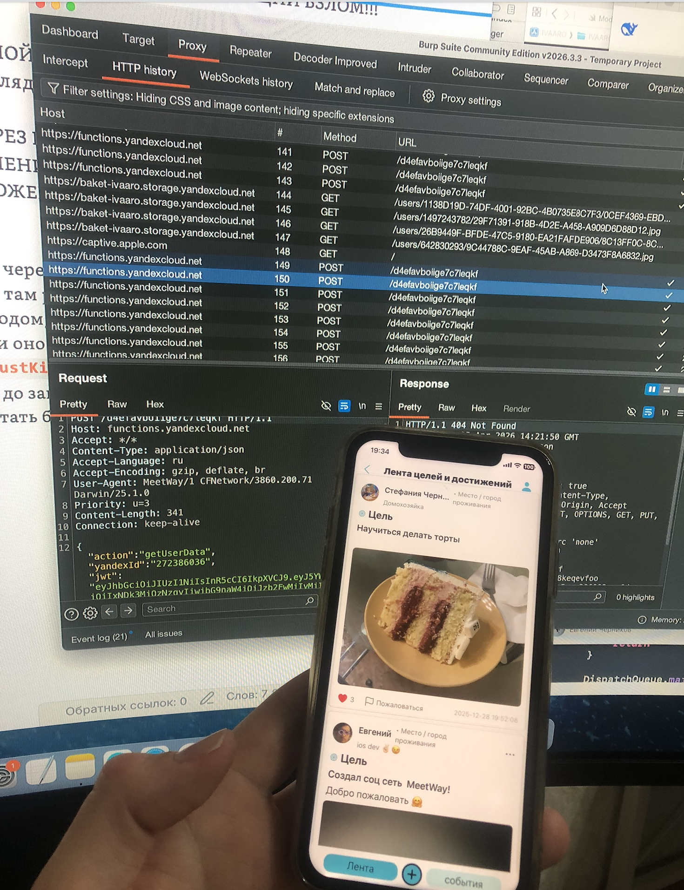

### цель теста - проверить, есть ли защита трафика от поддельных сертификатов, и обойти защиту

-------
тест выполнял на приложении (соц сеть) [[0_MeetWay]]
айфон 11 ios 26.4 без джейлбрейка
в приложении реализованная вот такая тройная защита трафика (TrustKit + GRPCInterceptor + GRPCURLProtocol) 
вот реализация этой защиты : [[Sll_Pinning_ios-meetWay]]

само приложение устанавливаю через xcode

----

# этап 1  (перехват без SSL pinnig)

здесь подробнее про перехват 👉 [[перехват-трафика-реал-айфона-через-WiFi_burp]]

и вот я спокойно могу перехватывать весь трафик своего приложения!



------

вот так реализована защита трафика в приложении  [[Sll_Pinning_ios-meetWay]]

-------

### проверка работоспособности sll pinning

отключил в коде защиту и запустил приложение, + настроил перехват через burp [[перехват-трафика-реал-айфона-через-WiFi_burp]]

и трафик спокойно идет через burp

теперь обратно вернул защиту в коде и запустил приложеине, и вуаля - трафик через burp не идет и блокируется полностью



-------
### установил приложение через xcode [[0_MeetWay]] (в приложении есть Sll pinnig) 

приложение установилось и запустилось на телефоне
иду в finder за бинарником (буду его перепрошивать)
cmd+shift+g
~/Library/Developer/Xcode/DerivedData

нахожу там основную бинарную папку MeetWay.app вес 180мб

смотрю содержимое папки
```q
evgeniy@Evgeniys-MacBook-Pro MeetWay.app % ls -la
total 125504
-rwxr-xr-x   1 evgeniy  staff     35024 24 апр 23:05 __preview.dylib
drwxr-xr-x   3 evgeniy  staff        96 24 апр 19:31 _CodeSignature
drwxr-xr-x@ 16 evgeniy  staff       512 25 апр 15:10 .
drwx------@ 60 evgeniy  staff      1920 25 апр 15:12 ..
-rw-r--r--   1 evgeniy  staff     14412 25 апр 15:10 AppIcon60x60@2x.png
-rw-r--r--   1 evgeniy  staff     19132 25 апр 15:10 AppIcon76x76@2x~ipad.png
-rw-r--r--   1 evgeniy  staff  22615696 25 апр 15:10 Assets.car
-rw-r--r--   1 evgeniy  staff     15136 24 апр 19:30 embedded.mobileprovision
drwxr-xr-x  27 evgeniy  staff       864 24 апр 19:31 Frameworks
-rw-r--r--   1 evgeniy  staff       996 24 апр 19:30 GoogleService-Info.plist
-rw-r--r--   1 evgeniy  staff      3717 24 апр 19:30 Info.plist
-rwxr-xr-x   1 evgeniy  staff     91664 25 апр 15:10 MeetWay
-rwxr-xr-x   1 evgeniy  staff  41387504 25 апр 15:10 MeetWay.debug.dylib
-rw-r--r--   1 evgeniy  staff         8 24 апр 19:30 PkgInfo
drwxr-xr-x   4 evgeniy  staff       128 24 апр 19:33 TrustKit_TrustKit.bundle
-rw-r--r--   1 evgeniy  staff     49852 24 апр 19:30 words.txt
evgeniy@Evgeniys-MacBook-Pro MeetWay.app %
```

из этих папок меня интересует главный бинарник 
91664 25 апр 15:10 MeetWay

в него нужно будет заинжектить  FridaGadget 

## план  
```shell
# 1. качаю insert_dylib (если ещё нет)
git clone https://github.com/tyilo/insert_dylib
cd insert_dylib
xcodebuild

cp build/Release/insert_dylib /usr/local/bin/

# 2. качаю и кидаю в нужную дирректорию FridaGadget
//качаю
curl -L -O https://github.com/frida/frida/releases/download/17.9.1/frida-gadget-17.9.1-ios-universal.dylib.gz

// расспакую/именую
gunzip -k frida-gadget-17.9.1-ios-universal.dylib.gz && mv frida-gadget-17.9.1-ios-universal.dylib frida-gadget.dylib

// проверю, что все ок
ls -lh frida-gadget.dylib


//⭐️🟢😈инжектирую FridaGadget в бинарник MeetWay
insert_dylib --strip-codesig --inplace \
  @executable_path/Frameworks/frida-gadget.dylib \
  /Users/evgeniy/Library/Developer/Xcode/DerivedData/IVAARO-adcrpxpsonfrkahkdzxzzbselvsp/Build/Products/Debug-iphoneos/MeetWay.app/MeetWay
  
  ---------
  копирую в сам бинарник
  
  mkdir -p /Users/evgeniy/Library/Developer/Xcode/DerivedData/IVAARO-adcrpxpsonfrkahkdzxzzbselvsp/Build/Products/Debug-iphoneos/MeetWay.app/Frameworks && \
cp ~/insert_dylib/frida-gadget.dylib /Users/evgeniy/Library/Developer/Xcode/DerivedData/IVAARO-adcrpxpsonfrkahkdzxzzbselvsp/Build/Products/Debug-iphoneos/MeetWay.app/Frameworks/
  
  --------
ТЕПЕРЬ НУЖНО ПЕРЕПОДПИСАТЬ

переподпись фридаГаджета

codesign -f -s "Apple Development" /Users/evgeniy/Library/Developer/Xcode/DerivedData/IVAARO-adcrpxpsonfrkahkdzxzzbselvsp/Build/Products/Debug-iphoneos/MeetWay.app/Frameworks/frida-gadget.dylib

переподпись приложения

codesign -f -s "Apple Development" /Users/evgeniy/Library/Developer/Xcode/DerivedData/IVAARO-adcrpxpsonfrkahkdzxzzbselvsp/Build/Products/Debug-iphoneos/MeetWay.app
  
  проверочка что все на месте
  codesign -dv /Users/evgeniy/Library/Developer/Xcode/DerivedData/IVAARO-adcrpxpsonfrkahkdzxzzbselvsp/Build/Products/Debug-iphoneos/MeetWay.app
  
  вижу Format=app bundle with Mach-O thin (arm64) - все окей!!
  
  
```


ТЕПЕРЬ НУЖНО ЗАПУСТИТЬ ДАННОЕ ПРИЛОЖЕНИЕ ЧЕРЕЗ xcode

то есть - я сперва запустил приложение через xcode - перепатчил его и переподписал (вес бинарной папки увеличился на 30 мб ), затем я запускаю тут же это приложение

проверю что фрида вообще видит процессы 
`frida-ps -Uai`

и да, приложение видит она
1485   MeetWay                  AIVARO22-2025-1.0


нужно обязательно сказать фриде на маке - то - где находится , в то место, в котором фрида его ждет по умолчанию
```shell
mkdir -p ~/.cache/frida && cp ~/insert_dylib/frida-gadget.dylib ~/.cache/frida/gadget-ios.dylib
```

теперь подключаюсь к приложению
```shell
frida -U MeetWay
```

и вуаля ! вижу процесс
```q
evgeniy@Evgeniys-MacBook-Pro ~ % frida -U MeetWay
     ____
    / _  |   Frida 17.9.1 - A world-class dynamic instrumentation toolkit
   | (_| |
    > _  |   Commands:
   /_/ |_|       help      -> Displays the help system
   . . . .       object?   -> Display information about 'object'
   . . . .       exit/quit -> Exit
   . . . .
   . . . .   More info at https://frida.re/docs/home/
   . . . .
   . . . .   Connected to iPhone (id=00008030-000149683EFB802E)

[iPhone::MeetWay ]->
```

##### ОТЛИЧНО! фрида гаджет успешно установлен и коннектится с фридой на маке!


----------

ПРОБУЮ найти вызов первоначальной функции - где инициализируется эта функция которая запускает процессы пиллинга
и в плене - фридой ее заблокировать нахер!


```q
// Ищу AppDelegate через полный Swift-нейминг
var appDelegateClass = null;
for (var className in ObjC.classes) {
    if (className.toLowerCase().includes('appdelegate')) {
        console.log("[FOUND] " + className);
        appDelegateClass = ObjC.classes[className];
    }
}

if (appDelegateClass) {
    console.log("\n[*] AppDelegate methods:");
    var allMethods = appDelegateClass.$ownMethods.concat(appDelegateClass.$ownClassMethods);
    allMethods.forEach(function(m) {
        console.log("  " + m);
    });
} else {
    console.log("[!] AppDelegate not found, searching all classes with 'setup' method...");
    for (var className in ObjC.classes) {
        var cls = ObjC.classes[className];
        var methods = cls.$ownMethods.concat(cls.$ownClassMethods);
        for (var i = 0; i < methods.length; i++) {
            if (methods[i].toLowerCase().includes('trustkit') || 
                methods[i].toLowerCase().includes('grpc') ||
                methods[i].toLowerCase().includes('sslpinning')) {
                console.log("[FOUND] Class: " + className + " -> " + methods[i]);
            }
        }
    }
}
```

че вижу -
```q

[FOUND] GULAppDelegateSwizzler
[FOUND] GULAppDelegateObserver
[FOUND] SwiftUI.TestingAppDelegate
[FOUND] SwiftUI.AppDelegate
[FOUND] MeetWay.AppDelegate

[*] AppDelegate methods:
  - application:didFinishLaunchingWithOptions:
  - application:didRegisterForRemoteNotificationsWithDeviceToken:
  - application:didFailToRegisterForRemoteNotificationsWithError:
  - messaging:didReceiveRegistrationToken:
  - application:openURL:options:
  - userNotificationCenter:willPresentNotification:withCompletionHandler:
  - userNotificationCenter:didReceiveNotificationResponse:withCompletionHandler:
  - init
  undefined
[iPhone::MeetWay ]->
```

и тут я решил уже посмотреть, почему я не вижу среди этих методов свою функцию : которая там точно есть! (то есть я знаю, как выглядит в самом исходном коде эта функция , но здесь я не вижу ее!!!)

и вот в чем дело то

в коде есть функция setupTrustKitWithGRPC
она полностью отвечает за весь sll pinnign в приложении

и если ее вырубить, не запускать - то ничего работать и не будет!

и она вызывается в методе апделегата - didFinishLaunchingWithOptions

и не видно ее при перехвате фридой - потому, что она PRIVATE!!!!
она не видна в ObjC-рантайме!!!



### поэтому - мой новый  план через radar2:

через радар2 - ищу все функции че есть в приложении, нахожу подозрительные , связанные с sllpinning
и проверяю все места в коде - где такая функция встречается, затем, я найду ее название и ее адресс в памяти

и через фриду вырублю эту функцию нахрен!

еду в бинарник
```c
r2 /Users/evgeniy/Library/Developer/Xcode/DerivedData/IVAARO-adcrpxpsonfrkahkdzxzzbselvsp/Build/Products/Debug-iphoneos/MeetWay.app/MeetWay.debug.dyliba

[0x...]> aaa

----------------

afl~   выведу все строки, если начнет бесить (но их там почти 4000 штук, желание отпало так смотреть )
```

делаю пейлоад - список слов - которыми могут в теории называться  функции для SSL/TLS/Pinning

```json
afl~ssl
afl~SSL
afl~tls
afl~TLS
afl~pinning
afl~Pinning
afl~pinn
afl~Pinn
afl~certificate
afl~Certificate
afl~cert
afl~Cert
afl~publicKey
afl~PublicKey
afl~spki
afl~SPKI
afl~hash
afl~Hash
afl~validate
afl~Validate
afl~verify
afl~Verify
afl~trust
afl~Trust
afl~challenge
afl~Challenge
afl~credential
afl~Credential
afl~serverTrust
afl~ServerTrust
afl~evaluate
afl~Evaluate
```


и вот первый улов
```q
0x004ed1b8    1    496 sym.MeetWay.AppDelegate.showSSLPinningAlert.allocator_...F_

0x004ec554    1   3172 sym.MeetWay.AppDelegate.setupTrustKitWithGRPC.allocator.

```
и вот она функция в appdelegate
*setupTrustKitWithGRPC* (выглядит подозрительно, так как TrustKit - это как раз лайба для пиннинга sll)
по адрессу  0x004ec554




------

теперь нужно понять, в каких метах в коде вызывается функция эта
0x004ec554    1   3172 sym.MeetWay.AppDelegate.setupTrustKitWithGRPC.allocator.
(хотя, это сейчас информативно просто.. необязательно)

```q
[0x004ec554]> axt @0x004ec554
sym.MeetWay.AppDelegate.application.allocator.didFinishLaunchingWithOptions...SbSo13UIApplicationC_SDySo0k6LaunchJ3KeyaypGSgtF 0x4eb9dc [CALL:--x] bl sym.MeetWay.AppDelegate.setupTrustKitWithGRPC.allocator.
```
эта функция вызывается в AppDelegate.application.allocator.didFinishLaunchingWithOptions
(но это и так было видно)

ладно, попробую фридой просто поймать и заблокировать вызов этой функции (0x004ec554 setupTrustKitWithGRPC)еще до запуска приложения


```js
cat > ~/block-setup-ssl.js << 'ENDOFSCRIPT'
console.log("[BLOCK] Targeting setupTrustKitWithGRPC...");

// джу загрузки модуля
var module = Process.findModuleByName("MeetWay.debug.dylib");
if (!module) {
    console.log("[!] Module not found yet, waiting...");
    // Пробуем найти позже
    var interval = setInterval(function() {
        module = Process.findModuleByName("MeetWay.debug.dylib");
        if (module) {
            clearInterval(interval);
            hookFunction(module);
        }
    }, 100);
} else {
    hookFunction(module);
}

function hookFunction(module) {
    console.log("[*] Module base: " + module.base);
    
    // setupTrustKitWithGRPC оффсет
    var setupPinningOffset = 0x4ec554;
    var setupPinningAddr = module.base.add(setupPinningOffset);
    
    console.log("[*] setupTrustKitWithGRPC at: " + setupPinningAddr);
    
    // БЛОКИРУЕМ функцию полностью
    Interceptor.replace(setupPinningAddr, new NativeCallback(function() {
        console.log("[BLOCK] setupTrustKitWithGRPC CALLED AND BLOCKED!");
        console.log("[BLOCK] SSL Pinning DEAD — returning immediately");
        
        return; // void функция
    }, 'void', []));
    
    console.log("[BLOCK] setupTrustKitWithGRPC REPLACED with empty function");
    console.log("[BLOCK] SSL Pinning should be completely disabled!");
}

console.log("[BLOCK] Script loaded — waiting for module...");
ENDOFSCRIPT
```

нужно запустить приложение так, чтобы фрида изначально запускала скрипт и только потом запуск приложения происходил, чтобы функция не успела выполниться!


```q
узнал  bundle-id
evgeniy@Evgeniys-MacBook-Pro ~ % frida-ps -Uai | grep MeetWay
2278  MeetWay                  AIVARO22-2025-1.0

и потом:
запуск

frida -U -f AIVARO22-2025-1.0 -l ~/block-setup-ssl.js
```

ПОЛУЧИЛОСЬ!!!

 Я ОБОШЕЛ SLL PINNING С ТРОЙНОЙ ЗАЩИТОЙ (но у меня был расшифрованный IPA) , я не подглядывал в него, то есть без подсказок!
 
 ТРАФИК СПОКОЙНО ЛЬЕТСЯ ЧЕРЕЗ BURP !!!! СКРИПТ ФРИДЫ ВЫРУБИЛ ВСЕ ПРОВЕРКИ БЛАГОДАРЯ ОТКЛЮЧЕНИЮ ВЫЗОВА ФУНКЦИИ  КОТОРАЯ ИНИЦИАЛИЗИРОВАЛА В ПРИЛОЖЕНИИ SLL PINNING!
 
 
вот - красота! айфон без джейлбрейка, (айфон11 ios 26) включен перехват через burp - и приложение спокойно доверяет его сертификату, хотя, там реализована тройная защита!! ее удалось обойти банальным методом, через радар2 в бинарнике нашел  название функции перехвата - и оно имело понятное имя - которое говорило само за себя   `setupTrustKitWithGRPC` , а далее фридой просто отключил вызов этой функции до запуска приложения!
и все, приложение начало работать без sll pinning

вот скрин (на нем, включен перехват через бурп, при этом - с помощью фрида вырублен весь SLL Pinning в приложении)

ЭТО победа!



-----

вот тут - про саму реализацию sll pinning [[Sll_Pinning_ios-meetWay]]
вот здесь - про перехват [[перехват-трафика-реал-айфона-через-WiFi_burp]]
вот тутааа - про само приложение [[0_MeetWay]]

-------

### как можно было бы усилить защиту:

во первых - ОБФУСЦИРОВАТЬ имена функций отвечающих за SLL Pinning
(так бы я не сог прямо и быстрой найти конкретную функцию!)

во вторых - завязать функцию эту так, чтобы напрмиер, в ее вызове была какая-то другая системная функция - необходимая для работы приложения, чтобы при отключении функции SLL - приложение падало вместе с функцией (или задать в коде проверки на работу функции, типо если логов с работы функции нет - то приложение должно упасть или предупредить юзера)

в третьих - расскидать логику работы функции на несколько вызовов (функций)


но так или иначе, если очень долго капаться - то можно было бы и это обойти, но на это ушло бы очень много времени!!!

----
# вывод 

победная тактика была такой:

1) обнаружил, что есть sll pinning
2) через radar2 нашел функцию которая отвечает за sllpinning
3) отключил вызов данной функции с помощью фрида

(МОЖНО БЫЛО БЫ ИСКАТЬ НУЖНУЮ ФУНКЦИЮ И СПОСОБОМ, СОБИРАЯ В РАНТАЙМЕ ВСЕ ФУНКЦИИ, (ЭТО ЕСЛИ ЕСТЬ ОБФУСКАЦИЯ) И ПООЧЕРЕДНО ОТКЛЮЧАТЬ ИХ - В ДАННОМ СЛУЧАЕ - ЭТО БЫ СРАБОТАЛО)

### итог

само же приложение - тест провалило! так как по сути - не так сложно было обойти эту защиту.
но вот если добавить в защиту всего  лишь несколько моментов (обфускация, запутать код, разбить на несколько функций) - тогда - было гораздо - гораздо тяжелее обойти проверку!!!


