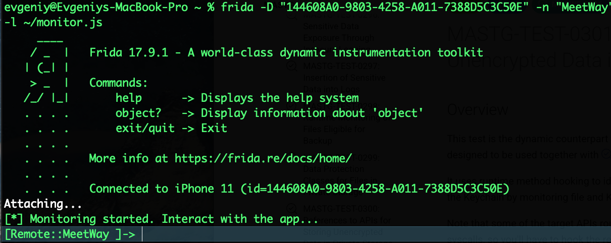

🟡 `(SAST)`

### MASTG-TEST-0300: References to APIs for Storing Unencrypted Data in Private Storage

> Цель теста MASTG-TEST-0300 - проверить, что приложение не сохраняет конфиденциальные данные в незашифрованном виде в своем приватном хранилище (песочнице)

 тест ищет два типа API:

1. API для записи файлов (UserDefaults, writeToFile, Core Data и т.д.), чтобы убедиться, что чувствительные данные (пароли, токены) шифруются перед записью
   
2. API Keychain, чтобы убедиться, что приложение использует хащищенное хранилище для секретов, а не кладет их в обычные файлы
   

Вердикт: тест считается не пройденным, если конфиденциальные данные записываются в файлы без шифрования (и при этом не используется Keychain)

---------

1 - нужно получить бинарник приложения

----------

👉  - когда есть исходники и Xcode:
(это легко - так как мой бинарник будет не шифрованный)

вот как получить ipa при наличии исходника + xcode
```c
-Открываешь свой проект в Xcode.
- Выбираешь Product → Archive
- В открывшемся окне Organizer выбираешь свежий архив и жмешь Distribute App
Выбираешь Development или Ad Hoc
   
- Xcode сам создаст .ipa файл
  
  НО ДЛЯ ТАКОГО СПОСОБА НУЖНА ПОДПИСКА app developer
```

иду в папку со скомпилированным приложением
```c
cd ~/Library/Developer/Xcode/DerivedData/MeetWay-*/Build/Products/Debug-iphoneos/
```
Бинарник называется так же, как и приложение (например, MeetWay)

------


👉  -  когда есть `.ipa` файл:
(это уже сложно, если например, просто скачать с AppStore - то чтобы распаковать чужой IPA нужен джейлбрейк, так как файл будет шифрованный, и расшифровать можно например frida-ios-dump на устройстве с джейлбрейк)

 Распакуйте .ipa
```q
unzip MeetWay.ipa -d MeetWay_extracted
```
Бинарник внутри: MeetWay_extracted/Payload/MeetWay.app/MeetWay


----------

так как у меня нет джейбрейка и нет лицензии apple dev - то я сделаю так:

1 - запуск xcode + запуск приложение на телефон через xcode

2 -нахожу в finder =  Cmd + Shift + G = 

~/Library/Developer/Xcode/DerivedData - файлы приложения

3 - нахожу в них бинарник

4 - скопировал бинарник на рабочий стол

--------

открываю бинарник
`cd ~/Desktop/MeetWay.app`

далее выполняю проверки которые покажут места (возможные) - куда и как приложение пишет данные

```q
# Поиск записи в файлы через высокоуровневые API
r2 -A -q -c "/ writeToFile" ./MeetWay.debug.dylib 2>/dev/null
r2 -A -q -c "/ writeToURL" ./MeetWay.debug.dylib 2>/dev/null
r2 -A -q -c "/ UserDefaults" ./MeetWay.debug.dylib 2>/dev/null
r2 -A -q -c "/ CoreData" ./MeetWay.debug.dylib 2>/dev/null
r2 -A -q -c "/ SQLite" ./MeetWay.debug.dylib 2>/dev/null

# Низкоуровневые POSIX вызовы
r2 -A -q -c "/ fopen" ./MeetWay.debug.dylib 2>/dev/null
r2 -A -q -c "/ write" ./MeetWay.debug.dylib 2>/dev/null
```

поиск Keychain API

```q
# Основные Keychain API
r2 -A -q -c "/ SecItemAdd" ./MeetWay.debug.dylib 2>/dev/null
r2 -A -q -c "/ SecItemUpdate" ./MeetWay.debug.dylib 2>/dev/null
r2 -A -q -c "/ SecItemCopyMatching" ./MeetWay.debug.dylib 2>/dev/null
r2 -A -q -c "/ SecItemDelete" ./MeetWay.debug.dylib 2>/dev/null

# Swift-обертки
r2 -A -q -c "/ Keychain" ./MeetWay.debug.dylib 2>/dev/null

--------------

ДАЛЕЕ

для каждого найденного API посмотри, какие именно данные передаются
(смотреть через бинарник)

r2 ./MeetWay.debug.dylib
[0x00004000]> aaaa  # полный анализ
[0x00004000]> pd 20 @ 0x<адрес_вызова>

```

через стринг  (работает не всегда - но проверять нужно)

```q
strings ./MeetWay.debug.dylib | grep -iE "UserDefaults|writeToFile|NSKeyedArchiver|CoreData|SQLite|plist|json|SecItem|Keychain|kSecClass"
```


-------------
результаты первичного анализа:

запускаю разом все сразу:

```q
cd ~/Desktop/MeetWay.app

echo "=== Поиск writeToFile ==="
r2 -A -q -c "/ writeToFile" ./MeetWay.debug.dylib 2>/dev/null

echo "=== Поиск writeToURL ==="
r2 -A -q -c "/ writeToURL" ./MeetWay.debug.dylib 2>/dev/null

echo "=== Поиск UserDefaults ==="
r2 -A -q -c "/ UserDefaults" ./MeetWay.debug.dylib 2>/dev/null

echo "=== Поиск CoreData ==="
r2 -A -q -c "/ CoreData" ./MeetWay.debug.dylib 2>/dev/null

echo "=== Поиск SQLite ==="
r2 -A -q -c "/ SQLite" ./MeetWay.debug.dylib 2>/dev/null

echo "=== Поиск fopen ==="
r2 -A -q -c "/ fopen" ./MeetWay.debug.dylib 2>/dev/null

echo "=== Поиск write (POSIX) ==="
r2 -A -q -c "/ write" ./MeetWay.debug.dylib 2>/dev/null

echo "=== Поиск SecItemAdd ==="
r2 -A -q -c "/ SecItemAdd" ./MeetWay.debug.dylib 2>/dev/null

echo "=== Поиск SecItemUpdate ==="
r2 -A -q -c "/ SecItemUpdate" ./MeetWay.debug.dylib 2>/dev/null

echo "=== Поиск SecItemCopyMatching ==="
r2 -A -q -c "/ SecItemCopyMatching" ./MeetWay.debug.dylib 2>/dev/null

echo "=== Поиск SecItemDelete ==="
r2 -A -q -c "/ SecItemDelete" ./MeetWay.debug.dylib 2>/dev/null

echo "=== Поиск Keychain ==="
r2 -A -q -c "/ Keychain" ./MeetWay.debug.dylib 2>/dev/null

echo "=== Финальный фарш через strings ==="
strings ./MeetWay.debug.dylib | grep -iE "UserDefaults|writeToFile|NSKeyedArchiver|CoreData|SQLite|plist|json|SecItem|Keychain|kSecClass"
```

вот результаты:

```q
=== Поиск writeToFile ===
=== Поиск writeToURL ===
=== Поиск UserDefaults ===
0x00a84425 hit4_0 ._OBJC_CLASS_$_NSUserDefaults_OBJC_CLASS_$_U.
0x00d6c809 hit4_1 ._OBJC_CLASS_$_NSUserDefaults_OBJC_CLASS_$_O.
0x00a10554 hit4_2 .SettingstandardUserDefaultsstartRecordingT.
=== Поиск CoreData ===
=== Поиск SQLite ===
=== Поиск fopen ===
0x00a7420b hit4_0 ._dlsym_fclose_fopen_fread_free_f.
0x00d6d34f hit4_1 ._dlsym_fclose_fopen_fread_free_f.
0x00a6c20b hit4_2 ._dlsym_fclose_fopen_fread_free_f.
=== Поиск write (POSIX) ===
0x00a72d80 hit4_0 .oundation4DataV5write2to7optionsyAA3U.
0x00d5b11f hit4_1 .oundation4DataV5write2to7optionsyAA3U.
0x010f298d hit4_2 .oundation4DataV5write2to7optionsyAA3U.
0x00a6ad80 hit4_3 .oundation4DataV5write2to7optionsyAA3U.
0x00916c63 hit4_4 .  writer .
0x00916ce7 hit4_5 . writer .
0x00916d17 hit4_6 . writer .
=== Поиск SecItemAdd ===
0x00a73b2e hit4_0 .DescriptionKey_SecItemAdd_SecItemCopyMat.
0x00d6cbce hit4_1 .12_SwiftObject_SecItemAdd_SecItemCopyMat.
0x00a6bb2e hit4_2 .DescriptionKey_SecItemAdd_SecItemCopyMat.
=== Поиск SecItemUpdate ===
0x00a73b5e hit4_0 ._SecItemDelete_SecItemUpdate_SecRandomCopyB.
0x00d6cbfe hit4_1 ._SecItemDelete_SecItemUpdate_SecRandomCopyB.
0x00a6bb5e hit4_2 ._SecItemDelete_SecItemUpdate_SecRandomCopyB.
=== Поиск SecItemCopyMatching ===
0x00a73b3a hit4_0 .ey_SecItemAdd_SecItemCopyMatching_SecItemDelete.
0x00d6cbda hit4_1 .ct_SecItemAdd_SecItemCopyMatching_SecItemDelete.
0x00a6bb3a hit4_2 .ey_SecItemAdd_SecItemCopyMatching_SecItemDelete.
=== Поиск SecItemDelete ===
0x00a73b4f hit4_0 .emCopyMatching_SecItemDelete_SecItemUpdate.
0x00d6cbef hit4_1 .emCopyMatching_SecItemDelete_SecItemUpdate.
0x00a6bb4f hit4_2 .emCopyMatching_SecItemDelete_SecItemUpdate.
=== Поиск Keychain ===
0x00a95f9d hit4_0 .ionPostViewVKeychainHelperCL.
0x00a9b42a hit4_1 .BaseManagerCKeychainManagerCLoad.
0x00d047c6 hit4_2 .VN_$s7MeetWay14KeychainHelperC3get3forS.
0x00d047f4 hit4_3 .tF_$s7MeetWay14KeychainHelperC3get3forS.
0x00d04824 hit4_4 .Tq_$s7MeetWay14KeychainHelperC4save_3fo.
0x00d04854 hit4_5 .tF_$s7MeetWay14KeychainHelperC4save_3fo.
0x00d04886 hit4_6 .Tq_$s7MeetWay14KeychainHelperC6delete3f.
0x00d048b5 hit4_7 .tF_$s7MeetWay14KeychainHelperC6delete3f.
0x00d048e6 hit4_8 .Tq_$s7MeetWay14KeychainHelperC6sharedAC.
0x00d0490f hit4_9 .au_$s7MeetWay14KeychainHelperC6sharedAC.
0x00d04938 hit4_10 .gZ_$s7MeetWay14KeychainHelperC6sharedAC.
0x00d04961 hit4_11 .pZ_$s7MeetWay14KeychainHelperC6sharedAC.
0x00d0498c hit4_12 .MV_$s7MeetWay14KeychainHelperC6update33.
0x00d049f3 hit4_13 .tF_$s7MeetWay14KeychainHelperC8hasToken.
0x00d04a24 hit4_14 .tF_$s7MeetWay14KeychainHelperC8hasToken.
0x00d04a57 hit4_15 .Tq_$s7MeetWay14KeychainHelperCACyc33_75.
0x00d04a9f hit4_16 .fC_$s7MeetWay14KeychainHelperCMa_$s7Me.
0x00d04abe hit4_17 .Ma_$s7MeetWay14KeychainHelperCMm_$s7Me.
0x00d04add hit4_18 .Mm_$s7MeetWay14KeychainHelperCMn_$s7Me.
0x00d04afc hit4_19 .Mn_$s7MeetWay14KeychainHelperCN_$s7Mee.
0x00d04b1a hit4_20 .CN_$s7MeetWay14KeychainHelperCfD_$s7Me.
0x00d04b39 hit4_21 .fD_$s7MeetWay14KeychainHelperCfd_$s7Me.
0x00d0ce2b hit4_22 .fd_$s7MeetWay15KeychainManagerC10keyAcc.
0x00d0ce5a hit4_23 .au_$s7MeetWay15KeychainManagerC10keyAcc.
0x00d0ce89 hit4_24 .gZ_$s7MeetWay15KeychainManagerC10keyAcc.
0x00d0ceb8 hit4_25 .pZ_$s7MeetWay15KeychainManagerC10keyAcc.
0x00d0cee9 hit4_26 .MV_$s7MeetWay15KeychainManagerC17genera.
0x00d0cf1f hit4_27 .FZ_$s7MeetWay15KeychainManagerC7loadKey.
0x00d0cf4c hit4_28 .FZ_$s7MeetWay15KeychainManagerC7saveKey.
0x00d0cf79 hit4_29 .FZ_$s7MeetWay15KeychainManagerC7service.
0x00d0cfa4 hit4_30 .au_$s7MeetWay15KeychainManagerC7service.
0x00d0cfcf hit4_31 .gZ_$s7MeetWay15KeychainManagerC7service.
0x00d0cffa hit4_32 .pZ_$s7MeetWay15KeychainManagerC7service.
0x00d0d027 hit4_33 .MV_$s7MeetWay15KeychainManagerC9deleteK.
0x00d0d054 hit4_34 .FZ_$s7MeetWay15KeychainManagerCACycfC_.
0x00d0d078 hit4_35 .fC_$s7MeetWay15KeychainManagerCACycfCTq.
0x00d0d09e hit4_36 .Tq_$s7MeetWay15KeychainManagerCACycfc_.
0x00d0d0c2 hit4_37 .fc_$s7MeetWay15KeychainManagerCMa_$s7M.
0x00d0d0e2 hit4_38 .Ma_$s7MeetWay15KeychainManagerCMm_$s7M.
0x00d0d102 hit4_39 .Mm_$s7MeetWay15KeychainManagerCMn_$s7M.
0x00d0d122 hit4_40 .Mn_$s7MeetWay15KeychainManagerCN_$s7Me.
0x00d0d141 hit4_41 .CN_$s7MeetWay15KeychainManagerCfD_$s7M.
0x00d0d161 hit4_42 .fD_$s7MeetWay15KeychainManagerCfd_$s7M.
0x00d86240 hit4_43 .Oc_$s7MeetWay15KeychainManagerC7service.
0x00d86269 hit4_44 .WZ_$s7MeetWay15KeychainManagerC10keyAcc.
0x00d8642e hit4_45 .A__$s7MeetWay14KeychainHelperC6shared_W.
0x00d86455 hit4_46 .WZ_$s7MeetWay14KeychainHelperCACyc33_75.
0x0212b71d hit4_47 ._____ 7MeetWay15KeychainManagerC_symbol.
0x0212b748 hit4_48 ._____ 7MeetWay14KeychainHelperC_symboli.
0x02372763 hit4_49 .XX_$s7MeetWay14KeychainHelperCACyc33_75.
0x023727ad hit4_50 .Tq_$s7MeetWay14KeychainHelperC6update33.
0x0237aacc hit4_51 .MF_$s7MeetWay15KeychainManagerCMF_$s7M.
0x0237aaec hit4_52 .MF_$s7MeetWay14KeychainHelperCMF_$s7Me.
0x02380e14 hit4_53 .A__TtC7MeetWay15KeychainManager__DATA__.
0x02380e39 hit4_54 .A__TtC7MeetWay15KeychainManager__METACL.
0x02380e68 hit4_55 .A__TtC7MeetWay14KeychainHelper__DATA__T.
0x02380e8c hit4_56 .A__TtC7MeetWay14KeychainHelper__METACLA.
0x02389ecc hit4_57 .MD_$s7MeetWay15KeychainManagerCMf_$s7M.
0x02389eec hit4_58 .Mf_$s7MeetWay14KeychainHelperCMf_$sSo1.
0x026d59ec hit4_59 .MK_$s7MeetWay15KeychainManagerC7service.
0x026d5a15 hit4_60 .Wz_$s7MeetWay15KeychainManagerC10keyAcc.
0x026d5a42 hit4_61 .Wz_$s7MeetWay14KeychainHelperC6shared_W.
0x026dd95e hit4_62 .AARO/MANAGER_S/KeychainManager.swift/U.
0x026dda25 hit4_63 .ts-normal/arm64/KeychainManager.o/Users.
0x00906e1c hit4_64 .KeychainManagerKeychain.
0x00906e2c hit4_65 .KeychainManagerKeychainHelperCFSt.
0x0090ff72 hit4_66 .  Keychain:  .
0x0090ffc3 hit4_67 .  Keychain  .
0x00910014 hit4_68 .  Keychain, : .
0x00910073 hit4_69 .  Keychain:  Keycha.
0x00910085 hit4_70 .ychain:  Keychain SAVE  .
0x00910124 hit4_71 .ata Keychain SAVE: .
0x009102a0 hit4_72 .Keychain .
0x00910384 hit4_73 .  Keychain SAVE: .
0x009103a4 hit4_74 . Keychain UPDATE: .
0x009103d4 hit4_75 . Keychain UPDATE: .
0x009103f5 hit4_76 . Keychain GET  .
0x00910424 hit4_77 .'' Keychain GET: .
0x00910474 hit4_78 . =  Keychain GET: .
0x009104a5 hit4_79 . =  Keychain DELETE  .
0x009104d4 hit4_80 . ' Keychain DELETE: .
0x00910504 hit4_81 . Keychain DELETE: .
0x0091055e hit4_82 ._TtC7MeetWay15KeychainManager_TtC7M.
0x0091057e hit4_83 ._TtC7MeetWay14KeychainHelperWEB de.
0x00912378 hit4_84 .  Keychain! ....
0x0091fee9 hit4_85 .  Keychain, .
0x0092025d hit4_86 .  Keychain J.
0x0092546d hit4_87 . JWT  Keychain J.
0x009254ab hit4_88 .  Keychain.
=== Финальный фарш через strings ===
KeychainManager
KeychainHelper
NNSJSONReadingOptions
NNSJSONWritingOptions
 Keychain:
 Keychain
 Keychain,
 Keychain:
 Keychain SAVE
 Keychain SAVE:
Keychain
 Keychain SAVE:
 Keychain UPDATE:
 Keychain UPDATE:
 Keychain GET
 Keychain GET:
 Keychain GET:
 Keychain DELETE
 Keychain DELETE:
 Keychain DELETE:
_TtC7MeetWay15KeychainManager
_TtC7MeetWay14KeychainHelper
 Keychain!
: - jsonCellString= FireBaseManager3
: - locatesAllJson= FireBaseManager
JSON
: locatesAllJson
JSON
: cellsAllJson
 Keychain,
application/json
 Keychain
https://login.yandex.ru/info?format=json
 JSON:
 JSON
 JSON: '
 JSON: '
 JSON!
 JSON
 JSON
 JSON preview:
 JSON
 JSON
 JSON
 JSON
 JSON
 JSON
 JSON:
 JSON
Invalid JSON format:
 JSON
 JSON
 JSON
 JSON
 JSON
 JSON
 JSON
 JSON JWT
 Keychain
 Keychain
 JSON
 JSON
 JSON
 JSON
/System/Library/CoreServices/SystemVersion.plist
JSONObjectWithData:options:error:
dataWithJSONObject:options:error:
standardUserDefaults
```

----------

итак - итого - что нашлось интересного:

```q
=== Поиск UserDefaults ===
0x00a84425 hit4_0 ._OBJC_CLASS_$_NSUserDefaults_OBJC_CLASS_$_U.
0x00d6c809 hit4_1 ._OBJC_CLASS_$_NSUserDefaults_OBJC_CLASS_$_O.
0x00a10554 hit4_2 .SettingstandardUserDefaultsstartRecordingT.

ТО ЕСТЬ В UserDefaults СОХРАНЯЮТСЯ ДАННЫЕ , И ЕСЛИ ЭТО ПАРОЛИ/ТОКЕНЫ, МОЖЕТ БЫТЬ ОПАСНО
```

-------

 fopen (НАЙДЕН)

```q
=== Поиск fopen ===
0x00a7420b hit4_0 ._dlsym_fclose_fopen_fread_free_f.
0x00d6d34f hit4_1 ._dlsym_fclose_fopen_fread_free_f.
0x00a6c20b hit4_2 ._dlsym_fclose_fopen_fread_free_f.

----
Приложение использует низкоуровневый POSIX-вызов fopen для работы с файлами.

Риск: Это прямой доступ к файловой системе в обход высокоуровневых API. Разработчик сам управляет тем, что и куда пишется^ нужно такеж проверить, что конкретно там, вдург там пароли / токены

```

--------

 write (POSIX) (НАЙДЕН)

```q
=== Поиск write (POSIX) ===
0x00a72d80 hit4_0 .oundation4DataV5write2to7optionsyAA3U.
0x00d5b11f hit4_1 .oundation4DataV5write2to7optionsyAA3U.
0x010f298d hit4_2 .oundation4DataV5write2to7optionsyAA3U.
0x00a6ad80 hit4_3 .oundation4DataV5write2to7optionsyAA3U.
0x00916c63 hit4_4 .  writer .
0x00916ce7 hit4_5 . writer .
0x00916d17 hit4_6 . writer .

------

Что значит: Swift-метод Data.write(to:options:) - запись данных в файл

Риск: Критически важно проверить, какие именно данные записываются через этот метод
```

--------


 Keychain API - отлично  - что он используется! 
 ```q
 SecItemAdd — 0x00a73b2e
SecItemUpdate — 0x00a73b5e
SecItemCopyMatching — 0x00a73b3a
SecItemDelete — 0x00a73b4f
 ```

----

 Keychain Helper (ОБНАРУЖЕНО)
 ```q
 _TtC7MeetWay15KeychainManager
_TtC7MeetWay14KeychainHelper
 Keychain SAVE
 Keychain UPDATE
 Keychain GET
 Keychain DELETE
 
 -----
 У приложения есть своя обертка над Keychain. Это хорошая архитектура.

Важно: Судя по логам Keychain SAVE, Keychain GET - разработчик сам логирует операции с Keychain. Это опасно, так как в логи могут попасть имена ключей или сами данные
 ```


--------

много данных с  JSON
**Риск:** JSON часто пишется в файлы или логи. Если туда попадают JWT или ключи - проблема

--------

---

ТЕПЕРЬ НУЖНО ПРОЧЕСТЬ ЗНАЧЕНИЯ ЭТИХ ФАЙЛОВ, ЧТОБЫ ПОНЯТЬ, ЧТО КОНКРЕТНО ЗАПИСЫВАЕТСЯ В НИХ!

```bash
# Ищем, что именно сохраняется через UserDefaults
strings ./MeetWay.debug.dylib | grep -i "setObject\|setValue\|setInteger\|setBool" -B 2 -A 2 | grep -i "token\|password\|key\|jwt"

# Ищем, какие файлы создаются через write
strings ./MeetWay.debug.dylib | grep -E "\.plist|\.json|\.txt|\.data" | grep -v "SystemVersion"
```

но сами ключи скрыты в терминале  - это происходит, потому что,  сами ключи / токены / пароли уже можно увидеть только динамически (с помощью фрида или если есть ipa )

```
evgeniy@Evgeniys-MacBook-Pro MeetWay.app % strings ./MeetWay.debug.dylib | grep -i "setObject\|setValue\|setInteger\|setBool" -B 2 -A 2 | grep -i "token\|password\|key\|jwt"

setBool:forKey:
setObject:forKey:

evgeniy@Evgeniys-MacBook-Pro MeetWay.app % strings ./MeetWay.debug.dylib | grep -E "\.plist|\.json|\.txt|\.data" | grep -v "SystemVersion"

video.audio.data.queue
evgeniy@Evgeniys-MacBook-Pro MeetWay.app %
```

-----

запущу симулятор xcode + фрида 

запустил приложение в симуляторе xcode

нахожу его фридой 

`frida-ls-devices`

и вот вижу свой симулятор
144608A0-9803-4258-A011-7388D5C3C50E  remote  iPhone 11         iPhone OS 17.5

подключаюсь к нему
```q
frida -D "144608A0-9803-4258-A011-7388D5C3C50E" -n "MeetWay"
```

отлично! получилось подрубиться! 
Connected to iPhone 11 (id=144608A0-9803-4258-A.......

------


вот скрипт для фриды который проверит сохранение файлов на устройстве
(сразу сохраняю его)
```q
cat > ~/test_universal.js << 'EOF'
// Универсальный тест — перехватываем Objective-C метод, который точно вызывается

// 1. Перехватываем NSUserDefaults (100% вызывается при запуске)
var NSUserDefaults = ObjC.classes.NSUserDefaults;
var objectForKey = NSUserDefaults["- objectForKey:"];

Interceptor.attach(objectForKey.implementation, {
    onEnter: function(args) {
        try {
            var key = ObjC.Object(args[2]);
            console.log("[NSUserDefaults READ] Key: " + key.toString());
        } catch(e) {}
    }
});

console.log("[*] Hook 1: NSUserDefaults objectForKey");

// 2. Перехватываем NSLog через Objective-C обертку
var NSLog = ObjC.classes.NSLog;
if (NSLog) {
    Interceptor.attach(NSLog["- log"].implementation, {
        onEnter: function(args) {
            console.log("[NSLog] Called");
        }
    });
    console.log("[*] Hook 2: NSLog");
}

// 3. Перехватываем CFShow (работает всегда)
var CFShow = new NativeFunction(Module.findExportByName("CoreFoundation", "CFShow"), 'void', ['pointer']);
if (CFShow) {
    Interceptor.attach(CFShow, {
        onEnter: function(args) {
            console.log("[CFShow] Called");
        }
    });
    console.log("[*] Hook 3: CFShow");
}

console.log("[*] Universal test started. Just launch the app and interact...");
EOF


```

теперь запускаю фриду с моим скриптом
```q
frida -D "144608A0-9803-4258-A011-7388D5C3C50E" -n "MeetWay" -l ~/test_universal.js

-------

запуск сразу с логами на рабочий стол

frida -D "144608A0-9803-4258-A011-7388D5C3C50E" -n "MeetWay" -l ~/test_universal.js > ~/Desktop/frida_logs.txt 2>&1


```

подключился! [*] Monitoring started. ....
фрида в режиме ождания событий с устройства



----
теперь нужно хорошенько пошариться в приложении, авторизация, чаты, в общем везде где только можно

---
и вот результаты теста! в логах хорошо видны имена переменных, которые в том числе беруться из UserDefaults


```
[*] Hook 1: NSUserDefaults objectForKey
TypeError: not a function
    at <eval> (/Users/evgeniy/test_universal.js:30)
[Remote::MeetWay ]-> [NSUserDefaults READ] Key: key_1_enter
[NSUserDefaults READ] Key: key_1_enter
[NSUserDefaults READ] Key: key_1_enter
[NSUserDefaults READ] Key: key_1_enter
[NSUserDefaults READ] Key: com.apple.SwiftUI.LazyStackLogging
[NSUserDefaults READ] Key: com.apple.SwiftUI.LazyStackLogging
[NSUserDefaults READ] Key: com.apple.SwiftUI.LazyStackLogging
[NSUserDefaults READ] Key: key_1_enter
[NSUserDefaults READ] Key: UIHostingViewDebugOptions
[NSUserDefaults READ] Key: UIHostingViewDebugOptions
[NSUserDefaults READ] Key: com.apple.SwiftUI.inferredToolbar
[NSUserDefaults READ] Key: com.apple.SwiftUI.EnableFocusLogging
[NSUserDefaults READ] Key: UIHostingViewDebugOptions
[NSUserDefaults READ] Key: UIHostingViewDebugOptions
[Remote::MeetWay ]-> [NSUserDefaults READ] Key: LogUICollectionView
[NSUserDefaults READ] Key: LogWindowScene
[NSUserDefaults READ] Key: _UIConstraintBasedLayoutPlaySoundWhenEngaged
[NSUserDefaults READ] Key: LogUIFocusSystemSceneComponent
[NSUserDefaults READ] Key: LogUIAlertControllerStackManager
[NSUserDefaults READ] Key: key_1_enter
[NSUserDefaults READ] Key: key_1_enter
[NSUserDefaults READ] Key: com.apple.SwiftUI.LazyStackLogging
[NSUserDefaults READ] Key: UIHostingViewDebugOptions
[NSUserDefaults READ] Key: LogViewServices
[NSUserDefaults READ] Key: LogViewServiceAssertion
[NSUserDefaults READ] Key: LogKBProxyForwarding
[NSUserDefaults READ] Key: key_1_enter
[NSUserDefaults READ] Key: keyboard-audio
[NSUserDefaults READ] Key: /google/firebase/global_data_collection_enabled:__FIRAPP_DEFAULT
[NSUserDefaults READ] Key: key_1_enter
[Remote::MeetWay ]-> [NSUserDefaults READ] Key: key_1_enter
[NSUserDefaults READ] Key: keyboard-audio
[NSUserDefaults READ] Key: keyboard-audio
[NSUserDefaults READ] Key: lastMessageTimestamps
[NSUserDefaults READ] Key: com.apple.SwiftUI.DisableCollectionViewBackedPlainLists
[NSUserDefaults READ] Key: LogCollectionView
[NSUserDefaults READ] Key: LogUICollectionViewCellLifeCycle
[NSUserDefaults READ] Key: LogUICollectionViewAttrMap
[NSUserDefaults READ] Key: LogUICVGrouping
[NSUserDefaults READ] Key: NSHyphenationLanguage
[NSUserDefaults READ] Key: LogUICollectionLayout
[NSUserDefaults READ] Key: kkr15
[NSUserDefaults READ] Key: UIHostingViewDebugOptions
[NSUserDefaults READ] Key: com.apple.SwiftUI.LazyStackLogging
[NSUserDefaults READ] Key: UIHostingViewDebugOptions
[NSUserDefaults READ] Key: com.apple.SwiftUI.inferredToolbar
[NSUserDefaults READ] Key: com.apple.SwiftUI.LazyStackLogging
[NSUserDefaults READ] Key: UIHostingViewDebugOptions
[NSUserDefaults READ] Key: com.apple.SwiftUI.LazyStackLogging
[NSUserDefaults READ] Key: com.apple.speech.MacinTalkFramework.MacinTalkAUSP
[NSUserDefaults READ] Key: com.apple.ax.KonaTTSSupport.KonaSynthesizer
[NSUserDefaults READ] Key: com.apple.ax.MauiTTSSupport.MauiAUSP
[NSUserDefaults READ] Key: com.apple.texttospeech.SiriAUSP
[NSUserDefaults READ] Key: verboseOriginClientLogging
[NSUserDefaults READ] Key: com.apple.SwiftUI.LazyStackLogging
[NSUserDefaults READ] Key: LogScrollView
[NSUserDefaults READ] Key: LogUIPointerArbiter
[NSUserDefaults READ] Key: LogUpdateCycleIdleScheduler
[NSUserDefaults READ] Key: com.apple.SwiftUI.LazyStackLogging
[NSUserDefaults READ] Key: key_1_enter
[NSUserDefaults READ] Key: LogInputModeIndicator
[NSUserDefaults READ] Key: UIKeyboardInputModeIndicatorIdleTime
[NSUserDefaults READ] Key: UIHostingViewDebugOptions
[NSUserDefaults READ] Key: UIHostingViewDebugOptions
[NSUserDefaults READ] Key: UIHostingViewDebugOptions
[NSUserDefaults READ] Key: com.apple.SwiftUI.LazyStackLogging
[NSUserDefaults READ] Key: com.apple.SwiftUI.LazyStackLogging
[NSUserDefaults READ] Key: myID
```

---------

вот скрипт чтобы достать и сами значения

```q
cat > ~/dump_values.js << 'EOF'
// ДАМП ЗНАЧЕНИЙ ИЗ NSUserDefaults
var NSUserDefaults = ObjC.classes.NSUserDefaults;
var objectForKey = NSUserDefaults["- objectForKey:"];

Interceptor.attach(objectForKey.implementation, {
    onEnter: function(args) {
        this.key = ObjC.Object(args[2]);
    },
    onLeave: function(retval) {
        try {
            var key = this.key.toString();
            // Мониторим только нужные ключи
            if (key === "kkr15" || key === "myID" || key === "key_1_enter"|| key === ""|| key === ""|| key === ""|| key === ""|| key === ""|| key === ""|| key === ""|| key === ""|| key === "") {
                var value = ObjC.Object(retval);
                console.log("\n[VALUE DUMP]");
                console.log("Key: " + key);
                console.log("Value: " + value.toString());
                console.log("Type: " + ObjC.Object(value).$className);
            }
        } catch(e) {}
    }
});

console.log("[*] Value dumper started. Interact with the app...");
EOF
```

```q
frida -D "144608A0-9803-4258-A011-7388D5C3C50E" -n "MeetWay" -l ~/dump_values.js
```

и вот результат работы скрипта 

```c
[VALUE DUMP]
Key: kkr15
Value: 8137tr8gf
Type: NSTaggedPointerString

-----


```

---

или вот так сразу полный дамп UserDefaults

```c
frida -D "144608A0-9803-4258-A011-7388D5C3C50E" -n "MeetWay" -e "
var defaults = ObjC.classes.NSUserDefaults.standardUserDefaults();
var dict = defaults.dictionaryRepresentation();
var keys = dict.allKeys();
for (var i = 0; i < keys.count(); i++) {
    var key = keys.objectAtIndex_(i);
    var value = dict.objectForKey_(key);
    console.log(key + ' = ' + value);
}
"
```

на выходе вижу:
```q
[Remote::MeetWay ]->
var defaults = ObjC.classes.NSUserDefaults.standardUserDefaults();
var dict = defaults.dictionaryRepresentation();
var keys = dict.allKeys();
for (var i = 0; i < keys.count(); i++) {
    var key = keys.objectAtIndex_(i);
    var value = dict.objectForKey_(key);
    console.log(key + ' = ' + value);
}

AKLastLocale = ru_RU
AppleCollationOrder = ru
METAL_DEBUG_ERROR_MODE = 6
AppleKeyboardsExpanded = 1
NSHyphenatesAsLastResort = 1
themeColorUser = green
METAL_ERROR_CHECK_EXTENDED_MODE = 4
METAL_WARNING_MODE = 4
NSLanguages = (
    "en-001"
)
AKLastIDMSEnvironment = 0
PKLogNotificationServiceResponsesKey = 0
AppleKeyboards = (
    "ru_RU@sw=Russian;hw=Automatic",
    "en_GB@sw=QWERTY;hw=Automatic",
    "en_US@sw=QWERTY;hw=Automatic",
    "emoji@sw=Emoji"
)
NSUsesCFStringTokenizerForLineBreaks = 1
NSVisualBidiSelectionEnabled = 1
ApplePasscodeKeyboards = (
    "ru_RU",
    "en_GB",
    emoji
)
NSUsesTextStylesForLineBreaks = 1
key_1_enter = (
    1,
    1,
    1,
    1,
    1,
    0
)
METAL_ERROR_MODE = 6
METAL_DEVICE_WRAPPER_TYPE = 0
myID = 1497243782
AddingEmojiKeybordHandled = 1
AppleLanguages = (
    "ru-RU",
    "en-GB"
)
NSInterfaceStyle = macintosh
AppleLocale = ru_RU
kkr15 = 8137tr8gf
AppleLanguagesSchemaVersion = 4000
[Remote::MeetWay ]->
```

--------

вот более обширный скрипт для полного дампа памяти

```q
cat > ~/dump_simple.js << 'EOF'
// ПРОСТОЙ ДАМП ПЕСОЧНИЦЫ - РАБОТАЕТ 100%

// 1. Сначала UserDefaults
var defaults = ObjC.classes.NSUserDefaults.standardUserDefaults();
var dict = defaults.dictionaryRepresentation();
console.log("\n========== [NSUserDefaults] ==========");
var keys = dict.allKeys();
for (var i = 0; i < keys.count(); i++) {
    var key = keys.objectAtIndex_(i);
    var value = dict.objectForKey_(key);
    console.log(key + " = " + value);
}

// 2. Функция рекурсивного обхода
function scanDir(path) {
    try {
        var fm = ObjC.classes.NSFileManager.defaultManager();
        var contents = fm.contentsOfDirectoryAtPath_error_(path, NULL);
        if (contents == NULL) return;
        
        for (var i = 0; i < contents.count(); i++) {
            var item = contents.objectAtIndex_(i);
            var fullPath = path.stringByAppendingPathComponent_(item);
            var isDir = fm.fileExistsAtPath_isDirectory_(fullPath, NULL);
            
            if (isDir == 1) {
                scanDir(fullPath);
            } else {
                console.log("[FILE] " + fullPath);
                // Пробуем прочитать маленькие файлы
                if (fullPath.indexOf(".plist") > 0 || fullPath.indexOf(".json") > 0 || fullPath.indexOf(".txt") > 0) {
                    try {
                        var content = NSString.stringWithContentsOfFile_encoding_error_(fullPath, 4, NULL);
                        if (content != NULL) {
                            console.log("  CONTENT: " + content.toString().substring(0, 300));
                        }
                    } catch(e) {}
                }
            }
        }
    } catch(e) {
        // игнорируем ошибки
    }
}

// 3. Сканируем папки, которые точно существуют
console.log("\n========== [FILESYSTEM DUMP] ==========");

// Базовые пути (работают на симуляторе)
var bundlePath = ObjC.classes.NSBundle.mainBundle().bundlePath();
var containerPath = bundlePath.substring(0, bundlePath.indexOf(".app")) + "Data";

console.log("[CONTAINER PATH]: " + containerPath);

// Сканируем Documents, Library, Caches
var documentsPath = containerPath + "/Documents";
var libraryPath = containerPath + "/Library";
var cachesPath = libraryPath + "/Caches";

console.log("\n--- SCANNING DOCUMENTS ---");
scanDir(documentsPath);
console.log("\n--- SCANNING LIBRARY ---");
scanDir(libraryPath);
console.log("\n--- SCANNING CACHES ---");
scanDir(cachesPath);

console.log("\n[*] DUMP FINISHED");
EOF
```

запуст
```q
frida -D "144608A0-9803-4258-A011-7388D5C3C50E" -n "MeetWay" -l ~/dump_sandbox_fixed.js
```


-------

# ВЫВОДЫ  - тест провален

из критического найдено 

kkr15 = 8137tr8gf    -- соль - критично

myID = 1497243782    -- ай ди - не критично

флаги первичного входа    -- может использованно в бизнес логике
key_1_enter = (
    1,
    1,
    1,
    1,
    1,
    0
)

-----

#### интересное наблюдение

я использовал radar 2 

и в коде приложения есть структура  - соль

```swift
struct jkg {

    let x = UserDefaults.standard.string(forKey: "kkr15") ?? "" 

    let uu = "vkewjrbg@#$%$**)(_&^%4257(&^&^$%&^**_ch35ha56ht_encryp56ti6534yon_safhd457_202346hy5_4h4v3_ertb356uiu563h__"

}
```

и вот что интересно , что значение Х - UserDefaults я нашел

но это только часть соли

а вот значение uu мои сканеры и скрипты не нашли, так как они просто тупо захардхожены в код!

и наверно единственное, как можно это все найти - это бинарник преврачитьт в читаемый код  (**дизассемблирование и декомпиляция**)
и вручную глазками искать

==можно запустить автоматический интсрумент **Mobile Security Framework**

==или использовать **Ghidra** - чтобы вручную прочесть

-----------
### Нарушенные требования MASVS

- **MASVS-STORAGE-1**: Конфиденциальные данные не должны храниться в незашифрованном виде
    
- **MASVS-STORAGE-2**: Ключи шифрования не должны быть хардкоджены

--------

### Рекомендации по исправлению

 **Удалить `kkr15` из `UserDefaults`** - ключ шифрования не должен храниться в открытом виде
    
 **Переместить `myID` в Keychain** - идентификаторы пользователей должны храниться в защищенном хранилище
    
 **Очистить логи**  убрать `print("Keychain SAVE")` и подобные

-----
