# # MASTG-TEST-0215

если что, это мой самый первый тест при изучении безопасности в мобилке

### L1 / L2: Чувствительные данные не исключены из резервного копирования

###### Суть уязвимости

В iOS, если приложение сохраняет чувствительные данные (токены, пароли) в файл в своей директории и не устанавливает для этого файла специальный флаг `isExcludedFromBackup = true`, эти данные автоматически включаются в резервную копию (iCloud или iTunes)

тогда эти данные спокойно улетают в iCloud или iTunes-бэкап.

поэтому на всех таких данных нужно ставить данный флаг isExcludedFromBackup = true

вот так это выглядит:
```swift
// ПЛОХО: токен сохраняется в файл, но флаг НЕ установлен
// этот файл улетит в бэкап
let tokenData = accessToken.data(using: .utf8)!
let fileURL = documentsDirectory.appendingPathComponent("auth_token.dat")
try? tokenData.write(to: fileURL)

-----------------------------------------------------------

// ХОРОШО: Токен сохраняется в файл, И флаг установлен
// iOS исключит этот файл из бэкапа
var resourceValues = URLResourceValues()
resourceValues.isExcludedFromBackup = true
var fileURL = documentsDirectory.appendingPathComponent("auth_token.dat")
try? tokenData.write(to: fileURL)
try? fileURL.setResourceValues(resourceValues)
```

-------

ВОТ В ЧЕМ ОПАСНОСТЬ

- ==Утечка в iCloud== Если пользователь включил синхронизацию с iCloud, все бэкапы приложений автоматически улетают в облако Apple. Это означает, что токены, пароли, личные фото и переписка могут оказаться на серверах Apple и, потенциально, стать доступными злоумышленнику, если он получит доступ к аккаунту iCloud жертвы.
    
- ==Утечка на компьютер== При создании локального бэкапа на компьютере (через Finder или iTunes) файлы без флага `isExcludedFromBackup` также попадают в этот бэкап. Любой, кто получит доступ к этому бэкапу (например, через вредоносное ПО или физический доступ к компьютеру), сможет извлечь из него все секреты приложения.
    
- ==Потеря контроля над сессией== Украденный токен доступа позволяет злоумышленнику полностью войти в аккаунт пользователя в `MeetWay` без ввода логина и пароля. Он сможет читать сообщения, писать от его имени и получать все личные данные.

-------

#### способы обнаружения этой уязвимости

```q

🤨 Статический анализ (SAST) - проверка кода без запуска приложения

🟨Способ 1: Ручной поиск в Xcode (Самый простой)
Открыть проект в Xcode -> `Cmd + Shift + F` для глобального поиска. Ввести `isExcludedFromBackup`. Так ты найдешь все места в коде, где разработчик пытался (или не пытался) исключить файлы из бэкапа. Если поиск не дал результатов, а ты сохраняешь чувствительные данные - это уже провал теста.

🟨Способ 2: Поиск по собранному приложению (Без исходников) 
Если у тебя есть только готовый файл `.ipa`, ты можешь использовать инструменты вроде `radare2` для анализа бинарника. Это продвинутый уровень, когда тебе нужно проверить чужое приложение.


------------------------------------------------------------------


 ⚙️ Динамический анализ (DAST) - проверка через бэкап


🟨Способ 3: Создание и анализ бэкапа через Finder/iTunes (Классика)  
Это самый надежный способ проверить, утекают ли данные по-настоящему. Ты создаешь резервную копию своего iPhone через Finder (macOS Catalina и новее) или iTunes (Windows/старые macOS) 

**Важно:** Убедись, что опция **«Шифровать локальную копию» (Encrypt local backup) выключена**, иначе бэкап будет зашифрован, и ты не сможешь в него залезть.  
После создания бэкапа тебе нужно найти его папку на компьютере и через терминал выполнить поиск чувствительных данных. Например, если ты ищешь токен, используй команду `grep -iRn "accessToken" .`

🟨Способ 4: Использование iMazing (Самый удобный для просмотра) 
Если возиться с командной строкой не хочется, есть отличная программа **iMazing**. Она позволяет создать бэкап и открыть его в удобном интерфейсе. Ты сможешь увидеть структуру папок приложения с исходными названиями файлов (а не обфусцированными, как в бэкапе iTunes) и легко проверить, какие данные попали в бэкап 

🟨Способ 5: Использование Frida (Для продвинутых)  
Можно написать небольшой скрипт на Frida, который будет отслеживать вызов функции `isExcludedFromBackup` в реальном времени 
. Как только приложение попытается сохранить файл, Frida покажет, установлен ли для него этот флаг. Это хороший способ проверить, что флаг вообще устанавливается в рантайме.

```

-------
## Рекомендации
1. Не хранить токены в `UserDefaults`
2. Использовать `Keychain` для хранения критичных данных
3. Если данные все же данные сохраняются в файл в `Documents`, обязательно устанавливать флаг `isExcludedFromBackup = true`

-------

### Провожу тестирование на приложении MeetWay

🟡 `(SAST)`
#### 🟨Способ 1: Ручной поиск в Xcode (так как у меня есть исходники кода)

не обнаружил нигде в файлах  флаг - isExcludedFromBackup
(это скорее всего - плохой знак , так как все попадает в сборку)

```q
приложение не исключает файлы с чувствительными данными из резервного копирования. Токены доступа, ключи и личные данные пользователей могут утекать в iCloud или iTunes-бэкап! это плохо
```

нужно найти - все места в коде, где хранятся чувствительные данные и настроить данный флаг

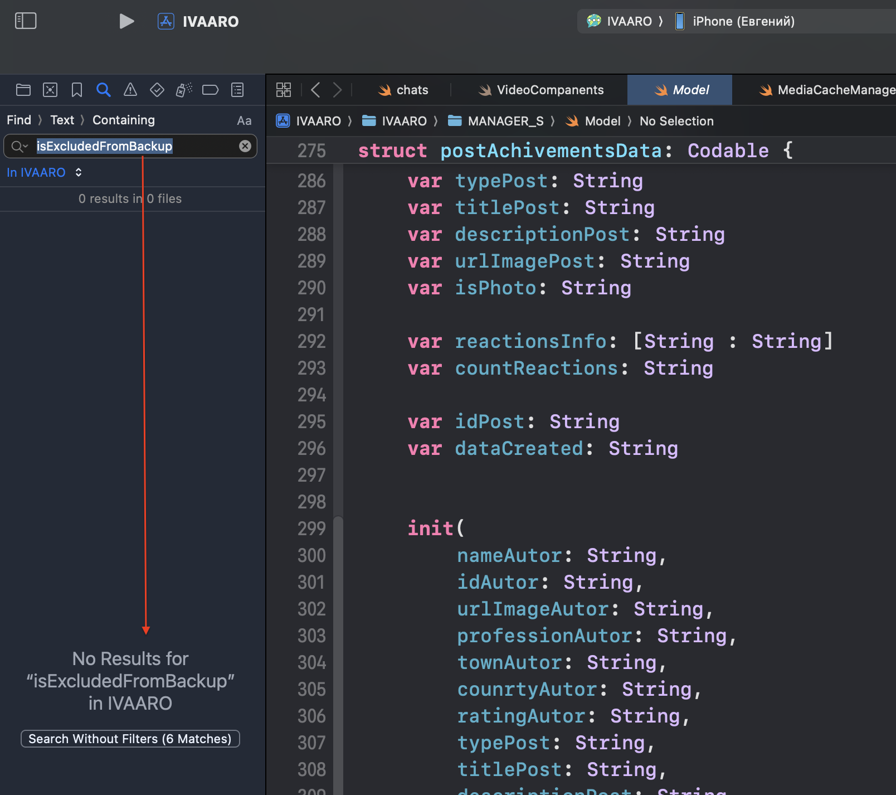


------

🟡 `(SAST)`
#### 🟨 Способ 2 -  Поиск по собранному приложению (Без исходников)
через RADARE 2

создаю архив (это тоже самое, когда есть исходик скачанный из appstore , НО НЕ ЗАШИФРОВАННЫЙ) как будто скачали из appstore и смогли расшифровать
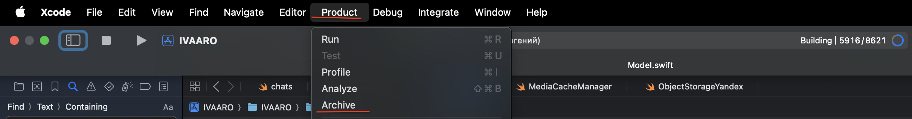


сделал архив и открыл его
в нем нашел файл - бинарник, вот так и лежит код приложения
вес 4.5 мб

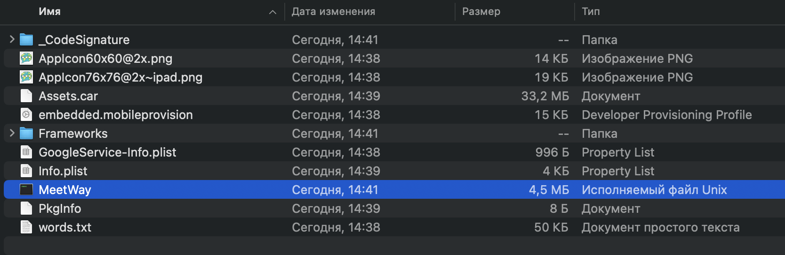


далее

```bash
# поставил radare2 
brew install radare2

#  нужно открыть бинарник в radare2 с автоматическим анализом
r2 -A ~/Users/evgeniy/Desktop/IVAARO\ 06.04.2026,\ 14.41.xcarchive/Products/Applications/MeetWay.app/MeetWay

# и уже внутри radare2 выполнить поиск вызова функции
/ isExcludedFromBackup
```

результат проверки радаром2 показал, что файл что название `isExcludedFromBackup` вообще не встречается в банарнике приложения. это плохо, значит, что все, что там вообще есть - приложение не исключает файлы с чувствительными данными из резервного копирования. Токены доступа, ключи и личные данные пользователей могут утекать в iCloud или iTunes-бэкап!

а вот так выглядит бинарник, если его просто открыть 

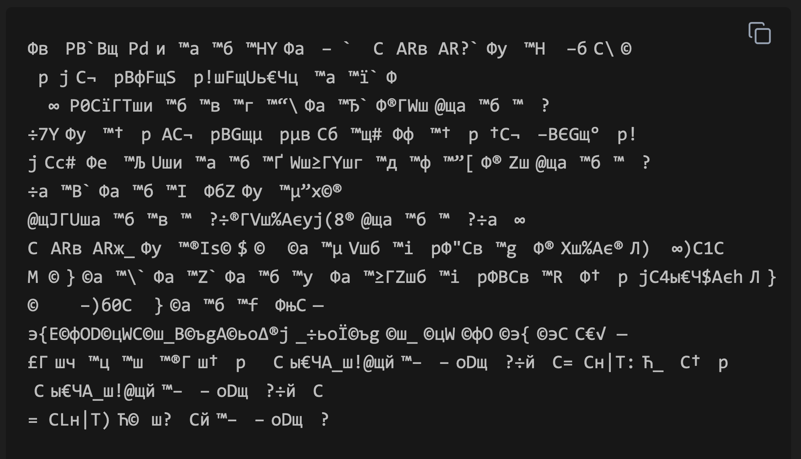


и такого добра целые мегабайты


---------

🟡 `(DAST)`
#### 🟨Способ 3: Создание и анализ бэкапа через Finder

#### Цель:
Проверить, попадают ли чувствительные данные (токены, сессии) в резервную копию iOS

```q
При создании резервной копии iOS-устройства через Finder (или iTunes) система сохраняет **все файлы из приватной директории приложения**, за исключением папок `/Library/Caches` и `/tmp` -  Сюда входят:

- `Documents/` - пользовательские документы и данные
    
- `Library/Application Support/` - вспомогательные файлы приложения
    
- Любые другие файлы, для которых разработчик **не установил** флаг `isExcludedFromBackup = true` 
   

Если приложение сохраняет токены, пароли или другие чувствительные данные в этих директориях без флага исключения - они гарантированно попадут в бэкап

```

1 - ставлю на айфон нужное приложение
2 - пользуюсь приложением, чтобы там прогнать все токены и пароли

3- открываю через finder телефон и нажимаю  `cоздать резвр копию сейчас`

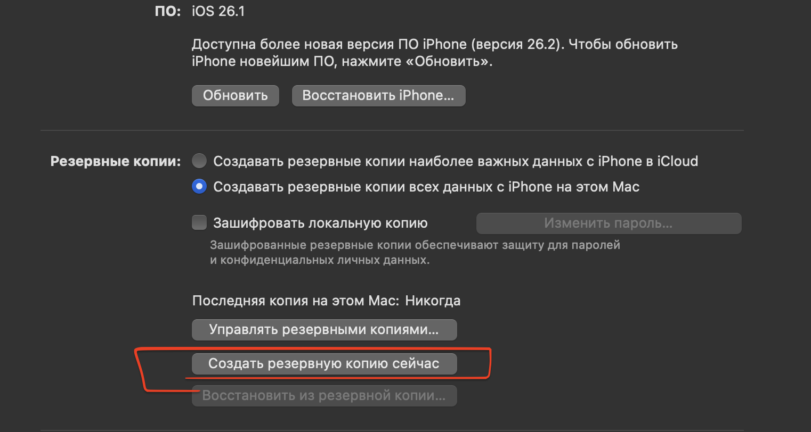


Бэкапы хранятся в скрытой системной папке

можно открыть тут же через  `управлять резервными копиями`

или  вот так

`open ~/Library/Application\ Support/MobileSync/Backup/`

потом
для полного анализа можно восстановить всю структуру песочницы
выбрав bundle id нужного приложения:

```q
# Создаём папку для извлечения
mkdir ~/Desktop/meetway_backup_extract
cd ~/Desktop

sqlite3 Manifest.db "SELECT fileID, relativePath FROM Files WHERE domain = 'AppDomain-AIVARO22-2025-1.0';" | while IFS='|' read FILEID RELATIVEPATH; do
    SUBDIR=$(echo $FILEID | cut -c1-2)
    SOURCE="$SUBDIR/$FILEID"
    DEST="meetway_backup_extract/$RELATIVEPATH"
    if [ -f "$SOURCE" ]; then
        mkdir -p "$(dirname "$DEST")"
        cp "$SOURCE" "$DEST"
    fi
done
```

после этого в папке `~/Desktop/meetway_backup_extract` будет полная структура песочницы приложения с оригинальными именами файлов и папок

и нужно просто искать там токены, пароли, JWT, и другие данные, и если они там находятся -  то все данные, что хранило приложение - попадут в бекап = уязвимость!

#### риск:
Злоумышленник с доступом к iCloud или локальному бэкапу может украсть токен и войти в аккаунт пользователя

#### как правильно: 
 хранить токены в Keychain или установить `isExcludedFromBackup = true` к чувствительным данным

создал резервную копию без шифрования

открываю ее

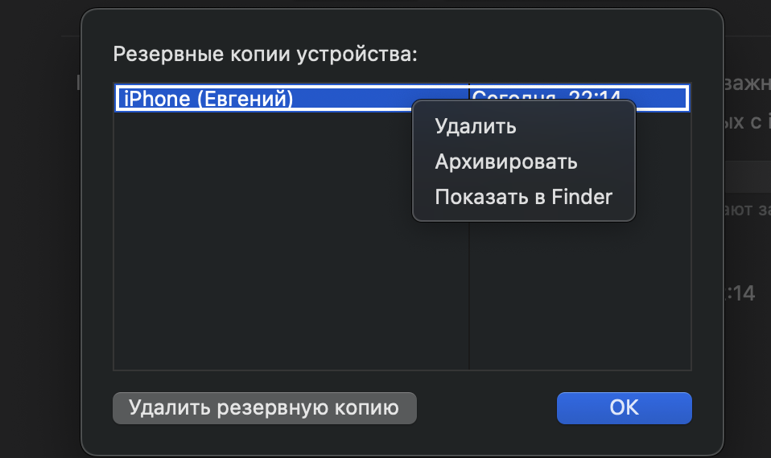


вот так это все дело выглядит , одна бинарщина 
```q
}!1AQa"q2БС°#B±ЅR—р$3brВ	
%&'()*456789:CDEFGHIJSTUVWXYZcdefghijstuvwxyzГДЕЖЗИЙКТУФХЦЧШЩЪҐ£§•¶І®©™≤≥іµґЈЄєЇ¬√ƒ≈∆«»… “”‘’÷„ЎўЏбвгдежзийкстуфхцчшщъ	
w!1AQaq"2БBС°±Ѕ	#3Rрbr—
$4б%с&'()*56789:CDEFGHIJSTUVWXYZcdefghijstuvwxyzВГДЕЖЗИЙКТУФХЦЧШЩЪҐ£§•¶І®©™≤≥іµґЈЄєЇ¬√ƒ≈∆«»… “”‘’÷„ЎўЏвгдежзийктуфхцчшщъ€Џ?цЎї∆ЏwГьwЂшgIТ+ЂIТ|ƒXЋеХIнцо№сє:cЏЊйэЬ€mЭвК£?ъЛ4
:;hµ‘ђ/ђгЁ•м8Uъ+В6nѕѓХњnЎk^ш-«∆OАРѕ'
```
поэтому в таком виде, конечно, ничего путевого не найти!

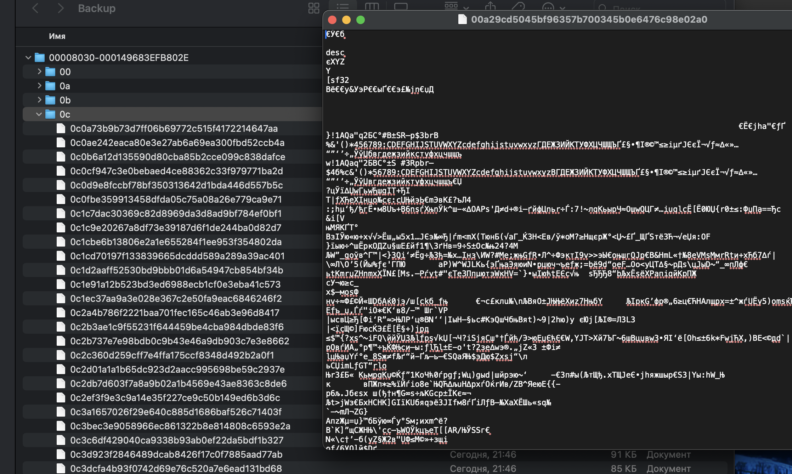


итак - теперь нужно вытащить от сюда файлы нужного приложения и привести все в божий вид

через терминал можно найти папку с нужным бекапом 

```q
evgeniy@Evgeniys-MacBook-Pro ~ % ls -la ~/Library/Application\ Support/MobileSync/Backup/


total 16
drwxr-xr-x    4 evgeniy  staff   128  7 апр 22:16 .
drwxr-xr-x    4 evgeniy  staff   128  7 апр 22:15 ..
-rw-r--r--@   1 evgeniy  staff  6148  7 апр 22:16 .DS_Store
drwxr-xr-x  263 evgeniy  staff  8416  7 апр 22:16 00008030-000149683EFB802E

 --------
 вот моя папка 00008030-000149683EFB802E

```

дальше мне нужно вытащить  Manifest.db  (на Desktop)

```q
cp ~/Library/Application\ Support/MobileSync/Backup/00008030-000149683EFB802E/Manifest.db ~/Desktop/
```

теперь, как появился файл на рабочем столе
нужно найти файлы от моего приложения
```q
sqlite3 ~/Desktop/Manifest.db "SELECT fileID, relativePath FROM Files WHERE domain = 'AppDomain-AIVARO22-2025-1.0';"
```

вот ответ
и тут  интересные места - это:

- `   Documents/` — папка, куда часто сохраняют токены
    
- `Library/Preferences/AIVARO22-2025-1.0.plist` — стандартное место для настроек и токенов
    
- `Library/Cookies/Cookies.binarycookies` — могут быть сессии


```q
evgeniy@Evgeniys-MacBook-Pro ~ % sqlite3 ~/Desktop/Manifest.db "SELECT fileID, relativePath FROM Files WHERE domain = 'AppDomain-AIVARO22-2025-1.0';"
71722755b2f502d84d70c5a1666e49c6ba9ca2e5|
42e8dbed91dd5bd16215f186c31f5fd6e17826be|Library
b7c4feb6c552781cc30a36c0a3266d405dbd1b53|Library/HTTPStorages
4c84c97d57559ad8f292b9b89566c9886e727fac|Library/Preferences
cd9b8a2a5154543d7b03e77b7e69ac6b63291c6a|Library/Cookies
2f49e232bae200f09fcf1c0096ea41c0b2046b88|Library/Application Support
6a82dabea988bc0fd1ffacf79e15a6f6f0c5ccbd|Library/Application Support/google-heartbeat-storage
bec0afdb1022e8cd7edc159b90ddfaca42274124|Library/Application Support/Google
6f811d9c6996da5b15de5f0f6b21a81ebbbdd43e|Library/Application Support/Google/FirebaseMessaging
84dff82fb03d93a4e6f89301ba4758aaf51eccca|Library/Application Support/Google/FirebaseInstanceID
38756c199bbbed481f9ec88f0494e9cf5cc1b501|Documents
183a80d9460bfbe999aa536cc6f336603aac9550|Library/Application Support/google-heartbeat-storage/heartbeats-1_155577473113_ios_1bab55adcf9d3b39893948
7fe62f92c487446936b359ac3ca3c3e4cde00e35|Library/Preferences/AIVARO22-2025-1.0.plist
ec76e7a6057f8a76d92fafb9c452bb00a8314a60|Library/Application Support/Google/FirebaseMessaging/rmq2.sqlite
9c8f20607f7a2c143e458b1aa24e8eea51e391f7|Library/Cookies/Cookies.binarycookies
fb14c16a2bb65bb712aa0cc28f28fb8d52cf1285|Library/Preferences/com.firebase.FIRInstallations.plist
evgeniy@Evgeniys-MacBook-Pro ~ %
```

дальше я сразу извлеку все файлы

```bash
cd ~/Desktop
mkdir -p meetway_backup_extract
BACKUP_PATH=~/Library/Application\ Support/MobileSync/Backup/00008030-000149683EFB802E

sqlite3 ~/Desktop/Manifest.db "SELECT fileID, relativePath FROM Files WHERE domain = 'AppDomain-AIVARO22-2025-1.0';" | while IFS='|' read FILEID RELATIVEPATH; do
    if [ -n "$FILEID" ] && [ -n "$RELATIVEPATH" ]; then
        SUBDIR=$(echo $FILEID | cut -c1-2)
        SOURCE="$BACKUP_PATH/$SUBDIR/$FILEID"
        DEST="meetway_backup_extract/$RELATIVEPATH"
        if [ -f "$SOURCE" ]; then
            mkdir -p "$(dirname "$DEST")"
            cp "$SOURCE" "$DEST"
            echo "Извлечено: $RELATIVEPATH"
        fi
    fi
done
```

ответ
```q
Извлечено: Library/Application Support/google-heartbeat-storage/heartbeats-1_155577473113_ios_1bab55adcf9d3b39893948
Извлечено: Library/Preferences/AIVARO22-2025-1.0.plist
Извлечено: Library/Application Support/Google/FirebaseMessaging/rmq2.sqlite
Извлечено: Library/Cookies/Cookies.binarycookies
Извлечено: Library/Preferences/com.firebase.FIRInstallations.plist
evgeniy@Evgeniys-MacBook-Pro Desktop %
```

отлично!
теперь в этих извлеченных файлах можно искать токены/пароли итд итп

```bash
# 1. смотрим главный plist настроек (самое вероятное место для токена)
plutil -p ~/Desktop/meetway_backup_extract/Library/Preferences/AIVARO22-2025-1.0.plist
```

🫣 и вот че нашлось, вот так находочка!
```
{
  "fcmToken" => "cXrKB2CiE0mEkOmHblqy8S:APd91bHeryn_HvrjUwj11Mx3FjNB2ZxiN2wwWf-iU-MB0Q7wnH2OebmwedmRM3g98wef-FcVjTFHywhxsU6nbFJubMml67Ne2345EFTYxC1420LkF2JYAk5TxxJPE"
  "key_1_enter" => [
    0 => 1
    1 => 1
    2 => 1
    3 => 1
    4 => 0
    5 => 0
  ]
  "kkr15" => "8137tr51gf"
  "myID" => "1497243782"
}
```


```bash
# 2. смотрю Firebase plist
plutil -p ~/Desktop/meetway_backup_extract/Library/Preferences/com.firebase.FIRInstallations.plist

```

здесь
```
{
  "1:155577473113:ios:1bab55adcf9d4b39593948__FIRAPP_DEFAULT" => 1
}
```


```bash

# 3. проверяем папку Documents (если есть файлы)
ls -la ~/Desktop/meetway_backup_extract/Documents/
# eсли есть файлы в Documents:
cat ~/Desktop/meetway_backup_extract/Documents/* 2>/dev/null
```

здесь ничего


а так можно искать точечно 
НО!!!!

при поиске чувствительных данных в бэкапе необходимо учитывать, что многие файлы (особенно .plist) хранятся в бинарном формате. Обычная команда `grep` не может прочитать такие файлы

```bash
# 4. ищем строку "token" во всех извлечённых файлах
grep -r "token" ~/Desktop/meetway_backup_extract/ 2>/dev/null
grep -r "access" ~/Desktop/meetway_backup_extract/ 2>/dev/null
grep -r "auth" ~/Desktop/meetway_backup_extract/ 2>/dev/null
```


---


короче, вывод по Способ 3 с бекапом!

Уязвимость подтверждена на 10000%.
Приложение сохраняет токен в `Library/Preferences/AIVARO22-2025-1.0.plist` без флага `isExcludedFromBackup = true`, и этот токен улетел в бэкап!!!!!!

###### Вывод:

- `fcmToken` - токен Firebase Cloud Messaging, который позволяет отправлять push-уведомления от имени пользователя
    
- `myID` - идентификатор пользователя

- `"kkr15" => "8137tr51gf"`  это в коде - часть соли, которая использовалась для AES шифрования персональных данных юзеров!

Оба значения являются ==чувствительными данными==, которые не должны попадать в резервную копию. Отсутствие флага `isExcludedFromBackup = true` привело к их утечке

```c
Результаты анализа бэкапа


Library/Preferences/AIVARO22-2025-1.0.plist` нашел `fcmToken` (токен FCM) | ❌ Высокая Чувствительность |


Library/Preferences/AIVARO22-2025-1.0.plist нашел `myID` (идентификатор пользователя) | ❌ Средняя/низкая  |


Library/Preferences/AIVARO22-2025-1.0.plist` нашел `kkr15` (соль для AES) | ❌ Критичная |

 ❌ УЯЗВИМОСТЬ ПОДТВЕРЖДЕНА
```


------


🟡 `(DAST)`
#### 🟨 Способ 5 - буду использовать Frida на iphone 11 ios 26 БЕЗ джейлбрейка

(сразу скажу, что здесь полный цикл конечно, но к успеху не пришел из - за того, что нетджейлбрейка и нет подписки apple developer)

```q
Есть джейлбрейк? Отлично, юзаем frida-server - это быстрее

Нет джейлбрейка? Берем objection patchipa (или Sideloadly, переподписываем, ставим и работаем)
```

###### немного теории

то есть можно использовать Frida (не полноценно, но мощно) на любом айфоне с любой ios

и даже без джейлбрейка через frida возможно:

-- ==Обходить SSL Pinning==  
(Objection имеет встроенную команду ios sslpinning disable, которая отключает pinning для большинства популярных библиотек)

-- ==Смотреть и изменять файлы внутри папки приложения==
(Objection даёт доступ к файловой системе приложения. Ты можешь листать папки, скачивать файлы на компьютер и загружать свои)

-- ==Дамптить Keychain этого приложения==
(Тоже делается одной командой: ios keychain dump)

-- ==Хучить (hook) любые функции внутри этого приложения==
(Objection позволяет искать классы, смотреть их методы и перехватывать вызовы в реальном времени)

=========================================

### как это делается    (frida без джейлбрейка)

есть два пути:

**Путь 1. Ручной (для понимания процесса)**

Это классический способ

1. **Берём IPA**. Файл приложения.
    
2. **Патчим (добавляем Frida Gadget)**. Нужно распаковать IPA, скопировать в него библиотеку `FridaGadget.dylib` и прописать команду, чтобы приложение её загружало. Для этого часто используют `optool`.
    
3. **Переподписываем**. Это самый важный шаг. После изменения подпись приложения ломается, и iOS не даст его установить. Нужно переподписать его **своим сертификатом разработчика**(подойдёт и бесплатный аккаунт Xcode)
    
4. **Устанавливаем на телефон**. Используем `ios-deploy` или Xcode.

====================================

**Путь 2. Автоматизированный (Objection — для реальной работы)**

Этот способ используют профессионалы. Objection делает всё, что описано выше, одной командой

- **Патчинг**: `objection patchipa --source myapp.ipa`
    
- **Подключение**: Objection сам найдёт пропатченное приложение на телефоне


-------------


далее можно не читать , так как не относится к этому тесту в полной мере, я разбирался в том, как мне без jailbreak работать с frida

но так как нету ни Jailbreak, и нету подписки Apple Developer то у меня не получилось это сделать, но для данного теста это всё равно было бы слишком избыточно


-----------

###  ниже нихрена не работало - потому что jailbreak у меня нет, а также у меня нету действующей подписки Apple Developer, из-за чего я не могу создать нормальный архив приложения для распространения или для дебага

Короче говоря все что здесь было написано все должно работать если бы использовал правильный архив полученный через Xcode, но так как нет подписки Apple Developer то тогда не получилось бы получить правильный архив который можно было бы потом пропатчить и установить на телефон., Если есть подписка то нужно сделать все то же самое и все будет работать., Либо если есть jailbreak тогда разговор вообще другой.


#### подготовка  окружения 

- **Установка Python и pip** (для Frida и Objection):
    
    `brew install python@3`
    
- **Установка Frida и Objection**:
    
    `pip3 install frida-tools objection`
    
- **Установка ios-deploy** (для установки приложения на телефон):
    
	`brew install ios-deploy`

	**ставим  applesign (нужно при патчинге)

	`npm install -g applesign`

	**также нужна прога   -  insert_dylib

```bash
git clone https://github.com/Tyilo/insert_dylib && cd insert_dylib && xcodebuild && cp build/Release/insert_dylib /usr/local/bin/insert_dylib && cd ..
```


------

в xCode нужно войти в свой Apple ID и базовый сертификат 

-----

#### данные сертификата
(подскика apple develop - не обязательна)

потом командой - узнать свой сертификат

`security find-identity -p codesigning -v`

вот так будет выглядеть он
```q
1) 22AF22B721D16225FD221C01D26D3FCFF7E95D44 "Apple Development: Evg Chern (CJJ5HX4K2L)"
```

 Это нужно, чтобы утилиты знали, какой сертификат использовать для подписи

-------

далее

 #### Создаем "боевой" IPA
 
  (Archive) для патчинга
  
Нам нужен IPA-файл. Важно собрать его для реального устройства (arm64)

в xcode открыв приложение,  на которое будем ставить frida-tools objection

создаем архив (arm64) Product > Archive > Distribute App (все как обычно перед отправкой в appStore)

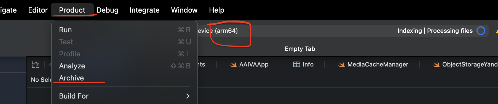


 > Development или (Debugging) или (Custom) → Next →  выбрать Debugging  - >> выбрать свой iPhone → Next

полученный файл сохранить Export - (например на рабочий стол)

(но у меня подписка apple develop закончилась и xcode не дает мне создавать .ipa архивы)

вот так ругается и у меня есть только файл архив `IVAARO 07.04.2026, 01.27.xcarchive`

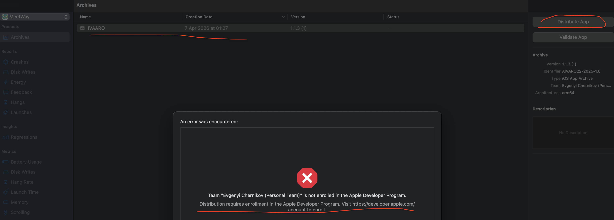


`IVAARO 07.04.2026, 01.27.xcarchive`

###### но раз xcode не разрешает это сделать -  то можно обойти данное ограничение

вот так:

1) через xcode устанавливаю приложение на телефон
2)  идем в fider  cmd+shift+G
3) ~/Library/Developer/Xcode/DerivedData
4) 

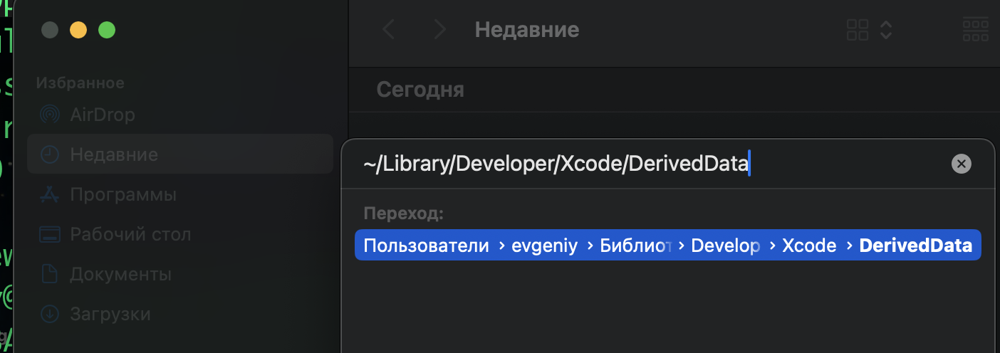


находим там свою свежую сборку

далее Build/Products/Debug-iphoneos/

и вот тут есть  само приложение MeetWay.app  168 мб ! расширение .app 

Это и есть мое приложение, готовое к установке. Оно уже подписано твоим сертификатом и не зашифровано!

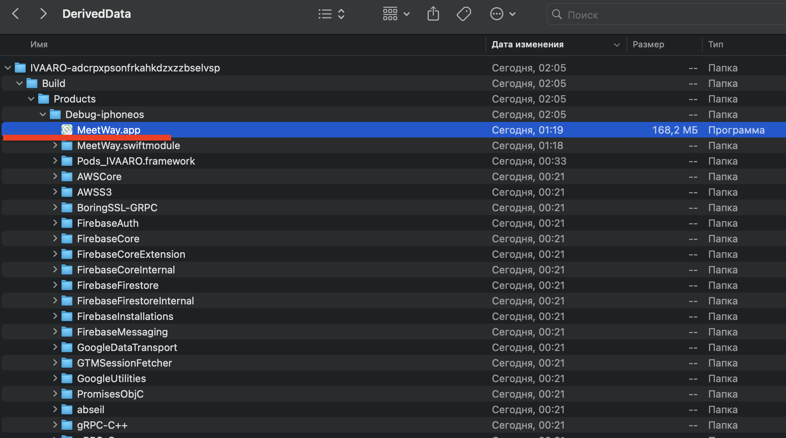


--------

#### Превращаем `.app` в `.ipa` (нужно для патчинга)

Objection удобнее работать с `.ipa`. Превратить `.app` в `.ipa` очень просто:

1. Создаю на рабочем столе папку `Payload`
2. копирую в неё папку `MeetWay.app` (ту что нашел, что весит 168мб)
3. Открываем терминал и выполняем:

    ```
    cd ~/Desktop
    zip -r MeetWay.ipa Payload
    ```

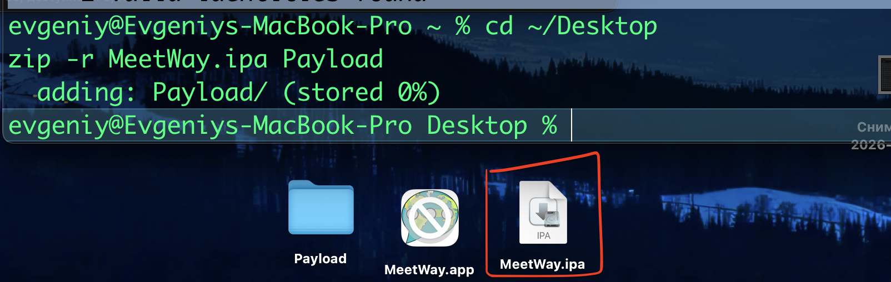


Всё! Теперь у меня есть **`MeetWay.ipa`** на рабочем столе, который можно патчить через Objection!!

-------

#### Патчим IPA с помощью Objection

нужно добавить Frida в мое приложение и переподписать его!


# Патчим IPA
```bash
objection patchipa --source MeetWay.ipa --codesign-signature "ТВОЙ_ХЕШ_СЕРТИФИКАТА"  - не работает - застрял здесь!
```


# Устанавливаем на телефон
```bash
ios-deploy --bundle Payload/MeetWay.app -W -d

```

получилось, установил приложение! запускаю - там черный экран!

приложение с Frida Gadget специально "висит" на черном экране, ожидая подключения через ПК

-------

открываю отдельный терминал и выполняю

подключение к objection (и можно будет выполнять команды!)

`objection -g "AIVARO22-2025-1.0" explore`

(AIVARO22-2025-1.0 - это bundle ID прилы, можно в xcode посмотреть)

но нихуя не работает, ошибки


-----

пробую скачать https://sideloadly.io/ и установить приложение пропатченное через эту программу

скачал **Sideloadly**
открыл
перенес в него свое пропатченное приложение
ввел appId и пароль,,, сыкотно конечно..

старт!

и все готово - приложение встало на телефон

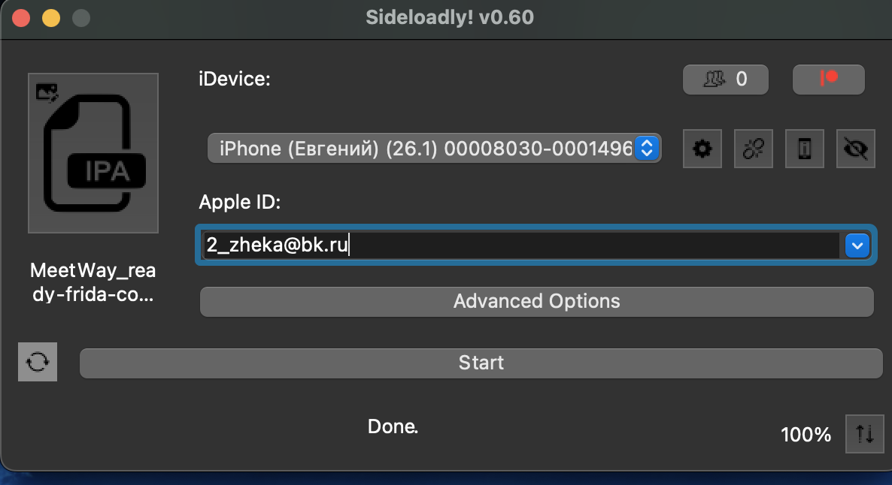


теперь открыл приложение на телефоне - черный экран - само свернулось

через в терминале запускаю
`objection -g "AIVARO22-2025-1.0" explore`

и приложение на телефоне само открылось и вижу черный экран

------

итак - все сначала!!

беру .app приложение 168 мб

создаю чисты файл .ipa - который готов к патчингу!
```bash
cd ~/Desktop
mkdir Payload
cp -R MeetWay.app Payload/
zip -r OriginalMeetWay.ipa Payload
rm -rf Payload
```

патчу через objection

```q
objection patchipa --source OriginalMeetWay.ipa --codesign-signature "38AF84B721D16525FD661C01D36D3FCFF7E75D23"
```

и тперь есть файл : OriginalMeetWay-frida-codesigned.ipa
отлично!


теперь пробую установить приложение свое на айфон через **iOS-deploy** 

распаковал IPA в папку
```bash
unzip -o ~/Desktop/OriginalMeetWay-frida-codesigned.ipa -d ~/Desktop/PatchedPayload
```

теперь ставлю его на телефон (айфон подключен кабелем)

```bash
ios-deploy --bundle ~/Desktop/PatchedPayload/Payload/MeetWay.app -W -d
```

приложение установилось на телефон!

пробую подключиться к приложению
сперва запустил приложение

и потом на компе в терминале подключа/сь
```bash
objection -g "AIVARO22-2025-1.0" explore
```

но нихуя не вышло - ошбика
```bash
evgeniy@Evgeniys-MacBook-Pro ~ % objection -g "AIVARO22-2025-1.0" explore
/Users/evgeniy/Library/Python/3.9/lib/python/site-packages/urllib3/__init__.py:35: NotOpenSSLWarning: urllib3 v2 only supports OpenSSL 1.1.1+, currently the 'ssl' module is compiled with 'LibreSSL 2.8.3'. See: https://github.com/urllib3/urllib3/issues/3020
  warnings.warn(


A newer version of objection is available!
You have v1.11.0 and v1.12.4 is ready for download.

Upgrade with: pip3 install objection --upgrade
For more information, please see: https://github.com/sensepost/objection/wiki/Updating

Using USB device `iPhone`
Unable to connect to the frida server: need Gadget to attach on jailed iOS; its default location is: /Users/evgeniy/.cache/frida/gadget-ios.dylib
evgeniy@Evgeniys-MacBook-Pro ~ %


--------

Objection пропатчил IPA, но Frida Gadget внутри приложения **не стартует** или **не слушает** на стандартном порту. На неджейлбрейкнутом телефоне Gadget должен сам поднимать сервер, но из-за подписи, энтайтлментов или версии iOS 26 - он тупо молчит

Команда `frida-ps -U` показала **все процессы на телефоне**, но твоего приложения `MeetWay` там **НЕТ**. Даже grep ничего не нашёл. Это значит, что Frida Gadget внутри приложения **не запустился** или приложение **упало сразу после старта** (чёрный экран и свернулось -явный признак)
```

почему такая проблема?

На iOS 26 без джейлбрейка пропатченное через objection приложение часто не может загрузить FridaGadget.dylib из-за:

1. Неправильных энтайтлментов при подписи
    
2. Отсутствия `FridaGadget.dylib` в нужной папке
    
3. iOS 26 имеет усиленные проверки подписи


----------

Короче говоря все что здесь было написано все должно работать если бы использовал правильный архив полученный через Xcode, но так как нет подписки Apple Developer то тогда не получилось бы получить правильный архив который можно было бы потом пропатчить и установить на телефон., Если есть подписка то нужно сделать все то же самое и все будет работать., Либо если есть jailbreak тогда разговор вообще другой.