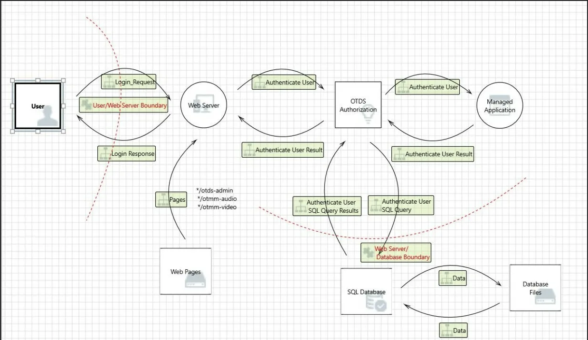
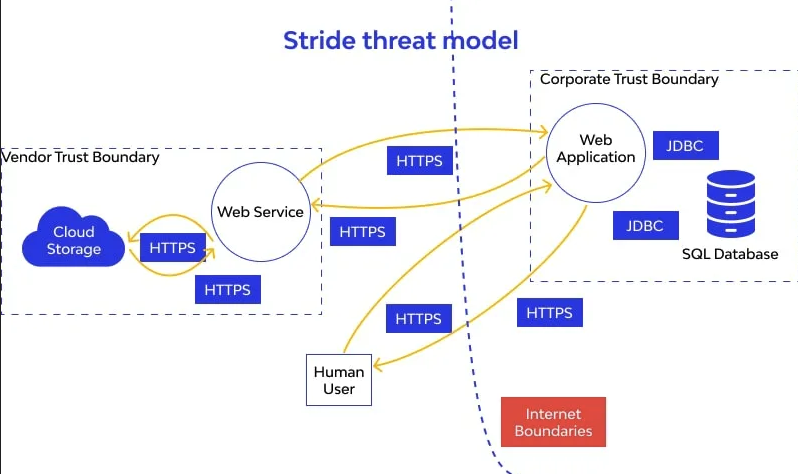

# STRIDE 

STRIDE - это методология ****стратегического поиска угроз безопасности**** в архитектуре приложения. Придумана Microsoft в начале 2000-х. Не про код, а про ****дизайн системы****


> «Ты не починишь уязвимость, если не знаешь, где её искать. STRIDE - карта, по которой ты ищешь»

---------

**полный цикл работы AppSec инженера выглядит так:**

1. **Находим** потенциальные угрозы (используешь STRIDE как фреймворк, накидываешь гипотезы: «здесь может быть подмена, здесь отказ в обслуживании...»).
    
2. **Проверяем** их реальность (гоняешь `radare2`, `semgrep`, пишешь PoC).
    
3. **Триажим** (если угроза реальна - оцениваем, насколько она опасна и срочна, используя **DREAD** или **CVSS**). Это **триаж**.
    
4. **Фиксим** или отправляем баг-репорт разработчикам


------------


начинается все со схемы
вот примеры

начинается с того, что нужно составить схему того - как работает весь сервис, вся система, как компоненты взаимодействуют между собой, и уже понимая это, можно находить наиболее важные узлы, которые необходимо проверить в первую очередь!
а также видеть всю систему целиком, видеть все запросы и функционал!




или вот 




---

  ## 1. STRIDE - каждая буква = тип угрозы

  
```

┌─────────────────────────────────────────────────────────┐

│  S — Spoofing      (Подмена личности)                   │

│  T — Tampering     (Изменение данных)                   │

│  R — Repudiation   (Отказ от действий)                  │

│  I — Information Disclosure (Разглашение данных)        │

│  D — Denial of Service      (Отказ в обслуживании)      │

│  E — Elevation of Privilege (Повышение привилегий)      │

└─────────────────────────────────────────────────────────┘

```

  
--------

# STRIDE 


### 🟡 S - Spoofing (Подмена)

  

Когда лоумышленник выдает себя за другого пользователя/систему

  

- ****например:**** 

  - Кража JWT токена → вход под чужим аккаунтом

  - Подмена DNS → фишинг

  - ARP spoofing в локальной сети

  - Подмена SSL-сертификата

  

****контрмеры:****

- MFA (многофакторная аутентификация)

- Подпись токенов (RS256, а не HS256)

- Certificate pinning

- Biometric authentication

  

---

  

###  🟡  T - Tampering (Изменение)

  

Что: Кто-то меняет данные, которые не должен

  

- ****Примеры:****

  - Изменение JSON в запросе на сервер

  - Man-in-the-middle: перехват и модификация трафика

  - Редактирование базы данных напрямую

  - Изменение бинарника приложения (repackaging)

  

****Контрмеры:****

- Цифровые подписи данных

- HMAC (контроль целостности)

- HTTPS/TLS

- Code signing

- Integrity checks (проверка хешей)

  

---

  

### 🟡 R - Repudiation (Отказ)

  

Что: Пользователь/система делает действие, а потом говорит «я этого не делал».

  
- ****Примеры:****

  - Пользователь удалил пост и говорит «это не я»

  - Админ забанил юзера и утверждает, что не делал этого

  - Клиент отправил запрос, но сервер говорит «не получал»

  

****Контрмеры:****

- Аудитные логи (audit logs)

- Цифровые подписи действий

- Non-repudiation сертификаты

- Логи с timestamps + кто сделал

  

---

  

### 🟡  I - Information Disclosure (Разглашение)

  

когда конфиденциальная информация утекает туда, где её не должно быть

  

- **примеры:**

  - Пароль в логах (MASTG-TEST-0296!)

  - API ключ в JS-файле на фронтенде

  - Stack trace с SQL-запросами

  - Личные данные в URL (GET params)

  - Чувствительные поля в JSON-ответе, которые не должны быть там

  

**Контрмеры:***

- Шифрование (in-transit + at-rest)

`- <private> в os_log (iOS)`

- Минимизация данных в ответах API

- Маскировка sensitive полей

  

---

  

### 🟡  D - Denial of Service (Отказ)

  

это когда система перестаёт отвечать или работает с ошибкой

  

- **Примеры:***

  - DDoS на эндпоинт

  - Billion laughs attack (XML bomb)

  - Отправка гигантского файла

  - Hash DoS (коллизии в HashMap)

  - ReDoS (Regex DoS)

  

**Контрмеры:**

- Rate limiting

- Лимиты на размер запроса/файла

- Web Application Firewall (WAF)

- CDN

- Timeout'ы на все операции

  

---

  

### 🟡  E - Elevation of Privilege (Повышение привилегий)

  

Что это: Обычный пользователь делает то, что может только админ

  

- ****Примеры:****

  - IDOR: /api/user/123 → меняем на /api/user/456

  - Admin panel без проверки роли

  - SQL injection → RCE (выполнение команд)

  - Privilege escalation через баг в бизнес-логике

  

****Контрмеры:****

- Проверка ролей на КАЖДОМ запросе (не только на фронтенде)

- Principle of least privilege

- RBAC (Role-Based Access Control)

- Проверка ownerId везде

  

---

  

## 2. Полный цикл Threat Modeling с STRIDE

  

```

┌────────────────────────────────────────────────────────────┐

│  ШАГ 1: Декомпозиция  —  рисуем схему системы             │

│  ШАГ 2: Определяем угрозы — STRIDE по каждому элементу    │

│  ШАГ 3: Оценка рисков    — как критично?                  │

│  ШАГ 4: Контрмеры        — что делаем?                    │

│  ШАГ 5: Валидация        — сработало?                     │

│  ШАГ 6: Документация     — записали, кто ответственный    │

└────────────────────────────────────────────────────────────┘

```

  

### Шаг 1 - Декомпозиция системы

  

🚦 рисунок ***Data Flow Diagram (DFD)***

**Элементы DFD:**

```

    ┌──────────┐          ┌─────────────┐          ┌───────────┐

    │  External │──запрос──│   Process   │──запрос──│ Data Store│

    │  Entity   │          │             │          │  (БД)     │

    │ (User/    │          │ (API/App)   │          │           │

    │  Service) │◄─ответ───│             │◄─ответ───│           │

    └──────────┘          └─────────────┘          └───────────┘

                              │

                              │  Trust Boundary

                              ▼  ─ ─ ─ ─ ─ ─ ─

```

  

ну например так


```q


  

┌──────────┐    HTTPS     ┌──────────────────┐     ┌───────────┐

│  User    │─────────────▶│  iOS App          │────▶│  Firebase  │

│ (iPhone) │◀─────────────│  (прила)        │◀────│  Auth      │

└──────────┘              └─────────┬────────┘     └───────────┘

                                    │

                                    │ Yandex Cloud functions

                                    ▼

                            ┌──────────────────┐     ┌───────────┐

                            │  Yandex Cloud    │────▶│  YDB      │

                            │  Functions (API)  │◀────│  (БД)     │

                            ├──────────────────┤     └───────────┘

                            │  Yandex Object   │

                            │  Storage (S3)     │

                            └──────────────────┘

```

  

****Trust Boundaries**** (границы доверия) - места, где данные переходят из одной зоны в другую:

  

- Телефон ↔ Интернет

- Приложение ↔ Яндекс.Облако

- Яндекс.Функции ↔ YDB

- Яндекс.Функции ↔ Object Storage

  

---

  

### Шаг 2 - STRIDE по каждому элементу

  

Для каждого элемента DFD задаём вопросы из STRIDE:

  

```q

| Элемент          | S | T | R | I | D | E | Вопрос                                       |

|------------------|---|---|---|---|---|---|---------------------------|

| iOS App          | ✅| ✅ |  | ✅ |   | ✅ | Может ли юзер подменить другого? JWT украл? |

| Yandex Functions |   | ✅ | ✅ | ✅ | ✅ | ✅ | Может ли юзер вызвать чужую функцию?        |

| YDB              |   | ✅ |   | ✅ | ✅ |   | Можно ли сделать SQL injection?             |

| Object Storage   |   | ✅ |   | ✅ | ✅ |   | Можно ли прочитать чужой файл?              |

| Firebase Auth    | ✅ |   |   |   |   |   | Можно ли подделать токен?                   |

| HTTPS канал      |   | ✅ |   |   |   |   | Есть ли MITM? А certificate pinning?        |

```

  

---

  

### Шаг 3 - Оценка рисков

  

****Формула:**** `Risk = Likelihood × Impact`

  

Шкала 1–5 (или Low–Medium–High–Critical).

  

```q

| Угроза                   | Вероятность | Влияние | Риск     |

|--------------------------|-------------|---------|----------|

| JWT подделан             | Средняя     | Высокое | CRITICAL |

| S3 bucket public         | Низкая      | Крит.   | HIGH     |

| XSS в чате              | Высокая     | Среднее  | HIGH      |

| Rate limiting нет        | Средняя     | Низкое  | MEDIUM   |

| UserDefaults с солью     | Высокая     | Крит.   | CRITICAL |

```

  

---

  

### Шаг 4 - Контрмеры

  

На каждую угрозу - конкретное решение:

  

```q

| Угроза       | Контрмера                         | Приоритет |

|--------------|-----------------------------------|-----------|

| JWT подделан | → RS256 + проверка на бэкенде   | 🔴 HIGH   |

| DoS на API   | → Rate limiting + WAF            | 🟡 MEDIUM |

| Утечка логов | → <private> в os_log + обфускация| 🔴 HIGH   |

| IDOR         | → Проверка ownerId на бэкенде    | 🔴 HIGH   |

```

  

---

  

### Шаг 5 - Валидация

  

Проверяем, что контрмера сработала:

  

```q

| Контрмера                     | Как проверить                              |

|-------------------------------|--------------------------------------------|

| JWT — RS256 подпись          | Попробовать подделать токен → reject       |

| Rate limiting                 | Слать 100 запросов в сек → 429 Too Many    |

| Нет логов sensitive данных   | Запустить idevicesyslog → ищем утечки      |

| Проверка ownerId              | Поменять user_id в запросе → forbidden     |

```

  

---

  

### Шаг 6 - Документация

  

Создаёшь файл (я обычно в таком формате):

  

```q

# THREAT MODEL: MeetWay - iOS Social Network

# Дата: 2026-05-20

# Версия приложения: 1.0

# Автор: Евгений (AppSec Engineer)

  

## 1. Data Flow Diagram

[ссылка на картинку DFD]

  

## 2. Допущения

- Все ключи сервера хранятся в Yandex Secret Manager

- Пользователи авторизуются через Яндекс ID

- JWT валидируется на каждом запросе к API

  

## 3. Найденные угрозы

  

### [T001] - JWT может быть украден из логов

- Тип: Information Disclosure

- Компонент: iOS App → NSLog

- Описание: JWT попадает в NSLog при логине/разлогине/проверке

- Риск: CRITICAL (S1)

- Статус: 🔴 Открыта (рекомендация в работе)

  

### [T002] - Соль AES в UserDefaults

- Тип: Information Disclosure + Tampering

- Компонент: iOS App → UserDefaults

- Описание: kkr15 хранится в открытом виде

- Риск: CRITICAL (S1)

- Статус: 🟡 В обработке

  

## 4. Roadmap исправлений

| ID    | Контрмера                          | Deadline  | Ответственный |

|-------|-------------------------------------|-----------|---------------|

| T001  | Убрать NSLog, перейти на os_log    | 2 недели  | iOS Dev       |

| T002  | Перенести соль в Keychain          | 1 неделя  | iOS Dev       |

| T003  | Добавить rate limiting в API       | 1 месяц   | Backend Dev   |

  

## 5. Результаты валидации

[тут результаты тестов после исправлений]

  

## 6. Next Steps

- Исправить T001, T002

- Провести валидацию через 2 недели

- Написать тесты на STRIDE-угрозы в CI/CD

```

  

---

  

## 3. Что должен уметь AppSec инженер для STRIDE

  

### Hard Skills

  

```q

1. Читать архитектуру

   - Уметь рисовать DFD

   - Понимать взаимодействие микросервисов

   - Читать документацию по API (OpenAPI/Swagger)

  

2. Понимать технологии

   - Как работает аутентификация (OAuth 2.0, JWT, sessions)

   - Как работают базы данных (SQL, NoSQL)

   - Сети: DNS, HTTPS, TLS, прокси, CDN

   - Облака: IAM, S3, serverless, secrets management

  

3. Знать типовые уязвимости

   - OWASP Top 10 (веб)

   - OWASP MASVS (мобайл)

   - OWASP ASVS (веб API)

  

4. Уметь оценивать риски

   - CVSS scoring

   - Бизнес-контекст (что для приложения критично)

   - Likelihood vs Impact

  

5. SAST + DAST инструменты

   - Burp Suite (для валидации)

   - Semgrep (для автоматизации поиска)

   - Dependency check (для библиотек)

```

  

### Soft Skills

  

```q

1. Коммуникация с разработчиками

   - Не «дырявое приложение», а «тут мы не проверяем ownerId»

   - Конкретные PoC, не абстракции

  

2. Приоритизация

   - Не все баги надо фиксить (всегда trade-off)

   - Бизнес-риск > Технический риск

  

3. Документирование

   - Threat model = живой документ

   - Обновлять после каждого релиза

```

  

---

  

## 4. Как этому научиться (Roadmap)

  

```q

Этап 1: Теория (1-2 недели)

├── 📖 Прочитать Microsoft STRIDE docs

├── 📖 OWASP Threat Modeling Cheat Sheet

├── 📖 Adam Shostack "Threat Modeling: Designing for Security"

├── 🎥 https://www.youtube.com/watch?v=GqmQg-cszw4 (STRIDE за 15 минут)

└── Практика: Разобрать 3 чужих Threat Model документа

  

Этап 2: Практика на учебных проектах (2-4 недели)

├── Нарисовать DFD для MeetWay (сделали)

├── Пройти STRIDE по каждому элементу

├── Написать документацию

├── Найти 5+ угроз

└── Согласовать с "разработчиком" (мной)

  

Этап 3: Инструменты (1-2 недели)

├── Microsoft Threat Modeling Tool (бесплатно, Windows)

├── OWASP Threat Dragon (бесплатно, веб/кроссплатформа)

├── Cairis (open source)

├── IriusRisk (коммерческий, но есть free tier)

└── Практика: Нарисовать DFD в Threat Dragon

  

Этап 4: Реальная практика (неделя)

├── Взять любое open source приложение (что-нибудь на Swift/Java)

├── Сделать полный STRIDE цикл

├── Сравнить с реальными CVE этого приложения

└── Понять: «а что я пропустил?»

  

Этап 5: Автоматизация (последний этап)

├── Semgrep rules под STRIDE категории

├── Интеграция в CI/CD: при каждом PR → автоматический threat model check

├── Custom Burp extensions для проверки гипотез из threat model

└── ✅ Ты — AppSec инженер, который реально умеет STRIDE

```

  

---

  

## 5. Частые ошибки новичков

  

```q

❌ «Рисую DFD, потому что надо, но не использую его»

   → DFD нужен, чтобы НЕ ПРОПУСТИТЬ trust boundaries

  

❌ «Сделал STRIDE один раз и забыл»

   → Threat model - живой документ, обновляется с каждым релизом

  

❌ «Нашёл 100 угроз, но ни одной не починили»

   → Лучше 5 реальных критичных, чем 100 «теоретических»

  

❌ «STRIDE - это про код»

   → STRIDE - про АРХИТЕКТУРУ. Код ищешь отдельно

  

❌ «Не нужно спрашивать разработчиков, я сам всё знаю»

   → Разработчики знают логику, которых нет в документации

```

  

---

  

## 6. Пример STRIDE для MeetWay (кратко)

  

```q

iOS App:

  S - JWT может быть украден из логов / keychain

  T - Можно repack приложение, изменить логику

  I - UserDefaults содержит соль AES (kkr15)

  E - Jailbreak → доступ к файловой системе → Keychain

  

Yandex Functions (API):

  S - Нет проверки, что запрос от реального MeetWay

  T - JWT подделан → доступ к чужому профилю

  I - Stack trace в ответе (утечка информации)

  D - Нет rate limiting → DoS

  E - SQL injection через unsafe query

  

YDB:

  T - Injection при прямом запросе

  I - Логи YDB содержат чувствительные данные

  

Object Storage (S3):

  T - Изменение файлов при утечке ключей доступа

  I - Публичный доступ к S3 → читаем чужие фото

  D - Delete объекта → потеря медиа

  

HTTPS:

  T - Нет certificate pinning → MITM

  I - HTTP вместо HTTPS → перехват трафика

  

Firebase:

  S - Нет MFA → взлом аккаунта

  E - Неправильные rules → доступ к чужим данным

```

  

---

  

## 7. Главный принцип

  

> ****STRIDE - это не про то, как взломать. Это про то, как спроектировать систему так, чтобы её было сложно взломать.****

  

Если ты можешь нарисовать DFD и пройтись по каждой стрелке с вопросом «а что если злоумышленник тут?» - ты уже делаешь 80% работы AppSec инженера по threat modeling.

  

---

  

## Полезные ссылки

  

- OWASP Threat Modeling Cheatsheet: `https://cheatsheetseries.owasp.org/cheatsheets/Threat_Modeling_Cheat_Sheet.html`

- Microsoft STRIDE: `https://learn.microsoft.com/en-us/azure/security/develop/threat-modeling-tool-threats`

- OWASP Threat Dragon: `https://owasp.org/www-project-threat-dragon/`

- Adam Shostack "Threat Modeling: Designing for Security" (книга, база)

- Документация по MeetWay: `🚦MASTGE+CI_CD/ios_testing_MeetWay/0_MeetWay.md`