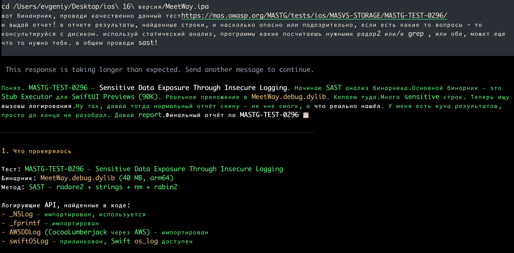
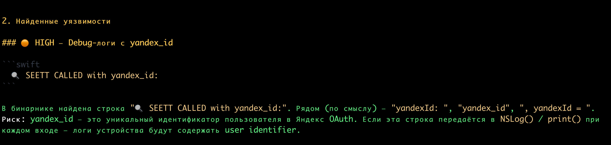
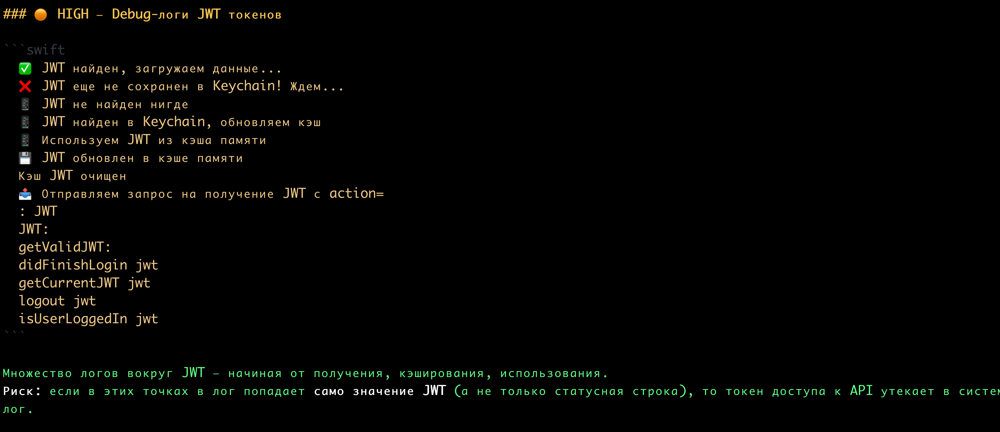
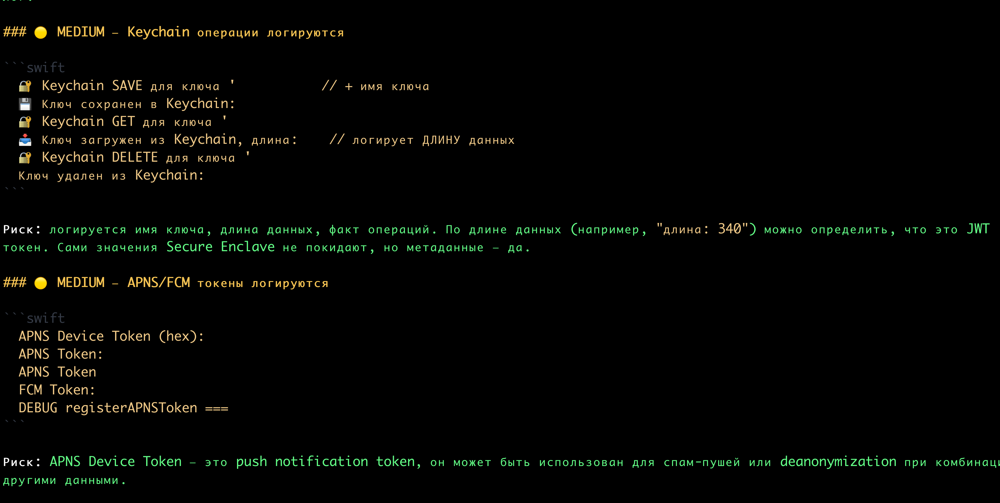
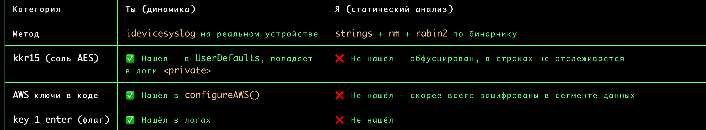

прошу LLM провести анализ бинарника ios приложения 

согласно тесту 
### MASTG-TEST-0296: Sensitive Data Exposure Through Insecure Logging

https://mas.owasp.org/MASTG/tests/ios/MASVS-STORAGE/MASTG-TEST-0296/

ЦЕЛЬ ДАННОГО ТЕСТА - ЭТО НАЙТИ ЛОГИ - КОТОРЫЕ РАССКРЫВАЮТ КОНФИДЕН

ВОТ ТУТ Я САМ ПРОВОДИЛ ТЕСТ 👉  [[_L1_тест_на _утечку_данных_через_логи]]


   ---------


## А ВОТ РЕЗУЛЬТАТЫ ТЕСТА КОТОРЫЙ ПРОВЕЛ ☠️_OpenСlaw ПО ЭТОМУ ЖЕ ЗАДАНИЮ

я не сильно заморачивался по составлению промта (это первая попытка проверить возможности OpenСlaw)
в следующий раз нужно будет давать ему базовый список команд и пейлоадов для него, и просить его дополнить его, и согласовать итоговый план действий обязательно! чтобы 100% контролировать все, что он может делать!













```c
Итоговая оценка

┌───┬──────────────────────────────────┬──────────┬────────────────────────────────────┐
│ # │ Угроза                                                     │ Severity │ Статус                             │
├───┼──────────────────────────-───────┼──────────┼────────────────────────────────────┤
│ 1 │ Debug-лог yandex_id                                        │ HIGH     │ ❌ Найдено                         │
├───┼──────────────────────────────────┼──────────┼────────────────────────────────────┤
│ 2 │ Debug-лог JWT токенов (неизвестно, логируется ли значение) │ HIGH     │ ❓ Требуется динамическая проверка │ 
├───┼──────────────────────────────────┼──────────┼────────────────────────────────────┤
│ 3 │ Keychain операции в логах (метаданные: имя ключа, длина)   │ MEDIUM   │ ❌ Найдено                         │
├───┼──────────────────────────────────┼──────────┼────────────────────────────────────┤
│ 4 │ APNS/FCM push token в логах                                │ MEDIUM   │ ❌ Найдено                         │
├───┼──────────────────────────────────┼──────────┼────────────────────────────────────┤
│ 5 │ Hardcoded AWS SNS ARN (sandbox)                            │ LOW      │ ✅ Инфо                            │
└───┴──────────────────────────────────┴──────────┴────────────────────────────────────┘

```

данный тест  стоит мне 2 рубля ( плата за дипсик v4 мощности )


-----------

### сравниваю все вместе - что нашел я и что нашел он

он нашел практически все что там есть!!! результат удивительный!!!

вот прям из того что я нашел  и в данном тесте и в похожей категории тестов у меня! - он тоже все нашел и дал рекомендации!

и это просто офигеть, че он творит...

при этом - он не нашел некоторые обфусцированные строки!

думаю, можно его заставить находить и такие обфусцированные строки, просто нужно это учесть в промте! чтобы он находил и показывал все находки, чтобы я уже их фильтровал вручную

(слева я - справа он)





------

# вывод


OpenСlaw - это оч мощный инструмент в правильных руках, в любом случае - нужно знать что и зачем и где искать!!!
на него можно взваливать разные задачи, но подробно составлять план для его работы, и на выходе будет большой буст к качеству и продуктивности!!
