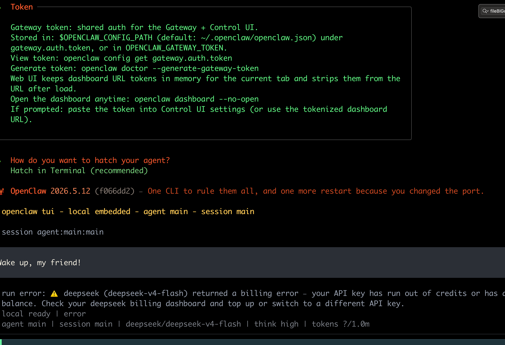

```q
▄▄▄▄▄▄▄▄▄▄▄▄▄▄▄▄▄▄▄▄▄▄▄▄▄▄▄▄▄▄▄▄▄▄▄▄▄▄▄▄▄▄▄▄▄▄▄▄▄▄▄▄
██░▄▄▄░██░▄▄░██░▄▄▄██░▀██░██░▄▄▀██░████░▄▄▀██░███░██
██░███░██░▀▀░██░▄▄▄██░█░█░██░█████░████░▀▀░██░█░█░██
██░▀▀▀░██░█████░▀▀▀██░██▄░██░▀▀▄██░▀▀░█░██░██▄▀▄▀▄██
▀▀▀▀▀▀▀▀▀▀▀▀▀▀▀▀▀▀▀▀▀▀▀▀▀▀▀▀▀▀▀▀▀▀▀▀▀▀▀▀▀▀▀▀▀▀▀▀▀▀▀▀
```

хочу настроить локальную мульти агент систему! 
welcome 
чтобы работала kuzushi в связке, например, с deepSeek

цели:
по моим промтам и запросам

=-- тестирование доменов
=-- выполнение тестов по MASTGE 
=-- система безопасности и запретов при работе с WEB

---------------
##  openclaw (LLM-инструмент)

Это **Security-Native AI Operating Environment** - инструмент для пентеста и AppSec, который объединяет:

- Offensive security (нахождение уязвимостей)
- Defensive operations (обнаружение атак)    
- Compliance governance (соответствие стандартам PCI DSS, ISO 27001, NIST)

Вся эта бесовщина работает через LLM-агентов в одном терминале 

---

возможности

| возможности OpenClaw          | OpenClaw                         |
| ----------------------------- | -------------------------------- |
| Установить через терминал     | ✅ `curl ... \| bash`             |
| Открывать файлы с кодом       | ✅ `read`, `write`, `edit`        |
| Запускать radare2 / semgrep   | ✅ через `exec`                   |
| Выполнять тесты OWASP         | ✅ через `exec` + скрипты         |
| Общаться с агентом (DeepSeek) | ✅ A2A Gateway                    |
| Проверять вывод перед ответом | ✅ через `sessions_send` + A2A    |
| Тестировать веб-домены        | ✅ через `browser` + `web_fetch`  |
| Работать через терминал       | ✅ `openclaw tui` или CLI         |
| И бог знает еще что           | может через вотсап даже работать |


---

естественно, все это нужно пробовать, тестировать, проверять!

---

#### устанавливается это добро вот так

```sh
curl -fsSL https://openclaw.ai/install.sh | bash
```

при настройке - добавил апи deepseek - там уже оно есть

далее - мастер настройка + апи ключи от llm на базе которой будет искать инфу 
(типо эта хрень, openclaw  в роли юзера пк + и он будет общаться с deepSeek у меня, а я, как кожаный мешок, буду просто смотреть на это)

апи дипсика https://platform.deepseek.com/

настройка 
```q
openclaw onboard --install-daemon

ЗАПУСК

openclaw dashboard

и через веб открываю

http://127.0.0.1:18789
```

```q
для реализации «консультаций с DeepSeek» нужно поднять A2A Gateway 

openclaw plugins install openclaw-a2a-gateway

это позволяет локальному агенту слать запросы другому агенту (в моем случае случае  DeepSeek) и ждать от него проверки
```

пример команды
```c
openclaw run "Просканируй /Users/evgeniy/my-ios-app на наличие SQL-инъекций.
               Используй semgrep с правилами OWASP.
               После завершения отправь результат агенту-валидатору DeepSeek.
               Если DeepSeek подтвердит уязвимости - сгенерируй отчёт и сохрани в ~/reports/"
```

афигеть... если это еще и будет работать... то это акуеть просто...

----------

Короче установил я этого агента себе, подключил к нему AP ключи от DeepSeek, и потом настроил функцию чтобы он между сессиями запоминал ключевую информацию если я буду  его об этом просить

на скриншоте видно, что мой агент подключился к deepSeek , ну так как на счёте денег нет поэтому он не заработал, но сам агент полностью работает и готов к работе, а я иду спать потому что очень поздно уже )




---------

вот тут полный процесс установки

```q
evgeniy@Evgeniys-MacBook-Pro ~ % curl -fsSL https://openclaw.ai/install.sh | bash
Preparing installer interface...

  🦞 OpenClaw Installer
  WhatsApp, but make it ✨engineering✨.

✓ Detected: macos

Install plan
OS: macos
Install method: npm
Requested version: latest

[1/3] Preparing environment
✓ Homebrew already installed
· Node.js v20.19.3 found, upgrading to v22.14+
· Installing Node.js via Homebrew
· Installing node@24
Unlinking /opt/homebrew/Cellar/node@20/20.19.3... 59 symlinks removed.
Linking /opt/homebrew/Cellar/node@24/24.15.0... 1802 symlinks created.
✓ Node.js installed
· Active Node.js: v24.15.0 (/opt/homebrew/opt/node@24/bin/node)
· Active npm: 11.12.1 (/opt/homebrew/opt/node@24/bin/npm)
· Using Node.js runtime at /opt/homebrew/opt/node@24/bin/node
· Using Node.js runtime at /opt/homebrew/opt/node@24/bin/node

[2/3] Installing OpenClaw
✓ Git already installed
· Installing OpenClaw v2026.5.12
✓ OpenClaw npm package installed
✓ OpenClaw installed

[3/3] Finalizing setup

🦞 OpenClaw installed successfully (2026.5.12)!
The lobster has landed. Your terminal will never be the same.

· Starting setup


🦞 OpenClaw 2026.5.12 (f066dd2) — I keep secrets like a vault... unless you print them in debug logs again.

▄▄▄▄▄▄▄▄▄▄▄▄▄▄▄▄▄▄▄▄▄▄▄▄▄▄▄▄▄▄▄▄▄▄▄▄▄▄▄▄▄▄▄▄▄▄▄▄▄▄▄▄
██░▄▄▄░██░▄▄░██░▄▄▄██░▀██░██░▄▄▀██░████░▄▄▀██░███░██
██░███░██░▀▀░██░▄▄▄██░█░█░██░█████░████░▀▀░██░█░█░██
██░▀▀▀░██░█████░▀▀▀██░██▄░██░▀▀▄██░▀▀░█░██░██▄▀▄▀▄██
▀▀▀▀▀▀▀▀▀▀▀▀▀▀▀▀▀▀▀▀▀▀▀▀▀▀▀▀▀▀▀▀▀▀▀▀▀▀▀▀▀▀▀▀▀▀▀▀▀▀▀▀
                  🦞 OPENCLAW 🦞

┌  OpenClaw setup
│
◇  Security disclaimer ──────────────────────────────────────────────────────────────────────╮
│                                                                                            │
│  OpenClaw is a hobby project and still in beta. Expect sharp edges.                        │
│  By default, OpenClaw is a personal agent: one trusted operator boundary.                  │
│  This bot can read files and run actions if tools are enabled.                             │
│  A bad prompt can trick it into doing unsafe things.                                       │
│                                                                                            │
│  OpenClaw is not a hostile multi-tenant boundary by default.                               │
│  If multiple users can message one tool-enabled agent, they share that delegated tool      │
│  authority.                                                                                │
│                                                                                            │
│  If you’re not comfortable with security hardening and access control, don’t run           │
│  OpenClaw.                                                                                 │
│  Ask someone experienced to help before enabling tools or exposing it to the internet.     │
│                                                                                            │
│  Recommended baseline                                                                      │
│  - Pairing/allowlists + mention gating.                                                    │
│  - Multi-user/shared inbox: split trust boundaries (separate gateway/credentials, ideally  │
│    separate OS users/hosts).                                                               │
│  - Sandbox + least-privilege tools.                                                        │
│  - Shared inboxes: isolate DM sessions (session.dmScope: per-channel-peer) and keep tool   │
│    access minimal.                                                                         │
│  - Keep secrets out of the agent’s reachable filesystem.                                   │
│  - Use the strongest available model for any bot with tools or untrusted inboxes.          │
│                                                                                            │
│  Run regularly                                                                             │
│  openclaw security audit --deep                                                            │
│  openclaw security audit --fix                                                             │
│                                                                                            │
│  Learn more                                                                                │
│  - https://docs.openclaw.ai/gateway/security                                               │
│                                                                                            │
├────────────────────────────────────────────────────────────────────────────────────────────╯
│
◇  I understand this is personal-by-default and shared/multi-user use requires lock-down. Continue?
│  Yes

y│
◇  Setup mode
│  QuickStart (recommended)
│
◇  QuickStart ─────────────────────────╮
│                                      │
│  Gateway port: 18789                 │
│  Gateway bind: Loopback (127.0.0.1)  │
│  Gateway auth: Token (default)       │
│  Tailscale exposure: Off             │
│  Direct to chat channels.            │
│                                      │
├──────────────────────────────────────╯
│
◇  Model/auth provider
│  More…
│
◇  Model/auth provider
│  DeepSeek
│
◇  Enter DeepSeek API key
│  ▪▪▪▪▪▪▪▪▪▪▪▪▪▪▪▪▪▪▪▪▪▪▪▪▪▪▪▪▪▪▪▪▪▪▪
│
◇  Model configured ────────────────────────────────╮
│                                                   │
│  Default model set to deepseek/deepseek-v4-flash  │
│                                                   │
├───────────────────────────────────────────────────╯
│
◇  Default model
│  Keep current (deepseek/deepseek-v4-flash)
│
◇  How channels work ───────────────────────────────────────────────────────────────────────╮
│                                                                                           │
│  Inbound DM safety defaults to pairing: unknown senders get a pairing code first.         │
│  Approve with: openclaw pairing approve <channel> <code>                                  │
│  Open/public DMs require dmPolicy="open" plus allowFrom=["*"].                            │
│  For multi-user DMs, isolate sessions with: openclaw config set session.dmScope           │
│  "per-channel-peer" (or "per-account-channel-peer" for multi-account channels).           │
│  Docs: channels/pairing                                                                   │
│                                                                                           │
│  Feishu: 飞书/Lark enterprise messaging with doc/wiki/drive tools.                        │
│  WeCom: Enterprise messaging and documents, scheduling, task tools.                       │
│  Google Chat: Google Workspace Chat app with HTTP webhook.                                │
│  Nostr: Decentralized protocol; encrypted DMs via NIP-04.                                 │
│  Microsoft Teams: Teams SDK; enterprise support.                                          │
│  Mattermost: self-hosted Slack-style chat; install the plugin to enable.                  │
│  Nextcloud Talk: Self-hosted chat via Nextcloud Talk webhook bots.                        │
│  Matrix: open protocol; install the plugin to enable.                                     │
│  LINE: LINE Messaging API webhook bot.                                                    │
│  Weixin: Personal WeChat messaging via QR-code login.                                     │
│  Zalo: Vietnam-focused messaging platform with Bot API.                                   │
│  ClickClack: self-hosted chat via first-class ClickClack bot tokens.                      │
│  Yuanbao: Tencent Yuanbao AI assistant conversation channel.                              │
│  Zalo Personal: Zalo personal account via QR code login.                                  │
│  Synology Chat: Connect your Synology NAS Chat to OpenClaw with full agent capabilities.  │
│  Tlon: decentralized messaging on Urbit; install the plugin to enable.                    │
│  Discord: very well supported right now.                                                  │
│  iMessage: Local iMessage/SMS through the imsg bridge, including private API message      │
│  actions when enabled.                                                                    │
│  IRC: classic IRC networks with DM/channel routing and pairing controls.                  │
│  QQ Bot: connect to QQ via official QQ Bot API with group chat and direct message         │
│  support.                                                                                 │
│  Signal: signal-cli linked device; more setup (David Reagans: "Hop on Discord.").         │
│  Slack: supported (Socket Mode).                                                          │
│  Telegram: simplest way to get started — register a bot with @BotFather and get going.    │
│  Twitch: Twitch chat integration                                                          │
│  WhatsApp: works with your own number; recommend a separate phone + eSIM.                 │
│                                                                                           │
├───────────────────────────────────────────────────────────────────────────────────────────╯
│
◇  Select channel (QuickStart)
│  ClickClack
│
◇  Channel setup ───────────────────────────────────────────────────────────────────────╮
│                                                                                       │
│  clickclack does not have an interactive setup screen yet. Run openclaw channels add  │
│  --channel clickclack --help for supported flags.                                     │
│                                                                                       │
├───────────────────────────────────────────────────────────────────────────────────────╯
Updated ~/.openclaw/openclaw.json
Workspace OK: ~/.openclaw/workspace
Sessions OK: ~/.openclaw/agents/main/sessions
│
◇  Web search ─────────────────────────────────────────────────────────────────╮
│                                                                              │
│  Web search lets your agent look things up online.                           │
│  Choose a provider. Some providers need an API key, and some work key-free.  │
│  Docs: https://docs.openclaw.ai/tools/web                                    │
│                                                                              │
├──────────────────────────────────────────────────────────────────────────────╯
│
◇  Search provider
│  DuckDuckGo Search (experimental)
│
◇  Web search ──────────────────────────────────────────────────────────────╮
│                                                                           │
│  DuckDuckGo Search (experimental) works without an API key.               │
│  OpenClaw will enable the plugin and use it as your web_search provider.  │
│  Docs: https://docs.openclaw.ai/tools/web                                 │
│                                                                           │
├───────────────────────────────────────────────────────────────────────────╯
│
◇  Skills status ─────────────╮
│                             │
│  Eligible: 7                │
│  Missing requirements: 45   │
│  Unsupported on this OS: 0  │
│  Blocked by allowlist: 0    │
│                             │
├─────────────────────────────╯
│
◇  Configure skills now? (recommended)
│  Yes
│
◇  Install missing skill dependencies
│  Skip for now
│
◇  Set GOOGLE_PLACES_API_KEY for goplaces?
│  No
│
◇  Set NOTION_API_KEY for notion?
│  No
│
◇  Set OPENAI_API_KEY for openai-whisper-api?
│  No
│
◇  Set ELEVENLABS_API_KEY for sag?
│  No
│
◇  Hooks ──────────────────────────────────────────────────────────────────╮
│                                                                          │
│  Hooks let you automate actions when agent commands are issued.          │
│  Example: Save session context to memory when you issue /new or /reset.  │
│                                                                          │
│  Learn more: https://docs.openclaw.ai/automation/hooks                   │
│                                                                          │
├──────────────────────────────────────────────────────────────────────────╯
│
◇  Enable hooks?
│  💾 session-memory
│
◇  Hooks Configured ─────────────────╮
│                                    │
│  Enabled 1 hook: session-memory    │
│                                    │
│  You can manage hooks later with:  │
│    openclaw hooks list             │
│    openclaw hooks enable <name>    │
│    openclaw hooks disable <name>   │
│                                    │
├────────────────────────────────────╯
Config overwrite: /Users/evgeniy/.openclaw/openclaw.json (sha256 b2e99176935e2b3e6f34e1fbab0ded6b9b7d7a34537efe7de204e04266cf6c12 -> e5ee8a9e05fb6bcc5ea6e5b8cd113b55811b48b82353e2711f5e431ab9e3f654, backup=/Users/evgeniy/.openclaw/openclaw.json.bak)
│
◇  Gateway service runtime ────────────────────────────────────────────╮
│                                                                      │
│  QuickStart uses Node for the Gateway service (stable + supported).  │
│                                                                      │
├──────────────────────────────────────────────────────────────────────╯
│
◐  Installing Gateway service…
Installed LaunchAgent: /Users/evgeniy/Library/LaunchAgents/ai.openclaw.gateway.plist
Logs: /Users/evgeniy/.openclaw/logs/gateway.log
◇  Gateway service installed.
│
◇
ClickClack: configured
Gateway event loop: degraded reasons=event_loop_utilization,cpu max=784ms p99=784ms util=0.997 cpu=1.419
Agents: main (default)
Heartbeat interval: 30m (main)
Session store (main): /Users/evgeniy/.openclaw/agents/main/sessions/sessions.json (0 entries)
│
◇  Optional apps ────────────────────────╮
│                                        │
│  Add nodes for extra features:         │
│  - macOS app (system + notifications)  │
│  - iOS app (camera/canvas)             │
│  - Android app (camera/canvas)         │
│                                        │
├────────────────────────────────────────╯
│
◇  Control UI ─────────────────────────────────────────────────────────────────────╮
│                                                                                  │
│  Web UI: http://127.0.0.1:18789/                                                 │
│  Web UI (with token):                                                            │
│  http://127.0.0.1:18789/#token=8c04dce3678f52e49f72ceb445d9b74eb2b6e876cd0c3cd5  │
│  Gateway WS: ws://127.0.0.1:18789                                                │
│  Gateway: reachable                                                              │
│  Docs: https://docs.openclaw.ai/web/control-ui                                   │
│                                                                                  │
├──────────────────────────────────────────────────────────────────────────────────╯
│
◇  Hatch your agent ───────────────────────────────────────────────────╮
│                                                                      │
│  Your workspace is ready.                                            │
│  The first Terminal chat run will send: "Wake up, my friend!"        │
│  Edit BOOTSTRAP.md later to change how the agent introduces itself.  │
│                                                                      │
├──────────────────────────────────────────────────────────────────────╯
│
◇  Token ────────────────────────────────────────────────────────────────────────────────────╮
│                                                                                            │
│  Gateway token: shared auth for the Gateway + Control UI.                                  │
│  Stored in: $OPENCLAW_CONFIG_PATH (default: ~/.openclaw/openclaw.json) under               │
│  gateway.auth.token, or in OPENCLAW_GATEWAY_TOKEN.                                         │
│  View token: openclaw config get gateway.auth.token                                        │
│  Generate token: openclaw doctor --generate-gateway-token                                  │
│  Web UI keeps dashboard URL tokens in memory for the current tab and strips them from the  │
│  URL after load.                                                                           │
│  Open the dashboard anytime: openclaw dashboard --no-open                                  │
│  If prompted: paste the token into Control UI settings (or use the tokenized dashboard     │
│  URL).                                                                                     │
│                                                                                            │
├────────────────────────────────────────────────────────────────────────────────────────────╯
│
◇  How do you want to hatch your agent?
│  Hatch in Terminal (recommended)

🦞 OpenClaw 2026.5.12 (f066dd2) — One CLI to rule them all, and one more restart because you changed the port.

 openclaw tui - local embedded - agent main - session main

 session agent:main:main


Wake up, my friend!


 run error: ⚠️ deepseek (deepseek-v4-flash) returned a billing error — your API key has run out of credits or has an insufficient
 balance. Check your deepseek billing dashboard and top up or switch to a different API key.
 local ready | error
 agent main | session main | deepseek/deepseek-v4-flash | think high | tokens ?/1.0m
```