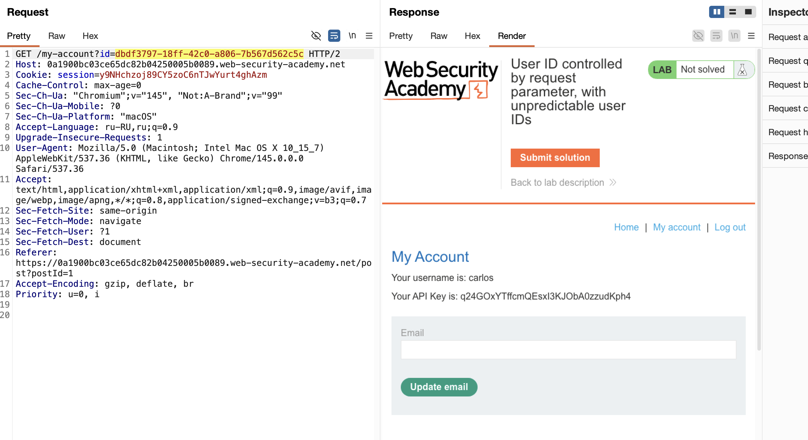

приложение может использовать глобально уникальные идентификаторы (GUID) для идентификации пользователей

GUID, принадлежащие другим пользователям, могут быть раскрыты в других местах, где ссылаются пользователи, например, в сообщениях пользователей или отзывах


лаба https://portswigger.net/web-security/access-control/lab-user-id-controlled-by-request-parameter-with-unpredictable-user-ids

задание: найти GUID карлоса и потом украсть его API

---

вот так выглядит запрос к моей стр

```http
GET /my-account?id=9f3ad538-8418-4496-9692-18d6a4422814 HTTP/2
Host: 0a1900bc03ce65dc82b04250005b0089.web-security-academy.net
Cookie: session=y9NHchzoj89CY5zoC6nTJwYurt4ghAzm
Cache-Control: max-age=0
Accept-Language: ru-RU,ru;q=0.9
Upgrade-Insecure-Requests: 1
User-Agent: Mozilla/5.0 (Macintosh; Intel Mac OS X 10_15_7) AppleWebKit/537.36 (KHTML, like Gecko) Chrome/145.0.0.0 Safari/537.36
Accept: text/html,application/xhtml+xml,application/xml;q=0.9,image/avif,image/webp,image/apng,*/*;q=0.8,application/signed-exchange;v=b3;q=0.7
Sec-Fetch-Site: same-origin
Sec-Fetch-Mode: navigate
Sec-Fetch-User: ?1
Sec-Fetch-Dest: document
Sec-Ch-Ua: "Chromium";v="145", "Not:A-Brand";v="99"
Sec-Ch-Ua-Mobile: ?0
Sec-Ch-Ua-Platform: "macOS"
Referer: https://0a1900bc03ce65dc82b04250005b0089.web-security-academy.net/login
Accept-Encoding: gzip, deflate, br
Priority: u=0, i


```
 
ай-ди в виде  GUID   (просто так не подобрать!)
## id=9f3ad538-8418-4496-9692-18d6a4422814

заметил пост, автор поста как раз-таки карлос


иду в HTML
и вуаля, там указан id карлоса это GUID
Id=dbdf3797-18ff-42c0-a806-7b567d562c5c
```HTML
</h1>
                    <p><span id=blog-author><a href='/blogs?userId=dbdf3797-18ff-42c0-a806-7b567d562c5c'>carlos</a></span> | 01 February 2026</p>
                    <hr>
                    <p>
```


 GUID карлоса 36 символов
dbdf3797-18ff-42c0-a806-7b567d562c5c

мой GUID тоже 36 символов
9f3ad538-8418-4496-9692-18d6a4422814


-----


теперь  нужно стащить его АПИ ключ

вот так выглядит мой апи ключ 
Your username is: wiener

Your API Key is: L7uOsJNpHmmukNCKSb5weWq3KjitfX1l

----

нужно попасть на страницу карлоса значит

подставил в запрос GET /my-account?id=полученный карлоса id



и получилось попасть в акк карлоса

в ответе вижу api  q24GOxYTffcmQEsxI3KJObA0zzudKph4
```html
</p>
<div>Your API Key is: q24GOxYTffcmQEsxI3KJObA0zzudKph4</div><br/>
                        <form cl
```

лаба решена!

-----
#### вывод:

лаба показала, что использование неугадываемых идентификаторов (GUID) само по себе не защищает от горизонтальной эскалации привилегий

хакер не угадывает GUID, а находит его в другом месте приложения

здесь GUID карлоса был раскрыт в HTML-коде блога, в ссылке на его посты (аналог - в комментах или в смс) 

защита через «секретные» идентификаторы работает только до тех пор, пока они действительно остаются секретными

как только GUID просочился в публичную часть (блог, комментарии, сообщения), вся защита рушится. 

сервер, в свою очередь, как слепой котенок доверяет переданному GUID и не проверяет права доступа, что и позволило просто подставить найденное значение в параметр id и получить чужие данные

#### защита от такого:  

никогда не полагаться только на сложность или неугадываемость идентификаторов (мобилку можно джейлбрейкнуть например)

доступ к ресурсам должен проверяться на уровне авторизации: сервер обязан убедиться, что текущий пользователь имеет право видеть запрашиваемые данные

GUID или другие идентификаторы не должны раскрываться в публичных местах без необходимости

если идентификатор пользователя всё же используется в ссылках (например, в блогах), доступ к странице профиля по этому идентификатору должен быть закрыт для всех, кроме владельца и администраторов

нельзя допускать ситуацию, когда знание чужого GUID автоматически даёт доступ к аккаунту

контроль доступа должен быть реализован на бэкенде независимо от того, насколько случайным кажется идентификатор

