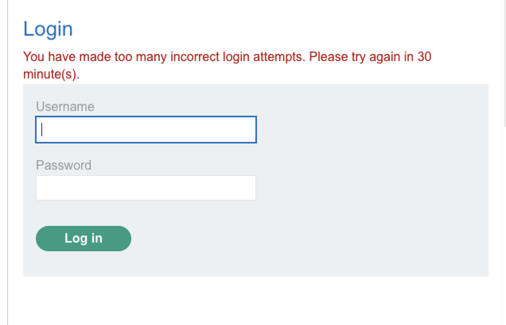
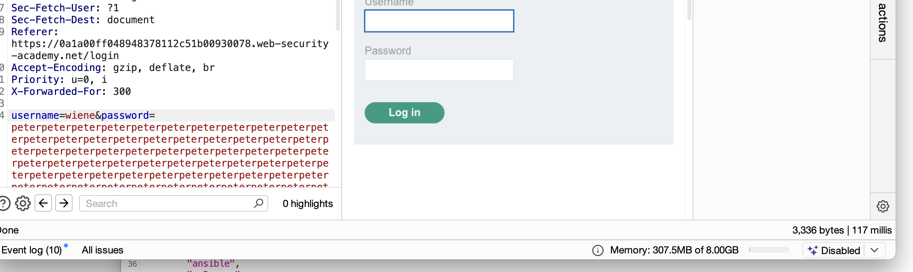
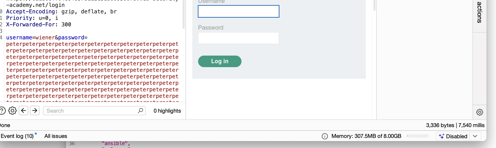
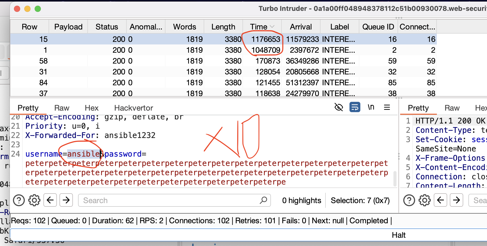

# Username enumeration via response timing

# ограничение числа попыток!

пробовал менять куки - помогло
менял ip - сработало но нужно менять ip часто чтобы это решить!

но сама лаба дала подсказку что можно менять заголовки post - get что позволяет иногда обходить данные блокировки по ip

post -> get поменял и сайт больше не блокирует меня
запустил интрудер турбо

так как лаба называется уязвивость перебора через время ответа
username=apps&password=amanda
apps дольше всех выполняется 
и связвка username=apps&password=amanda тоже дольше всех

но пароль не верный!

==я не знал фундаментальных правил!==

# в пост запросах параметры передаются в теле (внизу после куки)

# в гет запросах параметры передаются в URL

*Ваш исходный запрос был **POST**:

text

POST /login HTTP/2
Host: example.com
Content-Type: application/x-www-form-urlencoded
Content-Length: 30

username=carlos&password=123456  <- Данные ЗДЕСЬ, в теле (body)

*Чтобы превратить его в **GET**, вы должны **переместить параметры из тела в URL**:

text

GET /login?username=carlos&password=123456 HTTP/2  <- Данные ЗДЕСЬ, в URL
Host: example.com
(тело запроса становится пустым, Content-Length: 0)

---------------
-------------
----------
GET /login?username=wiener&password=peter HTTP/2 
не сработало - нет разницы в ответе!
GET /login?username=мцукам3&password=мк34м3 HTTP/2

--------
X-Forwarded-For: 1.1.1.1
добавил  -  этот заголовок и сработало, подсмотрел первую подсказку, так как я сам не знад что так можно делать вообще в принципи!

теперь нужно просто менять X-Forwarded-For: 1.1.1.1 при каждом запросе

идея можно в пейлоад пихнуть нормальные запросы через раз с проверочными

==ВОТ В ЧЕМ ПРИКОЛ==

когда подставляю сузествующий ник - и очень длинный пароль - то ответ 7500
но когда подставляю непонятный ник - и очень длинный пароль - то ответ 117 так как сервер сперва провреряет сузествет ли юзер такой и только потом подбирает пароль!

использую это

обнаружил что длинный ответ я получаю на пользоватлей 
ansible  - значит тоже существует!
и
wiener   - мой реальный аккаунт

теперь использую обман по ip подберу пароль!

подбирая пароли заметил что jordan вернул 302 статус

значит ansible и jordan 

==выполнено!==

# суть!
1)
берем правильные логин и пароль - смотрим ответ
берем правильный логин и оч длинный пароль - смотрим время 
берем НЕ-правильный логин и оч длинный пароль - смотрим время овета

видно что время при правильном логине - больше - значит логин сузествует(значит идет подбор длинного пароля к существующему логину)

2)
обход блока IP путем 
добавления параметра
X-Forwarded-For: jordan1232
в конце запроса перед параетрами!

# УСТРАНЕНИЕ ПРОБЛЕМЫ