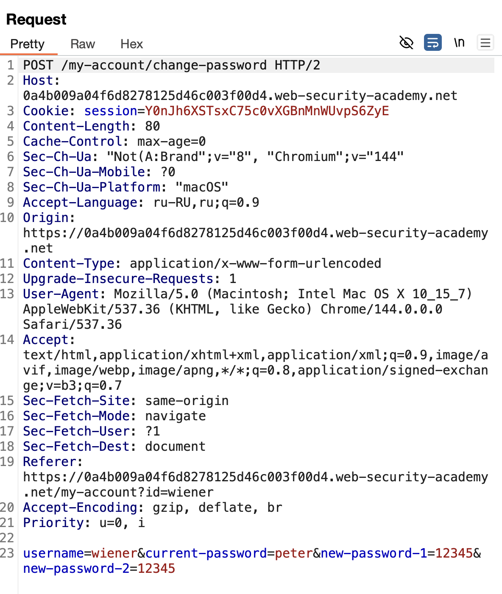
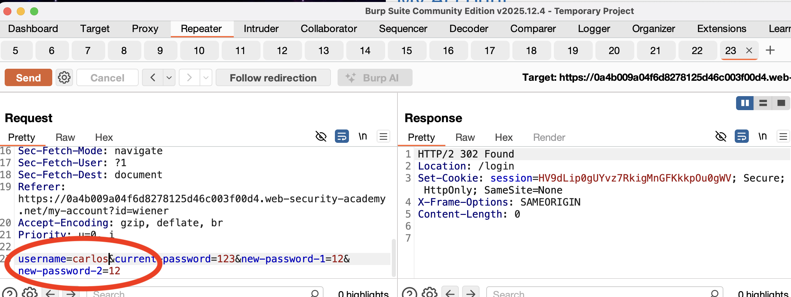

лаба https://portswigger.net/web-security/authentication/other-mechanisms/lab-password-brute-force-via-password-change
# подбор паролей грубой силой через функциональность смены паролей!

- Ваши учетные данные:`wiener:peter`
- Имя пользователя жертвы:`carlos`
- -----

это запрос на смену пароля внутри аакаунта уже
где нужно ввести текущий логин + новый пароль дважды

---
заметил что если подбирать пароли при входе в аккаунт - то ожидание после 1й неудачной попытки = 1 минута

но если менять пароль внутри аакаунта то нет блока по колличеству попыток сменить пароль, но если менять ник - то ошибка приходит так как видимо сервер сравнивает ник и куки для этого ника!!

но и токен живет долго наверно, пока не проваливался!

заметил , что если в поле ника подствить карлоса - тогда ответ будет 302 - а для остальных ников сложных ответ 200 и "некорректн парроль" - значит тут можно так искать ники по ответу сервера!
но и еще нет блока по перебору паролей!

значит можно очень банально перебрать все пароли через турбоинтрудер!

перебрал пароли, но ответ нигде не поменялся!
везде одинаковый ответ 302, может истек токен?

проверил с новым токеном быстро, разницы нет!

при смене пароля ответ 200 должен быть!

пробовать менять токены разными способами, но результат не меняется, такое ощущение будто токен живет сколько то времени, но оришбки о просроченном токене не приходят! по прежнему ответ 302

я попробовал поменять пароль с известными данными, но не получилось и ответ также 302: значит - токен не вечный - но нам это не показывает!

возможно - нужно подставлять новый токен

когда все не так: то ошибка появляется Set-Cookie: session=KMPX0iZkd7EbY0laygn1t7erb0ulP7DO; Secure; HttpOnly; SameSite=None В ОТВЕТЕ.

заметил что пароль нельзя поменять даже если данные подставленны верно, попыток не много было + выкидывает с аккаунта, и ошибка токена появляется, значит нужно каждый раз наверно перезаходить на страницу и получать новые куки!

-----
итак:
если пароль неверный - выбрасывает (1 попытка)
то есть нужен новый токен под каждый новый запрос

но если пароль верный но не совпадают новые пароли - то не выбрасывает! а ошибка "New passwords do not match"

а! даже так что если вводить неверный пароль но не совпадают новые пароли то не вылетает и ответ "Current password is incorrect"

скприпт с перезаходом не нужен значит!
просто нужно в пейлоаде специально сделать чтобы оба новых пар не совпадали!

# получилось!!!!! ура!
nicole - пароль карлоса!

нужно было украсть пароль карлоса
просто перебор грубо - невозможен-т.к после неверного ввода - блок на 1 мин

но внутри аккаунта, в логике смены пароля, можно было подставлять нужный ник+нужный пейлоад+новый пароль и подтверждение пароля!

 благодаря логической ошибке в на экране смены пароля, при несовпадающих новых паролях и правильном пароле не выкидывало из приложения на перелогин - за счёт этого можно было построить свою атаку путём перебором грубой силой всех паролей. А когда пароль совпадали то появлялось сообщение что для данного текущего аккаунта новый два пароля не совпадают. Что мне сразу сказала о том что мы нашли пароль для данного аккаунта.

# как заметить уязвимость:
просто нужно потестить все варианты работы механимов смены пароля и заметить странные поведения - которые можно как-либо использовать, например, для бутфорс