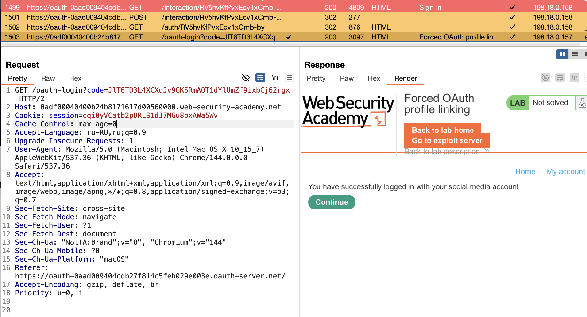
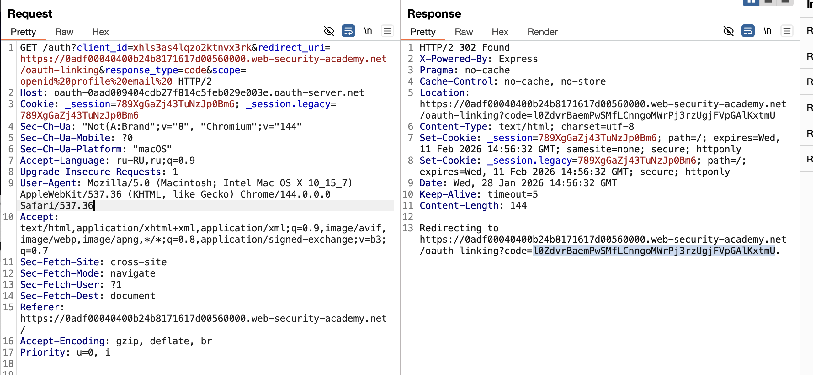
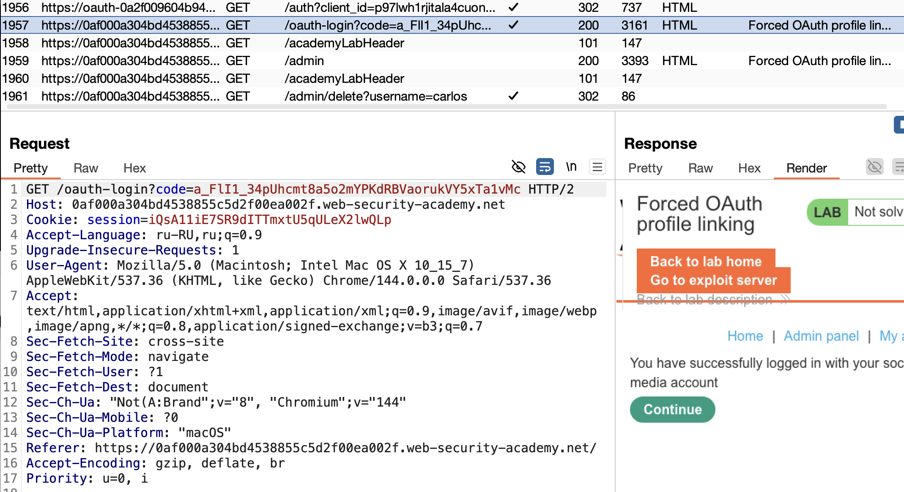

# CSRF+OAuth атака!

теория по oauth 2.0 - в предыдущей лабе

доп теория:
в виду сложности использования механизмов OAuth и множества меняющихся частей в процессе логики OAuth - есть бОльшая вероятность возникновения ошибок в этом процессе!

также если приложение хочет сохранять авторизацию пользователя после закрытия приложения/сайта - то нужно где-то хранить токен доступа и id user, часто может храниться на сервере и отправляться на сервер в незашифрованном виде - что позволяет перехватить запрос! или если хранится на устройстве - то есть риск декомпиляци данных.

---
#### Несовершенная защита CSRF

Хотя многие компоненты потоков OAuth являются необязательными, некоторые из них настоятельно рекомендуются, если только нет важной причины не использовать их. Одним из таких примеров является параметр `state`.

#### 1. Запрос авторизации (из лабы предыдущей)
например 
```http
GET /authorization?client_id=12345&redirect_uri=https://client-app.com/callback&response_type=code&scope=openid%20profile&state=ae13d489bd00e3c24 HTTP/1.1 Host: oauth-authorization-server.com

client_id - создается при регистр клиента в OAuth
redirect_uri - url куда направл юзера после получ кода OAuth
response_type - тип котор ожидает клиент приложениие(code->OAuth)
scope - то какие данные хотим получить

state - токен для общения в процессе сеанса
```

то есть state токен - это может быть какой-то хеш чего-либо, что трудно угадать. который генерирует и сервер и клиент, и тогда при каждом клиент-серверном взаимодействии должно передаваться и проверяться это индивидуальное для юзера state значение, и если state отсутствует - то велика вероятность подделки запросов (как в предудызей лабе).
также можно привязать чужую четку к своему акку

---
лаба  
# CSRF + OAuth
🔶🔶🔶🔶🔶🔶🔶🔶🔶🔶🔶🔶🔶🔶🔶🔶🔶🔶🔶🔶🔶🔶🔶🔶🔶🔶🔶🔶🔶
# Лаборатория: Принудительная привязки профиля OAuth
https://portswigger.net/web-security/oauth/lab-oauth-forced-oauth-profile-linking

мои учетки
-   
    Аккаунт на сайте блога:`wiener:peter`
- Профиль в социальных сетях:`peter.wiener:hotdog`

нужно войти в свою учетку в соц сети и как-то прикрепить к ней чужую учетку (учетку администратора) или получить права администратора на сайте.
потом взаимодейтствовать с учеткой админа и удалить юзера карлос


administrator

нужно получить client_id
потом создать код 
потом войти через код - но как получить client_id ника administrator?

я смог найти несколько мест где можно было бы


этот запрос выполняет привязку текущего аакаунта к моей соц сети



а этот позволяет генерировать постоянно коды валидные

(решить сам лабу не смог) но не удивительно - так как я впервые сталкиваюсь с такой концепцией:

в этой лабе нужно сделать так чтобы заставить сервер администратора сделать так что его браузер сделал запрос такой как на первом скрине
GET /oauth-login?code=JlT6TD3L4XCXqJv9GKSRmAOT1dYlUmZf9ixbCj62rgx HTTP/2
Host: 0adf00040400b24b8171617d00560000.web-security-academy.net        
и тогда система привяжет автоматически его аккаут (к моему коду - к моей соц сети) -  JlT6TD3L4XCXqJv9GKSRmAOT1dYlUmZf9ixbCj62rgx
и я получу доступ к админ аккаунту

это сложно конечно придумать ,, особенно не ясно, как я должен отправить в браузер админа мою вредоносную ссылку!!! как!? почему в лабе ничего не сказано про это вообще?

-----
# *
Эта лаборатория с подвохом — она **имитирует реальность, где у вас уже есть способ доставить вредоносную страницу жертве** (администратору). Ваша задача — не придумать _как_ её доставить, а **понять, что именно нужно доставить и почему это сработает**.

 единственная цель в этой лаборатории

Заставить браузер администратора **автоматически отправить один конкретный HTTP-запрос** к сайту блога. Этот запрос:  
==GET /oauth-linking?code=ВАШ_УКРАДЕННЫЙ_КОД==

Сайт блога, получив этот запрос **с сессией администратора**, выполнит команду: "Привязать соцпрофиль, соответствующий этому ==code==, к текущему пользователю (администратору)".
# *
---

вот тот запрос который я перехватил до того как он свяжет мою соц сеть (так как код в запросе связан с соц сетью) с аккаунтом на сайте!

------
# как понять что есть уязвимость?
GET /oauth-login?code=a_FlI1_34pUhcmt8a5o2mYPKdRBVaorukVY5xTa1vMc HTTP/2
==нет парметра STATE ! в запросе выше== а значит нет привязки к конкретному юзеру!

------


♻️♻️♻️♻️♻️♻️♻️♻️♻️♻️♻️♻️♻️♻️♻️♻️♻️
# ВЫВОД

То есть я понял теперь на практике что если существует доступ к местам или страницам жертвы, это может быть в том числе и комментарии на его форуме с XSS уязвимостью или если отправить лично админу письмо с этой ссылкой и чтобы админ нажал на нее, или чтобы ссылка ссама запустилась... и тогда! тогда сработает этот метод который перепривяжет его админ аккаунт сайта к моей соц сети! и я получу доступ к его админ акку.. но если все таки тут нужно чтобы сам админ нажал на ссылку.. в браузере своем, то он скорее всего быстро заметит чтобы произошел угон акка, и времени мало будет чтобы среагировать злоумышленнику, если вообще админ перейдет по ссылке этой... этого эксплойта ниже:

```html
<iframe src ="https://0af000a304bd4538855c5d2f00ea002f.web-security-academy.net/oauth-linking?code=a-nI4C2koAe75MXFpZjn13ZfmrDlG8pkoJvgSNM06Xm"></iframe>
```
*данный эксплойт выполнится автоматически в браузере жертвы при открытии страницы, при отбражении html.


получается, что я перехватил запрос к моему браузеру где уже выполнен вход в соц сеть, и не допустил чтобы этот запрос выполнился в моем браузере, и сделал так чтобы этот запрос выполнился в браузере админа (то есть тут допущение, что у нас есть место где мы можем быть уверены что именно админ перейдет по этой ссылке!) и догда сформированный запрос привязки профиля с спец токеном (токен привязан к моей соц сети) откроется в браузере администратора (или любого чувака)  и привяжет мой токен (мою соц сеть) к его аккаунту на сайте! и я получу к нему доступ!

самый сложный тут шаг - это доставить мой экспойт админу - и лаба этот шаг "взяла на себя".

==КЛЮЧЕВОЙ МОМЕНТ== - это то что данная система OAuth не проверяет  state токен (state - токен для общения в процессе сеанса) этот токен должен был четко связывать работу токена привязки аккаунта только с авторизованным пользователем который выпустил данный токен! иначе - можно с моим токеном привязать любую учетную запись к моей соц сети.

♻️♻️♻️♻️♻️♻️♻️♻️♻️♻️♻️♻️♻️♻️
### Теоретические способы доставки эксплойта
**Фишинг в корпоративной среде**
Отправка сотруднику письма от имени "IT-отдела" или "службы безопасности" с темой "Требуется верификация учётной записи" и ссылкой на ваш сервер. Ссылка ведёт на страницу, выглядящую как внутренний портал, но содержащую скрытый `iframe`.

**Компрометация доверенного внутреннего ресурса (самый опасный)**
Если в компании есть уязвимый внутренний сайт (тикет-система, вики, дашборд), на котором возможна XSS или HTML-инъекция, атакующий внедряет `<iframe>` прямо туда. Когда администратор открывает этот ресурс в ходе работы, эксплойт срабатывает автоматически в доверенном контексте.

**Подмена загружаемых ресурсов (атака на цепочку поставок)**
Если целевой сайт загружает внешние скрипты или виджеты (например, с CDN или аналитического сервиса), атакующий может взломать этот внешний источник и добавить в загружаемый код инструкцию на вставку вредоносного `iframe`. Ваш эксплойт сработает у всех посетителей, включая администратора.

**Опасная реклама (Malvertising)**
Размещение вредоносного рекламного баннера через рекламные сети. Если администратор посещает сайты, показывающие такую рекламу, скрипт внутри баннера может загрузить ваш `iframe`.

**Социальный инжиниринг через мессенджеры**
Отправка ссылки "для срочного просмотра" в рабочем чате (Slack, Teams), маскируя её под документ, график или новость, актуальную для работы администратора.

использовать белые списки адресов на которые сервер может отвечать!


