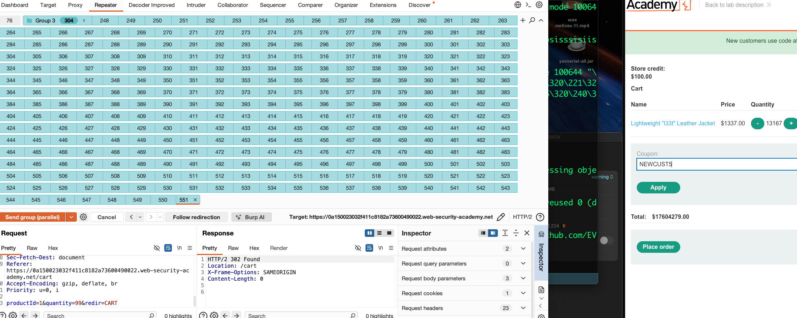
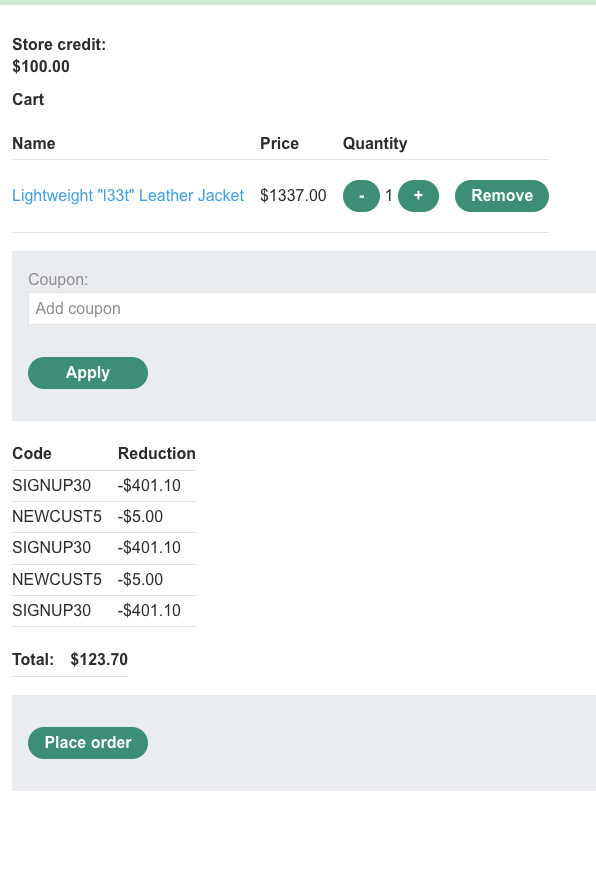

лаба https://portswigger.net/web-security/logic-flaws/examples/lab-logic-flaws-flawed-enforcement-of-business-rules

здесь ошибка в логике закупок
нужно купить кож куртку
и есть промокод на скидку NEWCUST5 на 5 баксов
счет 100 бачей
куртка стоит 1300 бачей

------

вот запрос который применяет промокод 

```http
POST /cart/coupon HTTP/2
Host: 0a150023032f411c8182a73600490022.web-security-academy.net
Cookie: session=bYyPoLj5paEQtFSBZiKgRQMQXUP7u59v
Content-Length: 53
Cache-Control: max-age=0
Sec-Ch-Ua: "Chromium";v="145", "Not:A-Brand";v="99"
Sec-Ch-Ua-Mobile: ?0
Sec-Ch-Ua-Platform: "macOS"
Accept-Language: ru-RU,ru;q=0.9
Origin: https://0a150023032f411c8182a73600490022.web-security-academy.net
Content-Type: application/x-www-form-urlencoded
Upgrade-Insecure-Requests: 1
User-Agent: Mozilla/5.0 (Macintosh; Intel Mac OS X 10_15_7) AppleWebKit/537.36 (KHTML, like Gecko) Chrome/145.0.0.0 Safari/537.36
Accept: text/html,application/xhtml+xml,application/xml;q=0.9,image/avif,image/webp,image/apng,*/*;q=0.8,application/signed-exchange;v=b3;q=0.7
Sec-Fetch-Site: same-origin
Sec-Fetch-Mode: navigate
Sec-Fetch-User: ?1
Sec-Fetch-Dest: document
Referer: https://0a150023032f411c8182a73600490022.web-security-academy.net/cart
Accept-Encoding: gzip, deflate, br
Priority: u=0, i

csrf=nMKMt3xFCfJ4yooFypzm4x8VBsXIwKWP&coupon=NEWCUST5
```

сумму купона поменять не вышло

одним запросом гонку данных множеством запросов не получилось создать

повторно использовать купон уже нельзя

при очистке корзины - промокод можно снова использовать
если я смогу очищать и снова применять промокод - то окей

без товаров получилось применить купон - но только один раз

данный запрос добавляет товар в корзину
```http
POST /cart HTTP/2
Host: 0a150023032f411c8182a73600490022.web-security-academy.net
Cookie: session=GWp195ITogRGprJYl9Fg839kqycxg59G
Content-Length: 36
Cache-Control: max-age=0
Sec-Ch-Ua: "Chromium";v="145", "Not:A-Brand";v="99"
Sec-Ch-Ua-Mobile: ?0
Sec-Ch-Ua-Platform: "macOS"
Accept-Language: ru-RU,ru;q=0.9
Origin: https://0a150023032f411c8182a73600490022.web-security-academy.net
Content-Type: application/x-www-form-urlencoded
Upgrade-Insecure-Requests: 1
User-Agent: Mozilla/5.0 (Macintosh; Intel Mac OS X 10_15_7) AppleWebKit/537.36 (KHTML, like Gecko) Chrome/145.0.0.0 Safari/537.36
Accept: text/html,application/xhtml+xml,application/xml;q=0.9,image/avif,image/webp,image/apng,*/*;q=0.8,application/signed-exchange;v=b3;q=0.7
Sec-Fetch-Site: same-origin
Sec-Fetch-Mode: navigate
Sec-Fetch-User: ?1
Sec-Fetch-Dest: document
Referer: https://0a150023032f411c8182a73600490022.web-security-academy.net/product?productId=1
Accept-Encoding: gzip, deflate, br
Priority: u=0, i

productId=1&redir=PRODUCT&quantity=1
```


отрицательное число товаров не получается сделать

можно за 1 раз не более 99 шт товаров добавить

отправил штук 200 запросов по 99 товаров в каждом - каждый товар это куртка за 1300 баксов
уже сумма в корзине на 8 лямов баксов

ничего подозрительного не вижу - кробе того что в корзине 7000 курток

вот еще запрос - который очищает корзину 
он почему-то не полностью очистил корзину
то есть удалил лишь 6000 товаров из почти 7000 товаров
и возможно счетчик купона сбросился !
```http
POST /cart HTTP/2
Host: 0a150023032f411c8182a73600490022.web-security-academy.net
Cookie: session=GWp195ITogRGprJYl9Fg839kqycxg59G
Content-Length: 37
Cache-Control: max-age=0
Sec-Ch-Ua: "Chromium";v="145", "Not:A-Brand";v="99"
Sec-Ch-Ua-Mobile: ?0
Sec-Ch-Ua-Platform: "macOS"
Accept-Language: ru-RU,ru;q=0.9
Origin: https://0a150023032f411c8182a73600490022.web-security-academy.net
Content-Type: application/x-www-form-urlencoded
Upgrade-Insecure-Requests: 1
User-Agent: Mozilla/5.0 (Macintosh; Intel Mac OS X 10_15_7) AppleWebKit/537.36 (KHTML, like Gecko) Chrome/145.0.0.0 Safari/537.36
Accept: text/html,application/xhtml+xml,application/xml;q=0.9,image/avif,image/webp,image/apng,*/*;q=0.8,application/signed-exchange;v=b3;q=0.7
Sec-Fetch-Site: same-origin
Sec-Fetch-Mode: navigate
Sec-Fetch-User: ?1
Sec-Fetch-Dest: document
Referer: https://0a150023032f411c8182a73600490022.web-security-academy.net/cart?err=INSUFFICIENT_FUNDS
Accept-Encoding: gzip, deflate, br
Priority: u=0, i

productId=1&quantity=-6534&redir=CART
```
этот запрос ничего интересного не сделал
в минус уйти нельзя

----

пробую добавить кучу товаров 6000+ и очистить корзину
и повторно применить промокод

вот таким запросом одномоментно добавил 13к курток 



короче , мой трюк не сработал - но я заметил - что я могу обнулять число товаров в корзине путем переполнения ее...

максимум получается примерно 15 000 товаров добавить курток по 1300 и цена обнуляется, как будто в памяти происходит переполнение числа
но при этом сбрасывается и скидка тоже..

этот же трюк в минус пробую сделать

тоже ничего интересного


---

есть только факт - что корзина на каком-то моменте обнуляется и заполняется заного - и при этом происходит и обнулении и промокода и числа товаров

-------

внизу страницы в футере нашел еще один промокод SIGNUP30

этот промокод уже дал большую скидку прям! 30% где-то
если его несколько раз применить - то будет кайф


---

елы-палы..

все было так просто - а я перелопатил кучу вариантов!!

## я просто начал по очереди применять промокоды!
видимо код проверял неправильно наличие промокода!
и можно было друг за другом их применять и соответвенно применять кучу скидок



в итоге я купил куртку эту за 0 баксов ( применив еще парочку кодов - и математика упала в этом приложении )

-------

вывод

здесь много чего работало как надо с точки зрения безопасности 
но вот проверка промокода - тоже была правильной 
но разработчики не учли случай - если применять несколько промокодов

на деле, думаю, этот косяк должны были бы найти при тестировании
ну а если в продакт такое запустить - то магаз мог бы и деньги потерять!


