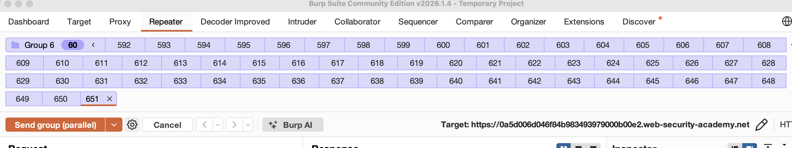
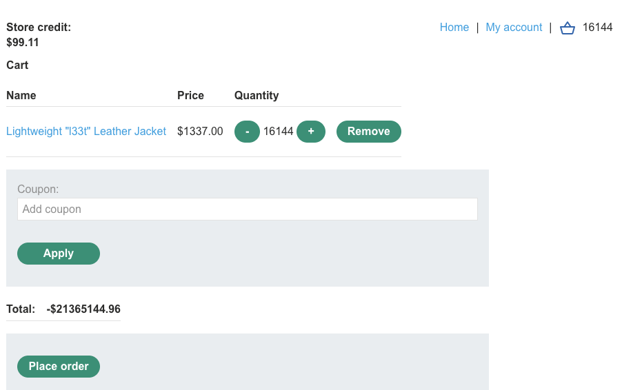
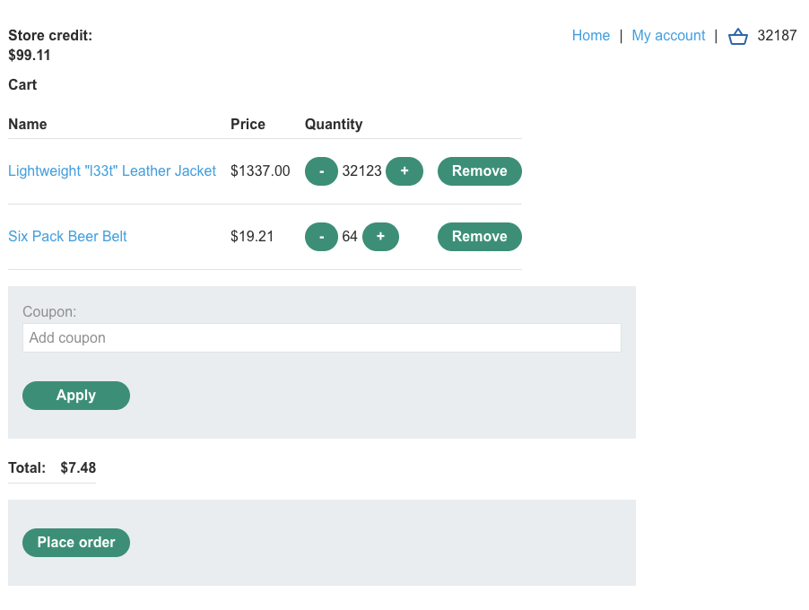

лаба https://portswigger.net/web-security/logic-flaws/examples/lab-logic-flaws-low-level
#### Low-level logic flaw
логической ошибкой в процессе закупок
цель - купите "Легкую кожаную куртку l33t"

-----

в отриц баланс - просто отправляя запросы - не получается

паралельным запросом - тоже не удалось уйти в минус товаров

есть поле промокода - но сам промокод я не нашел

купил дешев товар - думал - может дадут промокод - но не дали

попробую одновременно купить чайный пакетик - и сразу же добавить в корзуну куртку (может система проверит что денег на чай хватает и одобрит транзакцию но потом я добавлю быстро куртку и она останется в корзине?)

не сработало (гонки данных нет)

пробую добавить дохрена шт товаров в корзину вот так

но все сиснет сервер не отвечат вообще...
берп не работает... вообще... никакие запросы не рабоатают
перезапускаю - заработало

уже 15к товаров добавил на 20 лямов 

после 16к товаров в корзине цена пошла в отрицат сторону!

но купить нельзя - так как Cart total price cannot be less than zero

поэтому я теперь немного вычту товаров чтобы уровнять ценю в районе +1 - +110 долларов

нет, я заметил, что дальнейшее прибавление числа - как раз таки прибавляется к отрицательному числу и сумма уменьшается - осталось лишь доприбавлять так чтобы цена в плюс норм вышла, если что - могу недорогим товаром потом корректировать это дело

---

вот так выровнял цену и купил 32 тысячи курток по цене 7 долларов 
я конечно сомневаюсь, что юридически такая покупка - станет законной )
но суеты и проблем может добавить

-----

#### вывод

не была реализована функция которая бы при стоимости корзины ниже ноля - обнуляла бы вообще все - и товары в ноль и промокоды в ноль
