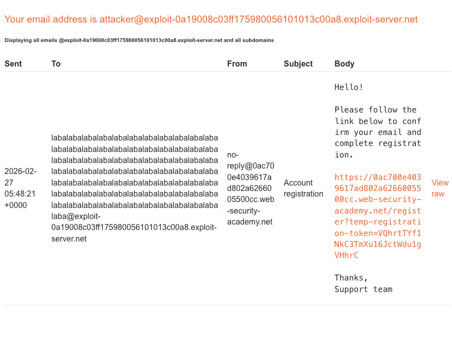
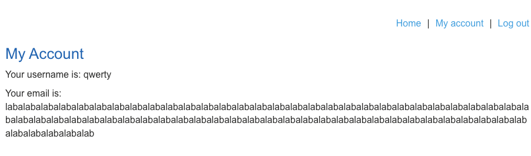
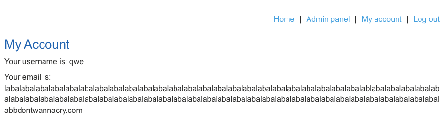

лаба  https://portswigger.net/web-security/logic-flaws/examples/lab-logic-flaws-inconsistent-handling-of-exceptional-input

здесь есть логическая ошибка в регистрации учетки - которая позволяет 
попасть в аккаунт админа

задание: попасть в аккаунт админа и удалить карлоса там

подсказка @YOUR-EMAIL-ID.web-security-academy.net

и в лабе есть мой адресс на который нужно зарегать но ак
attacker@exploit-0a0500d304d5b1dd80b32ae3019e0026.exploit-server.net

--------

зарегать любой почт адрес тут не получается так как это корпоративная страница
и предупреждение
If you work for DontWannaCry, please use your @dontwannacry.com email address


попробовал создать ак с ником administrator
ответ An account already exists with that username

зарегался
ну обычная регистраци и обычный акк


-----

не получается ничего

-------

смотрю решение частично (решение связано с числом 256 символов)

-------

не зря подсмотрел решение, так как это вроде и простой кейс - но догадаться до него просто так... нереально (наверно)

----


пробую решить и понять все сам, 

тут можно зарегаться как обычный чел 
и как админ

чтобы получить аккаунт как админ - нужно использовать их почту которая кончается на @dontwannacry.com

но если такой адресс указать - то на него письмо и уйдет

мне же нужно - чтобы письмо уехало на мой адресс

------

я беру адресс свой адресс @exploit-0a19008c03ff175980056101013c00a8.exploit-server.net

и создаю вот такой емайл
```
labalabalabalabalabalabalabalabalabalabalabalabalabalabalabalabalabalabalabalabalabalabalabalabalabalabalabalabalabalabalabalabalabalabalabalabalabalabalabalabalabalabalabalabalabalabalabalabalabalabalabalabalabalabalabalabalabalabalabalabalabalabalabalabalabalabalabalabalabalabalabalabalabalabalabalabalabalaba@exploit-0a19008c03ff175980056101013c00a8.exploit-server.net
```

и как бы странно
но получилось зарегаться
хотя мой почтовый адресс - который дан в лабе 
он вот такой 
` attacker@exploit-0a19008c03ff175980056101013c00a8.exploit-server.net`

а я использовал только его часть `@exploit-0a19008c03ff175980056101013c00a8.exploit-server.net``

и письмо пришло на адресс 
` attacker@exploit-0a19008c03ff175980056101013c00a8.exploit-server.net`

что является полным бредом! 
то есть лаба специально это допустила
но в реальной жизни - какой адресс я бы там указал - туда бы пиьсмо и пришло бы

( буду считать - что имеется ввиду - что я могу в майл.ру создать адресс длинной 300 символов  )- ? да я сильно сомневаюсь.
какой-то бред.



я зашел на свой акк и вижу тут 


то есть здесь мой адресс обрезался и не видно оконцовку адреса

-------
подсчитал число сиволов - ровно 255 символов
то есть 256 + символы здесь не видны уже

printf "labalabalabalabalabalabalabalabalabalabalabalabalabalabalabalabalabalabalabalabalabalabalabalabalabalabalabalabalabalabalabalabalabalabalabalabalabalabalabalabalabalabalabalabalabalabalabalabalabalabalabalabalabalabalabalabalabalabalabalabalabalabalabalab" | wc -m


логика, видимо в том, что можно прописать под конец адресс корпоративный, и в конце прописать свой валидный адресс 

и зарегать аккаунт на свою почту, но в аккаунте будет отображаться корпоративный адресс

то есть сервер обрезает email и присылает в клиент обрезанный адресс

и что больше всего меня удивляет 
что, видимо сам браузер уже решает - кому дать доступ к админке - а кому нет
на основе ответа от сервера

то есть можно перехватить ответ - и вернуть ответ в браузер уже с нужным email ?


-------

printf "labalabalabalabalabalabalabalabalabalabalabalabalabalabalabalabalabalabalabalabalabalabalabalabalablabalabalabalabalabalabalabalabalabalabalabalabalabalabalabalabalabalabalabalabalabalabalabalabalabalabalabalabalabalabalabalabalabalabalab@dontwannacry.com" | wc -m

вот 255 с оконцовкой на корпоративный адресс

вот мой почт адресс (который почему - то без начала - но работает, че за ерунда...)
@exploit-0a19008c03ff175980056101013c00a8.exploit-server.net


вот создал пейлоад рабочий
он должен отображаться в клиенте как корпоративный
а на сервре будет как мой
письмо должно приехать мне

labalabalabalabalabalabalabalabalabalabalabalabalabalabalabalabalabalabalabalabalabalabalabalabalablabalabalabalabalabalabalabalabalabalabalabalabalabalabalabalabalabalabalabalabalabalabalabalabalabalabalabalabalabalabalabalabalabalabalabbdontwannacry.com.@exploit-0a19008c03ff175980056101013c00a8.exploit-server.net

----

регаюсь с таким адрессом

labalabalabalabalabalabalabalabalabalabalabalabalabalabalabalabalabalabalabalabalabalabalabalabalablabalabalabalabalabalabalabalabalabalabalabalabalabalabalabalabalabalabalabalabalabalabalabalabalabalabalabalabalabalabalabalabalabalabalabbdontwannacry.com.@exploit-0a19008c03ff175980056101013c00a8.exploit-server.net

письмо мне пришло

вошел в акк и там админ панель



удалил карлоса
лаба решена

-------

но мне не ясны следующие вещи:

1) как там получается что могу получить письмо на свой емайл регистрирую

   любая-фигня-тут@exploit-0a19008c03ff175980056101013c00a8.exploit-server.net

- это такое упрощение лабы, в реальности, просто через точку указать можно будет свой ящик  

## как удалось определить намек на уязвимость?

1)  сайт позволял подставлять любой длинны email
2)  сервер обрезал email более 255 символов

это исторически сложившийся стандарт. в спецификациях email (rfc) написано, что доменная часть адреса может быть до 255 символов, а локальная (до @) — до 64 . но многие разработчики, когда проектируют базу данных, не заморачиваются и просто ставят `varchar(255)` для поля email


------

мои проекты визуально
https://empretradingsupport.tilda.ws

гит хаб
https://github.com/EV9EN1Y

hh
https://orenburg.hh.ru/resume/6024fd7eff0aec3f140039ed1f614a746d7250


