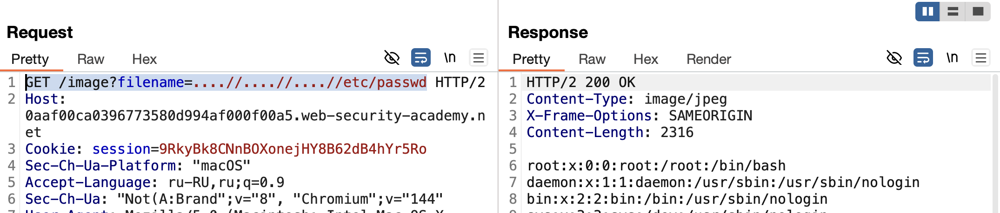

https://portswigger.net/web-security/file-path-traversal/lab-sequences-stripped-non-recursively

все тоже самое - что и в предыдущих лабах
просто менял пейлоады пытаясь получить доступ к etc/passwd

и предположил что может есть фильтрация ../
тогда есть сделать    ....//  то удалив от сюда ../ останется ../ 
магия )

==верный ответ!==
GET /image?filename=....//....//....//etc/passwd

хотел уже турбо интрудер подрубить, но резко сам нашел ответ! 

